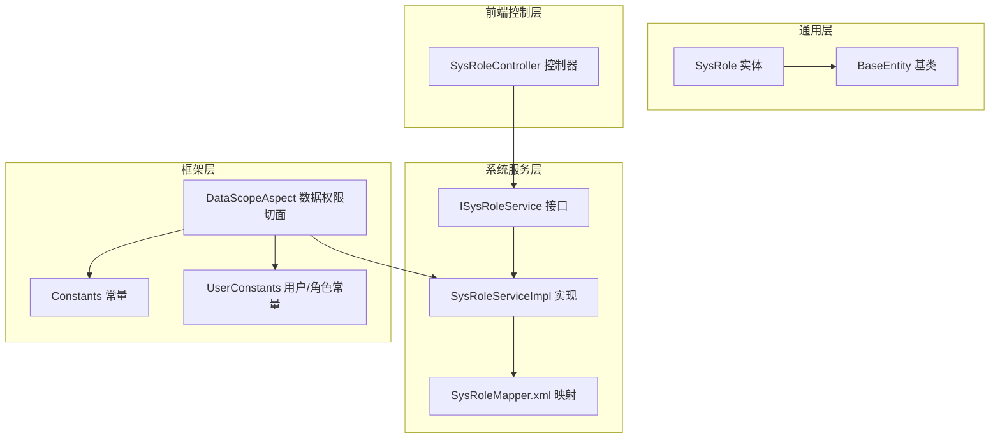
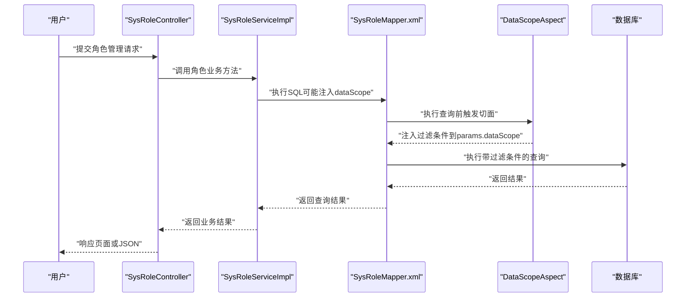
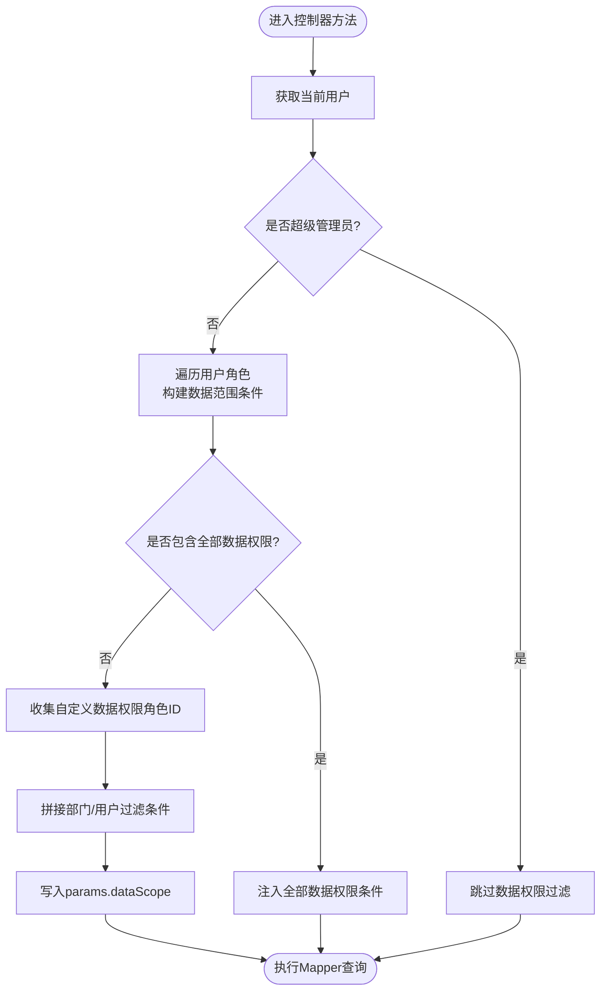
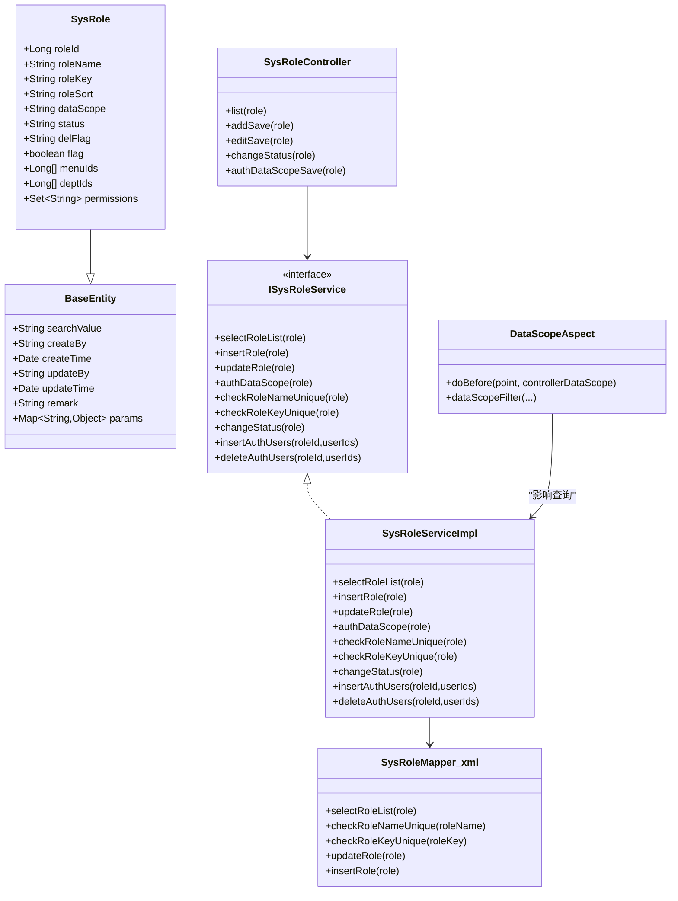

# 角色实体

<cite>
**本文引用的文件**
- [SysRole.java](file://ruoyi-common/src/main/java/com/ruoyi/common/core/domain/entity/SysRole.java)
- [BaseEntity.java](file://ruoyi-common/src/main/java/com/ruoyi/common/core/domain/BaseEntity.java)
- [SysRoleController.java](file://ruoyi-admin/src/main/java/com/ruoyi/web/controller/system/SysRoleController.java)
- [ISysRoleService.java](file://ruoyi-system/src/main/java/com/ruoyi/system/service/ISysRoleService.java)
- [SysRoleServiceImpl.java](file://ruoyi-system/src/main/java/com/ruoyi/system/service/impl/SysRoleServiceImpl.java)
- [SysRoleMapper.xml](file://ruoyi-system/src/main/resources/mapper/system/SysRoleMapper.xml)
- [DataScopeAspect.java](file://ruoyi-framework/src/main/java/com/ruoyi/framework/aspectj/DataScopeAspect.java)
- [Constants.java](file://ruoyi-common/src/main/java/com/ruoyi/common/constant/Constants.java)
- [UserConstants.java](file://ruoyi-common/src/main/java/com/ruoyi/common/constant/UserConstants.java)
- [SysRoleDept.java](file://ruoyi-system/src/main/java/com/ruoyi/system/domain/SysRoleDept.java)
- [SysUserRole.java](file://ruoyi-system/src/main/java/com/ruoyi/system/domain/SysUserRole.java)
- [ry_20260319.sql](file://sql/ry_20260319.sql)
</cite>

## 目录
1. [简介](#简介)
2. [项目结构](#项目结构)
3. [核心组件](#核心组件)
4. [架构总览](#架构总览)
5. [详细组件分析](#详细组件分析)
6. [依赖分析](#依赖分析)
7. [性能考虑](#性能考虑)
8. [故障排查指南](#故障排查指南)
9. [结论](#结论)
10. [附录](#附录)

## 简介
本文件聚焦于RuoYi系统中的角色实体设计与权限控制机制，围绕SysRole实体进行深入解析，涵盖：
- 角色标识字段（角色ID、角色编码）
- 角色信息字段（角色名称、角色排序、数据范围等）
- 状态管理字段（角色状态、删除标记）
- 权限范围控制机制（数据权限范围设置、角色状态管理、角色与用户的关联关系）
- 业务规则（角色编码唯一性、数据范围验证、角色状态控制等）
- 最佳实践与权限控制策略

## 项目结构
角色实体位于通用模块中，作为基础领域模型被系统各层复用；角色管理的前后端交互由Admin模块的控制器与模板负责；服务层提供角色业务能力；框架层通过切面实现数据权限过滤；MyBatis映射文件完成持久化操作。

图表来源
- [SysRole.java:16-212](file://ruoyi-common/src/main/java/com/ruoyi/common/core/domain/entity/SysRole.java#L16-L212)
- [BaseEntity.java:16-119](file://ruoyi-common/src/main/java/com/ruoyi/common/core/domain/BaseEntity.java#L16-L119)
- [ISysRoleService.java:13-167](file://ruoyi-system/src/main/java/com/ruoyi/system/service/ISysRoleService.java#L13-L167)
- [SysRoleServiceImpl.java:34-418](file://ruoyi-system/src/main/java/com/ruoyi/system/service/impl/SysRoleServiceImpl.java#L34-L418)
- [SysRoleMapper.xml:1-134](file://ruoyi-system/src/main/resources/mapper/system/SysRoleMapper.xml#L1-L134)
- [DataScopeAspect.java:27-159](file://ruoyi-framework/src/main/java/com/ruoyi/framework/aspectj/DataScopeAspect.java#L27-L159)
- [Constants.java:126-152](file://ruoyi-common/src/main/java/com/ruoyi/common/constant/Constants.java#L126-L152)
- [UserConstants.java:8-74](file://ruoyi-common/src/main/java/com/ruoyi/common/constant/UserConstants.java#L8-L74)
- [SysRoleController.java:38-354](file://ruoyi-admin/src/main/java/com/ruoyi/web/controller/system/SysRoleController.java#L38-L354)

章节来源
- [SysRole.java:16-212](file://ruoyi-common/src/main/java/com/ruoyi/common/core/domain/entity/SysRole.java#L16-L212)
- [SysRoleController.java:38-354](file://ruoyi-admin/src/main/java/com/ruoyi/web/controller/system/SysRoleController.java#L38-L354)

## 核心组件
- SysRole实体：承载角色标识、角色信息、状态与扩展字段，继承BaseEntity以获得通用审计字段与参数容器。
- ISysRoleService接口：定义角色业务契约，包括列表查询、新增/修改、删除、数据权限授权、唯一性校验、状态变更、用户授权等。
- SysRoleServiceImpl实现：提供具体业务逻辑，包括角色菜单/部门授权、唯一性校验、数据范围校验、状态变更、用户授权等。
- DataScopeAspect切面：在控制器方法执行前根据用户角色的数据范围动态拼接SQL过滤条件，实现数据权限控制。
- SysRoleMapper.xml：MyBatis映射，负责SysRole的CRUD与唯一性校验、按用户查询角色等SQL实现，并支持通过params.dataScope注入过滤条件。
- SysRoleController：角色管理的HTTP入口，负责权限校验、参数校验、调用服务层、返回结果与模板渲染。
- SysRoleDept/SysUserRole：角色与部门、角色与用户的中间表实体，用于维护数据权限与用户归属关系。

章节来源
- [SysRole.java:16-212](file://ruoyi-common/src/main/java/com/ruoyi/common/core/domain/entity/SysRole.java#L16-L212)
- [ISysRoleService.java:13-167](file://ruoyi-system/src/main/java/com/ruoyi/system/service/ISysRoleService.java#L13-L167)
- [SysRoleServiceImpl.java:34-418](file://ruoyi-system/src/main/java/com/ruoyi/system/service/impl/SysRoleServiceImpl.java#L34-L418)
- [DataScopeAspect.java:27-159](file://ruoyi-framework/src/main/java/com/ruoyi/framework/aspectj/DataScopeAspect.java#L27-L159)
- [SysRoleMapper.xml:1-134](file://ruoyi-system/src/main/resources/mapper/system/SysRoleMapper.xml#L1-L134)
- [SysRoleController.java:38-354](file://ruoyi-admin/src/main/java/com/ruoyi/web/controller/system/SysRoleController.java#L38-L354)
- [SysRoleDept.java:11-47](file://ruoyi-system/src/main/java/com/ruoyi/system/domain/SysRoleDept.java#L11-L47)
- [SysUserRole.java:11-47](file://ruoyi-system/src/main/java/com/ruoyi/system/domain/SysUserRole.java#L11-L47)

## 架构总览
角色实体贯穿“控制层-服务层-持久层-切面层”的完整链路，形成“权限+数据范围+用户关联”的闭环。

图表来源
- [SysRoleController.java:62-69](file://ruoyi-admin/src/main/java/com/ruoyi/web/controller/system/SysRoleController.java#L62-L69)
- [SysRoleServiceImpl.java:54-59](file://ruoyi-system/src/main/java/com/ruoyi/system/service/impl/SysRoleServiceImpl.java#L54-L59)
- [SysRoleMapper.xml:36-62](file://ruoyi-system/src/main/resources/mapper/system/SysRoleMapper.xml#L36-L62)
- [DataScopeAspect.java:34-54](file://ruoyi-framework/src/main/java/com/ruoyi/framework/aspectj/DataScopeAspect.java#L34-L54)

## 详细组件分析

### SysRole实体设计
- 继承关系：SysRole继承BaseEntity，复用搜索值、创建者、创建时间、更新者、更新时间、备注、请求参数容器等通用字段。
- 标识字段
  - 角色ID：主键，用于唯一标识角色。
  - 角色编码：roleKey，用于权限匹配与校验。
- 角色信息字段
  - 角色名称：长度与非空约束，用于展示与唯一性校验。
  - 角色排序：用于界面排序。
  - 数据范围：取值来自常量，决定数据权限范围。
- 状态与删除
  - 角色状态：0正常/1停用。
  - 删除标记：0存在/2删除（软删除）。
- 扩展字段
  - flag：用于标记用户是否拥有该角色。
  - menuIds/deptIds：用于授权时接收菜单/部门ID数组。
  - permissions：角色拥有的权限集合。
- 校验注解
  - 对角色名称、角色权限、显示顺序等字段施加非空与长度约束，确保输入合法性。

章节来源
- [SysRole.java:16-212](file://ruoyi-common/src/main/java/com/ruoyi/common/core/domain/entity/SysRole.java#L16-L212)
- [BaseEntity.java:16-119](file://ruoyi-common/src/main/java/com/ruoyi/common/core/domain/BaseEntity.java#L16-L119)

### 数据权限范围控制机制
- 数据范围枚举
  - 全部数据权限、自定义数据权限、本部门数据权限、本部门及以下数据权限、仅本人数据权限。
- 切面过滤流程
  - 在控制器方法执行前，切面根据当前用户的角色数据范围动态拼接SQL过滤条件。
  - 若用户为超级管理员则跳过过滤；否则按角色数据范围生成OR条件，支持多角色组合。
  - 将最终过滤条件写入BaseEntity.params.dataScope，供Mapper读取并注入SQL。
- SQL注入防护
  - 切面在注入前清空params.dataScope，避免历史残留导致的注入风险。

图表来源
- [DataScopeAspect.java:41-144](file://ruoyi-framework/src/main/java/com/ruoyi/framework/aspectj/DataScopeAspect.java#L41-L144)
- [Constants.java:126-152](file://ruoyi-common/src/main/java/com/ruoyi/common/constant/Constants.java#L126-L152)
- [UserConstants.java:24-28](file://ruoyi-common/src/main/java/com/ruoyi/common/constant/UserConstants.java#L24-L28)

章节来源
- [DataScopeAspect.java:27-159](file://ruoyi-framework/src/main/java/com/ruoyi/framework/aspectj/DataScopeAspect.java#L27-L159)
- [Constants.java:126-152](file://ruoyi-common/src/main/java/com/ruoyi/common/constant/Constants.java#L126-L152)
- [UserConstants.java:8-74](file://ruoyi-common/src/main/java/com/ruoyi/common/constant/UserConstants.java#L8-L74)

### 角色与用户的关联关系
- 中间表实体
  - SysUserRole：记录用户与角色的多对多关系。
  - SysRoleDept：记录角色与部门的多对多关系，用于自定义数据权限。
- 业务行为
  - 服务层提供批量授权/取消授权用户角色的方法。
  - 角色删除时会清理角色与菜单、角色与部门的关系，避免脏数据。

章节来源
- [SysUserRole.java:11-47](file://ruoyi-system/src/main/java/com/ruoyi/system/domain/SysUserRole.java#L11-L47)
- [SysRoleDept.java:11-47](file://ruoyi-system/src/main/java/com/ruoyi/system/domain/SysRoleDept.java#L11-L47)
- [SysRoleServiceImpl.java:137-173](file://ruoyi-system/src/main/java/com/ruoyi/system/service/impl/SysRoleServiceImpl.java#L137-L173)

### 业务规则与校验
- 角色名称唯一性：查询同名角色并排除自身ID，保证唯一。
- 角色权限唯一性：校验roleKey唯一，避免权限冲突。
- 角色状态控制：支持启用/停用，状态变更通过Mapper更新。
- 角色数据范围校验：非超级管理员不可越权访问或修改他人角色。
- 超级管理员保护：禁止对内置超级管理员角色进行操作。

章节来源
- [SysRoleServiceImpl.java:279-307](file://ruoyi-system/src/main/java/com/ruoyi/system/service/impl/SysRoleServiceImpl.java#L279-L307)
- [SysRoleServiceImpl.java:314-344](file://ruoyi-system/src/main/java/com/ruoyi/system/service/impl/SysRoleServiceImpl.java#L314-L344)
- [SysRoleServiceImpl.java:364-368](file://ruoyi-system/src/main/java/com/ruoyi/system/service/impl/SysRoleServiceImpl.java#L364-L368)
- [SysRoleController.java:136-149](file://ruoyi-admin/src/main/java/com/ruoyi/web/controller/system/SysRoleController.java#L136-L149)

### 控制器与服务交互
- 列表/导出/新增/修改/删除/状态变更/数据权限授权/用户授权等均通过SysRoleController暴露REST接口。
- 控制器在调用服务前进行权限注解校验与参数校验，确保安全与正确性。
- 服务层在事务边界内完成角色、菜单、部门、用户关联的增删改。

章节来源
- [SysRoleController.java:62-354](file://ruoyi-admin/src/main/java/com/ruoyi/web/controller/system/SysRoleController.java#L62-L354)
- [SysRoleServiceImpl.java:181-205](file://ruoyi-system/src/main/java/com/ruoyi/system/service/impl/SysRoleServiceImpl.java#L181-L205)
- [SysRoleServiceImpl.java:214-223](file://ruoyi-system/src/main/java/com/ruoyi/system/service/impl/SysRoleServiceImpl.java#L214-L223)

## 依赖分析
- SysRole依赖BaseEntity，继承其审计字段与参数容器。
- SysRoleServiceImpl依赖SysRoleMapper、SysRoleMenuMapper、SysUserRoleMapper、SysRoleDeptMapper，以及常量与工具类。
- DataScopeAspect依赖SysUser、SysRole、权限上下文与工具类，通过注解驱动在查询前注入过滤条件。
- SysRoleMapper.xml依赖SysRole实体映射，支持通过params.dataScope注入过滤条件。

图表来源
- [SysRole.java:16-212](file://ruoyi-common/src/main/java/com/ruoyi/common/core/domain/entity/SysRole.java#L16-L212)
- [BaseEntity.java:16-119](file://ruoyi-common/src/main/java/com/ruoyi/common/core/domain/BaseEntity.java#L16-L119)
- [SysRoleController.java:38-354](file://ruoyi-admin/src/main/java/com/ruoyi/web/controller/system/SysRoleController.java#L38-L354)
- [ISysRoleService.java:13-167](file://ruoyi-system/src/main/java/com/ruoyi/system/service/ISysRoleService.java#L13-L167)
- [SysRoleServiceImpl.java:34-418](file://ruoyi-system/src/main/java/com/ruoyi/system/service/impl/SysRoleServiceImpl.java#L34-L418)
- [SysRoleMapper.xml:1-134](file://ruoyi-system/src/main/resources/mapper/system/SysRoleMapper.xml#L1-L134)
- [DataScopeAspect.java:27-159](file://ruoyi-framework/src/main/java/com/ruoyi/framework/aspectj/DataScopeAspect.java#L27-L159)

章节来源
- [SysRole.java:16-212](file://ruoyi-common/src/main/java/com/ruoyi/common/core/domain/entity/SysRole.java#L16-L212)
- [SysRoleServiceImpl.java:34-418](file://ruoyi-system/src/main/java/com/ruoyi/system/service/impl/SysRoleServiceImpl.java#L34-L418)
- [DataScopeAspect.java:27-159](file://ruoyi-framework/src/main/java/com/ruoyi/framework/aspectj/DataScopeAspect.java#L27-L159)

## 性能考虑
- 数据权限过滤在查询前一次性拼接，避免多次重复计算。
- 自定义数据权限角色ID集合合并为IN子句，减少SQL片段拼接次数。
- 使用BaseEntity.params作为过滤条件载体，避免额外参数传递。
- 服务层在批量操作时采用事务边界，减少数据库往返。

[本节为通用建议，无需特定文件引用]

## 故障排查指南
- 角色唯一性冲突
  - 现象：新增/修改时报角色名称或角色权限已存在。
  - 排查：检查唯一性校验逻辑与数据库索引。
  - 参考
    - [SysRoleController.java:101-108](file://ruoyi-admin/src/main/java/com/ruoyi/web/controller/system/SysRoleController.java#L101-L108)
    - [SysRoleServiceImpl.java:279-307](file://ruoyi-system/src/main/java/com/ruoyi/system/service/impl/SysRoleServiceImpl.java#L279-L307)
- 超级管理员保护
  - 现象：尝试修改内置超级管理员角色。
  - 排查：检查checkRoleAllowed逻辑。
  - 参考
    - [SysRoleServiceImpl.java:314-321](file://ruoyi-system/src/main/java/com/ruoyi/system/service/impl/SysRoleServiceImpl.java#L314-L321)
- 数据权限越权
  - 现象：无法看到应有数据或报无权限访问。
  - 排查：确认角色数据范围设置、用户所属部门、切面过滤条件是否正确注入。
  - 参考
    - [DataScopeAspect.java:65-144](file://ruoyi-framework/src/main/java/com/ruoyi/framework/aspectj/DataScopeAspect.java#L65-L144)
    - [SysRoleMapper.xml:60-62](file://ruoyi-system/src/main/resources/mapper/system/SysRoleMapper.xml#L60-L62)
- 删除失败
  - 现象：提示角色已被使用，无法删除。
  - 排查：检查用户与角色关联计数。
  - 参考
    - [SysRoleServiceImpl.java:162-167](file://ruoyi-system/src/main/java/com/ruoyi/system/service/impl/SysRoleServiceImpl.java#L162-L167)

章节来源
- [SysRoleController.java:101-108](file://ruoyi-admin/src/main/java/com/ruoyi/web/controller/system/SysRoleController.java#L101-L108)
- [SysRoleServiceImpl.java:314-321](file://ruoyi-system/src/main/java/com/ruoyi/system/service/impl/SysRoleServiceImpl.java#L314-L321)
- [DataScopeAspect.java:65-144](file://ruoyi-framework/src/main/java/com/ruoyi/framework/aspectj/DataScopeAspect.java#L65-L144)
- [SysRoleMapper.xml:60-62](file://ruoyi-system/src/main/resources/mapper/system/SysRoleMapper.xml#L60-L62)
- [SysRoleServiceImpl.java:162-167](file://ruoyi-system/src/main/java/com/ruoyi/system/service/impl/SysRoleServiceImpl.java#L162-L167)

## 结论
SysRole实体通过清晰的字段设计与严格的业务校验，结合DataScopeAspect的动态数据权限过滤与ISysRoleService的完整业务能力，形成了“角色标识—角色信息—状态管理—权限范围—用户关联”的完整闭环。遵循本文最佳实践与权限控制策略，可有效保障角色管理的安全性与一致性。

[本节为总结，无需特定文件引用]

## 附录

### 字段说明与业务逻辑对照
- 角色ID（roleId）
  - 类型：Long
  - 用途：主键标识
  - 参考
    - [SysRole.java:22](file://ruoyi-common/src/main/java/com/ruoyi/common/core/domain/entity/SysRole.java#L22)
    - [SysRoleMapper.xml:8](file://ruoyi-system/src/main/resources/mapper/system/SysRoleMapper.xml#L8)
- 角色名称（roleName）
  - 长度限制与非空校验
  - 唯一性校验
  - 参考
    - [SysRole.java:101-109](file://ruoyi-common/src/main/java/com/ruoyi/common/core/domain/entity/SysRole.java#L101-L109)
    - [SysRoleServiceImpl.java:279-289](file://ruoyi-system/src/main/java/com/ruoyi/system/service/impl/SysRoleServiceImpl.java#L279-L289)
- 角色权限（roleKey）
  - 长度限制与非空校验
  - 唯一性校验
  - 参考
    - [SysRole.java:113-121](file://ruoyi-common/src/main/java/com/ruoyi/common/core/domain/entity/SysRole.java#L113-L121)
    - [SysRoleServiceImpl.java:297-307](file://ruoyi-system/src/main/java/com/ruoyi/system/service/impl/SysRoleServiceImpl.java#L297-L307)
- 角色排序（roleSort）
  - 非空校验
  - 参考
    - [SysRole.java:124-132](file://ruoyi-common/src/main/java/com/ruoyi/common/core/domain/entity/SysRole.java#L124-L132)
- 数据范围（dataScope）
  - 取值：1-5，对应不同数据权限范围
  - 参考
    - [SysRole.java:38](file://ruoyi-common/src/main/java/com/ruoyi/common/core/domain/entity/SysRole.java#L38)
    - [Constants.java:126-152](file://ruoyi-common/src/main/java/com/ruoyi/common/constant/Constants.java#L126-L152)
- 角色状态（status）
  - 取值：0正常/1停用
  - 参考
    - [SysRole.java:42](file://ruoyi-common/src/main/java/com/ruoyi/common/core/domain/entity/SysRole.java#L42)
    - [UserConstants.java:24-28](file://ruoyi-common/src/main/java/com/ruoyi/common/constant/UserConstants.java#L24-L28)
- 删除标记（delFlag）
  - 取值：0存在/2删除
  - 参考
    - [SysRole.java:45](file://ruoyi-common/src/main/java/com/ruoyi/common/core/domain/entity/SysRole.java#L45)
    - [ry_20260319.sql:113](file://sql/ry_20260319.sql#L113)
- 审计字段（继承自BaseEntity）
  - 参考
    - [BaseEntity.java:20-117](file://ruoyi-common/src/main/java/com/ruoyi/common/core/domain/BaseEntity.java#L20-L117)

### 数据库初始化参考
- 角色表初始化包含超级管理员与普通角色示例，状态均为正常。
- 参考
  - [ry_20260319.sql:125-126](file://sql/ry_20260319.sql#L125-L126)