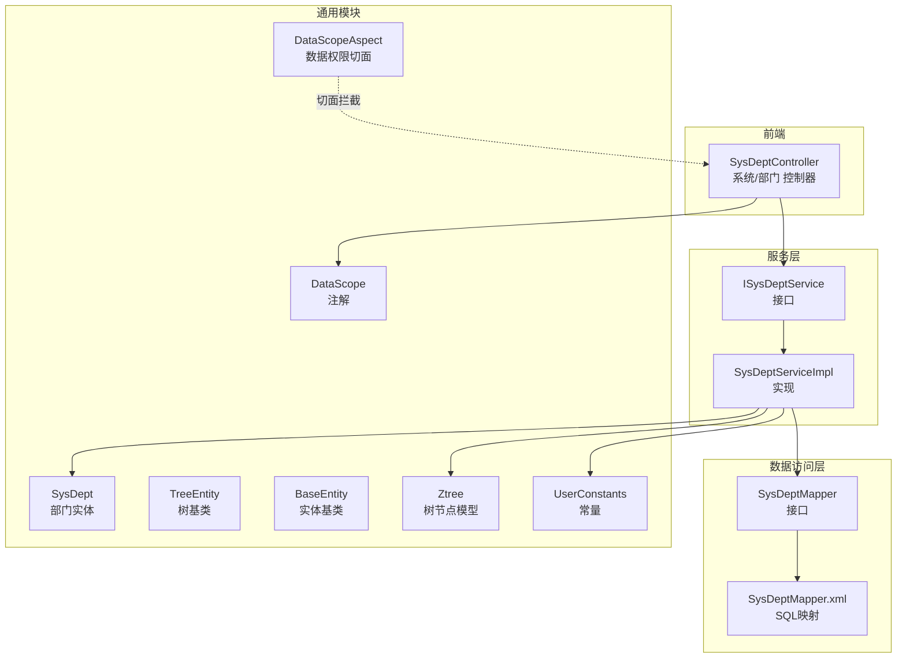
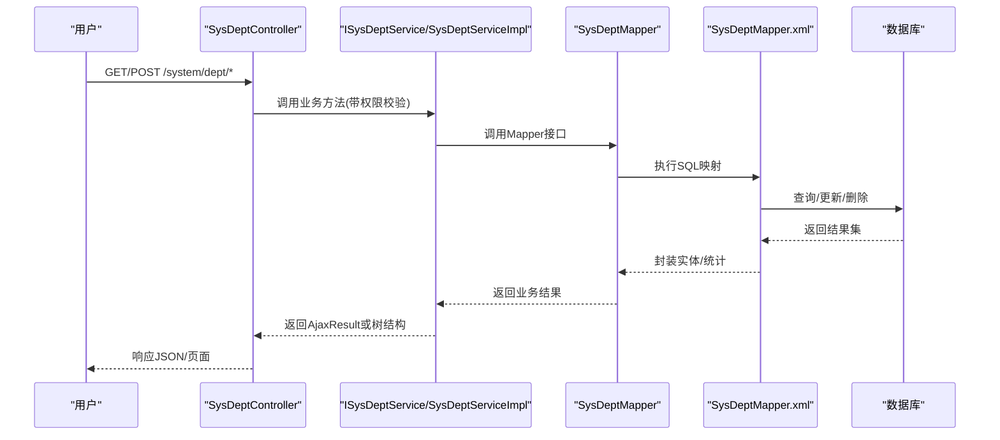
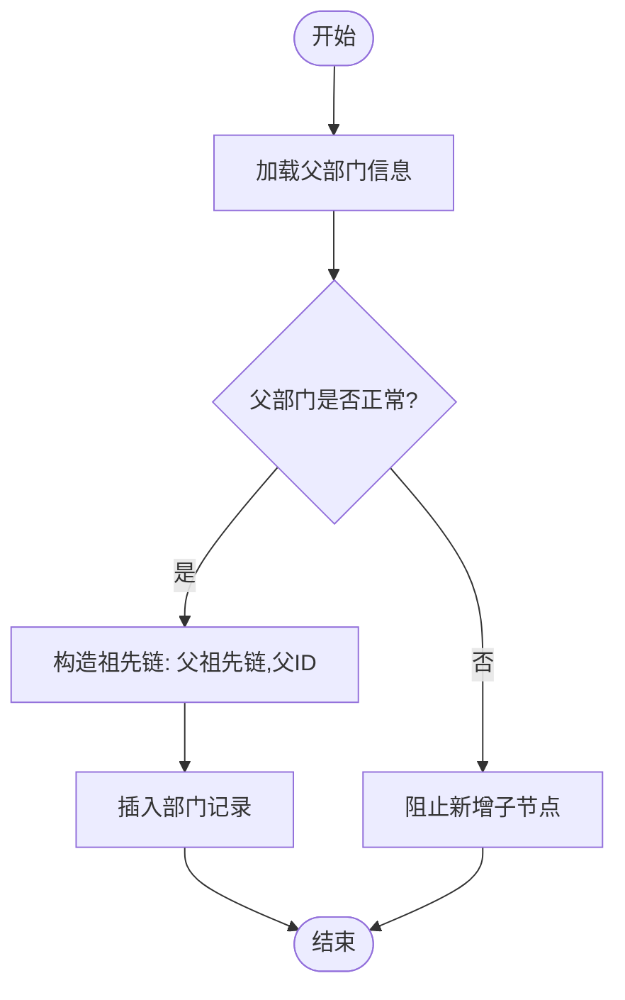
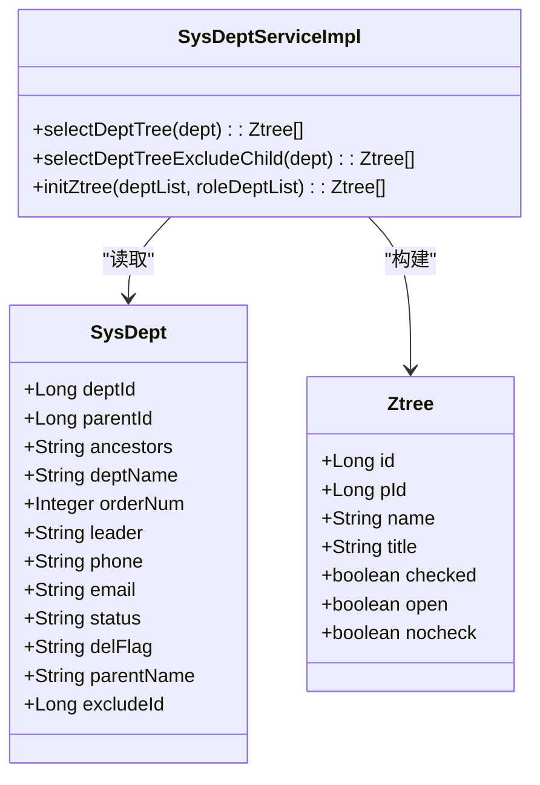
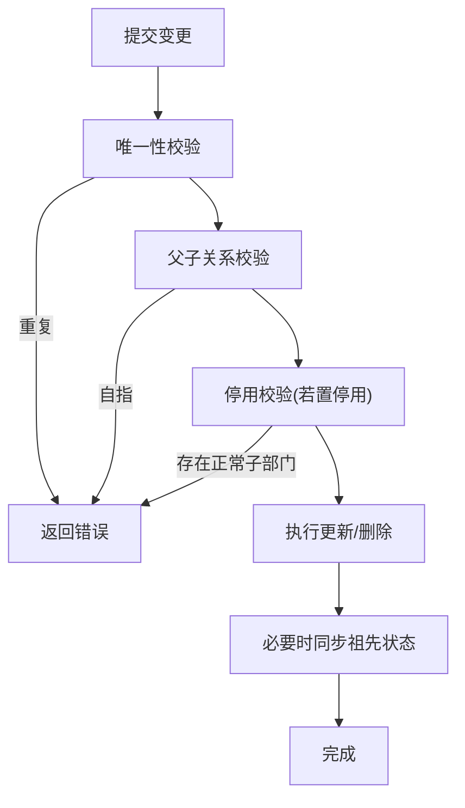
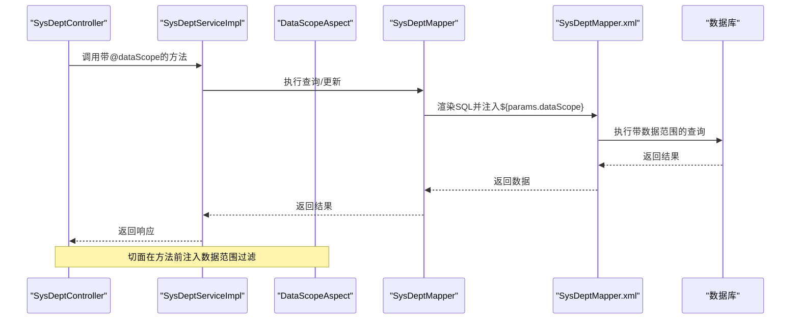
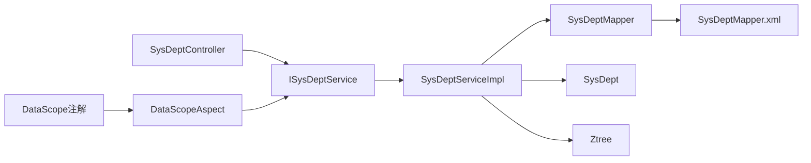

# 部门实体

<cite>
**本文引用的文件**
- [SysDept.java](file://ruoyi-common/src/main/java/com/ruoyi/common/core/domain/entity/SysDept.java)
- [TreeEntity.java](file://ruoyi-common/src/main/java/com/ruoyi/common/core/domain/TreeEntity.java)
- [BaseEntity.java](file://ruoyi-common/src/main/java/com/ruoyi/common/core/domain/BaseEntity.java)
- [Ztree.java](file://ruoyi-common/src/main/java/com/ruoyi/common/core/domain/Ztree.java)
- [UserConstants.java](file://ruoyi-common/src/main/java/com/ruoyi/common/constant/UserConstants.java)
- [SysDeptMapper.java](file://ruoyi-system/src/main/java/com/ruoyi/system/mapper/SysDeptMapper.java)
- [SysDeptMapper.xml](file://ruoyi-system/src/main/resources/mapper/system/SysDeptMapper.xml)
- [ISysDeptService.java](file://ruoyi-system/src/main/java/com/ruoyi/system/service/ISysDeptService.java)
- [SysDeptServiceImpl.java](file://ruoyi-system/src/main/java/com/ruoyi/system/service/impl/SysDeptServiceImpl.java)
- [SysDeptController.java](file://ruoyi-admin/src/main/java/com/ruoyi/web/controller/system/SysDeptController.java)
- [DataScope.java](file://ruoyi-common/src/main/java/com/ruoyi/common/annotation/DataScope.java)
- [DataScopeAspect.java](file://ruoyi-framework/src/main/java/com/ruoyi/framework/aspectj/DataScopeAspect.java)
</cite>

## 目录
1. [简介](#简介)
2. [项目结构](#项目结构)
3. [核心组件](#核心组件)
4. [架构总览](#架构总览)
5. [详细组件分析](#详细组件分析)
6. [依赖分析](#依赖分析)
7. [性能考量](#性能考量)
8. [故障排查指南](#故障排查指南)
9. [结论](#结论)
10. [附录](#附录)

## 简介
本文件围绕RuoYi系统的部门实体进行深入解析，重点阐述SysDept实体的组织架构设计与树形结构实现，包括：
- 部门标识字段（部门ID、父部门ID）
- 部门信息字段（部门名称、部门简称、部门排序、负责人等）
- 组织关系字段（部门层级、部门路径、部门状态）
- 树形组织结构的实现方式、层级计算与路径生成规则
- 部门业务规则（层级验证、状态管理、与用户的关联关系）
- 完整字段说明与组织架构建模方法
- 部门管理最佳实践与数据权限范围控制策略

## 项目结构
RuoYi采用分层架构：前端控制器负责HTTP请求，服务层封装业务逻辑，数据访问层通过MyBatis映射数据库操作，通用模块提供基础实体与工具。

图表来源
- [SysDeptController.java:1-204](file://ruoyi-admin/src/main/java/com/ruoyi/web/controller/system/SysDeptController.java#L1-L204)
- [ISysDeptService.java:1-126](file://ruoyi-system/src/main/java/com/ruoyi/system/service/ISysDeptService.java#L1-L126)
- [SysDeptServiceImpl.java:1-354](file://ruoyi-system/src/main/java/com/ruoyi/system/service/impl/SysDeptServiceImpl.java#L1-L354)
- [SysDeptMapper.java:1-125](file://ruoyi-system/src/main/java/com/ruoyi/system/mapper/SysDeptMapper.java#L1-L125)
- [SysDeptMapper.xml:1-162](file://ruoyi-system/src/main/resources/mapper/system/SysDeptMapper.xml#L1-L162)
- [SysDept.java:1-204](file://ruoyi-common/src/main/java/com/ruoyi/common/core/domain/entity/SysDept.java#L1-L204)
- [TreeEntity.java:1-63](file://ruoyi-common/src/main/java/com/ruoyi/common/core/domain/TreeEntity.java#L1-L63)
- [BaseEntity.java:1-119](file://ruoyi-common/src/main/java/com/ruoyi/common/core/domain/BaseEntity.java#L1-L119)
- [Ztree.java:1-105](file://ruoyi-common/src/main/java/com/ruoyi/common/core/domain/Ztree.java#L1-L105)
- [UserConstants.java:1-74](file://ruoyi-common/src/main/java/com/ruoyi/common/constant/UserConstants.java#L1-L74)
- [DataScope.java:1-44](file://ruoyi-common/src/main/java/com/ruoyi/common/annotation/DataScope.java#L1-L44)
- [DataScopeAspect.java:1-159](file://ruoyi-framework/src/main/java/com/ruoyi/framework/aspectj/DataScopeAspect.java#L1-L159)

章节来源
- [SysDeptController.java:1-204](file://ruoyi-admin/src/main/java/com/ruoyi/web/controller/system/SysDeptController.java#L1-L204)
- [SysDeptServiceImpl.java:1-354](file://ruoyi-system/src/main/java/com/ruoyi/system/service/impl/SysDeptServiceImpl.java#L1-L354)
- [SysDeptMapper.xml:1-162](file://ruoyi-system/src/main/resources/mapper/system/SysDeptMapper.xml#L1-L162)

## 核心组件
- 实体层：SysDept继承BaseEntity，承载部门的核心字段与校验约束；TreeEntity提供树形结构通用字段（父ID、祖先链、排序）。
- 服务层：ISysDeptService定义部门管理的业务契约；SysDeptServiceImpl实现树构建、层级更新、状态同步、数据权限校验等。
- 数据访问层：SysDeptMapper接口与SysDeptMapper.xml映射SQL，支持部门列表、父子关系、唯一性校验、排序更新等。
- 前端控制器：SysDeptController提供REST接口，负责权限校验、参数校验、调用服务层并返回AjaxResult。
- 数据权限：DataScope注解与DataScopeAspect切面，基于用户角色的数据范围动态注入查询条件。

章节来源
- [SysDept.java:17-204](file://ruoyi-common/src/main/java/com/ruoyi/common/core/domain/entity/SysDept.java#L17-L204)
- [TreeEntity.java:8-63](file://ruoyi-common/src/main/java/com/ruoyi/common/core/domain/TreeEntity.java#L8-L63)
- [BaseEntity.java:16-119](file://ruoyi-common/src/main/java/com/ruoyi/common/core/domain/BaseEntity.java#L16-L119)
- [ISysDeptService.java:13-126](file://ruoyi-system/src/main/java/com/ruoyi/system/service/ISysDeptService.java#L13-L126)
- [SysDeptServiceImpl.java:28-354](file://ruoyi-system/src/main/java/com/ruoyi/system/service/impl/SysDeptServiceImpl.java#L28-L354)
- [SysDeptMapper.java:12-125](file://ruoyi-system/src/main/java/com/ruoyi/system/mapper/SysDeptMapper.java#L12-L125)
- [SysDeptMapper.xml:7-162](file://ruoyi-system/src/main/resources/mapper/system/SysDeptMapper.xml#L7-L162)
- [SysDeptController.java:30-204](file://ruoyi-admin/src/main/java/com/ruoyi/web/controller/system/SysDeptController.java#L30-L204)
- [DataScope.java:17-44](file://ruoyi-common/src/main/java/com/ruoyi/common/annotation/DataScope.java#L17-L44)
- [DataScopeAspect.java:25-159](file://ruoyi-framework/src/main/java/com/ruoyi/framework/aspectj/DataScopeAspect.java#L25-L159)

## 架构总览
部门管理从HTTP请求到持久化的一次典型流程如下：

图表来源
- [SysDeptController.java:46-163](file://ruoyi-admin/src/main/java/com/ruoyi/web/controller/system/SysDeptController.java#L46-L163)
- [SysDeptServiceImpl.java:39-232](file://ruoyi-system/src/main/java/com/ruoyi/system/service/impl/SysDeptServiceImpl.java#L39-L232)
- [SysDeptMapper.java:12-125](file://ruoyi-system/src/main/java/com/ruoyi/system/mapper/SysDeptMapper.java#L12-L125)
- [SysDeptMapper.xml:38-160](file://ruoyi-system/src/main/resources/mapper/system/SysDeptMapper.xml#L38-L160)

## 详细组件分析

### SysDept 实体与字段说明
- 继承关系：SysDept继承BaseEntity，具备创建/更新信息与扩展参数容器。
- 树形字段：
  - parentId：父部门ID，决定父子关系
  - ancestors：祖先链，以逗号分隔的祖先ID序列，支撑树遍历与范围查询
- 业务字段：
  - deptName：部门名称，必填且长度限制
  - orderNum：显示顺序，用于同级排序
  - leader/phone/email：负责人与联系方式
  - status：部门状态（0正常/1停用），配合层级启用策略
  - delFlag：逻辑删除标记（0存在/2删除）
- 辅助字段：
  - parentName：父部门名称（查询时联查）
  - excludeId：排除某个节点及其后代用于树选择

章节来源
- [SysDept.java:17-204](file://ruoyi-common/src/main/java/com/ruoyi/common/core/domain/entity/SysDept.java#L17-L204)
- [BaseEntity.java:16-119](file://ruoyi-common/src/main/java/com/ruoyi/common/core/domain/BaseEntity.java#L16-L119)
- [TreeEntity.java:8-63](file://ruoyi-common/src/main/java/com/ruoyi/common/core/domain/TreeEntity.java#L8-L63)

### 树形组织结构与层级计算
- 层级计算：通过ancestors字段维护祖先链，新增/移动部门时，新祖先链为“原父祖先链,父ID”，便于快速判断上下级关系与范围查询。
- 路径生成：祖先链以逗号分隔，查询子节点使用find_in_set(#{deptId}, ancestors)，实现O(1)级别的层级展开。
- 启用策略：当部门状态变为“正常”且存在祖先链时，自动启用其所有祖先节点，确保树结构一致性。

图表来源
- [SysDeptServiceImpl.java:193-203](file://ruoyi-system/src/main/java/com/ruoyi/system/service/impl/SysDeptServiceImpl.java#L193-L203)
- [SysDeptMapper.xml:81-87](file://ruoyi-system/src/main/resources/mapper/system/SysDeptMapper.xml#L81-L87)

章节来源
- [SysDeptServiceImpl.java:193-232](file://ruoyi-system/src/main/java/com/ruoyi/system/service/impl/SysDeptServiceImpl.java#L193-L232)
- [SysDeptMapper.xml:81-87](file://ruoyi-system/src/main/resources/mapper/system/SysDeptMapper.xml#L81-L87)

### 部门树构建与Ztree映射
- 树构建：服务层将SysDept列表转换为Ztree列表，设置id/pId/name/title等字段，并在角色授权场景中设置checked状态。
- 过滤：支持排除指定节点及其后代，用于“选择上级部门树”场景。
- 状态过滤：仅对状态为正常的部门节点参与树渲染。

图表来源
- [SysDeptServiceImpl.java:111-145](file://ruoyi-system/src/main/java/com/ruoyi/system/service/impl/SysDeptServiceImpl.java#L111-L145)
- [SysDept.java:17-204](file://ruoyi-common/src/main/java/com/ruoyi/common/core/domain/entity/SysDept.java#L17-L204)
- [Ztree.java:10-105](file://ruoyi-common/src/main/java/com/ruoyi/common/core/domain/Ztree.java#L10-L105)

章节来源
- [SysDeptServiceImpl.java:111-145](file://ruoyi-system/src/main/java/com/ruoyi/system/service/impl/SysDeptServiceImpl.java#L111-L145)
- [Ztree.java:10-105](file://ruoyi-common/src/main/java/com/ruoyi/common/core/domain/Ztree.java#L10-L105)

### 业务规则与校验
- 名称唯一性：按“部门名称+父部门ID”唯一校验，排除自身ID。
- 父子关系校验：禁止将部门的父节点设为其自身。
- 停用规则：若将部门置为停用，需确保其下无“正常”子部门。
- 新增限制：仅当父部门处于“正常”状态时允许新增子节点。
- 删除限制：若存在下级部门或绑定用户，禁止删除。

图表来源
- [SysDeptController.java:111-129](file://ruoyi-admin/src/main/java/com/ruoyi/web/controller/system/SysDeptController.java#L111-L129)
- [SysDeptServiceImpl.java:296-306](file://ruoyi-system/src/main/java/com/ruoyi/system/service/impl/SysDeptServiceImpl.java#L296-L306)
- [SysDeptServiceImpl.java:211-232](file://ruoyi-system/src/main/java/com/ruoyi/system/service/impl/SysDeptServiceImpl.java#L211-L232)

章节来源
- [SysDeptController.java:111-129](file://ruoyi-admin/src/main/java/com/ruoyi/web/controller/system/SysDeptController.java#L111-L129)
- [SysDeptServiceImpl.java:296-306](file://ruoyi-system/src/main/java/com/ruoyi/system/service/impl/SysDeptServiceImpl.java#L296-L306)
- [SysDeptServiceImpl.java:211-232](file://ruoyi-system/src/main/java/com/ruoyi/system/service/impl/SysDeptServiceImpl.java#L211-L232)

### 数据权限范围控制策略
- 注解驱动：在服务方法上标注@dataScope(deptAlias="d")，自动注入数据范围过滤条件。
- 切面实现：DataScopeAspect根据用户角色的数据范围策略（全部/本部门/本部门及子部门/自定义/仅本人）拼接SQL条件。
- 参数注入：将拼接后的过滤条件写入BaseEntity.params.dataScope，由Mapper.xml中的${params.dataScope}生效。
- 控制器联动：SysDeptController在编辑/删除等敏感操作前调用checkDeptDataScope进行细粒度权限校验。

图表来源
- [SysDeptServiceImpl.java:40-44](file://ruoyi-system/src/main/java/com/ruoyi/system/service/impl/SysDeptServiceImpl.java#L40-L44)
- [DataScope.java:17-44](file://ruoyi-common/src/main/java/com/ruoyi/common/annotation/DataScope.java#L17-L44)
- [DataScopeAspect.java:41-144](file://ruoyi-framework/src/main/java/com/ruoyi/framework/aspectj/DataScopeAspect.java#L41-L144)
- [SysDeptMapper.xml:53-56](file://ruoyi-system/src/main/resources/mapper/system/SysDeptMapper.xml#L53-L56)

章节来源
- [DataScope.java:17-44](file://ruoyi-common/src/main/java/com/ruoyi/common/annotation/DataScope.java#L17-L44)
- [DataScopeAspect.java:41-144](file://ruoyi-framework/src/main/java/com/ruoyi/framework/aspectj/DataScopeAspect.java#L41-L144)
- [SysDeptServiceImpl.java:40-44](file://ruoyi-system/src/main/java/com/ruoyi/system/service/impl/SysDeptServiceImpl.java#L40-L44)
- [SysDeptMapper.xml:53-56](file://ruoyi-system/src/main/resources/mapper/system/SysDeptMapper.xml#L53-L56)

## 依赖分析
- 组件耦合：
  - 控制器依赖服务接口，服务实现依赖Mapper接口与工具类。
  - Mapper接口与XML映射强耦合，SQL依赖find_in_set与concat等函数。
  - 数据权限通过注解与切面解耦，避免在业务代码中重复编写过滤逻辑。
- 关键依赖链：
  - SysDeptController → ISysDeptService → SysDeptServiceImpl → SysDeptMapper → SysDeptMapper.xml
  - DataScopeAspect → ISysDeptService（通过注解触发）

图表来源
- [SysDeptController.java:36-37](file://ruoyi-admin/src/main/java/com/ruoyi/web/controller/system/SysDeptController.java#L36-L37)
- [ISysDeptService.java:13-126](file://ruoyi-system/src/main/java/com/ruoyi/system/service/ISysDeptService.java#L13-L126)
- [SysDeptServiceImpl.java:28-354](file://ruoyi-system/src/main/java/com/ruoyi/system/service/impl/SysDeptServiceImpl.java#L28-L354)
- [SysDeptMapper.java:12-125](file://ruoyi-system/src/main/java/com/ruoyi/system/mapper/SysDeptMapper.java#L12-L125)
- [SysDeptMapper.xml:1-162](file://ruoyi-system/src/main/resources/mapper/system/SysDeptMapper.xml#L1-L162)
- [DataScope.java:17-44](file://ruoyi-common/src/main/java/com/ruoyi/common/annotation/DataScope.java#L17-L44)
- [DataScopeAspect.java:25-159](file://ruoyi-framework/src/main/java/com/ruoyi/framework/aspectj/DataScopeAspect.java#L25-L159)

章节来源
- [SysDeptController.java:36-37](file://ruoyi-admin/src/main/java/com/ruoyi/web/controller/system/SysDeptController.java#L36-L37)
- [SysDeptServiceImpl.java:28-354](file://ruoyi-system/src/main/java/com/ruoyi/system/service/impl/SysDeptServiceImpl.java#L28-L354)
- [SysDeptMapper.java:12-125](file://ruoyi-system/src/main/java/com/ruoyi/system/mapper/SysDeptMapper.java#L12-L125)
- [SysDeptMapper.xml:1-162](file://ruoyi-system/src/main/resources/mapper/system/SysDeptMapper.xml#L1-L162)
- [DataScopeAspect.java:25-159](file://ruoyi-framework/src/main/java/com/ruoyi/framework/aspectj/DataScopeAspect.java#L25-L159)

## 性能考量
- 祖先链查询：使用find_in_set(#{deptId}, ancestors)进行层级展开，适合中小规模树结构；大规模树建议评估索引与分页策略。
- SQL拼接：Mapper.xml中通过动态标签按需拼接字段，减少冗余列传输。
- 批量更新：updateDeptChildren使用批量CASE WHEN更新子节点祖先链，降低多条UPDATE往返开销。
- 数据权限：通过切面注入过滤条件，避免在业务层重复拼接SQL，提升可维护性。

[本节为通用性能讨论，无需特定文件来源]

## 故障排查指南
- 新增失败：检查父部门状态是否为“正常”，否则会抛出异常阻止新增。
- 修改失败：若目标部门被设为停用但存在“正常”子部门，会提示不允许停用。
- 删除失败：若存在下级部门或绑定用户，会提示不允许删除。
- 权限问题：非管理员用户访问其他部门数据会触发数据范围校验异常。
- 唯一性冲突：同一父部门下部门名称重复会校验失败。

章节来源
- [SysDeptServiceImpl.java:196-200](file://ruoyi-system/src/main/java/com/ruoyi/system/service/impl/SysDeptServiceImpl.java#L196-L200)
- [SysDeptController.java:123-126](file://ruoyi-admin/src/main/java/com/ruoyi/web/controller/system/SysDeptController.java#L123-L126)
- [SysDeptController.java:153-162](file://ruoyi-admin/src/main/java/com/ruoyi/web/controller/system/SysDeptController.java#L153-L162)
- [SysDeptServiceImpl.java:313-326](file://ruoyi-system/src/main/java/com/ruoyi/system/service/impl/SysDeptServiceImpl.java#L313-L326)
- [SysDeptServiceImpl.java:296-306](file://ruoyi-system/src/main/java/com/ruoyi/system/service/impl/SysDeptServiceImpl.java#L296-L306)

## 结论
SysDept实体通过祖先链（ancestors）与父ID（parentId）实现了高效的树形组织建模，结合服务层的状态同步与路径更新机制，保证了树结构的完整性与一致性。配合数据权限切面，实现了灵活而安全的数据范围控制。在实际应用中，建议：
- 严格遵循“父部门必须正常”的新增规则
- 在停用部门前清理或转移其正常子部门
- 使用Ztree进行前端树展示，确保只渲染状态正常的节点
- 通过数据权限注解统一管理访问边界，避免在业务代码中分散处理

[本节为总结性内容，无需特定文件来源]

## 附录

### 字段对照表
- 部门ID：deptId（主键）
- 父部门ID：parentId（外键指向sys_dept.dept_id）
- 祖先链：ancestors（逗号分隔的祖先ID序列）
- 部门名称：deptName（必填，长度限制）
- 显示顺序：orderNum（整型，用于同级排序）
- 负责人：leader（字符串）
- 联系电话：phone（字符串，长度限制）
- 邮箱：email（字符串，邮箱格式与长度限制）
- 部门状态：status（0正常/1停用）
- 删除标志：delFlag（0存在/2删除）
- 父部门名称：parentName（查询时联查）
- 排除ID：excludeId（用于树选择排除）

章节来源
- [SysDept.java:21-56](file://ruoyi-common/src/main/java/com/ruoyi/common/core/domain/entity/SysDept.java#L21-L56)
- [SysDeptMapper.xml:7-23](file://ruoyi-system/src/main/resources/mapper/system/SysDeptMapper.xml#L7-L23)