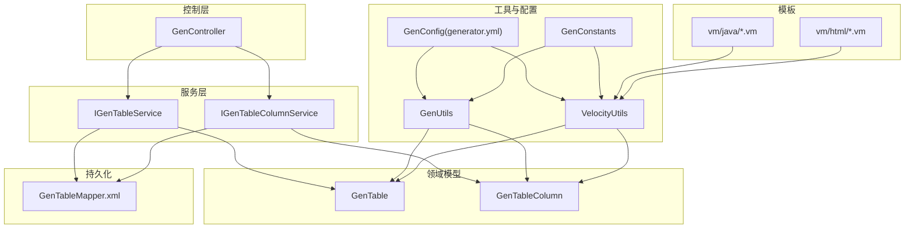
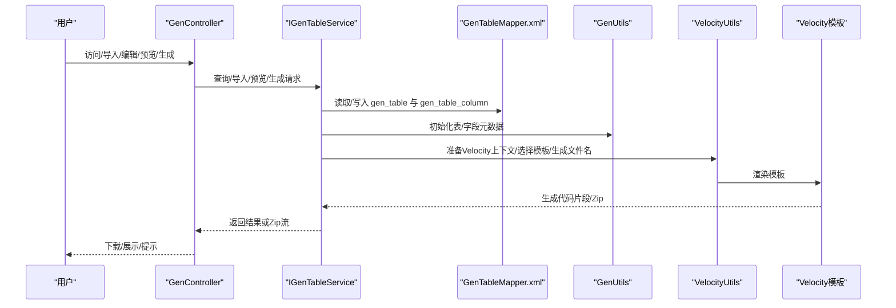
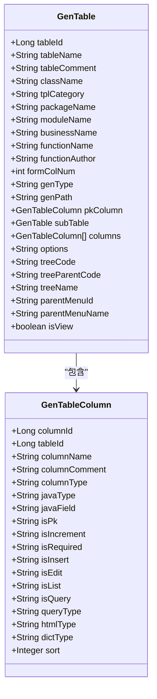
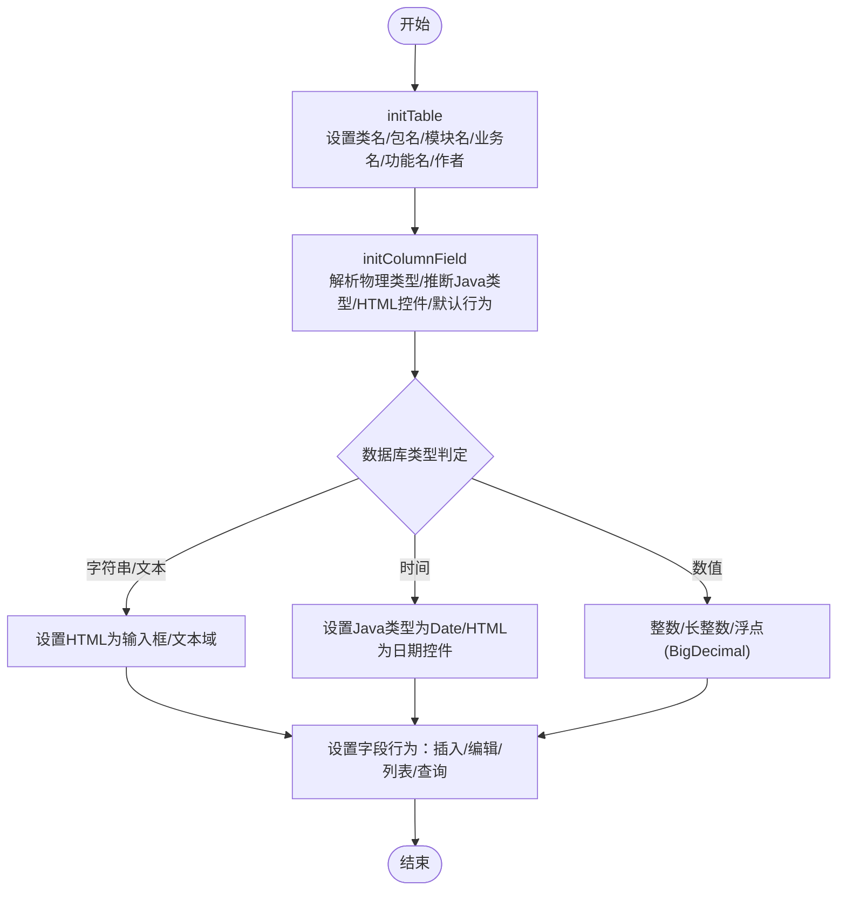
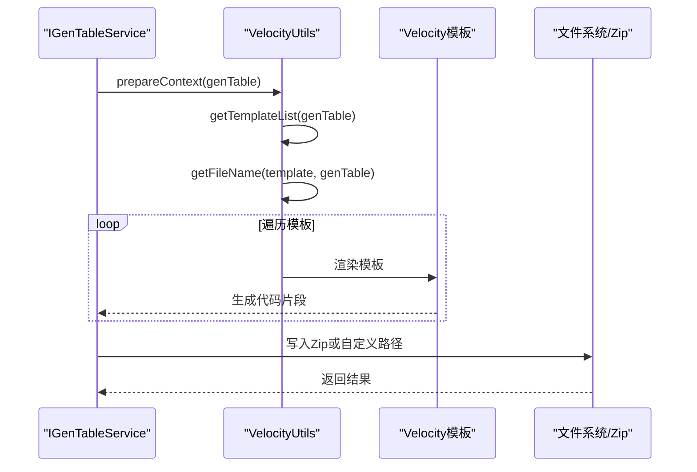
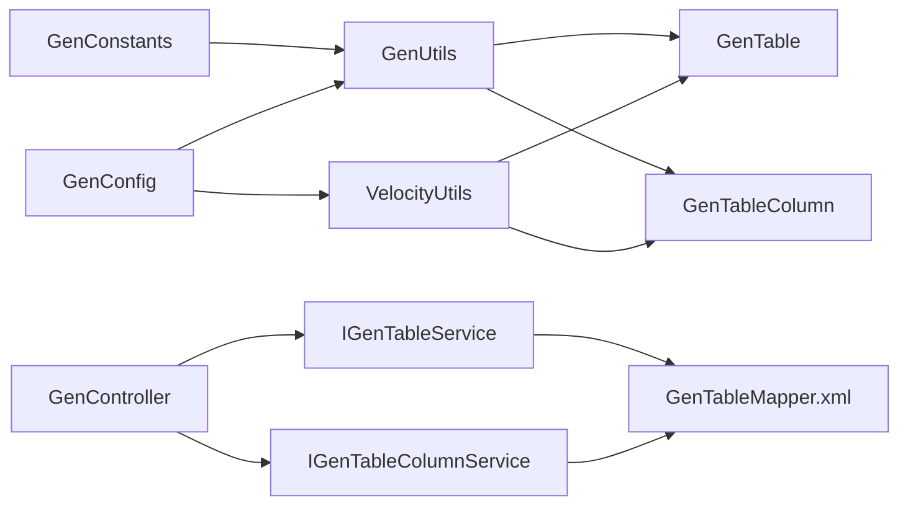

# 代码生成表结构

<cite>
**本文引用的文件**
- [GenTable.java](file://ruoyi-generator/src/main/java/com/ruoyi/generator/domain/GenTable.java)
- [GenTableColumn.java](file://ruoyi-generator/src/main/java/com/ruoyi/generator/domain/GenTableColumn.java)
- [IGenTableService.java](file://ruoyi-generator/src/main/java/com/ruoyi/generator/service/IGenTableService.java)
- [IGenTableColumnService.java](file://ruoyi-generator/src/main/java/com/ruoyi/generator/service/IGenTableColumnService.java)
- [GenController.java](file://ruoyi-generator/src/main/java/com/ruoyi/generator/controller/GenController.java)
- [GenConfig.java](file://ruoyi-generator/src/main/java/com/ruoyi/generator/config/GenConfig.java)
- [GenUtils.java](file://ruoyi-generator/src/main/java/com/ruoyi/generator/util/GenUtils.java)
- [VelocityUtils.java](file://ruoyi-generator/src/main/java/com/ruoyi/generator/util/VelocityUtils.java)
- [GenConstants.java](file://ruoyi-common/src/main/java/com/ruoyi/common/constant/GenConstants.java)
- [GenTableMapper.xml](file://ruoyi-generator/src/main/resources/mapper/generator/GenTableMapper.xml)
- [generator.yml](file://ruoyi-generator/src/main/resources/generator.yml)
- [gen.html](file://ruoyi-generator/src/main/resources/templates/tool/gen/gen.html)
- [importTable.html](file://ruoyi-generator/src/main/resources/templates/tool/gen/importTable.html)
- [edit.html](file://ruoyi-generator/src/main/resources/templates/tool/gen/edit.html)
- [list.html.vm](file://ruoyi-generator/src/main/resources/vm/html/list.html.vm)
- [domain.java.vm](file://ruoyi-generator/src/main/resources/vm/java/domain.java.vm)
- [controller.java.vm](file://ruoyi-generator/src/main/resources/vm/java/controller.java.vm)
</cite>

## 目录
1. [简介](#简介)
2. [项目结构](#项目结构)
3. [核心组件](#核心组件)
4. [架构总览](#架构总览)
5. [详细组件分析](#详细组件分析)
6. [依赖分析](#依赖分析)
7. [性能考虑](#性能考虑)
8. [故障排查指南](#故障排查指南)
9. [结论](#结论)
10. [附录](#附录)

## 简介
本文件面向RuoYi系统的“代码生成”能力，围绕代码生成业务表（gen_table）与业务表字段（gen_table_column）进行深入解析。内容涵盖：
- 表与字段元数据设计与存储机制
- Java类型映射、显示控件与验证规则的配置策略
- 模板引擎集成与文件输出流程
- 配置管理、模板定制与批量生成实现
- 提升开发效率的价值与扩展方向

## 项目结构
代码生成模块位于 ruoyi-generator，采用典型的分层结构：
- 控制层：GenController 提供Web入口与交互
- 服务层：IGenTableService、IGenTableColumnService 定义业务接口
- 领域模型：GenTable、GenTableColumn 封装表与字段元数据
- 工具与配置：GenUtils、VelocityUtils、GenConfig、generator.yml
- 持久化：MyBatis Mapper XML 定义查询与持久化逻辑
- 模板：Velocity VM 模板定义生成的源码与页面结构

图示来源
- [GenController.java:48-309](file://ruoyi-generator/src/main/java/com/ruoyi/generator/controller/GenController.java#L48-L309)
- [IGenTableService.java:12-130](file://ruoyi-generator/src/main/java/com/ruoyi/generator/service/IGenTableService.java#L12-L130)
- [IGenTableColumnService.java:11-45](file://ruoyi-generator/src/main/java/com/ruoyi/generator/service/IGenTableColumnService.java#L11-L45)
- [GenTable.java:16-398](file://ruoyi-generator/src/main/java/com/ruoyi/generator/domain/GenTable.java#L16-L398)
- [GenTableColumn.java:12-373](file://ruoyi-generator/src/main/java/com/ruoyi/generator/domain/GenTableColumn.java#L12-L373)
- [GenUtils.java:16-253](file://ruoyi-generator/src/main/java/com/ruoyi/generator/util/GenUtils.java#L16-L253)
- [VelocityUtils.java:15-457](file://ruoyi-generator/src/main/java/com/ruoyi/generator/util/VelocityUtils.java#L15-L457)
- [GenConfig.java:16-88](file://ruoyi-generator/src/main/java/com/ruoyi/generator/config/GenConfig.java#L16-L88)
- [GenConstants.java:8-118](file://ruoyi-common/src/main/java/com/ruoyi/common/constant/GenConstants.java#L8-L118)
- [GenTableMapper.xml:5-204](file://ruoyi-generator/src/main/resources/mapper/generator/GenTableMapper.xml#L5-L204)

章节来源
- [GenController.java:48-309](file://ruoyi-generator/src/main/java/com/ruoyi/generator/controller/GenController.java#L48-L309)
- [GenTableMapper.xml:5-204](file://ruoyi-generator/src/main/resources/mapper/generator/GenTableMapper.xml#L5-L204)

## 核心组件
- GenTable：封装业务表元数据，包括表名、描述、实体类名、模板类别、包路径、模块名、业务名、功能名、作者、表单布局、生成方式、生成路径、主键列、子表、字段列表、扩展选项（如树表字段、上级菜单）、是否生成详情页等。
- GenTableColumn：封装字段元数据，包括列名、描述、物理类型、Java类型、Java字段名、是否主键/自增/必填、是否插入/编辑/列表/查询、查询方式、显示类型、字典类型、排序等；并提供字段级别判断与转换方法（如是否超类字段、是否可用字段、读取字典转换表达式）。
- GenConstants：集中定义模板类型（crud/tree/sub）、HTML控件类型、Java类型、查询方式、字段白名单等常量。
- GenUtils：初始化表与字段元数据，完成表名转类名、模块名、业务名、自动去前缀、数据库类型识别、Java类型推断、HTML控件类型设定、默认字段行为（插入/编辑/列表/查询）等。
- VelocityUtils：准备Velocity上下文、选择模板集、生成文件名、计算导入包、生成权限前缀、树表/主子表上下文注入、详情页开关等。
- GenConfig：从generator.yml读取作者、包路径、自动去前缀、表前缀、是否允许覆盖等全局配置。
- GenController：提供代码生成的Web入口，包括导入表、编辑生成配置、预览、下载/自定义路径生成、同步数据库、批量生成等。
- IGenTableService / IGenTableColumnService：定义查询、导入、预览、生成、同步、批量生成等接口。

章节来源
- [GenTable.java:16-398](file://ruoyi-generator/src/main/java/com/ruoyi/generator/domain/GenTable.java#L16-L398)
- [GenTableColumn.java:12-373](file://ruoyi-generator/src/main/java/com/ruoyi/generator/domain/GenTableColumn.java#L12-L373)
- [GenConstants.java:8-118](file://ruoyi-common/src/main/java/com/ruoyi/common/constant/GenConstants.java#L8-L118)
- [GenUtils.java:16-253](file://ruoyi-generator/src/main/java/com/ruoyi/generator/util/GenUtils.java#L16-L253)
- [VelocityUtils.java:15-457](file://ruoyi-generator/src/main/java/com/ruoyi/generator/util/VelocityUtils.java#L15-L457)
- [GenConfig.java:16-88](file://ruoyi-generator/src/main/java/com/ruoyi/generator/config/GenConfig.java#L16-L88)
- [IGenTableService.java:12-130](file://ruoyi-generator/src/main/java/com/ruoyi/generator/service/IGenTableService.java#L12-L130)
- [IGenTableColumnService.java:11-45](file://ruoyi-generator/src/main/java/com/ruoyi/generator/service/IGenTableColumnService.java#L11-L45)

## 架构总览
代码生成的端到端流程如下：

图示来源
- [GenController.java:48-309](file://ruoyi-generator/src/main/java/com/ruoyi/generator/controller/GenController.java#L48-L309)
- [IGenTableService.java:12-130](file://ruoyi-generator/src/main/java/com/ruoyi/generator/service/IGenTableService.java#L12-L130)
- [GenTableMapper.xml:5-204](file://ruoyi-generator/src/main/resources/mapper/generator/GenTableMapper.xml#L5-L204)
- [GenUtils.java:16-253](file://ruoyi-generator/src/main/java/com/ruoyi/generator/util/GenUtils.java#L16-L253)
- [VelocityUtils.java:15-457](file://ruoyi-generator/src/main/java/com/ruoyi/generator/util/VelocityUtils.java#L15-L457)

## 详细组件分析

### 表与字段元数据模型
- GenTable：承载表级元数据与业务配置，支持模板类型（crud/tree/sub）、树表字段（treeCode/treeParentCode/treeName）、上级菜单（parentMenuId/parentMenuName）、表单布局（formColNum）、生成选项（options）等。
- GenTableColumn：承载字段级元数据，含物理类型、Java类型、Java字段名、是否主键/自增/必填、是否插入/编辑/列表/查询、查询方式、显示类型、字典类型、排序等；并提供字段级别判断与转换辅助方法。

图示来源
- [GenTable.java:16-398](file://ruoyi-generator/src/main/java/com/ruoyi/generator/domain/GenTable.java#L16-L398)
- [GenTableColumn.java:12-373](file://ruoyi-generator/src/main/java/com/ruoyi/generator/domain/GenTableColumn.java#L12-L373)

章节来源
- [GenTable.java:16-398](file://ruoyi-generator/src/main/java/com/ruoyi/generator/domain/GenTable.java#L16-L398)
- [GenTableColumn.java:12-373](file://ruoyi-generator/src/main/java/com/ruoyi/generator/domain/GenTableColumn.java#L12-L373)

### 元数据初始化与类型映射
- 表级初始化：由GenUtils.initTable完成，包括类名、包名、模块名、业务名、功能名、作者、创建人等。
- 字段级初始化：由GenUtils.initColumnField完成，依据数据库类型推断Java类型、HTML控件类型、默认字段行为（插入/编辑/列表/查询），并根据字段名后缀智能设置查询方式与控件类型。
- 常量支撑：GenConstants定义了数据库类型分类、HTML控件类型、Java类型、查询方式、字段白名单等，确保映射一致性。

图示来源
- [GenUtils.java:16-253](file://ruoyi-generator/src/main/java/com/ruoyi/generator/util/GenUtils.java#L16-L253)
- [GenConstants.java:8-118](file://ruoyi-common/src/main/java/com/ruoyi/common/constant/GenConstants.java#L8-L118)

章节来源
- [GenUtils.java:16-253](file://ruoyi-generator/src/main/java/com/ruoyi/generator/util/GenUtils.java#L16-L253)
- [GenConstants.java:8-118](file://ruoyi-common/src/main/java/com/ruoyi/common/constant/GenConstants.java#L8-L118)

### 模板引擎集成与文件输出
- Velocity上下文准备：VelocityUtils.prepareContext将表与字段元数据注入Velocity上下文，并按模板类型（crud/tree/sub）与扩展选项（如genView）动态选择模板集。
- 模板选择：根据tplCategory与genView决定生成的模板清单（如html列表、树形、主子表、详情页等）。
- 文件命名：根据包路径、模块名、业务名、类名与模板类型生成目标文件路径。
- 导入包与权限前缀：自动计算需要导入的包与权限前缀，保证生成代码的可编译性与权限控制。
- 输出形式：支持Zip打包下载与自定义路径生成两种方式。

图示来源
- [VelocityUtils.java:15-457](file://ruoyi-generator/src/main/java/com/ruoyi/generator/util/VelocityUtils.java#L15-L457)
- [list.html.vm:1-160](file://ruoyi-generator/src/main/resources/vm/html/list.html.vm#L1-L160)
- [domain.java.vm:1-106](file://ruoyi-generator/src/main/resources/vm/java/domain.java.vm#L1-L106)
- [controller.java.vm:1-218](file://ruoyi-generator/src/main/resources/vm/java/controller.java.vm#L1-L218)

章节来源
- [VelocityUtils.java:15-457](file://ruoyi-generator/src/main/java/com/ruoyi/generator/util/VelocityUtils.java#L15-L457)

### 配置管理与模板定制
- 全局配置：generator.yml中定义作者、默认包路径、自动去前缀、表前缀、是否允许覆盖等；GenConfig负责读取与暴露。
- 模板定制：通过修改vm目录下的模板文件（如domain.java.vm、controller.java.vm、list.html.vm）实现定制化生成。
- 生成选项：GenTable.options支持树表字段、上级菜单、详情页开关等扩展配置，VelocityUtils据此注入上下文。

章节来源
- [generator.yml:1-13](file://ruoyi-generator/src/main/resources/generator.yml#L1-L13)
- [GenConfig.java:16-88](file://ruoyi-generator/src/main/java/com/ruoyi/generator/config/GenConfig.java#L16-L88)
- [VelocityUtils.java:15-457](file://ruoyi-generator/src/main/java/com/ruoyi/generator/util/VelocityUtils.java#L15-L457)

### 批量生成与同步
- 批量生成：GenController提供批量生成接口，支持多表同时下载Zip。
- 同步数据库：支持强制同步表结构，确保生成配置与数据库一致。
- 导入表：从数据库信息模式导入未生成的表，快速建立生成配置。

章节来源
- [GenController.java:48-309](file://ruoyi-generator/src/main/java/com/ruoyi/generator/controller/GenController.java#L48-L309)
- [IGenTableService.java:12-130](file://ruoyi-generator/src/main/java/com/ruoyi/generator/service/IGenTableService.java#L12-L130)

### Web界面与交互
- 代码生成列表：支持搜索、预览、编辑、删除、同步、生成（下载/自定义路径）。
- 导入表结构：支持按表名/描述筛选，多选导入。
- 修改生成配置：支持模板类型、包路径、模块名、业务名、功能名、表单布局、扩展功能、生成方式、上级菜单、树表字段等配置。

章节来源
- [gen.html:1-219](file://ruoyi-generator/src/main/resources/templates/tool/gen/gen.html#L1-L219)
- [importTable.html:1-95](file://ruoyi-generator/src/main/resources/templates/tool/gen/importTable.html#L1-L95)
- [edit.html:1-633](file://ruoyi-generator/src/main/resources/templates/tool/gen/edit.html#L1-L633)

## 依赖分析
- GenTable 与 GenTableColumn 之间为聚合关系，GenTable持有GenTableColumn列表。
- GenUtils 与 VelocityUtils 依赖 GenConstants 常量与 GenConfig 配置。
- GenController 依赖 IGenTableService 与 IGenTableColumnService，间接使用 GenUtils 与 VelocityUtils。
- GenTableMapper.xml 提供对 gen_table 与 gen_table_column 的持久化支持。

图示来源
- [GenConstants.java:8-118](file://ruoyi-common/src/main/java/com/ruoyi/common/constant/GenConstants.java#L8-L118)
- [GenConfig.java:16-88](file://ruoyi-generator/src/main/java/com/ruoyi/generator/config/GenConfig.java#L16-L88)
- [GenUtils.java:16-253](file://ruoyi-generator/src/main/java/com/ruoyi/generator/util/GenUtils.java#L16-L253)
- [VelocityUtils.java:15-457](file://ruoyi-generator/src/main/java/com/ruoyi/generator/util/VelocityUtils.java#L15-L457)
- [GenTable.java:16-398](file://ruoyi-generator/src/main/java/com/ruoyi/generator/domain/GenTable.java#L16-L398)
- [GenTableColumn.java:12-373](file://ruoyi-generator/src/main/java/com/ruoyi/generator/domain/GenTableColumn.java#L12-L373)
- [GenController.java:48-309](file://ruoyi-generator/src/main/java/com/ruoyi/generator/controller/GenController.java#L48-L309)
- [IGenTableService.java:12-130](file://ruoyi-generator/src/main/java/com/ruoyi/generator/service/IGenTableService.java#L12-L130)
- [IGenTableColumnService.java:11-45](file://ruoyi-generator/src/main/java/com/ruoyi/generator/service/IGenTableColumnService.java#L11-L45)
- [GenTableMapper.xml:5-204](file://ruoyi-generator/src/main/resources/mapper/generator/GenTableMapper.xml#L5-L204)

章节来源
- [GenTableMapper.xml:5-204](file://ruoyi-generator/src/main/resources/mapper/generator/GenTableMapper.xml#L5-L204)

## 性能考虑
- 批量生成时建议限制并发与IO压力，优先使用Zip下载方式减少磁盘写入。
- 模板渲染复杂度与字段数量线性相关，建议合理拆分模板与减少不必要的上下文注入。
- 数据库查询与过滤条件已通过Mapper优化，避免全表扫描；导入表时注意表名/描述的模糊匹配性能。

## 故障排查指南
- 生成失败或文件未覆盖：检查GenConfig.allowOverwrite配置，自定义路径生成需允许覆盖。
- 字段类型映射异常：核对数据库类型与GenConstants中的分类是否匹配，必要时在GenUtils中补充映射规则。
- 模板渲染错误：检查Velocity模板语法与上下文变量是否正确注入。
- 权限不足：生成/编辑/删除/预览等操作需对应权限注解，确保用户具备相应角色与权限。
- 导入表失败：确认数据库连接、信息模式访问权限与表名/描述过滤条件。

章节来源
- [GenConfig.java:16-88](file://ruoyi-generator/src/main/java/com/ruoyi/generator/config/GenConfig.java#L16-L88)
- [GenUtils.java:16-253](file://ruoyi-generator/src/main/java/com/ruoyi/generator/util/GenUtils.java#L16-L253)
- [VelocityUtils.java:15-457](file://ruoyi-generator/src/main/java/com/ruoyi/generator/util/VelocityUtils.java#L15-L457)
- [GenController.java:48-309](file://ruoyi-generator/src/main/java/com/ruoyi/generator/controller/GenController.java#L48-L309)

## 结论
RuoYi的代码生成体系以清晰的元数据模型为基础，结合Velocity模板引擎与灵活的配置管理，实现了从表结构到前后端代码的一体化生成。通过标准化的类型映射、显示控件与验证规则配置，以及可定制的模板与批量生成能力，显著提升了开发效率。同时，完善的权限控制与同步机制保障了生成过程的安全与一致性。

## 附录
- 常用模板位置
  - Java实体：vm/java/domain.java.vm
  - 控制器：vm/java/controller.java.vm
  - 列表页面：vm/html/list.html.vm
  - 其他模板：vm/html/*.vm、vm/java/*.vm、vm/xml/*.vm、vm/sql/sql.vm
- 生成选项说明
  - 树表字段：treeCode、treeParentCode、treeName
  - 上级菜单：parentMenuId、parentMenuName
  - 详情页：genView
  - 表单布局：formColNum（1/2/3列）
  - 生成方式：genType（0 Zip下载 / 1 自定义路径）