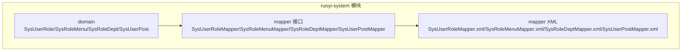
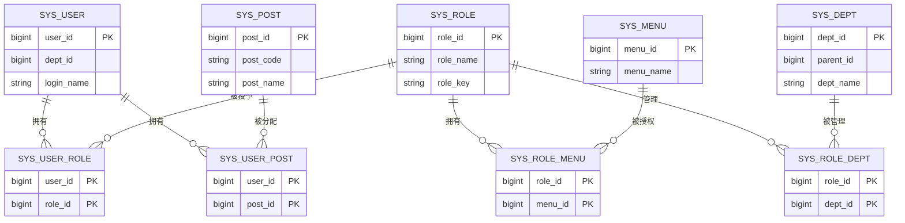
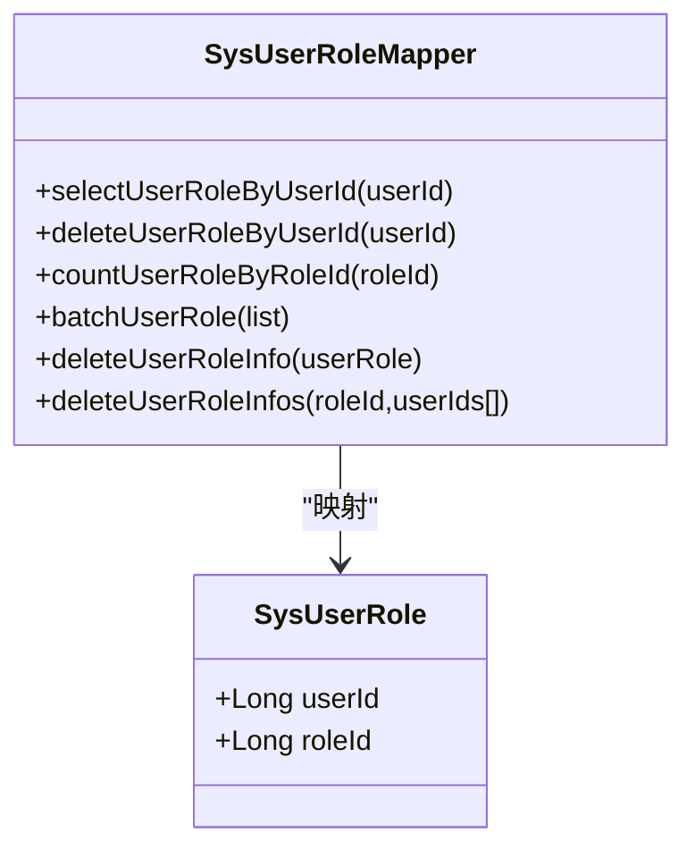
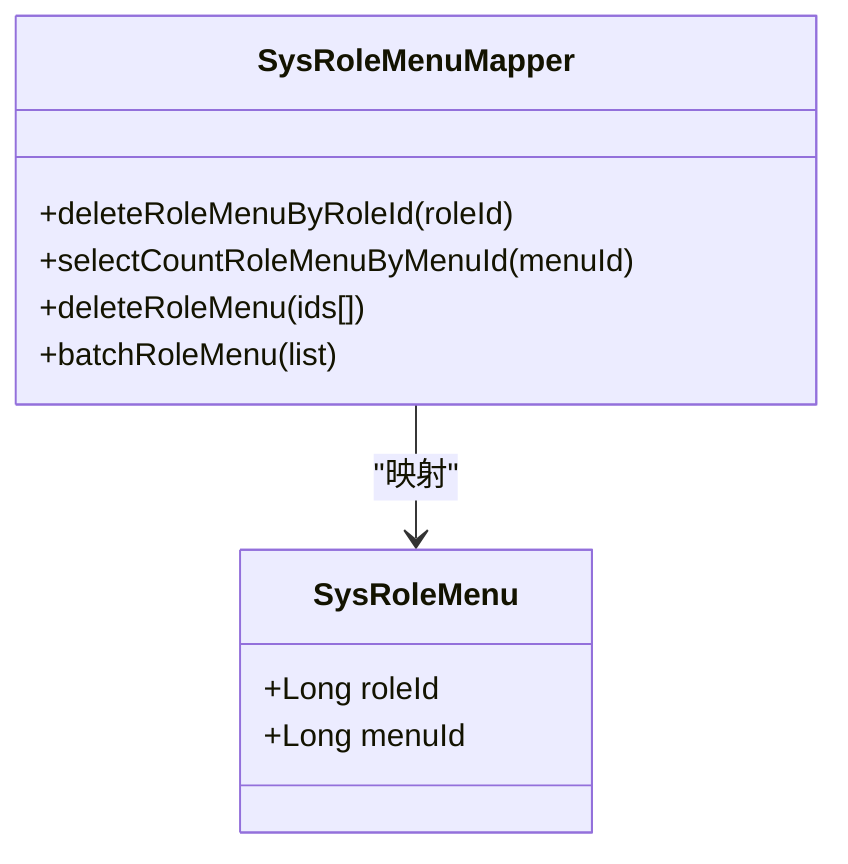
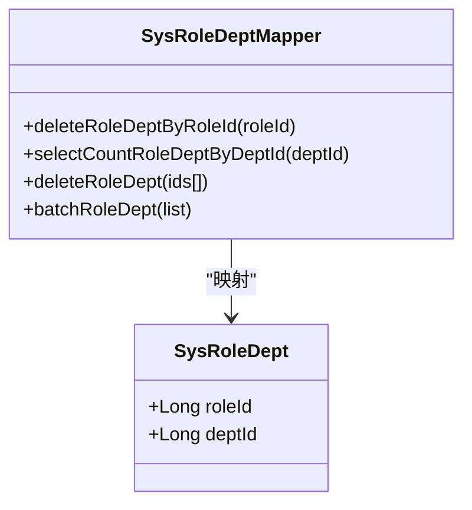
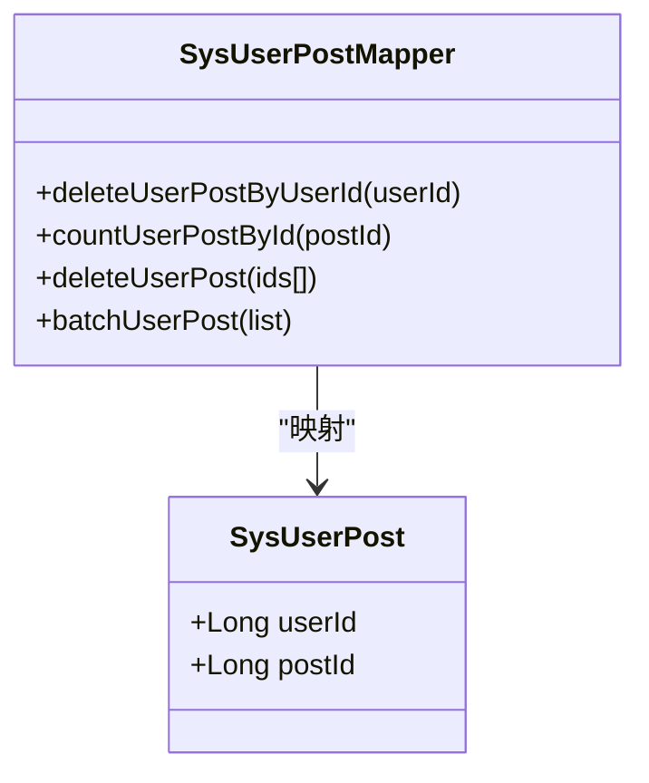
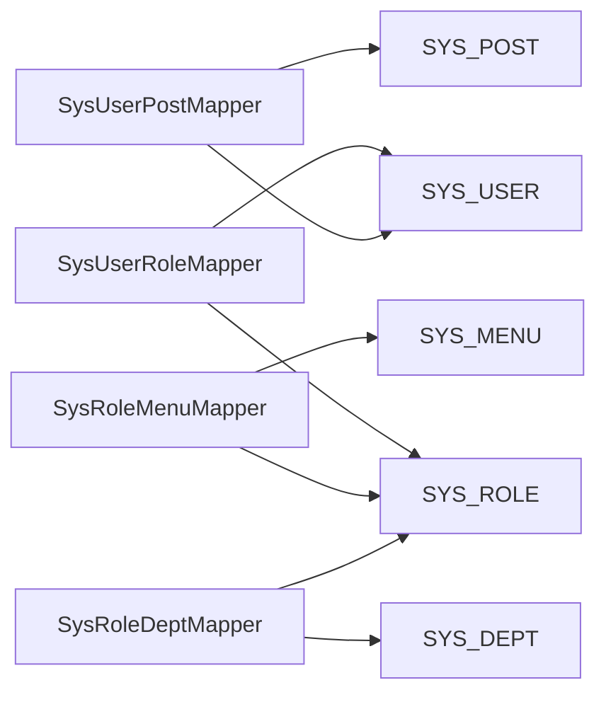

# 关联关系表结构

<cite>
**本文引用的文件**
- [SysUserRole.java](file://ruoyi-system/src/main/java/com/ruoyi/system/domain/SysUserRole.java)
- [SysRoleMenu.java](file://ruoyi-system/src/main/java/com/ruoyi/system/domain/SysRoleMenu.java)
- [SysRoleDept.java](file://ruoyi-system/src/main/java/com/ruoyi/system/domain/SysRoleDept.java)
- [SysUserPost.java](file://ruoyi-system/src/main/java/com/ruoyi/system/domain/SysUserPost.java)
- [SysUserRoleMapper.java](file://ruoyi-system/src/main/java/com/ruoyi/system/mapper/SysUserRoleMapper.java)
- [SysRoleMenuMapper.java](file://ruoyi-system/src/main/java/com/ruoyi/system/mapper/SysRoleMenuMapper.java)
- [SysRoleDeptMapper.java](file://ruoyi-system/src/main/java/com/ruoyi/system/mapper/SysRoleDeptMapper.java)
- [SysUserPostMapper.java](file://ruoyi-system/src/main/java/com/ruoyi/system/mapper/SysUserPostMapper.java)
- [SysUserRoleMapper.xml](file://ruoyi-system/src/main/resources/mapper/system/SysUserRoleMapper.xml)
- [SysRoleMenuMapper.xml](file://ruoyi-system/src/main/resources/mapper/system/SysRoleMenuMapper.xml)
- [SysRoleDeptMapper.xml](file://ruoyi-system/src/main/resources/mapper/system/SysRoleDeptMapper.xml)
- [SysUserPostMapper.xml](file://ruoyi-system/src/main/resources/mapper/system/SysUserPostMapper.xml)
- [ry_20260319.sql](file://sql/ry_20260319.sql)
</cite>

## 目录
1. [简介](#简介)
2. [项目结构](#项目结构)
3. [核心组件](#核心组件)
4. [架构总览](#架构总览)
5. [详细组件分析](#详细组件分析)
6. [依赖分析](#依赖分析)
7. [性能考虑](#性能考虑)
8. [故障排查指南](#故障排查指南)
9. [结论](#结论)

## 简介
本文档围绕 RuoYi 系统中的多对多关联关系表进行系统化梳理，重点覆盖以下四张表：
- 用户角色关联表：sys_user_role
- 角色菜单关联表：sys_role_menu
- 角色部门关联表：sys_role_dept
- 用户岗位关联表：sys_user_post

我们将从数据库表结构、实体类映射、MyBatis 映射文件、Mapper 接口方法、业务规则与一致性保障、以及最佳实践与性能优化等方面进行全面阐述，并给出关键流程的时序图与类图，帮助读者快速理解与落地实施。

## 项目结构
关联表相关代码主要分布在 ruoyi-system 模块中，采用“领域模型 + MyBatis Mapper + XML 映射”的分层设计：
- domain 层：对应 sys_user_role、sys_role_menu、sys_role_dept、sys_user_post 的 Java 实体类
- mapper 接口层：定义 CRUD 与批量操作的接口方法
- resources/mapper/system 下的 XML 文件：定义 SQL 语句与结果映射

**图表来源**
- [SysUserRole.java:1-47](file://ruoyi-system/src/main/java/com/ruoyi/system/domain/SysUserRole.java#L1-L47)
- [SysRoleMenu.java:1-47](file://ruoyi-system/src/main/java/com/ruoyi/system/domain/SysRoleMenu.java#L1-L47)
- [SysRoleDept.java:1-47](file://ruoyi-system/src/main/java/com/ruoyi/system/domain/SysRoleDept.java#L1-L47)
- [SysUserPost.java:1-47](file://ruoyi-system/src/main/java/com/ruoyi/system/domain/SysUserPost.java#L1-L47)
- [SysUserRoleMapper.java:1-71](file://ruoyi-system/src/main/java/com/ruoyi/system/mapper/SysUserRoleMapper.java#L1-L71)
- [SysRoleMenuMapper.java:1-45](file://ruoyi-system/src/main/java/com/ruoyi/system/mapper/SysRoleMenuMapper.java#L1-L45)
- [SysRoleDeptMapper.java:1-45](file://ruoyi-system/src/main/java/com/ruoyi/system/mapper/SysRoleDeptMapper.java#L1-L45)
- [SysUserPostMapper.java:1-45](file://ruoyi-system/src/main/java/com/ruoyi/system/mapper/SysUserPostMapper.java#L1-L45)
- [SysUserRoleMapper.xml:1-48](file://ruoyi-system/src/main/resources/mapper/system/SysUserRoleMapper.xml#L1-L48)
- [SysRoleMenuMapper.xml:1-34](file://ruoyi-system/src/main/resources/mapper/system/SysRoleMenuMapper.xml#L1-L34)
- [SysRoleDeptMapper.xml:1-34](file://ruoyi-system/src/main/resources/mapper/system/SysRoleDeptMapper.xml#L1-L34)
- [SysUserPostMapper.xml:1-34](file://ruoyi-system/src/main/resources/mapper/system/SysUserPostMapper.xml#L1-L34)

**章节来源**
- [SysUserRole.java:1-47](file://ruoyi-system/src/main/java/com/ruoyi/system/domain/SysUserRole.java#L1-L47)
- [SysRoleMenu.java:1-47](file://ruoyi-system/src/main/java/com/ruoyi/system/domain/SysRoleMenu.java#L1-L47)
- [SysRoleDept.java:1-47](file://ruoyi-system/src/main/java/com/ruoyi/system/domain/SysRoleDept.java#L1-L47)
- [SysUserPost.java:1-47](file://ruoyi-system/src/main/java/com/ruoyi/system/domain/SysUserPost.java#L1-L47)
- [SysUserRoleMapper.java:1-71](file://ruoyi-system/src/main/java/com/ruoyi/system/mapper/SysUserRoleMapper.java#L1-L71)
- [SysRoleMenuMapper.java:1-45](file://ruoyi-system/src/main/java/com/ruoyi/system/mapper/SysRoleMenuMapper.java#L1-L45)
- [SysRoleDeptMapper.java:1-45](file://ruoyi-system/src/main/java/com/ruoyi/system/mapper/SysRoleDeptMapper.java#L1-L45)
- [SysUserPostMapper.java:1-45](file://ruoyi-system/src/main/java/com/ruoyi/system/mapper/SysUserPostMapper.java#L1-L45)
- [SysUserRoleMapper.xml:1-48](file://ruoyi-system/src/main/resources/mapper/system/SysUserRoleMapper.xml#L1-L48)
- [SysRoleMenuMapper.xml:1-34](file://ruoyi-system/src/main/resources/mapper/system/SysRoleMenuMapper.xml#L1-L34)
- [SysRoleDeptMapper.xml:1-34](file://ruoyi-system/src/main/resources/mapper/system/SysRoleDeptMapper.xml#L1-L34)
- [SysUserPostMapper.xml:1-34](file://ruoyi-system/src/main/resources/mapper/system/SysUserPostMapper.xml#L1-L34)

## 核心组件
本节概述四张关联表的职责与数据模型要点：
- sys_user_role：用户与角色的多对多关联，主键为 (user_id, role_id)，用于建立用户的角色集合
- sys_role_menu：角色与菜单的多对多关联，主键为 (role_id, menu_id)，用于控制角色可访问的菜单集合
- sys_role_dept：角色与部门的多对多关联，主键为 (role_id, dept_id)，用于控制角色的数据访问范围
- sys_user_post：用户与岗位的多对多关联，主键为 (user_id, post_id)，用于描述用户的岗位集合

这些表均采用复合主键，避免冗余索引，同时通过 MyBatis 提供批量插入、按主键删除、按维度统计等能力，支撑权限与数据范围的精细化管理。

**章节来源**
- [ry_20260319.sql:260-274](file://sql/ry_20260319.sql#L260-L274)
- [ry_20260319.sql:276-374](file://sql/ry_20260319.sql#L276-L374)
- [ry_20260319.sql:375-391](file://sql/ry_20260319.sql#L375-L391)
- [ry_20260319.sql:392-408](file://sql/ry_20260319.sql#L392-L408)

## 架构总览
下图展示了四张关联表在权限体系中的位置与交互关系，以及与核心实体（用户、角色、菜单、部门、岗位）的关系。

**图表来源**
- [ry_20260319.sql:41-65](file://sql/ry_20260319.sql#L41-L65)
- [ry_20260319.sql:103-121](file://sql/ry_20260319.sql#L103-L121)
- [ry_20260319.sql:130-151](file://sql/ry_20260319.sql#L130-L151)
- [ry_20260319.sql:260-274](file://sql/ry_20260319.sql#L260-L274)
- [ry_20260319.sql:276-374](file://sql/ry_20260319.sql#L276-L374)
- [ry_20260319.sql:375-391](file://sql/ry_20260319.sql#L375-L391)
- [ry_20260319.sql:392-408](file://sql/ry_20260319.sql#L392-L408)

## 详细组件分析

### 用户角色关联表（sys_user_role）
- 表结构与主键
  - 主键：(user_id, role_id)
  - 用途：记录用户的角色集合，支持一个用户拥有多个角色
- 实体类与映射
  - 实体类：SysUserRole（包含 userId、roleId）
  - Mapper 接口：SysUserRoleMapper（提供按用户查询、按用户删除、按角色统计、批量插入、按条件删除等方法）
  - XML 映射：SysUserRoleMapper.xml（定义 SQL 与结果映射）
- 业务规则与一致性
  - 插入前需确保用户与角色存在且有效
  - 删除时支持按用户批量删除、按用户与角色精确删除、按角色批量删除
  - 统计角色使用人数用于权限回收前的校验
- 最佳实践
  - 批量授权优先使用 batchUserRole，减少往返
  - 删除前先统计再执行，避免误删
  - 与用户与角色的生命周期保持一致，防止悬挂数据

**图表来源**
- [SysUserRole.java:11-47](file://ruoyi-system/src/main/java/com/ruoyi/system/domain/SysUserRole.java#L11-L47)
- [SysUserRoleMapper.java:12-71](file://ruoyi-system/src/main/java/com/ruoyi/system/mapper/SysUserRoleMapper.java#L12-L71)
- [SysUserRoleMapper.xml:7-48](file://ruoyi-system/src/main/resources/mapper/system/SysUserRoleMapper.xml#L7-L48)

**章节来源**
- [SysUserRole.java:1-47](file://ruoyi-system/src/main/java/com/ruoyi/system/domain/SysUserRole.java#L1-L47)
- [SysUserRoleMapper.java:1-71](file://ruoyi-system/src/main/java/com/ruoyi/system/mapper/SysUserRoleMapper.java#L1-L71)
- [SysUserRoleMapper.xml:1-48](file://ruoyi-system/src/main/resources/mapper/system/SysUserRoleMapper.xml#L1-L48)
- [ry_20260319.sql:260-274](file://sql/ry_20260319.sql#L260-L274)

### 角色菜单关联表（sys_role_menu）
- 表结构与主键
  - 主键：(role_id, menu_id)
  - 用途：记录角色可访问的菜单集合，支持一个角色拥有多个菜单
- 实体类与映射
  - 实体类：SysRoleMenu（包含 roleId、menu_id）
  - Mapper 接口：SysRoleMenuMapper（提供按角色删除、按菜单统计、批量插入等）
  - XML 映射：SysRoleMenuMapper.xml（定义 SQL 与结果映射）
- 业务规则与一致性
  - 授权菜单时需确保菜单存在且有效
  - 删除前统计菜单使用数，避免误删导致权限缺失
  - 批量授权时注意菜单集合的完整性与一致性
- 最佳实践
  - 批量授权使用 batchRoleMenu
  - 清理旧授权时先按角色删除，再批量写入新集合
  - 与菜单树结构配合，避免无效或重复授权

**图表来源**
- [SysRoleMenu.java:11-47](file://ruoyi-system/src/main/java/com/ruoyi/system/domain/SysRoleMenu.java#L11-L47)
- [SysRoleMenuMapper.java:11-45](file://ruoyi-system/src/main/java/com/ruoyi/system/mapper/SysRoleMenuMapper.java#L11-L45)
- [SysRoleMenuMapper.xml:7-34](file://ruoyi-system/src/main/resources/mapper/system/SysRoleMenuMapper.xml#L7-L34)

**章节来源**
- [SysRoleMenu.java:1-47](file://ruoyi-system/src/main/java/com/ruoyi/system/domain/SysRoleMenu.java#L1-L47)
- [SysRoleMenuMapper.java:1-45](file://ruoyi-system/src/main/java/com/ruoyi/system/mapper/SysRoleMenuMapper.java#L1-L45)
- [SysRoleMenuMapper.xml:1-34](file://ruoyi-system/src/main/resources/mapper/system/SysRoleMenuMapper.xml#L1-L34)
- [ry_20260319.sql:276-374](file://sql/ry_20260319.sql#L276-L374)

### 角色部门关联表（sys_role_dept）
- 表结构与主键
  - 主键：(role_id, dept_id)
  - 用途：记录角色可访问的部门集合，支持数据权限按部门维度控制
- 实体类与映射
  - 实体类：SysRoleDept（包含 roleId、deptId）
  - Mapper 接口：SysRoleDeptMapper（提供按角色删除、按部门统计、批量插入等）
  - XML 映射：SysRoleDeptMapper.xml（定义 SQL 与结果映射）
- 业务规则与一致性
  - 授权部门时需确保部门存在且有效
  - 删除前统计部门使用数，避免误删导致数据权限扩大
  - 批量授权时注意部门树的继承关系与范围边界
- 最佳实践
  - 批量授权使用 batchRoleDept
  - 清理旧授权时先按角色删除，再批量写入新集合
  - 与部门树结构配合，避免越权或权限缺失

**图表来源**
- [SysRoleDept.java:11-47](file://ruoyi-system/src/main/java/com/ruoyi/system/domain/SysRoleDept.java#L11-L47)
- [SysRoleDeptMapper.java:11-45](file://ruoyi-system/src/main/java/com/ruoyi/system/mapper/SysRoleDeptMapper.java#L11-L45)
- [SysRoleDeptMapper.xml:7-34](file://ruoyi-system/src/main/resources/mapper/system/SysRoleDeptMapper.xml#L7-L34)

**章节来源**
- [SysRoleDept.java:1-47](file://ruoyi-system/src/main/java/com/ruoyi/system/domain/SysRoleDept.java#L1-L47)
- [SysRoleDeptMapper.java:1-45](file://ruoyi-system/src/main/java/com/ruoyi/system/mapper/SysRoleDeptMapper.java#L1-L45)
- [SysRoleDeptMapper.xml:1-34](file://ruoyi-system/src/main/resources/mapper/system/SysRoleDeptMapper.xml#L1-L34)
- [ry_20260319.sql:375-391](file://sql/ry_20260319.sql#L375-L391)

### 用户岗位关联表（sys_user_post）
- 表结构与主键
  - 主键：(user_id, post_id)
  - 用途：记录用户的岗位集合，支持一个用户拥有多个岗位
- 实体类与映射
  - 实体类：SysUserPost（包含 userId、postId）
  - Mapper 接口：SysUserPostMapper（提供按用户删除、按岗位统计、批量插入等）
  - XML 映射：SysUserPostMapper.xml（定义 SQL 与结果映射）
- 业务规则与一致性
  - 授权岗位时需确保岗位存在且有效
  - 删除前统计岗位使用数，避免误删导致职责不清
  - 批量授权时注意岗位集合的完整性与一致性
- 最佳实践
  - 批量授权使用 batchUserPost
  - 清理旧授权时先按用户删除，再批量写入新集合
  - 与岗位体系配合，避免重复授权或遗漏授权

**图表来源**
- [SysUserPost.java:11-47](file://ruoyi-system/src/main/java/com/ruoyi/system/domain/SysUserPost.java#L11-L47)
- [SysUserPostMapper.java:11-45](file://ruoyi-system/src/main/java/com/ruoyi/system/mapper/SysUserPostMapper.java#L11-L45)
- [SysUserPostMapper.xml:7-34](file://ruoyi-system/src/main/resources/mapper/system/SysUserPostMapper.xml#L7-L34)

**章节来源**
- [SysUserPost.java:1-47](file://ruoyi-system/src/main/java/com/ruoyi/system/domain/SysUserPost.java#L1-L47)
- [SysUserPostMapper.java:1-45](file://ruoyi-system/src/main/java/com/ruoyi/system/mapper/SysUserPostMapper.java#L1-L45)
- [SysUserPostMapper.xml:1-34](file://ruoyi-system/src/main/resources/mapper/system/SysUserPostMapper.xml#L1-L34)
- [ry_20260319.sql:392-408](file://sql/ry_20260319.sql#L392-L408)

## 依赖分析
- 组件内聚与耦合
  - 四张关联表的实体类与 Mapper 接口高度内聚，职责单一
  - Mapper 接口与 XML 映射解耦，便于维护与扩展
- 外部依赖
  - 依赖 sys_user、sys_role、sys_menu、sys_dept、sys_post 等核心表的存在性
  - 与业务控制器（如用户、角色、菜单、部门、岗位的控制器）存在调用关系
- 循环依赖
  - 关联表之间无直接循环依赖，通过各自主键与核心表形成单向依赖链

**图表来源**
- [SysUserRoleMapper.java:12-71](file://ruoyi-system/src/main/java/com/ruoyi/system/mapper/SysUserRoleMapper.java#L12-L71)
- [SysRoleMenuMapper.java:11-45](file://ruoyi-system/src/main/java/com/ruoyi/system/mapper/SysRoleMenuMapper.java#L11-L45)
- [SysRoleDeptMapper.java:11-45](file://ruoyi-system/src/main/java/com/ruoyi/system/mapper/SysRoleDeptMapper.java#L11-L45)
- [SysUserPostMapper.java:11-45](file://ruoyi-system/src/main/java/com/ruoyi/system/mapper/SysUserPostMapper.java#L11-L45)
- [ry_20260319.sql:41-65](file://sql/ry_20260319.sql#L41-L65)
- [ry_20260319.sql:103-121](file://sql/ry_20260319.sql#L103-L121)
- [ry_20260319.sql:130-151](file://sql/ry_20260319.sql#L130-L151)
- [ry_20260319.sql:260-274](file://sql/ry_20260319.sql#L260-L274)
- [ry_20260319.sql:276-374](file://sql/ry_20260319.sql#L276-L374)
- [ry_20260319.sql:375-391](file://sql/ry_20260319.sql#L375-L391)
- [ry_20260319.sql:392-408](file://sql/ry_20260319.sql#L392-L408)

## 性能考虑
- 索引与主键
  - 关联表均采用复合主键，天然具备唯一性与高选择性，适合作为查询与删除的过滤条件
- 批量操作
  - 批量插入（batchUserRole/batchRoleMenu/batchRoleDept/batchUserPost）显著降低网络往返与事务开销
- 统计前置
  - 在删除前使用 count*By* 方法统计使用数，避免误删导致权限或数据范围异常
- 事务与一致性
  - 授权/撤销授权应包裹在统一事务中，确保原子性
- 锁竞争
  - 大批量授权时建议分批提交，避免长事务锁竞争
- 缓存策略
  - 对热点角色/菜单/部门/岗位的授权结果可做短期缓存，减少频繁查询

## 故障排查指南
- 常见问题
  - 插入重复主键：检查是否存在重复的 (user_id, role_id)/(role_id, menu_id)/(role_id, dept_id)/(user_id, post_id)
  - 删除后权限异常：确认是否遗漏了按角色或按用户的清理逻辑
  - 批量授权失败：检查传入集合是否为空或包含非法 ID
- 排查步骤
  - 核对核心表数据是否存在（用户、角色、菜单、部门、岗位）
  - 使用 count*By* 方法核对当前使用数
  - 使用 select*By* 方法核对当前授权明细
  - 检查事务是否正确提交
- 相关方法参考
  - 用户角色：selectUserRoleByUserId、deleteUserRoleByUserId、countUserRoleByRoleId、batchUserRole、deleteUserRoleInfo、deleteUserRoleInfos
  - 角色菜单：deleteRoleMenuByRoleId、selectCountRoleMenuByMenuId、deleteRoleMenu、batchRoleMenu
  - 角色部门：deleteRoleDeptByRoleId、selectCountRoleDeptByDeptId、deleteRoleDept、batchRoleDept
  - 用户岗位：deleteUserPostByUserId、countUserPostById、deleteUserPost、batchUserPost

**章节来源**
- [SysUserRoleMapper.java:14-70](file://ruoyi-system/src/main/java/com/ruoyi/system/mapper/SysUserRoleMapper.java#L14-L70)
- [SysRoleMenuMapper.java:13-43](file://ruoyi-system/src/main/java/com/ruoyi/system/mapper/SysRoleMenuMapper.java#L13-L43)
- [SysRoleDeptMapper.java:13-43](file://ruoyi-system/src/main/java/com/ruoyi/system/mapper/SysRoleDeptMapper.java#L13-L43)
- [SysUserPostMapper.java:13-43](file://ruoyi-system/src/main/java/com/ruoyi/system/mapper/SysUserPostMapper.java#L13-L43)

## 结论
RuoYi 系统通过四张关联表实现了用户、角色、菜单、部门、岗位之间的灵活授权与数据范围控制。其设计遵循“复合主键 + 批量操作 + 统计前置 + 事务一致性”的原则，既保证了权限体系的灵活性，也兼顾了性能与可维护性。在实际落地中，建议严格遵循本文提供的最佳实践与故障排查方法，确保授权流程的稳定与安全。