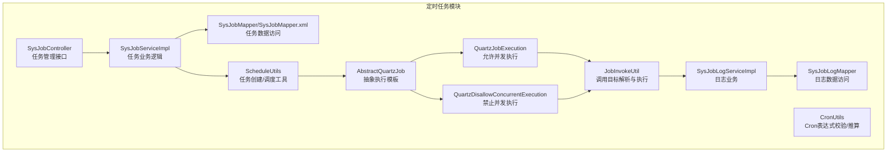
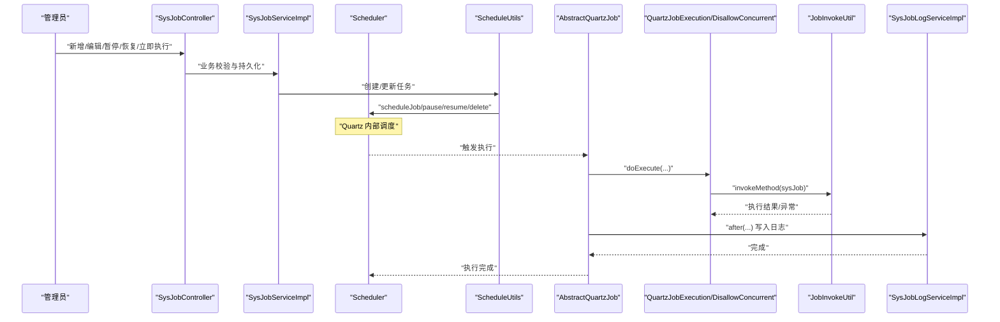
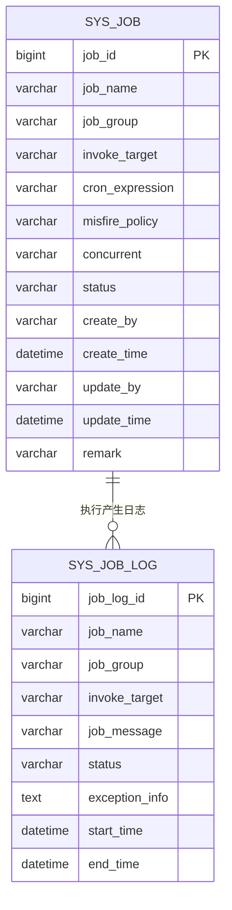
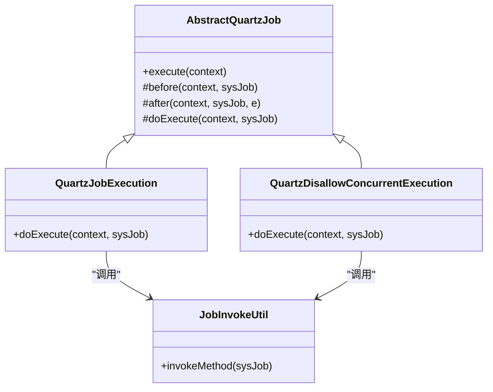
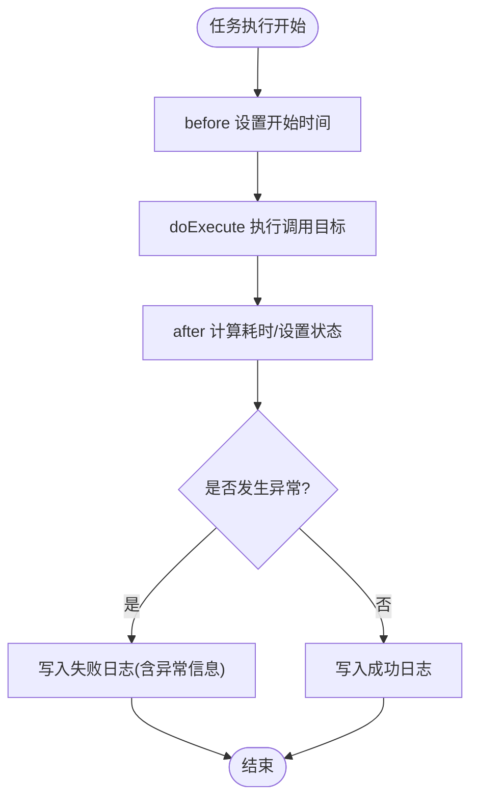
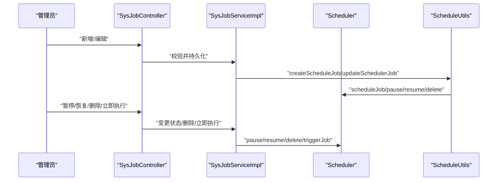
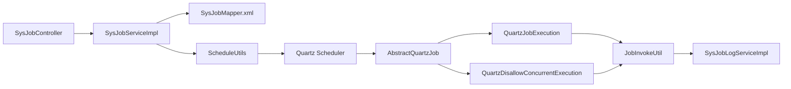

# 定时任务表结构

<cite>
**本文引用的文件**
- [SysJob.java](file://ruoyi-quartz/src/main/java/com/ruoyi/quartz/domain/SysJob.java)
- [SysJobLog.java](file://ruoyi-quartz/src/main/java/com/ruoyi/quartz/domain/SysJobLog.java)
- [SysJobServiceImpl.java](file://ruoyi-quartz/src/main/java/com/ruoyi/quartz/service/impl/SysJobServiceImpl.java)
- [SysJobLogServiceImpl.java](file://ruoyi-quartz/src/main/java/com/ruoyi/quartz/service/impl/SysJobLogServiceImpl.java)
- [AbstractQuartzJob.java](file://ruoyi-quartz/src/main/java/com/ruoyi/quartz/util/AbstractQuartzJob.java)
- [QuartzDisallowConcurrentExecution.java](file://ruoyi-quartz/src/main/java/com/ruoyi/quartz/util/QuartzDisallowConcurrentExecution.java)
- [QuartzJobExecution.java](file://ruoyi-quartz/src/main/java/com/ruoyi/quartz/util/QuartzJobExecution.java)
- [CronUtils.java](file://ruoyi-quartz/src/main/java/com/ruoyi/quartz/util/CronUtils.java)
- [ScheduleUtils.java](file://ruoyi-quartz/src/main/java/com/ruoyi/quartz/util/ScheduleUtils.java)
- [JobInvokeUtil.java](file://ruoyi-quartz/src/main/java/com/ruoyi/quartz/util/JobInvokeUtil.java)
- [ScheduleConstants.java](file://ruoyi-common/src/main/java/com/ruoyi/common/constant/ScheduleConstants.java)
- [SysJobController.java](file://ruoyi-quartz/src/main/java/com/ruoyi/quartz/controller/SysJobController.java)
- [SysJobMapper.java](file://ruoyi-quartz/src/main/java/com/ruoyi/quartz/mapper/SysJobMapper.java)
- [SysJobLogMapper.java](file://ruoyi-quartz/src/main/java/com/ruoyi/quartz/mapper/SysJobLogMapper.java)
- [SysJobMapper.xml](file://ruoyi-quartz/src/main/resources/mapper/quartz/SysJobMapper.xml)
- [quartz.sql](file://sql/quartz.sql)
</cite>

## 目录
1. [简介](#简介)
2. [项目结构](#项目结构)
3. [核心组件](#核心组件)
4. [架构总览](#架构总览)
5. [详细组件分析](#详细组件分析)
6. [依赖分析](#依赖分析)
7. [性能考量](#性能考量)
8. [故障排查指南](#故障排查指南)
9. [结论](#结论)
10. [附录](#附录)

## 简介
本文围绕 RuoYi 系统的定时任务表进行系统化梳理，重点覆盖以下内容：
- 定时任务表（sys_job）与定时任务日志表（sys_job_log）的设计与字段含义
- 任务调度的核心字段：任务名称、任务组、调用目标、Cron 表达式、执行策略
- 并发控制、错误处理与重试机制的实现原理
- 任务日志的完整记录机制：执行状态、异常信息、执行时间统计
- 性能优化、负载均衡与故障恢复策略
- 企业应用中的最佳实践与扩展性建议

## 项目结构
定时任务模块位于 ruoyi-quartz 子工程，采用“领域模型 + 控制器 + 服务 + 工具 + 映射器”的分层设计，配合 Quartz 调度引擎完成任务的注册、执行与日志记录。

图表来源
- [SysJobController.java:1-249](file://ruoyi-quartz/src/main/java/com/ruoyi/quartz/controller/SysJobController.java#L1-249)
- [SysJobServiceImpl.java:1-263](file://ruoyi-quartz/src/main/java/com/ruoyi/quartz/service/impl/SysJobServiceImpl.java#L1-263)
- [SysJobMapper.java:1-68](file://ruoyi-quartz/src/main/java/com/ruoyi/quartz/mapper/SysJobMapper.java#L1-68)
- [SysJobMapper.xml:1-111](file://ruoyi-quartz/src/main/resources/mapper/quartz/SysJobMapper.xml#L1-111)
- [ScheduleUtils.java:1-141](file://ruoyi-quartz/src/main/java/com/ruoyi/quartz/util/ScheduleUtils.java#L1-141)
- [AbstractQuartzJob.java:1-107](file://ruoyi-quartz/src/main/java/com/ruoyi/quartz/util/AbstractQuartzJob.java#L1-107)
- [QuartzJobExecution.java:1-20](file://ruoyi-quartz/src/main/java/com/ruoyi/quartz/util/QuartzJobExecution.java#L1-20)
- [QuartzDisallowConcurrentExecution.java:1-22](file://ruoyi-quartz/src/main/java/com/ruoyi/quartz/util/QuartzDisallowConcurrentExecution.java#L1-22)
- [JobInvokeUtil.java:1-183](file://ruoyi-quartz/src/main/java/com/ruoyi/quartz/util/JobInvokeUtil.java#L1-183)
- [CronUtils.java:1-95](file://ruoyi-quartz/src/main/java/com/ruoyi/quartz/util/CronUtils.java#L1-95)
- [SysJobLogServiceImpl.java:1-89](file://ruoyi-quartz/src/main/java/com/ruoyi/quartz/service/impl/SysJobLogServiceImpl.java#L1-89)
- [SysJobLogMapper.java:1-65](file://ruoyi-quartz/src/main/java/com/ruoyi/quartz/mapper/SysJobLogMapper.java#L1-65)

章节来源
- [SysJobController.java:1-249](file://ruoyi-quartz/src/main/java/com/ruoyi/quartz/controller/SysJobController.java#L1-249)
- [SysJobServiceImpl.java:1-263](file://ruoyi-quartz/src/main/java/com/ruoyi/quartz/service/impl/SysJobServiceImpl.java#L1-263)
- [SysJobMapper.java:1-68](file://ruoyi-quartz/src/main/java/com/ruoyi/quartz/mapper/SysJobMapper.java#L1-68)
- [SysJobMapper.xml:1-111](file://ruoyi-quartz/src/main/resources/mapper/quartz/SysJobMapper.xml#L1-111)
- [ScheduleUtils.java:1-141](file://ruoyi-quartz/src/main/java/com/ruoyi/quartz/util/ScheduleUtils.java#L1-141)
- [AbstractQuartzJob.java:1-107](file://ruoyi-quartz/src/main/java/com/ruoyi/quartz/util/AbstractQuartzJob.java#L1-107)
- [QuartzJobExecution.java:1-20](file://ruoyi-quartz/src/main/java/com/ruoyi/quartz/util/QuartzJobExecution.java#L1-20)
- [QuartzDisallowConcurrentExecution.java:1-22](file://ruoyi-quartz/src/main/java/com/ruoyi/quartz/util/QuartzDisallowConcurrentExecution.java#L1-22)
- [JobInvokeUtil.java:1-183](file://ruoyi-quartz/src/main/java/com/ruoyi/quartz/util/JobInvokeUtil.java#L1-183)
- [CronUtils.java:1-95](file://ruoyi-quartz/src/main/java/com/ruoyi/quartz/util/CronUtils.java#L1-95)
- [SysJobLogServiceImpl.java:1-89](file://ruoyi-quartz/src/main/java/com/ruoyi/quartz/service/impl/SysJobLogServiceImpl.java#L1-89)
- [SysJobLogMapper.java:1-65](file://ruoyi-quartz/src/main/java/com/ruoyi/quartz/mapper/SysJobLogMapper.java#L1-65)

## 核心组件
- 任务实体与日志实体：SysJob、SysJobLog
- 控制器：SysJobController（任务 CRUD、状态变更、立即执行、导出、校验）
- 服务层：SysJobServiceImpl（任务生命周期管理）、SysJobLogServiceImpl（日志 CRUD）
- 调度工具：ScheduleUtils（创建/更新/暂停/恢复任务）、CronUtils（表达式校验/推算）
- 执行模板：AbstractQuartzJob（统一前置/后置处理与日志落库）、具体执行类（允许/禁止并发）
- 调用解析：JobInvokeUtil（解析 invokeTarget，支持静态/非静态方法、带参调用）
- 常量：ScheduleConstants（Misfire 策略、任务状态）

章节来源
- [SysJob.java:1-169](file://ruoyi-quartz/src/main/java/com/ruoyi/quartz/domain/SysJob.java#L1-169)
- [SysJobLog.java:1-156](file://ruoyi-quartz/src/main/java/com/ruoyi/quartz/domain/SysJobLog.java#L1-156)
- [SysJobController.java:1-249](file://ruoyi-quartz/src/main/java/com/ruoyi/quartz/controller/SysJobController.java#L1-249)
- [SysJobServiceImpl.java:1-263](file://ruoyi-quartz/src/main/java/com/ruoyi/quartz/service/impl/SysJobServiceImpl.java#L1-263)
- [SysJobLogServiceImpl.java:1-89](file://ruoyi-quartz/src/main/java/com/ruoyi/quartz/service/impl/SysJobLogServiceImpl.java#L1-89)
- [ScheduleUtils.java:1-141](file://ruoyi-quartz/src/main/java/com/ruoyi/quartz/util/ScheduleUtils.java#L1-141)
- [AbstractQuartzJob.java:1-107](file://ruoyi-quartz/src/main/java/com/ruoyi/quartz/util/AbstractQuartzJob.java#L1-107)
- [QuartzJobExecution.java:1-20](file://ruoyi-quartz/src/main/java/com/ruoyi/quartz/util/QuartzJobExecution.java#L1-20)
- [QuartzDisallowConcurrentExecution.java:1-22](file://ruoyi-quartz/src/main/java/com/ruoyi/quartz/util/QuartzDisallowConcurrentExecution.java#L1-22)
- [JobInvokeUtil.java:1-183](file://ruoyi-quartz/src/main/java/com/ruoyi/quartz/util/JobInvokeUtil.java#L1-183)
- [CronUtils.java:1-95](file://ruoyi-quartz/src/main/java/com/ruoyi/quartz/util/CronUtils.java#L1-95)
- [ScheduleConstants.java:1-51](file://ruoyi-common/src/main/java/com/ruoyi/common/constant/ScheduleConstants.java#L1-51)

## 架构总览
定时任务从“配置—注册—执行—记录”闭环流转，Quartz 负责调度，RuoYi 在其之上提供安全校验、白名单限制、日志落库与状态管理。

图表来源
- [SysJobController.java:1-249](file://ruoyi-quartz/src/main/java/com/ruoyi/quartz/controller/SysJobController.java#L1-249)
- [SysJobServiceImpl.java:1-263](file://ruoyi-quartz/src/main/java/com/ruoyi/quartz/service/impl/SysJobServiceImpl.java#L1-263)
- [ScheduleUtils.java:1-141](file://ruoyi-quartz/src/main/java/com/ruoyi/quartz/util/ScheduleUtils.java#L1-141)
- [AbstractQuartzJob.java:1-107](file://ruoyi-quartz/src/main/java/com/ruoyi/quartz/util/AbstractQuartzJob.java#L1-107)
- [QuartzJobExecution.java:1-20](file://ruoyi-quartz/src/main/java/com/ruoyi/quartz/util/QuartzJobExecution.java#L1-20)
- [QuartzDisallowConcurrentExecution.java:1-22](file://ruoyi-quartz/src/main/java/com/ruoyi/quartz/util/QuartzDisallowConcurrentExecution.java#L1-22)
- [JobInvokeUtil.java:1-183](file://ruoyi-quartz/src/main/java/com/ruoyi/quartz/util/JobInvokeUtil.java#L1-183)
- [SysJobLogServiceImpl.java:1-89](file://ruoyi-quartz/src/main/java/com/ruoyi/quartz/service/impl/SysJobLogServiceImpl.java#L1-89)

## 详细组件分析

### 数据模型与表结构
- sys_job（定时任务表）
  - 关键字段：任务ID、任务名称、任务组、调用目标字符串、Cron 表达式、Misfire 策略、并发策略、任务状态、创建/更新信息
  - 作用：持久化任务配置，驱动 Quartz 注册与调度
- sys_job_log（定时任务日志表）
  - 关键字段：日志ID、任务名称/组、调用目标、日志信息、执行状态、异常信息、开始/结束时间
  - 作用：记录每次任务执行的生命周期与结果

图表来源
- [SysJob.java:1-169](file://ruoyi-quartz/src/main/java/com/ruoyi/quartz/domain/SysJob.java#L1-169)
- [SysJobLog.java:1-156](file://ruoyi-quartz/src/main/java/com/ruoyi/quartz/domain/SysJobLog.java#L1-156)
- [SysJobMapper.xml:23-44](file://ruoyi-quartz/src/main/resources/mapper/quartz/SysJobMapper.xml#L23-44)
- [quartz.sql:14-28](file://sql/quartz.sql#L14-28)

章节来源
- [SysJob.java:1-169](file://ruoyi-quartz/src/main/java/com/ruoyi/quartz/domain/SysJob.java#L1-169)
- [SysJobLog.java:1-156](file://ruoyi-quartz/src/main/java/com/ruoyi/quartz/domain/SysJobLog.java#L1-156)
- [SysJobMapper.xml:1-111](file://ruoyi-quartz/src/main/resources/mapper/quartz/SysJobMapper.xml#L1-111)
- [quartz.sql:14-28](file://sql/quartz.sql#L14-28)

### 核心字段与语义
- 任务名称：用于标识任务用途，支持模糊检索
- 任务组：用于分组管理与批量操作
- 调用目标：字符串形式的目标方法，支持 Bean 名称或全限定类名，支持方法参数解析
- Cron 表达式：精确控制执行周期；提供表达式有效性校验与近期触发时间推算
- 执行策略（Misfire 策略）：默认/忽略/触发一次/不触发，影响错过触发时机的处理
- 并发策略：允许并发/禁止并发，对应不同的执行类
- 任务状态：正常/暂停，支持动态切换

章节来源
- [SysJob.java:24-54](file://ruoyi-quartz/src/main/java/com/ruoyi/quartz/domain/SysJob.java#L24-54)
- [ScheduleConstants.java:15-25](file://ruoyi-common/src/main/java/com/ruoyi/common/constant/ScheduleConstants.java#L15-25)
- [ScheduleUtils.java:103-120](file://ruoyi-quartz/src/main/java/com/ruoyi/quartz/util/ScheduleUtils.java#L103-120)
- [CronUtils.java:26-48](file://ruoyi-quartz/src/main/java/com/ruoyi/quartz/util/CronUtils.java#L26-48)

### 并发控制与执行流程
- 并发控制
  - 允许并发：QuartzJobExecution
  - 禁止并发：QuartzDisallowConcurrentExecution（@DisallowConcurrentExecution）
- 执行模板
  - AbstractQuartzJob：统一 before/after 生命周期，在 after 中计算耗时、写入日志
- 调用解析
  - JobInvokeUtil：解析 invokeTarget，支持静态/非静态、带参调用，按类型转换参数

图表来源
- [AbstractQuartzJob.java:1-107](file://ruoyi-quartz/src/main/java/com/ruoyi/quartz/util/AbstractQuartzJob.java#L1-107)
- [QuartzJobExecution.java:1-20](file://ruoyi-quartz/src/main/java/com/ruoyi/quartz/util/QuartzJobExecution.java#L1-20)
- [QuartzDisallowConcurrentExecution.java:1-22](file://ruoyi-quartz/src/main/java/com/ruoyi/quartz/util/QuartzDisallowConcurrentExecution.java#L1-22)
- [JobInvokeUtil.java:1-183](file://ruoyi-quartz/src/main/java/com/ruoyi/quartz/util/JobInvokeUtil.java#L1-183)

章节来源
- [AbstractQuartzJob.java:1-107](file://ruoyi-quartz/src/main/java/com/ruoyi/quartz/util/AbstractQuartzJob.java#L1-107)
- [QuartzJobExecution.java:1-20](file://ruoyi-quartz/src/main/java/com/ruoyi/quartz/util/QuartzJobExecution.java#L1-20)
- [QuartzDisallowConcurrentExecution.java:1-22](file://ruoyi-quartz/src/main/java/com/ruoyi/quartz/util/QuartzDisallowConcurrentExecution.java#L1-22)
- [JobInvokeUtil.java:1-183](file://ruoyi-quartz/src/main/java/com/ruoyi/quartz/util/JobInvokeUtil.java#L1-183)

### 错误处理与重试机制
- 错误处理
  - AbstractQuartzJob.after 捕获异常，记录异常信息与执行状态
  - 异常信息截断至最大长度，避免日志过大
- 重试机制
  - 当前实现未内置自动重试；可通过在调用目标方法内部实现重试策略，或在 Misfire 策略中选择“忽略/触发一次”以提升容错
- 白名单与安全
  - ScheduleUtils.whiteList 对调用目标进行包名白名单校验，避免任意代码执行风险

章节来源
- [AbstractQuartzJob.java:46-96](file://ruoyi-quartz/src/main/java/com/ruoyi/quartz/util/AbstractQuartzJob.java#L46-96)
- [ScheduleUtils.java:128-140](file://ruoyi-quartz/src/main/java/com/ruoyi/quartz/util/ScheduleUtils.java#L128-140)

### 任务日志记录机制
- 记录内容
  - 任务名称/组、调用目标、执行状态（成功/失败）、异常信息、开始/结束时间、耗时统计
- 写入时机
  - 执行完成后由 after 回调统一写入 sys_job_log
- 查询与清理
  - SysJobLogServiceImpl 提供列表、详情、批量删除、清空等能力

图表来源
- [AbstractQuartzJob.java:32-96](file://ruoyi-quartz/src/main/java/com/ruoyi/quartz/util/AbstractQuartzJob.java#L32-96)
- [SysJobLogServiceImpl.java:51-55](file://ruoyi-quartz/src/main/java/com/ruoyi/quartz/service/impl/SysJobLogServiceImpl.java#L51-55)

章节来源
- [SysJobLog.java:18-50](file://ruoyi-quartz/src/main/java/com/ruoyi/quartz/domain/SysJobLog.java#L18-50)
- [SysJobLogServiceImpl.java:1-89](file://ruoyi-quartz/src/main/java/com/ruoyi/quartz/service/impl/SysJobLogServiceImpl.java#L1-89)
- [AbstractQuartzJob.java:75-96](file://ruoyi-quartz/src/main/java/com/ruoyi/quartz/util/AbstractQuartzJob.java#L75-96)

### 任务生命周期与状态管理
- 初始化：项目启动时清空并重建所有任务
- 新增/编辑：校验 Cron 表达式与调用目标白名单，创建/更新 Quartz 任务
- 暂停/恢复：更新状态并调用 Quartz 暂停/恢复
- 删除：删除数据库记录并移除对应 trigger
- 立即执行：向 Quartz 发送 trigger，绕过原计划

图表来源
- [SysJobController.java:135-210](file://ruoyi-quartz/src/main/java/com/ruoyi/quartz/controller/SysJobController.java#L135-210)
- [SysJobServiceImpl.java:40-250](file://ruoyi-quartz/src/main/java/com/ruoyi/quartz/service/impl/SysJobServiceImpl.java#L40-250)
- [ScheduleUtils.java:60-98](file://ruoyi-quartz/src/main/java/com/ruoyi/quartz/util/ScheduleUtils.java#L60-98)

章节来源
- [SysJobServiceImpl.java:39-250](file://ruoyi-quartz/src/main/java/com/ruoyi/quartz/service/impl/SysJobServiceImpl.java#L39-250)
- [SysJobController.java:94-116](file://ruoyi-quartz/src/main/java/com/ruoyi/quartz/controller/SysJobController.java#L94-116)

### Cron 表达式工具
- 校验：isValid/getInvalidMessage
- 推算：getNextExecution（下一次执行时间）
- 近期触发：getRecentTriggerTime（最近 N 次执行时间）

章节来源
- [CronUtils.java:26-93](file://ruoyi-quartz/src/main/java/com/ruoyi/quartz/util/CronUtils.java#L26-93)

## 依赖分析
- 控制器依赖服务层，服务层依赖映射器与调度工具
- 执行链路：控制器 → 服务 → 调度工具 → Quartz → 执行模板 → 调用解析 → 日志服务
- 常量与策略：ScheduleConstants 提供 Misfire 策略与状态枚举

图表来源
- [SysJobController.java:1-249](file://ruoyi-quartz/src/main/java/com/ruoyi/quartz/controller/SysJobController.java#L1-249)
- [SysJobServiceImpl.java:1-263](file://ruoyi-quartz/src/main/java/com/ruoyi/quartz/service/impl/SysJobServiceImpl.java#L1-263)
- [SysJobMapper.xml:1-111](file://ruoyi-quartz/src/main/resources/mapper/quartz/SysJobMapper.xml#L1-111)
- [ScheduleUtils.java:1-141](file://ruoyi-quartz/src/main/java/com/ruoyi/quartz/util/ScheduleUtils.java#L1-141)
- [AbstractQuartzJob.java:1-107](file://ruoyi-quartz/src/main/java/com/ruoyi/quartz/util/AbstractQuartzJob.java#L1-107)
- [QuartzJobExecution.java:1-20](file://ruoyi-quartz/src/main/java/com/ruoyi/quartz/util/QuartzJobExecution.java#L1-20)
- [QuartzDisallowConcurrentExecution.java:1-22](file://ruoyi-quartz/src/main/java/com/ruoyi/quartz/util/QuartzDisallowConcurrentExecution.java#L1-22)
- [JobInvokeUtil.java:1-183](file://ruoyi-quartz/src/main/java/com/ruoyi/quartz/util/JobInvokeUtil.java#L1-183)
- [SysJobLogServiceImpl.java:1-89](file://ruoyi-quartz/src/main/java/com/ruoyi/quartz/service/impl/SysJobLogServiceImpl.java#L1-89)

章节来源
- [ScheduleConstants.java:1-51](file://ruoyi-common/src/main/java/com/ruoyi/common/constant/ScheduleConstants.java#L1-51)

## 性能考量
- 并发策略选择
  - CPU 密集型任务建议禁止并发，避免资源争抢
  - IO 密集型任务可允许并发，提升吞吐
- Cron 设计
  - 避免过于密集的触发频率；合理利用 Misfire 策略（忽略/触发一次），减少堆积
- 日志写入
  - 日志表写入为同步落库，建议控制异常信息长度与日志量，必要时异步化或降采样
- 资源隔离
  - 大批量任务建议分批导入与分组管理，避免一次性注册过多任务导致内存与调度压力

## 故障排查指南
- Cron 表达式无效
  - 使用校验接口或工具方法确认表达式格式
- 调用目标不可执行
  - 检查白名单与关键字过滤（RMI/LDAP/HTTP），确认目标字符串格式与参数类型
- 任务未触发或已过期
  - 使用“立即执行”接口验证任务是否存在；检查任务状态与 Quartz 触发器状态
- 并发冲突
  - 若任务长时间未结束，检查是否被禁止并发的任务阻塞；必要时调整并发策略
- 日志缺失
  - 确认执行模板是否正常执行到 after；检查日志服务是否可用

章节来源
- [SysJobController.java:135-210](file://ruoyi-quartz/src/main/java/com/ruoyi/quartz/controller/SysJobController.java#L135-210)
- [SysJobServiceImpl.java:178-195](file://ruoyi-quartz/src/main/java/com/ruoyi/quartz/service/impl/SysJobServiceImpl.java#L178-195)
- [AbstractQuartzJob.java:46-96](file://ruoyi-quartz/src/main/java/com/ruoyi/quartz/util/AbstractQuartzJob.java#L46-96)
- [ScheduleUtils.java:128-140](file://ruoyi-quartz/src/main/java/com/ruoyi/quartz/util/ScheduleUtils.java#L128-140)

## 结论
RuoYi 的定时任务体系以 Quartz 为核心，结合自研的安全校验、白名单与日志落库，形成“配置—注册—执行—记录”的完整闭环。通过合理的并发策略、Misfire 策略与 Cron 设计，可在保证稳定性的同时兼顾性能与可观测性。建议在生产环境中进一步完善重试策略、异步日志与监控告警，以满足企业级高可用需求。

## 附录
- 数据库脚本
  - Quartz 内置表结构参考 quartz.sql，确保调度引擎表一致
- 常用接口
  - 任务列表、导出、删除、状态变更、立即执行、表达式校验、近期触发时间查询

章节来源
- [quartz.sql:14-172](file://sql/quartz.sql#L14-172)
- [SysJobController.java:52-247](file://ruoyi-quartz/src/main/java/com/ruoyi/quartz/controller/SysJobController.java#L52-247)