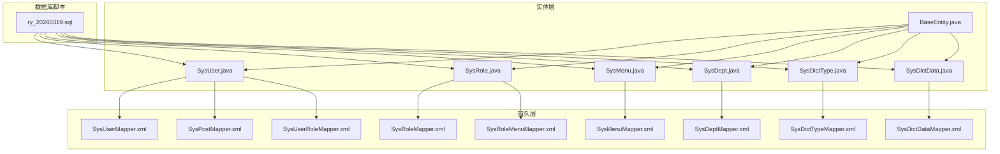
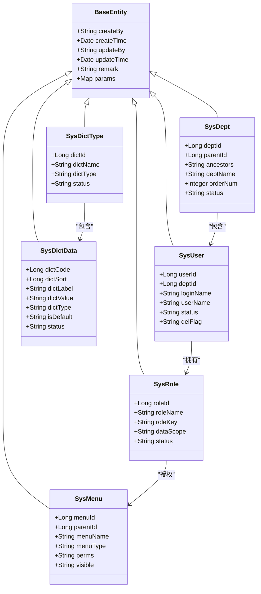

# 数据库表结构

<cite>
**本文引用的文件**
- [ry_20260319.sql](file://sql/ry_20260319.sql)
- [SysUser.java](file://ruoyi-common/src/main/java/com/ruoyi/common/core/domain/entity/SysUser.java)
- [SysRole.java](file://ruoyi-common/src/main/java/com/ruoyi/common/core/domain/entity/SysRole.java)
- [SysMenu.java](file://ruoyi-common/src/main/java/com/ruoyi/common/core/domain/entity/SysMenu.java)
- [SysDept.java](file://ruoyi-common/src/main/java/com/ruoyi/common/core/domain/entity/SysDept.java)
- [SysDictType.java](file://ruoyi-common/src/main/java/com/ruoyi/common/core/domain/entity/SysDictType.java)
- [SysDictData.java](file://ruoyi-common/src/main/java/com/ruoyi/common/core/domain/entity/SysDictData.java)
- [BaseEntity.java](file://ruoyi-common/src/main/java/com/ruoyi/common/core/domain/BaseEntity.java)
- [SysUserMapper.xml](file://ruoyi-system/src/main/resources/mapper/system/SysUserMapper.xml)
- [SysRoleMapper.xml](file://ruoyi-system/src/main/resources/mapper/system/SysRoleMapper.xml)
- [SysMenuMapper.xml](file://ruoyi-system/src/main/resources/mapper/system/SysMenuMapper.xml)
- [SysDeptMapper.xml](file://ruoyi-system/src/main/resources/mapper/system/SysDeptMapper.xml)
- [SysDictTypeMapper.xml](file://ruoyi-system/src/main/resources/mapper/system/SysDictTypeMapper.xml)
- [SysDictDataMapper.xml](file://ruoyi-system/src/main/resources/mapper/system/SysDictDataMapper.xml)
- [SysPostMapper.xml](file://ruoyi-system/src/main/resources/mapper/system/SysPostMapper.xml)
- [SysUserRoleMapper.xml](file://ruoyi-system/src/main/resources/mapper/system/SysUserRoleMapper.xml)
- [SysRoleMenuMapper.xml](file://ruoyi-system/src/main/resources/mapper/system/SysRoleMenuMapper.xml)
</cite>

## 目录
1. [简介](#简介)
2. [项目结构](#项目结构)
3. [核心组件](#核心组件)
4. [架构总览](#架构总览)
5. [详细组件分析](#详细组件分析)
6. [依赖分析](#依赖分析)
7. [性能考量](#性能考量)
8. [故障排查指南](#故障排查指南)
9. [结论](#结论)
10. [附录](#附录)

## 简介
本文件面向RuoYi系统的核心业务表结构，围绕21个关键表进行系统化梳理，重点覆盖用户、角色、菜单、部门、岗位、数据字典、系统配置、日志、定时任务、通知公告等模块。文档从表结构设计、字段定义、约束与索引、主外键关系、关联规则、SQL解析与注释说明、最佳实践、性能优化与扩展性等方面展开，帮助开发者与DBA快速理解与高效维护系统数据层。

## 项目结构
- 数据库脚本位于 sql/ry_20260319.sql，包含完整的建表DDL与初始化数据。
- 实体类位于 ruoyi-common 的 entity 包中，统一继承 BaseEntity，提供通用的审计字段与时间格式化。
- MyBatis映射位于 ruoyi-system 的 mapper/system 目录，涵盖各核心表的CRUD与关联查询。

图表来源
- [ry_20260319.sql](file://sql/ry_20260319.sql)
- [BaseEntity.java](file://ruoyi-common/src/main/java/com/ruoyi/common/core/domain/BaseEntity.java)
- [SysUser.java](file://ruoyi-common/src/main/java/com/ruoyi/common/core/domain/entity/SysUser.java)
- [SysRole.java](file://ruoyi-common/src/main/java/com/ruoyi/common/core/domain/entity/SysRole.java)
- [SysMenu.java](file://ruoyi-common/src/main/java/com/ruoyi/common/core/domain/entity/SysMenu.java)
- [SysDept.java](file://ruoyi-common/src/main/java/com/ruoyi/common/core/domain/entity/SysDept.java)
- [SysDictType.java](file://ruoyi-common/src/main/java/com/ruoyi/common/core/domain/entity/SysDictType.java)
- [SysDictData.java](file://ruoyi-common/src/main/java/com/ruoyi/common/core/domain/entity/SysDictData.java)
- [SysUserMapper.xml](file://ruoyi-system/src/main/resources/mapper/system/SysUserMapper.xml)
- [SysRoleMapper.xml](file://ruoyi-system/src/main/resources/mapper/system/SysRoleMapper.xml)
- [SysMenuMapper.xml](file://ruoyi-system/src/main/resources/mapper/system/SysMenuMapper.xml)
- [SysDeptMapper.xml](file://ruoyi-system/src/main/resources/mapper/system/SysDeptMapper.xml)
- [SysDictTypeMapper.xml](file://ruoyi-system/src/main/resources/mapper/system/SysDictTypeMapper.xml)
- [SysDictDataMapper.xml](file://ruoyi-system/src/main/resources/mapper/system/SysDictDataMapper.xml)
- [SysPostMapper.xml](file://ruoyi-system/src/main/resources/mapper/system/SysPostMapper.xml)
- [SysUserRoleMapper.xml](file://ruoyi-system/src/main/resources/mapper/system/SysUserRoleMapper.xml)
- [SysRoleMenuMapper.xml](file://ruoyi-system/src/main/resources/mapper/system/SysRoleMenuMapper.xml)

章节来源
- [ry_20260319.sql](file://sql/ry_20260319.sql)
- [BaseEntity.java](file://ruoyi-common/src/main/java/com/ruoyi/common/core/domain/BaseEntity.java)

## 核心组件
本节概述21个核心业务表的职责与相互关系，并给出主键、外键与索引策略的总体说明。

- 部门表 sys_dept：组织架构树形结构，支持祖先链与层级查询。
- 用户表 sys_user：用户主体信息，关联部门与岗位，支持软删除与审计字段。
- 岗位表 sys_post：岗位维度，支持用户与岗位的多对多。
- 角色表 sys_role：角色主体，支持数据权限范围与状态控制。
- 菜单表 sys_menu：菜单与按钮权限树，支持可见性与权限标识。
- 用户-角色关联表 sys_user_role：用户与角色的多对多。
- 角色-菜单关联表 sys_role_menu：角色与菜单的多对多。
- 角色-部门关联表 sys_role_dept：角色与部门的多对多。
- 用户-岗位关联表 sys_user_post：用户与岗位的多对多。
- 操作日志表 sys_oper_log：操作审计，包含业务类型、耗时、状态等。
- 字典类型表 sys_dict_type：字典分类，唯一约束保证类型名唯一。
- 字典数据表 sys_dict_data：字典明细，按类型分组，支持默认标记与状态。
- 参数配置表 sys_config：系统参数，区分内置与自定义。
- 登录日志表 sys_logininfor：登录行为记录，支持状态与时间索引。
- 在线用户表 sys_user_online：在线会话，支持序列化会话数据。
- 定时任务表 sys_job：Quartz任务调度，支持并发策略与状态。
- 定时任务日志表 sys_job_log：任务执行日志。
- 通知公告表 sys_notice：公告与通知，支持内容与状态。
- 公告已读记录表 sys_notice_read：用户对公告的已读追踪。
- 代码生成业务表 gen_table：代码生成元数据。
- 代码生成业务表字段 gen_table_column：代码生成字段元数据。

章节来源
- [ry_20260319.sql](file://sql/ry_20260319.sql)

## 架构总览
下图展示核心表之间的实体关系与关联规则，体现用户-角色-菜单-部门-岗位的权限与组织关系。

```mermaid
erDiagram
SYS_DEPT {
bigint dept_id PK
bigint parent_id
varchar ancestors
varchar dept_name
int order_num
varchar leader
varchar phone
varchar email
char status
char del_flag
}
SYS_USER {
bigint user_id PK
bigint dept_id FK
varchar login_name
varchar user_name
varchar user_type
varchar email
varchar phonenumber
char sex
varchar avatar
varchar password
varchar salt
char status
char del_flag
varchar login_ip
datetime login_date
datetime pwd_update_date
}
SYS_POST {
bigint post_id PK
varchar post_code
varchar post_name
int post_sort
char status
}
SYS_ROLE {
bigint role_id PK
varchar role_name
varchar role_key
int role_sort
char data_scope
char status
char del_flag
}
SYS_MENU {
bigint menu_id PK
varchar menu_name
bigint parent_id
int order_num
varchar url
varchar target
char menu_type
char visible
char is_refresh
varchar perms
varchar icon
}
SYS_USER_ROLE {
bigint user_id PK
bigint role_id PK
}
SYS_ROLE_MENU {
bigint role_id PK
bigint menu_id PK
}
SYS_ROLE_DEPT {
bigint role_id PK
bigint dept_id PK
}
SYS_USER_POST {
bigint user_id PK
bigint post_id PK
}
SYS_DICT_TYPE {
bigint dict_id PK
varchar dict_name
varchar dict_type UK
char status
}
SYS_DICT_DATA {
bigint dict_code PK
int dict_sort
varchar dict_label
varchar dict_value
varchar dict_type
varchar css_class
varchar list_class
char is_default
char status
}
SYS_CONFIG {
int config_id PK
varchar config_name
varchar config_key
varchar config_value
char config_type
}
SYS_OPER_LOG {
bigint oper_id PK
varchar title
int business_type
varchar method
varchar request_method
int operator_type
varchar oper_name
varchar dept_name
varchar oper_url
varchar oper_ip
varchar oper_location
varchar oper_param
varchar json_result
int status
varchar error_msg
datetime oper_time
bigint cost_time
}
SYS_LOGININFOr {
bigint info_id PK
varchar login_name
varchar ipaddr
varchar login_location
varchar browser
varchar os
char status
varchar msg
datetime login_time
}
SYS_USER_ONLINE {
varchar sessionId PK
varchar login_name
varchar dept_name
varchar ipaddr
varchar login_location
varchar browser
varchar os
varchar status
datetime start_timestamp
datetime last_access_time
int expire_time
blob session_data
}
SYS_JOB {
bigint job_id PK
varchar job_name
varchar job_group
varchar invoke_target
varchar cron_expression
varchar misfire_policy
char concurrent
char status
}
SYS_JOB_LOG {
bigint job_log_id PK
varchar job_name
varchar job_group
varchar invoke_target
varchar job_message
char status
varchar exception_info
datetime start_time
datetime end_time
}
SYS_NOTICE {
int notice_id PK
varchar notice_title
char notice_type
longblob notice_content
char status
}
SYS_NOTICE_READ {
bigint read_id PK
int notice_id
bigint user_id
datetime read_time
}
GEN_TABLE {
bigint table_id PK
varchar table_name
varchar table_comment
varchar sub_table_name
varchar sub_table_fk_name
varchar class_name
varchar tpl_category
varchar package_name
varchar module_name
varchar business_name
varchar function_name
varchar function_author
int form_col_num
char gen_type
varchar gen_path
varchar options
}
GEN_TABLE_COLUMN {
bigint column_id PK
bigint table_id
varchar column_name
varchar column_comment
varchar column_type
varchar java_type
varchar java_field
char is_pk
char is_increment
char is_required
char is_insert
char is_edit
char is_list
char is_query
varchar query_type
varchar html_type
varchar dict_type
int sort
}
SYS_USER }o--o{ SYS_USER_ROLE : "拥有"
SYS_ROLE }o--o{ SYS_ROLE_MENU : "授权"
SYS_ROLE }o--o{ SYS_ROLE_DEPT : "管辖"
SYS_USER }o--o{ SYS_USER_POST : "承担"
SYS_DEPT ||--o{ SYS_USER : "包含"
SYS_DICT_TYPE ||--o{ SYS_DICT_DATA : "包含"
```

图表来源
- [ry_20260319.sql](file://sql/ry_20260319.sql)

## 详细组件分析

### 部门表 sys_dept
- 设计要点
  - 主键：dept_id（自增）
  - 层级：parent_id + ancestors 组合实现树形结构与祖先链查询
  - 状态：status（0正常 1停用），del_flag（软删除）
  - 关联：与用户表通过 dept_id 关联
- 字段与类型
  - dept_id、parent_id、order_num、status、del_flag 等
- 约束与索引
  - 主键：PRIMARY KEY(dept_id)
  - 建议索引：parent_id、ancestors（用于层级查询与范围查询）
- 使用场景
  - 组织架构展示、数据权限按部门范围过滤、用户所属部门查询

章节来源
- [ry_20260319.sql](file://sql/ry_20260319.sql)
- [SysDept.java](file://ruoyi-common/src/main/java/com/ruoyi/common/core/domain/entity/SysDept.java)
- [SysDeptMapper.xml](file://ruoyi-system/src/main/resources/mapper/system/SysDeptMapper.xml)

### 用户表 sys_user
- 设计要点
  - 主键：user_id（自增）
  - 关联：dept_id（部门）、多个角色（通过 sys_user_role）、多个岗位（通过 sys_user_post）
  - 安全：password + salt，登录IP与时间记录，密码更新时间
  - 审计：create_by、create_time、update_by、update_time、remark
  - 软删除：del_flag
- 字段与类型
  - user_id、dept_id、login_name、user_name、email、phonenumber、sex、avatar、password、salt、status、del_flag、login_ip、login_date、pwd_update_date、remark
- 约束与索引
  - 主键：PRIMARY KEY(user_id)
  - 建议索引：login_name（唯一或唯一约束）、dept_id、status、del_flag
- 使用场景
  - 用户登录、权限分配、部门与岗位关联、审计与统计

章节来源
- [ry_20260319.sql](file://sql/ry_20260319.sql)
- [SysUser.java](file://ruoyi-common/src/main/java/com/ruoyi/common/core/domain/entity/SysUser.java)
- [SysUserMapper.xml](file://ruoyi-system/src/main/resources/mapper/system/SysUserMapper.xml)
- [BaseEntity.java](file://ruoyi-common/src/main/java/com/ruoyi/common/core/domain/BaseEntity.java)

### 岗位表 sys_post
- 设计要点
  - 主键：post_id（自增）
  - 关联：与用户通过 sys_user_post 多对多
  - 状态：status（0正常 1停用）
- 字段与类型
  - post_id、post_code、post_name、post_sort、status、remark
- 约束与索引
  - 主键：PRIMARY KEY(post_id)
  - 建议索引：post_code（唯一或唯一约束）

章节来源
- [ry_20260319.sql](file://sql/ry_20260319.sql)
- [SysPostMapper.xml](file://ruoyi-system/src/main/resources/mapper/system/SysPostMapper.xml)

### 角色表 sys_role
- 设计要点
  - 主键：role_id（自增）
  - 数据权限：data_scope 支持多种范围（全部、自定义、本部门、本部门及以下、仅本人）
  - 状态：status（0正常 1停用），del_flag（软删除）
  - 关联：与用户（sys_user_role）、菜单（sys_role_menu）、部门（sys_role_dept）多对多
- 字段与类型
  - role_id、role_name、role_key、role_sort、data_scope、status、del_flag、remark
- 约束与索引
  - 主键：PRIMARY KEY(role_id)
  - 建议索引：role_key（唯一或唯一约束）

章节来源
- [ry_20260319.sql](file://sql/ry_20260319.sql)
- [SysRole.java](file://ruoyi-common/src/main/java/com/ruoyi/common/core/domain/entity/SysRole.java)
- [SysRoleMapper.xml](file://ruoyi-system/src/main/resources/mapper/system/SysRoleMapper.xml)

### 菜单表 sys_menu
- 设计要点
  - 主键：menu_id（自增）
  - 类型：menu_type（M目录、C菜单、F按钮），visible（0显示 1隐藏）
  - 权限：perms（权限标识），icon（图标）
  - 关联：与角色通过 sys_role_menu 多对多
- 字段与类型
  - menu_id、menu_name、parent_id、order_num、url、target、menu_type、visible、is_refresh、perms、icon、remark
- 约束与索引
  - 主键：PRIMARY KEY(menu_id)
  - 建议索引：parent_id、menu_type、visible

章节来源
- [ry_20260319.sql](file://sql/ry_20260319.sql)
- [SysMenu.java](file://ruoyi-common/src/main/java/com/ruoyi/common/core/domain/entity/SysMenu.java)
- [SysMenuMapper.xml](file://ruoyi-system/src/main/resources/mapper/system/SysMenuMapper.xml)

### 用户-角色关联表 sys_user_role
- 设计要点
  - 复合主键：(user_id, role_id)，实现用户与角色的多对多
- 字段与类型
  - user_id、role_id
- 约束与索引
  - 主键：PRIMARY KEY(user_id, role_id)

章节来源
- [ry_20260319.sql](file://sql/ry_20260319.sql)
- [SysUserRoleMapper.xml](file://ruoyi-system/src/main/resources/mapper/system/SysUserRoleMapper.xml)

### 角色-菜单关联表 sys_role_menu
- 设计要点
  - 复合主键：(role_id, menu_id)，实现角色与菜单的多对多
- 字段与类型
  - role_id、menu_id
- 约束与索引
  - 主键：PRIMARY KEY(role_id, menu_id)

章节来源
- [ry_20260319.sql](file://sql/ry_20260319.sql)
- [SysRoleMenuMapper.xml](file://ruoyi-system/src/main/resources/mapper/system/SysRoleMenuMapper.xml)

### 角色-部门关联表 sys_role_dept
- 设计要点
  - 复合主键：(role_id, dept_id)，实现角色对部门的数据权限
- 字段与类型
  - role_id、dept_id
- 约束与索引
  - 主键：PRIMARY KEY(role_id, dept_id)

章节来源
- [ry_20260319.sql](file://sql/ry_20260319.sql)

### 用户-岗位关联表 sys_user_post
- 设计要点
  - 复合主键：(user_id, post_id)，实现用户与岗位的多对多
- 字段与类型
  - user_id、post_id
- 约束与索引
  - 主键：PRIMARY KEY(user_id, post_id)

章节来源
- [ry_20260319.sql](file://sql/ry_20260319.sql)
- [SysPostMapper.xml](file://ruoyi-system/src/main/resources/mapper/system/SysPostMapper.xml)

### 操作日志表 sys_oper_log
- 设计要点
  - 主键：oper_id（自增）
  - 业务类型：business_type（0其它 1新增 2修改 3删除）
  - 性能：cost_time 记录耗时，便于性能分析
  - 索引：按 business_type、status、oper_time 建立索引
- 字段与类型
  - oper_id、title、business_type、method、request_method、operator_type、oper_name、dept_name、oper_url、oper_ip、oper_location、oper_param、json_result、status、error_msg、oper_time、cost_time
- 约束与索引
  - 主键：PRIMARY KEY(oper_id)
  - 索引：idx_sys_oper_log_bt、idx_sys_oper_log_s、idx_sys_oper_log_ot

章节来源
- [ry_20260319.sql](file://sql/ry_20260319.sql)

### 字典类型表 sys_dict_type
- 设计要点
  - 主键：dict_id（自增）
  - 唯一性：dict_type 唯一，确保类型名全局唯一
- 字段与类型
  - dict_id、dict_name、dict_type、status、remark
- 约束与索引
  - 主键：PRIMARY KEY(dict_id)
  - 唯一键：UNIQUE(dict_type)

章节来源
- [ry_20260319.sql](file://sql/ry_20260319.sql)
- [SysDictType.java](file://ruoyi-common/src/main/java/com/ruoyi/common/core/domain/entity/SysDictType.java)
- [SysDictTypeMapper.xml](file://ruoyi-system/src/main/resources/mapper/system/SysDictTypeMapper.xml)

### 字典数据表 sys_dict_data
- 设计要点
  - 主键：dict_code（自增）
  - 关联：dict_type 分组，is_default 标记默认项
  - 状态：status（0正常 1停用）
- 字段与类型
  - dict_code、dict_sort、dict_label、dict_value、dict_type、css_class、list_class、is_default、status、remark
- 约束与索引
  - 主键：PRIMARY KEY(dict_code)
  - 建议索引：dict_type、is_default、status

章节来源
- [ry_20260319.sql](file://sql/ry_20260319.sql)
- [SysDictData.java](file://ruoyi-common/src/main/java/com/ruoyi/common/core/domain/entity/SysDictData.java)
- [SysDictDataMapper.xml](file://ruoyi-system/src/main/resources/mapper/system/SysDictDataMapper.xml)

### 参数配置表 sys_config
- 设计要点
  - 主键：config_id（自增）
  - 内置：config_type（Y系统内置，N自定义）
- 字段与类型
  - config_id、config_name、config_key、config_value、config_type、remark
- 约束与索引
  - 主键：PRIMARY KEY(config_id)

章节来源
- [ry_20260319.sql](file://sql/ry_20260319.sql)

### 登录日志表 sys_logininfor
- 设计要点
  - 主键：info_id（自增）
  - 索引：status、login_time
- 字段与类型
  - info_id、login_name、ipaddr、login_location、browser、os、status、msg、login_time
- 约束与索引
  - 主键：PRIMARY KEY(info_id)
  - 索引：idx_sys_logininfor_s、idx_sys_logininfor_lt

章节来源
- [ry_20260319.sql](file://sql/ry_20260319.sql)

### 在线用户表 sys_user_online
- 设计要点
  - 主键：sessionId
  - 会话：start_timestamp、last_access_time、expire_time
  - 恢复：session_data 序列化存储
- 字段与类型
  - sessionId、login_name、dept_name、ipaddr、login_location、browser、os、status、start_timestamp、last_access_time、expire_time、session_data
- 约束与索引
  - 主键：PRIMARY KEY(sessionId)

章节来源
- [ry_20260319.sql](file://sql/ry_20260319.sql)

### 定时任务表 sys_job
- 设计要点
  - 主键：复合主键(job_id, job_name, job_group)
  - 并发：concurrent（0允许 1禁止）
  - 状态：status（0正常 1暂停）
- 字段与类型
  - job_id、job_name、job_group、invoke_target、cron_expression、misfire_policy、concurrent、status、remark
- 约束与索引
  - 主键：PRIMARY KEY(job_id, job_name, job_group)

章节来源
- [ry_20260319.sql](file://sql/ry_20260319.sql)

### 定时任务日志表 sys_job_log
- 设计要点
  - 主键：job_log_id（自增）
  - 时间：start_time、end_time
- 字段与类型
  - job_log_id、job_name、job_group、invoke_target、job_message、status、exception_info、start_time、end_time
- 约束与索引
  - 主键：PRIMARY KEY(job_log_id)

章节来源
- [ry_20260319.sql](file://sql/ry_20260319.sql)

### 通知公告表 sys_notice
- 设计要点
  - 主键：notice_id（自增）
  - 类型：notice_type（1通知 2公告）
  - 内容：notice_content（longblob）
- 字段与类型
  - notice_id、notice_title、notice_type、notice_content、status、remark
- 约束与索引
  - 主键：PRIMARY KEY(notice_id)

章节来源
- [ry_20260319.sql](file://sql/ry_20260319.sql)

### 公告已读记录表 sys_notice_read
- 设计要点
  - 复合唯一：(user_id, notice_id)，避免重复记录
- 字段与类型
  - read_id、notice_id、user_id、read_time
- 约束与索引
  - 主键：PRIMARY KEY(read_id)
  - 唯一索引：uk_user_notice(user_id, notice_id)

章节来源
- [ry_20260319.sql](file://sql/ry_20260319.sql)

### 代码生成业务表 gen_table
- 设计要点
  - 主键：table_id（自增）
  - 模板：tpl_category（crud/tree/sub）
  - 作者：function_author
- 字段与类型
  - table_id、table_name、table_comment、sub_table_name、sub_table_fk_name、class_name、tpl_category、package_name、module_name、business_name、function_name、function_author、form_col_num、gen_type、gen_path、options、remark
- 约束与索引
  - 主键：PRIMARY KEY(table_id)

章节来源
- [ry_20260319.sql](file://sql/ry_20260319.sql)

### 代码生成业务表字段 gen_table_column
- 设计要点
  - 主键：column_id（自增）
  - 查询：query_type（等于、不等于、大于、小于、范围）
  - 字典：dict_type
- 字段与类型
  - column_id、table_id、column_name、column_comment、column_type、java_type、java_field、is_pk、is_increment、is_required、is_insert、is_edit、is_list、is_query、query_type、html_type、dict_type、sort、remark
- 约束与索引
  - 主键：PRIMARY KEY(column_id)

章节来源
- [ry_20260319.sql](file://sql/ry_20260319.sql)

## 依赖分析
- 实体与映射
  - 各实体类继承 BaseEntity，统一提供审计字段与时间格式化
  - MyBatis映射文件定义了结果集映射、SQL片段、CRUD与关联查询
- 关联关系
  - 用户与部门：一对一（用户dept_id → 部门）
  - 用户与角色：多对多（sys_user_role）
  - 角色与菜单：多对多（sys_role_menu）
  - 角色与部门：多对多（sys_role_dept）
  - 用户与岗位：多对多（sys_user_post）
  - 字典类型与字典数据：一对多（dict_type → dict_data）

图表来源
- [BaseEntity.java](file://ruoyi-common/src/main/java/com/ruoyi/common/core/domain/BaseEntity.java)
- [SysUser.java](file://ruoyi-common/src/main/java/com/ruoyi/common/core/domain/entity/SysUser.java)
- [SysDept.java](file://ruoyi-common/src/main/java/com/ruoyi/common/core/domain/entity/SysDept.java)
- [SysRole.java](file://ruoyi-common/src/main/java/com/ruoyi/common/core/domain/entity/SysRole.java)
- [SysMenu.java](file://ruoyi-common/src/main/java/com/ruoyi/common/core/domain/entity/SysMenu.java)
- [SysDictType.java](file://ruoyi-common/src/main/java/com/ruoyi/common/core/domain/entity/SysDictType.java)
- [SysDictData.java](file://ruoyi-common/src/main/java/com/ruoyi/common/core/domain/entity/SysDictData.java)

章节来源
- [BaseEntity.java](file://ruoyi-common/src/main/java/com/ruoyi/common/core/domain/BaseEntity.java)
- [SysUser.java](file://ruoyi-common/src/main/java/com/ruoyi/common/core/domain/entity/SysUser.java)
- [SysRole.java](file://ruoyi-common/src/main/java/com/ruoyi/common/core/domain/entity/SysRole.java)
- [SysMenu.java](file://ruoyi-common/src/main/java/com/ruoyi/common/core/domain/entity/SysMenu.java)
- [SysDept.java](file://ruoyi-common/src/main/java/com/ruoyi/common/core/domain/entity/SysDept.java)
- [SysDictType.java](file://ruoyi-common/src/main/java/com/ruoyi/common/core/domain/entity/SysDictType.java)
- [SysDictData.java](file://ruoyi-common/src/main/java/com/ruoyi/common/core/domain/entity/SysDictData.java)

## 性能考量
- 索引策略
  - sys_user：建议在 login_name、dept_id、status、del_flag 上建立索引，支撑登录校验与部门过滤
  - sys_oper_log：按 business_type、status、oper_time 建立索引，支撑审计查询与报表
  - sys_logininfor：按 status、login_time 建立索引，支撑登录统计与风控
  - sys_dict_type：dict_type 建唯一索引，保障类型唯一性与查询效率
  - sys_menu：parent_id、menu_type、visible 建索引，支撑权限树与菜单渲染
- 查询优化
  - 使用 SQL 片段与条件拼接，结合 ${params.dataScope} 进行数据范围过滤，避免全表扫描
  - 对树形结构查询（如 FIND_IN_SET、ancestors）建议在高基数场景评估替代方案
- 写入优化
  - 批量插入 sys_user_role、sys_role_menu 使用批量插入，减少往返
- 缓存与归档
  - 日志类表（sys_oper_log、sys_logininfor、sys_job_log）可采用冷热分离与定期归档策略

## 故障排查指南
- 常见问题
  - 登录失败：检查 sys_user 的 status、del_flag 与登录名唯一性
  - 权限不足：核对 sys_user_role、sys_role_menu、sys_role_dept 的关联与角色状态
  - 字典异常：确认 sys_dict_type 的 dict_type 唯一性与 sys_dict_data 的 status 与 is_default
  - 菜单不可见：检查 menu_type、visible 与权限标识 perms
- 排查步骤
  - 核对实体类字段与映射文件字段一致性
  - 检查 SQL 片段中的条件拼接与 ${params.dataScope} 注入
  - 关注软删除字段 del_flag 的使用与清理策略
- 监控指标
  - sys_oper_log 的 cost_time 与 status 异常占比
  - sys_job_log 的异常信息与执行时长

章节来源
- [SysUserMapper.xml](file://ruoyi-system/src/main/resources/mapper/system/SysUserMapper.xml)
- [SysRoleMapper.xml](file://ruoyi-system/src/main/resources/mapper/system/SysRoleMapper.xml)
- [SysMenuMapper.xml](file://ruoyi-system/src/main/resources/mapper/system/SysMenuMapper.xml)
- [SysDictTypeMapper.xml](file://ruoyi-system/src/main/resources/mapper/system/SysDictTypeMapper.xml)
- [SysDictDataMapper.xml](file://ruoyi-system/src/main/resources/mapper/system/SysDictDataMapper.xml)

## 结论
RuoYi系统的核心表结构清晰地体现了RBAC权限模型与组织架构管理需求。通过合理的主外键设计、软删除策略、审计字段与索引规划，系统在功能完整性与性能之间取得了良好平衡。建议在生产环境中持续关注索引命中率、查询计划与写入批量化，并结合业务增长趋势对树形结构与日志类表进行容量与归档规划。

## 附录
- SQL解析与注释说明
  - sys_dept：部门树形结构与层级查询，支持祖先链与父子关系
  - sys_user：用户主体与软删除，关联部门、角色、岗位
  - sys_post：岗位维度，支撑用户岗位分配
  - sys_role：角色主体与数据权限范围
  - sys_menu：菜单与按钮权限树，支撑权限标识与可见性
  - sys_user_role/sys_role_menu/sys_role_dept/sys_user_post：多对多关联表
  - sys_oper_log：操作审计，包含业务类型、耗时、状态
  - sys_dict_type/sys_dict_data：字典分类与明细，唯一约束与默认标记
  - sys_config：系统参数，区分内置与自定义
  - sys_logininfor/sys_user_online：登录行为与在线会话
  - sys_job/sys_job_log：定时任务与执行日志
  - sys_notice/sys_notice_read：公告与已读追踪
  - gen_table/gen_table_column：代码生成元数据

章节来源
- [ry_20260319.sql](file://sql/ry_20260319.sql)