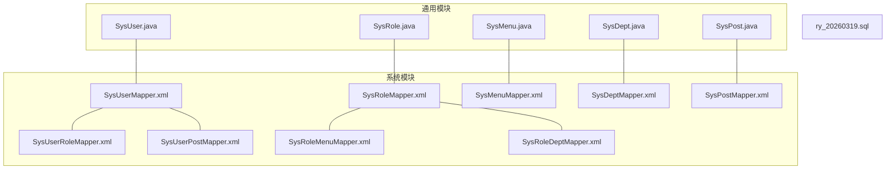
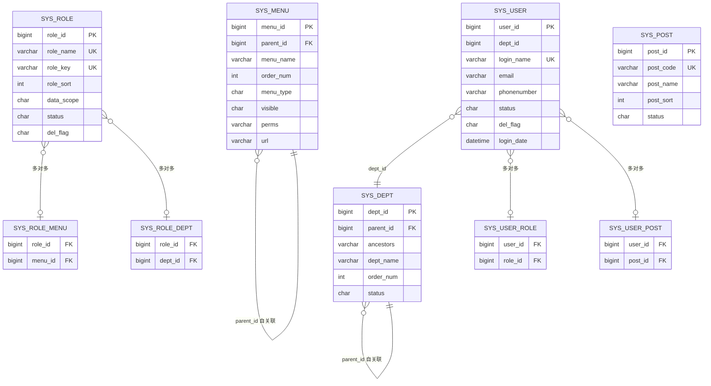
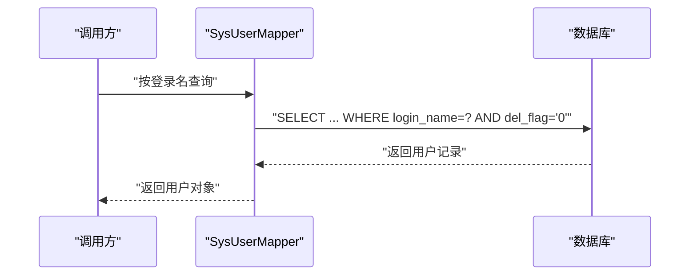
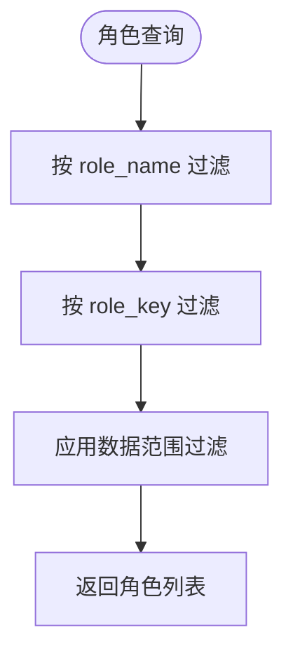
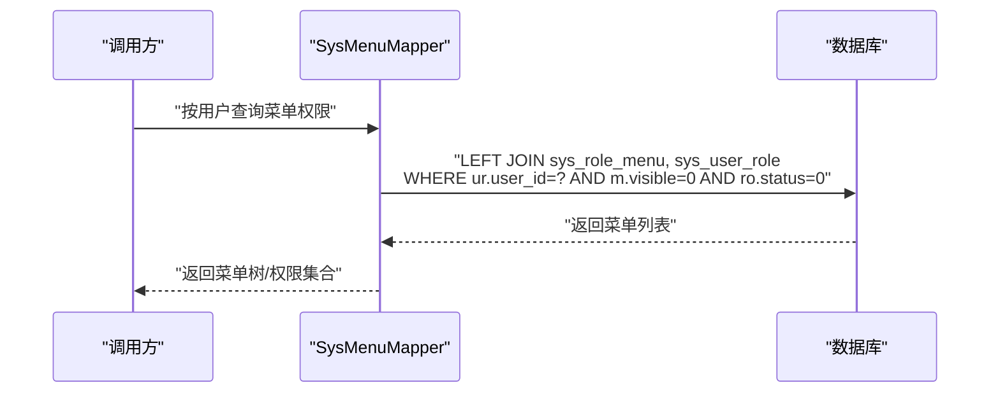
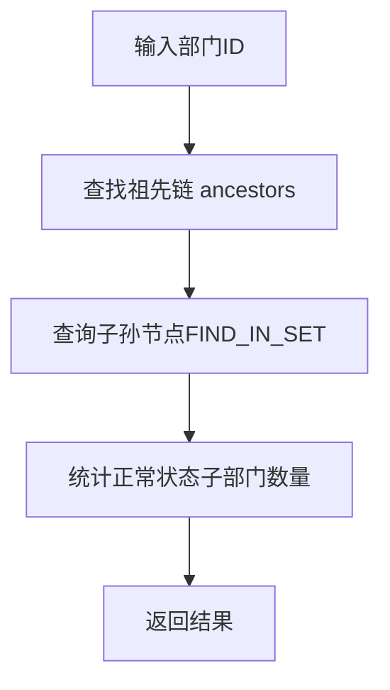
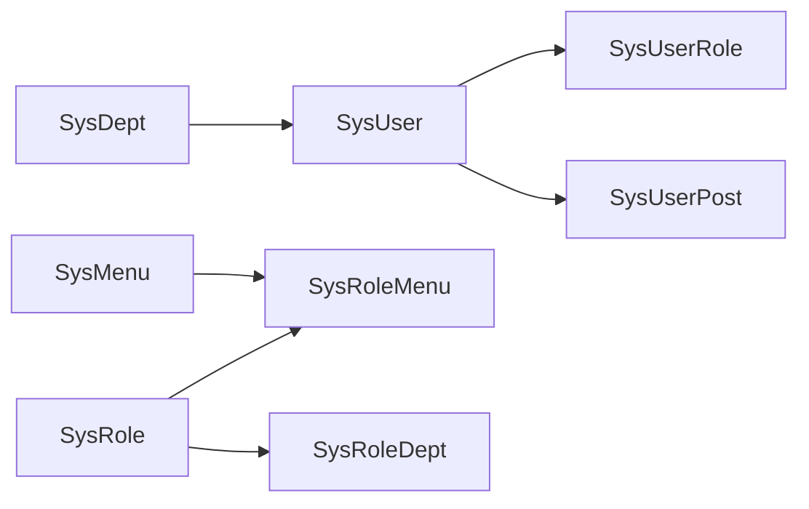

# 核心业务表结构

<cite>
**本文引用的文件**
- [SysUser.java](file://ruoyi-common/src/main/java/com/ruoyi/common/core/domain/entity/SysUser.java)
- [SysRole.java](file://ruoyi-common/src/main/java/com/ruoyi/common/core/domain/entity/SysRole.java)
- [SysMenu.java](file://ruoyi-common/src/main/java/com/ruoyi/common/core/domain/entity/SysMenu.java)
- [SysDept.java](file://ruoyi-common/src/main/java/com/ruoyi/common/core/domain/entity/SysDept.java)
- [SysPost.java](file://ruoyi-system/src/main/java/com/ruoyi/system/domain/SysPost.java)
- [ry_20260319.sql](file://sql/ry_20260319.sql)
- [SysUserMapper.xml](file://ruoyi-system/src/main/resources/mapper/system/SysUserMapper.xml)
- [SysRoleMapper.xml](file://ruoyi-system/src/main/resources/mapper/system/SysRoleMapper.xml)
- [SysMenuMapper.xml](file://ruoyi-system/src/main/resources/mapper/system/SysMenuMapper.xml)
- [SysDeptMapper.xml](file://ruoyi-system/src/main/resources/mapper/system/SysDeptMapper.xml)
- [SysPostMapper.xml](file://ruoyi-system/src/main/resources/mapper/system/SysPostMapper.xml)
- [SysUserRoleMapper.xml](file://ruoyi-system/src/main/resources/mapper/system/SysUserRoleMapper.xml)
- [SysRoleMenuMapper.xml](file://ruoyi-system/src/main/resources/mapper/system/SysRoleMenuMapper.xml)
- [SysRoleDeptMapper.xml](file://ruoyi-system/src/main/resources/mapper/system/SysRoleDeptMapper.xml)
- [SysUserPostMapper.xml](file://ruoyi-system/src/main/resources/mapper/system/SysUserPostMapper.xml)
</cite>

## 目录
1. [简介](#简介)
2. [项目结构](#项目结构)
3. [核心组件](#核心组件)
4. [架构总览](#架构总览)
5. [详细组件分析](#详细组件分析)
6. [依赖分析](#依赖分析)
7. [性能考量](#性能考量)
8. [故障排查指南](#故障排查指南)
9. [结论](#结论)
10. [附录](#附录)

## 简介
本文件聚焦于 RuoYi 系统的核心业务表结构，围绕用户、角色、菜单、部门、岗位等关键实体进行深入解析。内容覆盖字段定义、数据类型选择、约束与索引策略、主外键设计、表间关联规则、SQL 创建语句解析与注释说明，并从数据完整性与性能优化角度总结最佳实践与扩展性考虑。

## 项目结构
- 实体模型位于通用模块 ruoyi-common 的 entity 包中，定义了 sys_user、sys_role、sys_menu、sys_dept、sys_post 的 Java 对象。
- 表结构与初始化数据定义在 sql/ry_20260319.sql 中。
- MyBatis 映射文件位于 ruoyi-system 模块的 resources/mapper/system 下，分别对应各实体的 CRUD 与关联查询。

图表来源
- [SysUser.java:1-382](file://ruoyi-common/src/main/java/com/ruoyi/common/core/domain/entity/SysUser.java#L1-L382)
- [SysRole.java:1-212](file://ruoyi-common/src/main/java/com/ruoyi/common/core/domain/entity/SysRole.java#L1-L212)
- [SysMenu.java:1-215](file://ruoyi-common/src/main/java/com/ruoyi/common/core/domain/entity/SysMenu.java#L1-L215)
- [SysDept.java:1-204](file://ruoyi-common/src/main/java/com/ruoyi/common/core/domain/entity/SysDept.java#L1-L204)
- [SysPost.java:1-123](file://ruoyi-system/src/main/java/com/ruoyi/system/domain/SysPost.java#L1-L123)
- [SysUserMapper.xml:1-246](file://ruoyi-system/src/main/resources/mapper/system/SysUserMapper.xml#L1-L246)
- [SysRoleMapper.xml:1-134](file://ruoyi-system/src/main/resources/mapper/system/SysRoleMapper.xml#L1-L134)
- [SysMenuMapper.xml:1-197](file://ruoyi-system/src/main/resources/mapper/system/SysMenuMapper.xml#L1-L197)
- [SysDeptMapper.xml:1-162](file://ruoyi-system/src/main/resources/mapper/system/SysDeptMapper.xml#L1-L162)
- [SysPostMapper.xml:1-110](file://ruoyi-system/src/main/resources/mapper/system/SysPostMapper.xml#L1-L110)
- [SysUserRoleMapper.xml:1-48](file://ruoyi-system/src/main/resources/mapper/system/SysUserRoleMapper.xml#L1-L48)
- [SysRoleMenuMapper.xml:1-34](file://ruoyi-system/src/main/resources/mapper/system/SysRoleMenuMapper.xml#L1-L34)
- [SysRoleDeptMapper.xml:1-34](file://ruoyi-system/src/main/resources/mapper/system/SysRoleDeptMapper.xml#L1-L34)
- [SysUserPostMapper.xml:1-34](file://ruoyi-system/src/main/resources/mapper/system/SysUserPostMapper.xml#L1-L34)
- [ry_20260319.sql:1-739](file://sql/ry_20260319.sql#L1-L739)

章节来源
- [SysUser.java:1-382](file://ruoyi-common/src/main/java/com/ruoyi/common/core/domain/entity/SysUser.java#L1-L382)
- [SysRole.java:1-212](file://ruoyi-common/src/main/java/com/ruoyi/common/core/domain/entity/SysRole.java#L1-L212)
- [SysMenu.java:1-215](file://ruoyi-common/src/main/java/com/ruoyi/common/core/domain/entity/SysMenu.java#L1-L215)
- [SysDept.java:1-204](file://ruoyi-common/src/main/java/com/ruoyi/common/core/domain/entity/SysDept.java#L1-L204)
- [SysPost.java:1-123](file://ruoyi-system/src/main/java/com/ruoyi/system/domain/SysPost.java#L1-L123)
- [ry_20260319.sql:1-739](file://sql/ry_20260319.sql#L1-L739)

## 核心组件
本节对五个核心业务实体进行字段与约束解析，并结合 SQL 定义与 MyBatis 映射说明其在系统中的职责与使用方式。

- 用户表 sys_user
  - 主键：user_id（自增）
  - 关键字段：dept_id（部门外键）、login_name（唯一校验）、email、phonenumber、status、del_flag（软删）、login_ip/login_date/pwd_update_date 等审计字段
  - 约束与索引：通过 MyBatis 查询包含 login_name/email/phonenumber 唯一性检查；软删 del_flag='0' 过滤
  - 关联：与 sys_dept（一对一）、sys_user_role（多对多）、sys_user_post（多对多）

- 角色表 sys_role
  - 主键：role_id（自增）
  - 关键字段：role_name（唯一校验）、role_key（权限字符）、role_sort、data_scope（数据权限范围）、status、del_flag
  - 约束与索引：MyBatis 提供按 role_name/role_key 唯一性检查
  - 关联：与 sys_user_role（多对多）、sys_role_menu（多对多）、sys_role_dept（多对多）

- 菜单表 sys_menu
  - 主键：menu_id（自增）
  - 关键字段：parent_id（自关联）、menu_name、order_num、menu_type（M/C/F）、visible、perms（权限标识）、icon、url、target
  - 约束与索引：MyBatis 提供按菜单树、权限集合、父子关系查询
  - 关联：与 sys_role_menu（多对多）

- 部门表 sys_dept
  - 主键：dept_id（自增）
  - 关键字段：parent_id（自关联）、ancestors（祖级列表，支持“本部门及以下”数据权限）、dept_name、order_num、leader、phone、email、status、del_flag
  - 约束与索引：MyBatis 提供祖先链查询、子节点统计、唯一性校验
  - 关联：与 sys_user（一对多）、sys_role_dept（多对多）

- 岗位表 sys_post
  - 主键：post_id（自增）
  - 关键字段：post_code（唯一校验）、post_name、post_sort、status
  - 约束与索引：MyBatis 提供按岗位名/编码唯一性检查
  - 关联：与 sys_user_post（多对多）

章节来源
- [SysUser.java:1-382](file://ruoyi-common/src/main/java/com/ruoyi/common/core/domain/entity/SysUser.java#L1-L382)
- [SysRole.java:1-212](file://ruoyi-common/src/main/java/com/ruoyi/common/core/domain/entity/SysRole.java#L1-L212)
- [SysMenu.java:1-215](file://ruoyi-common/src/main/java/com/ruoyi/common/core/domain/entity/SysMenu.java#L1-L215)
- [SysDept.java:1-204](file://ruoyi-common/src/main/java/com/ruoyi/common/core/domain/entity/SysDept.java#L1-L204)
- [SysPost.java:1-123](file://ruoyi-system/src/main/java/com/ruoyi/system/domain/SysPost.java#L1-L123)
- [ry_20260319.sql:41-120](file://sql/ry_20260319.sql#L41-L120)
- [SysUserMapper.xml:141-151](file://ruoyi-system/src/main/resources/mapper/system/SysUserMapper.xml#L141-L151)
- [SysRoleMapper.xml:74-82](file://ruoyi-system/src/main/resources/mapper/system/SysRoleMapper.xml#L74-L82)
- [SysMenuMapper.xml:132-135](file://ruoyi-system/src/main/resources/mapper/system/SysMenuMapper.xml#L132-L135)
- [SysDeptMapper.xml:69-72](file://ruoyi-system/src/main/resources/mapper/system/SysDeptMapper.xml#L69-L72)
- [SysPostMapper.xml:57-65](file://ruoyi-system/src/main/resources/mapper/system/SysPostMapper.xml#L57-L65)

## 架构总览
下图展示核心业务表之间的关系与典型查询路径（基于 MyBatis 映射）：

图表来源
- [ry_20260319.sql:4-21](file://sql/ry_20260319.sql#L4-L21)
- [ry_20260319.sql:41-65](file://sql/ry_20260319.sql#L41-L65)
- [ry_20260319.sql:77-91](file://sql/ry_20260319.sql#L77-L91)
- [ry_20260319.sql:105-120](file://sql/ry_20260319.sql#L105-L120)
- [ry_20260319.sql:132-151](file://sql/ry_20260319.sql#L132-L151)
- [ry_20260319.sql:262-267](file://sql/ry_20260319.sql#L262-L267)
- [ry_20260319.sql:279-284](file://sql/ry_20260319.sql#L279-L284)
- [ry_20260319.sql:379-383](file://sql/ry_20260319.sql#L379-L383)
- [ry_20260319.sql:396-401](file://sql/ry_20260319.sql#L396-L401)

## 详细组件分析

### 用户表 sys_user
- 设计要点
  - 主键 user_id，自增，确保全局唯一
  - dept_id 外键指向 sys_dept.dept_id，建立用户与部门的直接关联
  - login_name、email、phonenumber 提供多种登录/联系入口，均具备唯一性校验查询
  - del_flag 采用软删除策略，查询默认过滤 del_flag='0'
  - 审计字段：create_by/create_time/update_by/update_time/reason 等
- 字段与类型选择
  - user_id：bigint（大整型，满足高并发与扩展）
  - login_name/email/phonenumber：varchar（可变长，满足国际化与长度需求）
  - status/del_flag：char（枚举化存储，节省空间且便于过滤）
  - login_date/pwd_update_date：datetime（精确到秒的时间戳）
- 约束与索引
  - 唯一性：login_name、email、phonenumber 的唯一性检查由 MyBatis 查询保障
  - 软删：默认查询过滤 del_flag='0'
- 关联规则
  - 一对一：sys_user.dept_id → sys_dept.dept_id
  - 多对多：sys_user ↔ sys_user_role（角色）、sys_user ↔ sys_user_post（岗位）
- SQL 解析与注释
  - 主键与字段定义见 SQL 文件中 sys_user 表结构
  - MyBatis 提供按 login_name/email/phonenumber 的唯一性检查与按条件的分页/筛选查询
- 性能与安全
  - 建议在 login_name/email/phonenumber 上建立唯一索引（SQL 已含唯一性约束）
  - 密码与盐字段在实体中使用注解避免序列化输出，注意传输层安全

图表来源
- [SysUserMapper.xml:126-139](file://ruoyi-system/src/main/resources/mapper/system/SysUserMapper.xml#L126-L139)
- [ry_20260319.sql:41-65](file://sql/ry_20260319.sql#L41-L65)

章节来源
- [SysUser.java:1-382](file://ruoyi-common/src/main/java/com/ruoyi/common/core/domain/entity/SysUser.java#L1-L382)
- [ry_20260319.sql:41-65](file://sql/ry_20260319.sql#L41-L65)
- [SysUserMapper.xml:126-151](file://ruoyi-system/src/main/resources/mapper/system/SysUserMapper.xml#L126-L151)

### 角色表 sys_role
- 设计要点
  - 主键 role_id，自增
  - role_name 与 role_key 均需唯一，前者用于展示，后者用于权限标识
  - data_scope 支持多种数据权限范围（全部/自定义/本部门/本部门及以下/仅本人）
  - del_flag 软删除，status 控制启用/停用
- 字段与类型选择
  - role_id：bigint（主键）
  - role_name/role_key：varchar（唯一性约束）
  - data_scope/status/del_flag：char（枚举化）
- 约束与索引
  - 唯一性：role_name、role_key 的唯一性检查由 MyBatis 查询保障
- 关联规则
  - 多对多：sys_role ↔ sys_user_role（用户角色）、sys_role ↔ sys_role_menu（菜单权限）、sys_role ↔ sys_role_dept（部门数据权限）

图表来源
- [SysRoleMapper.xml:36-62](file://ruoyi-system/src/main/resources/mapper/system/SysRoleMapper.xml#L36-L62)
- [ry_20260319.sql:105-120](file://sql/ry_20260319.sql#L105-L120)

章节来源
- [SysRole.java:1-212](file://ruoyi-common/src/main/java/com/ruoyi/common/core/domain/entity/SysRole.java#L1-L212)
- [ry_20260319.sql:105-120](file://sql/ry_20260319.sql#L105-L120)
- [SysRoleMapper.xml:74-82](file://ruoyi-system/src/main/resources/mapper/system/SysRoleMapper.xml#L74-L82)

### 菜单表 sys_menu
- 设计要点
  - 主键 menu_id，自增
  - parent_id 自关联，支持树形结构
  - menu_type 决定目录/菜单/按钮，visible 控制显示/隐藏
  - perms 作为权限标识，配合权限拦截
- 字段与类型选择
  - menu_id：bigint；parent_id：bigint；order_num：int；menu_type/visible：char
  - perms/url/icon：varchar（可变长）
- 约束与索引
  - 唯一性：同级 menu_name+parent_id 唯一（MyBatis 唯一性检查）
- 关联规则
  - 多对多：sys_menu ↔ sys_role_menu（角色菜单）

图表来源
- [SysMenuMapper.xml:32-71](file://ruoyi-system/src/main/resources/mapper/system/SysMenuMapper.xml#L32-L71)
- [ry_20260319.sql:132-151](file://sql/ry_20260319.sql#L132-L151)

章节来源
- [SysMenu.java:1-215](file://ruoyi-common/src/main/java/com/ruoyi/common/core/domain/entity/SysMenu.java#L1-L215)
- [ry_20260319.sql:132-151](file://sql/ry_20260319.sql#L132-L151)
- [SysMenuMapper.xml:132-135](file://ruoyi-system/src/main/resources/mapper/system/SysMenuMapper.xml#L132-L135)

### 部门表 sys_dept
- 设计要点
  - 主键 dept_id，自增
  - parent_id 自关联，ancestors 记录祖级路径，支撑“本部门及以下”数据权限
  - order_num 控制显示顺序，status 控制启用/停用
- 字段与类型选择
  - dept_id：bigint；parent_id：bigint；order_num：int；status/del_flag：char
  - ancestors：varchar（存储逗号分隔的祖先 ID 列表）
- 约束与索引
  - 唯一性：同级 dept_name+parent_id 唯一（MyBatis 唯一性检查）
- 关联规则
  - 一对多：sys_dept.dept_id → sys_user.dept_id
  - 多对多：sys_dept ↔ sys_role_dept（角色数据权限）

图表来源
- [SysDeptMapper.xml:81-87](file://ruoyi-system/src/main/resources/mapper/system/SysDeptMapper.xml#L81-L87)
- [ry_20260319.sql:4-21](file://sql/ry_20260319.sql#L4-L21)

章节来源
- [SysDept.java:1-204](file://ruoyi-common/src/main/java/com/ruoyi/common/core/domain/entity/SysDept.java#L1-L204)
- [ry_20260319.sql:4-21](file://sql/ry_20260319.sql#L4-L21)
- [SysDeptMapper.xml:69-72](file://ruoyi-system/src/main/resources/mapper/system/SysDeptMapper.xml#L69-L72)

### 岗位表 sys_post
- 设计要点
  - 主键 post_id，自增
  - post_code 与 post_name 唯一性校验，post_sort 控制显示顺序
- 字段与类型选择
  - post_id：bigint；post_code/post_name：varchar；post_sort：int；status：char
- 约束与索引
  - 唯一性：post_code、post_name 的唯一性检查由 MyBatis 查询保障
- 关联规则
  - 多对多：sys_post ↔ sys_user_post（用户岗位）

章节来源
- [SysPost.java:1-123](file://ruoyi-system/src/main/java/com/ruoyi/system/domain/SysPost.java#L1-L123)
- [ry_20260319.sql:77-91](file://sql/ry_20260319.sql#L77-L91)
- [SysPostMapper.xml:57-65](file://ruoyi-system/src/main/resources/mapper/system/SysPostMapper.xml#L57-L65)

## 依赖分析
- 实体与映射
  - 各实体类与对应的 Mapper XML 一一对应，通过命名空间与 resultMaps 建立绑定
- 关联表
  - 用户-角色：sys_user_role（联合主键 user_id, role_id）
  - 角色-菜单：sys_role_menu（联合主键 role_id, menu_id）
  - 角色-部门：sys_role_dept（联合主键 role_id, dept_id）
  - 用户-岗位：sys_user_post（联合主键 user_id, post_id）
- 查询依赖
  - 用户查询依赖 sys_user、sys_dept、sys_user_role、sys_role
  - 菜单查询依赖 sys_menu、sys_role_menu、sys_user_role、sys_role
  - 部门查询依赖 sys_dept、sys_user、sys_role_dept

图表来源
- [SysUserMapper.xml:29-30](file://ruoyi-system/src/main/resources/mapper/system/SysUserMapper.xml#L29-L30)
- [SysMenuMapper.xml:34-37](file://ruoyi-system/src/main/resources/mapper/system/SysMenuMapper.xml#L34-L37)
- [SysUserRoleMapper.xml:1-48](file://ruoyi-system/src/main/resources/mapper/system/SysUserRoleMapper.xml#L1-L48)
- [SysRoleMenuMapper.xml:1-34](file://ruoyi-system/src/main/resources/mapper/system/SysRoleMenuMapper.xml#L1-L34)
- [SysRoleDeptMapper.xml:1-34](file://ruoyi-system/src/main/resources/mapper/system/SysRoleDeptMapper.xml#L1-L34)
- [SysUserPostMapper.xml:1-34](file://ruoyi-system/src/main/resources/mapper/system/SysUserPostMapper.xml#L1-L34)

章节来源
- [SysUserMapper.xml:29-30](file://ruoyi-system/src/main/resources/mapper/system/SysUserMapper.xml#L29-L30)
- [SysMenuMapper.xml:34-37](file://ruoyi-system/src/main/resources/mapper/system/SysMenuMapper.xml#L34-L37)
- [SysUserRoleMapper.xml:1-48](file://ruoyi-system/src/main/resources/mapper/system/SysUserRoleMapper.xml#L1-L48)
- [SysRoleMenuMapper.xml:1-34](file://ruoyi-system/src/main/resources/mapper/system/SysRoleMenuMapper.xml#L1-L34)
- [SysRoleDeptMapper.xml:1-34](file://ruoyi-system/src/main/resources/mapper/system/SysRoleDeptMapper.xml#L1-L34)
- [SysUserPostMapper.xml:1-34](file://ruoyi-system/src/main/resources/mapper/system/SysUserPostMapper.xml#L1-L34)

## 性能考量
- 索引与查询
  - 唯一性：login_name/email/phonenumber（用户）、role_name/role_key（角色）、post_code/post_name（岗位）、菜单同级唯一（SQL 已约束）
  - 软删过滤：默认查询均以 del_flag='0' 过滤，减少无效扫描
  - 树形查询：部门祖先链使用 ancestors 与 FIND_IN_SET，建议在 ancestors 上建立合适索引或在业务层控制层级深度
- 分页与范围
  - MyBatis 提供按时间范围、模糊匹配等条件的分页查询，建议在高频过滤字段上建立索引
- 关联查询
  - 用户/角色/菜单查询广泛使用 LEFT JOIN，建议在关联键（如 dept_id、user_id、role_id、menu_id）上保持索引
- 写入优化
  - 批量插入：用户-角色、角色-菜单、角色-部门、用户-岗位均支持批量插入，减少往返
- 安全与一致性
  - 密码与盐不在实体序列化输出，传输层与日志层需避免泄露
  - 软删除替代物理删除，保留审计轨迹

[本节为通用性能指导，无需特定文件引用]

## 故障排查指南
- 常见问题
  - 唯一性冲突：登录名/邮箱/手机号、角色名/权限字符、岗位名/编码重复
  - 软删除导致查询为空：确认 del_flag 条件与过滤逻辑
  - 数据权限范围异常：核对 data_scope 与 ancestors 的计算
  - 树形菜单/部门查询结果异常：检查 parent_id 与 self-referencing 关系
- 排查步骤
  - 使用 MyBatis 唯一性检查 SQL 快速定位重复项
  - 核对 sys_user/sys_role/sys_post 的唯一性查询映射
  - 检查软删除字段 del_flag 的使用场景
  - 验证关联表（sys_user_role/sys_role_menu/sys_role_dept/sys_user_post）的批量写入是否成功

章节来源
- [SysUserMapper.xml:141-151](file://ruoyi-system/src/main/resources/mapper/system/SysUserMapper.xml#L141-L151)
- [SysRoleMapper.xml:74-82](file://ruoyi-system/src/main/resources/mapper/system/SysRoleMapper.xml#L74-L82)
- [SysPostMapper.xml:57-65](file://ruoyi-system/src/main/resources/mapper/system/SysPostMapper.xml#L57-L65)
- [SysDeptMapper.xml:69-72](file://ruoyi-system/src/main/resources/mapper/system/SysDeptMapper.xml#L69-L72)
- [SysMenuMapper.xml:132-135](file://ruoyi-system/src/main/resources/mapper/system/SysMenuMapper.xml#L132-L135)

## 结论
RuoYi 的核心业务表以清晰的主外键关系与软删除机制为基础，结合 MyBatis 的灵活映射实现了高效的读写与复杂的权限/数据范围控制。通过统一的实体模型与关联表设计，系统在保证数据完整性的同时兼顾了查询性能与扩展性。建议在生产环境中进一步完善索引策略与审计日志，持续优化树形结构与批量操作的性能表现。

[本节为总结性内容，无需特定文件引用]

## 附录
- SQL 创建语句概览（字段与注释）
  - 用户表 sys_user：主键 user_id，外键 dept_id，软删 del_flag，登录审计字段，唯一性约束字段
  - 角色表 sys_role：主键 role_id，唯一性约束 role_name/role_key，数据权限范围 data_scope
  - 菜单表 sys_menu：主键 menu_id，自关联 parent_id，权限标识 perms，类型与可见性控制
  - 部门表 sys_dept：主键 dept_id，自关联 parent_id，祖先链 ancestors，显示顺序与状态
  - 岗位表 sys_post：主键 post_id，唯一性约束 post_code/post_name
  - 关联表：sys_user_role、sys_role_menu、sys_role_dept、sys_user_post（联合主键）

章节来源
- [ry_20260319.sql:4-21](file://sql/ry_20260319.sql#L4-L21)
- [ry_20260319.sql:41-65](file://sql/ry_20260319.sql#L41-L65)
- [ry_20260319.sql:77-91](file://sql/ry_20260319.sql#L77-L91)
- [ry_20260319.sql:105-120](file://sql/ry_20260319.sql#L105-L120)
- [ry_20260319.sql:132-151](file://sql/ry_20260319.sql#L132-L151)
- [ry_20260319.sql:262-267](file://sql/ry_20260319.sql#L262-L267)
- [ry_20260319.sql:279-284](file://sql/ry_20260319.sql#L279-L284)
- [ry_20260319.sql:379-383](file://sql/ry_20260319.sql#L379-L383)
- [ry_20260319.sql:396-401](file://sql/ry_20260319.sql#L396-L401)