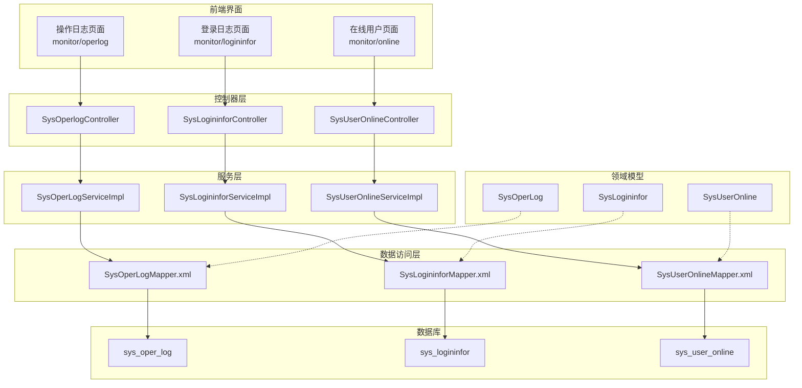
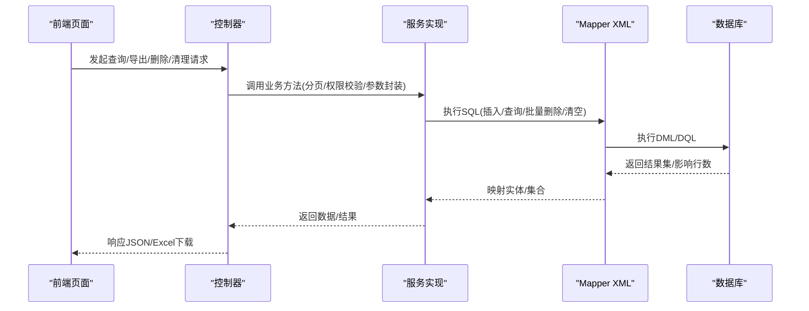
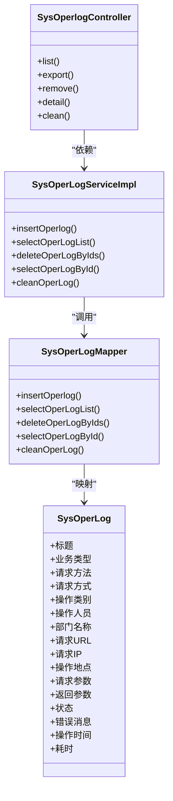
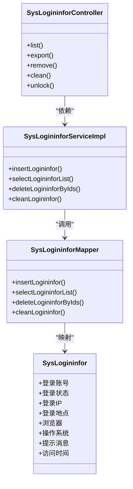
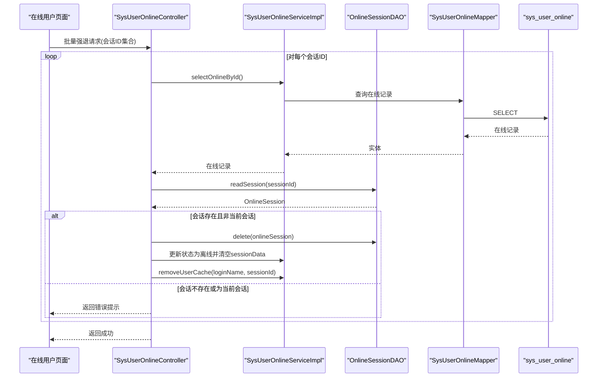
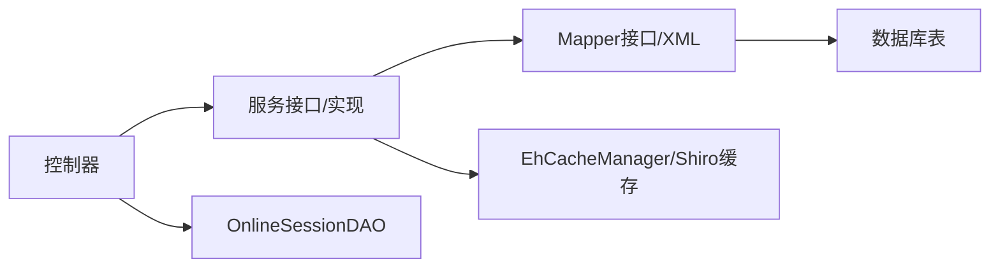

# 监控日志表结构

<cite>
**本文引用的文件**
- [SysOperLog.java](file://ruoyi-system/src/main/java/com/ruoyi/system/domain/SysOperLog.java)
- [SysLogininfor.java](file://ruoyi-system/src/main/java/com/ruoyi/system/domain/SysLogininfor.java)
- [SysUserOnline.java](file://ruoyi-system/src/main/java/com/ruoyi/system/domain/SysUserOnline.java)
- [SysOperLogMapper.java](file://ruoyi-system/src/main/java/com/ruoyi/system/mapper/SysOperLogMapper.java)
- [SysLogininforMapper.java](file://ruoyi-system/src/main/java/com/ruoyi/system/mapper/SysLogininforMapper.java)
- [SysUserOnlineMapper.java](file://ruoyi-system/src/main/java/com/ruoyi/system/mapper/SysUserOnlineMapper.java)
- [SysOperLogMapper.xml](file://ruoyi-system/src/main/resources/mapper/system/SysOperLogMapper.xml)
- [SysLogininforMapper.xml](file://ruoyi-system/src/main/resources/mapper/system/SysLogininforMapper.xml)
- [SysUserOnlineMapper.xml](file://ruoyi-system/src/main/resources/mapper/system/SysUserOnlineMapper.xml)
- [SysOperLogServiceImpl.java](file://ruoyi-system/src/main/java/com/ruoyi/system/service/impl/SysOperLogServiceImpl.java)
- [SysLogininforServiceImpl.java](file://ruoyi-system/src/main/java/com/ruoyi/system/service/impl/SysLogininforServiceImpl.java)
- [SysUserOnlineServiceImpl.java](file://ruoyi-system/src/main/java/com/ruoyi/system/service/impl/SysUserOnlineServiceImpl.java)
- [SysOperlogController.java](file://ruoyi-admin/src/main/java/com/ruoyi/web/controller/monitor/SysOperlogController.java)
- [SysLogininforController.java](file://ruoyi-admin/src/main/java/com/ruoyi/web/controller/monitor/SysLogininforController.java)
- [SysUserOnlineController.java](file://ruoyi-admin/src/main/java/com/ruoyi/web/controller/monitor/SysUserOnlineController.java)
- [ry_20260319.sql](file://sql/ry_20260319.sql)
</cite>

## 目录
1. [简介](#简介)
2. [项目结构](#项目结构)
3. [核心组件](#核心组件)
4. [架构总览](#架构总览)
5. [详细组件分析](#详细组件分析)
6. [依赖分析](#依赖分析)
7. [性能考虑](#性能考虑)
8. [故障排查指南](#故障排查指南)
9. [结论](#结论)
10. [附录](#附录)

## 简介
本文件围绕 RuoYi 系统的监控与审计日志表进行系统化梳理，重点覆盖以下三类表：
- 操作日志表：sys_oper_log，记录业务操作的全链路信息，包括业务类型、请求方法、请求参数、响应结果、耗时、错误信息等。
- 登录日志表：sys_logininfor，记录用户登录行为，包含登录账号、登录状态、IP 地址、登录地点、浏览器与操作系统、提示消息、访问时间等。
- 在线用户表：sys_user_online，记录当前在线会话，包含会话 ID、登录名、部门、IP、登录地点、浏览器、操作系统、会话起止时间、过期时间、在线状态以及会话序列化数据。

文档从数据模型、控制流程、持久化映射、会话管理与序列化、索引与查询优化、归档策略等方面展开，并结合控制器与服务层实现，帮助读者全面理解监控日志在系统安全与运维中的作用。

## 项目结构
监控日志相关代码按“领域模型 → 映射器接口 → XML 映射 → 服务实现 → 控制器”的分层组织，遵循典型的 MyBatis + Spring 架构模式。数据库脚本中定义了三张核心表及其字段、注释与索引基础。

图表来源
- [SysOperlogController.java:27-90](file://ruoyi-admin/src/main/java/com/ruoyi/web/controller/monitor/SysOperlogController.java#L27-L90)
- [SysLogininforController.java:26-94](file://ruoyi-admin/src/main/java/com/ruoyi/web/controller/monitor/SysLogininforController.java#L26-L94)
- [SysUserOnlineController.java:30-89](file://ruoyi-admin/src/main/java/com/ruoyi/web/controller/monitor/SysUserOnlineController.java#L30-L89)
- [SysOperLogMapper.xml:1-86](file://ruoyi-system/src/main/resources/mapper/system/SysOperLogMapper.xml#L1-L86)
- [SysLogininforMapper.xml:1-56](file://ruoyi-system/src/main/resources/mapper/system/SysLogininforMapper.xml#L1-L56)
- [SysUserOnlineMapper.xml:1-58](file://ruoyi-system/src/main/resources/mapper/system/SysUserOnlineMapper.xml#L1-L58)

章节来源
- [SysOperlogController.java:27-90](file://ruoyi-admin/src/main/java/com/ruoyi/web/controller/monitor/SysOperlogController.java#L27-L90)
- [SysLogininforController.java:26-94](file://ruoyi-admin/src/main/java/com/ruoyi/web/controller/monitor/SysLogininforController.java#L26-L94)
- [SysUserOnlineController.java:30-89](file://ruoyi-admin/src/main/java/com/ruoyi/web/controller/monitor/SysUserOnlineController.java#L30-L89)

## 核心组件
本节对三张监控日志表的领域模型进行逐项解读，明确字段含义、取值范围与典型用途。

- 操作日志表（sys_oper_log）
  - 关键字段：标题、业务类型、请求方法、请求方式、操作类别、操作人员、部门名称、请求 URL、请求 IP、操作地点、请求参数、返回参数、状态、错误消息、操作时间、耗时。
  - 典型用途：审计业务变更、追踪异常、统计接口耗时与成功率、支持合规检查。
  - 存储策略：请求参数与返回参数以字符串形式存储；状态区分正常/异常；耗时单位为毫秒；时间字段使用数据库函数写入当前时间。

- 登录日志表（sys_logininfor）
  - 关键字段：登录账号、登录状态（成功/失败）、登录 IP、登录地点、浏览器、操作系统、提示消息、访问时间。
  - 典型用途：登录安全审计、识别异常登录行为、统计登录趋势与来源分布。
  - 存储策略：登录时间使用数据库函数写入当前时间；地点与浏览器/操作系统来自客户端 UA 解析与 IP 定位。

- 在线用户表（sys_user_online）
  - 关键字段：会话 ID、登录名、部门、IP、登录地点、浏览器、操作系统、会话创建时间、最后访问时间、过期时间、在线状态、备份会话数据（序列化）。
  - 典型用途：在线用户管理、强制下线、会话超时清理、服务重启后的会话恢复。
  - 存储策略：使用 REPLACE 写入保证同一会话唯一；会话数据以二进制 BLOB 存储，便于跨实例恢复。

章节来源
- [SysOperLog.java:10-293](file://ruoyi-system/src/main/java/com/ruoyi/system/domain/SysOperLog.java#L10-L293)
- [SysLogininfor.java:10-159](file://ruoyi-system/src/main/java/com/ruoyi/system/domain/SysLogininfor.java#L10-L159)
- [SysUserOnline.java:10-205](file://ruoyi-system/src/main/java/com/ruoyi/system/domain/SysUserOnline.java#L10-L205)

## 架构总览
下图展示从前端到数据库的完整调用链路，突出控制器如何协调服务层与数据访问层完成监控日志的增删查改与导出。

图表来源
- [SysOperlogController.java:44-90](file://ruoyi-admin/src/main/java/com/ruoyi/web/controller/monitor/SysOperlogController.java#L44-L90)
- [SysOperLogServiceImpl.java:27-77](file://ruoyi-system/src/main/java/com/ruoyi/system/service/impl/SysOperLogServiceImpl.java#L27-L77)
- [SysOperLogMapper.xml:32-84](file://ruoyi-system/src/main/resources/mapper/system/SysOperLogMapper.xml#L32-L84)
- [SysLogininforController.java:45-93](file://ruoyi-admin/src/main/java/com/ruoyi/web/controller/monitor/SysLogininforController.java#L45-L93)
- [SysLogininforServiceImpl.java:28-65](file://ruoyi-system/src/main/java/com/ruoyi/system/service/impl/SysLogininforServiceImpl.java#L28-L65)
- [SysLogininforMapper.xml:19-54](file://ruoyi-system/src/main/resources/mapper/system/SysLogininforMapper.xml#L19-L54)
- [SysUserOnlineController.java:50-88](file://ruoyi-admin/src/main/java/com/ruoyi/web/controller/monitor/SysUserOnlineController.java#L50-L88)
- [SysUserOnlineServiceImpl.java:36-139](file://ruoyi-system/src/main/java/com/ruoyi/system/service/impl/SysUserOnlineServiceImpl.java#L36-L139)
- [SysUserOnlineMapper.xml:27-56](file://ruoyi-system/src/main/resources/mapper/system/SysUserOnlineMapper.xml#L27-L56)

## 详细组件分析

### 操作日志表（sys_oper_log）
- 数据模型与字段
  - 字段覆盖业务类型、请求方法、请求参数、返回结果、状态与错误消息、操作时间与耗时等，便于全链路审计。
- 控制器与服务
  - 支持分页列表、导出、删除、详情查看、清空等操作；导出基于通用 Excel 工具类。
- 数据访问层
  - 插入使用数据库函数写入当前时间；查询支持多条件过滤（IP、标题、业务类型、状态、操作人、时间区间）；批量删除与清空采用 SQL 批处理与截断。
- 存储策略
  - 请求参数与返回结果以字符串存储，建议结合敏感信息脱敏与长度限制；状态与业务类型采用枚举或字典转换，便于展示与筛选。

图表来源
- [SysOperLog.java:15-293](file://ruoyi-system/src/main/java/com/ruoyi/system/domain/SysOperLog.java#L15-L293)
- [SysOperLogMapper.java:11-48](file://ruoyi-system/src/main/java/com/ruoyi/system/mapper/SysOperLogMapper.java#L11-L48)
- [SysOperLogMapper.xml:7-84](file://ruoyi-system/src/main/resources/mapper/system/SysOperLogMapper.xml#L7-L84)
- [SysOperLogServiceImpl.java:17-77](file://ruoyi-system/src/main/java/com/ruoyi/system/service/impl/SysOperLogServiceImpl.java#L17-L77)
- [SysOperlogController.java:29-90](file://ruoyi-admin/src/main/java/com/ruoyi/web/controller/monitor/SysOperlogController.java#L29-L90)

章节来源
- [SysOperLog.java:10-293](file://ruoyi-system/src/main/java/com/ruoyi/system/domain/SysOperLog.java#L10-L293)
- [SysOperLogMapper.xml:27-84](file://ruoyi-system/src/main/resources/mapper/system/SysOperLogMapper.xml#L27-L84)
- [SysOperLogServiceImpl.java:27-77](file://ruoyi-system/src/main/java/com/ruoyi/system/service/impl/SysOperLogServiceImpl.java#L27-L77)
- [SysOperlogController.java:44-90](file://ruoyi-admin/src/main/java/com/ruoyi/web/controller/monitor/SysOperlogController.java#L44-L90)

### 登录日志表（sys_logininfor）
- 数据模型与字段
  - 包含登录账号、状态、IP、地点、浏览器、操作系统、提示消息、访问时间等，支撑登录安全审计。
- 控制器与服务
  - 列表查询、导出、删除、清空、账户解锁（清除登录缓存）等功能。
- 数据访问层
  - 插入使用数据库函数写入当前时间；查询支持 IP、状态、账号、时间区间过滤；批量删除与清空采用 SQL 批处理与截断。

图表来源
- [SysLogininfor.java:15-159](file://ruoyi-system/src/main/java/com/ruoyi/system/domain/SysLogininfor.java#L15-L159)
- [SysLogininforMapper.java:11-42](file://ruoyi-system/src/main/java/com/ruoyi/system/mapper/SysLogininforMapper.java#L11-L42)
- [SysLogininforMapper.xml:7-54](file://ruoyi-system/src/main/resources/mapper/system/SysLogininforMapper.xml#L7-L54)
- [SysLogininforServiceImpl.java:17-65](file://ruoyi-system/src/main/java/com/ruoyi/system/service/impl/SysLogininforServiceImpl.java#L17-L65)
- [SysLogininforController.java:28-94](file://ruoyi-admin/src/main/java/com/ruoyi/web/controller/monitor/SysLogininforController.java#L28-L94)

章节来源
- [SysLogininfor.java:10-159](file://ruoyi-system/src/main/java/com/ruoyi/system/domain/SysLogininfor.java#L10-L159)
- [SysLogininforMapper.xml:24-54](file://ruoyi-system/src/main/resources/mapper/system/SysLogininforMapper.xml#L24-L54)
- [SysLogininforServiceImpl.java:28-65](file://ruoyi-system/src/main/java/com/ruoyi/system/service/impl/SysLogininforServiceImpl.java#L28-L65)
- [SysLogininforController.java:45-93](file://ruoyi-admin/src/main/java/com/ruoyi/web/controller/monitor/SysLogininforController.java#L45-L93)

### 在线用户表（sys_user_online）与会话管理
- 数据模型与字段
  - 会话 ID、登录名、部门、IP、登录地点、浏览器、操作系统、会话起止时间、过期时间、在线状态、备份会话数据（字节数组）。
- 会话序列化与恢复
  - 使用 BLOB 字段存储序列化后的会话数据，支持服务重启后的会话恢复；同时维护在线状态与最后访问时间，便于过期检测与清理。
- 控制器与服务
  - 在线用户列表查询、批量强制下线（强退）、移除用户缓存等；强退逻辑先读取会话 DAO，再删除会话并更新在线记录与缓存。
- 数据访问层
  - 使用 REPLACE 写入确保同一会话唯一；提供按过期时间查询的排序能力。

图表来源
- [SysUserOnlineController.java:59-88](file://ruoyi-admin/src/main/java/com/ruoyi/web/controller/monitor/SysUserOnlineController.java#L59-L88)
- [SysUserOnlineServiceImpl.java:104-127](file://ruoyi-system/src/main/java/com/ruoyi/system/service/impl/SysUserOnlineServiceImpl.java#L104-L127)
- [SysUserOnlineMapper.xml:32-35](file://ruoyi-system/src/main/resources/mapper/system/SysUserOnlineMapper.xml#L32-L35)

章节来源
- [SysUserOnline.java:10-205](file://ruoyi-system/src/main/java/com/ruoyi/system/domain/SysUserOnline.java#L10-L205)
- [SysUserOnlineServiceImpl.java:104-139](file://ruoyi-system/src/main/java/com/ruoyi/system/service/impl/SysUserOnlineServiceImpl.java#L104-L139)
- [SysUserOnlineController.java:59-88](file://ruoyi-admin/src/main/java/com/ruoyi/web/controller/monitor/SysUserOnlineController.java#L59-L88)
- [SysUserOnlineMapper.xml:32-56](file://ruoyi-system/src/main/resources/mapper/system/SysUserOnlineMapper.xml#L32-L56)

## 依赖分析
- 组件耦合
  - 控制器仅依赖服务接口，服务实现依赖 Mapper 接口，Mapper 通过 XML 映射数据库表，形成清晰的分层依赖。
- 外部依赖
  - 在线用户强退依赖会话 DAO 读取与删除会话；会话缓存依赖 EhCache 管理器与 Shiro 用户缓存键。
- 可能的循环依赖
  - 未见直接循环依赖；若后续扩展涉及缓存与会话的双向引用，需谨慎设计。

图表来源
- [SysOperlogController.java:33-34](file://ruoyi-admin/src/main/java/com/ruoyi/web/controller/monitor/SysOperlogController.java#L33-L34)
- [SysOperLogServiceImpl.java:19-20](file://ruoyi-system/src/main/java/com/ruoyi/system/service/impl/SysOperLogServiceImpl.java#L19-L20)
- [SysOperLogMapper.java:11-18](file://ruoyi-system/src/main/java/com/ruoyi/system/mapper/SysOperLogMapper.java#L11-L18)
- [SysUserOnlineServiceImpl.java:119-126](file://ruoyi-system/src/main/java/com/ruoyi/system/service/impl/SysUserOnlineServiceImpl.java#L119-L126)

章节来源
- [SysOperlogController.java:33-34](file://ruoyi-admin/src/main/java/com/ruoyi/web/controller/monitor/SysOperlogController.java#L33-L34)
- [SysOperLogServiceImpl.java:19-20](file://ruoyi-system/src/main/java/com/ruoyi/system/service/impl/SysOperLogServiceImpl.java#L19-L20)
- [SysUserOnlineServiceImpl.java:119-127](file://ruoyi-system/src/main/java/com/ruoyi/system/service/impl/SysUserOnlineServiceImpl.java#L119-L127)

## 性能考虑
- 查询性能
  - 操作日志与登录日志均支持按时间区间、状态、关键词等条件过滤；建议在高频查询字段上建立合适索引（如状态、时间、账号/IP），并结合分页与时间窗口限制避免全表扫描。
- 写入性能
  - 操作日志与登录日志写入使用数据库函数记录时间；在线用户写入使用 REPLACE，确保幂等性；建议在高并发场景下评估数据库写入压力，必要时引入异步落库或批量提交。
- 存储与归档
  - 提供清空操作（TRUNCATE）用于快速清理；生产环境建议制定定期归档策略（如按月/季度归档至历史表），保留近期热数据于在线表，降低主表膨胀。
- 缓存与会话
  - 在线用户缓存与会话数据分离，强退时同步更新缓存，避免脏读；序列化数据占用空间较大，建议定期清理过期会话并压缩或迁移。

[本节为通用性能建议，无需特定文件引用]

## 故障排查指南
- 操作日志缺失
  - 检查控制器是否正确调用服务层插入方法；确认 Mapper XML 的插入语句与字段映射一致；核对业务方法是否抛出未捕获异常导致事务回滚。
- 登录日志异常
  - 核对登录控制器的解锁与清理逻辑；检查 Mapper 的清空与批量删除语句；确认时间参数格式与边界条件。
- 在线用户强退无效
  - 确认会话 DAO 是否能读取到目标会话；检查是否尝试强退当前会话；确认服务层更新在线记录与缓存的顺序与一致性。
- 导出失败或数据不全
  - 检查导出控制器的权限注解与业务类型；确认服务层分页与查询条件；核对 Excel 工具类的字段映射与数据类型。

章节来源
- [SysOperlogController.java:53-62](file://ruoyi-admin/src/main/java/com/ruoyi/web/controller/monitor/SysOperlogController.java#L53-L62)
- [SysLogininforController.java:55-63](file://ruoyi-admin/src/main/java/com/ruoyi/web/controller/monitor/SysLogininforController.java#L55-L63)
- [SysUserOnlineController.java:63-87](file://ruoyi-admin/src/main/java/com/ruoyi/web/controller/monitor/SysUserOnlineController.java#L63-L87)

## 结论
RuoYi 的监控日志体系以三张核心表为核心，配合完善的控制器、服务与数据访问层，实现了对业务操作、登录行为与在线会话的全链路记录与管理。通过合理的存储策略、权限控制与导出能力，满足安全审计与运维监控需求。建议在生产环境中结合索引优化、归档策略与异步写入进一步提升性能与稳定性。

[本节为总结性内容，无需特定文件引用]

## 附录
- 数据库脚本要点
  - sys_oper_log、sys_logininfor、sys_user_online 表结构与字段注释由数据库脚本定义，建议结合实际业务补充索引与分区策略。
- 权限与菜单
  - 对应的菜单与权限点已在脚本中初始化，确保前端页面与按钮权限正确绑定。

章节来源
- [ry_20260319.sql:1-200](file://sql/ry_20260319.sql#L1-L200)