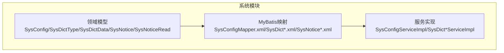
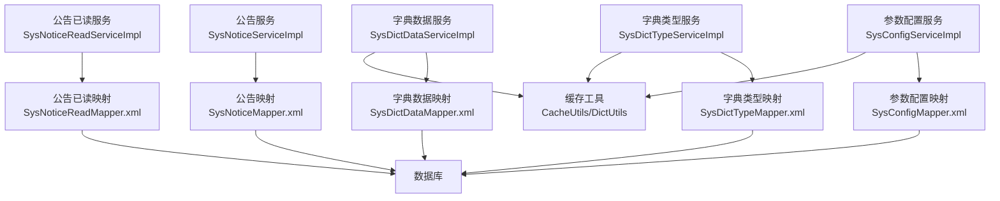
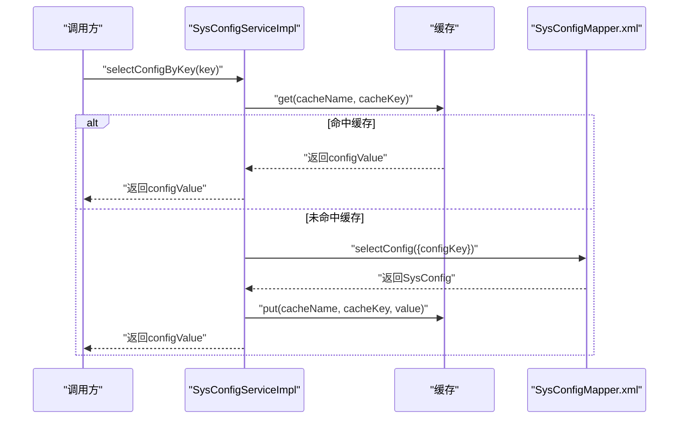
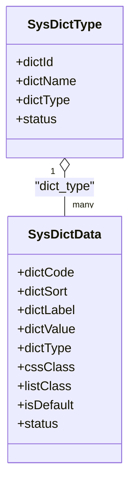
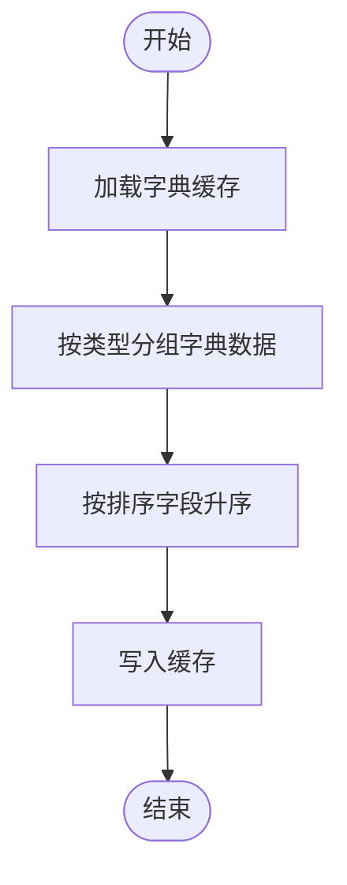
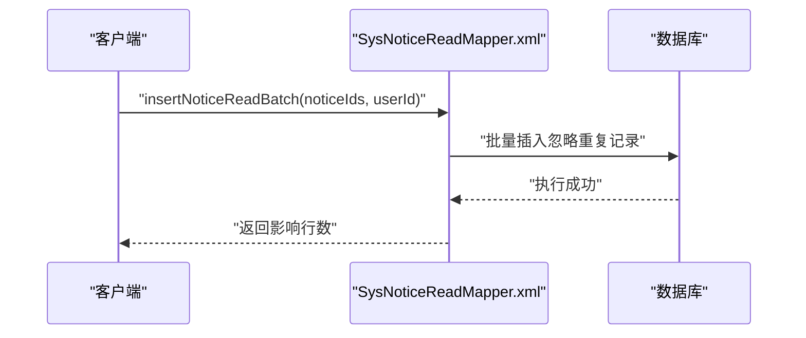
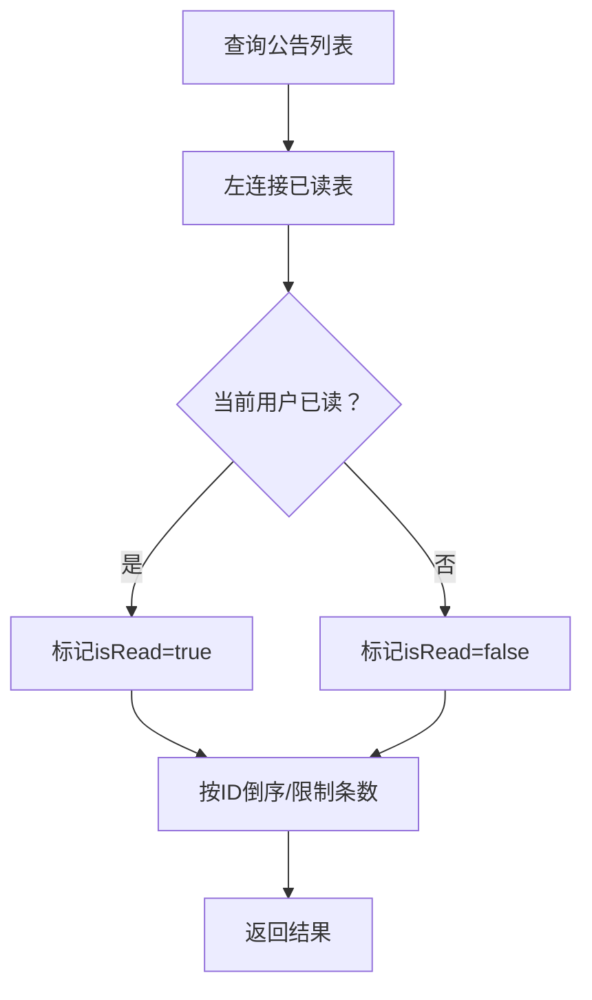
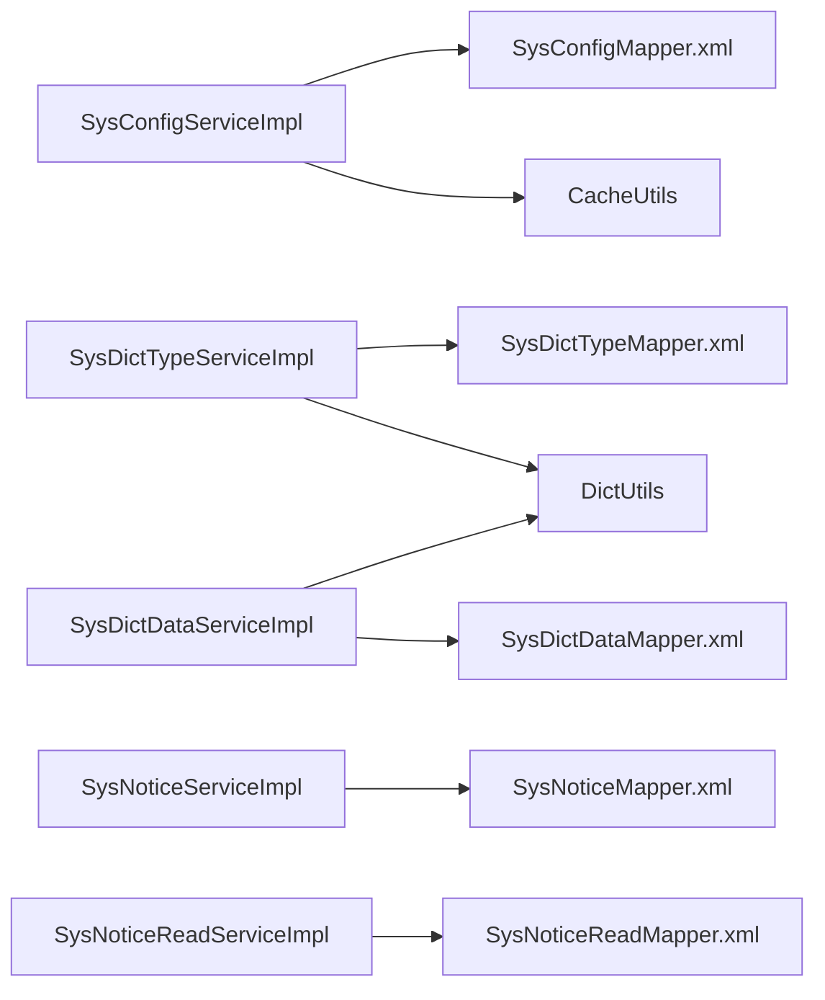

# 系统管理表结构

<cite>
**本文引用的文件**
- [SysConfig.java](file://ruoyi-system/src/main/java/com/ruoyi/system/domain/SysConfig.java)
- [SysConfigMapper.xml](file://ruoyi-system/src/main/resources/mapper/system/SysConfigMapper.xml)
- [SysConfigServiceImpl.java](file://ruoyi-system/src/main/java/com/ruoyi/system/service/impl/SysConfigServiceImpl.java)
- [SysDictType.java](file://ruoyi-common/src/main/java/com/ruoyi/common/core/domain/entity/SysDictType.java)
- [SysDictData.java](file://ruoyi-common/src/main/java/com/ruoyi/common/core/domain/entity/SysDictData.java)
- [SysDictTypeMapper.xml](file://ruoyi-system/src/main/resources/mapper/system/SysDictTypeMapper.xml)
- [SysDictDataMapper.xml](file://ruoyi-system/src/main/resources/mapper/system/SysDictDataMapper.xml)
- [SysDictTypeServiceImpl.java](file://ruoyi-system/src/main/java/com/ruoyi/system/service/impl/SysDictTypeServiceImpl.java)
- [SysDictDataServiceImpl.java](file://ruoyi-system/src/main/java/com/ruoyi/system/service/impl/SysDictDataServiceImpl.java)
- [SysNotice.java](file://ruoyi-system/src/main/java/com/ruoyi/system/domain/SysNotice.java)
- [SysNoticeMapper.xml](file://ruoyi-system/src/main/resources/mapper/system/SysNoticeMapper.xml)
- [SysNoticeRead.java](file://ruoyi-system/src/main/java/com/ruoyi/system/domain/SysNoticeRead.java)
- [SysNoticeReadMapper.xml](file://ruoyi-system/src/main/resources/mapper/system/SysNoticeReadMapper.xml)
</cite>

## 目录
1. [引言](#引言)
2. [项目结构](#项目结构)
3. [核心组件](#核心组件)
4. [架构总览](#架构总览)
5. [详细组件分析](#详细组件分析)
6. [依赖分析](#依赖分析)
7. [性能考虑](#性能考虑)
8. [故障排查指南](#故障排查指南)
9. [结论](#结论)
10. [附录](#附录)

## 引言
本文件聚焦于RuoYi系统中的“系统管理”相关表结构与实现，围绕以下核心表展开：
- 参数配置表（sys_config）
- 字典类型表（sys_dict_type）
- 字典数据表（sys_dict_data）
- 通知公告表（sys_notice）
- 公告已读记录表（sys_notice_read）

文档从数据模型、MyBatis映射、服务层缓存策略、以及通知公告的阅读状态管理等方面进行深入解析，并提供数据迁移、备份恢复与性能优化建议，帮助读者全面理解系统管理功能的设计与运维要点。

## 项目结构
系统管理相关代码采用“领域模型 + MyBatis映射 + 服务层实现”的分层组织方式：
- 领域模型位于 system 模块的 domain 或 common 的 entity 包中
- MyBatis 映射文件位于 system 模块的 resources/mapper/system 下
- 服务层实现位于 system 模块的 service/impl 下

图示来源
- [SysConfig.java:1-111](file://ruoyi-system/src/main/java/com/ruoyi/system/domain/SysConfig.java#L1-L111)
- [SysConfigMapper.xml:1-117](file://ruoyi-system/src/main/resources/mapper/system/SysConfigMapper.xml#L1-L117)
- [SysConfigServiceImpl.java:1-220](file://ruoyi-system/src/main/java/com/ruoyi/system/service/impl/SysConfigServiceImpl.java#L1-L220)
- [SysDictType.java:1-95](file://ruoyi-common/src/main/java/com/ruoyi/common/core/domain/entity/SysDictType.java#L1-L95)
- [SysDictData.java:1-177](file://ruoyi-common/src/main/java/com/ruoyi/common/core/domain/entity/SysDictData.java#L1-L177)
- [SysDictTypeMapper.xml:1-105](file://ruoyi-system/src/main/resources/mapper/system/SysDictTypeMapper.xml#L1-L105)
- [SysDictDataMapper.xml:1-123](file://ruoyi-system/src/main/resources/mapper/system/SysDictDataMapper.xml#L1-L123)
- [SysDictTypeServiceImpl.java:1-261](file://ruoyi-system/src/main/java/com/ruoyi/system/service/impl/SysDictTypeServiceImpl.java#L1-L261)
- [SysDictDataServiceImpl.java:1-114](file://ruoyi-system/src/main/java/com/ruoyi/system/service/impl/SysDictDataServiceImpl.java#L1-L114)
- [SysNotice.java:1-118](file://ruoyi-system/src/main/java/com/ruoyi/system/domain/SysNotice.java#L1-L118)
- [SysNoticeMapper.xml:1-86](file://ruoyi-system/src/main/resources/mapper/system/SysNoticeMapper.xml#L1-L86)
- [SysNoticeRead.java:1-77](file://ruoyi-system/src/main/java/com/ruoyi/system/domain/SysNoticeRead.java#L1-L77)
- [SysNoticeReadMapper.xml:1-67](file://ruoyi-system/src/main/resources/mapper/system/SysNoticeReadMapper.xml#L1-L67)

章节来源
- [SysConfig.java:1-111](file://ruoyi-system/src/main/java/com/ruoyi/system/domain/SysConfig.java#L1-L111)
- [SysConfigMapper.xml:1-117](file://ruoyi-system/src/main/resources/mapper/system/SysConfigMapper.xml#L1-L117)
- [SysConfigServiceImpl.java:1-220](file://ruoyi-system/src/main/java/com/ruoyi/system/service/impl/SysConfigServiceImpl.java#L1-L220)
- [SysDictType.java:1-95](file://ruoyi-common/src/main/java/com/ruoyi/common/core/domain/entity/SysDictType.java#L1-L95)
- [SysDictData.java:1-177](file://ruoyi-common/src/main/java/com/ruoyi/common/core/domain/entity/SysDictData.java#L1-L177)
- [SysDictTypeMapper.xml:1-105](file://ruoyi-system/src/main/resources/mapper/system/SysDictTypeMapper.xml#L1-L105)
- [SysDictDataMapper.xml:1-123](file://ruoyi-system/src/main/resources/mapper/system/SysDictDataMapper.xml#L1-L123)
- [SysDictTypeServiceImpl.java:1-261](file://ruoyi-system/src/main/java/com/ruoyi/system/service/impl/SysDictTypeServiceImpl.java#L1-L261)
- [SysDictDataServiceImpl.java:1-114](file://ruoyi-system/src/main/java/com/ruoyi/system/service/impl/SysDictDataServiceImpl.java#L1-L114)
- [SysNotice.java:1-118](file://ruoyi-system/src/main/java/com/ruoyi/system/domain/SysNotice.java#L1-L118)
- [SysNoticeMapper.xml:1-86](file://ruoyi-system/src/main/resources/mapper/system/SysNoticeMapper.xml#L1-L86)
- [SysNoticeRead.java:1-77](file://ruoyi-system/src/main/java/com/ruoyi/system/domain/SysNoticeRead.java#L1-L77)
- [SysNoticeReadMapper.xml:1-67](file://ruoyi-system/src/main/resources/mapper/system/SysNoticeReadMapper.xml#L1-L67)

## 核心组件
本节概述各系统管理表的核心字段、约束与职责边界，并说明其在系统中的作用。

- 参数配置表（sys_config）
  - 职责：存储系统运行所需的键值对配置项，支持内置与自定义配置区分
  - 关键字段：配置主键、配置名称、配置键名、配置键值、配置类型（内置/自定义）
  - 约束：键名唯一；内置配置不可删除
  - 用途：全局配置项的集中化管理与缓存访问

- 字典类型表（sys_dict_type）
  - 职责：定义字典分类（类型），用于归类字典数据
  - 关键字段：字典主键、字典名称、字典类型标识、状态
  - 约束：类型标识需满足命名规范；类型唯一
  - 用途：作为字典数据的父级分类

- 字典数据表（sys_dict_data）
  - 职责：承载具体字典项（标签/键值），按类型关联
  - 关键字段：字典编码、排序、标签、键值、类型、样式、是否默认、状态
  - 约束：标签与键值非空；同一类型下可多条数据
  - 用途：前端展示与业务逻辑使用的枚举/常量数据

- 通知公告表（sys_notice）
  - 职责：发布系统通知与公告，支持类型区分与状态控制
  - 关键字段：公告ID、标题、类型（通知/公告）、内容、状态（正常/关闭）、阅读标记
  - 约束：标题长度与XSS校验；状态控制可见性
  - 用途：面向用户的系统消息推送

- 公告已读记录表（sys_notice_read）
  - 职责：记录用户对公告的已读行为，支撑阅读状态统计
  - 关键字段：已读记录主键、公告ID、用户ID、阅读时间
  - 约束：联合唯一索引（公告ID+用户ID）保障幂等
  - 用途：计算未读数量、判断是否已读、批量标记已读

章节来源
- [SysConfig.java:10-111](file://ruoyi-system/src/main/java/com/ruoyi/system/domain/SysConfig.java#L10-L111)
- [SysDictType.java:10-95](file://ruoyi-common/src/main/java/com/ruoyi/common/core/domain/entity/SysDictType.java#L10-L95)
- [SysDictData.java:11-177](file://ruoyi-common/src/main/java/com/ruoyi/common/core/domain/entity/SysDictData.java#L11-L177)
- [SysNotice.java:11-118](file://ruoyi-system/src/main/java/com/ruoyi/system/domain/SysNotice.java#L11-L118)
- [SysNoticeRead.java:7-77](file://ruoyi-system/src/main/java/com/ruoyi/system/domain/SysNoticeRead.java#L7-L77)

## 架构总览
系统管理功能遵循“控制器-服务-持久层”的典型分层架构，结合缓存提升读取性能，并通过MyBatis完成数据库交互。

图示来源
- [SysConfigServiceImpl.java:1-220](file://ruoyi-system/src/main/java/com/ruoyi/system/service/impl/SysConfigServiceImpl.java#L1-L220)
- [SysDictTypeServiceImpl.java:1-261](file://ruoyi-system/src/main/java/com/ruoyi/system/service/impl/SysDictTypeServiceImpl.java#L1-L261)
- [SysDictDataServiceImpl.java:1-114](file://ruoyi-system/src/main/java/com/ruoyi/system/service/impl/SysDictDataServiceImpl.java#L1-L114)
- [SysConfigMapper.xml:1-117](file://ruoyi-system/src/main/resources/mapper/system/SysConfigMapper.xml#L1-L117)
- [SysDictTypeMapper.xml:1-105](file://ruoyi-system/src/main/resources/mapper/system/SysDictTypeMapper.xml#L1-L105)
- [SysDictDataMapper.xml:1-123](file://ruoyi-system/src/main/resources/mapper/system/SysDictDataMapper.xml#L1-L123)
- [SysNoticeMapper.xml:1-86](file://ruoyi-system/src/main/resources/mapper/system/SysNoticeMapper.xml#L1-L86)
- [SysNoticeReadMapper.xml:1-67](file://ruoyi-system/src/main/resources/mapper/system/SysNoticeReadMapper.xml#L1-L67)

## 详细组件分析

### 参数配置表（sys_config）设计与缓存策略
- 键值对存储机制
  - 通过配置键名（config_key）唯一标识配置项，键值（config_value）存储实际值
  - 支持“系统内置（config_type）”标记，用于区分可编辑与受保护配置
- 配置项分类管理
  - 通过“类型”字段进行分类，如环境、功能开关等
  - 提供唯一性校验（键名唯一），避免重复配置
- 读写流程与缓存
  - 启动时加载全部配置至缓存
  - 读取优先命中缓存，未命中再查库并回填缓存
  - 写入/更新/删除后同步更新缓存，保证一致性
- 安全与合规
  - 内置配置禁止删除，防止误操作破坏系统运行

图示来源
- [SysConfigServiceImpl.java:57-74](file://ruoyi-system/src/main/java/com/ruoyi/system/service/impl/SysConfigServiceImpl.java#L57-L74)
- [SysConfigMapper.xml:67-70](file://ruoyi-system/src/main/resources/mapper/system/SysConfigMapper.xml#L67-L70)

章节来源
- [SysConfig.java:10-111](file://ruoyi-system/src/main/java/com/ruoyi/system/domain/SysConfig.java#L10-L111)
- [SysConfigMapper.xml:19-70](file://ruoyi-system/src/main/resources/mapper/system/SysConfigMapper.xml#L19-L70)
- [SysConfigServiceImpl.java:28-179](file://ruoyi-system/src/main/java/com/ruoyi/system/service/impl/SysConfigServiceImpl.java#L28-L179)

### 字典类型与字典数据表（sys_dict_type / sys_dict_data）
- 层级结构设计
  - 字典类型（sys_dict_type）为父级分类，字典数据（sys_dict_data）为子项
  - 数据通过“字典类型（dict_type）”字段关联，形成一对多关系
- 维护策略
  - 类型唯一性校验，防止重复类型
  - 类型变更时，同步更新对应数据的类型字段并刷新缓存
  - 删除类型前检查是否存在数据引用，避免破坏性删除
- 缓存与排序
  - 启动时按类型聚合加载字典数据，并按排序字段升序排列
  - 读取时优先命中缓存，减少数据库压力

图示来源
- [SysDictType.java:15-95](file://ruoyi-common/src/main/java/com/ruoyi/common/core/domain/entity/SysDictType.java#L15-L95)
- [SysDictData.java:16-177](file://ruoyi-common/src/main/java/com/ruoyi/common/core/domain/entity/SysDictData.java#L16-L177)

图示来源
- [SysDictTypeServiceImpl.java:142-151](file://ruoyi-system/src/main/java/com/ruoyi/system/service/impl/SysDictTypeServiceImpl.java#L142-L151)

章节来源
- [SysDictType.java:10-95](file://ruoyi-common/src/main/java/com/ruoyi/common/core/domain/entity/SysDictType.java#L10-L95)
- [SysDictData.java:11-177](file://ruoyi-common/src/main/java/com/ruoyi/common/core/domain/entity/SysDictData.java#L11-L177)
- [SysDictTypeMapper.xml:18-61](file://ruoyi-system/src/main/resources/mapper/system/SysDictTypeMapper.xml#L18-L61)
- [SysDictDataMapper.xml:23-60](file://ruoyi-system/src/main/resources/mapper/system/SysDictDataMapper.xml#L23-L60)
- [SysDictTypeServiceImpl.java:38-208](file://ruoyi-system/src/main/java/com/ruoyi/system/service/impl/SysDictTypeServiceImpl.java#L38-L208)
- [SysDictDataServiceImpl.java:23-112](file://ruoyi-system/src/main/java/com/ruoyi/system/service/impl/SysDictDataServiceImpl.java#L23-L112)

### 通知公告与已读状态管理（sys_notice / sys_notice_read）
- 消息推送与可见性
  - 公告状态为“正常”时对外可见；关闭状态不显示
  - 支持按类型区分“通知/公告”，便于前端差异化展示
- 阅读状态管理
  - 已读记录表通过“公告ID+用户ID”唯一索引，确保幂等插入
  - 提供“是否已读”判断、未读数量统计、带已读状态的公告列表查询
  - 支持批量标记已读，提升用户体验
- 性能与一致性
  - 列表查询通过左连接与exists子查询组合，兼顾准确性与性能
  - 删除公告时同步清理已读记录，避免脏数据

图示来源
- [SysNoticeReadMapper.xml:49-56](file://ruoyi-system/src/main/resources/mapper/system/SysNoticeReadMapper.xml#L49-L56)

图示来源
- [SysNoticeReadMapper.xml:31-47](file://ruoyi-system/src/main/resources/mapper/system/SysNoticeReadMapper.xml#L31-L47)

章节来源
- [SysNotice.java:11-118](file://ruoyi-system/src/main/java/com/ruoyi/system/domain/SysNotice.java#L11-L118)
- [SysNoticeMapper.xml:20-44](file://ruoyi-system/src/main/resources/mapper/system/SysNoticeMapper.xml#L20-L44)
- [SysNoticeRead.java:7-77](file://ruoyi-system/src/main/java/com/ruoyi/system/domain/SysNoticeRead.java#L7-L77)
- [SysNoticeReadMapper.xml:14-67](file://ruoyi-system/src/main/resources/mapper/system/SysNoticeReadMapper.xml#L14-L67)

## 依赖分析
- 组件耦合
  - 服务层通过Mapper接口访问数据库，保持低耦合
  - 缓存工具与字典工具被广泛使用，提升读取效率
- 外部依赖
  - MyBatis作为ORM框架，负责SQL映射与结果集映射
  - Spring容器管理服务实例与生命周期（如@PostConstruct初始化）

图示来源
- [SysConfigServiceImpl.java:22-26](file://ruoyi-system/src/main/java/com/ruoyi/system/service/impl/SysConfigServiceImpl.java#L22-L26)
- [SysDictTypeServiceImpl.java:32-36](file://ruoyi-system/src/main/java/com/ruoyi/system/service/impl/SysDictTypeServiceImpl.java#L32-L36)
- [SysDictDataServiceImpl.java:20-21](file://ruoyi-system/src/main/java/com/ruoyi/system/service/impl/SysDictDataServiceImpl.java#L20-L21)

章节来源
- [SysConfigServiceImpl.java:1-220](file://ruoyi-system/src/main/java/com/ruoyi/system/service/impl/SysConfigServiceImpl.java#L1-L220)
- [SysDictTypeServiceImpl.java:1-261](file://ruoyi-system/src/main/java/com/ruoyi/system/service/impl/SysDictTypeServiceImpl.java#L1-L261)
- [SysDictDataServiceImpl.java:1-114](file://ruoyi-system/src/main/java/com/ruoyi/system/service/impl/SysDictDataServiceImpl.java#L1-L114)

## 性能考虑
- 缓存策略
  - 参数配置与字典数据均采用启动加载+缓存读取的方式，显著降低数据库压力
  - 更新/删除后及时刷新缓存，保证一致性
- SQL优化
  - 使用exists子查询快速判断“是否已读”，避免不必要的全表扫描
  - 列表查询通过左连接与limit限制返回数量，控制响应规模
- 索引与约束
  - 已读记录表的联合唯一索引（notice_id, user_id）保障幂等性
  - 配置键名唯一性约束，避免重复键导致的歧义

## 故障排查指南
- 参数配置
  - 现象：修改配置后未生效
  - 排查：确认缓存是否已刷新；检查内置配置是否被误删或误改
  - 参考路径：[SysConfigServiceImpl.java:111-126](file://ruoyi-system/src/main/java/com/ruoyi/system/service/impl/SysConfigServiceImpl.java#L111-L126)，[SysConfigMapper.xml:67-70](file://ruoyi-system/src/main/resources/mapper/system/SysConfigMapper.xml#L67-L70)
- 字典数据
  - 现象：类型变更后旧数据仍显示旧类型
  - 排查：确认类型变更是否触发数据类型字段更新与缓存刷新
  - 参考路径：[SysDictTypeServiceImpl.java:196-208](file://ruoyi-system/src/main/java/com/ruoyi/system/service/impl/SysDictTypeServiceImpl.java#L196-L208)，[SysDictDataMapper.xml:91-93](file://ruoyi-system/src/main/resources/mapper/system/SysDictDataMapper.xml#L91-L93)
- 通知公告
  - 现象：已读状态不同步或未读计数异常
  - 排查：检查批量插入是否幂等执行；确认删除公告时是否清理了已读记录
  - 参考路径：[SysNoticeReadMapper.xml:14-18](file://ruoyi-system/src/main/resources/mapper/system/SysNoticeReadMapper.xml#L14-L18)，[SysNoticeReadMapper.xml:58-64](file://ruoyi-system/src/main/resources/mapper/system/SysNoticeReadMapper.xml#L58-L64)

章节来源
- [SysConfigServiceImpl.java:111-147](file://ruoyi-system/src/main/java/com/ruoyi/system/service/impl/SysConfigServiceImpl.java#L111-L147)
- [SysDictTypeServiceImpl.java:196-208](file://ruoyi-system/src/main/java/com/ruoyi/system/service/impl/SysDictTypeServiceImpl.java#L196-L208)
- [SysNoticeReadMapper.xml:14-18](file://ruoyi-system/src/main/resources/mapper/system/SysNoticeReadMapper.xml#L14-L18)
- [SysNoticeReadMapper.xml:58-64](file://ruoyi-system/src/main/resources/mapper/system/SysNoticeReadMapper.xml#L58-L64)

## 结论
RuoYi系统管理表通过清晰的表结构设计与完善的缓存策略，实现了配置项、字典数据与公告消息的高效管理。参数配置与字典数据的缓存读取显著提升了系统性能；公告已读状态通过幂等插入与SQL优化保障了准确性与可扩展性。整体架构具备良好的扩展性与维护便利性，适合在生产环境中长期演进。

## 附录
- 数据迁移建议
  - 参数配置：导出sys_config后按键名唯一性导入，注意内置配置的保留策略
  - 字典类型/数据：先导入类型，再导入数据，确保dict_type一致；导入后执行缓存重载
  - 公告与已读：导出公告与已读记录，导入时保持notice_id与user_id的对应关系
- 备份恢复
  - 建议定期对上述表进行逻辑备份；恢复时先恢复类型/配置，再恢复数据与公告
- 性能优化
  - 为常用查询字段建立合适索引（如notice_id、user_id、config_key）
  - 控制公告列表返回数量，避免一次性加载过多数据
  - 对高频读取的配置与字典项，合理设置缓存失效策略与刷新频率