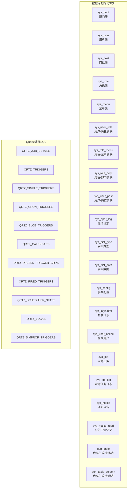
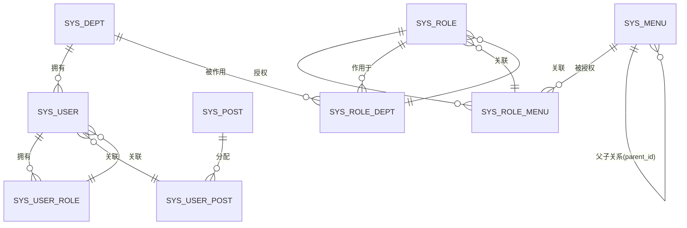
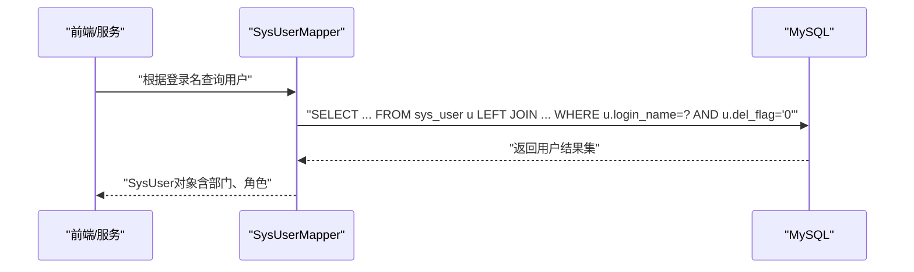
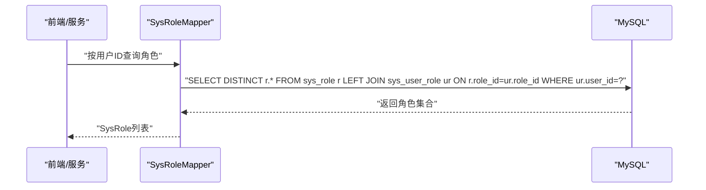
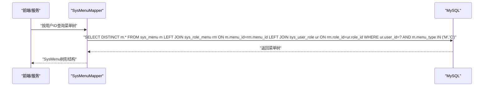
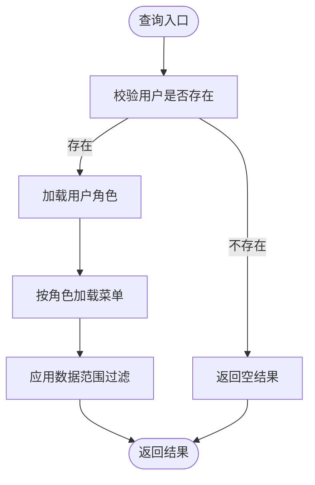

# 数据库设计

<cite>
**本文引用的文件**   
- [ry_20260319.sql](file://sql/ry_20260319.sql)
- [quartz.sql](file://sql/quartz.sql)
- [SysUserMapper.xml](file://ruoyi-system/src/main/resources/mapper/system/SysUserMapper.xml)
- [SysRoleMapper.xml](file://ruoyi-system/src/main/resources/mapper/system/SysRoleMapper.xml)
- [SysMenuMapper.xml](file://ruoyi-system/src/main/resources/mapper/system/SysMenuMapper.xml)
- [SysUser.java](file://ruoyi-common/src/main/java/com/ruoyi/common/core/domain/entity/SysUser.java)
- [SysRole.java](file://ruoyi-common/src/main/java/com/ruoyi/common/core/domain/entity/SysRole.java)
- [SysMenu.java](file://ruoyi-common/src/main/java/com/ruoyi/common/core/domain/entity/SysMenu.java)
- [SysDept.java](file://ruoyi-common/src/main/java/com/ruoyi/common/core/domain/entity/SysDept.java)
- [SysPost.java](file://ruoyi-system/src/main/java/com/ruoyi/system/domain/SysPost.java)
- [application.yml](file://ruoyi-admin/src/main/resources/application.yml)
- [application-druid.yml](file://ruoyi-admin/src/main/resources/application-druid.yml)
</cite>

## 目录
1. [简介](#简介)
2. [项目结构](#项目结构)
3. [核心组件](#核心组件)
4. [架构总览](#架构总览)
5. [详细组件分析](#详细组件分析)
6. [依赖分析](#依赖分析)
7. [性能考虑](#性能考虑)
8. [故障排查指南](#故障排查指南)
9. [结论](#结论)
10. [附录](#附录)

## 简介
本文件面向RuoYi系统的数据库设计，基于仓库中的初始化SQL与MyBatis映射文件，系统性梳理核心业务实体的表结构、主键设计、外键关系与索引策略，给出ER关系图与表间关联的可视化展示，并提供数据库初始化脚本执行说明、数据字典维护方法、数据迁移与备份恢复方案、性能优化建议以及常见数据问题的诊断与修复思路。

## 项目结构
RuoYi数据库相关的核心文件集中在sql目录与ruoyi-system、ruoyi-common模块的Mapper与实体类中：
- 初始化SQL：包含业务主表、字典表、系统配置、定时任务调度表等
- Quartz调度表：独立于业务表，用于任务调度
- MyBatis映射：通过XML映射文件定义查询、更新、删除等SQL
- 实体类：对应各表的Java模型，承载字段校验与业务语义

图表来源
- [ry_20260319.sql:1-739](file://sql/ry_20260319.sql#L1-L739)
- [quartz.sql:1-174](file://sql/quartz.sql#L1-L174)

章节来源
- [ry_20260319.sql:1-739](file://sql/ry_20260319.sql#L1-L739)
- [quartz.sql:1-174](file://sql/quartz.sql#L1-L174)

## 核心组件
本节对关键业务表进行字段定义、主键设计、外键关系与索引策略的说明，并结合实体类与Mapper文件验证字段映射与查询逻辑。

- 部门表 sys_dept
  - 主键：dept_id（自增）
  - 关键字段：parent_id、ancestors、dept_name、order_num、leader、phone、email、status、del_flag
  - 约束：非空、默认值、删除标志位
  - 索引：无显式索引（建议按业务查询建立）

- 用户表 sys_user
  - 主键：user_id（自增）
  - 外键：dept_id → sys_dept.dept_id
  - 关键字段：login_name（唯一性）、user_name、user_type、email、phonenumber、sex、avatar、password、salt、status、del_flag、login_ip、login_date、pwd_update_date、remark
  - 约束：唯一性校验（登录名、手机号、邮箱唯一性查询由Mapper提供）
  - 索引：无显式索引（建议按登录名、手机号、邮箱、创建时间建立）

- 岗位表 sys_post
  - 主键：post_id（自增）
  - 关键字段：post_code（唯一性）、post_name、post_sort、status、remark
  - 约束：唯一性、非空校验
  - 索引：无显式索引（建议按post_code建立）

- 角色表 sys_role
  - 主键：role_id（自增）
  - 关键字段：role_name（唯一性）、role_key（唯一性）、role_sort、data_scope、status、del_flag、remark
  - 约束：唯一性校验（名称、权限字符串）
  - 索引：无显式索引（建议按role_key建立）

- 菜单表 sys_menu
  - 主键：menu_id（自增）
  - 外键：parent_id → sys_menu.menu_id（自关联）
  - 关键字段：menu_name（唯一性校验）、parent_id、order_num、url、target、menu_type、visible、is_refresh、perms、icon、remark
  - 约束：唯一性校验（同父节点下菜单名唯一）
  - 索引：无显式索引（建议按parent_id、menu_type、visible建立）

- 用户-角色关联表 sys_user_role
  - 主键：user_id、role_id（联合主键）
  - 外键：user_id → sys_user.user_id；role_id → sys_role.role_id
  - 用途：多对多关联

- 角色-菜单关联表 sys_role_menu
  - 主键：role_id、menu_id（联合主键）
  - 外键：role_id → sys_role.role_id；menu_id → sys_menu.menu_id

- 角色-部门关联表 sys_role_dept
  - 主键：role_id、dept_id（联合主键）
  - 外键：role_id → sys_role.role_id；dept_id → sys_dept.dept_id

- 用户-岗位关联表 sys_user_post
  - 主键：user_id、post_id（联合主键）
  - 外键：user_id → sys_user.user_id；post_id → sys_post.post_id

- 操作日志表 sys_oper_log
  - 主键：oper_id（自增）
  - 关键字段：title、business_type、method、request_method、operator_type、oper_name、dept_name、oper_url、oper_ip、oper_location、oper_param、json_result、status、error_msg、oper_time、cost_time
  - 索引：idx_sys_oper_log_bt、idx_sys_oper_log_s、idx_sys_oper_log_ot（按业务类型、状态、时间）

- 字典类型表 sys_dict_type
  - 主键：dict_id（自增）
  - 唯一索引：dict_type（唯一性）

- 字典数据表 sys_dict_data
  - 主键：dict_code（自增）
  - 关键字段：dict_sort、dict_label、dict_value、dict_type、css_class、list_class、is_default、status、remark
  - 索引：无显式索引（建议按dict_type、is_default建立）

- 参数配置表 sys_config
  - 主键：config_id（自增）
  - 关键字段：config_name、config_key（唯一性）、config_value、config_type、remark
  - 索引：无显式索引（建议按config_key建立）

- 登录日志表 sys_logininfor
  - 主键：info_id（自增）
  - 关键字段：login_name、ipaddr、login_location、browser、os、status、msg、login_time
  - 索引：idx_sys_logininfor_s、idx_sys_logininfor_lt（按状态、登录时间）

- 在线用户表 sys_user_online
  - 主键：sessionId
  - 关键字段：login_name、dept_name、ipaddr、login_location、browser、os、status、start_timestamp、last_access_time、expire_time、session_data
  - 索引：无显式索引（建议按login_name、last_access_time建立）

- 定时任务表 sys_job
  - 主键：job_id（自增）
  - 关键字段：job_name、job_group、invoke_target、cron_expression、misfire_policy、concurrent、status、remark
  - 索引：无显式索引（建议按job_group、status建立）

- 定时任务日志表 sys_job_log
  - 主键：job_log_id（自增）
  - 关键字段：job_name、job_group、invoke_target、job_message、status、exception_info、start_time、end_time、create_time
  - 索引：无显式索引（建议按job_name、status、start_time建立）

- 公告表 sys_notice
  - 主键：notice_id（自增）
  - 关键字段：notice_title、notice_type、notice_content、status、remark
  - 索引：无显式索引（建议按notice_type、status建立）

- 公告已读记录表 sys_notice_read
  - 主键：read_id（自增）
  - 唯一索引：uk_user_notice（user_id、notice_id）
  - 外键：notice_id → sys_notice.notice_id；user_id → sys_user.user_id

- 代码生成业务表 gen_table
  - 主键：table_id（自增）
  - 关键字段：table_name、table_comment、sub_table_name、sub_table_fk_name、class_name、tpl_category、package_name、module_name、business_name、function_name、function_author、form_col_num、gen_type、gen_path、options、remark
  - 索引：无显式索引（建议按table_name、module_name建立）

- 代码生成字段表 gen_table_column
  - 主键：column_id（自增）
  - 关键字段：table_id、column_name、column_comment、column_type、java_type、java_field、is_pk、is_increment、is_required、is_insert、is_edit、is_list、is_query、query_type、html_type、dict_type、sort、remark
  - 索引：无显式索引（建议按table_id、sort建立）

章节来源
- [ry_20260319.sql:1-739](file://sql/ry_20260319.sql#L1-L739)
- [SysUser.java:1-382](file://ruoyi-common/src/main/java/com/ruoyi/common/core/domain/entity/SysUser.java#L1-L382)
- [SysRole.java:1-212](file://ruoyi-common/src/main/java/com/ruoyi/common/core/domain/entity/SysRole.java#L1-L212)
- [SysMenu.java:1-215](file://ruoyi-common/src/main/java/com/ruoyi/common/core/domain/entity/SysMenu.java#L1-L215)
- [SysDept.java:1-204](file://ruoyi-common/src/main/java/com/ruoyi/common/core/domain/entity/SysDept.java#L1-L204)
- [SysPost.java:1-123](file://ruoyi-system/src/main/java/com/ruoyi/system/domain/SysPost.java#L1-L123)

## 架构总览
RuoYi数据库围绕“用户-角色-菜单”权限体系与“部门-岗位-用户”的组织架构展开，配合字典、配置、日志、公告、定时任务等支撑能力，形成完整的业务闭环。

图表来源
- [ry_20260319.sql:1-739](file://sql/ry_20260319.sql#L1-L739)

## 详细组件分析

### 用户表与关联关系
- 主键：user_id
- 外键：dept_id → sys_dept.dept_id
- 关联表：sys_user_role（用户-角色）、sys_user_post（用户-岗位）
- 查询要点：Mapper中提供按登录名、手机号、邮箱唯一性校验，以及按部门、角色、时间范围等条件查询

图表来源
- [SysUserMapper.xml:126-151](file://ruoyi-system/src/main/resources/mapper/system/SysUserMapper.xml#L126-L151)
- [SysUserMapper.xml:52-60](file://ruoyi-system/src/main/resources/mapper/system/SysUserMapper.xml#L52-L60)
- [ry_20260319.sql:41-65](file://sql/ry_20260319.sql#L41-L65)

章节来源
- [SysUserMapper.xml:1-246](file://ruoyi-system/src/main/resources/mapper/system/SysUserMapper.xml#L1-L246)
- [SysUser.java:1-382](file://ruoyi-common/src/main/java/com/ruoyi/common/core/domain/entity/SysUser.java#L1-L382)
- [ry_20260319.sql:41-65](file://sql/ry_20260319.sql#L41-L65)

### 角色表与权限关联
- 主键：role_id
- 关联表：sys_role_menu（角色-菜单）、sys_role_dept（角色-部门）、sys_user_role（用户-角色）
- 查询要点：Mapper提供按角色名、权限字符串唯一性校验，以及按数据范围过滤

图表来源
- [SysRoleMapper.xml:64-67](file://ruoyi-system/src/main/resources/mapper/system/SysRoleMapper.xml#L64-L67)
- [ry_20260319.sql:105-120](file://sql/ry_20260319.sql#L105-L120)

章节来源
- [SysRoleMapper.xml:1-134](file://ruoyi-system/src/main/resources/mapper/system/SysRoleMapper.xml#L1-L134)
- [SysRole.java:1-212](file://ruoyi-common/src/main/java/com/ruoyi/common/core/domain/entity/SysRole.java#L1-L212)
- [ry_20260319.sql:105-120](file://sql/ry_20260319.sql#L105-L120)

### 菜单表与权限树
- 主键：menu_id
- 自关联：parent_id → sys_menu.menu_id
- 关联表：sys_role_menu（角色-菜单）
- 查询要点：Mapper提供按用户ID查询菜单树、权限字符串集合、菜单列表等

图表来源
- [SysMenuMapper.xml:32-40](file://ruoyi-system/src/main/resources/mapper/system/SysMenuMapper.xml#L32-L40)
- [ry_20260319.sql:132-151](file://sql/ry_20260319.sql#L132-L151)

章节来源
- [SysMenuMapper.xml:1-197](file://ruoyi-system/src/main/resources/mapper/system/SysMenuMapper.xml#L1-L197)
- [SysMenu.java:1-215](file://ruoyi-common/src/main/java/com/ruoyi/common/core/domain/entity/SysMenu.java#L1-L215)
- [ry_20260319.sql:132-151](file://sql/ry_20260319.sql#L132-L151)

### 字典与配置
- 字典类型：sys_dict_type（唯一索引dict_type）
- 字典数据：sys_dict_data（按dict_type关联）
- 参数配置：sys_config（唯一索引config_key）
- 用途：统一管理枚举、状态、配置项，支持前端动态渲染与业务控制

章节来源
- [ry_20260319.sql:442-491](file://sql/ry_20260319.sql#L442-L491)
- [ry_20260319.sql:527-540](file://sql/ry_20260319.sql#L527-L540)

### 日志与监控
- 操作日志：sys_oper_log（按业务类型、状态、时间建立索引）
- 登录日志：sys_logininfor（按状态、登录时间建立索引）
- 在线用户：sys_user_online（按登录名、最后访问时间建立索引）
- 用途：审计追踪、性能分析、安全监控

章节来源
- [ry_20260319.sql:413-436](file://sql/ry_20260319.sql#L413-L436)
- [ry_20260319.sql:558-572](file://sql/ry_20260319.sql#L558-L572)
- [ry_20260319.sql:578-593](file://sql/ry_20260319.sql#L578-L593)

### 定时任务调度
- 业务表：sys_job、sys_job_log
- Quartz表：QRTZ_*（独立调度引擎）
- 用途：异步任务、定时清理、周期性报表

章节来源
- [ry_20260319.sql:599-638](file://sql/ry_20260319.sql#L599-L638)
- [quartz.sql:1-174](file://sql/quartz.sql#L1-L174)

## 依赖分析
- 低耦合：业务表之间通过中间表解耦（用户-角色、角色-菜单、角色-部门、用户-岗位）
- 外键约束：初始化脚本未显式声明外键，实际约束依赖应用层与业务规则
- 查询依赖：MyBatis映射文件集中定义了跨表查询与条件过滤

图表来源
- [SysUserMapper.xml:62-89](file://ruoyi-system/src/main/resources/mapper/system/SysUserMapper.xml#L62-L89)
- [SysRoleMapper.xml:36-62](file://ruoyi-system/src/main/resources/mapper/system/SysRoleMapper.xml#L36-L62)
- [SysMenuMapper.xml:32-40](file://ruoyi-system/src/main/resources/mapper/system/SysMenuMapper.xml#L32-L40)

章节来源
- [SysUserMapper.xml:1-246](file://ruoyi-system/src/main/resources/mapper/system/SysUserMapper.xml#L1-L246)
- [SysRoleMapper.xml:1-134](file://ruoyi-system/src/main/resources/mapper/system/SysRoleMapper.xml#L1-L134)
- [SysMenuMapper.xml:1-197](file://ruoyi-system/src/main/resources/mapper/system/SysMenuMapper.xml#L1-L197)

## 性能考虑
- 索引策略
  - sys_user：login_name、phonenumber、email、create_time
  - sys_post：post_code
  - sys_role：role_key
  - sys_menu：parent_id、menu_type、visible
  - sys_oper_log：business_type、status、oper_time
  - sys_logininfor：status、login_time
  - sys_user_online：login_name、last_access_time
  - sys_job：job_group、status
  - sys_job_log：job_name、status、start_time
  - sys_notice：notice_type、status
  - sys_dict_type：dict_type
  - sys_config：config_key
  - gen_table：table_name、module_name
  - gen_table_column：table_id、sort
- 分页与排序：PageHelper已配置，建议在高频查询上增加覆盖索引
- 缓存：登录态、字典、配置可引入Redis缓存，减少数据库压力
- 连接池：Druid已启用，建议结合慢SQL日志与连接池监控优化

章节来源
- [application.yml:80-85](file://ruoyi-admin/src/main/resources/application.yml#L80-L85)
- [application-druid.yml:1-61](file://ruoyi-admin/src/main/resources/application-druid.yml#L1-L61)

## 故障排查指南
- 登录失败/频繁锁屏
  - 检查sys_logininfor状态字段与登录时间索引
  - 核对用户状态与密码更新时间
- 权限不足或菜单不可见
  - 核查sys_user_role、sys_role_menu、sys_role_dept关联是否正确
  - 检查sys_menu的visible与menu_type字段
- 操作日志过多导致查询慢
  - 建议按时间范围与状态分页查询，利用oper_time与status索引
- 定时任务异常
  - 查看sys_job_log异常信息与时间区间
  - 对照Quartz表状态与触发器配置

章节来源
- [ry_20260319.sql:558-572](file://sql/ry_20260319.sql#L558-L572)
- [ry_20260319.sql:625-638](file://sql/ry_20260319.sql#L625-L638)
- [quartz.sql:1-174](file://sql/quartz.sql#L1-L174)

## 结论
RuoYi数据库以清晰的业务表结构与灵活的中间表关联，支撑起完善的权限体系与组织架构。通过合理的索引策略、连接池与缓存配置，可在保证功能完整性的同时提升系统性能与稳定性。建议在生产环境中补充外键约束与分区策略，并持续完善数据字典与监控指标。

## 附录

### 数据库初始化脚本执行说明
- 执行顺序建议
  1) 执行业务主表与字典表：ry_20260319.sql
  2) 如需任务调度，再执行Quartz表：quartz.sql
- 执行方式
  - 使用MySQL命令行或可视化工具导入
  - 注意字符集与时区设置（脚本中已包含时区配置）
- 初始化数据
  - 脚本内包含部门、用户、岗位、角色、菜单、字典、配置、公告等初始化数据，便于快速体验

章节来源
- [ry_20260319.sql:1-739](file://sql/ry_20260319.sql#L1-L739)
- [quartz.sql:1-174](file://sql/quartz.sql#L1-L174)

### 数据字典维护方法
- 新增字典类型：向sys_dict_type插入一条记录，确保dict_type唯一
- 新增字典数据：向sys_dict_data插入多条记录，绑定到对应dict_type
- 前端渲染：通过字典类型名在页面进行回显与筛选

章节来源
- [ry_20260319.sql:442-491](file://sql/ry_20260319.sql#L442-L491)

### 数据迁移策略
- 结构迁移：使用SQL脚本增量更新，先加字段/索引，再变更数据，最后删除旧字段
- 数据迁移：采用分批导入与校验机制，保留回滚点
- 兼容性：尽量避免破坏性变更，必要时通过配置开关控制

### 备份与恢复方案
- 备份
  - 全量备份：mysqldump --single-transaction
  - 增量备份：binlog归档
- 恢复
  - 快速恢复：全量+最近binlog
  - 精准恢复：定位时间点后重放binlog

### 性能优化建议
- 索引优化：针对高频查询字段建立复合索引，避免全表扫描
- SQL优化：减少JOIN层级，使用LIMIT与覆盖索引
- 缓存策略：热点数据（字典、配置、菜单树）引入Redis
- 连接池：合理设置maxActive、minIdle与超时参数