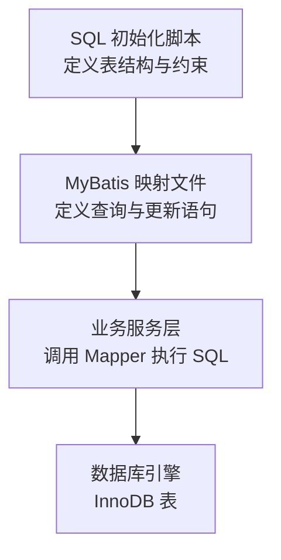
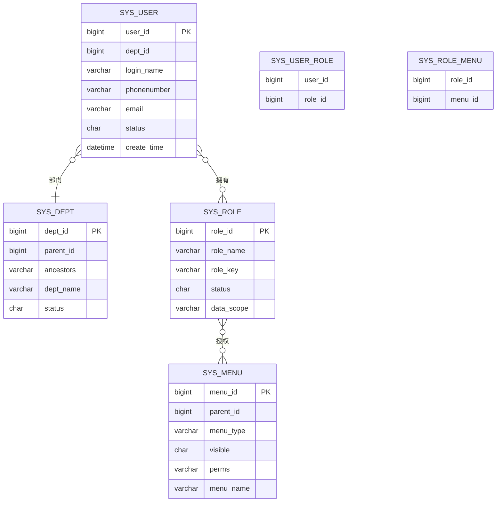
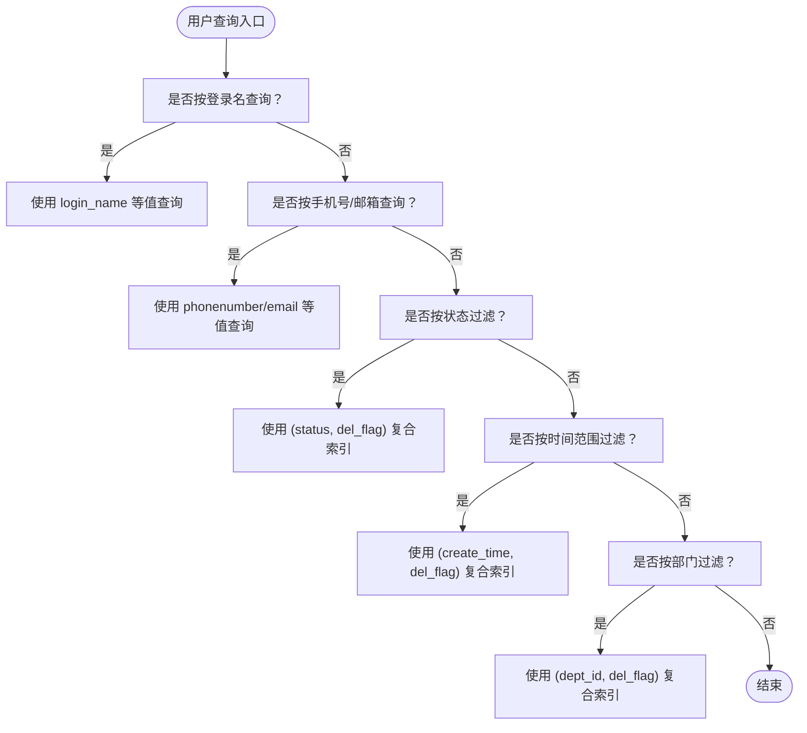
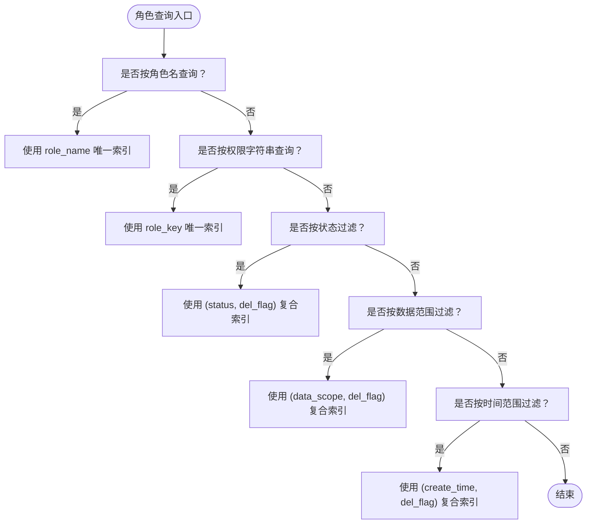
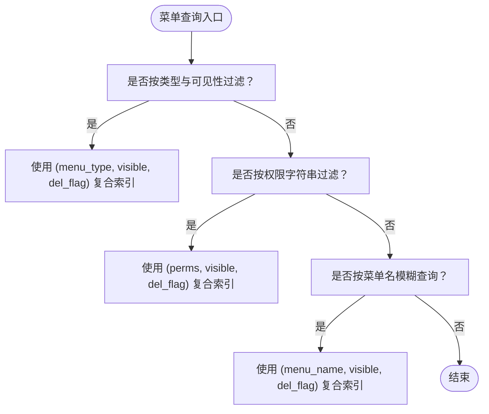
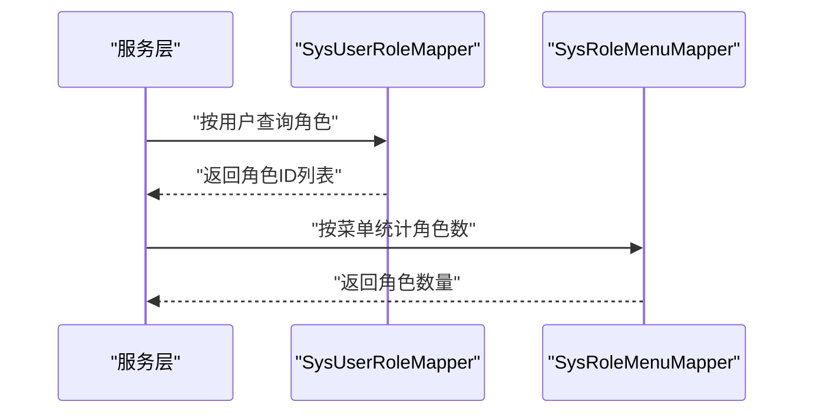
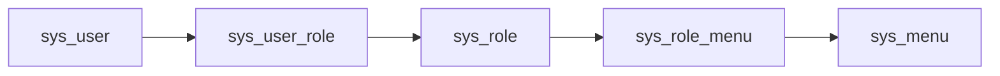

# 索引策略设计

<cite>
**本文引用的文件**
- [ry_20260319.sql](file://sql/ry_20260319.sql)
- [SysUserMapper.xml](file://ruoyi-system/src/main/resources/mapper/system/SysUserMapper.xml)
- [SysRoleMapper.xml](file://ruoyi-system/src/main/resources/mapper/system/SysRoleMapper.xml)
- [SysMenuMapper.xml](file://ruoyi-system/src/main/resources/mapper/system/SysMenuMapper.xml)
- [SysRoleMenuMapper.xml](file://ruoyi-system/src/main/resources/mapper/system/SysRoleMenuMapper.xml)
- [SysUserRoleMapper.xml](file://ruoyi-system/src/main/resources/mapper/system/SysUserRoleMapper.xml)
- [SysDeptMapper.xml](file://ruoyi-system/src/main/resources/mapper/system/SysDeptMapper.xml)
- [SysUser.java](file://ruoyi-common/src/main/java/com/ruoyi/common/core/domain/entity/SysUser.java)
- [SysRole.java](file://ruoyi-common/src/main/java/com/ruoyi/common/core/domain/entity/SysRole.java)
- [SysMenu.java](file://ruoyi-common/src/main/java/com/ruoyi/common/core/domain/entity/SysMenu.java)
</cite>

## 目录
1. [简介](#简介)
2. [项目结构](#项目结构)
3. [核心组件](#核心组件)
4. [架构总览](#架构总览)
5. [详细组件分析](#详细组件分析)
6. [依赖关系分析](#依赖关系分析)
7. [性能考量](#性能考量)
8. [故障排查指南](#故障排查指南)
9. [结论](#结论)
10. [附录](#附录)

## 简介
本文件面向数据库管理员与开发者，围绕 RuoYi 系统的数据库索引策略进行系统化梳理与优化建议。通过对业务表结构、查询语句与关联关系的深入分析，明确主键索引、唯一索引、复合索引与全文索引的应用边界，并给出高频查询字段（如用户登录名、角色/菜单权限标识等）的索引设计原则、查询性能优化、存储空间平衡、索引维护与监控方法，以及不同查询模式下的索引效果评估与最佳实践。

## 项目结构
RuoYi 的数据库层主要由两部分构成：
- SQL 初始化脚本：定义了系统的核心业务表及其约束（主键、唯一、外键、注释等）
- MyBatis 映射文件：定义了各业务表的查询、更新、删除等 SQL，这些 SQL 是索引设计的重要依据

**章节来源**
- [ry_20260319.sql:1-739](file://sql/ry_20260319.sql#L1-L739)

## 核心组件
本节聚焦于与索引设计密切相关的核心业务表与查询模式，结合 SQL 脚本与 MyBatis 映射文件，归纳出高频字段与典型查询模式。

- 用户表（sys_user）
  - 主键：user_id
  - 关联：sys_user_role（用户-角色）、sys_dept（部门）
  - 高频查询字段：login_name、phonenumber、email、status、create_time、dept_id
  - 典型查询：按登录名等值查询、按手机号/邮箱等值查询、按状态过滤、按部门树范围过滤、按时间区间过滤、按角色分配/未分配查询

- 角色表（sys_role）
  - 主键：role_id
  - 关联：sys_user_role（用户-角色）、sys_role_menu（角色-菜单）、sys_role_dept（角色-部门）
  - 高频查询字段：role_name、role_key、status、data_scope、create_time
  - 典型查询：按角色名/权限字符串等值唯一校验、按状态/数据范围过滤、按用户查询其角色

- 菜单表（sys_menu）
  - 主键：menu_id
  - 关联：sys_role_menu（角色-菜单）
  - 高频查询字段：menu_type、visible、perms、menu_name
  - 典型查询：按用户查询可访问菜单、按角色查询权限字符串、按菜单类型/可见性过滤

- 用户-角色关联表（sys_user_role）
  - 复合主键：(user_id, role_id)
  - 典型查询：按 user_id 查询角色、按 role_id 统计用户数

- 角色-菜单关联表（sys_role_menu）
  - 复合主键：(role_id, menu_id)
  - 典型查询：按 menu_id 统计角色数、批量写入

- 部门表（sys_dept）
  - 主键：dept_id
  - 特殊字段：ancestors（祖先集合，用于树形查询）
  - 典型查询：按父节点查询子节点、按祖先集合查询子孙节点、按部门名唯一校验

**章节来源**
- [ry_20260319.sql:41-65](file://sql/ry_20260319.sql#L41-L65)
- [ry_20260319.sql:105-120](file://sql/ry_20260319.sql#L105-L120)
- [ry_20260319.sql:132-151](file://sql/ry_20260319.sql#L132-L151)
- [ry_20260319.sql:262-284](file://sql/ry_20260319.sql#L262-L284)
- [ry_20260319.sql:279-284](file://sql/ry_20260319.sql#L279-L284)
- [ry_20260319.sql:77-91](file://sql/ry_20260319.sql#L77-L91)

## 架构总览
下图展示了用户、角色、菜单三张核心表之间的关联关系，以及与关联表的连接路径，为索引设计提供上下文支撑。

**图表来源**
- [ry_20260319.sql:41-65](file://sql/ry_20260319.sql#L41-L65)
- [ry_20260319.sql:105-120](file://sql/ry_20260319.sql#L105-L120)
- [ry_20260319.sql:132-151](file://sql/ry_20260319.sql#L132-L151)
- [ry_20260319.sql:262-284](file://sql/ry_20260319.sql#L262-L284)
- [ry_20260319.sql:279-284](file://sql/ry_20260319.sql#L279-L284)

## 详细组件分析

### 用户表（sys_user）索引策略
- 主键索引：user_id（已存在）
- 唯一索引：无显式唯一索引（需评估 login_name、phonenumber、email 的唯一性需求）
- 复合索引：建议针对高频查询组合建立
  - 登录名等值查询：建议为 login_name 建唯一索引或唯一约束（结合业务唯一性）
  - 手机号/邮箱等值查询：建议为 phonenumber、email 建唯一索引或唯一约束
  - 状态过滤：建议为 (status, del_flag) 建复合索引，覆盖“有效且未删除”的常用过滤
  - 时间范围查询：建议为 (create_time, del_flag) 或 (del_flag, create_time) 复合索引，满足“按时间范围查询且未删除”的场景
  - 部门树范围查询：建议为 (dept_id, del_flag) 复合索引，配合 ancestors 查询
- 全文索引：当前 MyBatis 查询使用 LIKE 模糊匹配，但字段多为标识符或短文本，不建议使用全文索引

**图表来源**
- [SysUserMapper.xml:62-89](file://ruoyi-system/src/main/resources/mapper/system/SysUserMapper.xml#L62-L89)
- [SysUserMapper.xml:91-124](file://ruoyi-system/src/main/resources/mapper/system/SysUserMapper.xml#L91-L124)
- [SysUserMapper.xml:126-151](file://ruoyi-system/src/main/resources/mapper/system/SysUserMapper.xml#L126-L151)

**章节来源**
- [SysUserMapper.xml:62-89](file://ruoyi-system/src/main/resources/mapper/system/SysUserMapper.xml#L62-L89)
- [SysUserMapper.xml:91-124](file://ruoyi-system/src/main/resources/mapper/system/SysUserMapper.xml#L91-L124)
- [SysUserMapper.xml:126-151](file://ruoyi-system/src/main/resources/mapper/system/SysUserMapper.xml#L126-L151)
- [ry_20260319.sql:41-65](file://sql/ry_20260319.sql#L41-L65)

### 角色表（sys_role）索引策略
- 主键索引：role_id（已存在）
- 唯一索引：建议为 role_name、role_key 建唯一索引或唯一约束，确保角色名与权限字符串的唯一性
- 复合索引：建议针对高频查询组合建立
  - 状态过滤：建议为 (status, del_flag) 复合索引
  - 数据范围过滤：建议为 (data_scope, del_flag) 复合索引
  - 时间范围过滤：建议为 (create_time, del_flag) 复合索引
- 全文索引：不适用

**图表来源**
- [SysRoleMapper.xml:36-62](file://ruoyi-system/src/main/resources/mapper/system/SysRoleMapper.xml#L36-L62)
- [SysRoleMapper.xml:64-72](file://ruoyi-system/src/main/resources/mapper/system/SysRoleMapper.xml#L64-L72)
- [SysRoleMapper.xml:74-82](file://ruoyi-system/src/main/resources/mapper/system/SysRoleMapper.xml#L74-L82)

**章节来源**
- [SysRoleMapper.xml:36-62](file://ruoyi-system/src/main/resources/mapper/system/SysRoleMapper.xml#L36-L62)
- [SysRoleMapper.xml:64-72](file://ruoyi-system/src/main/resources/mapper/system/SysRoleMapper.xml#L64-L72)
- [SysRoleMapper.xml:74-82](file://ruoyi-system/src/main/resources/mapper/system/SysRoleMapper.xml#L74-L82)
- [ry_20260319.sql:105-120](file://sql/ry_20260319.sql#L105-L120)

### 菜单表（sys_menu）索引策略
- 主键索引：menu_id（已存在）
- 复合索引：建议针对高频查询组合建立
  - 菜单类型与可见性过滤：建议为 (menu_type, visible, del_flag) 复合索引
  - 权限字符串查询：建议为 (perms, visible, del_flag) 复合索引
  - 菜单名称模糊查询：建议为 (menu_name, visible, del_flag) 复合索引
- 全文索引：当前查询使用 LIKE 模糊匹配，但字段长度有限，不建议使用全文索引

**图表来源**
- [SysMenuMapper.xml:88-99](file://ruoyi-system/src/main/resources/mapper/system/SysMenuMapper.xml#L88-L99)
- [SysMenuMapper.xml:101-115](file://ruoyi-system/src/main/resources/mapper/system/SysMenuMapper.xml#L101-L115)
- [SysMenuMapper.xml:64-78](file://ruoyi-system/src/main/resources/mapper/system/SysMenuMapper.xml#L64-L78)

**章节来源**
- [SysMenuMapper.xml:88-99](file://ruoyi-system/src/main/resources/mapper/system/SysMenuMapper.xml#L88-L99)
- [SysMenuMapper.xml:101-115](file://ruoyi-system/src/main/resources/mapper/system/SysMenuMapper.xml#L101-L115)
- [SysMenuMapper.xml:64-78](file://ruoyi-system/src/main/resources/mapper/system/SysMenuMapper.xml#L64-L78)
- [ry_20260319.sql:132-151](file://sql/ry_20260319.sql#L132-L151)

### 关联表（sys_user_role、sys_role_menu）索引策略
- sys_user_role：复合主键 (user_id, role_id)，建议为 (role_id) 单列索引以支持“按角色查询用户”场景
- sys_role_menu：复合主键 (role_id, menu_id)，建议为 (menu_id) 单列索引以支持“按菜单统计角色数”场景

**图表来源**
- [SysUserRoleMapper.xml:12-14](file://ruoyi-system/src/main/resources/mapper/system/SysUserRoleMapper.xml#L12-L14)
- [SysUserRoleMapper.xml:20-22](file://ruoyi-system/src/main/resources/mapper/system/SysUserRoleMapper.xml#L20-L22)
- [SysRoleMenuMapper.xml:16-18](file://ruoyi-system/src/main/resources/mapper/system/SysRoleMenuMapper.xml#L16-L18)

**章节来源**
- [SysUserRoleMapper.xml:12-14](file://ruoyi-system/src/main/resources/mapper/system/SysUserRoleMapper.xml#L12-L14)
- [SysUserRoleMapper.xml:20-22](file://ruoyi-system/src/main/resources/mapper/system/SysUserRoleMapper.xml#L20-L22)
- [SysRoleMenuMapper.xml:16-18](file://ruoyi-system/src/main/resources/mapper/system/SysRoleMenuMapper.xml#L16-L18)
- [ry_20260319.sql:262-284](file://sql/ry_20260319.sql#L262-L284)
- [ry_20260319.sql:279-284](file://sql/ry_20260319.sql#L279-L284)

### 部门表（sys_dept）索引策略
- 主键索引：dept_id（已存在）
- 复合索引：建议针对高频查询组合建立
  - 父节点查询子节点：建议为 (parent_id, del_flag) 复合索引
  - 祖先集合查询：建议为 (ancestors, del_flag) 复合索引
  - 部门名唯一校验：建议为 (dept_name, parent_id, del_flag) 复合唯一索引
- 全文索引：不适用

**章节来源**
- [SysDeptMapper.xml:38-56](file://ruoyi-system/src/main/resources/mapper/system/SysDeptMapper.xml#L38-L56)
- [SysDeptMapper.xml:79-87](file://ruoyi-system/src/main/resources/mapper/system/SysDeptMapper.xml#L79-L87)
- [SysDeptMapper.xml:69-72](file://ruoyi-system/src/main/resources/mapper/system/SysDeptMapper.xml#L69-L72)
- [ry_20260319.sql:77-91](file://sql/ry_20260319.sql#L77-L91)

## 依赖关系分析
- 查询依赖：用户查询依赖 sys_user_role 与 sys_role 的连接；菜单查询依赖 sys_role_menu 的连接；角色查询依赖 sys_user_role 的连接
- 连接字段：user_id、role_id、menu_id 是跨表连接的关键字段
- 索引影响：合理的索引能够显著降低连接成本，提高多表关联查询的性能

**图表来源**
- [ry_20260319.sql:262-284](file://sql/ry_20260319.sql#L262-L284)
- [ry_20260319.sql:279-284](file://sql/ry_20260319.sql#L279-L284)
- [ry_20260319.sql:132-151](file://sql/ry_20260319.sql#L132-L151)

**章节来源**
- [SysUserMapper.xml:52-60](file://ruoyi-system/src/main/resources/mapper/system/SysUserMapper.xml#L52-L60)
- [SysMenuMapper.xml:32-40](file://ruoyi-system/src/main/resources/mapper/system/SysMenuMapper.xml#L32-L40)
- [SysRoleMapper.xml:22-29](file://ruoyi-system/src/main/resources/mapper/system/SysRoleMapper.xml#L22-L29)

## 性能考量
- 索引选择原则
  - 高频等值查询优先考虑唯一索引或单列索引
  - 高频范围查询优先考虑复合索引，且将区分度高、选择性强的列放在前面
  - 模糊前缀匹配（LIKE '%...%'）通常无法使用索引，建议通过应用层改写或引入函数索引/倒排索引
- 存储空间平衡
  - 唯一索引带来唯一性约束，同时占用额外存储；需权衡一致性与存储成本
  - 复合索引能减少索引数量，但会增加写入成本；应基于实际查询模式裁剪
- 统计信息与直方图
  - 定期更新表统计信息，确保执行计划稳定
  - 对高选择性的列建立更细粒度的直方图，提升估算精度
- 写入放大与维护
  - 批量写入时考虑临时禁用非必要索引，写入后再重建
  - 合理安排维护窗口，避免高峰时段进行大规模索引重建

## 故障排查指南
- 现象：慢查询增多
  - 排查步骤：检查 EXPLAIN 输出，确认是否命中预期索引；关注回表次数、全表扫描、临时表与排序
  - 建议：根据查询模式调整复合索引顺序或新增覆盖索引
- 现象：唯一约束冲突
  - 排查步骤：确认唯一索引是否覆盖到业务需要的唯一性字段；检查历史数据重复
  - 建议：在上线前清理重复数据，或在迁移阶段分批处理
- 现象：连接性能差
  - 排查步骤：确认连接字段是否具备索引；检查连接顺序与过滤下推
  - 建议：为连接键建立单列索引，必要时添加连接选择性更强的过滤条件

**章节来源**
- [SysUserMapper.xml:62-89](file://ruoyi-system/src/main/resources/mapper/system/SysUserMapper.xml#L62-L89)
- [SysRoleMapper.xml:36-62](file://ruoyi-system/src/main/resources/mapper/system/SysRoleMapper.xml#L36-L62)
- [SysMenuMapper.xml:88-99](file://ruoyi-system/src/main/resources/mapper/system/SysMenuMapper.xml#L88-L99)

## 结论
RuoYi 系统的索引设计应围绕高频查询模式展开：以等值查询为主建立唯一索引或单列索引，以范围/过滤查询为主建立复合索引，并结合业务约束（如唯一性）进行取舍。通过合理的索引组合与定期维护，可在保证查询性能的同时控制存储成本与写入开销。

## 附录
- 实体类字段参考（用于理解查询字段与业务含义）
  - 用户实体：login_name、phonenumber、email、status、dept_id、create_time
  - 角色实体：role_name、role_key、status、data_scope、create_time
  - 菜单实体：menu_type、visible、perms、menu_name

**章节来源**
- [SysUser.java:40-88](file://ruoyi-common/src/main/java/com/ruoyi/common/core/domain/entity/SysUser.java#L40-L88)
- [SysRole.java:24-46](file://ruoyi-common/src/main/java/com/ruoyi/common/core/domain/entity/SysRole.java#L24-L46)
- [SysMenu.java:22-53](file://ruoyi-common/src/main/java/com/ruoyi/common/core/domain/entity/SysMenu.java#L22-L53)