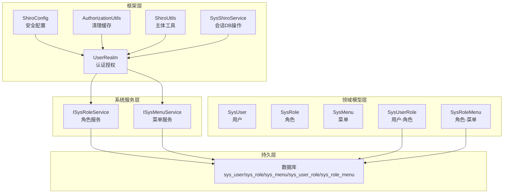
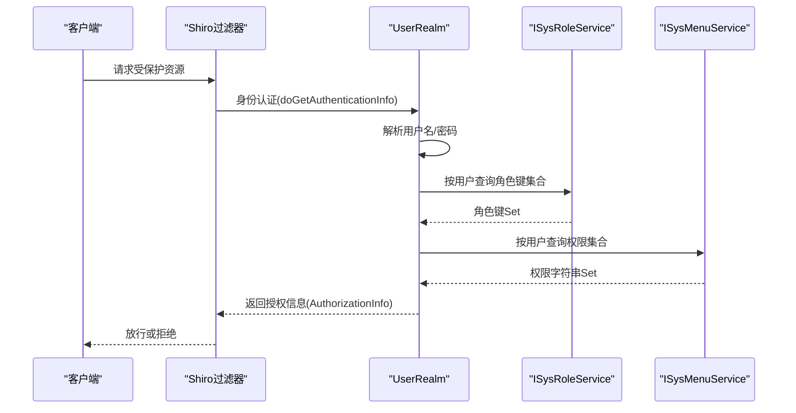
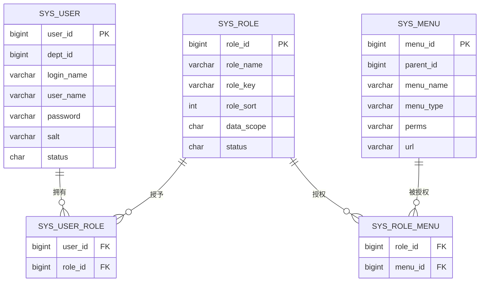
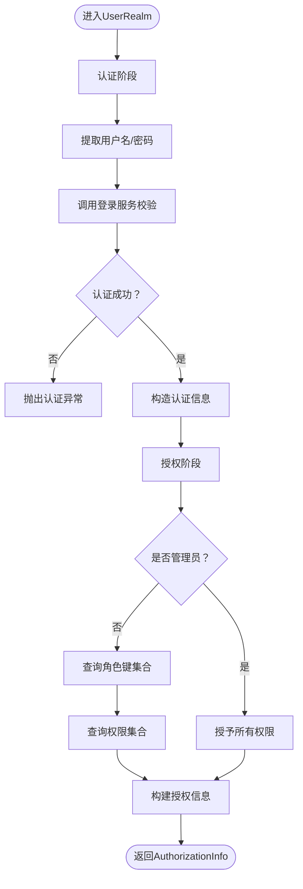
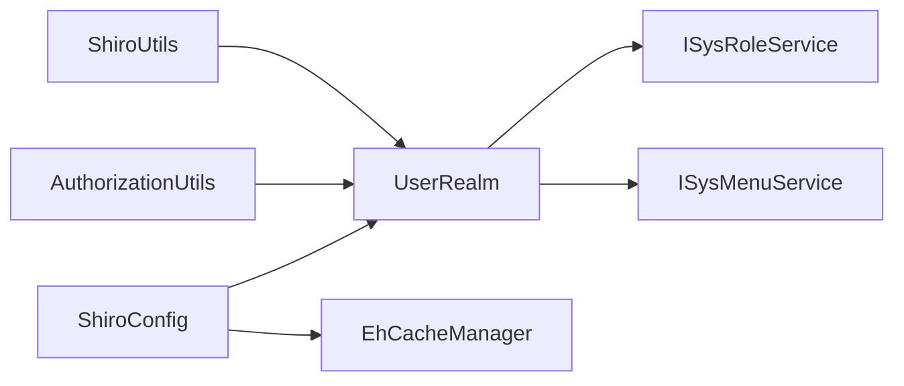

# RBAC权限模型

<cite>
**本文引用的文件**
- [UserRealm.java](file://ruoyi-framework/src/main/java/com/ruoyi/framework/shiro/realm/UserRealm.java)
- [SysUser.java](file://ruoyi-common/src/main/java/com/ruoyi/common/core/domain/entity/SysUser.java)
- [SysRole.java](file://ruoyi-common/src/main/java/com/ruoyi/common/core/domain/entity/SysRole.java)
- [SysMenu.java](file://ruoyi-common/src/main/java/com/ruoyi/common/core/domain/entity/SysMenu.java)
- [SysUserRole.java](file://ruoyi-system/src/main/java/com/ruoyi/system/domain/SysUserRole.java)
- [SysRoleMenu.java](file://ruoyi-system/src/main/java/com/ruoyi/system/domain/SysRoleMenu.java)
- [ISysRoleService.java](file://ruoyi-system/src/main/java/com/ruoyi/system/service/ISysRoleService.java)
- [ISysMenuService.java](file://ruoyi-system/src/main/java/com/ruoyi/system/service/ISysMenuService.java)
- [ShiroConfig.java](file://ruoyi-framework/src/main/java/com/ruoyi/framework/config/ShiroConfig.java)
- [ShiroUtils.java](file://ruoyi-common/src/main/java/com/ruoyi/common/utils/ShiroUtils.java)
- [AuthorizationUtils.java](file://ruoyi-framework/src/main/java/com/ruoyi/framework/shiro/util/AuthorizationUtils.java)
- [SysShiroService.java](file://ruoyi-framework/src/main/java/com/ruoyi/framework/shiro/service/SysShiroService.java)
- [PermissionConstants.java](file://ruoyi-common/src/main/java/com/ruoyi/common/constant/PermissionConstants.java)
- [ry_20260319.sql](file://sql/ry_20260319.sql)
</cite>

## 目录
1. [引言](#引言)
2. [项目结构](#项目结构)
3. [核心组件](#核心组件)
4. [架构总览](#架构总览)
5. [详细组件分析](#详细组件分析)
6. [依赖分析](#依赖分析)
7. [性能考量](#性能考量)
8. [故障排查指南](#故障排查指南)
9. [结论](#结论)
10. [附录](#附录)

## 引言
本文件系统化阐述RuoYi项目中基于角色的权限控制（RBAC）模型的理论与实现。内容覆盖用户（User）、角色（Role）、权限（Permission）、资源（Resource）之间的关联关系与数据模型设计，详解UserRealm的认证授权机制（身份验证、权限解析、缓存策略），并对比RBAC与传统ACL模型的差异与优势，最后给出扩展性建议与常见问题排查方法。

## 项目结构
RuoYi采用多模块分层架构，RBAC相关能力主要分布在如下模块：
- framework：Shiro安全框架集成、Realm、会话与过滤器配置
- system：RBAC实体与服务（用户、角色、菜单、关联表）
- common：领域模型、工具类、常量
- admin：Web控制器（示例：用户、角色、菜单等）
- sql：数据库初始化脚本（含RBAC核心表）

图表来源
- [ShiroConfig.java:1-449](file://ruoyi-framework/src/main/java/com/ruoyi/framework/config/ShiroConfig.java#L1-L449)
- [UserRealm.java:1-159](file://ruoyi-framework/src/main/java/com/ruoyi/framework/shiro/realm/UserRealm.java#L1-L159)
- [AuthorizationUtils.java:1-31](file://ruoyi-framework/src/main/java/com/ruoyi/framework/shiro/util/AuthorizationUtils.java#L1-L31)
- [ShiroUtils.java:1-105](file://ruoyi-common/src/main/java/com/ruoyi/common/utils/ShiroUtils.java#L1-L105)
- [SysShiroService.java:1-54](file://ruoyi-framework/src/main/java/com/ruoyi/framework/shiro/service/SysShiroService.java#L1-L54)
- [ISysRoleService.java:1-167](file://ruoyi-system/src/main/java/com/ruoyi/system/service/ISysRoleService.java#L1-L167)
- [ISysMenuService.java:1-148](file://ruoyi-system/src/main/java/com/ruoyi/system/service/ISysMenuService.java#L1-L148)
- [SysUser.java:1-382](file://ruoyi-common/src/main/java/com/ruoyi/common/core/domain/entity/SysUser.java#L1-L382)
- [SysRole.java:1-212](file://ruoyi-common/src/main/java/com/ruoyi/common/core/domain/entity/SysRole.java#L1-L212)
- [SysMenu.java:1-215](file://ruoyi-common/src/main/java/com/ruoyi/common/core/domain/entity/SysMenu.java#L1-L215)
- [SysUserRole.java:1-47](file://ruoyi-system/src/main/java/com/ruoyi/system/domain/SysUserRole.java#L1-L47)
- [SysRoleMenu.java:1-47](file://ruoyi-system/src/main/java/com/ruoyi/system/domain/SysRoleMenu.java#L1-L47)

章节来源
- [ShiroConfig.java:1-449](file://ruoyi-framework/src/main/java/com/ruoyi/framework/config/ShiroConfig.java#L1-L449)
- [UserRealm.java:1-159](file://ruoyi-framework/src/main/java/com/ruoyi/framework/shiro/realm/UserRealm.java#L1-L159)

## 核心组件
- 用户（SysUser）：系统使用者，具备用户ID、登录名、所属部门、角色集合等属性，并提供管理员判定方法。
- 角色（SysRole）：权限与数据范围的载体，包含角色ID、角色键（roleKey）、数据范围、状态等。
- 菜单（SysMenu）：资源的最小粒度单元，包含菜单ID、名称、类型（目录/菜单/按钮）、权限标识（perms）等。
- 关联模型：
  - SysUserRole：用户-角色多对多关联
  - SysRoleMenu：角色-菜单多对多关联
- 服务接口：
  - ISysRoleService：按用户查询角色键集合、角色列表等
  - ISysMenuService：按用户查询权限集合、菜单树等
- 认证授权核心：
  - UserRealm：继承AuthorizingRealm，实现doGetAuthenticationInfo与doGetAuthorizationInfo
  - ShiroConfig：配置Ehcache缓存、SecurityManager、ShiroFilterFactoryBean、会话管理器等
  - ShiroUtils：获取当前主体、用户信息、判断管理员等
  - AuthorizationUtils：清理授权缓存
  - SysShiroService：会话DB操作（在线会话）

章节来源
- [SysUser.java:1-382](file://ruoyi-common/src/main/java/com/ruoyi/common/core/domain/entity/SysUser.java#L1-L382)
- [SysRole.java:1-212](file://ruoyi-common/src/main/java/com/ruoyi/common/core/domain/entity/SysRole.java#L1-L212)
- [SysMenu.java:1-215](file://ruoyi-common/src/main/java/com/ruoyi/common/core/domain/entity/SysMenu.java#L1-L215)
- [SysUserRole.java:1-47](file://ruoyi-system/src/main/java/com/ruoyi/system/domain/SysUserRole.java#L1-L47)
- [SysRoleMenu.java:1-47](file://ruoyi-system/src/main/java/com/ruoyi/system/domain/SysRoleMenu.java#L1-L47)
- [ISysRoleService.java:1-167](file://ruoyi-system/src/main/java/com/ruoyi/system/service/ISysRoleService.java#L1-L167)
- [ISysMenuService.java:1-148](file://ruoyi-system/src/main/java/com/ruoyi/system/service/ISysMenuService.java#L1-L148)
- [UserRealm.java:1-159](file://ruoyi-framework/src/main/java/com/ruoyi/framework/shiro/realm/UserRealm.java#L1-L159)
- [ShiroConfig.java:1-449](file://ruoyi-framework/src/main/java/com/ruoyi/framework/config/ShiroConfig.java#L1-L449)
- [ShiroUtils.java:1-105](file://ruoyi-common/src/main/java/com/ruoyi/common/utils/ShiroUtils.java#L1-L105)
- [AuthorizationUtils.java:1-31](file://ruoyi-framework/src/main/java/com/ruoyi/framework/shiro/util/AuthorizationUtils.java#L1-L31)
- [SysShiroService.java:1-54](file://ruoyi-framework/src/main/java/com/ruoyi/framework/shiro/service/SysShiroService.java#L1-L54)

## 架构总览
RuoYi的RBAC实现以Shiro为核心，结合Ehcache进行认证与授权缓存，通过UserRealm完成登录认证与权限收集，再由ShiroFilterFactoryBean统一拦截请求，实现“资源-权限-角色-用户”的链路校验。

图表来源
- [UserRealm.java:56-81](file://ruoyi-framework/src/main/java/com/ruoyi/framework/shiro/realm/UserRealm.java#L56-L81)
- [ISysRoleService.java:28-37](file://ruoyi-system/src/main/java/com/ruoyi/system/service/ISysRoleService.java#L28-L37)
- [ISysMenuService.java:48-49](file://ruoyi-system/src/main/java/com/ruoyi/system/service/ISysMenuService.java#L48-L49)
- [ShiroConfig.java:296-346](file://ruoyi-framework/src/main/java/com/ruoyi/framework/config/ShiroConfig.java#L296-L346)

## 详细组件分析

### 数据模型与ER关系
RBAC核心围绕用户、角色、菜单四张主表及两张关联表展开，形成典型的多对多关系网络。

图表来源
- [ry_20260319.sql:41-65](file://sql/ry_20260319.sql#L41-L65)
- [ry_20260319.sql:105-121](file://sql/ry_20260319.sql#L105-L121)
- [ry_20260319.sql:132-151](file://sql/ry_20260319.sql#L132-L151)
- [SysUserRole.java:11-47](file://ruoyi-system/src/main/java/com/ruoyi/system/domain/SysUserRole.java#L11-L47)
- [SysRoleMenu.java:11-47](file://ruoyi-system/src/main/java/com/ruoyi/system/domain/SysRoleMenu.java#L11-L47)

章节来源
- [SysUser.java:22-382](file://ruoyi-common/src/main/java/com/ruoyi/common/core/domain/entity/SysUser.java#L22-L382)
- [SysRole.java:16-212](file://ruoyi-common/src/main/java/com/ruoyi/common/core/domain/entity/SysRole.java#L16-L212)
- [SysMenu.java:15-215](file://ruoyi-common/src/main/java/com/ruoyi/common/core/domain/entity/SysMenu.java#L15-L215)
- [SysUserRole.java:11-47](file://ruoyi-system/src/main/java/com/ruoyi/system/domain/SysUserRole.java#L11-L47)
- [SysRoleMenu.java:11-47](file://ruoyi-system/src/main/java/com/ruoyi/system/domain/SysRoleMenu.java#L11-L47)
- [ry_20260319.sql:1-200](file://sql/ry_20260319.sql#L1-L200)

### UserRealm认证授权流程
- 认证阶段（登录）：从UsernamePasswordToken提取用户名/密码，调用SysLoginService执行登录逻辑，封装SimpleAuthenticationInfo返回。
- 授权阶段：根据当前用户是否管理员决定授予所有权限或查询其角色键与菜单权限，封装SimpleAuthorizationInfo返回。
- 缓存策略：通过ShiroConfig配置Ehcache作为缓存管理器，UserRealm设置授权缓存名称，支持按用户或全量清理缓存。

图表来源
- [UserRealm.java:86-133](file://ruoyi-framework/src/main/java/com/ruoyi/framework/shiro/realm/UserRealm.java#L86-L133)
- [UserRealm.java:56-81](file://ruoyi-framework/src/main/java/com/ruoyi/framework/shiro/realm/UserRealm.java#L56-L81)
- [ShiroConfig.java:154-206](file://ruoyi-framework/src/main/java/com/ruoyi/framework/config/ShiroConfig.java#L154-L206)

章节来源
- [UserRealm.java:1-159](file://ruoyi-framework/src/main/java/com/ruoyi/framework/shiro/realm/UserRealm.java#L1-L159)
- [ShiroConfig.java:1-449](file://ruoyi-framework/src/main/java/com/ruoyi/framework/config/ShiroConfig.java#L1-L449)

### 权限解析与资源映射
- 资源（Resource）：对应SysMenu的每一条记录，菜单类型区分目录、菜单、按钮三类。
- 权限（Permission）：对应SysMenu的perms字段，如“system:user:view”等，用于细粒度控制。
- 角色到权限：通过SysRoleMenu建立角色与菜单的关联，从而间接获得权限集合。
- 用户到权限：通过SysUserRole与SysRoleMenu串联，最终得到用户可访问的权限集合。

章节来源
- [SysMenu.java:15-215](file://ruoyi-common/src/main/java/com/ruoyi/common/core/domain/entity/SysMenu.java#L15-L215)
- [SysRoleMenu.java:11-47](file://ruoyi-system/src/main/java/com/ruoyi/system/domain/SysRoleMenu.java#L11-L47)
- [ISysMenuService.java:48-49](file://ruoyi-system/src/main/java/com/ruoyi/system/service/ISysMenuService.java#L48-L49)

### 缓存与清理策略
- 缓存管理：EhCacheManager通过ShiroConfig注入，UserRealm设置授权缓存名称。
- 缓存清理：
  - 单用户清理：UserRealm.clearCachedAuthorizationInfo
  - 全量清理：AuthorizationUtils.clearAllCachedAuthorizationInfo
- 会话缓存：OnlineSessionDAO与OnlineWebSessionManager配合，实现在线会话的统一管理与失效检测。

章节来源
- [ShiroConfig.java:154-206](file://ruoyi-framework/src/main/java/com/ruoyi/framework/config/ShiroConfig.java#L154-L206)
- [AuthorizationUtils.java:17-29](file://ruoyi-framework/src/main/java/com/ruoyi/framework/shiro/util/AuthorizationUtils.java#L17-L29)
- [UserRealm.java:138-157](file://ruoyi-framework/src/main/java/com/ruoyi/framework/shiro/realm/UserRealm.java#L138-L157)
- [SysShiroService.java:32-52](file://ruoyi-framework/src/main/java/com/ruoyi/framework/shiro/service/SysShiroService.java#L32-L52)

### 过滤链与拦截策略
- 静态资源匿名访问：favicon、静态资源、验证码等
- 登录与注册：验证码校验
- 全站拦截：user、kickout、onlineSession、syncOnlineSession、csrfValidateFilter
- 未授权跳转：unauthorizedUrl

章节来源
- [ShiroConfig.java:296-346](file://ruoyi-framework/src/main/java/com/ruoyi/framework/config/ShiroConfig.java#L296-L346)

## 依赖分析
- 组件内聚与耦合
  - UserRealm高内聚于认证与授权，依赖ISysRoleService与ISysMenuService获取权限数据，耦合度适中。
  - ShiroConfig集中配置了缓存、会话、过滤器，是安全体系的中枢。
- 外部依赖
  - Ehcache：提供认证与授权缓存
  - Spring AOP与Shiro注解：结合AuthorizationAttributeSourceAdvisor启用注解式权限控制
- 循环依赖
  - 未发现直接循环依赖；服务接口与实现分离，避免了循环引用风险。

图表来源
- [UserRealm.java:1-159](file://ruoyi-framework/src/main/java/com/ruoyi/framework/shiro/realm/UserRealm.java#L1-L159)
- [ShiroConfig.java:154-206](file://ruoyi-framework/src/main/java/com/ruoyi/framework/config/ShiroConfig.java#L154-L206)
- [AuthorizationUtils.java:17-29](file://ruoyi-framework/src/main/java/com/ruoyi/framework/shiro/util/AuthorizationUtils.java#L17-L29)
- [ShiroUtils.java:1-105](file://ruoyi-common/src/main/java/com/ruoyi/common/utils/ShiroUtils.java#L1-L105)

章节来源
- [UserRealm.java:1-159](file://ruoyi-framework/src/main/java/com/ruoyi/framework/shiro/realm/UserRealm.java#L1-L159)
- [ShiroConfig.java:1-449](file://ruoyi-framework/src/main/java/com/ruoyi/framework/config/ShiroConfig.java#L1-L449)

## 性能考量
- 缓存命中率
  - 授权信息缓存可显著降低数据库查询压力；建议合理设置缓存键与失效策略，避免脏读。
- 查询优化
  - 角色键与权限集合查询应确保索引覆盖（如用户ID、角色ID、菜单ID）。
- 会话管理
  - 全局会话超时与定期校验可减少僵尸会话占用；结合在线会话DAO实现快速失效。
- 并发控制
  - 同一用户多设备登录限制（kickout）需配合缓存与会话管理器，避免竞态条件。

## 故障排查指南
- 登录失败
  - 用户不存在、密码错误、超出重试次数、账户/角色被锁定等异常均会在UserRealm中转换为相应认证异常，需检查SysLoginService与异常类型映射。
- 权限不足
  - 若用户拥有权限但被拒绝，优先检查授权缓存是否陈旧，使用AuthorizationUtils清理后重试。
- 管理员权限
  - 管理员（userId=1）将被授予所有权限（字符串权限“*:*:*”），若未生效，检查User.isAdmin与UserRealm授权分支。
- 会话异常
  - 在线会话删除或获取失败，检查SysShiroService与OnlineSessionDAO的实现与配置。

章节来源
- [UserRealm.java:102-130](file://ruoyi-framework/src/main/java/com/ruoyi/framework/shiro/realm/UserRealm.java#L102-L130)
- [AuthorizationUtils.java:17-29](file://ruoyi-framework/src/main/java/com/ruoyi/framework/shiro/util/AuthorizationUtils.java#L17-L29)
- [SysShiroService.java:32-52](file://ruoyi-framework/src/main/java/com/ruoyi/framework/shiro/service/SysShiroService.java#L32-L52)

## 结论
RuoYi的RBAC实现以Shiro为核心，结合Ehcache与清晰的服务接口，形成了可维护、可扩展的权限体系。通过用户-角色-菜单三层映射，实现了灵活的权限与数据范围控制；UserRealm承担认证与授权职责，配合过滤链与缓存策略，满足生产环境的性能与安全需求。相较ACL模型，RBAC更强调“角色集中管理权限”，便于大规模组织与权限治理。

## 附录

### RBAC与ACL对比
- ACL（访问控制列表）
  - 直接将权限赋予用户或资源，适合小规模、点对点的权限控制。
  - 缺点：权限分散、难以审计、角色变更成本高。
- RBAC（基于角色的权限控制）
  - 通过角色聚合权限，用户通过角色获得权限，便于集中管理与审计。
  - 优点：权限集中、易于扩展、支持数据范围控制；缺点：模型相对复杂，需要维护角色与权限的映射关系。

### 扩展性建议
- 权限动态下发：结合消息队列或事件总线，在角色/菜单变更时主动清理缓存并推送更新。
- 多租户隔离：在SysRole与SysUser中引入tenantId，配合数据范围（dataScope）实现租户级数据隔离。
- 权限继承：在SysRole中增加parentRoleId，支持角色继承，减少重复授权。
- 权限可视化：提供RBAC拓扑图与权限矩阵视图，辅助权限治理与审计。