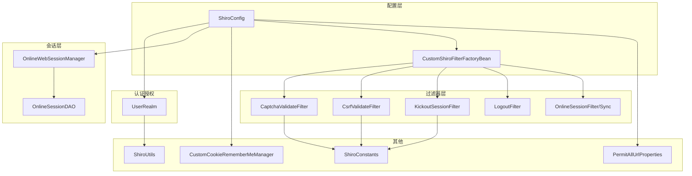
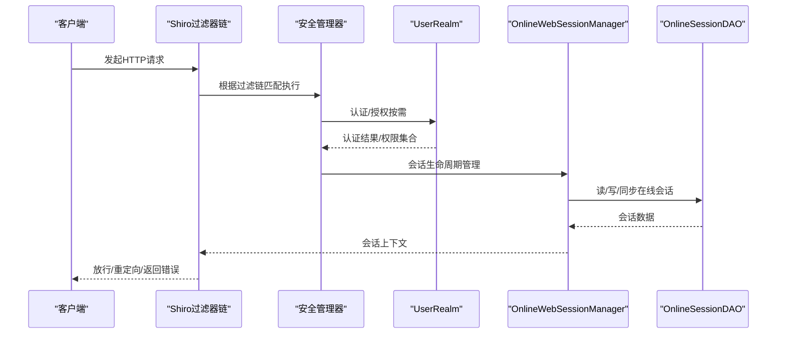
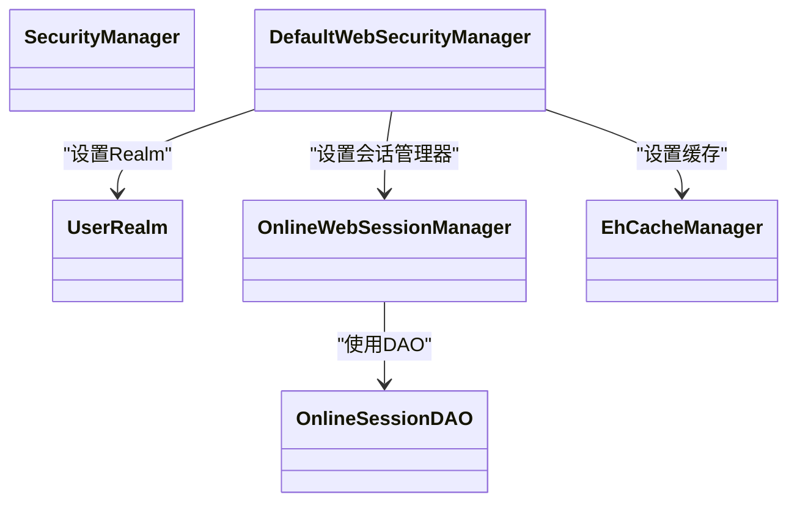
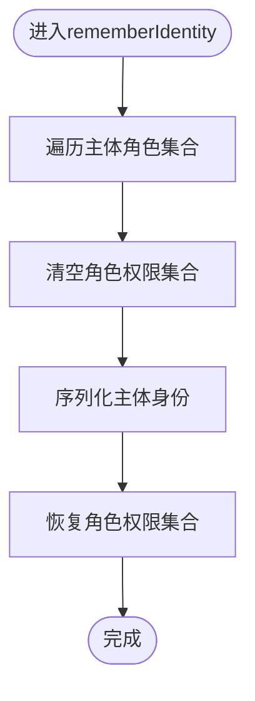
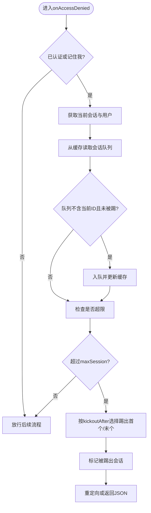
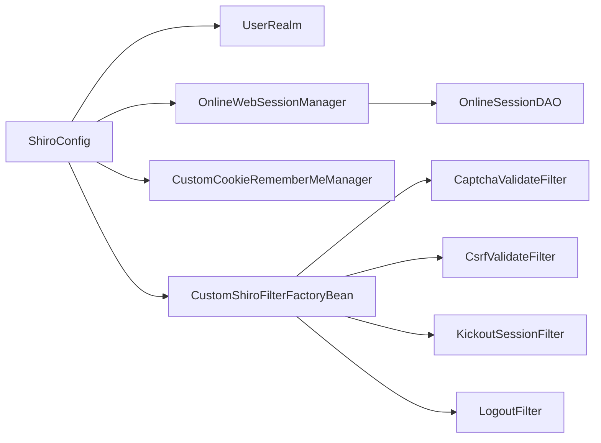

# 安全配置

<cite>
**本文引用的文件**
- [ShiroConfig.java](file://ruoyi-framework/src/main/java/com/ruoyi/framework/config/ShiroConfig.java)
- [CustomShiroFilterFactoryBean.java](file://ruoyi-framework/src/main/java/com/ruoyi/framework/shiro/web/CustomShiroFilterFactoryBean.java)
- [CustomCookieRememberMeManager.java](file://ruoyi-framework/src/main/java/com/ruoyi/framework/shiro/rememberMe/CustomCookieRememberMeManager.java)
- [ShiroUtils.java](file://ruoyi-common/src/main/java/com/ruoyi/common/utils/ShiroUtils.java)
- [KickoutSessionFilter.java](file://ruoyi-framework/src/main/java/com/ruoyi/framework/shiro/web/filter/kickout/KickoutSessionFilter.java)
- [CaptchaValidateFilter.java](file://ruoyi-framework/src/main/java/com/ruoyi/framework/shiro/web/filter/captcha/CaptchaValidateFilter.java)
- [CsrfValidateFilter.java](file://ruoyi-framework/src/main/java/com/ruoyi/framework/shiro/web/filter/csrf/CsrfValidateFilter.java)
- [LogoutFilter.java](file://ruoyi-framework/src/main/java/com/ruoyi/framework/shiro/web/filter/LogoutFilter.java)
- [OnlineWebSessionManager.java](file://ruoyi-framework/src/main/java/com/ruoyi/framework/shiro/web/session/OnlineWebSessionManager.java)
- [UserRealm.java](file://ruoyi-framework/src/main/java/com/ruoyi/framework/shiro/realm/UserRealm.java)
- [OnlineSessionDAO.java](file://ruoyi-framework/src/main/java/com/ruoyi/framework/shiro/session/OnlineSessionDAO.java)
- [ShiroConstants.java](file://ruoyi-common/src/main/java/com/ruoyi/common/constant/ShiroConstants.java)
- [PermitAllUrlProperties.java](file://ruoyi-framework/src/main/java/com/ruoyi/framework/config/properties/PermitAllUrlProperties.java)
</cite>

## 目录
1. [简介](#简介)
2. [项目结构](#项目结构)
3. [核心组件](#核心组件)
4. [架构总览](#架构总览)
5. [组件详解](#组件详解)
6. [依赖关系分析](#依赖关系分析)
7. [性能与调优](#性能与调优)
8. [故障排查指南](#故障排查指南)
9. [结论](#结论)
10. [附录：配置项与最佳实践](#附录配置项与最佳实践)

## 简介
本文件面向安全配置与Shiro框架在本项目中的落地实践，系统阐述安全管理器、会话管理、缓存配置、安全过滤器（验证码、CSRF、会话踢出）、记住我机制、在线会话同步与超时控制，并给出性能优化、故障排查与合规建议。

## 项目结构
围绕安全配置的关键模块分布如下：
- 配置层：ShiroConfig负责安全管理器、会话管理器、缓存、过滤器链与记住我等装配
- 过滤器层：验证码、CSRF、会话踢出、登出、在线会话同步等
- 会话层：在线会话管理器、在线会话DAO、会话工厂
- 认证授权层：UserRealm负责登录认证与授权
- 工具与常量：ShiroUtils工具类、ShiroConstants常量定义
- 白名单：PermitAllUrlProperties扫描匿名注解自动构建免认证URL

图表来源
- [ShiroConfig.java:296-346](file://ruoyi-framework/src/main/java/com/ruoyi/framework/config/ShiroConfig.java#L296-L346)
- [CustomShiroFilterFactoryBean.java:23-65](file://ruoyi-framework/src/main/java/com/ruoyi/framework/shiro/web/CustomShiroFilterFactoryBean.java#L23-L65)
- [UserRealm.java:40-133](file://ruoyi-framework/src/main/java/com/ruoyi/framework/shiro/realm/UserRealm.java#L40-L133)
- [OnlineWebSessionManager.java:29-176](file://ruoyi-framework/src/main/java/com/ruoyi/framework/shiro/web/session/OnlineWebSessionManager.java#L29-L176)
- [OnlineSessionDAO.java:21-119](file://ruoyi-framework/src/main/java/com/ruoyi/framework/shiro/session/OnlineSessionDAO.java#L21-L119)
- [CustomCookieRememberMeManager.java:21-79](file://ruoyi-framework/src/main/java/com/ruoyi/framework/shiro/rememberMe/CustomCookieRememberMeManager.java#L21-L79)
- [CaptchaValidateFilter.java:17-80](file://ruoyi-framework/src/main/java/com/ruoyi/framework/shiro/web/filter/captcha/CaptchaValidateFilter.java#L17-L80)
- [CsrfValidateFilter.java:20-77](file://ruoyi-framework/src/main/java/com/ruoyi/framework/shiro/web/filter/csrf/CsrfValidateFilter.java#L20-L77)
- [KickoutSessionFilter.java:31-176](file://ruoyi-framework/src/main/java/com/ruoyi/framework/shiro/web/filter/kickout/KickoutSessionFilter.java#L31-L176)
- [LogoutFilter.java:24-91](file://ruoyi-framework/src/main/java/com/ruoyi/framework/shiro/web/filter/LogoutFilter.java#L24-L91)
- [ShiroConstants.java:8-85](file://ruoyi-common/src/main/java/com/ruoyi/common/constant/ShiroConstants.java#L8-L85)
- [PermitAllUrlProperties.java:28-101](file://ruoyi-framework/src/main/java/com/ruoyi/framework/config/properties/PermitAllUrlProperties.java#L28-L101)

章节来源
- [ShiroConfig.java:296-346](file://ruoyi-framework/src/main/java/com/ruoyi/framework/config/ShiroConfig.java#L296-L346)
- [PermitAllUrlProperties.java:28-101](file://ruoyi-framework/src/main/java/com/ruoyi/framework/config/properties/PermitAllUrlProperties.java#L28-L101)

## 核心组件
- 安全管理器（SecurityManager）
  - 组成：Realm、缓存管理器、会话管理器、记住我管理器
  - 关键点：启用Ehcache缓存、注入自定义UserRealm、配置OnlineWebSessionManager
- 会话管理器（OnlineWebSessionManager）
  - 全局超时、失效清理、与在线会话DAO联动
- 在线会话DAO（OnlineSessionDAO）
  - 与数据库同步策略、异步写回、状态维护
- 自定义过滤器链（CustomShiroFilterFactoryBean）
  - 解决中文路径问题、统一解析器、集成各安全过滤器
- 记住我（CustomCookieRememberMeManager）
  - 自定义加密存储、去除角色权限字符串以避免请求头过大、登录后恢复权限
- 安全过滤器
  - 验证码：登录/注册时校验Kaptcha
  - CSRF：仅对POST校验，支持白名单
  - 踢出：同一账号并发会话上限控制
  - 登出：记录日志、清理缓存、重定向
  - 在线会话：在线用户行为跟踪与同步

章节来源
- [ShiroConfig.java:257-270](file://ruoyi-framework/src/main/java/com/ruoyi/framework/config/ShiroConfig.java#L257-L270)
- [OnlineWebSessionManager.java:29-176](file://ruoyi-framework/src/main/java/com/ruoyi/framework/shiro/web/session/OnlineWebSessionManager.java#L29-L176)
- [OnlineSessionDAO.java:21-119](file://ruoyi-framework/src/main/java/com/ruoyi/framework/shiro/session/OnlineSessionDAO.java#L21-L119)
- [CustomShiroFilterFactoryBean.java:21-85](file://ruoyi-framework/src/main/java/com/ruoyi/framework/shiro/web/CustomShiroFilterFactoryBean.java#L21-L85)
- [CustomCookieRememberMeManager.java:21-79](file://ruoyi-framework/src/main/java/com/ruoyi/framework/shiro/rememberMe/CustomCookieRememberMeManager.java#L21-L79)
- [CaptchaValidateFilter.java:17-80](file://ruoyi-framework/src/main/java/com/ruoyi/framework/shiro/web/filter/captcha/CaptchaValidateFilter.java#L17-L80)
- [CsrfValidateFilter.java:20-77](file://ruoyi-framework/src/main/java/com/ruoyi/framework/shiro/web/filter/csrf/CsrfValidateFilter.java#L20-L77)
- [KickoutSessionFilter.java:31-176](file://ruoyi-framework/src/main/java/com/ruoyi/framework/shiro/web/filter/kickout/KickoutSessionFilter.java#L31-L176)
- [LogoutFilter.java:24-91](file://ruoyi-framework/src/main/java/com/ruoyi/framework/shiro/web/filter/LogoutFilter.java#L24-L91)

## 架构总览
下图展示从请求进入Shiro到完成认证/授权与会话管理的整体流程。

图表来源
- [ShiroConfig.java:296-346](file://ruoyi-framework/src/main/java/com/ruoyi/framework/config/ShiroConfig.java#L296-L346)
- [UserRealm.java:40-133](file://ruoyi-framework/src/main/java/com/ruoyi/framework/shiro/realm/UserRealm.java#L40-L133)
- [OnlineWebSessionManager.java:29-176](file://ruoyi-framework/src/main/java/com/ruoyi/framework/shiro/web/session/OnlineWebSessionManager.java#L29-L176)
- [OnlineSessionDAO.java:21-119](file://ruoyi-framework/src/main/java/com/ruoyi/framework/shiro/session/OnlineSessionDAO.java#L21-L119)

## 组件详解

### 安全管理器与会话管理
- 安全管理器装配
  - 注入UserRealm、EhCacheManager、OnlineWebSessionManager
  - 可选启用记住我管理器
- 会话管理器
  - 全局超时、失效会话清理、禁用JSESSIONID重写
  - 与OnlineSessionDAO配合，按需标记属性变更并异步同步

图表来源
- [ShiroConfig.java:257-270](file://ruoyi-framework/src/main/java/com/ruoyi/framework/config/ShiroConfig.java#L257-L270)
- [OnlineWebSessionManager.java:29-176](file://ruoyi-framework/src/main/java/com/ruoyi/framework/shiro/web/session/OnlineWebSessionManager.java#L29-L176)
- [OnlineSessionDAO.java:21-119](file://ruoyi-framework/src/main/java/com/ruoyi/framework/shiro/session/OnlineSessionDAO.java#L21-L119)

章节来源
- [ShiroConfig.java:257-270](file://ruoyi-framework/src/main/java/com/ruoyi/framework/config/ShiroConfig.java#L257-L270)
- [OnlineWebSessionManager.java:29-176](file://ruoyi-framework/src/main/java/com/ruoyi/framework/shiro/web/session/OnlineWebSessionManager.java#L29-L176)

### 缓存配置（Ehcache）
- 缓存管理器按需创建，避免配置文件被占用导致热部署失败
- UserRealm使用独立授权缓存名称，便于清理与隔离

章节来源
- [ShiroConfig.java:154-194](file://ruoyi-framework/src/main/java/com/ruoyi/framework/config/ShiroConfig.java#L154-L194)
- [ShiroConfig.java:200-206](file://ruoyi-framework/src/main/java/com/ruoyi/framework/config/ShiroConfig.java#L200-L206)

### 认证与授权（UserRealm）
- 认证：委托SysLoginService执行登录逻辑，捕获各类业务异常映射为Shiro异常
- 授权：管理员拥有全部权限；普通用户按角色与菜单查询权限集合

章节来源
- [UserRealm.java:40-133](file://ruoyi-framework/src/main/java/com/ruoyi/framework/shiro/realm/UserRealm.java#L40-L133)

### 记住我（CustomCookieRememberMeManager）
- 存储时去除角色的权限字符串，避免请求头过大
- 登录恢复时通过服务层补全角色权限

图表来源
- [CustomCookieRememberMeManager.java:26-57](file://ruoyi-framework/src/main/java/com/ruoyi/framework/shiro/rememberMe/CustomCookieRememberMeManager.java#L26-L57)

章节来源
- [CustomCookieRememberMeManager.java:21-79](file://ruoyi-framework/src/main/java/com/ruoyi/framework/shiro/rememberMe/CustomCookieRememberMeManager.java#L21-L79)

### 过滤器链与中文路径兼容
- 自定义ShiroFilterFactoryBean解决InvalidRequestFilter对非ASCII路径的阻断
- 统一解析器与过滤器注册，确保链路生效

章节来源
- [CustomShiroFilterFactoryBean.java:21-85](file://ruoyi-framework/src/main/java/com/ruoyi/framework/shiro/web/CustomShiroFilterFactoryBean.java#L21-L85)
- [ShiroConfig.java:296-346](file://ruoyi-framework/src/main/java/com/ruoyi/framework/config/ShiroConfig.java#L296-L346)

### 验证码过滤（CaptchaValidateFilter）
- 仅在POST场景启用，读取Session中Kaptcha值并比对
- 校验失败设置错误标记，便于前端提示

章节来源
- [CaptchaValidateFilter.java:17-80](file://ruoyi-framework/src/main/java/com/ruoyi/framework/shiro/web/filter/captcha/CaptchaValidateFilter.java#L17-L80)
- [ShiroConstants.java:50-74](file://ruoyi-common/src/main/java/com/ruoyi/common/constant/ShiroConstants.java#L50-L74)

### CSRF防护（CsrfValidateFilter）
- 仅对POST请求校验，支持白名单匹配
- 从Session中读取令牌并与请求头对比

章节来源
- [CsrfValidateFilter.java:20-77](file://ruoyi-framework/src/main/java/com/ruoyi/framework/shiro/web/filter/csrf/CsrfValidateFilter.java#L20-L77)
- [ShiroConstants.java:36-44](file://ruoyi-common/src/main/java/com/ruoyi/common/constant/ShiroConstants.java#L36-L44)

### 会话踢出（KickoutSessionFilter）
- 基于用户名维护会话ID队列，超过阈值按“先登/后登”策略踢出
- 踢出后标记会话并重定向或返回JSON

图表来源
- [KickoutSessionFilter.java:61-148](file://ruoyi-framework/src/main/java/com/ruoyi/framework/shiro/web/filter/kickout/KickoutSessionFilter.java#L61-L148)

章节来源
- [KickoutSessionFilter.java:31-176](file://ruoyi-framework/src/main/java/com/ruoyi/framework/shiro/web/filter/kickout/KickoutSessionFilter.java#L31-L176)
- [ShiroConstants.java:82-83](file://ruoyi-common/src/main/java/com/ruoyi/common/constant/ShiroConstants.java#L82-L83)

### 登出（LogoutFilter）
- 记录登出日志、清理在线用户缓存、执行退出并重定向

章节来源
- [LogoutFilter.java:24-91](file://ruoyi-framework/src/main/java/com/ruoyi/framework/shiro/web/filter/LogoutFilter.java#L24-L91)

### 在线会话同步（OnlineWebSessionManager / OnlineSessionDAO）
- 属性变更时标记，避免频繁持久化
- 定期批量清理过期会话并同步至数据库

章节来源
- [OnlineWebSessionManager.java:34-90](file://ruoyi-framework/src/main/java/com/ruoyi/framework/shiro/web/session/OnlineWebSessionManager.java#L34-L90)
- [OnlineSessionDAO.java:68-102](file://ruoyi-framework/src/main/java/com/ruoyi/framework/shiro/session/OnlineSessionDAO.java#L68-L102)

### 白名单免认证（PermitAllUrlProperties）
- 扫描控制器上Anonymous注解，自动构建免认证URL集合并注入过滤器链

章节来源
- [PermitAllUrlProperties.java:28-101](file://ruoyi-framework/src/main/java/com/ruoyi/framework/config/properties/PermitAllUrlProperties.java#L28-L101)
- [ShiroConfig.java:320-321](file://ruoyi-framework/src/main/java/com/ruoyi/framework/config/ShiroConfig.java#L320-L321)

## 依赖关系分析
- 组件耦合
  - ShiroConfig集中装配，降低跨模块耦合
  - UserRealm依赖业务服务进行认证/授权，职责清晰
  - OnlineWebSessionManager与OnlineSessionDAO通过在线会话模型交互
- 外部依赖
  - Ehcache作为缓存与会话持久化支撑
  - Kaptcha用于验证码生成与校验
  - 异步任务用于会话同步与日志记录

图表来源
- [ShiroConfig.java:296-346](file://ruoyi-framework/src/main/java/com/ruoyi/framework/config/ShiroConfig.java#L296-L346)
- [UserRealm.java:40-133](file://ruoyi-framework/src/main/java/com/ruoyi/framework/shiro/realm/UserRealm.java#L40-L133)
- [OnlineWebSessionManager.java:29-176](file://ruoyi-framework/src/main/java/com/ruoyi/framework/shiro/web/session/OnlineWebSessionManager.java#L29-L176)
- [OnlineSessionDAO.java:21-119](file://ruoyi-framework/src/main/java/com/ruoyi/framework/shiro/session/OnlineSessionDAO.java#L21-L119)
- [CustomShiroFilterFactoryBean.java:21-85](file://ruoyi-framework/src/main/java/com/ruoyi/framework/shiro/web/CustomShiroFilterFactoryBean.java#L21-L85)
- [CaptchaValidateFilter.java:17-80](file://ruoyi-framework/src/main/java/com/ruoyi/framework/shiro/web/filter/captcha/CaptchaValidateFilter.java#L17-L80)
- [CsrfValidateFilter.java:20-77](file://ruoyi-framework/src/main/java/com/ruoyi/framework/shiro/web/filter/csrf/CsrfValidateFilter.java#L20-L77)
- [KickoutSessionFilter.java:31-176](file://ruoyi-framework/src/main/java/com/ruoyi/framework/shiro/web/filter/kickout/KickoutSessionFilter.java#L31-L176)
- [LogoutFilter.java:24-91](file://ruoyi-framework/src/main/java/com/ruoyi/framework/shiro/web/filter/LogoutFilter.java#L24-L91)

## 性能与调优
- 会话同步策略
  - OnlineSessionDAO按属性变更与时间间隔决定是否同步，减少数据库压力
  - 建议根据业务峰值调整dbSyncPeriod，平衡实时性与吞吐
- 会话超时与校验
  - OnlineWebSessionManager定期清理过期会话，建议结合业务场景设置合理的globalSessionTimeout与validationInterval
- 缓存与并发
  - Ehcache缓存命中率直接影响认证/授权性能，建议监控缓存统计并优化热点数据
- CSRF与验证码
  - 仅在必要路径启用，避免对静态资源与GET请求造成额外开销
- 记住我
  - 通过去除角色权限字符串降低Cookie体积，提升网络传输效率

章节来源
- [OnlineSessionDAO.java:68-102](file://ruoyi-framework/src/main/java/com/ruoyi/framework/shiro/session/OnlineSessionDAO.java#L68-L102)
- [OnlineWebSessionManager.java:95-176](file://ruoyi-framework/src/main/java/com/ruoyi/framework/shiro/web/session/OnlineWebSessionManager.java#L95-L176)
- [CustomCookieRememberMeManager.java:26-57](file://ruoyi-framework/src/main/java/com/ruoyi/framework/shiro/rememberMe/CustomCookieRememberMeManager.java#L26-L57)

## 故障排查指南
- 中文路径导致400
  - 症状：含中文的servletPath触发InvalidRequestFilter阻断
  - 处理：CustomShiroFilterFactoryBean已将blockNonAscii设为false
  - 参考：[CustomShiroFilterFactoryBean.java:57-58](file://ruoyi-framework/src/main/java/com/ruoyi/framework/shiro/web/CustomShiroFilterFactoryBean.java#L57-L58)
- 验证码不生效
  - 检查captchaEnabled与captchaType配置，确认登录页正确传递参数
  - 参考：[CaptchaValidateFilter.java:42-71](file://ruoyi-framework/src/main/java/com/ruoyi/framework/shiro/web/filter/captcha/CaptchaValidateFilter.java#L42-L71)
- CSRF校验失败
  - 确认请求头X-CSRF-Token与Session中的csrf_token一致，检查白名单配置
  - 参考：[CsrfValidateFilter.java:43-52](file://ruoyi-framework/src/main/java/com/ruoyi/framework/shiro/web/filter/csrf/CsrfValidateFilter.java#L43-L52)
- 并发登录被踢出
  - 检查maxSession与kickoutAfter配置，确认是否为“先登/后登”策略导致
  - 参考：[KickoutSessionFilter.java:94-126](file://ruoyi-framework/src/main/java/com/ruoyi/framework/shiro/web/filter/kickout/KickoutSessionFilter.java#L94-L126)
- 登出后仍可访问
  - 检查LogoutFilter是否正确执行，确认会话已失效与缓存清理
  - 参考：[LogoutFilter.java:44-75](file://ruoyi-framework/src/main/java/com/ruoyi/framework/shiro/web/filter/LogoutFilter.java#L44-L75)
- 在线会话不同步
  - 检查OnlineSessionDAO的dbSyncPeriod与属性变更标记，确认异步任务正常运行
  - 参考：[OnlineSessionDAO.java:68-102](file://ruoyi-framework/src/main/java/com/ruoyi/framework/shiro/session/OnlineSessionDAO.java#L68-L102)

章节来源
- [CustomShiroFilterFactoryBean.java:57-58](file://ruoyi-framework/src/main/java/com/ruoyi/framework/shiro/web/CustomShiroFilterFactoryBean.java#L57-L58)
- [CaptchaValidateFilter.java:42-71](file://ruoyi-framework/src/main/java/com/ruoyi/framework/shiro/web/filter/captcha/CaptchaValidateFilter.java#L42-L71)
- [CsrfValidateFilter.java:43-52](file://ruoyi-framework/src/main/java/com/ruoyi/framework/shiro/web/filter/csrf/CsrfValidateFilter.java#L43-L52)
- [KickoutSessionFilter.java:94-126](file://ruoyi-framework/src/main/java/com/ruoyi/framework/shiro/web/filter/kickout/KickoutSessionFilter.java#L94-L126)
- [LogoutFilter.java:44-75](file://ruoyi-framework/src/main/java/com/ruoyi/framework/shiro/web/filter/LogoutFilter.java#L44-L75)
- [OnlineSessionDAO.java:68-102](file://ruoyi-framework/src/main/java/com/ruoyi/framework/shiro/session/OnlineSessionDAO.java#L68-L102)

## 结论
本项目基于Shiro构建了完善的认证、授权与会话管理体系，通过Ehcache缓存、在线会话DAO与自定义过滤器链实现了高可用与高性能。验证码、CSRF、并发登录控制与记住我等机制覆盖常见安全风险点。建议在生产环境结合业务特征持续优化会话同步策略与缓存配置，并完善监控与告警体系。

## 附录：配置项与最佳实践
- 配置项（来自ShiroConfig与相关常量）
  - 会话超时：shiro.session.expireTime（分钟）
  - 会话校验间隔：shiro.session.validationInterval（毫秒）
  - 最大会话数：shiro.session.maxSession（-1表示不限制）
  - 踢出策略：shiro.session.kickoutAfter（true为后登录踢前登录）
  - 验证码开关与类型：shiro.user.captchaEnabled、shiro.user.captchaType
  - Cookie域/路径/HttpOnly/maxAge/cipherKey：shiro.cookie.*
  - 登录/未授权地址：shiro.user.loginUrl、shiro.user.unauthorizedUrl
  - 记住我开关：shiro.rememberMe.enabled
  - CSRF开关与白名单：csrf.enabled、csrf.whites
  - 会话DB同步周期：shiro.session.dbSyncPeriod（分钟）
- 最佳实践
  - 严格区分静态资源与受控接口，避免对静态资源启用验证码与CSRF
  - 合理设置maxSession与kickoutAfter，兼顾用户体验与安全
  - 使用异步任务进行会话同步，避免阻塞请求线程
  - 定期清理过期会话，保持数据库与缓存一致性
  - 记住我Cookie启用HttpOnly与合理cipherKey，避免明文存储
  - 白名单URL通过注解扫描自动维护，减少手工维护成本

章节来源
- [ShiroConfig.java:55-147](file://ruoyi-framework/src/main/java/com/ruoyi/framework/config/ShiroConfig.java#L55-L147)
- [ShiroConstants.java:36-83](file://ruoyi-common/src/main/java/com/ruoyi/common/constant/ShiroConstants.java#L36-L83)
- [PermitAllUrlProperties.java:28-101](file://ruoyi-framework/src/main/java/com/ruoyi/framework/config/properties/PermitAllUrlProperties.java#L28-L101)