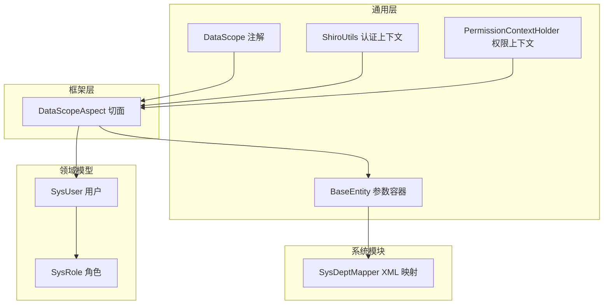
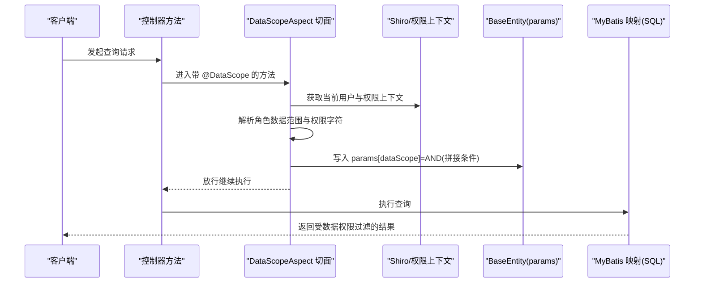
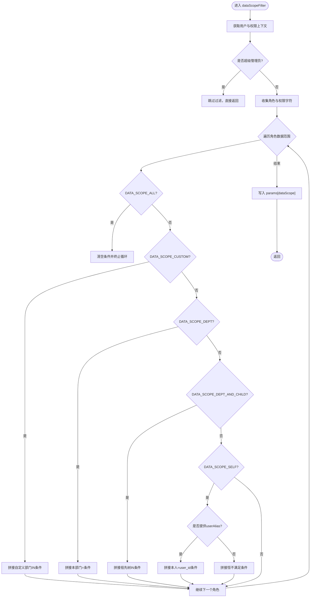
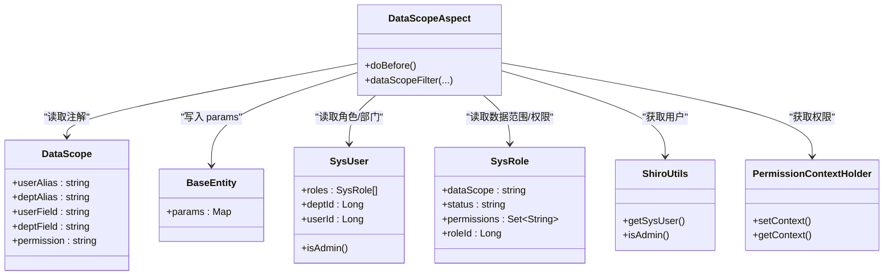

# 数据权限

<cite>
**本文引用的文件**
- [DataScope.java](file://ruoyi-common/src/main/java/com/ruoyi/common/annotation/DataScope.java)
- [DataScopeAspect.java](file://ruoyi-framework/src/main/java/com/ruoyi/framework/aspectj/DataScopeAspect.java)
- [BaseEntity.java](file://ruoyi-common/src/main/java/com/ruoyi/common/core/domain/BaseEntity.java)
- [SysUser.java](file://ruoyi-common/src/main/java/com/ruoyi/common/core/domain/entity/SysUser.java)
- [SysRole.java](file://ruoyi-common/src/main/java/com/ruoyi/common/core/domain/entity/SysRole.java)
- [ShiroUtils.java](file://ruoyi-common/src/main/java/com/ruoyi/common/utils/ShiroUtils.java)
- [PermissionContextHolder.java](file://ruoyi-common/src/main/java/com/ruoyi/common/core/context/PermissionContextHolder.java)
- [SysDeptMapper.xml](file://ruoyi-system/src/main/resources/mapper/system/SysDeptMapper.xml)
</cite>

## 目录
1. [简介](#简介)
2. [项目结构](#项目结构)
3. [核心组件](#核心组件)
4. [架构总览](#架构总览)
5. [组件详解](#组件详解)
6. [依赖关系分析](#依赖关系分析)
7. [性能与安全](#性能与安全)
8. [调试与排错指南](#调试与排错指南)
9. [结论](#结论)
10. [附录](#附录)

## 简介
本文件系统性阐述基于注解与切面的数据权限控制方案，覆盖按部门、岗位、角色等多维数据访问控制的实现原理与最佳实践。重点说明 DataScope 注解的使用方式、SQL 条件拼接与动态过滤机制、与业务数据的关联关系、在不同业务场景下的应用策略，并给出性能优化、缓存与安全建议，以及调试方法与常见问题排查。

## 项目结构
数据权限能力由“注解 + 切面 + 上下文工具 + 基类参数容器”协同完成，贯穿于控制器层、服务层与持久层之间，形成请求生命周期内的自动拦截与 SQL 过滤增强。

图示来源
- [DataScope.java:1-44](file://ruoyi-common/src/main/java/com/ruoyi/common/annotation/DataScope.java#L1-L44)
- [DataScopeAspect.java:1-159](file://ruoyi-framework/src/main/java/com/ruoyi/framework/aspectj/DataScopeAspect.java#L1-L159)
- [BaseEntity.java:1-119](file://ruoyi-common/src/main/java/com/ruoyi/common/core/domain/BaseEntity.java#L1-L119)
- [SysUser.java:1-382](file://ruoyi-common/src/main/java/com/ruoyi/common/core/domain/entity/SysUser.java#L1-L382)
- [SysRole.java:1-212](file://ruoyi-common/src/main/java/com/ruoyi/common/core/domain/entity/SysRole.java#L1-L212)
- [ShiroUtils.java:1-105](file://ruoyi-common/src/main/java/com/ruoyi/common/utils/ShiroUtils.java#L1-L105)
- [PermissionContextHolder.java:1-28](file://ruoyi-common/src/main/java/com/ruoyi/common/core/context/PermissionContextHolder.java#L1-L28)
- [SysDeptMapper.xml](file://ruoyi-system/src/main/resources/mapper/system/SysDeptMapper.xml)

章节来源
- [DataScope.java:1-44](file://ruoyi-common/src/main/java/com/ruoyi/common/annotation/DataScope.java#L1-L44)
- [DataScopeAspect.java:1-159](file://ruoyi-framework/src/main/java/com/ruoyi/framework/aspectj/DataScopeAspect.java#L1-L159)
- [BaseEntity.java:1-119](file://ruoyi-common/src/main/java/com/ruoyi/common/core/domain/BaseEntity.java#L1-L119)
- [SysUser.java:1-382](file://ruoyi-common/src/main/java/com/ruoyi/common/core/domain/entity/SysUser.java#L1-L382)
- [SysRole.java:1-212](file://ruoyi-common/src/main/java/com/ruoyi/common/core/domain/entity/SysRole.java#L1-L212)
- [ShiroUtils.java:1-105](file://ruoyi-common/src/main/java/com/ruoyi/common/utils/ShiroUtils.java#L1-L105)
- [PermissionContextHolder.java:1-28](file://ruoyi-common/src/main/java/com/ruoyi/common/core/context/PermissionContextHolder.java#L1-L28)

## 核心组件
- DataScope 注解：声明在控制器方法上，用于启用数据权限过滤，支持用户/部门别名、字段名与权限字符等配置项。
- DataScopeAspect 切面：在目标方法执行前进行拦截，依据当前用户的角色数据范围与权限字符动态拼接 SQL 条件，并写入 BaseEntity 的 params 容器中。
- BaseEntity：统一承载业务查询参数，其中 params 中的 dataScope 键用于存放拼接后的过滤条件。
- ShiroUtils：从会话中获取当前登录用户，判断是否为超级管理员。
- PermissionContextHolder：在请求上下文中保存权限字符串，供注解未显式指定时回退使用。
- SysUser/SysRole：用户与角色模型，包含数据范围与权限集合等关键属性。

章节来源
- [DataScope.java:1-44](file://ruoyi-common/src/main/java/com/ruoyi/common/annotation/DataScope.java#L1-L44)
- [DataScopeAspect.java:1-159](file://ruoyi-framework/src/main/java/com/ruoyi/framework/aspectj/DataScopeAspect.java#L1-L159)
- [BaseEntity.java:1-119](file://ruoyi-common/src/main/java/com/ruoyi/common/core/domain/BaseEntity.java#L1-L119)
- [SysUser.java:1-382](file://ruoyi-common/src/main/java/com/ruoyi/common/core/domain/entity/SysUser.java#L1-L382)
- [SysRole.java:1-212](file://ruoyi-common/src/main/java/com/ruoyi/common/core/domain/entity/SysRole.java#L1-L212)
- [ShiroUtils.java:1-105](file://ruoyi-common/src/main/java/com/ruoyi/common/utils/ShiroUtils.java#L1-L105)
- [PermissionContextHolder.java:1-28](file://ruoyi-common/src/main/java/com/ruoyi/common/core/context/PermissionContextHolder.java#L1-L28)

## 架构总览
数据权限在请求生命周期中的作用链如下：

图示来源
- [DataScopeAspect.java:34-54](file://ruoyi-framework/src/main/java/com/ruoyi/framework/aspectj/DataScopeAspect.java#L34-L54)
- [DataScopeAspect.java:65-144](file://ruoyi-framework/src/main/java/com/ruoyi/framework/aspectj/DataScopeAspect.java#L65-L144)
- [BaseEntity.java:105-112](file://ruoyi-common/src/main/java/com/ruoyi/common/core/domain/BaseEntity.java#L105-L112)
- [ShiroUtils.java:33-41](file://ruoyi-common/src/main/java/com/ruoyi/common/utils/ShiroUtils.java#L33-L41)
- [PermissionContextHolder.java:16-26](file://ruoyi-common/src/main/java/com/ruoyi/common/core/context/PermissionContextHolder.java#L16-L26)

## 组件详解

### DataScope 注解
- 作用域：方法级注解，标记需要启用数据权限过滤的接口。
- 关键属性
  - userAlias/deptAlias：用户表与部门表的别名，用于拼接字段。
  - userField/deptField：用户与部门字段名，默认 user_id 与 dept_id。
  - permission：权限字符，可选；若为空则从权限上下文读取。
- 使用建议
  - 对需要按部门/角色/本人等维度限制可见范围的查询接口添加该注解。
  - 当接口涉及多表联查时，务必正确设置 deptAlias/userAlias 以确保条件生效。

章节来源
- [DataScope.java:14-43](file://ruoyi-common/src/main/java/com/ruoyi/common/annotation/DataScope.java#L14-L43)

### DataScopeAspect 切面
- 核心流程
  - 清理上次请求残留的 dataScope 条件，防止污染。
  - 获取当前用户与权限上下文，跳过超级管理员。
  - 遍历用户角色，按数据范围类型拼接 SQL 条件。
  - 将最终条件写入 BaseEntity.params[dataScope]，供 MyBatis 在 SQL 中引用。
- 数据范围规则
  - 全部：直接放行，不附加条件。
  - 自定义：基于 sys_role_dept 关联表收集部门集合，支持多角色合并。
  - 本部门：dept_id 等于当前用户所在部门。
  - 本部门及子部门：通过祖先树查询（find_in_set）展开。
  - 仅本人：优先使用 userAlias=userField 匹配；否则构造恒不满足条件以避免误删。
- 权限字符匹配
  - 若注解或上下文提供 permission，则仅对包含该权限的角色生效。
- 安全与健壮性
  - 清理 params.dataScope 防止注入。
  - 无可用条件时强制追加不命中条件，避免返回意外数据。

图示来源
- [DataScopeAspect.java:41-54](file://ruoyi-framework/src/main/java/com/ruoyi/framework/aspectj/DataScopeAspect.java#L41-L54)
- [DataScopeAspect.java:65-144](file://ruoyi-framework/src/main/java/com/ruoyi/framework/aspectj/DataScopeAspect.java#L65-L144)

章节来源
- [DataScopeAspect.java:34-54](file://ruoyi-framework/src/main/java/com/ruoyi/framework/aspectj/DataScopeAspect.java#L34-L54)
- [DataScopeAspect.java:65-144](file://ruoyi-framework/src/main/java/com/ruoyi/framework/aspectj/DataScopeAspect.java#L65-L144)

### BaseEntity 参数容器
- params 字段用于承载查询参数，dataScope 键存放切面拼接的 SQL 片段。
- 查询时在 XML 或注解 SQL 中通过参数引用该片段，实现动态过滤。

章节来源
- [BaseEntity.java:105-112](file://ruoyi-common/src/main/java/com/ruoyi/common/core/domain/BaseEntity.java#L105-L112)

### 用户与角色模型
- SysUser：包含部门 ID、角色列表、管理员判定等。
- SysRole：包含数据范围、状态、权限集合等。
- 切面通过这些模型决定如何拼接 SQL 条件。

章节来源
- [SysUser.java:125-128](file://ruoyi-common/src/main/java/com/ruoyi/common/core/domain/entity/SysUser.java#L125-L128)
- [SysUser.java:324-332](file://ruoyi-common/src/main/java/com/ruoyi/common/core/domain/entity/SysUser.java#L324-L332)
- [SysRole.java:36-38](file://ruoyi-common/src/main/java/com/ruoyi/common/core/domain/entity/SysRole.java#L36-L38)
- [SysRole.java:184-192](file://ruoyi-common/src/main/java/com/ruoyi/common/core/domain/entity/SysRole.java#L184-L192)

### 认证与权限上下文
- ShiroUtils：从 Subject 获取当前用户，提供 isAdmin 快捷判断。
- PermissionContextHolder：在请求作用域内保存权限字符串，供注解 permission 回退使用。

章节来源
- [ShiroUtils.java:33-41](file://ruoyi-common/src/main/java/com/ruoyi/common/utils/ShiroUtils.java#L33-L41)
- [ShiroUtils.java:78-92](file://ruoyi-common/src/main/java/com/ruoyi/common/utils/ShiroUtils.java#L78-L92)
- [PermissionContextHolder.java:16-26](file://ruoyi-common/src/main/java/com/ruoyi/common/core/context/PermissionContextHolder.java#L16-L26)

### 与业务数据的关联
- 切面并不直接操作业务实体，而是通过 BaseEntity.params[dataScope] 将条件注入到查询参数中。
- 实际 SQL 中需引用该参数，例如在 XML 的 where 条件中拼接 AND (params.dataScope)。
- 示例参考：部门相关映射文件中对 dept_id 的过滤逻辑。

章节来源
- [SysDeptMapper.xml](file://ruoyi-system/src/main/resources/mapper/system/SysDeptMapper.xml)

## 依赖关系分析
- 注解与切面：@DataScope 与 DataScopeAspect 形成“声明 + 拦截”的协作。
- 切面与上下文：依赖 ShiroUtils 获取用户，依赖 PermissionContextHolder 获取权限字符串。
- 切面与模型：依赖 SysUser/SysRole 的数据范围与权限集合。
- 切面与持久层：通过 BaseEntity.params[dataScope] 与 MyBatis 映射文件对接。

图示来源
- [DataScope.java:14-43](file://ruoyi-common/src/main/java/com/ruoyi/common/annotation/DataScope.java#L14-L43)
- [DataScopeAspect.java:34-54](file://ruoyi-framework/src/main/java/com/ruoyi/framework/aspectj/DataScopeAspect.java#L34-L54)
- [BaseEntity.java:105-112](file://ruoyi-common/src/main/java/com/ruoyi/common/core/domain/BaseEntity.java#L105-L112)
- [SysUser.java:125-128](file://ruoyi-common/src/main/java/com/ruoyi/common/core/domain/entity/SysUser.java#L125-L128)
- [SysRole.java:36-38](file://ruoyi-common/src/main/java/com/ruoyi/common/core/domain/entity/SysRole.java#L36-L38)
- [ShiroUtils.java:33-41](file://ruoyi-common/src/main/java/com/ruoyi/common/utils/ShiroUtils.java#L33-L41)
- [PermissionContextHolder.java:16-26](file://ruoyi-common/src/main/java/com/ruoyi/common/core/context/PermissionContextHolder.java#L16-L26)

## 性能与安全

- 性能优化
  - 多角色自定义数据范围合并：当存在多个自定义角色时，切面会将多个角色 ID 合并为 IN 子句，减少多次拼接与查询次数。
  - 条件去重：对相同数据范围的角色进行去重处理，避免重复拼接。
  - 早停策略：遇到“全部”范围时立即终止循环，不再拼接其他条件。
  - 建议
    - 合理设计角色数据范围，避免过多自定义角色导致 IN 列表过长。
    - 对“本部门及子部门”范围配合祖先树索引使用，提升查询效率。

- 缓存机制
  - 可在服务层对用户角色与数据范围结果进行短期缓存，降低重复计算。
  - 注意缓存失效策略与权限变更同步。

- 安全考虑
  - 切面在每次请求前清理 params.dataScope，防止历史参数污染。
  - 未匹配到任何条件时强制追加恒不满足条件，避免空条件导致全表暴露。
  - 仅对非超级管理员生效，超级管理员默认放行。

章节来源
- [DataScopeAspect.java:96-104](file://ruoyi-framework/src/main/java/com/ruoyi/framework/aspectj/DataScopeAspect.java#L96-L104)
- [DataScopeAspect.java:129-133](file://ruoyi-framework/src/main/java/com/ruoyi/framework/aspectj/DataScopeAspect.java#L129-L133)
- [DataScopeAspect.java:149-157](file://ruoyi-framework/src/main/java/com/ruoyi/framework/aspectj/DataScopeAspect.java#L149-L157)

## 调试与排错指南

- 常见问题
  - 未生效：确认控制器方法已标注 @DataScope，且请求已登录（非匿名）。
  - 条件不正确：检查 userAlias/deptAlias 与实际 SQL 表别名一致；确认 userField/deptField 与表字段一致。
  - 仅本人无效：若未提供 userAlias，则“仅本人”会拼出恒不满足条件；请在 SQL 中提供 userAlias 或调整为其他范围。
  - 权限字符不生效：确认 permission 与角色 permissions 集合匹配；或在请求上下文中设置权限字符串。
  - 自定义范围异常：检查 sys_role_dept 关联表是否正确维护角色与部门的映射。

- 排查步骤
  - 在切面方法入口处断点，观察当前用户、角色数据范围与权限字符。
  - 检查 BaseEntity.params 中 dataScope 是否被写入 AND(...) 条件。
  - 在 SQL 层验证是否正确引用了 params.dataScope。
  - 如需定位 SQL 片段，可在日志中打印最终拼接条件。

- 建议
  - 在开发环境开启 SQL 日志，核对最终生成的 WHERE 条件。
  - 对复杂联表查询，优先在 SQL 中显式提供别名，确保条件可读与可维护。

章节来源
- [DataScopeAspect.java:41-54](file://ruoyi-framework/src/main/java/com/ruoyi/framework/aspectj/DataScopeAspect.java#L41-L54)
- [DataScopeAspect.java:65-144](file://ruoyi-framework/src/main/java/com/ruoyi/framework/aspectj/DataScopeAspect.java#L65-L144)
- [BaseEntity.java:105-112](file://ruoyi-common/src/main/java/com/ruoyi/common/core/domain/BaseEntity.java#L105-L112)

## 结论
该数据权限体系通过注解与切面实现了对多维数据访问的自动化控制，具备良好的扩展性与安全性。结合合理的角色设计与 SQL 引用规范，可在不侵入业务代码的情况下实现灵活的部门、岗位、角色与本人维度的访问控制。建议在生产环境中配合缓存与索引策略进一步提升性能，并持续完善权限字符与角色映射的治理。

## 附录

### DataScope 注解配置速查
- userAlias：用户表别名（如 u），用于“仅本人”条件。
- deptAlias：部门表别名（如 d），用于部门相关条件。
- userField：用户字段名（默认 user_id）。
- deptField：部门字段名（默认 dept_id）。
- permission：权限字符（可选，未提供时从上下文读取）。

章节来源
- [DataScope.java:18-42](file://ruoyi-common/src/main/java/com/ruoyi/common/annotation/DataScope.java#L18-L42)