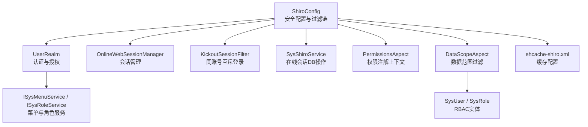
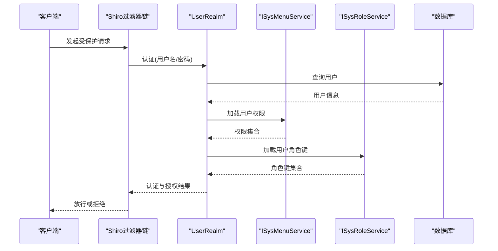
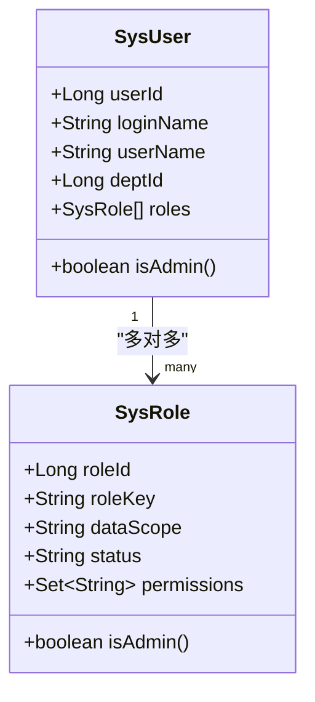
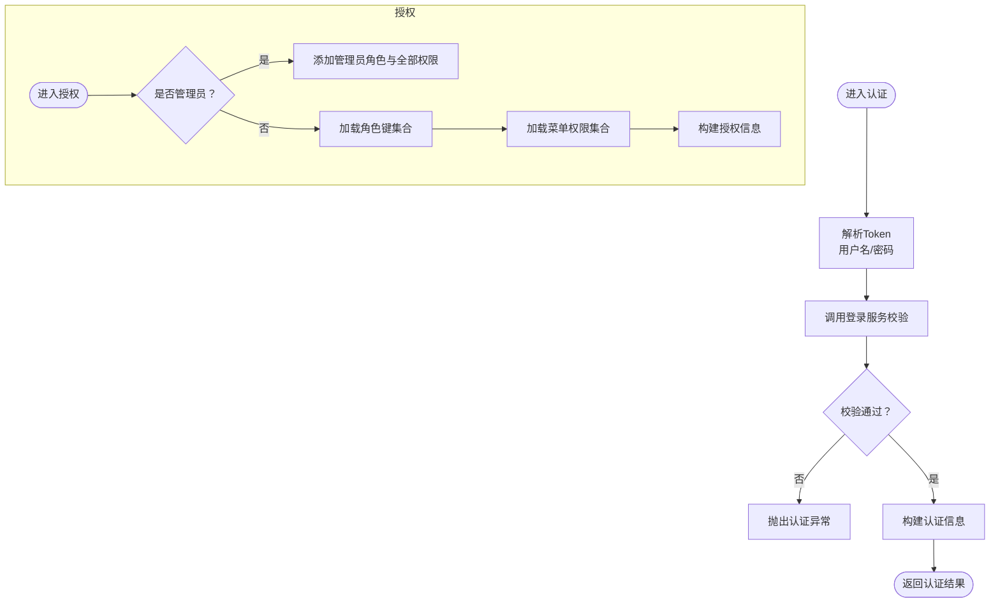
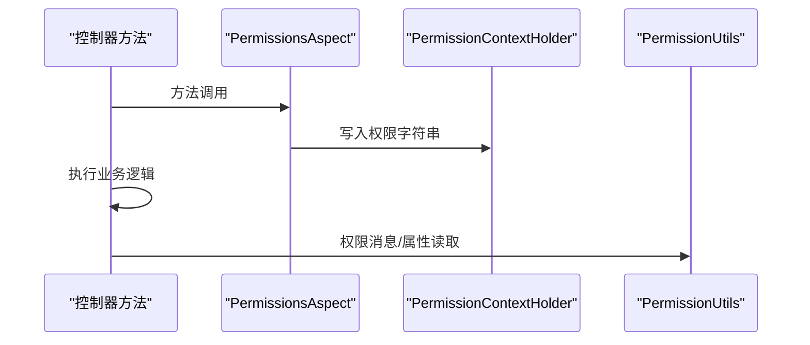
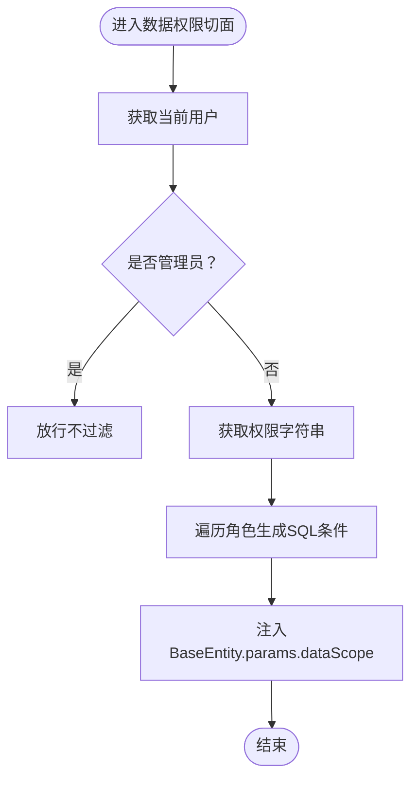
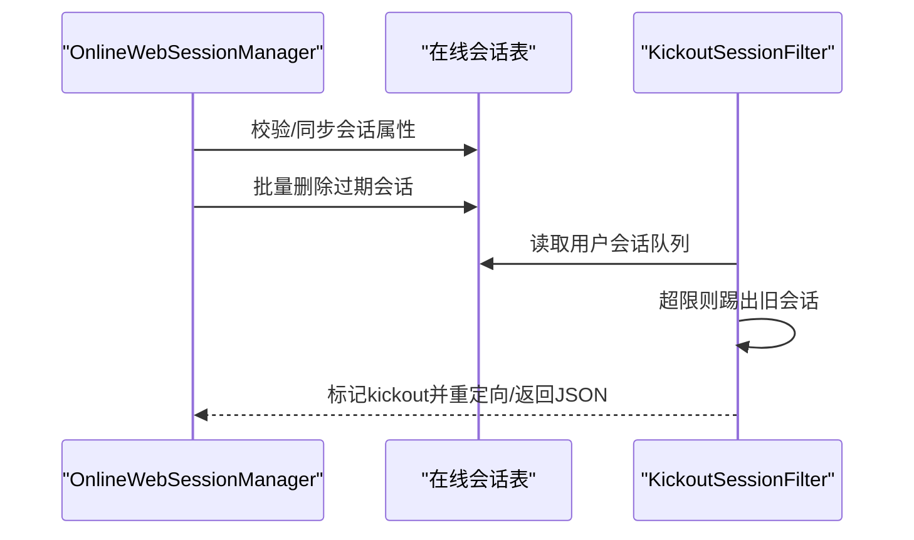
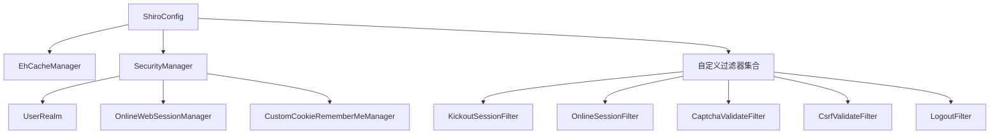
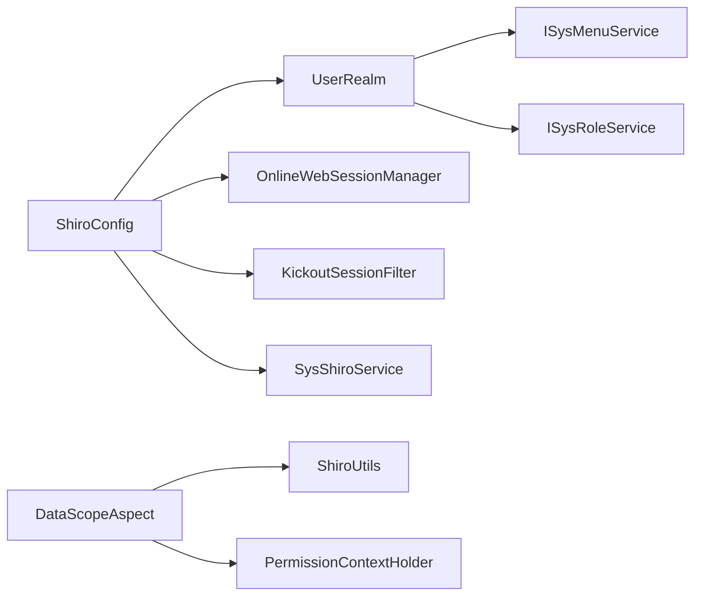

# 权限管理系统

<cite>
**本文引用的文件**
- [ShiroConfig.java](file://ruoyi-framework/src/main/java/com/ruoyi/framework/config/ShiroConfig.java)
- [UserRealm.java](file://ruoyi-framework/src/main/java/com/ruoyi/framework/shiro/realm/UserRealm.java)
- [ehcache-shiro.xml](file://ruoyi-admin/src/main/resources/ehcache/ehcache-shiro.xml)
- [KickoutSessionFilter.java](file://ruoyi-framework/src/main/java/com/ruoyi/framework/shiro/web/filter/kickout/KickoutSessionFilter.java)
- [OnlineWebSessionManager.java](file://ruoyi-framework/src/main/java/com/ruoyi/framework/shiro/web/session/OnlineWebSessionManager.java)
- [SysShiroService.java](file://ruoyi-framework/src/main/java/com/ruoyi/framework/shiro/service/SysShiroService.java)
- [PermissionsAspect.java](file://ruoyi-framework/src/main/java/com/ruoyi/framework/aspectj/PermissionsAspect.java)
- [DataScope.java](file://ruoyi-common/src/main/java/com/ruoyi/common/annotation/DataScope.java)
- [DataScopeAspect.java](file://ruoyi-framework/src/main/java/com/ruoyi/framework/aspectj/DataScopeAspect.java)
- [PermissionConstants.java](file://ruoyi-common/src/main/java/com/ruoyi/common/constant/PermissionConstants.java)
- [ShiroConstants.java](file://ruoyi-common/src/main/java/com/ruoyi/common/constant/ShiroConstants.java)
- [PermissionUtils.java](file://ruoyi-common/src/main/java/com/ruoyi/common/utils/security/PermissionUtils.java)
- [SysUser.java](file://ruoyi-common/src/main/java/com/ruoyi/common/core/domain/entity/SysUser.java)
- [SysRole.java](file://ruoyi-common/src/main/java/com/ruoyi/common/core/domain/entity/SysRole.java)
</cite>

## 目录
1. [引言](#引言)
2. [项目结构](#项目结构)
3. [核心组件](#核心组件)
4. [架构总览](#架构总览)
5. [详细组件分析](#详细组件分析)
6. [依赖关系分析](#依赖关系分析)
7. [性能考量](#性能考量)
8. [故障排查指南](#故障排查指南)
9. [结论](#结论)
10. [附录](#附录)

## 引言
本文件系统性梳理RuoYi权限管理系统的实现，围绕基于Apache Shiro的RBAC权限模型展开，覆盖用户、角色、权限与资源的关联关系，UserRealm的认证与授权机制，权限注解与数据权限控制策略，并提供用户管理、角色管理与菜单权限配置的操作指南。同时，文档涵盖安全配置、会话管理、记住我功能等高级特性，以及常见安全问题的防范建议。

## 项目结构
RuoYi权限体系主要由以下模块构成：
- 安全配置与过滤链：在ShiroConfig中集中配置安全管理器、缓存、会话、记住我、过滤器链与注解支持。
- 认证与授权域：UserRealm负责登录认证与授权信息装载。
- 会话与在线管理：OnlineWebSessionManager与SysShiroService协同维护在线会话。
- 过滤器扩展：KickoutSessionFilter实现“同一账号多端互斥登录”。
- 权限注解与数据权限：PermissionsAspect与DataScopeAspect分别处理注解上下文与数据范围过滤。
- 常量与工具：PermissionConstants、ShiroConstants、PermissionUtils提供权限常量与工具方法。
- 实体模型：SysUser、SysRole承载RBAC实体与数据权限范围。

**图表来源**
- [ShiroConfig.java:296-346](file://ruoyi-framework/src/main/java/com/ruoyi/framework/config/ShiroConfig.java#L296-L346)
- [UserRealm.java:40-81](file://ruoyi-framework/src/main/java/com/ruoyi/framework/shiro/realm/UserRealm.java#L40-L81)
- [OnlineWebSessionManager.java:29-90](file://ruoyi-framework/src/main/java/com/ruoyi/framework/shiro/web/session/OnlineWebSessionManager.java#L29-L90)
- [KickoutSessionFilter.java:31-58](file://ruoyi-framework/src/main/java/com/ruoyi/framework/shiro/web/filter/kickout/KickoutSessionFilter.java#L31-L58)
- [SysShiroService.java:19-53](file://ruoyi-framework/src/main/java/com/ruoyi/framework/shiro/service/SysShiroService.java#L19-L53)
- [PermissionsAspect.java:18-30](file://ruoyi-framework/src/main/java/com/ruoyi/framework/aspectj/PermissionsAspect.java#L18-L30)
- [DataScopeAspect.java:27-54](file://ruoyi-framework/src/main/java/com/ruoyi/framework/aspectj/DataScopeAspect.java#L27-L54)
- [ehcache-shiro.xml:1-91](file://ruoyi-admin/src/main/resources/ehcache/ehcache-shiro.xml#L1-L91)

**章节来源**
- [ShiroConfig.java:49-449](file://ruoyi-framework/src/main/java/com/ruoyi/framework/config/ShiroConfig.java#L49-L449)
- [ehcache-shiro.xml:1-91](file://ruoyi-admin/src/main/resources/ehcache/ehcache-shiro.xml#L1-L91)

## 核心组件
- 安全管理器与过滤链：集中于ShiroConfig，定义登录URL、未授权URL、过滤器链、记住我、会话超时与校验周期、CSRF与验证码等。
- Realm：UserRealm实现doGetAuthenticationInfo与doGetAuthorizationInfo，从服务层加载用户的角色与权限集合。
- 会话管理：OnlineWebSessionManager扩展默认Web会话管理，结合SysShiroService与在线会话表实现会话生命周期管理。
- 过滤器：KickoutSessionFilter实现“同一用户最大会话数”控制，支持踢出前者或后者。
- 权限注解与数据权限：PermissionsAspect将控制器上的@RequiresPermissions写入上下文，DataScopeAspect按角色数据范围动态拼接SQL条件。

**章节来源**
- [ShiroConfig.java:257-270](file://ruoyi-framework/src/main/java/com/ruoyi/framework/config/ShiroConfig.java#L257-L270)
- [UserRealm.java:40-81](file://ruoyi-framework/src/main/java/com/ruoyi/framework/shiro/realm/UserRealm.java#L40-L81)
- [OnlineWebSessionManager.java:29-90](file://ruoyi-framework/src/main/java/com/ruoyi/framework/shiro/web/session/OnlineWebSessionManager.java#L29-L90)
- [KickoutSessionFilter.java:31-58](file://ruoyi-framework/src/main/java/com/ruoyi/framework/shiro/web/filter/kickout/KickoutSessionFilter.java#L31-L58)
- [PermissionsAspect.java:18-30](file://ruoyi-framework/src/main/java/com/ruoyi/framework/aspectj/PermissionsAspect.java#L18-L30)
- [DataScopeAspect.java:27-54](file://ruoyi-framework/src/main/java/com/ruoyi/framework/aspectj/DataScopeAspect.java#L27-L54)

## 架构总览
RuoYi采用“配置驱动 + 自定义Realm + 拦截器 + 切面”的权限架构。请求进入Shiro过滤器链，经认证与授权后，再由业务控制器执行具体操作。数据权限通过切面在DAO层动态注入过滤条件。

**图表来源**
- [ShiroConfig.java:296-346](file://ruoyi-framework/src/main/java/com/ruoyi/framework/config/ShiroConfig.java#L296-L346)
- [UserRealm.java:86-133](file://ruoyi-framework/src/main/java/com/ruoyi/framework/shiro/realm/UserRealm.java#L86-L133)
- [SysUser.java:125-128](file://ruoyi-common/src/main/java/com/ruoyi/common/core/domain/entity/SysUser.java#L125-L128)
- [SysRole.java:79-87](file://ruoyi-common/src/main/java/com/ruoyi/common/core/domain/entity/SysRole.java#L79-L87)

## 详细组件分析

### RBAC模型与实体关系
- 用户SysUser：包含基本信息、所属部门、角色集合等。
- 角色SysRole：包含角色键、数据范围、状态等，支持多角色与菜单权限集合。
- 关联关系：用户-角色多对多（通过中间表），角色-菜单多对多（通过中间表）。

**图表来源**
- [SysUser.java:22-382](file://ruoyi-common/src/main/java/com/ruoyi/common/core/domain/entity/SysUser.java#L22-L382)
- [SysRole.java:16-212](file://ruoyi-common/src/main/java/com/ruoyi/common/core/domain/entity/SysRole.java#L16-L212)

**章节来源**
- [SysUser.java:97-100](file://ruoyi-common/src/main/java/com/ruoyi/common/core/domain/entity/SysUser.java#L97-L100)
- [SysRole.java:56-57](file://ruoyi-common/src/main/java/com/ruoyi/common/core/domain/entity/SysRole.java#L56-L57)

### UserRealm认证与授权机制
- 认证流程：接收UsernamePasswordToken，调用登录服务完成凭证校验，返回SimpleAuthenticationInfo。
- 授权流程：管理员拥有全部权限；普通用户通过角色键与菜单权限集合构建SimpleAuthorizationInfo。
- 缓存与清理：支持按用户或全部清理授权缓存。

**图表来源**
- [UserRealm.java:86-133](file://ruoyi-framework/src/main/java/com/ruoyi/framework/shiro/realm/UserRealm.java#L86-L133)
- [UserRealm.java:56-81](file://ruoyi-framework/src/main/java/com/ruoyi/framework/shiro/realm/UserRealm.java#L56-L81)

**章节来源**
- [UserRealm.java:40-159](file://ruoyi-framework/src/main/java/com/ruoyi/framework/shiro/realm/UserRealm.java#L40-L159)

### 权限注解与上下文传递
- PermissionsAspect在控制器方法执行前，将@RequiresPermissions的权限字符串写入上下文，供后续数据权限切面使用。
- PermissionUtils提供权限消息提示与主体属性读取能力。

**图表来源**
- [PermissionsAspect.java:20-29](file://ruoyi-framework/src/main/java/com/ruoyi/framework/aspectj/PermissionsAspect.java#L20-L29)
- [PermissionUtils.java:93-117](file://ruoyi-common/src/main/java/com/ruoyi/common/utils/security/PermissionUtils.java#L93-L117)

**章节来源**
- [PermissionsAspect.java:18-30](file://ruoyi-framework/src/main/java/com/ruoyi/framework/aspectj/PermissionsAspect.java#L18-L30)
- [PermissionUtils.java:19-119](file://ruoyi-common/src/main/java/com/ruoyi/common/utils/security/PermissionUtils.java#L19-L119)

### 数据权限控制策略
- DataScope注解：用于标注需要数据范围过滤的方法，可指定用户/部门别名与字段名，以及权限字符来源。
- DataScopeAspect：根据当前用户的角色数据范围与状态，动态拼接SQL条件，注入到BaseEntity.params.dataScope中，DAO层据此过滤数据。
- 支持的数据范围：
  - 全部：不过滤
  - 自定义：按角色绑定的部门集合过滤
  - 本部门：按dept_id精确匹配
  - 本部门及子部门：使用祖先树查询
  - 仅本人：按user_id精确匹配

**图表来源**
- [DataScope.java:17-43](file://ruoyi-common/src/main/java/com/ruoyi/common/annotation/DataScope.java#L17-L43)
- [DataScopeAspect.java:41-144](file://ruoyi-framework/src/main/java/com/ruoyi/framework/aspectj/DataScopeAspect.java#L41-L144)

**章节来源**
- [DataScope.java:14-43](file://ruoyi-common/src/main/java/com/ruoyi/common/annotation/DataScope.java#L14-L43)
- [DataScopeAspect.java:27-159](file://ruoyi-framework/src/main/java/com/ruoyi/framework/aspectj/DataScopeAspect.java#L27-L159)

### 会话管理与在线用户
- OnlineWebSessionManager：拦截会话属性变更，标记在线会话需同步；定期扫描过期会话并批量清理。
- SysShiroService：提供会话删除、查询与创建能力，桥接在线会话表与会话工厂。
- KickoutSessionFilter：基于缓存维护用户会话队列，超过最大会话数时按策略踢出旧会话。

**图表来源**
- [OnlineWebSessionManager.java:95-168](file://ruoyi-framework/src/main/java/com/ruoyi/framework/shiro/web/session/OnlineWebSessionManager.java#L95-L168)
- [SysShiroService.java:27-53](file://ruoyi-framework/src/main/java/com/ruoyi/framework/shiro/service/SysShiroService.java#L27-L53)
- [KickoutSessionFilter.java:61-132](file://ruoyi-framework/src/main/java/com/ruoyi/framework/shiro/web/filter/kickout/KickoutSessionFilter.java#L61-L132)

**章节来源**
- [OnlineWebSessionManager.java:29-176](file://ruoyi-framework/src/main/java/com/ruoyi/framework/shiro/web/session/OnlineWebSessionManager.java#L29-L176)
- [SysShiroService.java:19-54](file://ruoyi-framework/src/main/java/com/ruoyi/framework/shiro/service/SysShiroService.java#L19-L54)
- [KickoutSessionFilter.java:31-176](file://ruoyi-framework/src/main/java/com/ruoyi/framework/shiro/web/filter/kickout/KickoutSessionFilter.java#L31-L176)

### 安全配置与高级特性
- 缓存：Ehcache集成，配置登录记录、用户缓存、授权缓存、会话缓存等。
- 记住我：启用后生成加密密钥，设置Cookie域、路径、HttpOnly与过期时间。
- CSRF：可选开启，支持白名单配置。
- 验证码：登录与注册页可启用验证码校验。
- 过滤器链：静态资源匿名访问，登录/注册匿名+验证码，其余请求统一走user,kickout,onlineSession,syncOnlineSession,csrfValidateFilter。

**图表来源**
- [ShiroConfig.java:154-269](file://ruoyi-framework/src/main/java/com/ruoyi/framework/config/ShiroConfig.java#L154-L269)
- [ehcache-shiro.xml:24-88](file://ruoyi-admin/src/main/resources/ehcache/ehcache-shiro.xml#L24-L88)

**章节来源**
- [ShiroConfig.java:49-449](file://ruoyi-framework/src/main/java/com/ruoyi/framework/config/ShiroConfig.java#L49-L449)
- [ehcache-shiro.xml:1-91](file://ruoyi-admin/src/main/resources/ehcache/ehcache-shiro.xml#L1-L91)

## 依赖关系分析
- 组件耦合：
  - ShiroConfig高内聚地装配SecurityManager、Realm、SessionManager、RememberMeManager与过滤器。
  - UserRealm依赖菜单与角色服务以完成授权信息装载。
  - DataScopeAspect依赖ShiroUtils与PermissionContextHolder，形成“注解上下文 → SQL注入”的链路。
- 外部依赖：
  - Ehcache作为缓存与会话存储。
  - Spring AOP与SpringUtils提供切面与Bean获取能力。

**图表来源**
- [ShiroConfig.java:257-270](file://ruoyi-framework/src/main/java/com/ruoyi/framework/config/ShiroConfig.java#L257-L270)
- [UserRealm.java:44-51](file://ruoyi-framework/src/main/java/com/ruoyi/framework/shiro/realm/UserRealm.java#L44-L51)
- [DataScopeAspect.java:43-51](file://ruoyi-framework/src/main/java/com/ruoyi/framework/aspectj/DataScopeAspect.java#L43-L51)

**章节来源**
- [ShiroConfig.java:257-270](file://ruoyi-framework/src/main/java/com/ruoyi/framework/config/ShiroConfig.java#L257-L270)
- [UserRealm.java:44-51](file://ruoyi-framework/src/main/java/com/ruoyi/framework/shiro/realm/UserRealm.java#L44-L51)
- [DataScopeAspect.java:43-54](file://ruoyi-framework/src/main/java/com/ruoyi/framework/aspectj/DataScopeAspect.java#L43-L54)

## 性能考量
- 缓存策略：合理设置授权缓存与会话缓存的TTL与淘汰策略，避免频繁查询数据库。
- 会话扫描：调整会话校验周期与全局超时时间，平衡安全与性能。
- 数据权限：尽量减少角色数量与数据范围复杂度，避免过多OR条件导致SQL性能下降。
- 过滤器链：将静态资源匿名访问前置，减少不必要的认证开销。

## 故障排查指南
- 登录失败：
  - 用户不存在、密码错误、账户锁定、角色锁定、验证码错误等异常均会被转换为Shiro特定异常，需根据异常类型定位原因。
- 权限不足：
  - 使用PermissionUtils.getMsg可获取更友好的权限提示；确认@RequiresPermissions与实际权限字符串一致。
- 多端登录冲突：
  - 检查KickoutSessionFilter配置与缓存键空间；确认是否被踢出后正确重定向或返回JSON。
- 会话过期或异常：
  - OnlineWebSessionManager会批量清理过期会话，若出现频繁离线，检查会话超时与校验周期配置。
- 数据看不到或越权：
  - 检查DataScope注解与角色数据范围；确认BaseEntity.params.dataScope已被正确注入。

**章节来源**
- [UserRealm.java:102-130](file://ruoyi-framework/src/main/java/com/ruoyi/framework/shiro/realm/UserRealm.java#L102-L130)
- [PermissionUtils.java:59-85](file://ruoyi-common/src/main/java/com/ruoyi/common/utils/security/PermissionUtils.java#L59-L85)
- [KickoutSessionFilter.java:118-148](file://ruoyi-framework/src/main/java/com/ruoyi/framework/shiro/web/filter/kickout/KickoutSessionFilter.java#L118-L148)
- [OnlineWebSessionManager.java:112-152](file://ruoyi-framework/src/main/java/com/ruoyi/framework/shiro/web/session/OnlineWebSessionManager.java#L112-L152)
- [DataScopeAspect.java:135-143](file://ruoyi-framework/src/main/java/com/ruoyi/framework/aspectj/DataScopeAspect.java#L135-L143)

## 结论
RuoYi基于Shiro实现了清晰的RBAC权限模型，通过配置化与扩展过滤器满足企业级安全需求。UserRealm承担认证与授权核心职责，配合权限注解与数据权限切面，形成“声明式权限 + 动态数据范围”的双重保障。结合会话管理与记住我等特性，系统在安全性与可用性之间取得良好平衡。

## 附录

### 权限常量与上下文键
- 权限动作常量：新增、修改、删除、导出、查看、查询。
- Shiro上下文键：当前用户、在线会话、验证码、CSRF令牌等。

**章节来源**
- [PermissionConstants.java:10-27](file://ruoyi-common/src/main/java/com/ruoyi/common/constant/PermissionConstants.java#L10-L27)
- [ShiroConstants.java:10-84](file://ruoyi-common/src/main/java/com/ruoyi/common/constant/ShiroConstants.java#L10-L84)