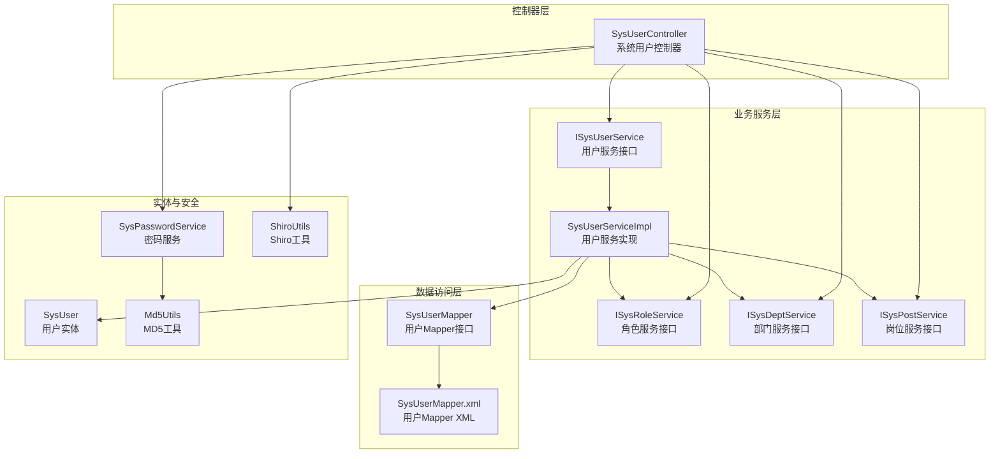
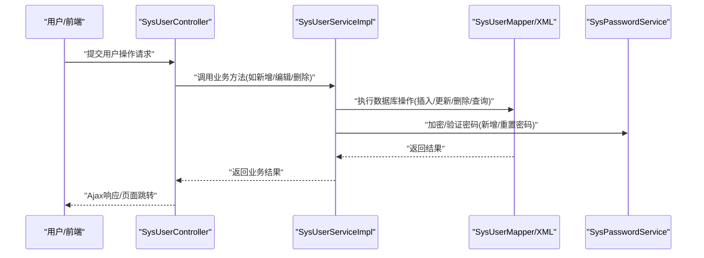
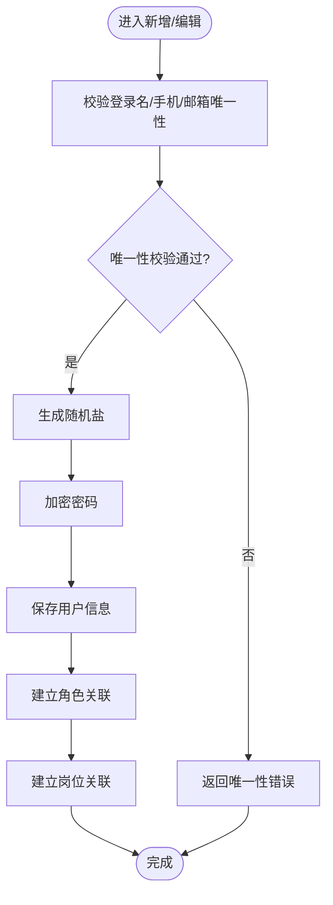
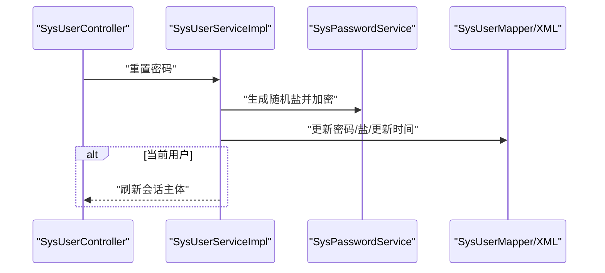
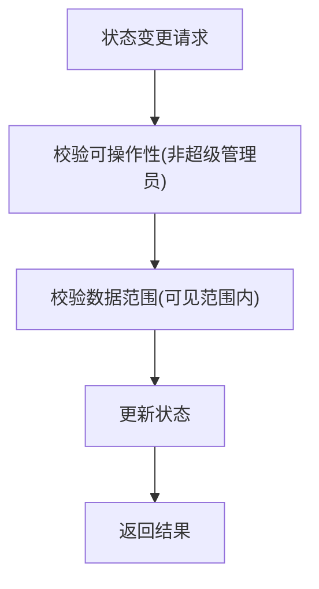
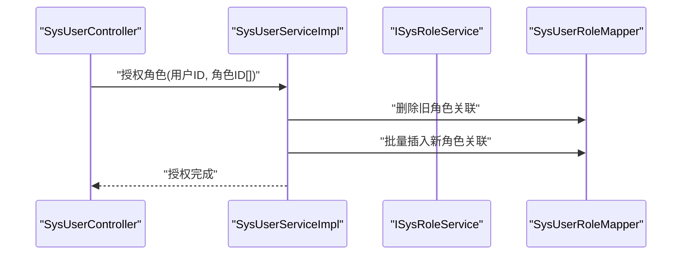
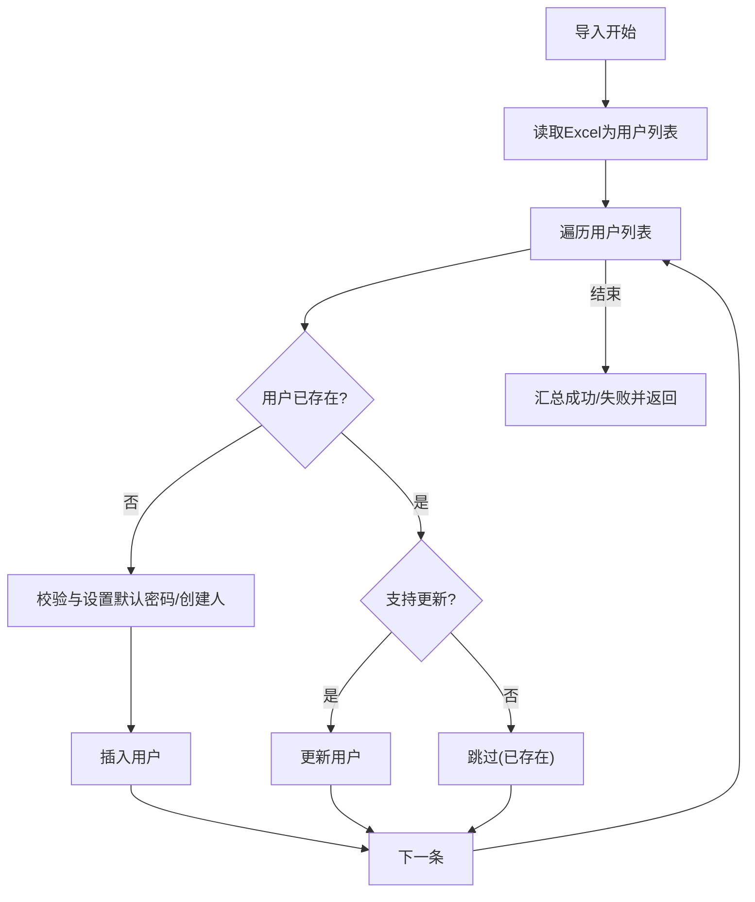
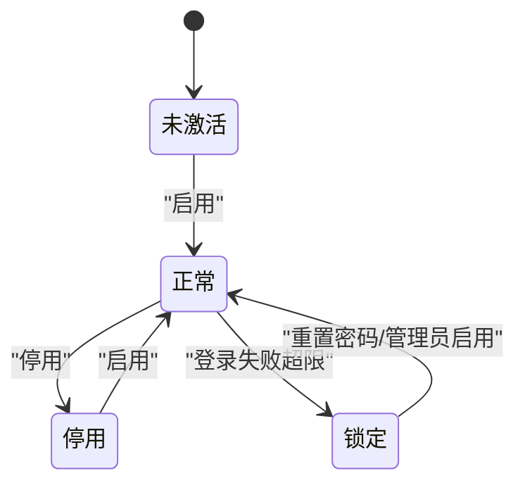
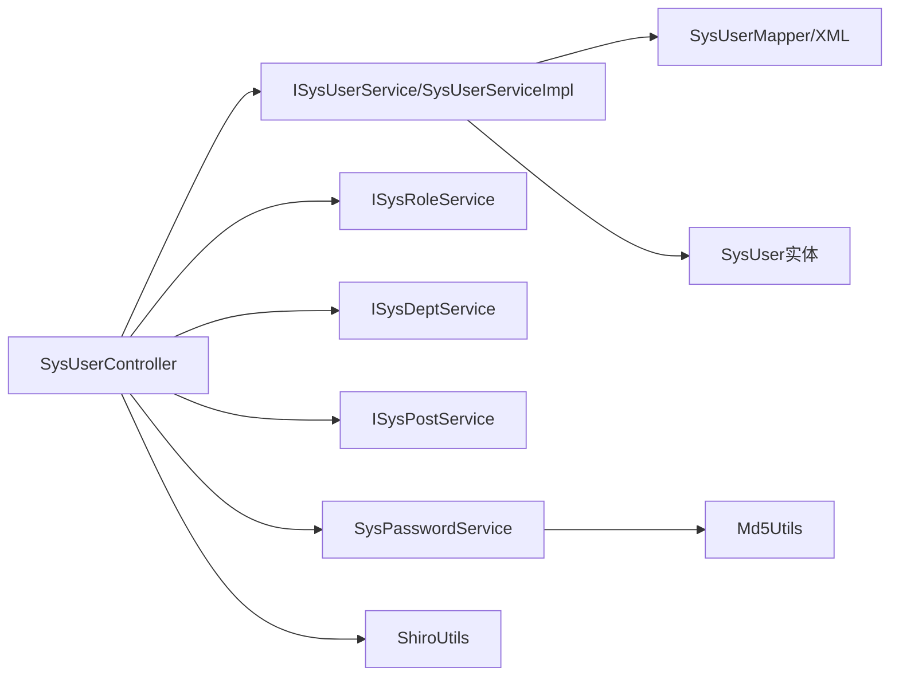

# 用户管理

<cite>
**本文引用的文件**
- [SysUserController.java](file://ruoyi-admin/src/main/java/com/ruoyi/web/controller/system/SysUserController.java)
- [ISysUserService.java](file://ruoyi-system/src/main/java/com/ruoyi/system/service/ISysUserService.java)
- [SysUserServiceImpl.java](file://ruoyi-system/src/main/java/com/ruoyi/system/service/impl/SysUserServiceImpl.java)
- [SysUserMapper.java](file://ruoyi-system/src/main/java/com/ruoyi/system/mapper/SysUserMapper.java)
- [SysUserMapper.xml](file://ruoyi-system/src/main/resources/mapper/system/SysUserMapper.xml)
- [SysUser.java](file://ruoyi-common/src/main/java/com/ruoyi/common/core/domain/entity/SysUser.java)
- [ISysRoleService.java](file://ruoyi-system/src/main/java/com/ruoyi/system/service/ISysRoleService.java)
- [ISysDeptService.java](file://ruoyi-system/src/main/java/com/ruoyi/system/service/ISysDeptService.java)
- [ISysPostService.java](file://ruoyi-system/src/main/java/com/ruoyi/system/service/ISysPostService.java)
- [SysPasswordService.java](file://ruoyi-framework/src/main/java/com/ruoyi/framework/shiro/service/SysPasswordService.java)
- [Md5Utils.java](file://ruoyi-common/src/main/java/com/ruoyi/common/utils/security/Md5Utils.java)
- [ShiroUtils.java](file://ruoyi-common/src/main/java/com/ruoyi/common/utils/ShiroUtils.java)
</cite>

## 目录
1. [简介](#简介)
2. [项目结构](#项目结构)
3. [核心组件](#核心组件)
4. [架构总览](#架构总览)
5. [详细组件分析](#详细组件分析)
6. [依赖分析](#依赖分析)
7. [性能考虑](#性能考虑)
8. [故障排查指南](#故障排查指南)
9. [结论](#结论)
10. [附录](#附录)

## 简介
本文件面向RuoYi系统的“用户管理”模块，提供从增删改查到角色关联、导入导出、批量操作、状态控制、密码管理、生命周期管理及安全保护的完整操作文档。内容覆盖控制器、服务层、数据映射层、实体模型、权限与安全工具等，帮助开发者与运维人员快速理解与使用。

## 项目结构
用户管理功能主要分布在以下模块与包中：
- 控制器层：系统管理模块下的用户控制器，负责HTTP请求入口与权限校验
- 业务服务层：系统模块的用户服务接口与实现，封装业务逻辑
- 数据访问层：MyBatis映射器与XML，负责数据库操作
- 实体模型：通用模块中的用户实体，定义字段与校验规则
- 权限与安全：框架模块的密码服务、Shiro工具等
- 配套服务：角色、部门、岗位服务用于角色分配与数据范围校验

**图示来源**
- [SysUserController.java:45-357](file://ruoyi-admin/src/main/java/com/ruoyi/web/controller/system/SysUserController.java#L45-L357)
- [ISysUserService.java:13-235](file://ruoyi-system/src/main/java/com/ruoyi/system/service/ISysUserService.java#L13-L235)
- [SysUserServiceImpl.java:46-596](file://ruoyi-system/src/main/java/com/ruoyi/system/service/impl/SysUserServiceImpl.java#L46-L596)
- [SysUserMapper.java:13-165](file://ruoyi-system/src/main/java/com/ruoyi/system/mapper/SysUserMapper.java#L13-L165)
- [SysUserMapper.xml:5-246](file://ruoyi-system/src/main/resources/mapper/system/SysUserMapper.xml#L5-L246)
- [SysUser.java:22-382](file://ruoyi-common/src/main/java/com/ruoyi/common/core/domain/entity/SysUser.java#L22-L382)
- [SysPasswordService.java:26-86](file://ruoyi-framework/src/main/java/com/ruoyi/framework/shiro/service/SysPasswordService.java#L26-L86)
- [Md5Utils.java:13-68](file://ruoyi-common/src/main/java/com/ruoyi/common/utils/security/Md5Utils.java#L13-L68)
- [ShiroUtils.java:16-105](file://ruoyi-common/src/main/java/com/ruoyi/common/utils/ShiroUtils.java#L16-L105)

**章节来源**
- [SysUserController.java:45-357](file://ruoyi-admin/src/main/java/com/ruoyi/web/controller/system/SysUserController.java#L45-L357)
- [SysUserServiceImpl.java:46-596](file://ruoyi-system/src/main/java/com/ruoyi/system/service/impl/SysUserServiceImpl.java#L46-L596)
- [SysUserMapper.xml:5-246](file://ruoyi-system/src/main/resources/mapper/system/SysUserMapper.xml#L5-L246)

## 核心组件
- 控制器：SysUserController 提供用户列表、新增、编辑、删除、重置密码、授权角色、导入导出、状态变更、唯一性校验等接口，并进行权限注解与参数校验
- 服务接口：ISysUserService 定义用户CRUD、导入、角色/岗位授权、唯一性校验、状态变更、登录信息更新等能力
- 服务实现：SysUserServiceImpl 实现具体业务逻辑，含事务、数据范围校验、角色/岗位关联、密码重置、导入处理等
- 映射器与XML：SysUserMapper 与 SysUserMapper.xml 完成SQL查询、插入、更新、删除、唯一性校验等
- 实体：SysUser 定义用户字段、Excel注解、XSS与长度校验等
- 安全与权限：SysPasswordService 负责密码加解密与登录重试限制；ShiroUtils 提供盐值生成、会话与管理员判断；Md5Utils 提供MD5摘要

**章节来源**
- [SysUserController.java:64-357](file://ruoyi-admin/src/main/java/com/ruoyi/web/controller/system/SysUserController.java#L64-L357)
- [ISysUserService.java:13-235](file://ruoyi-system/src/main/java/com/ruoyi/system/service/ISysUserService.java#L13-L235)
- [SysUserServiceImpl.java:46-596](file://ruoyi-system/src/main/java/com/ruoyi/system/service/impl/SysUserServiceImpl.java#L46-L596)
- [SysUserMapper.java:13-165](file://ruoyi-system/src/main/java/com/ruoyi/system/mapper/SysUserMapper.java#L13-L165)
- [SysUserMapper.xml:5-246](file://ruoyi-system/src/main/resources/mapper/system/SysUserMapper.xml#L5-L246)
- [SysUser.java:22-382](file://ruoyi-common/src/main/java/com/ruoyi/common/core/domain/entity/SysUser.java#L22-L382)
- [SysPasswordService.java:26-86](file://ruoyi-framework/src/main/java/com/ruoyi/framework/shiro/service/SysPasswordService.java#L26-L86)
- [ShiroUtils.java:16-105](file://ruoyi-common/src/main/java/com/ruoyi/common/utils/ShiroUtils.java#L16-L105)
- [Md5Utils.java:13-68](file://ruoyi-common/src/main/java/com/ruoyi/common/utils/security/Md5Utils.java#L13-L68)

## 架构总览
用户管理采用经典的三层架构：
- 表现层：控制器接收请求，返回AjaxResult或页面视图
- 领域层：服务层执行业务规则、数据范围校验、角色/岗位关联
- 数据持久层：Mapper接口+XML映射数据库操作

**图示来源**
- [SysUserController.java:116-153](file://ruoyi-admin/src/main/java/com/ruoyi/web/controller/system/SysUserController.java#L116-L153)
- [SysUserServiceImpl.java:219-265](file://ruoyi-system/src/main/java/com/ruoyi/system/service/impl/SysUserServiceImpl.java#L219-L265)
- [SysUserMapper.xml:173-206](file://ruoyi-system/src/main/resources/mapper/system/SysUserMapper.xml#L173-L206)
- [SysPasswordService.java:81-84](file://ruoyi-framework/src/main/java/com/ruoyi/framework/shiro/service/SysPasswordService.java#L81-L84)

## 详细组件分析

### 用户增删改查与基本信息维护
- 列表查询：分页查询用户列表，支持按登录名、手机号、状态、部门、时间范围等过滤
- 新增用户：校验登录名/手机/邮箱唯一性，生成随机盐，加密初始密码，写入创建人与密码更新时间，同时建立岗位与角色关联
- 编辑用户：校验可操作性与数据范围，校验唯一性，更新用户信息并清除授权缓存
- 删除用户：支持单个与批量删除，删除前进行可操作性与数据范围校验，清理角色与岗位关联
- 个人信息维护：提供头像更新、登录信息更新等

**图示来源**
- [SysUserController.java:116-153](file://ruoyi-admin/src/main/java/com/ruoyi/web/controller/system/SysUserController.java#L116-L153)
- [SysUserServiceImpl.java:219-265](file://ruoyi-system/src/main/java/com/ruoyi/system/service/impl/SysUserServiceImpl.java#L219-L265)
- [SysUserMapper.xml:208-244](file://ruoyi-system/src/main/resources/mapper/system/SysUserMapper.xml#L208-L244)

**章节来源**
- [SysUserController.java:71-153](file://ruoyi-admin/src/main/java/com/ruoyi/web/controller/system/SysUserController.java#L71-L153)
- [SysUserServiceImpl.java:179-265](file://ruoyi-system/src/main/java/com/ruoyi/system/service/impl/SysUserServiceImpl.java#L179-L265)
- [SysUserMapper.xml:62-89](file://ruoyi-system/src/main/resources/mapper/system/SysUserMapper.xml#L62-L89)

### 密码管理
- 新增时：生成随机盐，使用登录名+密码+盐进行加密存储
- 重置密码：生成新盐，重新加密并更新密码与更新时间，若为当前用户则刷新会话主体
- 登录校验：基于缓存记录登录尝试次数，超过阈值抛出异常

**图示来源**
- [SysUserController.java:214-242](file://ruoyi-admin/src/main/java/com/ruoyi/web/controller/system/SysUserController.java#L214-L242)
- [SysUserServiceImpl.java:324-328](file://ruoyi-system/src/main/java/com/ruoyi/system/service/impl/SysUserServiceImpl.java#L324-L328)
- [SysPasswordService.java:81-84](file://ruoyi-framework/src/main/java/com/ruoyi/framework/shiro/service/SysPasswordService.java#L81-L84)
- [SysUserMapper.xml:173-175](file://ruoyi-system/src/main/resources/mapper/system/SysUserMapper.xml#L173-L175)

**章节来源**
- [SysUserController.java:214-242](file://ruoyi-admin/src/main/java/com/ruoyi/web/controller/system/SysUserController.java#L214-L242)
- [SysUserServiceImpl.java:324-328](file://ruoyi-system/src/main/java/com/ruoyi/system/service/impl/SysUserServiceImpl.java#L324-L328)
- [SysPasswordService.java:42-69](file://ruoyi-framework/src/main/java/com/ruoyi/framework/shiro/service/SysPasswordService.java#L42-L69)

### 状态控制与数据范围校验
- 状态变更：支持启用/停用用户，更新状态与更新时间
- 数据范围校验：非管理员仅能操作其可见范围内的用户，否则抛出无权限异常
- 可操作性校验：禁止对超级管理员进行操作

**图示来源**
- [SysUserController.java:322-331](file://ruoyi-admin/src/main/java/com/ruoyi/web/controller/system/SysUserController.java#L322-L331)
- [SysUserServiceImpl.java:442-468](file://ruoyi-system/src/main/java/com/ruoyi/system/service/impl/SysUserServiceImpl.java#L442-L468)
- [SysUserMapper.xml:177-179](file://ruoyi-system/src/main/resources/mapper/system/SysUserMapper.xml#L177-L179)

**章节来源**
- [SysUserController.java:322-331](file://ruoyi-admin/src/main/java/com/ruoyi/web/controller/system/SysUserController.java#L322-L331)
- [SysUserServiceImpl.java:442-468](file://ruoyi-system/src/main/java/com/ruoyi/system/service/impl/SysUserServiceImpl.java#L442-L468)

### 用户与角色关联关系管理
- 授权角色：进入授权页加载用户与角色，提交后清空旧关联并批量写入新角色
- 角色列表：支持查询用户角色组、角色权限键集合、角色数据范围校验
- 批量分配：通过角色ID数组进行批量授权，内部自动清理旧关联并批量插入

**图示来源**
- [SysUserController.java:247-274](file://ruoyi-admin/src/main/java/com/ruoyi/web/controller/system/SysUserController.java#L247-L274)
- [SysUserServiceImpl.java:310-316](file://ruoyi-system/src/main/java/com/ruoyi/system/service/impl/SysUserServiceImpl.java#L310-L316)
- [ISysRoleService.java:13-167](file://ruoyi-system/src/main/java/com/ruoyi/system/service/ISysRoleService.java#L13-L167)

**章节来源**
- [SysUserController.java:247-274](file://ruoyi-admin/src/main/java/com/ruoyi/web/controller/system/SysUserController.java#L247-L274)
- [SysUserServiceImpl.java:310-354](file://ruoyi-system/src/main/java/com/ruoyi/system/service/impl/SysUserServiceImpl.java#L310-L354)
- [ISysRoleService.java:29-37](file://ruoyi-system/src/main/java/com/ruoyi/system/service/ISysRoleService.java#L29-L37)

### 导入导出与批量操作
- 导出：根据查询条件导出用户数据为Excel
- 导入：读取Excel为用户列表，逐条校验并导入或更新，支持唯一性与配置项初始化密码
- 批量删除：传入多个用户ID，统一进行可操作性与数据范围校验后删除

**图示来源**
- [SysUserController.java:81-111](file://ruoyi-admin/src/main/java/com/ruoyi/web/controller/system/SysUserController.java#L81-L111)
- [SysUserServiceImpl.java:512-582](file://ruoyi-system/src/main/java/com/ruoyi/system/service/impl/SysUserServiceImpl.java#L512-L582)
- [SysUserMapper.xml:141-151](file://ruoyi-system/src/main/resources/mapper/system/SysUserMapper.xml#L141-L151)

**章节来源**
- [SysUserController.java:81-111](file://ruoyi-admin/src/main/java/com/ruoyi/web/controller/system/SysUserController.java#L81-L111)
- [SysUserServiceImpl.java:512-582](file://ruoyi-system/src/main/java/com/ruoyi/system/service/impl/SysUserServiceImpl.java#L512-L582)

### 用户注册、激活、锁定与生命周期
- 注册：注册用户类型标记为注册用户，插入数据库
- 激活/停用：通过状态字段控制，支持批量与单个变更
- 锁定：登录失败重试超限由密码服务触发，防止暴力破解
- 生命周期：创建时间、更新时间、密码更新时间、登录IP与时间等贯穿用户全生命周期

**图示来源**
- [SysUserServiceImpl.java:239-243](file://ruoyi-system/src/main/java/com/ruoyi/system/service/impl/SysUserServiceImpl.java#L239-L243)
- [SysUserMapper.xml:177-179](file://ruoyi-system/src/main/resources/mapper/system/SysUserMapper.xml#L177-L179)
- [SysPasswordService.java:53-64](file://ruoyi-framework/src/main/java/com/ruoyi/framework/shiro/service/SysPasswordService.java#L53-L64)

**章节来源**
- [SysUserServiceImpl.java:239-243](file://ruoyi-system/src/main/java/com/ruoyi/system/service/impl/SysUserServiceImpl.java#L239-L243)
- [SysPasswordService.java:42-69](file://ruoyi-framework/src/main/java/com/ruoyi/framework/shiro/service/SysPasswordService.java#L42-L69)

### 安全保护措施
- 密码安全：随机盐+登录名+密码+盐的哈希，避免彩虹表攻击
- XSS防护：实体字段标注XSS注解，防止脚本注入
- 参数校验：登录名、邮箱、手机号等字段长度与格式校验
- 权限控制：Shiro注解控制操作权限，管理员不可被操作
- 会话刷新：重置密码后若为当前用户，刷新会话主体以生效新密码

**章节来源**
- [SysUser.java:160-216](file://ruoyi-common/src/main/java/com/ruoyi/common/core/domain/entity/SysUser.java#L160-L216)
- [SysPasswordService.java:81-84](file://ruoyi-framework/src/main/java/com/ruoyi/framework/shiro/service/SysPasswordService.java#L81-L84)
- [ShiroUtils.java:94-103](file://ruoyi-common/src/main/java/com/ruoyi/common/utils/ShiroUtils.java#L94-L103)
- [SysUserController.java:235-238](file://ruoyi-admin/src/main/java/com/ruoyi/web/controller/system/SysUserController.java#L235-L238)

## 依赖分析
- 控制器依赖服务接口与配套服务（角色、部门、岗位），并通过Shiro工具进行权限与会话管理
- 服务实现依赖Mapper与配置服务，处理事务与数据范围
- 密码服务依赖缓存与Shiro常量，提供登录重试限制
- 实体作为数据载体，承载Excel导出、XSS与字段校验

**图示来源**
- [SysUserController.java:49-62](file://ruoyi-admin/src/main/java/com/ruoyi/web/controller/system/SysUserController.java#L49-L62)
- [SysUserServiceImpl.java:50-72](file://ruoyi-system/src/main/java/com/ruoyi/system/service/impl/SysUserServiceImpl.java#L50-L72)
- [SysPasswordService.java:28-40](file://ruoyi-framework/src/main/java/com/ruoyi/framework/shiro/service/SysPasswordService.java#L28-L40)
- [SysUser.java:22-382](file://ruoyi-common/src/main/java/com/ruoyi/common/core/domain/entity/SysUser.java#L22-L382)

**章节来源**
- [SysUserController.java:49-62](file://ruoyi-admin/src/main/java/com/ruoyi/web/controller/system/SysUserController.java#L49-L62)
- [SysUserServiceImpl.java:50-72](file://ruoyi-system/src/main/java/com/ruoyi/system/service/impl/SysUserServiceImpl.java#L50-L72)

## 性能考虑
- 分页查询：列表查询使用分页与条件过滤，建议合理设置索引以优化模糊匹配
- 批量操作：批量删除与授权使用批量SQL，减少往返开销
- 缓存：登录重试限制使用缓存，避免频繁数据库访问
- 事务：新增/编辑/授权涉及多表写入，使用事务保证一致性
- 导入性能：导入过程逐条校验与写入，建议分批处理与并发控制

[本节为通用指导，无需特定文件来源]

## 故障排查指南
- 唯一性冲突：新增/编辑返回唯一性错误，检查登录名/手机/邮箱是否重复
- 权限不足：非管理员无法操作目标用户或越权访问，检查数据范围与角色
- 超级管理员限制：禁止对超级管理员进行操作或删除自身
- 导入失败：查看失败原因汇总，修正格式或重复策略
- 登录失败过多：触发登录重试上限，等待或联系管理员重置

**章节来源**
- [SysUserController.java:136-152](file://ruoyi-admin/src/main/java/com/ruoyi/web/controller/system/SysUserController.java#L136-L152)
- [SysUserServiceImpl.java:442-448](file://ruoyi-system/src/main/java/com/ruoyi/system/service/impl/SysUserServiceImpl.java#L442-L448)
- [SysUserServiceImpl.java:559-571](file://ruoyi-system/src/main/java/com/ruoyi/system/service/impl/SysUserServiceImpl.java#L559-L571)
- [SysPasswordService.java:53-64](file://ruoyi-framework/src/main/java/com/ruoyi/framework/shiro/service/SysPasswordService.java#L53-L64)

## 结论
RuoYi的用户管理模块通过清晰的分层设计与完善的权限控制，实现了用户全生命周期管理、角色与岗位关联、安全的密码处理、便捷的导入导出与批量操作。遵循本文档的操作流程与最佳实践，可高效、安全地完成用户管理任务。

## 附录
- 关键接口路径参考
  - 用户列表：POST /system/user/list
  - 用户导出：POST /system/user/export
  - 用户导入：POST /system/user/importData
  - 新增用户：POST /system/user/add
  - 编辑用户：POST /system/user/edit
  - 删除用户：POST /system/user/remove
  - 重置密码：POST /system/user/resetPwd
  - 授权角色：POST /system/user/authRole/insertAuthRole
  - 状态变更：POST /system/user/changeStatus
  - 唯一性校验：POST /system/user/checkLoginNameUnique、/checkPhoneUnique、/checkEmailUnique

**章节来源**
- [SysUserController.java:71-357](file://ruoyi-admin/src/main/java/com/ruoyi/web/controller/system/SysUserController.java#L71-L357)