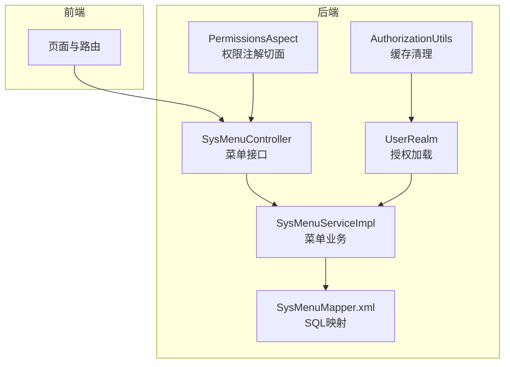
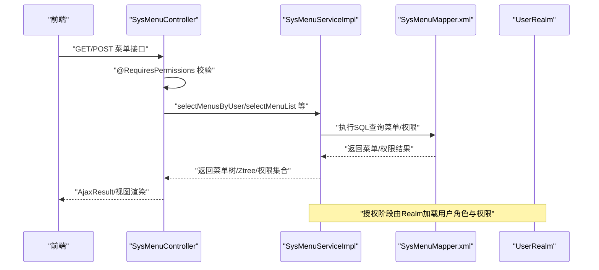
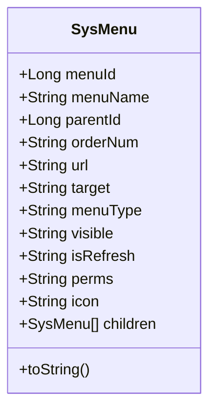
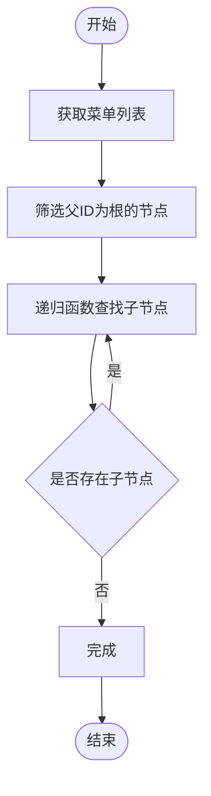
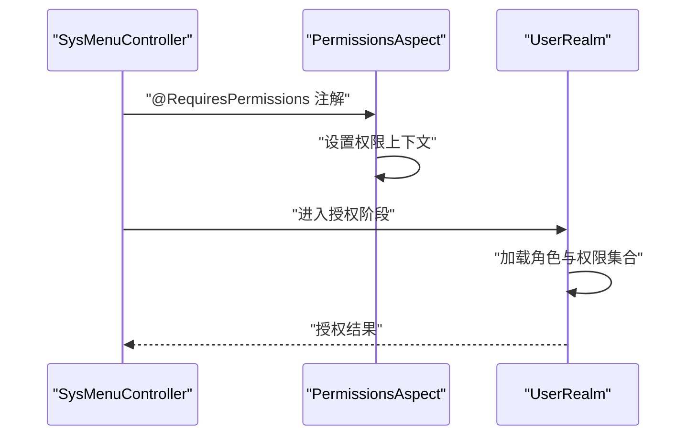
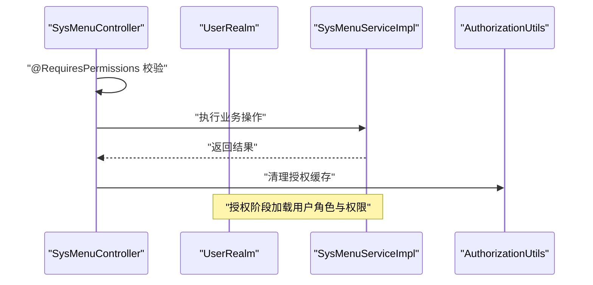
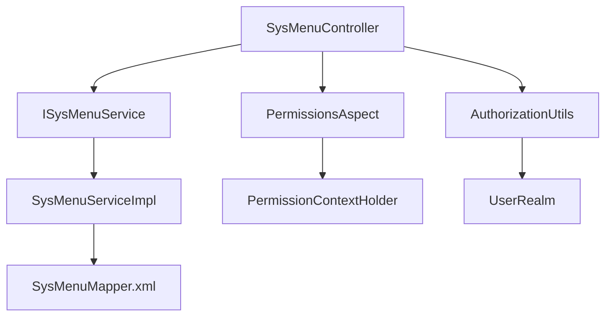

# 菜单权限

<cite>
**本文引用的文件**
- [SysMenu.java](file://ruoyi-common/src/main/java/com/ruoyi/common/core/domain/entity/SysMenu.java)
- [ISysMenuService.java](file://ruoyi-system/src/main/java/com/ruoyi/system/service/ISysMenuService.java)
- [SysMenuServiceImpl.java](file://ruoyi-system/src/main/java/com/ruoyi/system/service/impl/SysMenuServiceImpl.java)
- [SysMenuController.java](file://ruoyi-admin/src/main/java/com/ruoyi/web/controller/system/SysMenuController.java)
- [SysMenuMapper.xml](file://ruoyi-system/src/main/resources/mapper/system/SysMenuMapper.xml)
- [PermissionsAspect.java](file://ruoyi-framework/src/main/java/com/ruoyi/framework/aspectj/PermissionsAspect.java)
- [AuthorizationUtils.java](file://ruoyi-framework/src/main/java/com/ruoyi/framework/shiro/util/AuthorizationUtils.java)
- [UserRealm.java](file://ruoyi-framework/src/main/java/com/ruoyi/framework/shiro/realm/UserRealm.java)
</cite>

## 目录
1. [引言](#引言)
2. [项目结构](#项目结构)
3. [核心组件](#核心组件)
4. [架构总览](#架构总览)
5. [详细组件分析](#详细组件分析)
6. [依赖分析](#依赖分析)
7. [性能考虑](#性能考虑)
8. [故障排查指南](#故障排查指南)
9. [结论](#结论)
10. [附录](#附录)

## 引言
本技术文档围绕菜单权限管理展开，系统性阐述菜单树形结构设计与实现、菜单层级关系与父子节点关联的数据模型；详述菜单权限配置方法，包括菜单显示控制、按钮权限绑定、路由权限验证；解释菜单权限与角色权限的关联机制及权限继承与覆盖规则；提供菜单权限的动态加载、缓存策略与性能优化方案，并给出安全验证流程与异常处理机制。

## 项目结构
RuoYi 后端采用分层架构：前端控制器位于 ruoyi-admin 模块，业务服务位于 ruoyi-system 模块，框架与安全位于 ruoyi-framework 模块，通用实体与工具位于 ruoyi-common 模块。菜单权限涉及的关键模块与职责如下：
- 控制层：SysMenuController 提供菜单管理的 HTTP 接口，负责权限注解校验与参数传递。
- 业务层：ISysMenuService 及其实现 SysMenuServiceImpl 提供菜单树构建、权限聚合、Ztree 转换等能力。
- 数据访问层：SysMenuMapper.xml 定义菜单与权限相关的 SQL 查询与更新逻辑。
- 安全与权限：UserRealm 负责授权信息加载；PermissionsAspect 将控制器权限注解注入上下文；AuthorizationUtils 提供缓存清理能力。
- 实体模型：SysMenu 描述菜单树形结构与权限标识字段。



**图表来源**
- [SysMenuController.java:31-212](file://ruoyi-admin/src/main/java/com/ruoyi/web/controller/system/SysMenuController.java#L31-L212)
- [SysMenuServiceImpl.java:33-441](file://ruoyi-system/src/main/java/com/ruoyi/system/service/impl/SysMenuServiceImpl.java#L33-L441)
- [SysMenuMapper.xml:1-197](file://ruoyi-system/src/main/resources/mapper/system/SysMenuMapper.xml#L1-L197)
- [UserRealm.java:40-159](file://ruoyi-framework/src/main/java/com/ruoyi/framework/shiro/realm/UserRealm.java#L40-L159)
- [PermissionsAspect.java:16-31](file://ruoyi-framework/src/main/java/com/ruoyi/framework/aspectj/PermissionsAspect.java#L16-L31)
- [AuthorizationUtils.java:12-31](file://ruoyi-framework/src/main/java/com/ruoyi/framework/shiro/util/AuthorizationUtils.java#L12-L31)

**章节来源**
- [SysMenuController.java:31-212](file://ruoyi-admin/src/main/java/com/ruoyi/web/controller/system/SysMenuController.java#L31-L212)
- [SysMenuServiceImpl.java:33-441](file://ruoyi-system/src/main/java/com/ruoyi/system/service/impl/SysMenuServiceImpl.java#L33-L441)
- [SysMenuMapper.xml:1-197](file://ruoyi-system/src/main/resources/mapper/system/SysMenuMapper.xml#L1-L197)
- [UserRealm.java:40-159](file://ruoyi-framework/src/main/java/com/ruoyi/framework/shiro/realm/UserRealm.java#L40-L159)
- [PermissionsAspect.java:16-31](file://ruoyi-framework/src/main/java/com/ruoyi/framework/aspectj/PermissionsAspect.java#L16-L31)
- [AuthorizationUtils.java:12-31](file://ruoyi-framework/src/main/java/com/ruoyi/framework/shiro/util/AuthorizationUtils.java#L12-L31)

## 核心组件
- SysMenu 实体：定义菜单字段（名称、父ID、显示顺序、URL、打开方式、类型、可见性、刷新标志、权限字符串、图标、子菜单集合），支持树形结构序列化输出。
- ISysMenuService 接口：定义菜单查询、权限查询、菜单树构建、Ztree 转换、排序更新、唯一性校验等能力。
- SysMenuServiceImpl 实现：实现菜单树构建（递归与子节点查找）、权限聚合（按用户/角色拆分权限字符串）、Ztree 初始化、排序更新事务与异常包装、唯一性校验。
- SysMenuController 控制器：提供菜单 CRUD、树形加载、排序保存、权限注解校验、调用业务层并返回 AjaxResult。
- SysMenuMapper.xml：定义菜单与权限相关 SQL，包括按用户/角色查询菜单、权限字符串聚合、菜单树拼接、唯一性校验等。
- UserRealm：在授权阶段加载用户的角色与权限集合，管理员拥有全部权限。
- PermissionsAspect：将控制器上的权限注解值写入请求上下文，便于多角色匹配。
- AuthorizationUtils：提供清理授权缓存的能力，确保权限变更生效。

**章节来源**
- [SysMenu.java:15-215](file://ruoyi-common/src/main/java/com/ruoyi/common/core/domain/entity/SysMenu.java#L15-L215)
- [ISysMenuService.java:16-148](file://ruoyi-system/src/main/java/com/ruoyi/system/service/ISysMenuService.java#L16-L148)
- [SysMenuServiceImpl.java:33-441](file://ruoyi-system/src/main/java/com/ruoyi/system/service/impl/SysMenuServiceImpl.java#L33-L441)
- [SysMenuController.java:31-212](file://ruoyi-admin/src/main/java/com/ruoyi/web/controller/system/SysMenuController.java#L31-L212)
- [SysMenuMapper.xml:1-197](file://ruoyi-system/src/main/resources/mapper/system/SysMenuMapper.xml#L1-L197)
- [UserRealm.java:40-159](file://ruoyi-framework/src/main/java/com/ruoyi/framework/shiro/realm/UserRealm.java#L40-L159)
- [PermissionsAspect.java:16-31](file://ruoyi-framework/src/main/java/com/ruoyi/framework/aspectj/PermissionsAspect.java#L16-L31)
- [AuthorizationUtils.java:12-31](file://ruoyi-framework/src/main/java/com/ruoyi/framework/shiro/util/AuthorizationUtils.java#L12-L31)

## 架构总览
菜单权限的总体流程：
- 前端发起菜单管理请求或路由访问。
- 控制器通过权限注解进行前置校验。
- 业务层根据用户身份与角色加载菜单树与权限集合。
- 数据访问层执行 SQL 查询，按可见性与角色状态过滤菜单。
- 授权阶段由 Realm 加载用户角色与权限，管理员拥有全部权限。
- 权限变更时通过工具清理缓存，保证一致性。



**图表来源**
- [SysMenuController.java:31-212](file://ruoyi-admin/src/main/java/com/ruoyi/web/controller/system/SysMenuController.java#L31-L212)
- [SysMenuServiceImpl.java:33-441](file://ruoyi-system/src/main/java/com/ruoyi/system/service/impl/SysMenuServiceImpl.java#L33-L441)
- [SysMenuMapper.xml:1-197](file://ruoyi-system/src/main/resources/mapper/system/SysMenuMapper.xml#L1-L197)
- [UserRealm.java:40-159](file://ruoyi-framework/src/main/java/com/ruoyi/framework/shiro/realm/UserRealm.java#L40-L159)

## 详细组件分析

### 数据模型与树形结构
- SysMenu 字段涵盖菜单基本信息、层级关系（parentId/menuId）、排序（orderNum）、展示属性（visible/url/target/isRefresh/icon）、权限标识（perms）与子节点集合（children）。该结构天然支持树形序列化与前端渲染。
- 业务层通过 getChildPerms 与递归函数构建树形结构：先筛选根节点，再递归填充子节点，最终得到以根为单位的菜单树。



**图表来源**
- [SysMenu.java:15-215](file://ruoyi-common/src/main/java/com/ruoyi/common/core/domain/entity/SysMenu.java#L15-L215)

**章节来源**
- [SysMenu.java:15-215](file://ruoyi-common/src/main/java/com/ruoyi/common/core/domain/entity/SysMenu.java#L15-L215)
- [SysMenuServiceImpl.java:372-441](file://ruoyi-system/src/main/java/com/ruoyi/system/service/impl/SysMenuServiceImpl.java#L372-L441)

### 菜单树构建与父子节点关联
- 业务层通过两步完成树构建：第一步筛选 parentId=0 的根节点；第二步递归查找每个节点的子节点并挂载到 children。
- Ztree 转换：initZtree 将 SysMenu 列表转换为 Ztree 列表，支持角色已选菜单勾选与权限标识显示。



**图表来源**
- [SysMenuServiceImpl.java:372-441](file://ruoyi-system/src/main/java/com/ruoyi/system/service/impl/SysMenuServiceImpl.java#L372-L441)
- [SysMenuServiceImpl.java:212-243](file://ruoyi-system/src/main/java/com/ruoyi/system/service/impl/SysMenuServiceImpl.java#L212-L243)

**章节来源**
- [SysMenuServiceImpl.java:372-441](file://ruoyi-system/src/main/java/com/ruoyi/system/service/impl/SysMenuServiceImpl.java#L372-L441)
- [SysMenuServiceImpl.java:212-243](file://ruoyi-system/src/main/java/com/ruoyi/system/service/impl/SysMenuServiceImpl.java#L212-L243)

### 权限配置与路由验证
- 控制器权限注解：SysMenuController 使用 @RequiresPermissions 对菜单管理操作进行权限校验，确保只有具备相应权限的用户可访问。
- 权限注解上下文：PermissionsAspect 在方法执行前将注解中的权限值写入请求上下文，便于后续多角色匹配。
- 路由权限验证：UserRealm 在授权阶段加载用户的角色与权限集合；管理员拥有全部权限字符串，普通用户仅加载其角色关联的菜单权限。



**图表来源**
- [SysMenuController.java:31-212](file://ruoyi-admin/src/main/java/com/ruoyi/web/controller/system/SysMenuController.java#L31-L212)
- [PermissionsAspect.java:16-31](file://ruoyi-framework/src/main/java/com/ruoyi/framework/aspectj/PermissionsAspect.java#L16-L31)
- [UserRealm.java:40-159](file://ruoyi-framework/src/main/java/com/ruoyi/framework/shiro/realm/UserRealm.java#L40-L159)

**章节来源**
- [SysMenuController.java:31-212](file://ruoyi-admin/src/main/java/com/ruoyi/web/controller/system/SysMenuController.java#L31-L212)
- [PermissionsAspect.java:16-31](file://ruoyi-framework/src/main/java/com/ruoyi/framework/aspectj/PermissionsAspect.java#L16-L31)
- [UserRealm.java:40-159](file://ruoyi-framework/src/main/java/com/ruoyi/framework/shiro/realm/UserRealm.java#L40-L159)

### 菜单权限与角色权限的关联机制
- 角色到菜单：SysMenuMapper.xml 中通过 sys_role_menu 关联表查询角色已授权菜单；Ztree 转换时将角色已选菜单置为勾选状态。
- 用户到权限：UserRealm 在授权阶段调用菜单服务按用户聚合权限字符串；SysMenuServiceImpl 将逗号分隔的权限字符串拆分为集合。
- 权限继承与覆盖：管理员拥有全部权限字符串；普通用户权限来源于其角色关联菜单的 perms 字段，不存在“继承”概念，但可通过角色组合实现覆盖效果。

```mermaid
graph LR
ROLE["角色"] --> RM["sys_role_menu"]
MENU["菜单"] <- --> RM
USER["用户"] --> UR["sys_user_role"]
UR --> ROLE
RM --> MENU
MENU --> PERMS["权限字符串"]
PERMS --> USER_PERMS["用户权限集合"]
```

**图表来源**
- [SysMenuMapper.xml:1-197](file://ruoyi-system/src/main/resources/mapper/system/SysMenuMapper.xml#L1-L197)
- [SysMenuServiceImpl.java:113-147](file://ruoyi-system/src/main/java/com/ruoyi/system/service/impl/SysMenuServiceImpl.java#L113-L147)
- [UserRealm.java:40-159](file://ruoyi-framework/src/main/java/com/ruoyi/framework/shiro/realm/UserRealm.java#L40-L159)

**章节来源**
- [SysMenuMapper.xml:1-197](file://ruoyi-system/src/main/resources/mapper/system/SysMenuMapper.xml#L1-L197)
- [SysMenuServiceImpl.java:113-147](file://ruoyi-system/src/main/java/com/ruoyi/system/service/impl/SysMenuServiceImpl.java#L113-L147)
- [UserRealm.java:40-159](file://ruoyi-framework/src/main/java/com/ruoyi/framework/shiro/realm/UserRealm.java#L40-L159)

### 动态加载、缓存策略与性能优化
- 动态加载：SysMenuServiceImpl 根据用户身份动态决定查询范围（管理员与普通用户），并通过 SQL 过滤可见菜单与有效角色。
- 缓存清理：权限变更后，控制器调用 AuthorizationUtils 清理授权缓存，确保下次授权时加载最新权限。
- 性能优化建议：
  - SQL 层面：为 sys_menu 的 parent_id、menu_type、visible、perms 建立索引，提升过滤与排序效率。
  - 业务层面：Ztree 转换与权限拆分采用一次遍历，避免重复计算；菜单树构建递归深度受层级限制，建议前端限制最大层级。
  - 缓存策略：可在业务层增加本地缓存（如按用户ID缓存权限集合与菜单树），结合 AuthorizationUtils 清理触发失效。

**章节来源**
- [SysMenuServiceImpl.java:50-105](file://ruoyi-system/src/main/java/com/ruoyi/system/service/impl/SysMenuServiceImpl.java#L50-L105)
- [SysMenuMapper.xml:1-197](file://ruoyi-system/src/main/resources/mapper/system/SysMenuMapper.xml#L1-L197)
- [AuthorizationUtils.java:12-31](file://ruoyi-framework/src/main/java/com/ruoyi/framework/shiro/util/AuthorizationUtils.java#L12-L31)

### 安全验证流程与异常处理
- 登录认证：UserRealm 在认证阶段通过 SysLoginService 完成登录校验，捕获多种用户异常并抛出对应认证异常。
- 授权加载：授权阶段加载用户角色与权限集合；管理员授予全部权限字符串。
- 控制器前置校验：SysMenuController 使用 @RequiresPermissions 注解进行权限校验，防止越权访问。
- 权限变更后的缓存清理：控制器在新增/修改/删除菜单后调用 AuthorizationUtils 清理授权缓存，确保权限即时生效。



**图表来源**
- [SysMenuController.java:31-212](file://ruoyi-admin/src/main/java/com/ruoyi/web/controller/system/SysMenuController.java#L31-L212)
- [UserRealm.java:40-159](file://ruoyi-framework/src/main/java/com/ruoyi/framework/shiro/realm/UserRealm.java#L40-L159)
- [AuthorizationUtils.java:12-31](file://ruoyi-framework/src/main/java/com/ruoyi/framework/shiro/util/AuthorizationUtils.java#L12-L31)

**章节来源**
- [UserRealm.java:40-159](file://ruoyi-framework/src/main/java/com/ruoyi/framework/shiro/realm/UserRealm.java#L40-L159)
- [SysMenuController.java:31-212](file://ruoyi-admin/src/main/java/com/ruoyi/web/controller/system/SysMenuController.java#L31-L212)
- [AuthorizationUtils.java:12-31](file://ruoyi-framework/src/main/java/com/ruoyi/framework/shiro/util/AuthorizationUtils.java#L12-L31)

## 依赖分析
- 控制层依赖业务层接口，业务层依赖数据访问层与工具类。
- 权限注解切面依赖权限上下文工具，授权工具依赖 Shiro SecurityManager 与自定义 Realm。
- 数据访问层依赖数据库表结构与关联关系。



**图表来源**
- [SysMenuController.java:31-212](file://ruoyi-admin/src/main/java/com/ruoyi/web/controller/system/SysMenuController.java#L31-L212)
- [ISysMenuService.java:16-148](file://ruoyi-system/src/main/java/com/ruoyi/system/service/ISysMenuService.java#L16-L148)
- [SysMenuServiceImpl.java:33-441](file://ruoyi-system/src/main/java/com/ruoyi/system/service/impl/SysMenuServiceImpl.java#L33-L441)
- [SysMenuMapper.xml:1-197](file://ruoyi-system/src/main/resources/mapper/system/SysMenuMapper.xml#L1-L197)
- [PermissionsAspect.java:16-31](file://ruoyi-framework/src/main/java/com/ruoyi/framework/aspectj/PermissionsAspect.java#L16-L31)
- [AuthorizationUtils.java:12-31](file://ruoyi-framework/src/main/java/com/ruoyi/framework/shiro/util/AuthorizationUtils.java#L12-L31)
- [UserRealm.java:40-159](file://ruoyi-framework/src/main/java/com/ruoyi/framework/shiro/realm/UserRealm.java#L40-L159)

**章节来源**
- [SysMenuController.java:31-212](file://ruoyi-admin/src/main/java/com/ruoyi/web/controller/system/SysMenuController.java#L31-L212)
- [ISysMenuService.java:16-148](file://ruoyi-system/src/main/java/com/ruoyi/system/service/ISysMenuService.java#L16-L148)
- [SysMenuServiceImpl.java:33-441](file://ruoyi-system/src/main/java/com/ruoyi/system/service/impl/SysMenuServiceImpl.java#L33-L441)
- [SysMenuMapper.xml:1-197](file://ruoyi-system/src/main/resources/mapper/system/SysMenuMapper.xml#L1-L197)
- [PermissionsAspect.java:16-31](file://ruoyi-framework/src/main/java/com/ruoyi/framework/aspectj/PermissionsAspect.java#L16-L31)
- [AuthorizationUtils.java:12-31](file://ruoyi-framework/src/main/java/com/ruoyi/framework/shiro/util/AuthorizationUtils.java#L12-L31)
- [UserRealm.java:40-159](file://ruoyi-framework/src/main/java/com/ruoyi/framework/shiro/realm/UserRealm.java#L40-L159)

## 性能考虑
- 数据库索引：为 sys_menu 的 parent_id、menu_type、visible、perms 建立复合索引，减少过滤与排序成本。
- 查询优化：优先使用按用户过滤的 SQL，避免全量扫描；权限聚合采用逗号分隔字段拆分，避免复杂连接。
- 缓存策略：在业务层增加按用户维度的本地缓存（权限集合与菜单树），结合 AuthorizationUtils 清理触发失效，降低数据库压力。
- 前端限制：限制菜单层级与节点数量，避免超大树形结构导致渲染与交互性能问题。

## 故障排查指南
- 菜单不可见：检查菜单的 visible 字段与角色状态；确认 SQL 中的过滤条件是否正确。
- 权限不足：确认用户角色与菜单 perms 是否匹配；检查管理员身份判定与权限集合加载逻辑。
- 权限变更无效：确认控制器是否调用了授权缓存清理方法；检查 Realm 缓存清理逻辑。
- 删除菜单失败：检查是否存在子菜单或已被角色引用；根据业务层返回提示进行处理。

**章节来源**
- [SysMenuServiceImpl.java:262-302](file://ruoyi-system/src/main/java/com/ruoyi/system/service/impl/SysMenuServiceImpl.java#L262-L302)
- [SysMenuController.java:57-76](file://ruoyi-admin/src/main/java/com/ruoyi/web/controller/system/SysMenuController.java#L57-L76)
- [AuthorizationUtils.java:12-31](file://ruoyi-framework/src/main/java/com/ruoyi/framework/shiro/util/AuthorizationUtils.java#L12-L31)

## 结论
本系统通过清晰的分层设计与完善的权限体系，实现了菜单树形结构的高效构建与权限的灵活配置。管理员拥有全局权限，普通用户的权限来源于其角色与菜单关联；权限变更通过缓存清理确保即时生效。通过合理的数据库索引、业务层缓存与前端限制，可进一步提升性能与用户体验。

## 附录
- 菜单类型说明：目录（M）、菜单（C）、按钮（F）三类，分别对应导航层级、页面路由与细粒度操作权限。
- 权限字符串格式：业务层将数据库中的逗号分隔权限字符串拆分为集合，便于授权判断。