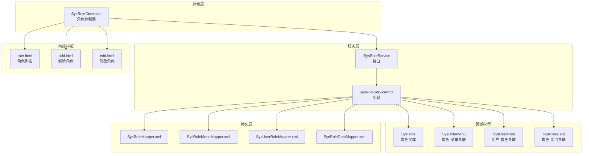
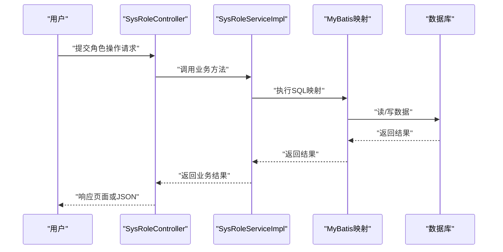
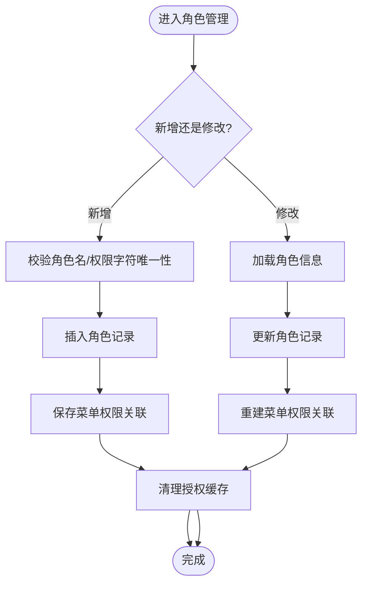
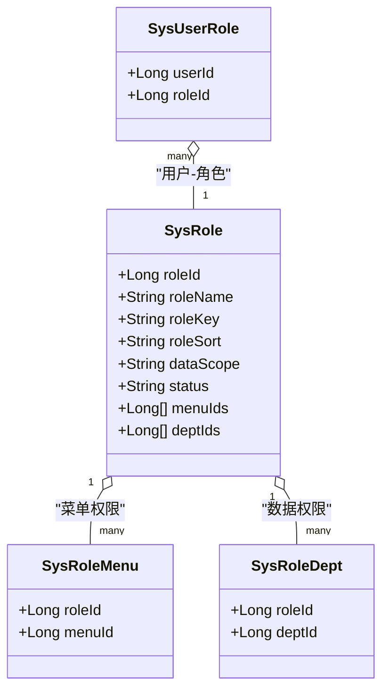
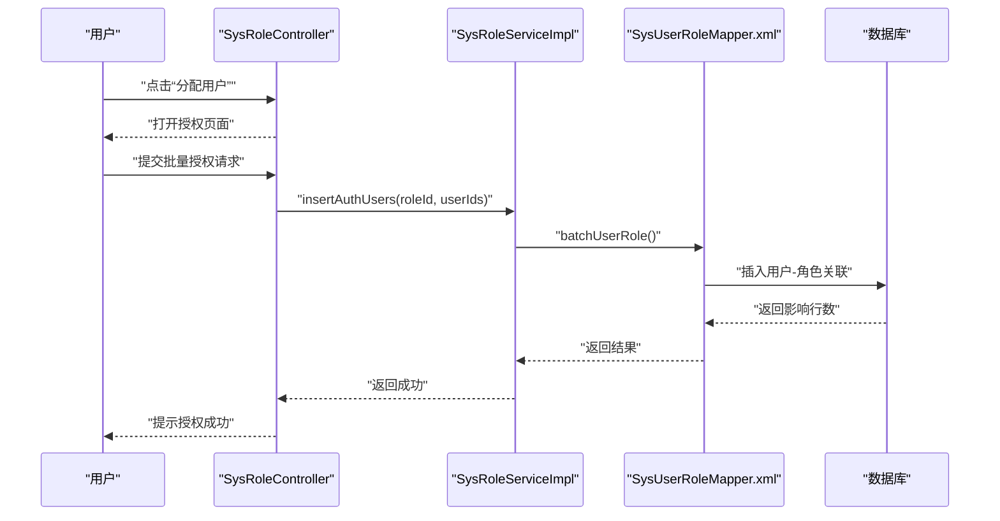
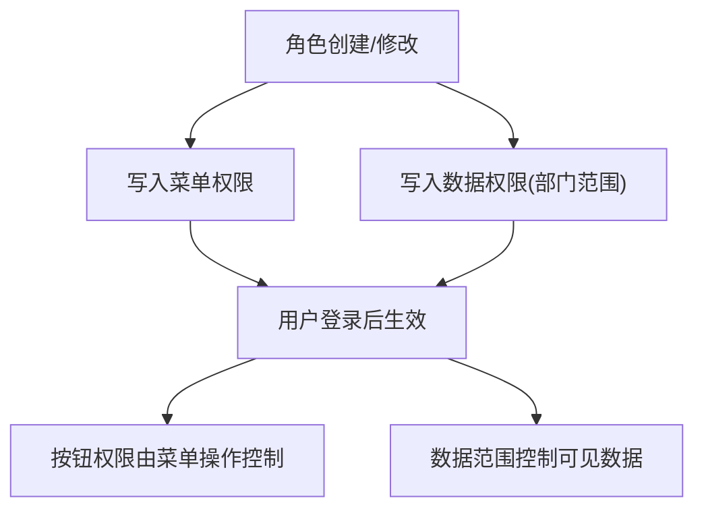
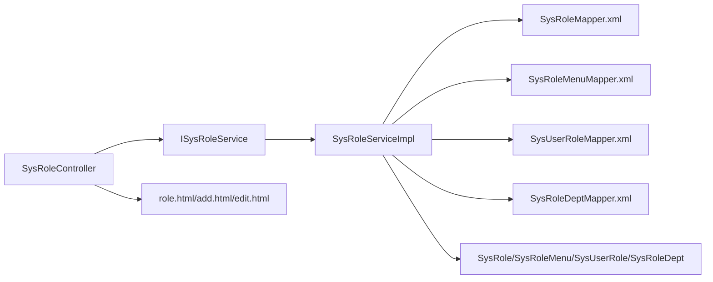

# 角色管理

<cite>
**本文引用的文件**   
- [SysRoleController.java](file://ruoyi-admin/src/main/java/com/ruoyi/web/controller/system/SysRoleController.java)
- [ISysRoleService.java](file://ruoyi-system/src/main/java/com/ruoyi/system/service/ISysRoleService.java)
- [SysRoleServiceImpl.java](file://ruoyi-system/src/main/java/com/ruoyi/system/service/impl/SysRoleServiceImpl.java)
- [SysRole.java](file://ruoyi-common/src/main/java/com/ruoyi/common/core/domain/entity/SysRole.java)
- [SysRoleMenu.java](file://ruoyi-system/src/main/java/com/ruoyi/system/domain/SysRoleMenu.java)
- [SysUserRole.java](file://ruoyi-system/src/main/java/com/ruoyi/system/domain/SysUserRole.java)
- [SysRoleDept.java](file://ruoyi-system/src/main/java/com/ruoyi/system/domain/SysRoleDept.java)
- [SysRoleMapper.xml](file://ruoyi-system/src/main/resources/mapper/system/SysRoleMapper.xml)
- [SysRoleMenuMapper.xml](file://ruoyi-system/src/main/resources/mapper/system/SysRoleMenuMapper.xml)
- [SysUserRoleMapper.xml](file://ruoyi-system/src/main/resources/mapper/system/SysUserRoleMapper.xml)
- [SysRoleDeptMapper.xml](file://ruoyi-system/src/main/resources/mapper/system/SysRoleDeptMapper.xml)
- [role.html](file://ruoyi-admin/src/main/resources/templates/system/role/role.html)
- [add.html](file://ruoyi-admin/src/main/resources/templates/system/role/add.html)
- [edit.html](file://ruoyi-admin/src/main/resources/templates/system/role/edit.html)
</cite>

## 目录
1. [简介](#简介)
2. [项目结构](#项目结构)
3. [核心组件](#核心组件)
4. [架构总览](#架构总览)
5. [详细组件分析](#详细组件分析)
6. [依赖分析](#依赖分析)
7. [性能考虑](#性能考虑)
8. [故障排查指南](#故障排查指南)
9. [结论](#结论)
10. [附录](#附录)

## 简介
本文件面向RuoYi框架的角色管理模块，提供从基础概念到实现细节的完整操作文档。内容覆盖角色的创建、修改、删除、查询、状态变更、权限分配（菜单权限、按钮权限、数据权限）、用户关联（批量授权、取消授权、查看已分配/未分配用户）、角色层级与权限组合策略以及权限动态调整机制。文档同时给出前后端交互流程图与类关系图，帮助读者快速理解与落地实施。

## 项目结构
角色管理涉及三层：控制层负责HTTP请求与页面跳转、服务层负责业务逻辑与事务控制、持久层负责数据库映射。前端模板提供角色列表、新增、修改等页面与交互脚本。

**图表来源**
- [SysRoleController.java:38-354](file://ruoyi-admin/src/main/java/com/ruoyi/web/controller/system/SysRoleController.java#L38-L354)
- [ISysRoleService.java:13-167](file://ruoyi-system/src/main/java/com/ruoyi/system/service/ISysRoleService.java#L13-L167)
- [SysRoleServiceImpl.java:34-418](file://ruoyi-system/src/main/java/com/ruoyi/system/service/impl/SysRoleServiceImpl.java#L34-L418)
- [SysRole.java:16-212](file://ruoyi-common/src/main/java/com/ruoyi/common/core/domain/entity/SysRole.java#L16-L212)
- [SysRoleMapper.xml:5-134](file://ruoyi-system/src/main/resources/mapper/system/SysRoleMapper.xml#L5-L134)
- [SysRoleMenuMapper.xml:5-34](file://ruoyi-system/src/main/resources/mapper/system/SysRoleMenuMapper.xml#L5-L34)
- [SysUserRoleMapper.xml:5-48](file://ruoyi-system/src/main/resources/mapper/system/SysUserRoleMapper.xml#L5-L48)
- [SysRoleDeptMapper.xml:5-34](file://ruoyi-system/src/main/resources/mapper/system/SysRoleDeptMapper.xml#L5-L34)
- [role.html:1-194](file://ruoyi-admin/src/main/resources/templates/system/role/role.html#L1-L194)
- [add.html:1-175](file://ruoyi-admin/src/main/resources/templates/system/role/add.html#L1-L175)
- [edit.html:1-184](file://ruoyi-admin/src/main/resources/templates/system/role/edit.html#L1-L184)

**章节来源**
- [SysRoleController.java:38-354](file://ruoyi-admin/src/main/java/com/ruoyi/web/controller/system/SysRoleController.java#L38-L354)
- [SysRoleServiceImpl.java:34-418](file://ruoyi-system/src/main/java/com/ruoyi/system/service/impl/SysRoleServiceImpl.java#L34-L418)
- [SysRole.java:16-212](file://ruoyi-common/src/main/java/com/ruoyi/common/core/domain/entity/SysRole.java#L16-L212)
- [role.html:1-194](file://ruoyi-admin/src/main/resources/templates/system/role/role.html#L1-L194)

## 核心组件
- 控制器：SysRoleController 提供角色列表查询、导出、新增、修改、删除、状态变更、数据权限分配、用户授权等接口。
- 服务接口：ISysRoleService 定义角色业务方法，包括查询、校验、授权、状态变更、删除等。
- 服务实现：SysRoleServiceImpl 实现具体业务逻辑，包含菜单权限、数据权限、用户授权的批量写入与清理缓存。
- 实体与关联：SysRole、SysRoleMenu、SysUserRole、SysRoleDept 描述角色及其与菜单、用户、部门的关系。
- 映射文件：SysRoleMapper.xml 等负责SQL映射与分页查询、唯一性校验、软删除更新等。
- 前端模板：role.html、add.html、edit.html 提供角色列表、新增与修改页面与交互脚本。

**章节来源**
- [SysRoleController.java:38-354](file://ruoyi-admin/src/main/java/com/ruoyi/web/controller/system/SysRoleController.java#L38-L354)
- [ISysRoleService.java:13-167](file://ruoyi-system/src/main/java/com/ruoyi/system/service/ISysRoleService.java#L13-L167)
- [SysRoleServiceImpl.java:34-418](file://ruoyi-system/src/main/java/com/ruoyi/system/service/impl/SysRoleServiceImpl.java#L34-L418)
- [SysRole.java:16-212](file://ruoyi-common/src/main/java/com/ruoyi/common/core/domain/entity/SysRole.java#L16-L212)
- [SysRoleMapper.xml:5-134](file://ruoyi-system/src/main/resources/mapper/system/SysRoleMapper.xml#L5-L134)

## 架构总览
角色管理采用经典的MVC+分层架构，控制层接收请求并调用服务层，服务层协调持久层完成数据读写，前端模板通过AJAX与后端交互。

**图表来源**
- [SysRoleController.java:62-112](file://ruoyi-admin/src/main/java/com/ruoyi/web/controller/system/SysRoleController.java#L62-L112)
- [SysRoleServiceImpl.java:182-205](file://ruoyi-system/src/main/java/com/ruoyi/system/service/impl/SysRoleServiceImpl.java#L182-L205)
- [SysRoleMapper.xml:36-108](file://ruoyi-system/src/main/resources/mapper/system/SysRoleMapper.xml#L36-L108)

## 详细组件分析

### 角色基础信息与状态管理
- 创建角色：控制器提供新增GET/POST接口，服务层进行名称与权限字符唯一性校验，插入角色后写入菜单权限关联，最后清除授权缓存。
- 修改角色：控制器校验角色数据范围与权限，服务层更新角色并重建菜单权限关联，同样清理缓存。
- 删除角色：支持单个与批量删除，服务层在删除前检查是否已被用户使用，若已使用则抛出异常；删除时软标记del_flag并清理关联。
- 查询与导出：支持分页查询、按条件过滤、导出Excel。
- 状态变更：支持启用/停用角色，通过更新状态字段实现。

**图表来源**
- [SysRoleController.java:95-112](file://ruoyi-admin/src/main/java/com/ruoyi/web/controller/system/SysRoleController.java#L95-L112)
- [SysRoleController.java:130-149](file://ruoyi-admin/src/main/java/com/ruoyi/web/controller/system/SysRoleController.java#L130-L149)
- [SysRoleServiceImpl.java:182-205](file://ruoyi-system/src/main/java/com/ruoyi/system/service/impl/SysRoleServiceImpl.java#L182-L205)
- [SysRoleServiceImpl.java:230-247](file://ruoyi-system/src/main/java/com/ruoyi/system/service/impl/SysRoleServiceImpl.java#L230-L247)

**章节来源**
- [SysRoleController.java:62-112](file://ruoyi-admin/src/main/java/com/ruoyi/web/controller/system/SysRoleController.java#L62-L112)
- [SysRoleController.java:130-149](file://ruoyi-admin/src/main/java/com/ruoyi/web/controller/system/SysRoleController.java#L130-L149)
- [SysRoleServiceImpl.java:182-205](file://ruoyi-system/src/main/java/com/ruoyi/system/service/impl/SysRoleServiceImpl.java#L182-L205)
- [SysRoleServiceImpl.java:230-247](file://ruoyi-system/src/main/java/com/ruoyi/system/service/impl/SysRoleServiceImpl.java#L230-L247)

### 角色权限分配机制
- 菜单权限：通过SysRoleMenu关联表维护角色与菜单的多对多关系。新增/修改角色时，先删除旧关联再批量写入新关联。
- 按钮权限：按钮级权限通常由菜单下的操作按钮与后端注解共同控制，前端模板中“菜单权限”即包含按钮级操作项。
- 数据权限：通过SysRoleDept维护角色与部门的多对多关系，支持“全部/自定义/本部门/本部门及以下/仅本人”五种数据范围策略。修改数据权限时，先更新角色记录，再删除旧部门关联并批量写入新部门关联。

**图表来源**
- [SysRole.java:16-212](file://ruoyi-common/src/main/java/com/ruoyi/common/core/domain/entity/SysRole.java#L16-L212)
- [SysRoleMenu.java:11-47](file://ruoyi-system/src/main/java/com/ruoyi/system/domain/SysRoleMenu.java#L11-L47)
- [SysRoleDept.java:11-47](file://ruoyi-system/src/main/java/com/ruoyi/system/domain/SysRoleDept.java#L11-L47)
- [SysUserRole.java:11-47](file://ruoyi-system/src/main/java/com/ruoyi/system/domain/SysUserRole.java#L11-L47)

**章节来源**
- [SysRoleServiceImpl.java:230-271](file://ruoyi-system/src/main/java/com/ruoyi/system/service/impl/SysRoleServiceImpl.java#L230-L271)
- [SysRoleServiceImpl.java:254-271](file://ruoyi-system/src/main/java/com/ruoyi/system/service/impl/SysRoleServiceImpl.java#L254-L271)
- [SysRoleMenuMapper.xml:27-32](file://ruoyi-system/src/main/resources/mapper/system/SysRoleMenuMapper.xml#L27-L32)
- [SysRoleDeptMapper.xml:27-32](file://ruoyi-system/src/main/resources/mapper/system/SysRoleDeptMapper.xml#L27-L32)

### 角色与用户的关联管理
- 已分配/未分配用户查询：控制器提供已分配与未分配用户列表的分页查询接口。
- 批量授权：支持批量为角色授权多个用户，服务层批量写入用户-角色关联。
- 单个/批量取消授权：支持单个与批量取消用户的角色授权。
- 授权页面交互：前端模板role.html提供“分配用户”入口，打开授权页面后可进行选择与提交。

**图表来源**
- [SysRoleController.java:237-318](file://ruoyi-admin/src/main/java/com/ruoyi/web/controller/system/SysRoleController.java#L237-L318)
- [SysRoleServiceImpl.java:402-416](file://ruoyi-system/src/main/java/com/ruoyi/system/service/impl/SysRoleServiceImpl.java#L402-L416)
- [SysUserRoleMapper.xml:31-36](file://ruoyi-system/src/main/resources/mapper/system/SysUserRoleMapper.xml#L31-L36)

**章节来源**
- [SysRoleController.java:237-318](file://ruoyi-admin/src/main/java/com/ruoyi/web/controller/system/SysRoleController.java#L237-L318)
- [SysRoleServiceImpl.java:376-416](file://ruoyi-system/src/main/java/com/ruoyi/system/service/impl/SysRoleServiceImpl.java#L376-L416)
- [SysUserRoleMapper.xml:12-47](file://ruoyi-system/src/main/resources/mapper/system/SysUserRoleMapper.xml#L12-L47)

### 角色层级设计与权限组合策略
- 角色层级：系统内存在内置超级管理员角色（roleId=1），服务层对超级管理员角色有特殊限制（不允许被修改或删除）。
- 权限组合：角色通过SysRoleMenu与SysRoleDept组合形成“菜单+数据”的权限集；按钮权限由菜单下的操作按钮与后端注解共同决定。
- 继承规则：当前实现为直接赋权，未见显式“角色继承”逻辑；可通过组合多个角色或共享菜单/部门范围达到类似效果。

**图表来源**
- [SysRoleServiceImpl.java:182-205](file://ruoyi-system/src/main/java/com/ruoyi/system/service/impl/SysRoleServiceImpl.java#L182-L205)
- [SysRoleServiceImpl.java:254-271](file://ruoyi-system/src/main/java/com/ruoyi/system/service/impl/SysRoleServiceImpl.java#L254-L271)
- [SysRole.java:79-87](file://ruoyi-common/src/main/java/com/ruoyi/common/core/domain/entity/SysRole.java#L79-L87)

**章节来源**
- [SysRoleServiceImpl.java:314-321](file://ruoyi-system/src/main/java/com/ruoyi/system/service/impl/SysRoleServiceImpl.java#L314-L321)
- [SysRole.java:79-87](file://ruoyi-common/src/main/java/com/ruoyi/common/core/domain/entity/SysRole.java#L79-L87)

### 角色权限的动态调整机制
- 缓存清理：新增/修改角色与数据权限变更后，控制器调用授权工具清理缓存，确保权限即时生效。
- 状态变更：通过changeStatus接口动态启停角色，前端以开关形式展示与切换。
- 数据范围变更：当角色数据范围从“自定义”变为其他类型时，需重新选择部门范围并保存。

**章节来源**
- [SysRoleController.java:110](file://ruoyi-admin/src/main/java/com/ruoyi/web/controller/system/SysRoleController.java#L110)
- [SysRoleController.java:174](file://ruoyi-admin/src/main/java/com/ruoyi/web/controller/system/SysRoleController.java#L174)
- [SysRoleController.java:227-232](file://ruoyi-admin/src/main/java/com/ruoyi/web/controller/system/SysRoleController.java#L227-L232)

## 依赖分析
- 控制器依赖服务接口与前端模板，服务实现依赖映射文件与实体类。
- 服务层通过事务保证角色、菜单、用户、部门关联的一致性写入。
- 唯一性校验与软删除通过映射文件实现。

**图表来源**
- [SysRoleController.java:42-52](file://ruoyi-admin/src/main/java/com/ruoyi/web/controller/system/SysRoleController.java#L42-L52)
- [ISysRoleService.java:13-167](file://ruoyi-system/src/main/java/com/ruoyi/system/service/ISysRoleService.java#L13-L167)
- [SysRoleServiceImpl.java:36-46](file://ruoyi-system/src/main/java/com/ruoyi/system/service/impl/SysRoleServiceImpl.java#L36-L46)
- [SysRoleMapper.xml:5-134](file://ruoyi-system/src/main/resources/mapper/system/SysRoleMapper.xml#L5-L134)

**章节来源**
- [SysRoleController.java:42-52](file://ruoyi-admin/src/main/java/com/ruoyi/web/controller/system/SysRoleController.java#L42-L52)
- [SysRoleServiceImpl.java:36-46](file://ruoyi-system/src/main/java/com/ruoyi/system/service/impl/SysRoleServiceImpl.java#L36-L46)

## 性能考虑
- 批量写入：菜单与部门权限、用户授权均采用批量插入，减少多次往返数据库的开销。
- 分页查询：列表查询支持分页与条件过滤，避免一次性加载过多数据。
- 缓存清理：权限变更后清理缓存，避免陈旧权限导致的额外判断成本。
- 唯一性校验：在新增/修改前进行唯一性校验，减少无效写入。

[本节为通用建议，无需特定文件引用]

## 故障排查指南
- 角色删除失败：若角色已被用户使用，服务层会抛出异常，请先取消授权后再删除。
- 超级管理员限制：对roleId=1的角色不允许修改或删除，需通过其他方式调整。
- 权限不生效：确认是否已清理授权缓存，或等待缓存自动刷新。
- 数据范围异常：当数据范围为“自定义”时，需正确勾选部门节点；否则可能无法看到预期数据。

**章节来源**
- [SysRoleServiceImpl.java:162-167](file://ruoyi-system/src/main/java/com/ruoyi/system/service/impl/SysRoleServiceImpl.java#L162-L167)
- [SysRoleServiceImpl.java:314-321](file://ruoyi-system/src/main/java/com/ruoyi/system/service/impl/SysRoleServiceImpl.java#L314-L321)
- [SysRoleController.java:110](file://ruoyi-admin/src/main/java/com/ruoyi/web/controller/system/SysRoleController.java#L110)

## 结论
RuoYi的角色管理模块通过清晰的分层设计与完善的权限模型，实现了角色的全生命周期管理与灵活的权限组合。结合菜单权限、数据权限与用户授权，可满足大多数组织的权限控制需求。建议在生产环境中配合缓存清理与日志审计，确保权限变更的及时性与可追溯性。

[本节为总结性内容，无需特定文件引用]

## 附录
- 前端页面路径参考：
  - 角色列表：templates/system/role/role.html
  - 新增角色：templates/system/role/add.html
  - 修改角色：templates/system/role/edit.html

**章节来源**
- [role.html:1-194](file://ruoyi-admin/src/main/resources/templates/system/role/role.html#L1-L194)
- [add.html:1-175](file://ruoyi-admin/src/main/resources/templates/system/role/add.html#L1-L175)
- [edit.html:1-184](file://ruoyi-admin/src/main/resources/templates/system/role/edit.html#L1-L184)