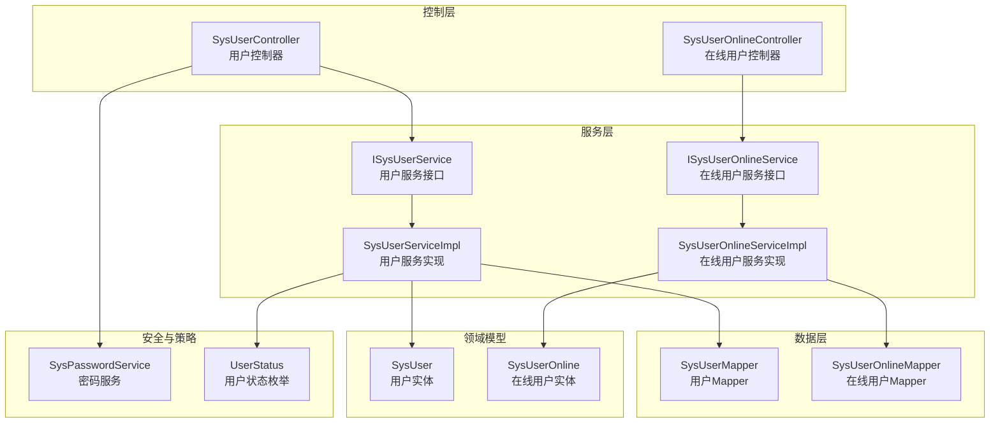
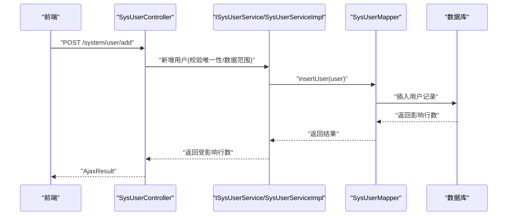
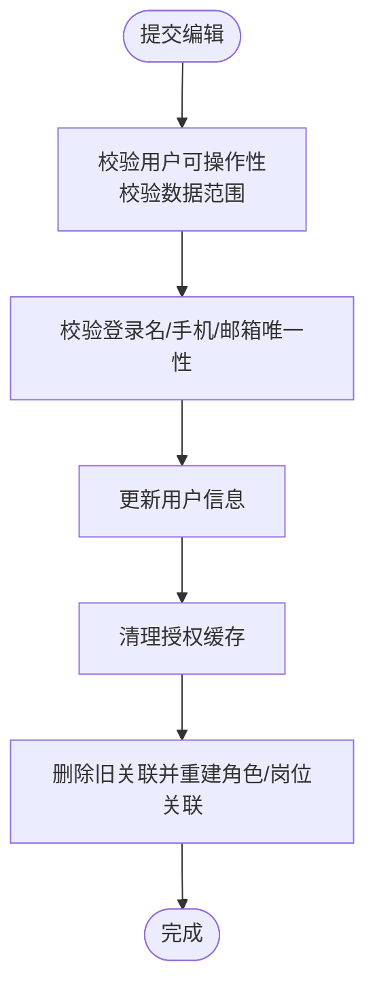
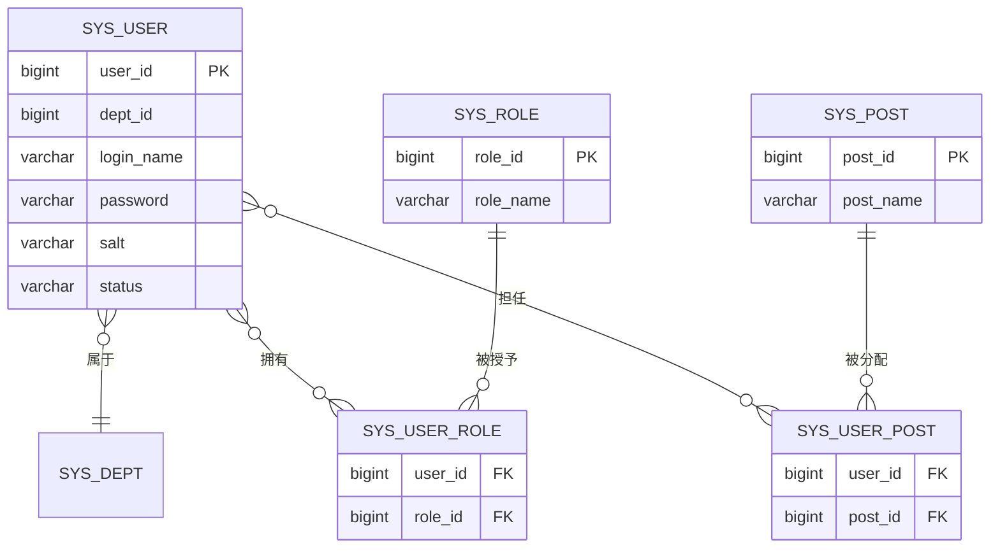
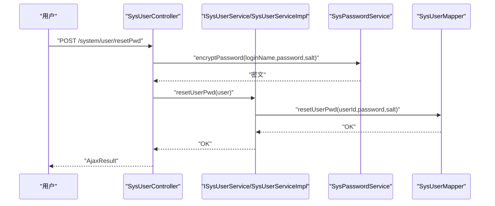
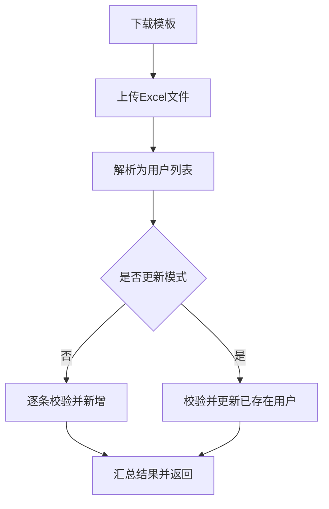
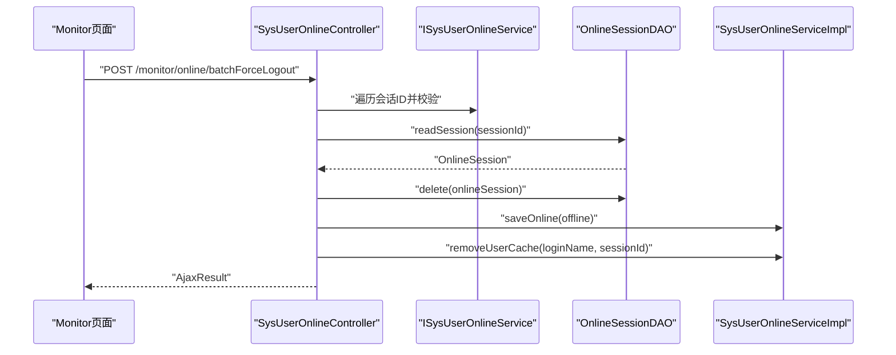
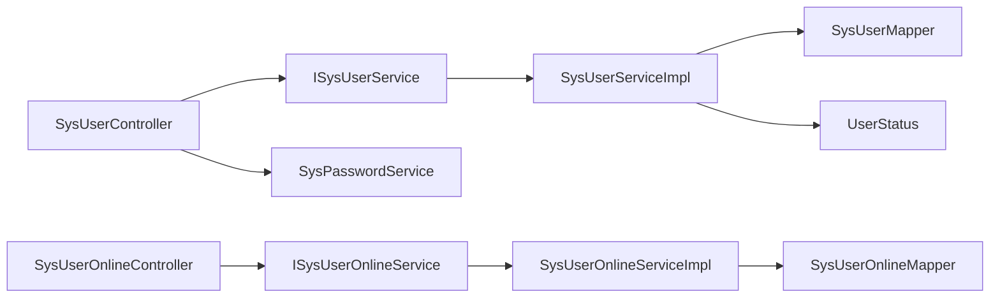

# 用户管理模块

<cite>
**本文引用的文件**
- [SysUserController.java](file://ruoyi-admin/src/main/java/com/ruoyi/web/controller/system/SysUserController.java)
- [SysUser.java](file://ruoyi-common/src/main/java/com/ruoyi/common/core/domain/entity/SysUser.java)
- [ISysUserService.java](file://ruoyi-system/src/main/java/com/ruoyi/system/service/ISysUserService.java)
- [SysUserServiceImpl.java](file://ruoyi-system/src/main/java/com/ruoyi/system/service/impl/SysUserServiceImpl.java)
- [SysUserMapper.java](file://ruoyi-system/src/main/java/com/ruoyi/system/mapper/SysUserMapper.java)
- [SysUserOnline.java](file://ruoyi-system/src/main/java/com/ruoyi/system/domain/SysUserOnline.java)
- [SysUserOnlineController.java](file://ruoyi-admin/src/main/java/com/ruoyi/web/controller/monitor/SysUserOnlineController.java)
- [SysUserOnlineServiceImpl.java](file://ruoyi-system/src/main/java/com/ruoyi/system/service/impl/SysUserOnlineServiceImpl.java)
- [SysPasswordService.java](file://ruoyi-framework/src/main/java/com/ruoyi/framework/shiro/service/SysPasswordService.java)
- [UserStatus.java](file://ruoyi-common/src/main/java/com/ruoyi/common/enums/UserStatus.java)
</cite>

## 目录
1. [简介](#简介)
2. [项目结构](#项目结构)
3. [核心组件](#核心组件)
4. [架构总览](#架构总览)
5. [详细组件分析](#详细组件分析)
6. [依赖分析](#依赖分析)
7. [性能考虑](#性能考虑)
8. [故障排查指南](#故障排查指南)
9. [结论](#结论)
10. [附录](#附录)

## 简介
本文件面向“用户管理模块”的功能与实现，覆盖用户CRUD、状态管理、密码安全机制（加密、策略、重置）、用户与角色/部门/岗位的关联关系与一致性保障、用户导入导出（含Excel模板）、以及会话管理、在线状态跟踪与审计能力。文档以代码为依据，结合架构图与流程图帮助读者快速理解与落地使用。

## 项目结构
用户管理模块由“控制层-服务层-数据层”三层构成，并与会话与审计子系统协同工作：
- 控制层：负责HTTP请求接入、参数校验、权限控制、调用服务层并返回结果
- 服务层：封装业务规则、事务控制、数据一致性、角色/岗位关联维护
- 数据层：提供用户主表及关联表的持久化接口
- 会话与审计：在线用户监控、强制下线、用户行为审计

图表来源
- [SysUserController.java:45-357](file://ruoyi-admin/src/main/java/com/ruoyi/web/controller/system/SysUserController.java#L45-L357)
- [SysUserOnlineController.java:30-90](file://ruoyi-admin/src/main/java/com/ruoyi/web/controller/monitor/SysUserOnlineController.java#L30-L90)
- [ISysUserService.java:13-235](file://ruoyi-system/src/main/java/com/ruoyi/system/service/ISysUserService.java#L13-L235)
- [SysUserServiceImpl.java:46-596](file://ruoyi-system/src/main/java/com/ruoyi/system/service/impl/SysUserServiceImpl.java#L46-L596)
- [SysUserMapper.java:13-165](file://ruoyi-system/src/main/java/com/ruoyi/system/mapper/SysUserMapper.java#L13-L165)
- [SysUserOnlineServiceImpl.java:24-141](file://ruoyi-system/src/main/java/com/ruoyi/system/service/impl/SysUserOnlineServiceImpl.java#L24-L141)
- [SysPasswordService.java:25-86](file://ruoyi-framework/src/main/java/com/ruoyi/framework/shiro/service/SysPasswordService.java#L25-L86)
- [UserStatus.java:8-31](file://ruoyi-common/src/main/java/com/ruoyi/common/enums/UserStatus.java#L8-L31)

章节来源
- [SysUserController.java:45-357](file://ruoyi-admin/src/main/java/com/ruoyi/web/controller/system/SysUserController.java#L45-L357)
- [SysUserServiceImpl.java:46-596](file://ruoyi-system/src/main/java/com/ruoyi/system/service/impl/SysUserServiceImpl.java#L46-L596)

## 核心组件
- 用户控制器：提供用户CRUD、导入导出、重置密码、授权角色、状态变更、树形部门加载等接口
- 用户服务：封装用户业务逻辑、事务、角色/岗位关联维护、唯一性校验、导入处理、状态变更
- 用户实体：承载用户字段、Excel注解、XSS防护、序列化策略
- 在线用户控制器：提供在线用户列表、批量强制下线
- 在线用户服务：提供在线用户查询、删除、强制下线、清理缓存
- 密码服务：密码加密、登录重试限制、密码匹配验证
- 用户状态枚举：统一用户状态编码与描述

章节来源
- [SysUserController.java:45-357](file://ruoyi-admin/src/main/java/com/ruoyi/web/controller/system/SysUserController.java#L45-L357)
- [ISysUserService.java:13-235](file://ruoyi-system/src/main/java/com/ruoyi/system/service/ISysUserService.java#L13-L235)
- [SysUser.java:22-382](file://ruoyi-common/src/main/java/com/ruoyi/common/core/domain/entity/SysUser.java#L22-L382)
- [SysUserOnlineController.java:30-90](file://ruoyi-admin/src/main/java/com/ruoyi/web/controller/monitor/SysUserOnlineController.java#L30-L90)
- [SysUserOnlineServiceImpl.java:24-141](file://ruoyi-system/src/main/java/com/ruoyi/system/service/impl/SysUserOnlineServiceImpl.java#L24-L141)
- [SysPasswordService.java:25-86](file://ruoyi-framework/src/main/java/com/ruoyi/framework/shiro/service/SysPasswordService.java#L25-L86)
- [UserStatus.java:8-31](file://ruoyi-common/src/main/java/com/ruoyi/common/enums/UserStatus.java#L8-L31)

## 架构总览
用户管理模块遵循MVC与分层架构，控制器仅做参数与权限处理，业务逻辑集中在服务层，数据访问通过MyBatis Mapper完成。密码安全由独立服务负责，会话与在线用户通过Shiro与自定义DAO协作。

图表来源
- [SysUserController.java:128-153](file://ruoyi-admin/src/main/java/com/ruoyi/web/controller/system/SysUserController.java#L128-L153)
- [SysUserServiceImpl.java:219-230](file://ruoyi-system/src/main/java/com/ruoyi/system/service/impl/SysUserServiceImpl.java#L219-L230)
- [SysUserMapper.java:139](file://ruoyi-system/src/main/java/com/ruoyi/system/mapper/SysUserMapper.java#L139)

## 详细组件分析

### 用户CRUD与状态管理
- 创建用户
  - 校验登录名/手机号/邮箱唯一性
  - 生成盐值并加密密码
  - 写入创建人、密码更新时间等字段
  - 自动建立用户与岗位、角色的关联
- 编辑用户
  - 校验目标用户可操作性与数据范围
  - 先删除旧的角色/岗位关联，再重建新关联
  - 清理授权缓存
- 删除用户
  - 支持单个与批量删除
  - 删除前校验不可删除当前登录用户
  - 同步清理角色/岗位关联
- 查询与分页
  - 提供列表、已分配、未分配三类查询
  - 支持按条件过滤与分页
- 状态管理
  - 支持启用/停用/删除状态切换
  - 使用统一状态枚举

图表来源
- [SysUserController.java:187-212](file://ruoyi-admin/src/main/java/com/ruoyi/web/controller/system/SysUserController.java#L187-L212)
- [SysUserServiceImpl.java:251-265](file://ruoyi-system/src/main/java/com/ruoyi/system/service/impl/SysUserServiceImpl.java#L251-L265)

章节来源
- [SysUserController.java:116-212](file://ruoyi-admin/src/main/java/com/ruoyi/web/controller/system/SysUserController.java#L116-L212)
- [SysUserServiceImpl.java:179-211](file://ruoyi-system/src/main/java/com/ruoyi/system/service/impl/SysUserServiceImpl.java#L179-L211)
- [ISysUserService.java:13-235](file://ruoyi-system/src/main/java/com/ruoyi/system/service/ISysUserService.java#L13-L235)

### 用户与角色/部门/岗位的关联与一致性
- 关联表
  - 用户-角色：SysUserRole
  - 用户-岗位：SysUserPost
- 一致性保障
  - 新增用户：自动写入岗位与角色关联
  - 编辑用户：先删除旧关联，再批量写入新关联
  - 删除用户：级联删除角色/岗位关联
- 数据范围控制
  - 新增/编辑时对部门与角色进行数据范围校验
  - 查询时通过注解与服务层校验确保只能访问授权范围内的用户

图表来源
- [SysUserServiceImpl.java:336-380](file://ruoyi-system/src/main/java/com/ruoyi/system/service/impl/SysUserServiceImpl.java#L336-L380)
- [SysUserServiceImpl.java:251-265](file://ruoyi-system/src/main/java/com/ruoyi/system/service/impl/SysUserServiceImpl.java#L251-L265)

章节来源
- [SysUserServiceImpl.java:336-380](file://ruoyi-system/src/main/java/com/ruoyi/system/service/impl/SysUserServiceImpl.java#L336-L380)
- [SysUserServiceImpl.java:251-265](file://ruoyi-system/src/main/java/com/ruoyi/system/service/impl/SysUserServiceImpl.java#L251-L265)

### 密码安全机制
- 密码加密
  - 使用登录名+明文密码+盐值进行哈希计算
  - 存储密文与盐值，不存储明文
- 密码策略
  - 登录失败重试上限可通过配置项设置
  - 成功登录后清除重试计数
- 密码重置
  - 重置时生成新盐值并重新加密
  - 若重置的是当前登录用户，刷新会话中的用户信息

图表来源
- [SysUserController.java:224-242](file://ruoyi-admin/src/main/java/com/ruoyi/web/controller/system/SysUserController.java#L224-L242)
- [SysPasswordService.java:81-84](file://ruoyi-framework/src/main/java/com/ruoyi/framework/shiro/service/SysPasswordService.java#L81-L84)
- [SysUserServiceImpl.java:324-328](file://ruoyi-system/src/main/java/com/ruoyi/system/service/impl/SysUserServiceImpl.java#L324-L328)

章节来源
- [SysPasswordService.java:25-86](file://ruoyi-framework/src/main/java/com/ruoyi/framework/shiro/service/SysPasswordService.java#L25-L86)
- [SysUserController.java:224-242](file://ruoyi-admin/src/main/java/com/ruoyi/web/controller/system/SysUserController.java#L224-L242)

### 用户导入导出与Excel模板
- 导出
  - 基于实体类上的Excel注解，自动导出用户列表
- 导入
  - 读取Excel为用户对象列表
  - 支持“已存在则更新”或“仅新增”
  - 校验必填字段与业务规则，失败抛出异常
  - 初始化密码采用系统配置键对应的初始密码进行加密
- 模板
  - 提供导入模板下载，包含所有受控字段与说明

图表来源
- [SysUserController.java:81-111](file://ruoyi-admin/src/main/java/com/ruoyi/web/controller/system/SysUserController.java#L81-L111)
- [SysUserServiceImpl.java:512-582](file://ruoyi-system/src/main/java/com/ruoyi/system/service/impl/SysUserServiceImpl.java#L512-L582)
- [SysUser.java:27-57](file://ruoyi-common/src/main/java/com/ruoyi/common/core/domain/entity/SysUser.java#L27-L57)

章节来源
- [SysUserController.java:81-111](file://ruoyi-admin/src/main/java/com/ruoyi/web/controller/system/SysUserController.java#L81-L111)
- [SysUserServiceImpl.java:512-582](file://ruoyi-system/src/main/java/com/ruoyi/system/service/impl/SysUserServiceImpl.java#L512-L582)
- [SysUser.java:27-57](file://ruoyi-common/src/main/java/com/ruoyi/common/core/domain/entity/SysUser.java#L27-L57)

### 会话管理、在线状态跟踪与强制下线
- 在线用户实体
  - 记录会话ID、登录名、IP、浏览器、操作系统、起始时间、最后访问时间、过期时间、状态等
- 在线用户控制器
  - 列表查询、批量强制下线
  - 强制下线时校验会话有效性、避免强退自身
- 在线用户服务
  - 保存/删除在线会话、按过期时间查询
  - 清理用户缓存中对应会话

图表来源
- [SysUserOnlineController.java:59-88](file://ruoyi-admin/src/main/java/com/ruoyi/web/controller/monitor/SysUserOnlineController.java#L59-L88)
- [SysUserOnlineServiceImpl.java:104-127](file://ruoyi-system/src/main/java/com/ruoyi/system/service/impl/SysUserOnlineServiceImpl.java#L104-L127)

章节来源
- [SysUserOnlineController.java:30-90](file://ruoyi-admin/src/main/java/com/ruoyi/web/controller/monitor/SysUserOnlineController.java#L30-L90)
- [SysUserOnlineServiceImpl.java:24-141](file://ruoyi-system/src/main/java/com/ruoyi/system/service/impl/SysUserOnlineServiceImpl.java#L24-L141)
- [SysUserOnline.java:15-205](file://ruoyi-system/src/main/java/com/ruoyi/system/domain/SysUserOnline.java#L15-L205)

## 依赖分析
- 控制器依赖服务接口与第三方工具（ExcelUtil、ShiroUtils）
- 服务实现依赖Mapper、配置服务、数据范围校验、Bean校验器
- 实体类依赖Excel注解与XSS防护
- 在线用户服务依赖EhCache与Shiro Session DAO
- 密码服务依赖Shiro CacheManager与Md5Hash

图表来源
- [SysUserController.java:49-62](file://ruoyi-admin/src/main/java/com/ruoyi/web/controller/system/SysUserController.java#L49-L62)
- [SysUserServiceImpl.java:50-69](file://ruoyi-system/src/main/java/com/ruoyi/system/service/impl/SysUserServiceImpl.java#L50-L69)
- [SysPasswordService.java:25-40](file://ruoyi-framework/src/main/java/com/ruoyi/framework/shiro/service/SysPasswordService.java#L25-L40)
- [SysUserOnlineController.java:36-41](file://ruoyi-admin/src/main/java/com/ruoyi/web/controller/monitor/SysUserOnlineController.java#L36-L41)
- [SysUserOnlineServiceImpl.java:27-28](file://ruoyi-system/src/main/java/com/ruoyi/system/service/impl/SysUserOnlineServiceImpl.java#L27-L28)

章节来源
- [SysUserController.java:49-62](file://ruoyi-admin/src/main/java/com/ruoyi/web/controller/system/SysUserController.java#L49-L62)
- [SysUserServiceImpl.java:50-69](file://ruoyi-system/src/main/java/com/ruoyi/system/service/impl/SysUserServiceImpl.java#L50-L69)
- [SysPasswordService.java:25-40](file://ruoyi-framework/src/main/java/com/ruoyi/framework/shiro/service/SysPasswordService.java#L25-L40)
- [SysUserOnlineController.java:36-41](file://ruoyi-admin/src/main/java/com/ruoyi/web/controller/monitor/SysUserOnlineController.java#L36-L41)
- [SysUserOnlineServiceImpl.java:27-28](file://ruoyi-system/src/main/java/com/ruoyi/system/service/impl/SysUserOnlineServiceImpl.java#L27-L28)

## 性能考虑
- 分页查询与数据范围注解配合，避免全表扫描
- 批量写入角色/岗位关联时使用批处理，减少SQL往返
- 导入流程中对每条记录进行校验与异常聚合，避免中途失败导致回滚成本高
- 在线用户查询与强制下线尽量使用会话ID直接定位，降低全表扫描

## 故障排查指南
- 导入失败
  - 检查Excel模板字段与实体注解是否一致
  - 查看失败汇总信息，定位具体行与原因
- 唯一性冲突
  - 登录名/手机号/邮箱重复时需调整或使用更新模式
- 权限不足
  - 数据范围校验失败会抛出无权限异常
- 密码重试过多
  - 登录失败次数超限会被限制登录，需等待或联系管理员

章节来源
- [SysUserServiceImpl.java:512-582](file://ruoyi-system/src/main/java/com/ruoyi/system/service/impl/SysUserServiceImpl.java#L512-L582)
- [SysUserServiceImpl.java:388-434](file://ruoyi-system/src/main/java/com/ruoyi/system/service/impl/SysUserServiceImpl.java#L388-L434)
- [SysPasswordService.java:42-69](file://ruoyi-framework/src/main/java/com/ruoyi/framework/shiro/service/SysPasswordService.java#L42-L69)

## 结论
用户管理模块在保证数据一致性与安全性的前提下，提供了完善的CRUD、导入导出、角色/岗位关联、在线会话与强制下线能力。通过清晰的分层设计与严格的校验策略，能够满足企业级用户管理需求。

## 附录
- Excel模板字段映射参考实体类注解
- 在线用户监控建议定期清理过期会话
- 密码策略与重试限制可根据业务场景调整