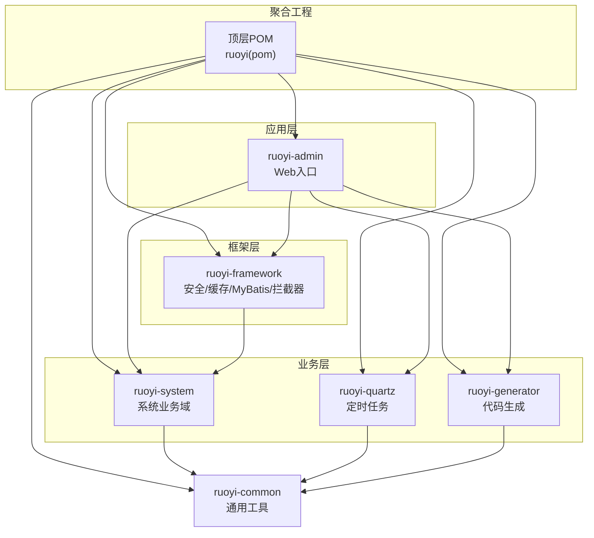
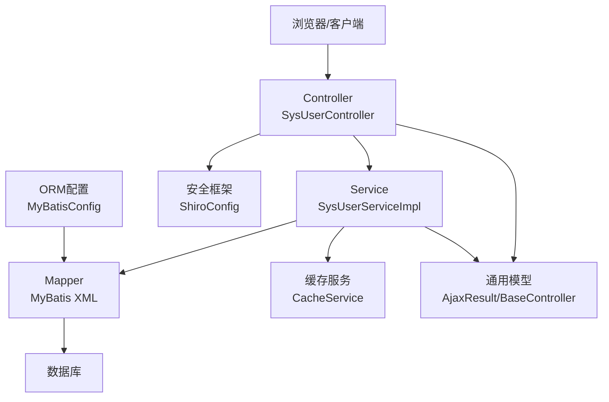
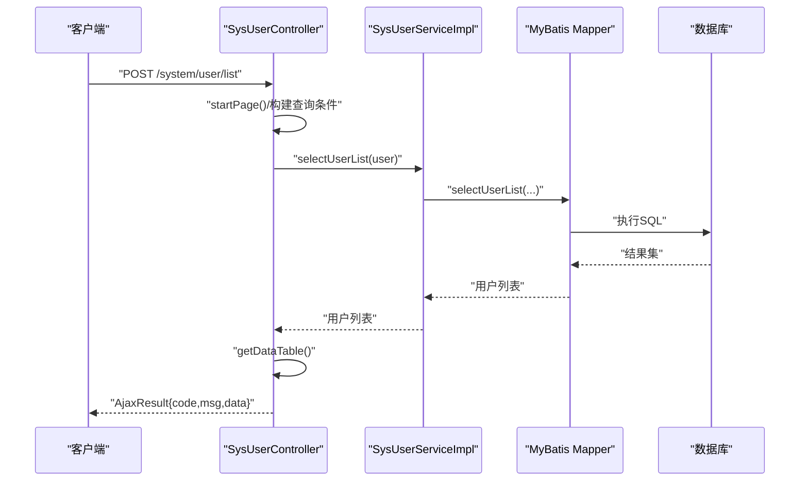
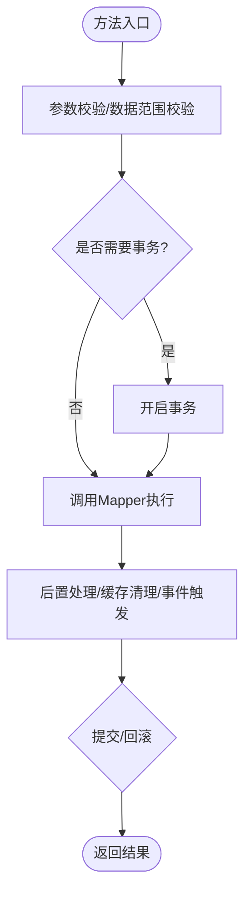
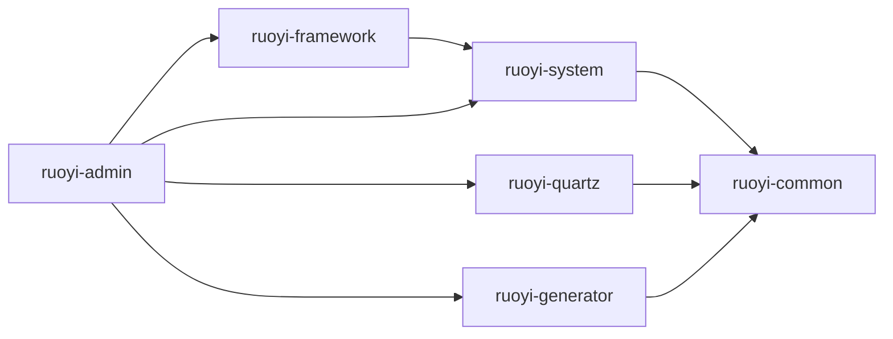

# 整体架构设计

<cite>
**本文档引用的文件**
- [pom.xml](file://pom.xml)
- [RuoYiApplication.java](file://ruoyi-admin/src/main/java/com/ruoyi/RuoYiApplication.java)
- [application.yml](file://ruoyi-admin/src/main/resources/application.yml)
- [BaseController.java](file://ruoyi-common/src/main/java/com/ruoyi/common/core/controller/BaseController.java)
- [AjaxResult.java](file://ruoyi-common/src/main/java/com/ruoyi/common/core/domain/AjaxResult.java)
- [SysUserController.java](file://ruoyi-admin/src/main/java/com/ruoyi/web/controller/system/SysUserController.java)
- [SysUserServiceImpl.java](file://ruoyi-system/src/main/java/com/ruoyi/system/service/impl/SysUserServiceImpl.java)
- [CacheService.java](file://ruoyi-framework/src/main/java/com/ruoyi/framework/web/service/CacheService.java)
- [ShiroConfig.java](file://ruoyi-framework/src/main/java/com/ruoyi/framework/config/ShiroConfig.java)
- [MyBatisConfig.java](file://ruoyi-framework/src/main/java/com/ruoyi/framework/config/MyBatisConfig.java)
- [ruoyi-admin/pom.xml](file://ruoyi-admin/pom.xml)
- [ruoyi-framework/pom.xml](file://ruoyi-framework/pom.xml)
- [ruoyi-system/pom.xml](file://ruoyi-system/pom.xml)
- [ruoyi-quartz/pom.xml](file://ruoyi-quartz/pom.xml)
- [ruoyi-generator/pom.xml](file://ruoyi-generator/pom.xml)
- [ruoyi-common/pom.xml](file://ruoyi-common/pom.xml)
</cite>

## 目录
1. [引言](#引言)
2. [项目结构](#项目结构)
3. [核心组件](#核心组件)
4. [架构总览](#架构总览)
5. [详细组件分析](#详细组件分析)
6. [依赖分析](#依赖分析)
7. [性能考虑](#性能考虑)
8. [故障排查指南](#故障排查指南)
9. [结论](#结论)
10. [附录](#附录)

## 引言
本文件面向RuoYi管理系统的整体架构设计，围绕基于Spring Boot的三层架构（表现层Controller、业务层Service、数据访问层Mapper）进行系统化说明，并结合Maven多模块设计理念，明确ruoyi-admin、ruoyi-framework、ruoyi-system、ruoyi-quartz、ruoyi-generator、ruoyi-common六大模块的职责边界、依赖关系与交互流程。文档还提供系统边界定义、组件交互流程图、数据流向分析，以及架构决策的技术考量与设计原则，帮助开发者与运维人员快速理解并高效扩展系统。

## 项目结构
RuoYi采用Maven聚合工程组织，顶层POM统一管理版本与依赖，子模块按职责拆分，形成清晰的分层与复用：

- 顶层聚合工程：集中管理版本、依赖与模块清单
- 子模块划分：
  - ruoyi-admin：Web应用入口，承载前端界面与REST接口
  - ruoyi-framework：框架核心，提供安全、缓存、MyBatis、拦截器等基础设施
  - ruoyi-system：系统业务域，覆盖用户、角色、菜单、字典、配置等核心领域
  - ruoyi-quartz：定时任务模块，提供作业调度能力
  - ruoyi-generator：代码生成模块，基于Velocity模板生成前后端代码
  - ruoyi-common：通用工具与公共常量、异常、实体模型等

图表来源
- [pom.xml:235-242](file://pom.xml#L235-L242)
- [ruoyi-admin/pom.xml:18-63](file://ruoyi-admin/pom.xml#L18-L63)
- [ruoyi-framework/pom.xml:18-74](file://ruoyi-framework/pom.xml#L18-L74)
- [ruoyi-system/pom.xml:18-26](file://ruoyi-system/pom.xml#L18-L26)
- [ruoyi-quartz/pom.xml:18-38](file://ruoyi-quartz/pom.xml#L18-L38)
- [ruoyi-generator/pom.xml:18-37](file://ruoyi-generator/pom.xml#L18-L37)
- [ruoyi-common/pom.xml:18-98](file://ruoyi-common/pom.xml#L18-L98)

章节来源
- [pom.xml:235-242](file://pom.xml#L235-L242)
- [ruoyi-admin/pom.xml:18-63](file://ruoyi-admin/pom.xml#L18-L63)
- [ruoyi-framework/pom.xml:18-74](file://ruoyi-framework/pom.xml#L18-L74)
- [ruoyi-system/pom.xml:18-26](file://ruoyi-system/pom.xml#L18-L26)
- [ruoyi-quartz/pom.xml:18-38](file://ruoyi-quartz/pom.xml#L18-L38)
- [ruoyi-generator/pom.xml:18-37](file://ruoyi-generator/pom.xml#L18-L37)
- [ruoyi-common/pom.xml:18-98](file://ruoyi-common/pom.xml#L18-L98)

## 核心组件
- 表现层（Controller）
  - 统一由ruoyi-admin提供Web接口与视图模板，继承通用BaseController以获得分页、权限、会话等能力
  - 典型控制器：SysUserController负责用户管理的CRUD与导出导入等
- 业务层（Service）
  - ruoyi-system封装系统业务逻辑，如用户、角色、菜单、字典等，提供事务与数据校验
  - 通过Mapper完成持久化，内部可调用框架提供的缓存与异步管理能力
- 数据访问层（Mapper）
  - MyBatis映射器位于各模块resources下，配合MyBatisConfig统一配置
  - 通过ruoyi-framework的动态数据源与缓存策略提升性能与可维护性
- 框架支撑（ruoyi-framework）
  - 安全：ShiroConfig提供认证、授权、会话、记住我、验证码、CSRF等
  - 缓存：CacheService封装缓存操作
  - ORM：MyBatisConfig支持包扫描与XML映射
- 通用工具（ruoyi-common）
  - AjaxResult统一响应结构
  - BaseController提供分页、请求上下文、权限上下文等通用能力
  - 常量、枚举、工具类、异常体系等

章节来源
- [BaseController.java:33-230](file://ruoyi-common/src/main/java/com/ruoyi/common/core/controller/BaseController.java#L33-L230)
- [AjaxResult.java:12-228](file://ruoyi-common/src/main/java/com/ruoyi/common/core/domain/AjaxResult.java#L12-L228)
- [SysUserController.java:43-357](file://ruoyi-admin/src/main/java/com/ruoyi/web/controller/system/SysUserController.java#L43-L357)
- [SysUserServiceImpl.java:45-596](file://ruoyi-system/src/main/java/com/ruoyi/system/service/impl/SysUserServiceImpl.java#L45-L596)
- [CacheService.java:15-85](file://ruoyi-framework/src/main/java/com/ruoyi/framework/web/service/CacheService.java#L15-L85)
- [ShiroConfig.java:49-449](file://ruoyi-framework/src/main/java/com/ruoyi/framework/config/ShiroConfig.java#L49-L449)
- [MyBatisConfig.java:32-132](file://ruoyi-framework/src/main/java/com/ruoyi/framework/config/MyBatisConfig.java#L32-L132)

## 架构总览
RuoYi采用“表现层-业务层-数据访问层”的经典三层架构，结合Maven多模块实现高内聚低耦合。系统边界清晰：admin作为对外入口，framework提供横切能力，system承载核心业务，quartz与generator作为可选扩展模块，common沉淀通用能力。

图表来源
- [SysUserController.java:43-357](file://ruoyi-admin/src/main/java/com/ruoyi/web/controller/system/SysUserController.java#L43-L357)
- [SysUserServiceImpl.java:45-596](file://ruoyi-system/src/main/java/com/ruoyi/system/service/impl/SysUserServiceImpl.java#L45-L596)
- [CacheService.java:15-85](file://ruoyi-framework/src/main/java/com/ruoyi/framework/web/service/CacheService.java#L15-L85)
- [ShiroConfig.java:49-449](file://ruoyi-framework/src/main/java/com/ruoyi/framework/config/ShiroConfig.java#L49-L449)
- [MyBatisConfig.java:32-132](file://ruoyi-framework/src/main/java/com/ruoyi/framework/config/MyBatisConfig.java#L32-L132)
- [AjaxResult.java:12-228](file://ruoyi-common/src/main/java/com/ruoyi/common/core/domain/AjaxResult.java#L12-L228)
- [BaseController.java:33-230](file://ruoyi-common/src/main/java/com/ruoyi/common/core/controller/BaseController.java#L33-L230)

## 详细组件分析

### 控制器层（Controller）
- 职责
  - 接收HTTP请求，参数绑定与校验，调用业务层，封装AjaxResult响应
  - 集成权限注解（如@RequiresPermissions），统一异常处理
- 关键点
  - 继承BaseController，自动注入分页、排序、会话、权限上下文
  - 与ShiroConfig的过滤链协作，确保登录态与权限校验
- 示例
  - SysUserController提供用户列表、导入导出、新增编辑、重置密码、授权角色、状态变更等接口

图表来源
- [SysUserController.java:72-79](file://ruoyi-admin/src/main/java/com/ruoyi/web/controller/system/SysUserController.java#L72-L79)
- [SysUserServiceImpl.java:80-85](file://ruoyi-system/src/main/java/com/ruoyi/system/service/impl/SysUserServiceImpl.java#L80-L85)
- [BaseController.java:110-118](file://ruoyi-common/src/main/java/com/ruoyi/common/core/controller/BaseController.java#L110-L118)
- [AjaxResult.java:12-228](file://ruoyi-common/src/main/java/com/ruoyi/common/core/domain/AjaxResult.java#L12-L228)

章节来源
- [SysUserController.java:43-357](file://ruoyi-admin/src/main/java/com/ruoyi/web/controller/system/SysUserController.java#L43-L357)
- [BaseController.java:33-230](file://ruoyi-common/src/main/java/com/ruoyi/common/core/controller/BaseController.java#L33-L230)
- [AjaxResult.java:12-228](file://ruoyi-common/src/main/java/com/ruoyi/common/core/domain/AjaxResult.java#L12-L228)

### 业务层（Service）
- 职责
  - 组织业务流程、事务控制、数据校验与装配
  - 调用Mapper完成持久化，必要时联动其他Service或框架能力
- 关键点
  - 事务注解（@Transactional）保证一致性
  - 数据范围注解（@DataScope）与权限校验保障数据安全
  - 与ISysConfigService、ISysDeptService等协作
- 示例
  - SysUserServiceImpl实现用户增删改查、导入导出、角色与岗位授权、状态变更等

图表来源
- [SysUserServiceImpl.java:179-211](file://ruoyi-system/src/main/java/com/ruoyi/system/service/impl/SysUserServiceImpl.java#L179-L211)
- [SysUserServiceImpl.java:220-230](file://ruoyi-system/src/main/java/com/ruoyi/system/service/impl/SysUserServiceImpl.java#L220-L230)
- [SysUserServiceImpl.java:310-317](file://ruoyi-system/src/main/java/com/ruoyi/system/service/impl/SysUserServiceImpl.java#L310-L317)

章节来源
- [SysUserServiceImpl.java:45-596](file://ruoyi-system/src/main/java/com/ruoyi/system/service/impl/SysUserServiceImpl.java#L45-L596)

### 数据访问层（Mapper）
- 职责
  - MyBatis映射器负责SQL执行与结果映射
  - 通过MyBatisConfig统一配置别名包与映射文件位置
- 关键点
  - 映射文件位于各模块resources下，遵循模块内聚
  - 支持分页插件PageHelper，结合BaseController的分页工具

章节来源
- [MyBatisConfig.java:32-132](file://ruoyi-framework/src/main/java/com/ruoyi/framework/config/MyBatisConfig.java#L32-L132)
- [application.yml:71-85](file://ruoyi-admin/src/main/resources/application.yml#L71-L85)

### 安全与会话（Shiro）
- 职责
  - 提供认证、授权、会话管理、记住我、验证码、CSRF防护等
  - 通过自定义Realm、SessionDAO、过滤器链实现在线会话与踢人控制
- 关键点
  - 过滤器链定义了匿名访问、验证码、CSRF、在线会话同步、踢人等策略
  - 退出过滤器记录登出日志并清理缓存

章节来源
- [ShiroConfig.java:49-449](file://ruoyi-framework/src/main/java/com/ruoyi/framework/config/ShiroConfig.java#L49-L449)
- [LogoutFilter.java:24-91](file://ruoyi-framework/src/main/java/com/ruoyi/framework/shiro/web/filter/LogoutFilter.java#L24-L91)

### 缓存服务（CacheService）
- 职责
  - 提供缓存名称枚举、键名查询、值读取、按名称/键清理缓存
- 关键点
  - 与Ehcache集成，避免缓存文件常驻导致热部署问题

章节来源
- [CacheService.java:15-85](file://ruoyi-framework/src/main/java/com/ruoyi/framework/web/service/CacheService.java#L15-L85)

### 通用模型与控制器基类
- AjaxResult
  - 统一响应结构（code/msg/data），便于前端处理
- BaseController
  - 提供分页、排序、会话、权限上下文、重定向等通用能力

章节来源
- [AjaxResult.java:12-228](file://ruoyi-common/src/main/java/com/ruoyi/common/core/domain/AjaxResult.java#L12-L228)
- [BaseController.java:33-230](file://ruoyi-common/src/main/java/com/ruoyi/common/core/controller/BaseController.java#L33-L230)

## 依赖分析
- 模块依赖关系
  - ruoyi-admin依赖ruoyi-framework、ruoyi-quartz、ruoyi-generator
  - ruoyi-framework依赖ruoyi-system
  - ruoyi-system依赖ruoyi-common
  - ruoyi-quartz依赖ruoyi-common
  - ruoyi-generator依赖ruoyi-common与Druid
- 技术栈与版本管理
  - Spring Boot 2.5.15、Shiro 1.13.0、MyBatis、PageHelper、Swagger、Quartz、Velocity等
  - 顶层POM集中管理版本，避免冲突

图表来源
- [pom.xml:40-233](file://pom.xml#L40-L233)
- [ruoyi-admin/pom.xml:45-61](file://ruoyi-admin/pom.xml#L45-L61)
- [ruoyi-framework/pom.xml:68-72](file://ruoyi-framework/pom.xml#L68-L72)
- [ruoyi-system/pom.xml:18-26](file://ruoyi-system/pom.xml#L18-L26)
- [ruoyi-quartz/pom.xml:18-38](file://ruoyi-quartz/pom.xml#L18-L38)
- [ruoyi-generator/pom.xml:18-37](file://ruoyi-generator/pom.xml#L18-L37)
- [ruoyi-common/pom.xml:18-98](file://ruoyi-common/pom.xml#L18-L98)

章节来源
- [pom.xml:40-233](file://pom.xml#L40-L233)
- [ruoyi-admin/pom.xml:45-61](file://ruoyi-admin/pom.xml#L45-L61)
- [ruoyi-framework/pom.xml:68-72](file://ruoyi-framework/pom.xml#L68-L72)
- [ruoyi-system/pom.xml:18-26](file://ruoyi-system/pom.xml#L18-L26)
- [ruoyi-quartz/pom.xml:18-38](file://ruoyi-quartz/pom.xml#L18-L38)
- [ruoyi-generator/pom.xml:18-37](file://ruoyi-generator/pom.xml#L18-L37)
- [ruoyi-common/pom.xml:18-98](file://ruoyi-common/pom.xml#L18-L98)

## 性能考虑
- 分页与排序
  - BaseController内置分页与SQL防注入排序，减少重复代码与风险
- 缓存策略
  - Ehcache与Shiro缓存结合，降低数据库压力；CacheService提供统一缓存操作
- ORM与SQL优化
  - MyBatisConfig支持包扫描与XML映射，建议在Mapper中使用参数化查询与合理索引
- 并发与会话
  - Shiro在线会话与同步过滤器，结合踢人策略与会话超时配置，提升安全性与稳定性
- 静态资源与打包
  - admin模块支持War/War打包子模块，便于部署；可按需启用YUI压缩插件

章节来源
- [BaseController.java:56-82](file://ruoyi-common/src/main/java/com/ruoyi/common/core/controller/BaseController.java#L56-L82)
- [CacheService.java:15-85](file://ruoyi-framework/src/main/java/com/ruoyi/framework/web/service/CacheService.java#L15-L85)
- [MyBatisConfig.java:32-132](file://ruoyi-framework/src/main/java/com/ruoyi/framework/config/MyBatisConfig.java#L32-L132)
- [ShiroConfig.java:231-252](file://ruoyi-framework/src/main/java/com/ruoyi/framework/config/ShiroConfig.java#L231-L252)
- [ruoyi-admin/pom.xml:65-126](file://ruoyi-admin/pom.xml#L65-L126)

## 故障排查指南
- 启动与入口
  - RuoYiApplication排除数据源自动装配，避免未配置数据源导致启动失败
- 安全与权限
  - ShiroConfig定义了过滤器链与登录/未授权地址，确认URL白名单与验证码配置
  - 退出过滤器记录登出日志并清理缓存，排查登出后仍可访问问题
- 响应结构
  - AjaxResult统一返回结构，前端根据code判断成功/失败，便于统一处理
- 配置文件
  - application.yml集中配置服务端口、MyBatis、PageHelper、Shiro、XSS/CSRF等，逐项核对

章节来源
- [RuoYiApplication.java:12-28](file://ruoyi-admin/src/main/java/com/ruoyi/RuoYiApplication.java#L12-L28)
- [ShiroConfig.java:296-346](file://ruoyi-framework/src/main/java/com/ruoyi/framework/config/ShiroConfig.java#L296-L346)
- [LogoutFilter.java:43-75](file://ruoyi-framework/src/main/java/com/ruoyi/framework/shiro/web/filter/LogoutFilter.java#L43-L75)
- [AjaxResult.java:12-228](file://ruoyi-common/src/main/java/com/ruoyi/common/core/domain/AjaxResult.java#L12-L228)
- [application.yml:16-154](file://ruoyi-admin/src/main/resources/application.yml#L16-L154)

## 结论
RuoYi通过Maven多模块与三层架构实现了清晰的职责分离与高内聚低耦合。admin提供统一入口，framework沉淀横切能力，system承载核心业务，quartz与generator作为扩展模块，common提供通用能力。结合Shiro安全、MyBatis ORM、Ehcache缓存与PageHelper分页，系统具备良好的可维护性、可扩展性与安全性。建议在后续演进中持续完善监控与可观测性、引入更细粒度的领域建模与测试策略。

## 附录
- 系统边界
  - 外部边界：浏览器/客户端
  - 内部边界：admin、framework、system、quartz、generator、common模块
- 设计原则
  - 分层清晰、职责单一、依赖倒置、横切关注点集中、可测试性优先
- 最佳实践
  - 控制器只做编排与校验，业务逻辑下沉至Service
  - Mapper仅做数据映射，复杂查询通过Service封装
  - 统一响应结构与异常处理，增强前端体验
  - 合理使用缓存与分页，避免N+1与全表扫描