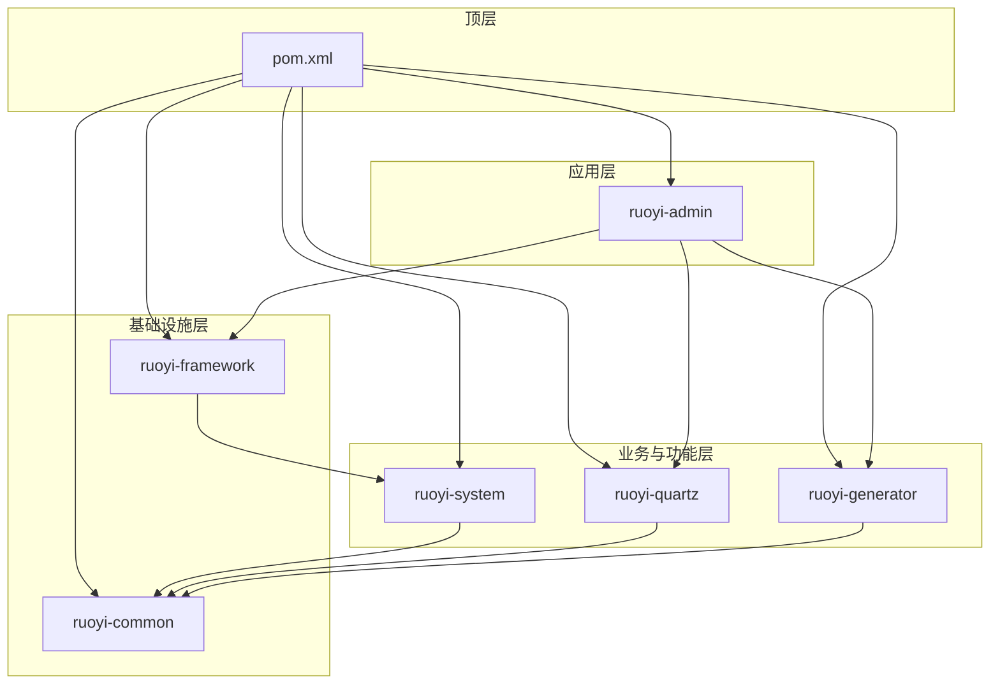
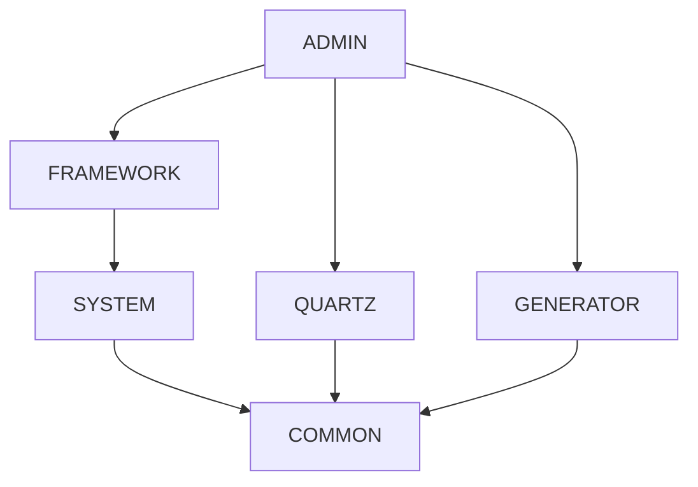
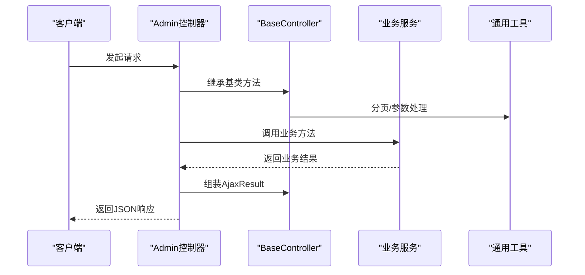
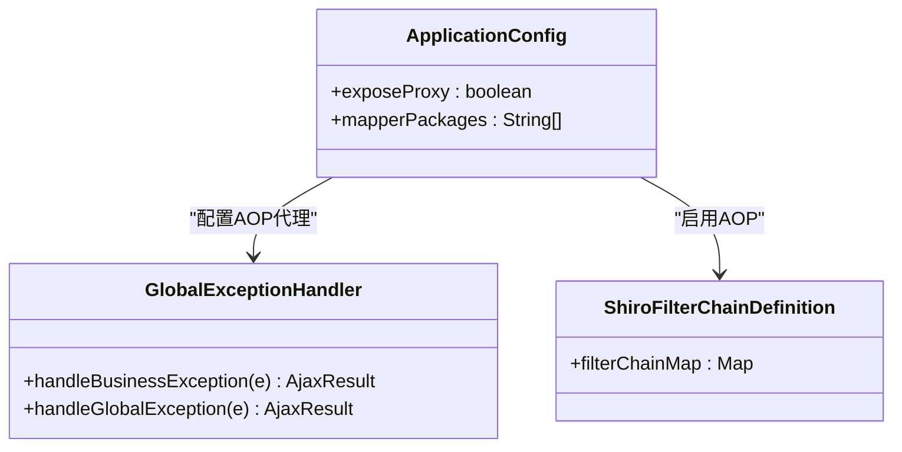
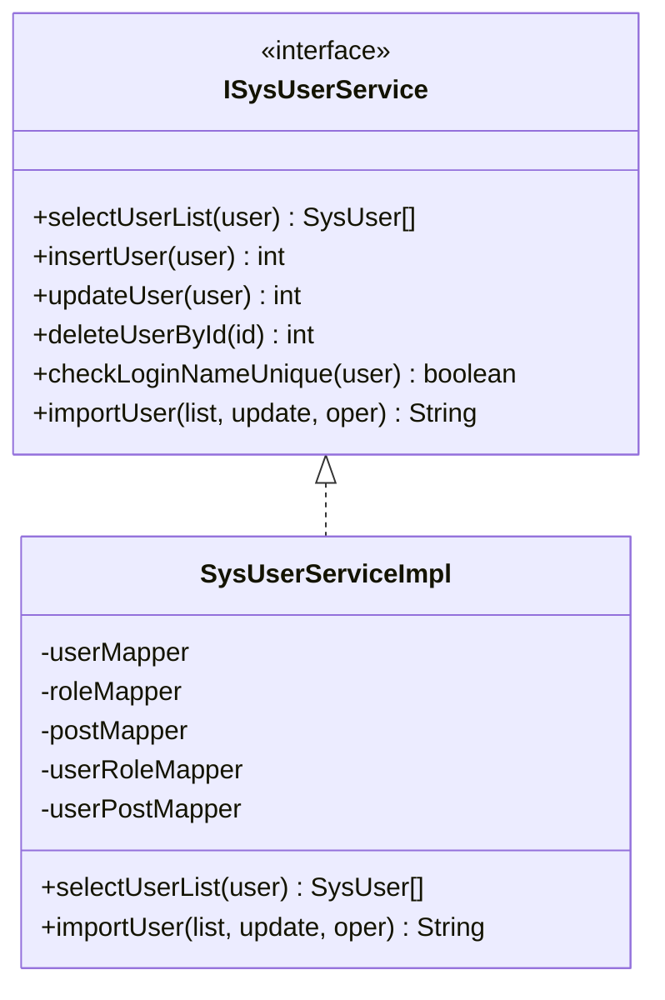
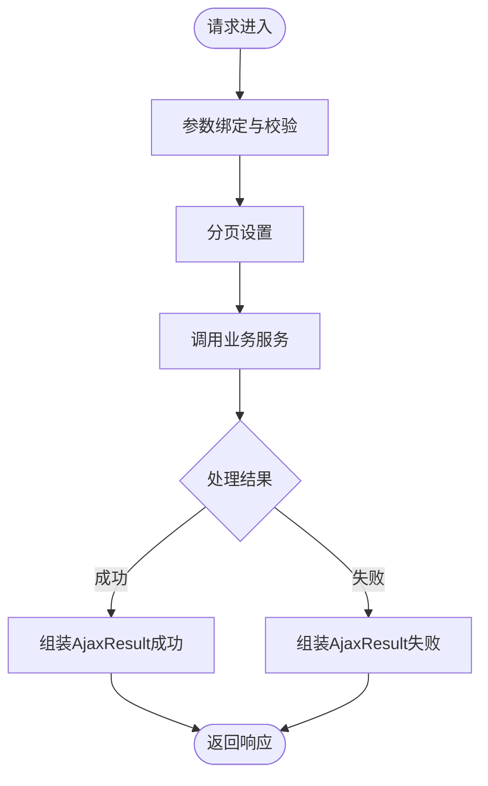
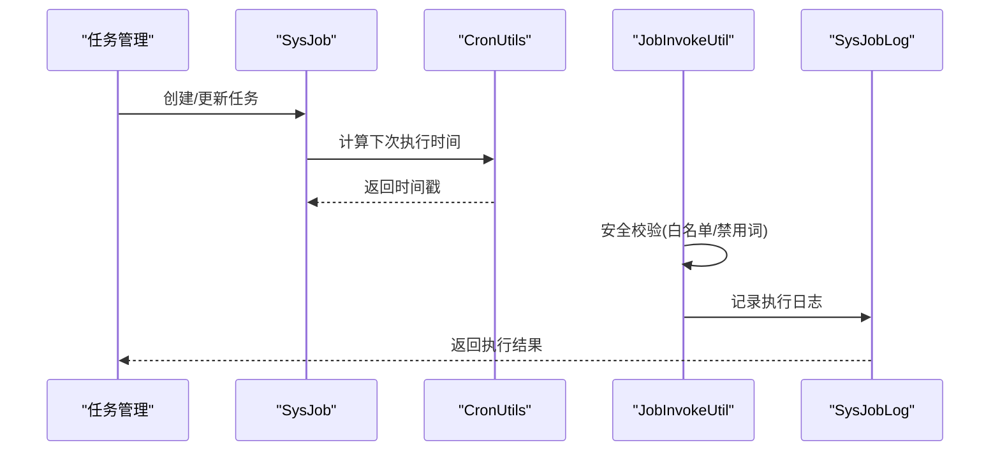
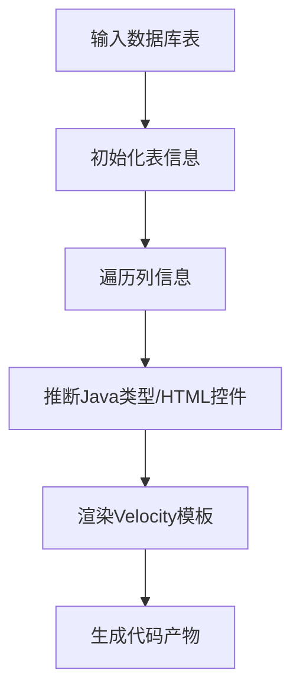
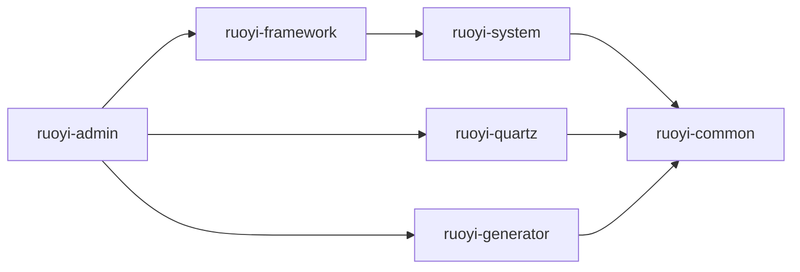

# 模块设计规范

<cite>
**本文档引用的文件**
- [pom.xml](file://pom.xml)
- [ruoyi-admin/pom.xml](file://ruoyi-admin/pom.xml)
- [ruoyi-framework/pom.xml](file://ruoyi-framework/pom.xml)
- [ruoyi-system/pom.xml](file://ruoyi-system/pom.xml)
- [ruoyi-common/pom.xml](file://ruoyi-common/pom.xml)
- [ruoyi-quartz/pom.xml](file://ruoyi-quartz/pom.xml)
- [ruoyi-generator/pom.xml](file://ruoyi-generator/pom.xml)
- [RuoYiApplication.java](file://ruoyi-admin/src/main/java/com/ruoyi/RuoYiApplication.java)
- [ApplicationConfig.java](file://ruoyi-framework/src/main/java/com/ruoyi/framework/config/ApplicationConfig.java)
- [SysUserServiceImpl.java](file://ruoyi-system/src/main/java/com/ruoyi/system/service/impl/SysUserServiceImpl.java)
- [ISysUserService.java](file://ruoyi-system/src/main/java/com/ruoyi/system/service/ISysUserService.java)
- [BaseController.java](file://ruoyi-common/src/main/java/com/ruoyi/common/core/controller/BaseController.java)
- [Constants.java](file://ruoyi-common/src/main/java/com/ruoyi/common/constant/Constants.java)
- [GenUtils.java](file://ruoyi-generator/src/main/java/com/ruoyi/generator/util/GenUtils.java)
- [GenTable.java](file://ruoyi-generator/src/main/java/com/ruoyi/generator/domain/GenTable.java)
- [SysJob.java](file://ruoyi-quartz/src/main/java/com/ruoyi/quartz/domain/SysJob.java)
- [ScheduleConfig.java](file://ruoyi-quartz/src/main/java/com/ruoyi/quartz/config/ScheduleConfig.java)
- [application.yml](file://ruoyi-admin/src/main/resources/application.yml)
</cite>

## 目录
1. [引言](#引言)
2. [项目结构](#项目结构)
3. [核心模块](#核心模块)
4. [架构概览](#架构概览)
5. [详细组件分析](#详细组件分析)
6. [依赖分析](#依赖分析)
7. [性能考虑](#性能考虑)
8. [故障排除指南](#故障排除指南)
9. [结论](#结论)
10. [附录](#附录)

## 引言
本规范文档面向RuoYi管理系统的模块化设计，明确六大核心模块的职责边界、设计原则、接口约定、数据传递规范以及扩展指南。目标是帮助开发者在保持模块高内聚、低耦合的前提下，快速理解并高效扩展系统功能。

## 项目结构
RuoYi采用多模块Maven工程组织，顶层POM统一管理版本与依赖，各子模块按功能域划分，形成清晰的层次结构：
- ruoyi-admin：Web应用入口，负责前端界面与控制器
- ruoyi-framework：安全框架、拦截器、配置管理等基础设施
- ruoyi-system：系统业务逻辑（用户、角色、菜单、字典等）
- ruoyi-common：通用工具类与公共组件
- ruoyi-quartz：定时任务调度
- ruoyi-generator：代码生成功能

**图表来源**
- [pom.xml:235-242](file://pom.xml#L235-L242)
- [ruoyi-admin/pom.xml:45-61](file://ruoyi-admin/pom.xml#L45-L61)
- [ruoyi-framework/pom.xml:68-72](file://ruoyi-framework/pom.xml#L68-L72)
- [ruoyi-system/pom.xml:18-24](file://ruoyi-system/pom.xml#L18-L24)
- [ruoyi-quartz/pom.xml:18-36](file://ruoyi-quartz/pom.xml#L18-L36)
- [ruoyi-generator/pom.xml:18-30](file://ruoyi-generator/pom.xml#L18-L30)

**章节来源**
- [pom.xml:235-242](file://pom.xml#L235-L242)
- [ruoyi-admin/pom.xml:18-63](file://ruoyi-admin/pom.xml#L18-L63)
- [ruoyi-framework/pom.xml:18-74](file://ruoyi-framework/pom.xml#L18-L74)
- [ruoyi-system/pom.xml:18-27](file://ruoyi-system/pom.xml#L18-L27)
- [ruoyi-common/pom.xml:18-98](file://ruoyi-common/pom.xml#L18-L98)
- [ruoyi-quartz/pom.xml:18-38](file://ruoyi-quartz/pom.xml#L18-L38)
- [ruoyi-generator/pom.xml:18-37](file://ruoyi-generator/pom.xml#L18-L37)

## 核心模块
本节概述六大模块的设计原则与职责边界：

- ruoyi-admin
  - 设计原则：薄控制器、厚服务；集中式静态资源与模板渲染；对外提供REST接口与页面视图
  - 职责边界：应用启动入口、Web控制器、模板引擎配置、Swagger文档、静态资源托管
  - 关键实现：Spring Boot启动类、Thymeleaf模板、Swagger配置、MyBatis Mapper扫描

- ruoyi-framework
  - 设计原则：横切关注点集中化（安全、日志、数据源切换、异步）
  - 职责边界：Shiro安全框架、拦截器链、Druid监控、MyBatis配置、全局异常处理
  - 关键实现：Shiro Realm、过滤器链、在线会话管理、全局异常处理器

- ruoyi-system
  - 设计原则：业务领域建模，清晰的接口与实现分离
  - 职责边界：用户、角色、菜单、字典、部门等核心业务逻辑
  - 关键实现：用户服务接口与实现、数据权限注解、事务控制

- ruoyi-common
  - 设计原则：复用优先，提供稳定的基础能力
  - 职责边界：通用工具类、常量定义、分页封装、Ajax响应模型、XSS/CSRF防护
  - 关键实现：BaseController、AjaxResult、分页工具、Shiro工具、校验工具

- ruoyi-quartz
  - 设计原则：任务调度与安全管理分离，白名单机制
  - 职责边界：定时任务管理、任务执行、日志记录、调度配置
  - 关键实现：任务实体、调度工具、Cron表达式解析、安全执行

- ruoyi-generator
  - 设计原则：模板驱动，可配置的代码生成策略
  - 职责边界：数据库表到代码的映射、模板渲染、生成产物输出
  - 关键实现：GenTable/GenTableColumn、Velocity模板、生成工具类

**章节来源**
- [RuoYiApplication.java:12-28](file://ruoyi-admin/src/main/java/com/ruoyi/RuoYiApplication.java#L12-L28)
- [ApplicationConfig.java:12-17](file://ruoyi-framework/src/main/java/com/ruoyi/framework/config/ApplicationConfig.java#L12-L17)
- [SysUserServiceImpl.java:40-46](file://ruoyi-system/src/main/java/com/ruoyi/system/service/impl/SysUserServiceImpl.java#L40-L46)
- [BaseController.java:33-229](file://ruoyi-common/src/main/java/com/ruoyi/common/core/controller/BaseController.java#L33-L229)
- [Constants.java:10-153](file://ruoyi-common/src/main/java/com/ruoyi/common/constant/Constants.java#L10-L153)
- [GenUtils.java:16-252](file://ruoyi-generator/src/main/java/com/ruoyi/generator/util/GenUtils.java#L16-L252)
- [GenTable.java:16-397](file://ruoyi-generator/src/main/java/com/ruoyi/generator/domain/GenTable.java#L16-L397)
- [SysJob.java:20-168](file://ruoyi-quartz/src/main/java/com/ruoyi/quartz/domain/SysJob.java#L20-L168)
- [ScheduleConfig.java:14-57](file://ruoyi-quartz/src/main/java/com/ruoyi/quartz/config/ScheduleConfig.java#L14-L57)

## 架构概览
系统采用分层架构，模块间通过清晰的依赖关系协作：
- ruoyi-admin依赖ruoyi-framework、ruoyi-quartz、ruoyi-generator
- ruoyi-framework依赖ruoyi-system
- ruoyi-system依赖ruoyi-common
- ruoyi-quartz依赖ruoyi-common
- ruoyi-generator依赖ruoyi-common

**图表来源**
- [ruoyi-admin/pom.xml:45-61](file://ruoyi-admin/pom.xml#L45-L61)
- [ruoyi-framework/pom.xml:68-72](file://ruoyi-framework/pom.xml#L68-L72)
- [ruoyi-system/pom.xml:18-24](file://ruoyi-system/pom.xml#L18-L24)
- [ruoyi-quartz/pom.xml:18-36](file://ruoyi-quartz/pom.xml#L18-L36)
- [ruoyi-generator/pom.xml:18-30](file://ruoyi-generator/pom.xml#L18-L30)

## 详细组件分析

### ruoyi-admin：应用入口与控制器
- 设计要点
  - Spring Boot启动类排除数据源自动装配，由框架层统一管理
  - 集成Thymeleaf模板引擎与Swagger文档
  - 配置MyBatis Mapper扫描路径与分页插件
- 接口约定
  - 控制器继承BaseController，统一分页、响应格式
  - 请求参数绑定与校验，返回AjaxResult或重定向
- 数据传递规范
  - 前后端通过AjaxResult进行数据交换，约定code/message/data结构
  - 分页请求通过TableSupport构建PageDomain，交由PageHelper处理
- 扩展指南
  - 新增控制器：继承BaseController，遵循REST风格命名
  - 新增页面：在templates目录下按功能模块组织，使用Thymeleaf模板

**图表来源**
- [RuoYiApplication.java:12-28](file://ruoyi-admin/src/main/java/com/ruoyi/RuoYiApplication.java#L12-L28)
- [BaseController.java:54-118](file://ruoyi-common/src/main/java/com/ruoyi/common/core/controller/BaseController.java#L54-L118)
- [application.yml:47-78](file://ruoyi-admin/src/main/resources/application.yml#L47-L78)

**章节来源**
- [RuoYiApplication.java:12-28](file://ruoyi-admin/src/main/java/com/ruoyi/RuoYiApplication.java#L12-L28)
- [application.yml:16-78](file://ruoyi-admin/src/main/resources/application.yml#L16-L78)
- [BaseController.java:33-229](file://ruoyi-common/src/main/java/com/ruoyi/common/core/controller/BaseController.java#L33-L229)

### ruoyi-framework：安全与基础设施
- 设计要点
  - AOP代理暴露与MyBatis Mapper扫描集中配置
  - Shiro安全框架集成，包括Realm、过滤器、会话管理
  - Druid数据源监控与跨域配置
- 接口约定
  - 全局异常处理：统一捕获业务异常与系统异常
  - XSS/CSRF防护：基于配置的过滤器链
- 数据传递规范
  - 通过Shiro上下文传递用户信息，避免硬编码依赖
  - 在线会话同步与失效处理
- 扩展指南
  - 新增拦截器：实现HandlerInterceptor并注册到过滤器链
  - 新增Realm：继承AuthorizingRealm，实现认证与授权

**图表来源**
- [ApplicationConfig.java:12-17](file://ruoyi-framework/src/main/java/com/ruoyi/framework/config/ApplicationConfig.java#L12-L17)
- [application.yml:125-139](file://ruoyi-admin/src/main/resources/application.yml#L125-L139)

**章节来源**
- [ApplicationConfig.java:12-17](file://ruoyi-framework/src/main/java/com/ruoyi/framework/config/ApplicationConfig.java#L12-L17)
- [application.yml:86-139](file://ruoyi-admin/src/main/resources/application.yml#L86-L139)

### ruoyi-system：系统业务逻辑
- 设计要点
  - 业务接口与实现分离，事务边界清晰
  - 数据权限注解与角色校验
  - 导入导出与批量操作的异常处理
- 接口约定
  - ISysUserService定义完整的用户生命周期操作
  - 方法命名遵循“动作+名词”语义，参数与返回值明确
- 数据传递规范
  - 用户、角色、岗位等实体通过Mapper持久化
  - 数据范围校验通过注解与工具类完成
- 扩展指南
  - 新增业务：先定义接口，再实现，最后注册到Spring容器
  - 数据权限：使用@DataScope注解标注查询方法

**图表来源**
- [ISysUserService.java:13-234](file://ruoyi-system/src/main/java/com/ruoyi/system/service/ISysUserService.java#L13-L234)
- [SysUserServiceImpl.java:46-595](file://ruoyi-system/src/main/java/com/ruoyi/system/service/impl/SysUserServiceImpl.java#L46-L595)

**章节来源**
- [ISysUserService.java:13-234](file://ruoyi-system/src/main/java/com/ruoyi/system/service/ISysUserService.java#L13-L234)
- [SysUserServiceImpl.java:40-595](file://ruoyi-system/src/main/java/com/ruoyi/system/service/impl/SysUserServiceImpl.java#L40-L595)

### ruoyi-common：通用工具与常量
- 设计要点
  - AjaxResult统一响应结构，支持成功/失败/错误码
  - BaseController封装分页、请求/响应、会话访问
  - Constants集中管理系统常量与白名单配置
- 接口约定
  - 工具类方法无副作用，纯函数优先
  - 异常定义层次清晰，便于上层捕获与处理
- 数据传递规范
  - 分页参数通过TableSupport构建，避免重复代码
  - 字符串与日期工具方法提供安全转换
- 扩展指南
  - 新增工具类：放入对应包下，提供静态方法与单元测试
  - 新增常量：在Constants中新增枚举或常量字段

**图表来源**
- [BaseController.java:54-118](file://ruoyi-common/src/main/java/com/ruoyi/common/core/controller/BaseController.java#L54-L118)
- [Constants.java:112-121](file://ruoyi-common/src/main/java/com/ruoyi/common/constant/Constants.java#L112-L121)

**章节来源**
- [BaseController.java:33-229](file://ruoyi-common/src/main/java/com/ruoyi/common/core/controller/BaseController.java#L33-L229)
- [Constants.java:10-153](file://ruoyi-common/src/main/java/com/ruoyi/common/constant/Constants.java#L10-L153)

### ruoyi-quartz：定时任务调度
- 设计要点
  - 任务实体SysJob包含名称、分组、Cron表达式、并发策略、状态
  - 安全执行：白名单限制与违规字符过滤
  - 调度配置：线程池、集群、Misfire策略
- 接口约定
  - 任务目标字符串遵循白名单规则，避免任意代码执行
  - Cron表达式校验与下次执行时间计算
- 数据传递规范
  - 任务执行日志记录到SysJobLog
  - 任务状态变更通过服务层统一处理
- 扩展指南
  - 新增任务：实现任务类，确保在白名单包内
  - 新增调度：调整线程池与集群配置

**图表来源**
- [SysJob.java:20-168](file://ruoyi-quartz/src/main/java/com/ruoyi/quartz/domain/SysJob.java#L20-L168)
- [Constants.java:112-121](file://ruoyi-common/src/main/java/com/ruoyi/common/constant/Constants.java#L112-L121)
- [ScheduleConfig.java:14-57](file://ruoyi-quartz/src/main/java/com/ruoyi/quartz/config/ScheduleConfig.java#L14-L57)

**章节来源**
- [SysJob.java:15-168](file://ruoyi-quartz/src/main/java/com/ruoyi/quartz/domain/SysJob.java#L15-L168)
- [Constants.java:112-121](file://ruoyi-common/src/main/java/com/ruoyi/common/constant/Constants.java#L112-L121)
- [ScheduleConfig.java:1-58](file://ruoyi-quartz/src/main/java/com/ruoyi/quartz/config/ScheduleConfig.java#L1-L58)

### ruoyi-generator：代码生成
- 设计要点
  - GenTable/GenTableColumn描述数据库表与列元数据
  - 生成策略：根据列类型推断Java类型与HTML控件
  - Velocity模板驱动，支持多种代码模板
- 接口约定
  - 生成入口：初始化表信息与列字段
  - 模板选择：crud/tree/sub三种模板分类
- 数据传递规范
  - 表信息与列信息通过GenTable/GenTableColumn传递
  - 生成结果以文件形式输出或打包
- 扩展指南
  - 新增模板：在vm目录下新增模板文件
  - 新增生成策略：完善GenUtils中的类型推断逻辑

**图表来源**
- [GenTable.java:16-397](file://ruoyi-generator/src/main/java/com/ruoyi/generator/domain/GenTable.java#L16-L397)
- [GenUtils.java:16-252](file://ruoyi-generator/src/main/java/com/ruoyi/generator/util/GenUtils.java#L16-L252)

**章节来源**
- [GenTable.java:11-397](file://ruoyi-generator/src/main/java/com/ruoyi/generator/domain/GenTable.java#L11-L397)
- [GenUtils.java:11-252](file://ruoyi-generator/src/main/java/com/ruoyi/generator/util/GenUtils.java#L11-L252)

## 依赖分析
模块间依赖关系如下：
- ruoyi-admin依赖ruoyi-framework、ruoyi-quartz、ruoyi-generator
- ruoyi-framework依赖ruoyi-system
- ruoyi-system依赖ruoyi-common
- ruoyi-quartz依赖ruoyi-common
- ruoyi-generator依赖ruoyi-common

**图表来源**
- [ruoyi-admin/pom.xml:45-61](file://ruoyi-admin/pom.xml#L45-L61)
- [ruoyi-framework/pom.xml:68-72](file://ruoyi-framework/pom.xml#L68-L72)
- [ruoyi-system/pom.xml:18-24](file://ruoyi-system/pom.xml#L18-L24)
- [ruoyi-quartz/pom.xml:18-36](file://ruoyi-quartz/pom.xml#L18-L36)
- [ruoyi-generator/pom.xml:18-30](file://ruoyi-generator/pom.xml#L18-L30)

**章节来源**
- [ruoyi-admin/pom.xml:18-63](file://ruoyi-admin/pom.xml#L18-L63)
- [ruoyi-framework/pom.xml:18-74](file://ruoyi-framework/pom.xml#L18-L74)
- [ruoyi-system/pom.xml:18-27](file://ruoyi-system/pom.xml#L18-L27)
- [ruoyi-common/pom.xml:18-98](file://ruoyi-common/pom.xml#L18-L98)
- [ruoyi-quartz/pom.xml:18-38](file://ruoyi-quartz/pom.xml#L18-L38)
- [ruoyi-generator/pom.xml:18-37](file://ruoyi-generator/pom.xml#L18-L37)

## 性能考虑
- 分页与查询优化
  - 使用PageHelper进行分页，避免一次性加载大量数据
  - 对高频查询建立索引，合理使用覆盖索引
- 缓存与会话
  - 利用Shiro缓存减少重复认证与授权开销
  - 在线会话同步与失效时间配置需结合业务场景调优
- 定时任务
  - 合理设置线程池大小与集群模式
  - Misfire策略避免任务堆积
- 代码生成
  - 模板预编译与缓存，减少IO开销

## 故障排除指南
- 启动问题
  - 检查ruoyi-admin启动类排除数据源配置是否正确
  - 确认application.yml中数据库连接与MyBatis配置
- 安全问题
  - 验证Shiro配置与过滤器链顺序
  - 检查XSS/CSRF过滤器是否正确启用
- 业务异常
  - 查看全局异常处理器返回的错误码与消息
  - 核对业务方法的参数校验与数据权限
- 定时任务
  - 检查任务目标字符串是否在白名单内
  - 验证Cron表达式与下次执行时间计算
- 代码生成
  - 确认数据库连接与表元数据读取
  - 检查模板文件是否存在且语法正确

**章节来源**
- [RuoYiApplication.java:12-28](file://ruoyi-admin/src/main/java/com/ruoyi/RuoYiApplication.java#L12-L28)
- [application.yml:86-154](file://ruoyi-admin/src/main/resources/application.yml#L86-L154)
- [Constants.java:112-121](file://ruoyi-common/src/main/java/com/ruoyi/common/constant/Constants.java#L112-L121)

## 结论
通过明确六大模块的职责边界与设计原则，并建立清晰的依赖关系与扩展指南，RuoYi管理系统实现了高内聚、低耦合的架构。遵循本文档的接口约定与数据传递规范，可在保证系统稳定性的同时，快速扩展新功能与模块。

## 附录
- 配置文件参考
  - application.yml：服务器端口、模板引擎、文件上传、MyBatis、Shiro、XSS/CSRF、Swagger等
- 常用常量
  - Constants：系统常量、缓存键、定时任务白名单与禁用词
- 关键类清单
  - BaseController：Web层通用控制器基类
  - AjaxResult：统一响应模型
  - SysUserServiceImpl：用户业务实现
  - GenUtils：代码生成工具
  - SysJob：定时任务实体

**章节来源**
- [application.yml:1-154](file://ruoyi-admin/src/main/resources/application.yml#L1-L154)
- [Constants.java:10-153](file://ruoyi-common/src/main/java/com/ruoyi/common/constant/Constants.java#L10-L153)
- [BaseController.java:33-229](file://ruoyi-common/src/main/java/com/ruoyi/common/core/controller/BaseController.java#L33-L229)
- [SysUserServiceImpl.java:40-595](file://ruoyi-system/src/main/java/com/ruoyi/system/service/impl/SysUserServiceImpl.java#L40-L595)
- [GenUtils.java:16-252](file://ruoyi-generator/src/main/java/com/ruoyi/generator/util/GenUtils.java#L16-L252)
- [SysJob.java:20-168](file://ruoyi-quartz/src/main/java/com/ruoyi/quartz/domain/SysJob.java#L20-L168)