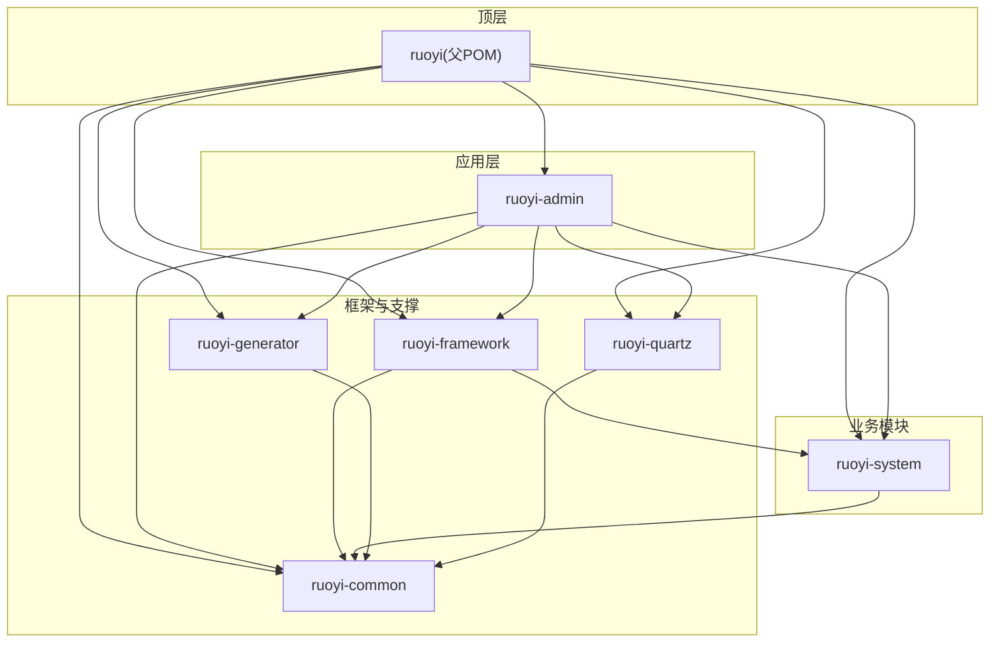
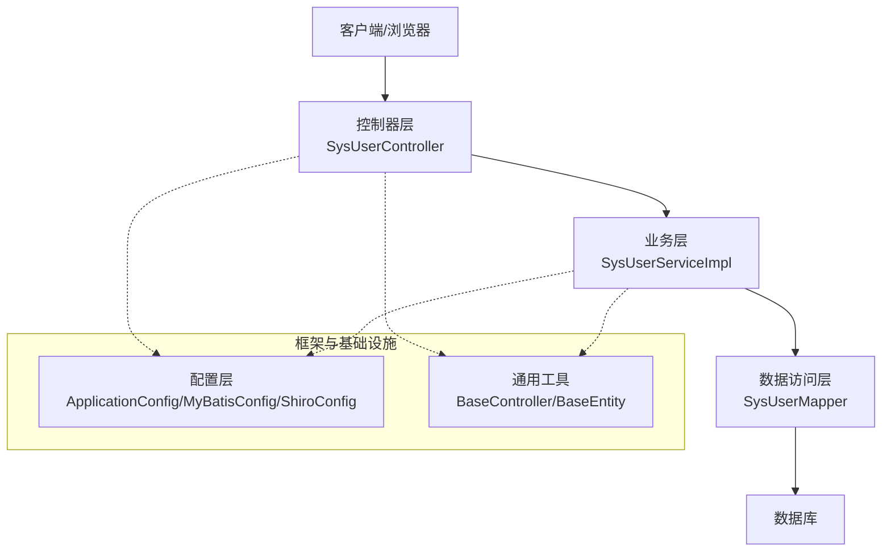
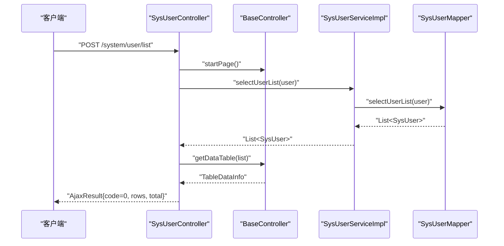
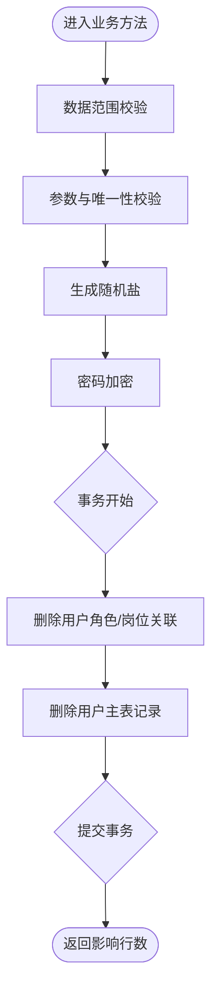
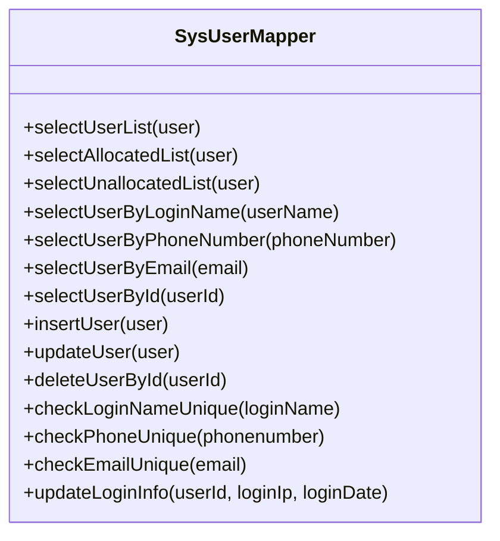
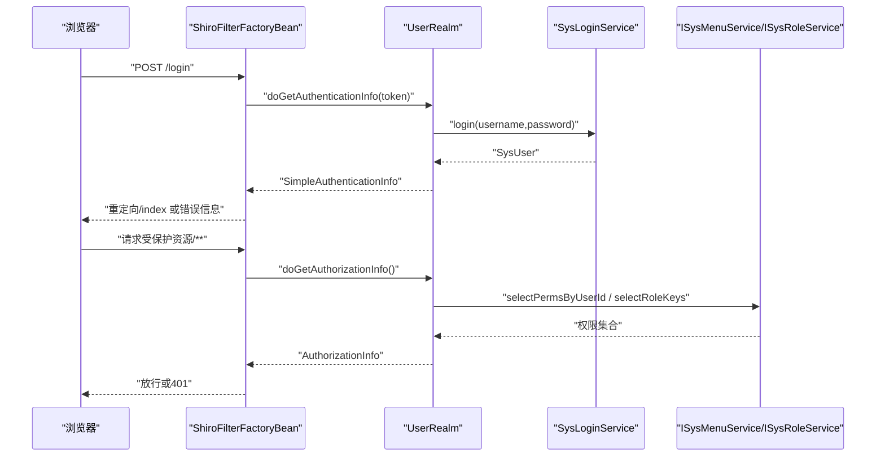
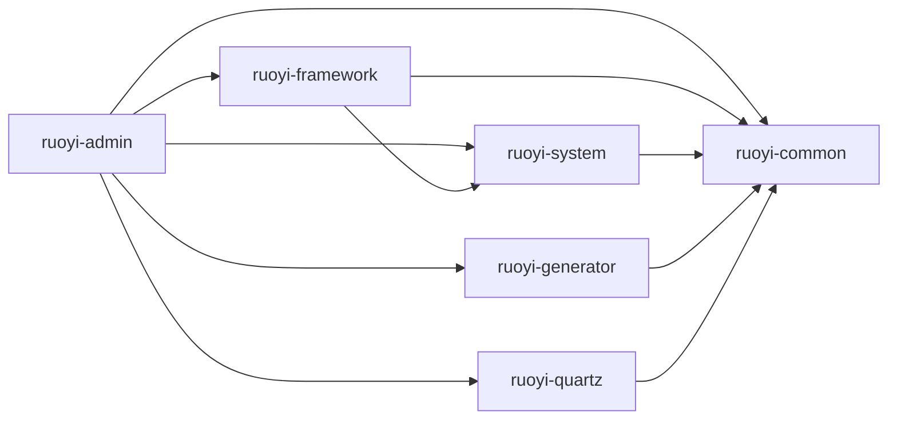

# 系统架构

<cite>
**本文引用的文件**
- [pom.xml](file://pom.xml)
- [RuoYiApplication.java](file://ruoyi-admin/src/main/java/com/ruoyi/RuoYiApplication.java)
- [application.yml](file://ruoyi-admin/src/main/resources/application.yml)
- [ruoyi-common/pom.xml](file://ruoyi-common/pom.xml)
- [ruoyi-framework/pom.xml](file://ruoyi-framework/pom.xml)
- [ruoyi-system/pom.xml](file://ruoyi-system/pom.xml)
- [ruoyi-generator/pom.xml](file://ruoyi-generator/pom.xml)
- [ruoyi-quartz/pom.xml](file://ruoyi-quartz/pom.xml)
- [ApplicationConfig.java](file://ruoyi-framework/src/main/java/com/ruoyi/framework/config/ApplicationConfig.java)
- [MyBatisConfig.java](file://ruoyi-framework/src/main/java/com/ruoyi/framework/config/MyBatisConfig.java)
- [ShiroConfig.java](file://ruoyi-framework/src/main/java/com/ruoyi/framework/config/ShiroConfig.java)
- [BaseController.java](file://ruoyi-common/src/main/java/com/ruoyi/common/core/controller/BaseController.java)
- [BaseEntity.java](file://ruoyi-common/src/main/java/com/ruoyi/common/core/domain/BaseEntity.java)
- [SysUserController.java](file://ruoyi-admin/src/main/java/com/ruoyi/web/controller/system/SysUserController.java)
- [SysUserServiceImpl.java](file://ruoyi-system/src/main/java/com/ruoyi/system/service/impl/SysUserServiceImpl.java)
- [SysUserMapper.java](file://ruoyi-system/src/main/java/com/ruoyi/system/mapper/SysUserMapper.java)
- [UserRealm.java](file://ruoyi-framework/src/main/java/com/ruoyi/framework/shiro/realm/UserRealm.java)
</cite>

## 目录
1. [引言](#引言)
2. [项目结构](#项目结构)
3. [核心组件](#核心组件)
4. [架构总览](#架构总览)
5. [详细组件分析](#详细组件分析)
6. [依赖分析](#依赖分析)
7. [性能考虑](#性能考虑)
8. [故障排查指南](#故障排查指南)
9. [结论](#结论)
10. [附录](#附录)

## 引言
本文件面向RuoYi管理系统的架构文档，围绕基于Spring Boot的分层架构展开，系统采用Maven多模块组织，明确表现层、业务层、数据访问层的职责划分，并结合实际配置与代码，说明核心设计模式、组件交互流程、数据流向与系统边界。文档还总结了架构决策的技术考量、性能优化策略与可扩展性设计，并提供系统拓扑图与组件关系图，帮助开发者快速理解整体设计。

## 项目结构
RuoYi采用Maven聚合工程，顶层POM统一管理版本与模块，子模块按领域与能力拆分：ruoyi-admin应用入口、ruoyi-framework框架核心、ruoyi-system系统模块、ruoyi-common通用工具、ruoyi-generator代码生成、ruoyi-quartz定时任务。模块间依赖清晰，遵循“上层调用下层、横向仅依赖common”的原则。

图表来源
- [pom.xml:235-242](file://pom.xml#L235-L242)
- [ruoyi-admin/pom.xml](file://ruoyi-admin/pom.xml)
- [ruoyi-framework/pom.xml:69-72](file://ruoyi-framework/pom.xml#L69-L72)
- [ruoyi-system/pom.xml:20-24](file://ruoyi-system/pom.xml#L20-L24)
- [ruoyi-common/pom.xml:18-98](file://ruoyi-common/pom.xml#L18-L98)
- [ruoyi-generator/pom.xml:18-37](file://ruoyi-generator/pom.xml#L18-L37)
- [ruoyi-quartz/pom.xml:18-37](file://ruoyi-quartz/pom.xml#L18-L37)

章节来源
- [pom.xml:235-242](file://pom.xml#L235-L242)
- [ruoyi-admin/pom.xml](file://ruoyi-admin/pom.xml)

## 核心组件
- 应用入口与启动
  - 应用入口类负责排除数据源自动装配，交由框架模块统一配置，确保多数据源与动态路由可控。
  - 关键点：启动类排除数据源自动配置，避免重复初始化。
  
  章节来源
  - [RuoYiApplication.java:12-18](file://ruoyi-admin/src/main/java/com/ruoyi/RuoYiApplication.java#L12-L18)

- 配置与环境
  - 应用配置集中于application.yml，覆盖服务器、日志、MyBatis、分页、Shiro、XSS/CSRF防护、Swagger等。
  - 关键点：MyBatis扫描包、Mapper XML路径、Jackson时区与日期格式、Shiro会话与Cookie策略、文件上传大小限制等。
  
  章节来源
  - [application.yml:16-154](file://ruoyi-admin/src/main/resources/application.yml#L16-L154)

- 框架核心
  - ApplicationConfig：启用AOP代理、扫描Mapper包，统一MyBatis配置入口。
  - MyBatisConfig：动态解析别名包、合并Mapper位置、加载全局配置文件。
  - ShiroConfig：构建SecurityManager、SessionManager、EhCache缓存、过滤链、记住我、验证码、在线会话同步、同设备登录限制等。
  
  章节来源
  - [ApplicationConfig.java:12-17](file://ruoyi-framework/src/main/java/com/ruoyi/framework/config/ApplicationConfig.java#L12-L17)
  - [MyBatisConfig.java:116-131](file://ruoyi-framework/src/main/java/com/ruoyi/framework/config/MyBatisConfig.java#L116-L131)
  - [ShiroConfig.java:296-346](file://ruoyi-framework/src/main/java/com/ruoyi/framework/config/ShiroConfig.java#L296-L346)

- 通用工具
  - BaseController：封装分页、排序、响应体、会话、用户上下文等通用逻辑。
  - BaseEntity：统一实体字段（创建/更新人、时间、备注、请求参数），支持序列化控制。
  
  章节来源
  - [BaseController.java:54-81](file://ruoyi-common/src/main/java/com/ruoyi/common/core/controller/BaseController.java#L54-L81)
  - [BaseEntity.java:16-43](file://ruoyi-common/src/main/java/com/ruoyi/common/core/domain/BaseEntity.java#L16-L43)

## 架构总览
系统采用经典的三层架构与多模块解耦：
- 表现层（Controller）：接收请求、参数校验、调用业务层、返回结果或视图。
- 业务层（Service）：编排领域服务、事务控制、数据范围校验、调用数据访问层。
- 数据访问层（Mapper/DAO）：SQL映射、条件查询、分页、统计等。

图表来源
- [SysUserController.java:43-79](file://ruoyi-admin/src/main/java/com/ruoyi/web/controller/system/SysUserController.java#L43-L79)
- [SysUserServiceImpl.java:45-85](file://ruoyi-system/src/main/java/com/ruoyi/system/service/impl/SysUserServiceImpl.java#L45-L85)
- [SysUserMapper.java:13-21](file://ruoyi-system/src/main/java/com/ruoyi/system/mapper/SysUserMapper.java#L13-L21)
- [ApplicationConfig.java:12-17](file://ruoyi-framework/src/main/java/com/ruoyi/framework/config/ApplicationConfig.java#L12-L17)
- [MyBatisConfig.java:116-131](file://ruoyi-framework/src/main/java/com/ruoyi/framework/config/MyBatisConfig.java#L116-L131)
- [BaseController.java:54-81](file://ruoyi-common/src/main/java/com/ruoyi/common/core/controller/BaseController.java#L54-L81)
- [BaseEntity.java:16-43](file://ruoyi-common/src/main/java/com/ruoyi/common/core/domain/BaseEntity.java#L16-L43)

## 详细组件分析

### 控制器层（表现层）
- 职责
  - 参数绑定与校验、分页与排序、导出导入、权限注解校验、调用业务层、组装AjaxResult/分页数据。
- 典型流程
  - 列表查询：分页启动 → 业务层查询 → 组装TableDataInfo返回。
  - 新增/编辑：参数校验 → 数据范围校验 → 密码加密 → 业务层持久化 → 返回结果。
  

图表来源
- [SysUserController.java:72-79](file://ruoyi-admin/src/main/java/com/ruoyi/web/controller/system/SysUserController.java#L72-L79)
- [BaseController.java:110-118](file://ruoyi-common/src/main/java/com/ruoyi/common/core/controller/BaseController.java#L110-L118)
- [SysUserServiceImpl.java:80-85](file://ruoyi-system/src/main/java/com/ruoyi/system/service/impl/SysUserServiceImpl.java#L80-L85)
- [SysUserMapper.java](file://ruoyi-system/src/main/java/com/ruoyi/system/mapper/SysUserMapper.java#L21)

章节来源
- [SysUserController.java:43-153](file://ruoyi-admin/src/main/java/com/ruoyi/web/controller/system/SysUserController.java#L43-L153)
- [BaseController.java:54-118](file://ruoyi-common/src/main/java/com/ruoyi/common/core/controller/BaseController.java#L54-L118)

### 业务层（Service）
- 职责
  - 事务边界、数据范围注解（@DataScope）、参数校验、跨表关联处理、调用Mapper。
- 关键点
  - 删除用户：级联删除角色与岗位关联，再删除用户主表记录。
  - 密码处理：随机盐值、加密存储、更新时间。
  

图表来源
- [SysUserServiceImpl.java:179-188](file://ruoyi-system/src/main/java/com/ruoyi/system/service/impl/SysUserServiceImpl.java#L179-L188)
- [SysUserServiceImpl.java:148-152](file://ruoyi-system/src/main/java/com/ruoyi/system/service/impl/SysUserServiceImpl.java#L148-L152)

章节来源
- [SysUserServiceImpl.java:45-200](file://ruoyi-system/src/main/java/com/ruoyi/system/service/impl/SysUserServiceImpl.java#L45-L200)

### 数据访问层（Mapper）
- 职责
  - 提供用户相关CRUD与条件查询接口，配合XML映射执行SQL。
- 关键点
  - 分页与条件查询：通过传参对象与注解参数完成。
  - 登录信息更新：IP与时间更新。
  

图表来源
- [SysUserMapper.java:13-165](file://ruoyi-system/src/main/java/com/ruoyi/system/mapper/SysUserMapper.java#L13-L165)

章节来源
- [SysUserMapper.java:13-165](file://ruoyi-system/src/main/java/com/ruoyi/system/mapper/SysUserMapper.java#L13-L165)

### 安全与会话（Shiro）
- 职责
  - 认证：UserRealm根据用户名查询用户并比对凭证，抛出对应异常。
  - 授权：根据用户角色与菜单生成权限集合。
  - 会话：EhCache会话DAO与在线会话同步，支持记住我、验证码、同设备登录限制。
- 关键点
  - 过滤链：静态资源匿名访问、登录/注册验证码、退出、在线会话同步、CSRF校验、踢人。
  - Cookie与CipherKey：可配置域、路径、HttpOnly、过期时间、密钥生成策略。
  

图表来源
- [ShiroConfig.java:296-346](file://ruoyi-framework/src/main/java/com/ruoyi/framework/config/ShiroConfig.java#L296-L346)
- [UserRealm.java:86-133](file://ruoyi-framework/src/main/java/com/ruoyi/framework/shiro/realm/UserRealm.java#L86-L133)

章节来源
- [ShiroConfig.java:1-449](file://ruoyi-framework/src/main/java/com/ruoyi/framework/config/ShiroConfig.java#L1-L449)
- [UserRealm.java:1-159](file://ruoyi-framework/src/main/java/com/ruoyi/framework/shiro/realm/UserRealm.java#L1-L159)

## 依赖分析
- 模块依赖
  - ruoyi-admin依赖framework、system、common、quartz、generator，作为应用入口与对外服务。
  - ruoyi-framework依赖system与common，提供Web、AOP、MyBatis、Shiro、Druid、验证码等基础设施。
  - ruoyi-system依赖common，提供系统领域模型与服务。
  - ruoyi-generator与ruoyi-quartz均依赖common，分别提供代码生成与定时任务能力。
- 外部依赖
  - Spring Boot Starter Web/AOP、MyBatis、PageHelper、Shiro、EhCache、Kaptcha、Druid、Swagger、POI、YAUAA等。
  

图表来源
- [pom.xml:211-230](file://pom.xml#L211-L230)
- [ruoyi-framework/pom.xml:68-72](file://ruoyi-framework/pom.xml#L68-L72)
- [ruoyi-system/pom.xml:18-26](file://ruoyi-system/pom.xml#L18-L26)
- [ruoyi-generator/pom.xml:18-31](file://ruoyi-generator/pom.xml#L18-L31)
- [ruoyi-quartz/pom.xml:18-37](file://ruoyi-quartz/pom.xml#L18-L37)

章节来源
- [pom.xml:211-230](file://pom.xml#L211-L230)
- [ruoyi-common/pom.xml:18-98](file://ruoyi-common/pom.xml#L18-L98)
- [ruoyi-framework/pom.xml:18-74](file://ruoyi-framework/pom.xml#L18-L74)
- [ruoyi-system/pom.xml:18-26](file://ruoyi-system/pom.xml#L18-L26)
- [ruoyi-generator/pom.xml:18-37](file://ruoyi-generator/pom.xml#L18-L37)
- [ruoyi-quartz/pom.xml:18-37](file://ruoyi-quartz/pom.xml#L18-L37)

## 性能考虑
- Web与线程池
  - Tomcat线程池参数可调（最大线程、最小空闲线程、接受队列），结合Nginx/负载均衡提升并发。
- MyBatis与分页
  - MyBatis别名包动态扫描与Mapper路径合并，减少配置开销；PageHelper分页避免一次性加载大结果集。
- 缓存与会话
  - Shiro EhCache会话DAO与在线会话同步，降低数据库压力；Session全局超时与定时校验保障资源回收。
- 安全与防护
  - XSS/CSRF开关与白名单配置，验证码过滤器与登录重试限制，降低暴力破解风险。
- 文件上传
  - 单文件与总大小限制，防止内存溢出与拒绝服务。

章节来源
- [application.yml:17-70](file://ruoyi-admin/src/main/resources/application.yml#L17-L70)
- [MyBatisConfig.java:94-114](file://ruoyi-framework/src/main/java/com/ruoyi/framework/config/MyBatisConfig.java#L94-L114)
- [ShiroConfig.java:231-252](file://ruoyi-framework/src/main/java/com/ruoyi/framework/config/ShiroConfig.java#L231-L252)

## 故障排查指南
- 启动与配置
  - 启动类排除数据源自动装配，确保自定义数据源与动态路由生效。
  - application.yml中MyBatis别名包与Mapper路径需与实际一致，否则出现映射异常。
- 认证与授权
  - 登录异常：根据UserRealm抛出的具体异常定位用户不存在、密码不匹配、账户锁定、角色限制等。
  - 权限不足：确认用户角色与菜单权限是否正确下发，AuthorizationInfo是否包含所需权限字符串。
- 会话与在线
  - 在线会话同步与定时校验异常：检查SessionManager配置与EhCache缓存可用性。
  - 记住我失效：确认cipherKey配置或随机密钥导致旧Cookie失效。
- 数据访问
  - 分页异常：确认PageHelper线程变量清理与orderBy注入是否正确。
  - SQL异常：核对Mapper XML与参数命名，避免空指针或非法排序字段。

章节来源
- [RuoYiApplication.java:12-18](file://ruoyi-admin/src/main/java/com/ruoyi/RuoYiApplication.java#L12-L18)
- [application.yml:71-85](file://ruoyi-admin/src/main/resources/application.yml#L71-L85)
- [UserRealm.java:86-133](file://ruoyi-framework/src/main/java/com/ruoyi/framework/shiro/realm/UserRealm.java#L86-L133)
- [BaseController.java:54-81](file://ruoyi-common/src/main/java/com/ruoyi/common/core/controller/BaseController.java#L54-L81)

## 结论
RuoYi以Maven多模块实现清晰的分层与职责分离，结合Spring Boot、MyBatis、Shiro等技术栈，形成稳定可扩展的后台管理架构。通过统一的配置与通用工具，降低了重复开发成本；通过安全与会话机制保障系统安全；通过分页与缓存策略提升性能。建议在生产环境中进一步完善监控与可观测性、灰度发布与容量规划，持续演进系统能力。

## 附录
- 关键配置要点
  - MyBatis：typeAliasesPackage、mapperLocations、configLocation
  - Shiro：loginUrl、unauthorizedUrl、captchaEnabled、rememberMe、session超时与校验间隔
  - XSS/CSRF：enabled、excludes、urlPatterns、whites
  - Swagger：enabled
- 关键类与职责
  - BaseController：分页、排序、响应、会话、用户上下文
  - BaseEntity：统一字段与序列化控制
  - ApplicationConfig/MyBatisConfig/ShiroConfig：框架配置入口
  - SysUserController：系统用户控制器
  - SysUserServiceImpl：用户业务逻辑
  - SysUserMapper：用户数据访问
  - UserRealm：认证与授权

章节来源
- [application.yml:46-154](file://ruoyi-admin/src/main/resources/application.yml#L46-L154)
- [BaseController.java:33-230](file://ruoyi-common/src/main/java/com/ruoyi/common/core/controller/BaseController.java#L33-L230)
- [BaseEntity.java:16-119](file://ruoyi-common/src/main/java/com/ruoyi/common/core/domain/BaseEntity.java#L16-L119)
- [ApplicationConfig.java:12-17](file://ruoyi-framework/src/main/java/com/ruoyi/framework/config/ApplicationConfig.java#L12-L17)
- [MyBatisConfig.java:116-131](file://ruoyi-framework/src/main/java/com/ruoyi/framework/config/MyBatisConfig.java#L116-L131)
- [ShiroConfig.java:296-346](file://ruoyi-framework/src/main/java/com/ruoyi/framework/config/ShiroConfig.java#L296-L346)
- [SysUserController.java:43-200](file://ruoyi-admin/src/main/java/com/ruoyi/web/controller/system/SysUserController.java#L43-L200)
- [SysUserServiceImpl.java:45-200](file://ruoyi-system/src/main/java/com/ruoyi/system/service/impl/SysUserServiceImpl.java#L45-L200)
- [SysUserMapper.java:13-165](file://ruoyi-system/src/main/java/com/ruoyi/system/mapper/SysUserMapper.java#L13-L165)
- [UserRealm.java:40-159](file://ruoyi-framework/src/main/java/com/ruoyi/framework/shiro/realm/UserRealm.java#L40-L159)