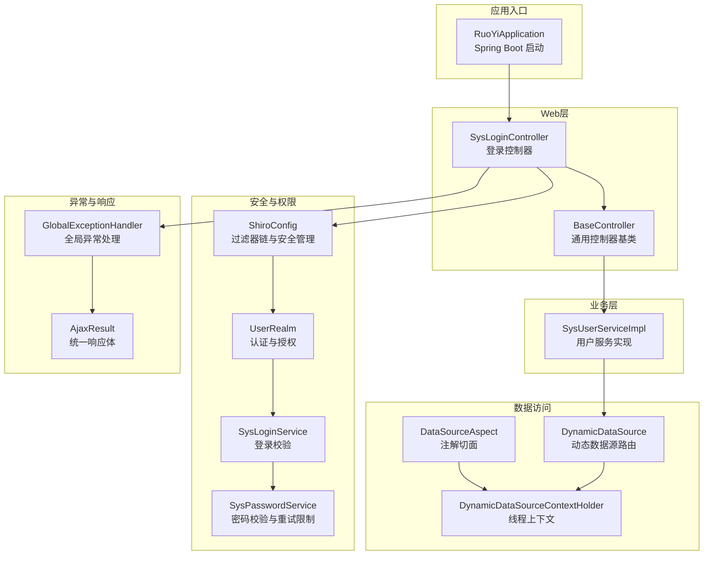
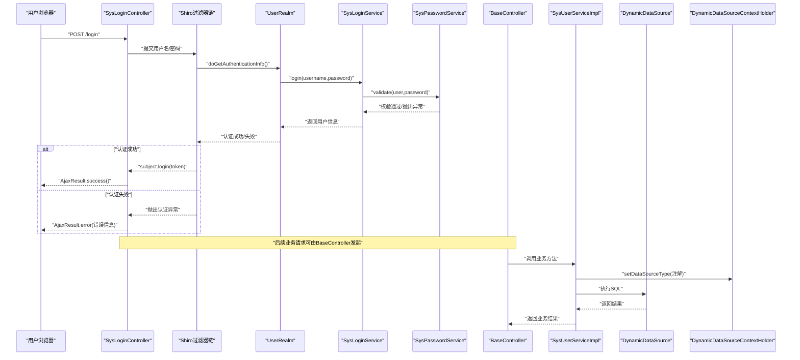
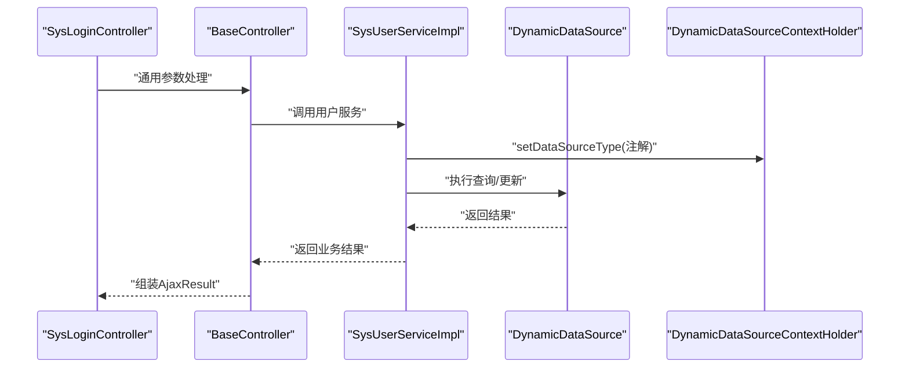
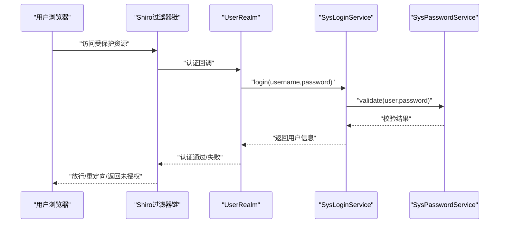
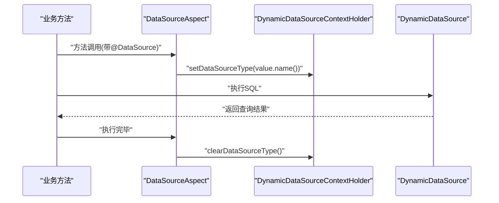
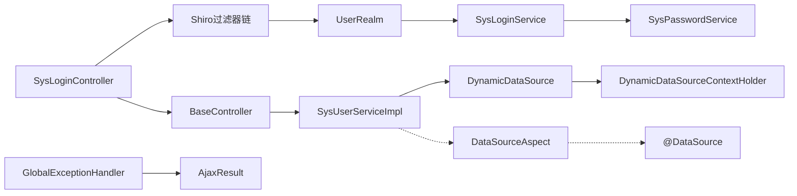

# 组件交互流程

<cite>
**本文引用的文件**
- [RuoYiApplication.java](file://ruoyi-admin/src/main/java/com/ruoyi/RuoYiApplication.java)
- [ShiroConfig.java](file://ruoyi-framework/src/main/java/com/ruoyi/framework/config/ShiroConfig.java)
- [UserRealm.java](file://ruoyi-framework/src/main/java/com/ruoyi/framework/shiro/realm/UserRealm.java)
- [SysLoginService.java](file://ruoyi-framework/src/main/java/com/ruoyi/framework/shiro/service/SysLoginService.java)
- [SysPasswordService.java](file://ruoyi-framework/src/main/java/com/ruoyi/framework/shiro/service/SysPasswordService.java)
- [SysLoginController.java](file://ruoyi-admin/src/main/java/com/ruoyi/web/controller/system/SysLoginController.java)
- [BaseController.java](file://ruoyi-common/src/main/java/com/ruoyi/common/core/controller/BaseController.java)
- [AjaxResult.java](file://ruoyi-common/src/main/java/com/ruoyi/common/core/domain/AjaxResult.java)
- [GlobalExceptionHandler.java](file://ruoyi-framework/src/main/java/com/ruoyi/framework/web/exception/GlobalExceptionHandler.java)
- [DynamicDataSource.java](file://ruoyi-framework/src/main/java/com/ruoyi/framework/datasource/DynamicDataSource.java)
- [DynamicDataSourceContextHolder.java](file://ruoyi-common/src/main/java/com/ruoyi/common/config/datasource/DynamicDataSourceContextHolder.java)
- [DataSourceAspect.java](file://ruoyi-framework/src/main/java/com/ruoyi/framework/aspectj/DataSourceAspect.java)
- [DataSource.java](file://ruoyi-common/src/main/java/com/ruoyi/common/annotation/DataSource.java)
- [DataSourceType.java](file://ruoyi-common/src/main/java/com/ruoyi/common/enums/DataSourceType.java)
- [SysUserServiceImpl.java](file://ruoyi-system/src/main/java/com/ruoyi/system/service/impl/SysUserServiceImpl.java)
</cite>

## 目录
1. [简介](#简介)
2. [项目结构](#项目结构)
3. [核心组件](#核心组件)
4. [架构总览](#架构总览)
5. [详细组件分析](#详细组件分析)
6. [依赖分析](#依赖分析)
7. [性能考虑](#性能考虑)
8. [故障排查指南](#故障排查指南)
9. [结论](#结论)

## 简介
本文件面向RuoYi管理系统，聚焦四大交互流程：用户请求处理流程（Controller → Service → Mapper）、权限验证流程（Shiro过滤器 → Realm认证 → 权限校验）、异常处理流程（全局异常捕获 → 统一响应）、动态数据源切换流程。文档通过时序图、类图与流程图展示组件间调用关系、数据流转与解耦设计，并给出性能优化建议与常见问题排查要点。

## 项目结构
RuoYi采用多模块分层架构：
- ruoyi-admin：Web入口与控制器层
- ruoyi-framework：安全、过滤器、动态数据源、全局异常等基础设施
- ruoyi-system：业务服务与Mapper层
- ruoyi-common：公共常量、工具、统一响应体、注解与枚举

图表来源
- [RuoYiApplication.java:12-18](file://ruoyi-admin/src/main/java/com/ruoyi/RuoYiApplication.java#L12-L18)
- [ShiroConfig.java:296-346](file://ruoyi-framework/src/main/java/com/ruoyi/framework/config/ShiroConfig.java#L296-L346)
- [UserRealm.java:86-133](file://ruoyi-framework/src/main/java/com/ruoyi/framework/shiro/realm/UserRealm.java#L86-L133)
- [SysLoginService.java:54-131](file://ruoyi-framework/src/main/java/com/ruoyi/framework/shiro/service/SysLoginService.java#L54-L131)
- [SysPasswordService.java:42-69](file://ruoyi-framework/src/main/java/com/ruoyi/framework/shiro/service/SysPasswordService.java#L42-L69)
- [SysLoginController.java:55-75](file://ruoyi-admin/src/main/java/com/ruoyi/web/controller/system/SysLoginController.java#L55-L75)
- [BaseController.java:57-81](file://ruoyi-common/src/main/java/com/ruoyi/common/core/controller/BaseController.java#L57-L81)
- [SysUserServiceImpl.java:119-123](file://ruoyi-system/src/main/java/com/ruoyi/system/service/impl/SysUserServiceImpl.java#L119-L123)
- [DynamicDataSource.java:22-26](file://ruoyi-framework/src/main/java/com/ruoyi/framework/datasource/DynamicDataSource.java#L22-L26)
- [DynamicDataSourceContextHolder.java:24-44](file://ruoyi-common/src/main/java/com/ruoyi/common/config/datasource/DynamicDataSourceContextHolder.java#L24-L44)
- [DataSourceAspect.java:37-56](file://ruoyi-framework/src/main/java/com/ruoyi/framework/aspectj/DataSourceAspect.java#L37-L56)
- [GlobalExceptionHandler.java:36-100](file://ruoyi-framework/src/main/java/com/ruoyi/framework/web/exception/GlobalExceptionHandler.java#L36-L100)
- [AjaxResult.java:122-126](file://ruoyi-common/src/main/java/com/ruoyi/common/core/domain/AjaxResult.java#L122-L126)

章节来源
- [RuoYiApplication.java:12-18](file://ruoyi-admin/src/main/java/com/ruoyi/RuoYiApplication.java#L12-L18)
- [ShiroConfig.java:296-346](file://ruoyi-framework/src/main/java/com/ruoyi/framework/config/ShiroConfig.java#L296-L346)

## 核心组件
- 控制器层：SysLoginController负责登录入口，BaseController提供分页、统一返回等通用能力
- 安全层：ShiroConfig装配过滤器链与安全管理器；UserRealm完成认证与授权；SysLoginService与SysPasswordService完成登录校验与密码校验
- 业务层：SysUserServiceImpl实现用户相关业务逻辑
- 数据访问层：DynamicDataSource结合注解切面与线程上下文实现动态数据源切换
- 异常与响应：GlobalExceptionHandler统一捕获异常，AjaxResult提供统一响应结构

章节来源
- [SysLoginController.java:55-75](file://ruoyi-admin/src/main/java/com/ruoyi/web/controller/system/SysLoginController.java#L55-L75)
- [BaseController.java:57-81](file://ruoyi-common/src/main/java/com/ruoyi/common/core/controller/BaseController.java#L57-L81)
- [UserRealm.java:56-81](file://ruoyi-framework/src/main/java/com/ruoyi/framework/shiro/realm/UserRealm.java#L56-L81)
- [SysLoginService.java:54-131](file://ruoyi-framework/src/main/java/com/ruoyi/framework/shiro/service/SysLoginService.java#L54-L131)
- [SysPasswordService.java:42-69](file://ruoyi-framework/src/main/java/com/ruoyi/framework/shiro/service/SysPasswordService.java#L42-L69)
- [SysUserServiceImpl.java:119-123](file://ruoyi-system/src/main/java/com/ruoyi/system/service/impl/SysUserServiceImpl.java#L119-L123)
- [DynamicDataSource.java:22-26](file://ruoyi-framework/src/main/java/com/ruoyi/framework/datasource/DynamicDataSource.java#L22-L26)
- [DynamicDataSourceContextHolder.java:24-44](file://ruoyi-common/src/main/java/com/ruoyi/common/config/datasource/DynamicDataSourceContextHolder.java#L24-L44)
- [DataSourceAspect.java:37-56](file://ruoyi-framework/src/main/java/com/ruoyi/framework/aspectj/DataSourceAspect.java#L37-L56)
- [GlobalExceptionHandler.java:36-100](file://ruoyi-framework/src/main/java/com/ruoyi/framework/web/exception/GlobalExceptionHandler.java#L36-L100)
- [AjaxResult.java:122-126](file://ruoyi-common/src/main/java/com/ruoyi/common/core/domain/AjaxResult.java#L122-L126)

## 架构总览
下图展示从浏览器到数据库的典型交互路径，涵盖请求处理、权限校验、业务处理与数据源切换。

图表来源
- [SysLoginController.java:55-75](file://ruoyi-admin/src/main/java/com/ruoyi/web/controller/system/SysLoginController.java#L55-L75)
- [ShiroConfig.java:296-346](file://ruoyi-framework/src/main/java/com/ruoyi/framework/config/ShiroConfig.java#L296-L346)
- [UserRealm.java:86-133](file://ruoyi-framework/src/main/java/com/ruoyi/framework/shiro/realm/UserRealm.java#L86-L133)
- [SysLoginService.java:54-131](file://ruoyi-framework/src/main/java/com/ruoyi/framework/shiro/service/SysLoginService.java#L54-L131)
- [SysPasswordService.java:42-69](file://ruoyi-framework/src/main/java/com/ruoyi/framework/shiro/service/SysPasswordService.java#L42-L69)
- [BaseController.java:57-81](file://ruoyi-common/src/main/java/com/ruoyi/common/core/controller/BaseController.java#L57-L81)
- [SysUserServiceImpl.java:119-123](file://ruoyi-system/src/main/java/com/ruoyi/system/service/impl/SysUserServiceImpl.java#L119-L123)
- [DynamicDataSource.java:22-26](file://ruoyi-framework/src/main/java/com/ruoyi/framework/datasource/DynamicDataSource.java#L22-L26)
- [DynamicDataSourceContextHolder.java:24-44](file://ruoyi-common/src/main/java/com/ruoyi/common/config/datasource/DynamicDataSourceContextHolder.java#L24-L44)

## 详细组件分析

### 用户请求处理流程（Controller → Service → Mapper）
- 控制器层：SysLoginController接收登录请求，封装UsernamePasswordToken并委托Shiro完成认证；BaseController提供分页与统一返回能力
- 业务层：SysUserServiceImpl实现用户查询与登录记录更新等业务
- 数据访问层：DynamicDataSource通过线程上下文选择目标数据源，配合注解切面在方法执行前后设置/清理数据源

图表来源
- [SysLoginController.java:55-75](file://ruoyi-admin/src/main/java/com/ruoyi/web/controller/system/SysLoginController.java#L55-L75)
- [BaseController.java:57-81](file://ruoyi-common/src/main/java/com/ruoyi/common/core/controller/BaseController.java#L57-L81)
- [SysUserServiceImpl.java:119-123](file://ruoyi-system/src/main/java/com/ruoyi/system/service/impl/SysUserServiceImpl.java#L119-L123)
- [DynamicDataSource.java:22-26](file://ruoyi-framework/src/main/java/com/ruoyi/framework/datasource/DynamicDataSource.java#L22-L26)
- [DynamicDataSourceContextHolder.java:24-44](file://ruoyi-common/src/main/java/com/ruoyi/common/config/datasource/DynamicDataSourceContextHolder.java#L24-L44)

章节来源
- [SysLoginController.java:55-75](file://ruoyi-admin/src/main/java/com/ruoyi/web/controller/system/SysLoginController.java#L55-L75)
- [BaseController.java:57-81](file://ruoyi-common/src/main/java/com/ruoyi/common/core/controller/BaseController.java#L57-L81)
- [SysUserServiceImpl.java:119-123](file://ruoyi-system/src/main/java/com/ruoyi/system/service/impl/SysUserServiceImpl.java#L119-L123)
- [DynamicDataSource.java:22-26](file://ruoyi-framework/src/main/java/com/ruoyi/framework/datasource/DynamicDataSource.java#L22-L26)
- [DynamicDataSourceContextHolder.java:24-44](file://ruoyi-common/src/main/java/com/ruoyi/common/config/datasource/DynamicDataSourceContextHolder.java#L24-L44)

### 权限验证流程（Shiro过滤器 → Realm认证 → 权限校验）
- 过滤器链：ShiroConfig定义过滤器链与URL映射，按需启用验证码、CSRF、在线会话同步等过滤器
- 认证：UserRealm.doGetAuthenticationInfo委托SysLoginService完成登录校验，SysPasswordService执行密码匹配与重试限制
- 授权：UserRealm.doGetAuthorizationInfo基于用户角色与菜单生成授权信息

图表来源
- [ShiroConfig.java:296-346](file://ruoyi-framework/src/main/java/com/ruoyi/framework/config/ShiroConfig.java#L296-L346)
- [UserRealm.java:86-133](file://ruoyi-framework/src/main/java/com/ruoyi/framework/shiro/realm/UserRealm.java#L86-L133)
- [SysLoginService.java:54-131](file://ruoyi-framework/src/main/java/com/ruoyi/framework/shiro/service/SysLoginService.java#L54-L131)
- [SysPasswordService.java:42-69](file://ruoyi-framework/src/main/java/com/ruoyi/framework/shiro/service/SysPasswordService.java#L42-L69)

章节来源
- [ShiroConfig.java:296-346](file://ruoyi-framework/src/main/java/com/ruoyi/framework/config/ShiroConfig.java#L296-L346)
- [UserRealm.java:56-81](file://ruoyi-framework/src/main/java/com/ruoyi/framework/shiro/realm/UserRealm.java#L56-L81)
- [UserRealm.java:86-133](file://ruoyi-framework/src/main/java/com/ruoyi/framework/shiro/realm/UserRealm.java#L86-L133)
- [SysLoginService.java:54-131](file://ruoyi-framework/src/main/java/com/ruoyi/framework/shiro/service/SysLoginService.java#L54-L131)
- [SysPasswordService.java:42-69](file://ruoyi-framework/src/main/java/com/ruoyi/framework/shiro/service/SysPasswordService.java#L42-L69)

### 异常处理流程（全局异常捕获 → 统一响应）
- 全局异常：GlobalExceptionHandler根据异常类型返回AjaxResult或视图
- 统一响应：AjaxResult提供SUCCESS/WARN/ERROR三类状态码与消息字段

```mermaid
flowchart TD
Start(["请求进入"]) --> Try["执行业务逻辑"]
Try --> Ok{"是否异常?"}
Ok --> |否| Resp["返回正常响应"]
Ok --> |是| Catch["进入全局异常处理器"]
Catch --> Type{"异常类型?"}
Type --> |权限校验失败| AuthErr["AjaxResult.error 或 视图(error/unauth)"]
Type --> |业务异常| BizErr["AjaxResult.error 或 视图(error/service)"]
Type --> |其他异常| SysErr["AjaxResult.error"]
AuthErr --> End(["结束"])
BizErr --> End
SysErr --> End
Resp --> End
```

图表来源
- [GlobalExceptionHandler.java:36-100](file://ruoyi-framework/src/main/java/com/ruoyi/framework/web/exception/GlobalExceptionHandler.java#L36-L100)
- [AjaxResult.java:122-126](file://ruoyi-common/src/main/java/com/ruoyi/common/core/domain/AjaxResult.java#L122-L126)

章节来源
- [GlobalExceptionHandler.java:36-100](file://ruoyi-framework/src/main/java/com/ruoyi/framework/web/exception/GlobalExceptionHandler.java#L36-L100)
- [AjaxResult.java:122-126](file://ruoyi-common/src/main/java/com/ruoyi/common/core/domain/AjaxResult.java#L122-L126)

### 动态数据源切换流程
- 注解驱动：@DataSource标注方法或类，声明数据源类型（MASTER/SLAVE）
- 切面拦截：DataSourceAspect在方法执行前后设置/清理线程上下文中的数据源键
- 路由选择：DynamicDataSource根据当前线程上下文决定使用哪个目标数据源

图表来源
- [DataSourceAspect.java:37-56](file://ruoyi-framework/src/main/java/com/ruoyi/framework/aspectj/DataSourceAspect.java#L37-L56)
- [DynamicDataSourceContextHolder.java:24-44](file://ruoyi-common/src/main/java/com/ruoyi/common/config/datasource/DynamicDataSourceContextHolder.java#L24-L44)
- [DynamicDataSource.java:22-26](file://ruoyi-framework/src/main/java/com/ruoyi/framework/datasource/DynamicDataSource.java#L22-L26)
- [DataSource.java:24-28](file://ruoyi-common/src/main/java/com/ruoyi/common/annotation/DataSource.java#L24-L28)
- [DataSourceType.java:8-19](file://ruoyi-common/src/main/java/com/ruoyi/common/enums/DataSourceType.java#L8-L19)

章节来源
- [DataSourceAspect.java:37-56](file://ruoyi-framework/src/main/java/com/ruoyi/framework/aspectj/DataSourceAspect.java#L37-L56)
- [DynamicDataSourceContextHolder.java:24-44](file://ruoyi-common/src/main/java/com/ruoyi/common/config/datasource/DynamicDataSourceContextHolder.java#L24-L44)
- [DynamicDataSource.java:22-26](file://ruoyi-framework/src/main/java/com/ruoyi/framework/datasource/DynamicDataSource.java#L22-L26)
- [DataSource.java:24-28](file://ruoyi-common/src/main/java/com/ruoyi/common/annotation/DataSource.java#L24-L28)
- [DataSourceType.java:8-19](file://ruoyi-common/src/main/java/com/ruoyi/common/enums/DataSourceType.java#L8-L19)

## 依赖分析
- 控制器依赖：SysLoginController依赖Shiro与配置服务；BaseController依赖分页与会话工具
- 安全依赖：UserRealm依赖菜单/角色服务与登录服务；SysLoginService依赖用户/菜单/配置服务与异步日志
- 数据源依赖：DynamicDataSource依赖线程上下文；DataSourceAspect依赖注解与上下文；注解与枚举定义于common模块
- 异常依赖：GlobalExceptionHandler依赖AjaxResult与权限工具

图表来源
- [SysLoginController.java:55-75](file://ruoyi-admin/src/main/java/com/ruoyi/web/controller/system/SysLoginController.java#L55-L75)
- [ShiroConfig.java:296-346](file://ruoyi-framework/src/main/java/com/ruoyi/framework/config/ShiroConfig.java#L296-L346)
- [UserRealm.java:86-133](file://ruoyi-framework/src/main/java/com/ruoyi/framework/shiro/realm/UserRealm.java#L86-L133)
- [SysLoginService.java:54-131](file://ruoyi-framework/src/main/java/com/ruoyi/framework/shiro/service/SysLoginService.java#L54-L131)
- [SysPasswordService.java:42-69](file://ruoyi-framework/src/main/java/com/ruoyi/framework/shiro/service/SysPasswordService.java#L42-L69)
- [BaseController.java:57-81](file://ruoyi-common/src/main/java/com/ruoyi/common/core/controller/BaseController.java#L57-L81)
- [SysUserServiceImpl.java:119-123](file://ruoyi-system/src/main/java/com/ruoyi/system/service/impl/SysUserServiceImpl.java#L119-L123)
- [DynamicDataSource.java:22-26](file://ruoyi-framework/src/main/java/com/ruoyi/framework/datasource/DynamicDataSource.java#L22-L26)
- [DynamicDataSourceContextHolder.java:24-44](file://ruoyi-common/src/main/java/com/ruoyi/common/config/datasource/DynamicDataSourceContextHolder.java#L24-L44)
- [DataSourceAspect.java:37-56](file://ruoyi-framework/src/main/java/com/ruoyi/framework/aspectj/DataSourceAspect.java#L37-L56)
- [DataSource.java:24-28](file://ruoyi-common/src/main/java/com/ruoyi/common/annotation/DataSource.java#L24-L28)
- [GlobalExceptionHandler.java:36-100](file://ruoyi-framework/src/main/java/com/ruoyi/framework/web/exception/GlobalExceptionHandler.java#L36-L100)
- [AjaxResult.java:122-126](file://ruoyi-common/src/main/java/com/ruoyi/common/core/domain/AjaxResult.java#L122-L126)

章节来源
- [SysLoginController.java:55-75](file://ruoyi-admin/src/main/java/com/ruoyi/web/controller/system/SysLoginController.java#L55-L75)
- [UserRealm.java:86-133](file://ruoyi-framework/src/main/java/com/ruoyi/framework/shiro/realm/UserRealm.java#L86-L133)
- [SysLoginService.java:54-131](file://ruoyi-framework/src/main/java/com/ruoyi/framework/shiro/service/SysLoginService.java#L54-L131)
- [SysPasswordService.java:42-69](file://ruoyi-framework/src/main/java/com/ruoyi/framework/shiro/service/SysPasswordService.java#L42-L69)
- [BaseController.java:57-81](file://ruoyi-common/src/main/java/com/ruoyi/common/core/controller/BaseController.java#L57-L81)
- [SysUserServiceImpl.java:119-123](file://ruoyi-system/src/main/java/com/ruoyi/system/service/impl/SysUserServiceImpl.java#L119-L123)
- [DynamicDataSource.java:22-26](file://ruoyi-framework/src/main/java/com/ruoyi/framework/datasource/DynamicDataSource.java#L22-L26)
- [DynamicDataSourceContextHolder.java:24-44](file://ruoyi-common/src/main/java/com/ruoyi/common/config/datasource/DynamicDataSourceContextHolder.java#L24-L44)
- [DataSourceAspect.java:37-56](file://ruoyi-framework/src/main/java/com/ruoyi/framework/aspectj/DataSourceAspect.java#L37-L56)
- [DataSource.java:24-28](file://ruoyi-common/src/main/java/com/ruoyi/common/annotation/DataSource.java#L24-L28)
- [GlobalExceptionHandler.java:36-100](file://ruoyi-framework/src/main/java/com/ruoyi/framework/web/exception/GlobalExceptionHandler.java#L36-L100)
- [AjaxResult.java:122-126](file://ruoyi-common/src/main/java/com/ruoyi/common/core/domain/AjaxResult.java#L122-L126)

## 性能考虑
- 线程安全与上下文清理：动态数据源切面在finally中清理线程上下文，避免线程复用导致的数据源泄漏
- 缓存与重试：密码校验使用缓存记录失败次数，超过阈值快速失败，减少数据库压力
- 分页与排序：BaseController统一注入分页与排序，避免重复SQL拼接与越界风险
- 异步日志：登录事件通过异步管理器落库，降低主流程阻塞

章节来源
- [DataSourceAspect.java:51-55](file://ruoyi-framework/src/main/java/com/ruoyi/framework/aspectj/DataSourceAspect.java#L51-L55)
- [SysPasswordService.java:42-69](file://ruoyi-framework/src/main/java/com/ruoyi/framework/shiro/service/SysPasswordService.java#L42-L69)
- [BaseController.java:57-81](file://ruoyi-common/src/main/java/com/ruoyi/common/core/controller/BaseController.java#L57-L81)

## 故障排查指南
- 登录失败
  - 检查验证码、用户名/密码长度与格式
  - 查看密码重试上限与黑名单配置
  - 关注登录异步日志记录
- 权限不足
  - 确认用户角色与菜单权限是否正确
  - 检查Shiro过滤器链URL映射与过滤器启用状态
- 数据源切换异常
  - 确认@DataSource注解使用位置（方法/类）与优先级
  - 检查线程上下文是否在finally中清理
- 统一响应异常
  - 核对全局异常处理器对不同异常类型的分支处理
  - 确保AjaxResult字段与前端约定一致

章节来源
- [SysLoginService.java:54-131](file://ruoyi-framework/src/main/java/com/ruoyi/framework/shiro/service/SysLoginService.java#L54-L131)
- [SysPasswordService.java:42-69](file://ruoyi-framework/src/main/java/com/ruoyi/framework/shiro/service/SysPasswordService.java#L42-L69)
- [ShiroConfig.java:296-346](file://ruoyi-framework/src/main/java/com/ruoyi/framework/config/ShiroConfig.java#L296-L346)
- [DataSourceAspect.java:37-56](file://ruoyi-framework/src/main/java/com/ruoyi/framework/aspectj/DataSourceAspect.java#L37-L56)
- [GlobalExceptionHandler.java:36-100](file://ruoyi-framework/src/main/java/com/ruoyi/framework/web/exception/GlobalExceptionHandler.java#L36-L100)
- [AjaxResult.java:122-126](file://ruoyi-common/src/main/java/com/ruoyi/common/core/domain/AjaxResult.java#L122-L126)

## 结论
RuoYi通过清晰的分层与解耦设计，实现了“请求—认证—授权—业务—数据源”的稳定交互链路。动态数据源与注解切面确保了灵活的多数据源支持；全局异常与统一响应提升了可观测性与一致性；权限体系与异步日志保障了安全性与性能。遵循本文流程图与最佳实践，可有效提升开发效率与系统稳定性。