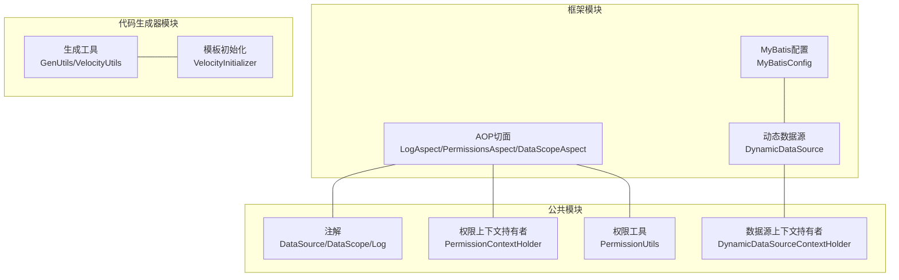
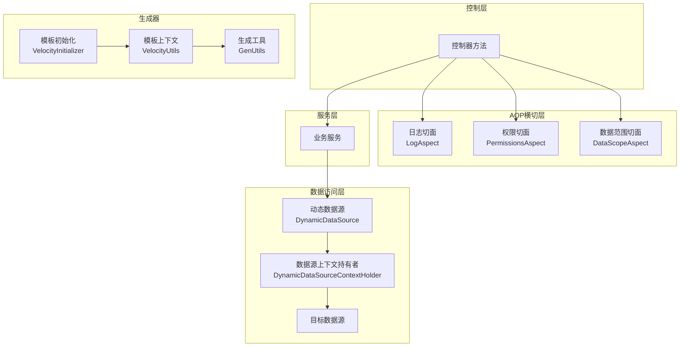
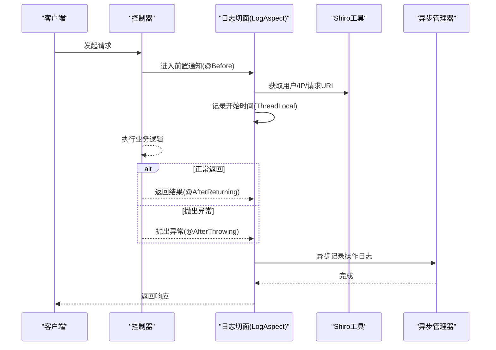
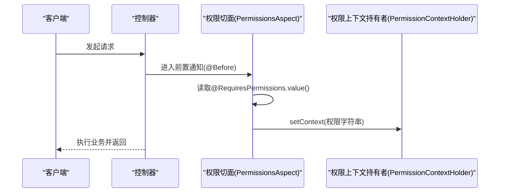
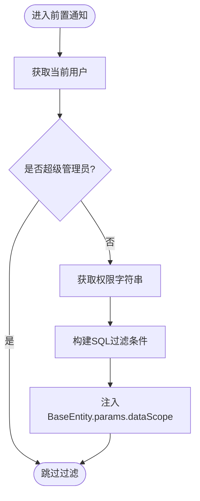
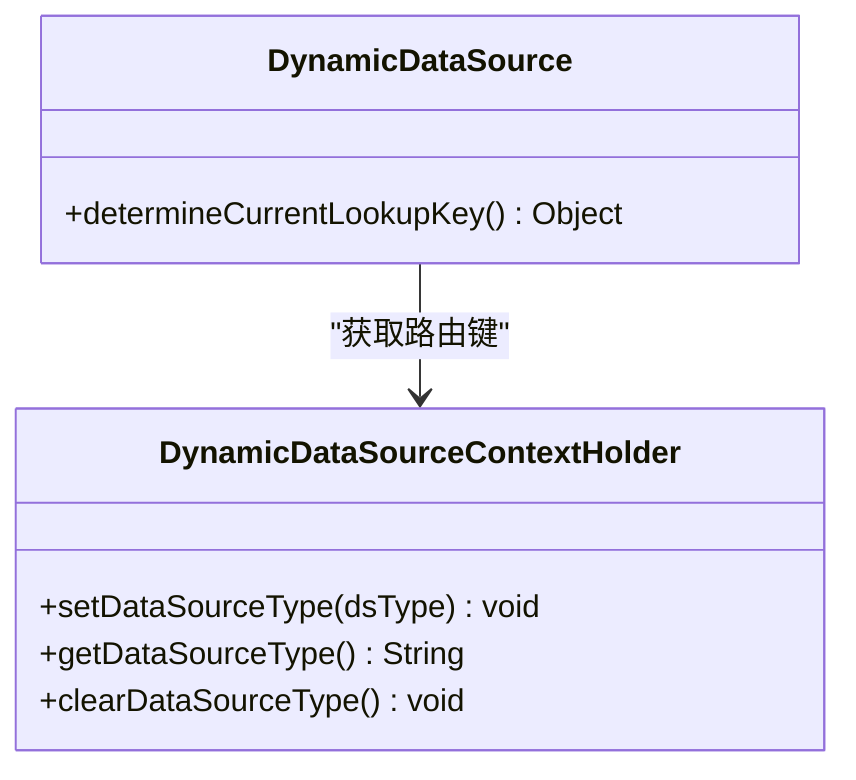
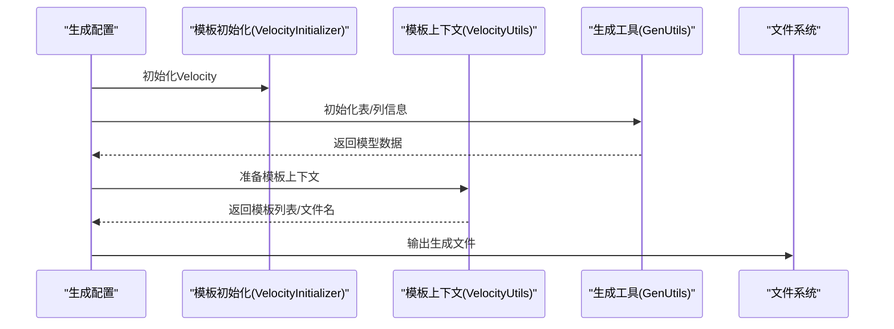
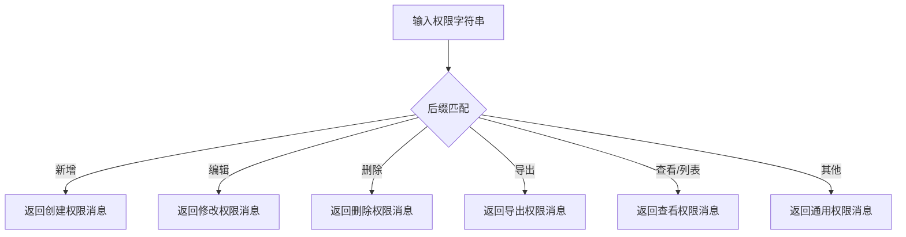
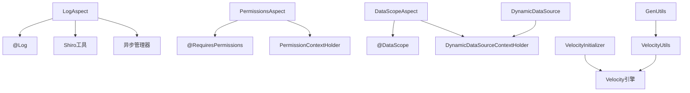

# 设计模式应用

<cite>
**本文引用的文件**
- [LogAspect.java](file://ruoyi-framework/src/main/java/com/ruoyi/framework/aspectj/LogAspect.java)
- [PermissionsAspect.java](file://ruoyi-framework/src/main/java/com/ruoyi/framework/aspectj/PermissionsAspect.java)
- [DataScopeAspect.java](file://ruoyi-framework/src/main/java/com/ruoyi/framework/aspectj/DataScopeAspect.java)
- [DynamicDataSource.java](file://ruoyi-framework/src/main/java/com/ruoyi/framework/datasource/DynamicDataSource.java)
- [DynamicDataSourceContextHolder.java](file://ruoyi-common/src/main/java/com/ruoyi/common/config/datasource/DynamicDataSourceContextHolder.java)
- [GenUtils.java](file://ruoyi-generator/src/main/java/com/ruoyi/generator/util/GenUtils.java)
- [VelocityUtils.java](file://ruoyi-generator/src/main/java/com/ruoyi/generator/util/VelocityUtils.java)
- [VelocityInitializer.java](file://ruoyi-generator/src/main/java/com/ruoyi/generator/util/VelocityInitializer.java)
- [PermissionContextHolder.java](file://ruoyi-common/src/main/java/com/ruoyi/common/core/context/PermissionContextHolder.java)
- [PermissionUtils.java](file://ruoyi-common/src/main/java/com/ruoyi/common/utils/security/PermissionUtils.java)
- [DataSource.java](file://ruoyi-common/src/main/java/com/ruoyi/common/annotation/DataSource.java)
- [DataScope.java](file://ruoyi-common/src/main/java/com/ruoyi/common/annotation/DataScope.java)
- [Log.java](file://ruoyi-common/src/main/java/com/ruoyi/common/annotation/Log.java)
- [MyBatisConfig.java](file://ruoyi-framework/src/main/java/com/ruoyi/framework/config/MyBatisConfig.java)
</cite>

## 目录
1. [引言](#引言)
2. [项目结构](#项目结构)
3. [核心组件](#核心组件)
4. [架构总览](#架构总览)
5. [详细组件分析](#详细组件分析)
6. [依赖分析](#依赖分析)
7. [性能考虑](#性能考虑)
8. [故障排查指南](#故障排查指南)
9. [结论](#结论)
10. [附录](#附录)

## 引言
本文件聚焦于RuoYi管理系统的“设计模式应用”，围绕以下主题展开：
- AOP横切关注点：通过日志记录、权限拦截与数据范围过滤三个切面，统一处理横切逻辑。
- 工厂模式：在动态数据源切换中的应用，结合上下文持有者实现数据源路由。
- 模板方法模式：在代码生成器中，通过Velocity模板与工具类的协作，形成稳定的生成流程骨架。
- 策略模式：在权限验证与提示消息解析中，依据不同权限类型选择不同的提示策略。

文档旨在帮助读者理解这些模式如何提升系统的可维护性与扩展性，并给出场景化分析、优缺点讨论与最佳实践建议。

## 项目结构
RuoYi采用多模块划分，核心与横切能力集中在框架模块，通用工具与注解分布在公共模块，代码生成器位于独立模块，便于复用与扩展。

图示来源
- [LogAspect.java:1-266](file://ruoyi-framework/src/main/java/com/ruoyi/framework/aspectj/LogAspect.java#L1-L266)
- [PermissionsAspect.java:1-31](file://ruoyi-framework/src/main/java/com/ruoyi/framework/aspectj/PermissionsAspect.java#L1-L31)
- [DataScopeAspect.java:1-159](file://ruoyi-framework/src/main/java/com/ruoyi/framework/aspectj/DataScopeAspect.java#L1-L159)
- [DynamicDataSource.java:1-27](file://ruoyi-framework/src/main/java/com/ruoyi/framework/datasource/DynamicDataSource.java#L1-L27)
- [DynamicDataSourceContextHolder.java:1-46](file://ruoyi-common/src/main/java/com/ruoyi/common/config/datasource/DynamicDataSourceContextHolder.java#L1-L46)
- [GenUtils.java:1-253](file://ruoyi-generator/src/main/java/com/ruoyi/generator/util/GenUtils.java#L1-L253)
- [VelocityUtils.java:1-457](file://ruoyi-generator/src/main/java/com/ruoyi/generator/util/VelocityUtils.java#L1-L457)
- [VelocityInitializer.java:1-35](file://ruoyi-generator/src/main/java/com/ruoyi/generator/util/VelocityInitializer.java#L1-L35)
- [PermissionContextHolder.java:1-28](file://ruoyi-common/src/main/java/com/ruoyi/common/core/context/PermissionContextHolder.java#L1-L28)
- [PermissionUtils.java:1-119](file://ruoyi-common/src/main/java/com/ruoyi/common/utils/security/PermissionUtils.java#L1-L119)
- [DataSource.java:1-29](file://ruoyi-common/src/main/java/com/ruoyi/common/annotation/DataSource.java#L1-L29)
- [DataScope.java:1-44](file://ruoyi-common/src/main/java/com/ruoyi/common/annotation/DataScope.java#L1-L44)
- [Log.java:1-51](file://ruoyi-common/src/main/java/com/ruoyi/common/annotation/Log.java#L1-L51)
- [MyBatisConfig.java:1-132](file://ruoyi-framework/src/main/java/com/ruoyi/framework/config/MyBatisConfig.java#L1-L132)

章节来源
- [LogAspect.java:1-266](file://ruoyi-framework/src/main/java/com/ruoyi/framework/aspectj/LogAspect.java#L1-L266)
- [PermissionsAspect.java:1-31](file://ruoyi-framework/src/main/java/com/ruoyi/framework/aspectj/PermissionsAspect.java#L1-L31)
- [DataScopeAspect.java:1-159](file://ruoyi-framework/src/main/java/com/ruoyi/framework/aspectj/DataScopeAspect.java#L1-L159)
- [DynamicDataSource.java:1-27](file://ruoyi-framework/src/main/java/com/ruoyi/framework/datasource/DynamicDataSource.java#L1-L27)
- [DynamicDataSourceContextHolder.java:1-46](file://ruoyi-common/src/main/java/com/ruoyi/common/config/datasource/DynamicDataSourceContextHolder.java#L1-L46)
- [GenUtils.java:1-253](file://ruoyi-generator/src/main/java/com/ruoyi/generator/util/GenUtils.java#L1-L253)
- [VelocityUtils.java:1-457](file://ruoyi-generator/src/main/java/com/ruoyi/generator/util/VelocityUtils.java#L1-L457)
- [VelocityInitializer.java:1-35](file://ruoyi-generator/src/main/java/com/ruoyi/generator/util/VelocityInitializer.java#L1-L35)
- [PermissionContextHolder.java:1-28](file://ruoyi-common/src/main/java/com/ruoyi/common/core/context/PermissionContextHolder.java#L1-L28)
- [PermissionUtils.java:1-119](file://ruoyi-common/src/main/java/com/ruoyi/common/utils/security/PermissionUtils.java#L1-L119)
- [DataSource.java:1-29](file://ruoyi-common/src/main/java/com/ruoyi/common/annotation/DataSource.java#L1-L29)
- [DataScope.java:1-44](file://ruoyi-common/src/main/java/com/ruoyi/common/annotation/DataScope.java#L1-L44)
- [Log.java:1-51](file://ruoyi-common/src/main/java/com/ruoyi/common/annotation/Log.java#L1-L51)
- [MyBatisConfig.java:1-132](file://ruoyi-framework/src/main/java/com/ruoyi/framework/config/MyBatisConfig.java#L1-L132)

## 核心组件
- AOP横切关注点
  - 日志切面：统一记录操作日志，包括请求参数、响应结果、异常信息与耗时统计。
  - 权限切面：将控制器声明的权限字符串注入到请求上下文，便于后续校验。
  - 数据范围切面：基于用户角色与权限，动态拼接SQL过滤条件，注入到查询参数中。
- 动态数据源
  - 通过上下文持有者决定当前路由的数据源键，实现运行时切换。
- 代码生成器
  - 以Velocity模板为核心，配合工具类完成模板变量准备、模板选择与文件命名等步骤。
- 权限工具
  - 提供权限类型到提示消息的映射策略，按不同权限后缀选择对应文案。

章节来源
- [LogAspect.java:1-266](file://ruoyi-framework/src/main/java/com/ruoyi/framework/aspectj/LogAspect.java#L1-L266)
- [PermissionsAspect.java:1-31](file://ruoyi-framework/src/main/java/com/ruoyi/framework/aspectj/PermissionsAspect.java#L1-L31)
- [DataScopeAspect.java:1-159](file://ruoyi-framework/src/main/java/com/ruoyi/framework/aspectj/DataScopeAspect.java#L1-L159)
- [DynamicDataSource.java:1-27](file://ruoyi-framework/src/main/java/com/ruoyi/framework/datasource/DynamicDataSource.java#L1-L27)
- [DynamicDataSourceContextHolder.java:1-46](file://ruoyi-common/src/main/java/com/ruoyi/common/config/datasource/DynamicDataSourceContextHolder.java#L1-L46)
- [GenUtils.java:1-253](file://ruoyi-generator/src/main/java/com/ruoyi/generator/util/GenUtils.java#L1-L253)
- [VelocityUtils.java:1-457](file://ruoyi-generator/src/main/java/com/ruoyi/generator/util/VelocityUtils.java#L1-L457)
- [PermissionUtils.java:1-119](file://ruoyi-common/src/main/java/com/ruoyi/common/utils/security/PermissionUtils.java#L1-L119)

## 架构总览
下图展示AOP横切与动态数据源在系统中的交互关系，以及代码生成器的模板驱动流程。

图示来源
- [LogAspect.java:1-266](file://ruoyi-framework/src/main/java/com/ruoyi/framework/aspectj/LogAspect.java#L1-L266)
- [PermissionsAspect.java:1-31](file://ruoyi-framework/src/main/java/com/ruoyi/framework/aspectj/PermissionsAspect.java#L1-L31)
- [DataScopeAspect.java:1-159](file://ruoyi-framework/src/main/java/com/ruoyi/framework/aspectj/DataScopeAspect.java#L1-L159)
- [DynamicDataSource.java:1-27](file://ruoyi-framework/src/main/java/com/ruoyi/framework/datasource/DynamicDataSource.java#L1-L27)
- [DynamicDataSourceContextHolder.java:1-46](file://ruoyi-common/src/main/java/com/ruoyi/common/config/datasource/DynamicDataSourceContextHolder.java#L1-L46)
- [VelocityInitializer.java:1-35](file://ruoyi-generator/src/main/java/com/ruoyi/generator/util/VelocityInitializer.java#L1-L35)
- [VelocityUtils.java:1-457](file://ruoyi-generator/src/main/java/com/ruoyi/generator/util/VelocityUtils.java#L1-L457)
- [GenUtils.java:1-253](file://ruoyi-generator/src/main/java/com/ruoyi/generator/util/GenUtils.java#L1-L253)

## 详细组件分析

### AOP横切关注点：日志、权限与数据范围

#### 日志切面（LogAspect）
- 职责：在控制器方法前后织入日志记录逻辑，捕获请求参数、响应结果、异常与耗时，异步落库。
- 关键点：
  - 使用ThreadLocal记录开始时间，计算耗时。
  - 注解驱动：通过@Log注解控制是否保存请求/响应数据及排除字段。
  - 异步记录：将日志任务提交至异步管理器，避免阻塞主流程。
- 应用场景：统一审计、问题追踪、性能监控。
- 优点：集中式日志，降低重复代码；异步处理提升吞吐。
- 缺点：参数序列化可能带来额外开销；敏感字段需显式排除。
- 最佳实践：合理设置参数最大长度与排除字段；对大对象参数谨慎开启保存响应。

图示来源
- [LogAspect.java:56-137](file://ruoyi-framework/src/main/java/com/ruoyi/framework/aspectj/LogAspect.java#L56-L137)
- [Log.java:1-51](file://ruoyi-common/src/main/java/com/ruoyi/common/annotation/Log.java#L1-L51)

章节来源
- [LogAspect.java:1-266](file://ruoyi-framework/src/main/java/com/ruoyi/framework/aspectj/LogAspect.java#L1-L266)
- [Log.java:1-51](file://ruoyi-common/src/main/java/com/ruoyi/common/annotation/Log.java#L1-L51)

#### 权限切面（PermissionsAspect）
- 职责：将控制器上@RequiresPermissions声明的权限字符串注入到请求上下文中，供后续权限校验使用。
- 关键点：
  - 在前置通知中读取注解值，拼接为逗号分隔的字符串。
  - 通过PermissionContextHolder.setContext设置到请求作用域。
- 应用场景：多角色权限匹配、细粒度权限控制。
- 优点：简化权限传递与校验流程。
- 缺点：依赖注解与请求上下文，需确保切面顺序正确。
- 最佳实践：注解值规范统一；避免在异步或跨线程场景误用。

图示来源
- [PermissionsAspect.java:20-29](file://ruoyi-framework/src/main/java/com/ruoyi/framework/aspectj/PermissionsAspect.java#L20-L29)
- [PermissionContextHolder.java:16-26](file://ruoyi-common/src/main/java/com/ruoyi/common/core/context/PermissionContextHolder.java#L16-L26)

章节来源
- [PermissionsAspect.java:1-31](file://ruoyi-framework/src/main/java/com/ruoyi/framework/aspectj/PermissionsAspect.java#L1-L31)
- [PermissionContextHolder.java:1-28](file://ruoyi-common/src/main/java/com/ruoyi/common/core/context/PermissionContextHolder.java#L1-L28)

#### 数据范围切面（DataScopeAspect）
- 职责：根据用户角色与权限，动态构造SQL过滤条件，注入到查询参数的dataScope中，实现数据权限控制。
- 关键点：
  - 支持多种数据范围策略（全部、自定义、本部门、本部门及子部门、仅本人）。
  - 通过BaseEntity.params.put注入过滤条件，避免硬编码SQL。
  - 清理历史dataScope，防止注入风险。
- 应用场景：多租户、多角色数据隔离。
- 优点：策略化拼接SQL，减少重复逻辑；与注解结合灵活配置。
- 缺点：复杂策略可能增加SQL体积；需保证别名与字段一致。
- 最佳实践：统一别名与字段命名；对权限字符串进行白名单校验。

图示来源
- [DataScopeAspect.java:34-144](file://ruoyi-framework/src/main/java/com/ruoyi/framework/aspectj/DataScopeAspect.java#L34-L144)
- [DataScope.java:1-44](file://ruoyi-common/src/main/java/com/ruoyi/common/annotation/DataScope.java#L1-L44)

章节来源
- [DataScopeAspect.java:1-159](file://ruoyi-framework/src/main/java/com/ruoyi/framework/aspectj/DataScopeAspect.java#L1-L159)
- [DataScope.java:1-44](file://ruoyi-common/src/main/java/com/ruoyi/common/annotation/DataScope.java#L1-L44)

### 工厂模式：动态数据源切换
- 职责：根据上下文持有者返回的数据源键，路由到对应的目标数据源。
- 关键点：
  - AbstractRoutingDataSource的determineCurrentLookupKey委托给上下文持有者。
  - 上下文持有者使用ThreadLocal存储当前线程的数据源类型，实现线程隔离。
- 应用场景：多数据源（主从、读写分离、按库分片）。
- 优点：运行时切换灵活；对业务透明。
- 缺点：上下文清理不当可能导致数据源泄漏。
- 最佳实践：在事务边界或请求结束时清理上下文；确保数据源注册完整。

图示来源
- [DynamicDataSource.java:22-26](file://ruoyi-framework/src/main/java/com/ruoyi/framework/datasource/DynamicDataSource.java#L22-L26)
- [DynamicDataSourceContextHolder.java:24-44](file://ruoyi-common/src/main/java/com/ruoyi/common/config/datasource/DynamicDataSourceContextHolder.java#L24-L44)

章节来源
- [DynamicDataSource.java:1-27](file://ruoyi-framework/src/main/java/com/ruoyi/framework/datasource/DynamicDataSource.java#L1-L27)
- [DynamicDataSourceContextHolder.java:1-46](file://ruoyi-common/src/main/java/com/ruoyi/common/config/datasource/DynamicDataSourceContextHolder.java#L1-L46)
- [DataSource.java:1-29](file://ruoyi-common/src/main/java/com/ruoyi/common/annotation/DataSource.java#L1-L29)

### 模板方法模式：代码生成器
- 职责：以Velocity模板为核心，提供生成流程的骨架（准备上下文、选择模板、生成文件名、输出文件），具体细节由工具类填充。
- 关键点：
  - VelocityInitializer负责初始化Velocity引擎与资源加载器。
  - VelocityUtils准备模板上下文、选择模板列表、生成文件名与导入包集合。
  - GenUtils负责表与列的初始化、命名转换与类型推断。
- 应用场景：快速生成CRUD、树形结构、主从表等代码与页面。
- 优点：模板可插拔，易于扩展新模板；流程稳定，职责清晰。
- 缺点：模板维护成本高；复杂模板调试困难。
- 最佳实践：模板与工具分离；为每种模板类别提供清晰的约定；对生成结果进行一致性校验。

图示来源
- [VelocityInitializer.java:17-33](file://ruoyi-generator/src/main/java/com/ruoyi/generator/util/VelocityInitializer.java#L17-L33)
- [VelocityUtils.java:34-168](file://ruoyi-generator/src/main/java/com/ruoyi/generator/util/VelocityUtils.java#L34-L168)
- [GenUtils.java:21-126](file://ruoyi-generator/src/main/java/com/ruoyi/generator/util/GenUtils.java#L21-L126)

章节来源
- [VelocityInitializer.java:1-35](file://ruoyi-generator/src/main/java/com/ruoyi/generator/util/VelocityInitializer.java#L1-L35)
- [VelocityUtils.java:1-457](file://ruoyi-generator/src/main/java/com/ruoyi/generator/util/VelocityUtils.java#L1-L457)
- [GenUtils.java:1-253](file://ruoyi-generator/src/main/java/com/ruoyi/generator/util/GenUtils.java#L1-L253)

### 策略模式：权限验证与提示
- 职责：根据权限字符串后缀（如新增、编辑、删除、导出、查看、列表）选择对应的提示消息策略。
- 关键点：
  - PermissionUtils根据权限后缀匹配，返回本地化消息。
  - 与Shiro权限体系配合，实现细粒度的权限提示。
- 应用场景：统一权限错误提示，改善用户体验。
- 优点：策略可扩展，新增权限类型只需添加映射规则。
- 缺点：权限后缀命名需统一；国际化消息需同步维护。
- 最佳实践：权限后缀命名规范；消息键与权限类型一一对应；提供默认兜底提示。

图示来源
- [PermissionUtils.java:59-85](file://ruoyi-common/src/main/java/com/ruoyi/common/utils/security/PermissionUtils.java#L59-L85)

章节来源
- [PermissionUtils.java:1-119](file://ruoyi-common/src/main/java/com/ruoyi/common/utils/security/PermissionUtils.java#L1-L119)

## 依赖分析
- AOP切面依赖注解与上下文工具，日志切面还依赖异步管理器与Shiro工具。
- 动态数据源依赖上下文持有者与Spring JDBC抽象。
- 代码生成器依赖Velocity引擎与生成工具类。
- 权限工具依赖Shiro与消息国际化。

图示来源
- [LogAspect.java:1-266](file://ruoyi-framework/src/main/java/com/ruoyi/framework/aspectj/LogAspect.java#L1-L266)
- [PermissionsAspect.java:1-31](file://ruoyi-framework/src/main/java/com/ruoyi/framework/aspectj/PermissionsAspect.java#L1-L31)
- [DataScopeAspect.java:1-159](file://ruoyi-framework/src/main/java/com/ruoyi/framework/aspectj/DataScopeAspect.java#L1-L159)
- [DynamicDataSource.java:1-27](file://ruoyi-framework/src/main/java/com/ruoyi/framework/datasource/DynamicDataSource.java#L1-L27)
- [DynamicDataSourceContextHolder.java:1-46](file://ruoyi-common/src/main/java/com/ruoyi/common/config/datasource/DynamicDataSourceContextHolder.java#L1-L46)
- [VelocityInitializer.java:1-35](file://ruoyi-generator/src/main/java/com/ruoyi/generator/util/VelocityInitializer.java#L1-L35)
- [VelocityUtils.java:1-457](file://ruoyi-generator/src/main/java/com/ruoyi/generator/util/VelocityUtils.java#L1-L457)
- [GenUtils.java:1-253](file://ruoyi-generator/src/main/java/com/ruoyi/generator/util/GenUtils.java#L1-L253)
- [Log.java:1-51](file://ruoyi-common/src/main/java/com/ruoyi/common/annotation/Log.java#L1-L51)
- [DataScope.java:1-44](file://ruoyi-common/src/main/java/com/ruoyi/common/annotation/DataScope.java#L1-L44)

章节来源
- [LogAspect.java:1-266](file://ruoyi-framework/src/main/java/com/ruoyi/framework/aspectj/LogAspect.java#L1-L266)
- [PermissionsAspect.java:1-31](file://ruoyi-framework/src/main/java/com/ruoyi/framework/aspectj/PermissionsAspect.java#L1-L31)
- [DataScopeAspect.java:1-159](file://ruoyi-framework/src/main/java/com/ruoyi/framework/aspectj/DataScopeAspect.java#L1-L159)
- [DynamicDataSource.java:1-27](file://ruoyi-framework/src/main/java/com/ruoyi/framework/datasource/DynamicDataSource.java#L1-L27)
- [DynamicDataSourceContextHolder.java:1-46](file://ruoyi-common/src/main/java/com/ruoyi/common/config/datasource/DynamicDataSourceContextHolder.java#L1-L46)
- [VelocityInitializer.java:1-35](file://ruoyi-generator/src/main/java/com/ruoyi/generator/util/VelocityInitializer.java#L1-L35)
- [VelocityUtils.java:1-457](file://ruoyi-generator/src/main/java/com/ruoyi/generator/util/VelocityUtils.java#L1-L457)
- [GenUtils.java:1-253](file://ruoyi-generator/src/main/java/com/ruoyi/generator/util/GenUtils.java#L1-L253)
- [Log.java:1-51](file://ruoyi-common/src/main/java/com/ruoyi/common/annotation/Log.java#L1-L51)
- [DataScope.java:1-44](file://ruoyi-common/src/main/java/com/ruoyi/common/annotation/DataScope.java#L1-L44)

## 性能考虑
- AOP切面
  - 日志切面的参数序列化与异步落库是主要开销来源，建议：
    - 控制保存的参数大小与数量；对大对象参数关闭保存响应。
    - 合理配置异步队列容量与线程池参数。
- 动态数据源
  - 线程上下文切换与数据源查找成本较低，但需避免频繁切换。
  - 在长事务或批量操作中尽量减少上下文变更次数。
- 代码生成器
  - 模板渲染与文件IO为瓶颈，建议：
    - 复用Velocity引擎实例；缓存模板解析结果。
    - 分批生成与并发控制，避免磁盘争用。
- 权限提示
  - 消息解析与国际化查询成本低，注意消息键命名一致性，减少查找失败重试。

## 故障排查指南
- 日志切面
  - 现象：日志缺失或参数异常。
  - 排查：检查@Log注解配置、排除字段是否正确；确认异步任务是否成功提交。
- 权限切面
  - 现象：权限校验失效或上下文丢失。
  - 排查：确认切面顺序与注解使用是否正确；检查请求上下文生命周期。
- 数据范围切面
  - 现象：查询结果为空或SQL注入风险。
  - 排查：核对别名与字段配置；确认权限字符串与角色权限匹配；检查是否清理了历史dataScope。
- 动态数据源
  - 现象：切换无效或数据源泄漏。
  - 排查：确认上下文设置/清理时机；检查目标数据源注册与路由键。
- 代码生成器
  - 现象：模板渲染失败或生成文件缺失。
  - 排查：检查Velocity初始化与资源路径；核对模板上下文与文件命名规则。
- 权限提示
  - 现象：提示消息不正确或缺失。
  - 排查：核对权限后缀与消息键映射；检查国际化资源是否存在。

章节来源
- [LogAspect.java:127-136](file://ruoyi-framework/src/main/java/com/ruoyi/framework/aspectj/LogAspect.java#L127-L136)
- [PermissionsAspect.java:20-29](file://ruoyi-framework/src/main/java/com/ruoyi/framework/aspectj/PermissionsAspect.java#L20-L29)
- [DataScopeAspect.java:149-157](file://ruoyi-framework/src/main/java/com/ruoyi/framework/aspectj/DataScopeAspect.java#L149-L157)
- [DynamicDataSourceContextHolder.java:24-44](file://ruoyi-common/src/main/java/com/ruoyi/common/config/datasource/DynamicDataSourceContextHolder.java#L24-L44)
- [VelocityInitializer.java:17-33](file://ruoyi-generator/src/main/java/com/ruoyi/generator/util/VelocityInitializer.java#L17-L33)
- [PermissionUtils.java:59-85](file://ruoyi-common/src/main/java/com/ruoyi/common/utils/security/PermissionUtils.java#L59-L85)

## 结论
RuoYi通过AOP横切关注点实现了日志、权限与数据范围的统一治理；通过动态数据源与上下文持有者实现了灵活的数据源切换；通过代码生成器的模板驱动形成了稳定的代码产出流程；通过权限提示的消息策略提升了用户体验。这些设计模式共同提升了系统的可维护性与扩展性，建议在实际开发中遵循最佳实践，持续优化横切逻辑与生成流程。

## 附录
- 相关配置与环境
  - MyBatis配置：自动扫描包与Mapper位置解析，确保实体与映射正确加载。
  - 数据源注解：用于方法或类级别切换数据源，优先级明确。

章节来源
- [MyBatisConfig.java:116-131](file://ruoyi-framework/src/main/java/com/ruoyi/framework/config/MyBatisConfig.java#L116-L131)
- [DataSource.java:1-29](file://ruoyi-common/src/main/java/com/ruoyi/common/annotation/DataSource.java#L1-L29)