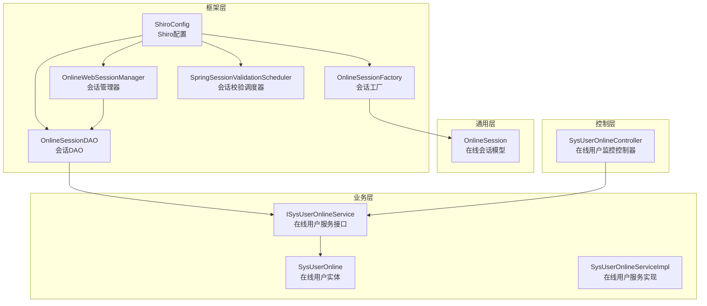
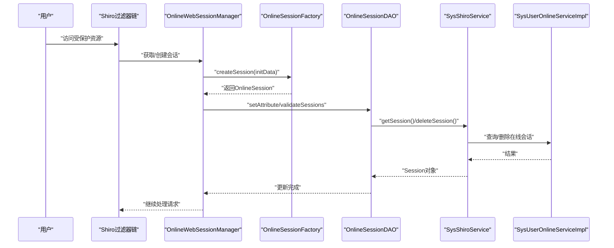
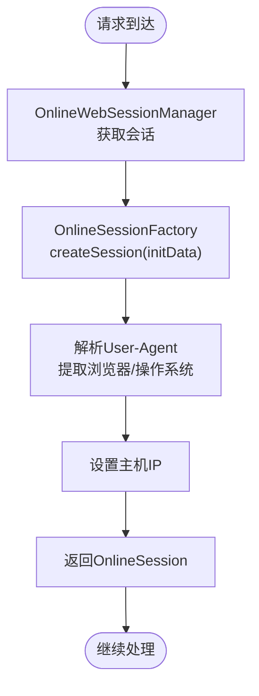
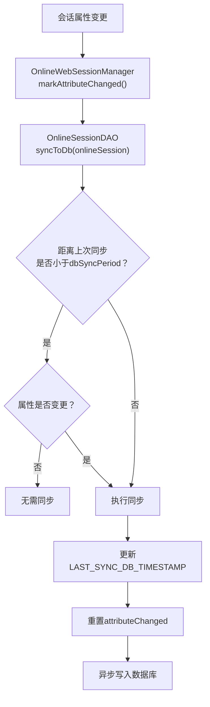
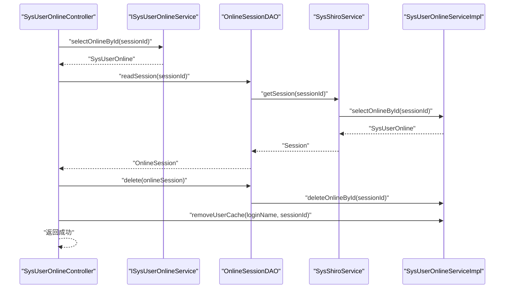
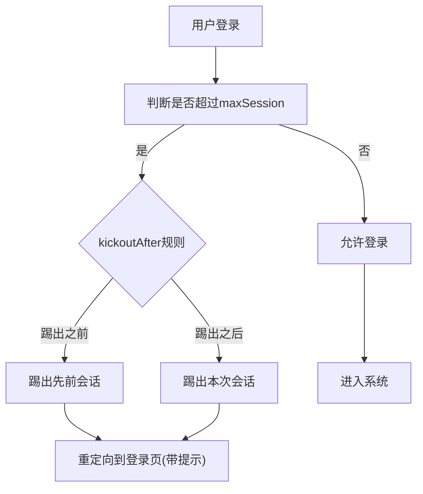
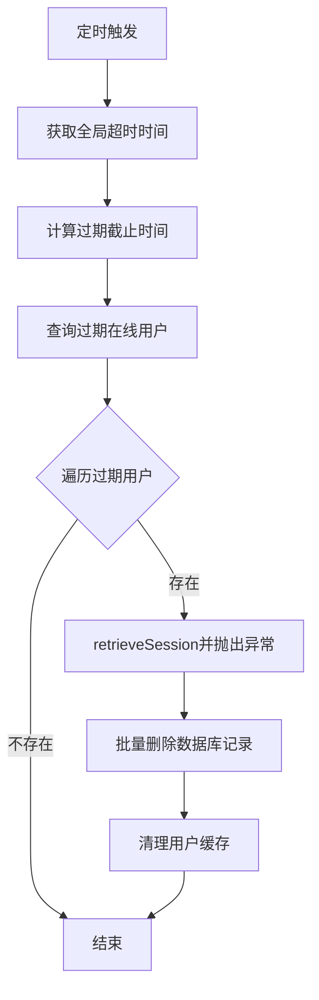
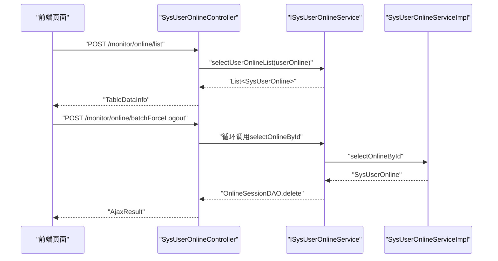
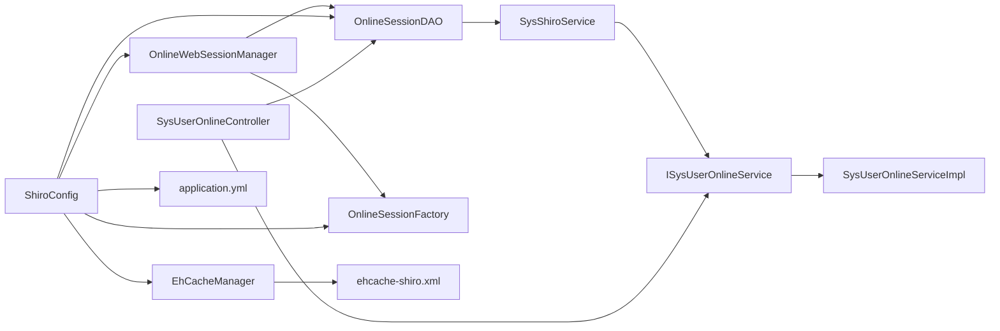

# 在线用户监控

<cite>
**本文引用的文件**
- [OnlineSessionDAO.java](file://ruoyi-framework/src/main/java/com/ruoyi/framework/shiro/session/OnlineSessionDAO.java)
- [OnlineWebSessionManager.java](file://ruoyi-framework/src/main/java/com/ruoyi/framework/shiro/web/session/OnlineWebSessionManager.java)
- [OnlineSession.java](file://ruoyi-common/src/main/java/com/ruoyi/common/core/session/OnlineSession.java)
- [SysUserOnline.java](file://ruoyi-system/src/main/java/com/ruoyi/system/domain/SysUserOnline.java)
- [SysUserOnlineServiceImpl.java](file://ruoyi-system/src/main/java/com/ruoyi/system/service/impl/SysUserOnlineServiceImpl.java)
- [SysUserOnlineController.java](file://ruoyi-admin/src/main/java/com/ruoyi/web/controller/monitor/SysUserOnlineController.java)
- [SysShiroService.java](file://ruoyi-framework/src/main/java/com/ruoyi/framework/shiro/service/SysShiroService.java)
- [OnlineSessionFactory.java](file://ruoyi-framework/src/main/java/com/ruoyi/framework/shiro/session/OnlineSessionFactory.java)
- [SpringSessionValidationScheduler.java](file://ruoyi-framework/src/main/java/com/ruoyi/framework/shiro/web/session/SpringSessionValidationScheduler.java)
- [ShiroConfig.java](file://ruoyi-framework/src/main/java/com/ruoyi/framework/config/ShiroConfig.java)
- [application.yml](file://ruoyi-admin/src/main/resources/application.yml)
- [ehcache-shiro.xml](file://ruoyi-admin/src/main/resources/ehcache/ehcache-shiro.xml)
</cite>

## 目录
1. [简介](#简介)
2. [项目结构](#项目结构)
3. [核心组件](#核心组件)
4. [架构总览](#架构总览)
5. [详细组件分析](#详细组件分析)
6. [依赖分析](#依赖分析)
7. [性能考虑](#性能考虑)
8. [故障排查指南](#故障排查指南)
9. [结论](#结论)
10. [附录](#附录)

## 简介
本文件面向“在线用户监控”功能，系统性阐述用户在线状态管理的实现机制，覆盖会话创建、维护与销毁的完整流程；解释 OnlineSessionDAO 的数据持久化策略与 OnlineWebSessionManager 的会话管理能力；说明登录检测、并发会话控制与强制下线机制；给出在线用户列表的查询、筛选与批量操作；提供会话超时配置、踢人与清理过期会话的配置方法；并介绍用户行为追踪、IP 地址监控与异常登录检测的安全能力，以及性能优化与监控指标调优建议。

## 项目结构
在线用户监控涉及三层模块：
- 框架层（ruoyi-framework）：会话工厂、会话DAO、会话管理器、Shiro配置与调度器
- 通用层（ruoyi-common）：在线会话模型与枚举
- 业务层（ruoyi-system）：在线用户实体、服务与持久层接口
- 控制层（ruoyi-admin）：在线用户监控控制器与前端模板

**图表来源**
- [ShiroConfig.java:232-252](file://ruoyi-framework/src/main/java/com/ruoyi/framework/config/ShiroConfig.java#L232-L252)
- [OnlineSessionFactory.java:25-84](file://ruoyi-framework/src/main/java/com/ruoyi/framework/shiro/session/OnlineSessionFactory.java#L25-L84)
- [OnlineSessionDAO.java:21-119](file://ruoyi-framework/src/main/java/com/ruoyi/framework/shiro/session/OnlineSessionDAO.java#L21-L119)
- [OnlineWebSessionManager.java:29-176](file://ruoyi-framework/src/main/java/com/ruoyi/framework/shiro/web/session/OnlineWebSessionManager.java#L29-L176)
- [SpringSessionValidationScheduler.java:23-132](file://ruoyi-framework/src/main/java/com/ruoyi/framework/shiro/web/session/SpringSessionValidationScheduler.java#L23-L132)
- [OnlineSession.java:13-166](file://ruoyi-common/src/main/java/com/ruoyi/common/core/session/OnlineSession.java#L13-L166)
- [SysUserOnline.java:15-205](file://ruoyi-system/src/main/java/com/ruoyi/system/domain/SysUserOnline.java#L15-L205)
- [SysUserOnlineServiceImpl.java:25-141](file://ruoyi-system/src/main/java/com/ruoyi/system/service/impl/SysUserOnlineServiceImpl.java#L25-L141)
- [SysUserOnlineController.java:32-90](file://ruoyi-admin/src/main/java/com/ruoyi/web/controller/monitor/SysUserOnlineController.java#L32-L90)

**章节来源**
- [ShiroConfig.java:232-252](file://ruoyi-framework/src/main/java/com/ruoyi/framework/config/ShiroConfig.java#L232-L252)
- [application.yml:110-121](file://ruoyi-admin/src/main/resources/application.yml#L110-L121)

## 核心组件
- 在线会话模型 OnlineSession：扩展 SimpleSession，增加用户身份、主机、浏览器、操作系统、在线状态与属性变更标记等字段，支持属性变更追踪以优化同步。
- 在线会话DAO OnlineSessionDAO：继承 EnterpriseCacheSessionDAO，负责会话读取、更新与删除；实现按周期与属性变更的数据库同步策略。
- 会话工厂 OnlineSessionFactory：根据请求上下文解析IP、浏览器与操作系统，构建 OnlineSession；支持从序列化数据恢复完整会话。
- 会话管理器 OnlineWebSessionManager：扩展 DefaultWebSessionManager，拦截会话属性变更并标记，定期校验过期会话并批量清理。
- 会话校验调度器 SpringSessionValidationScheduler：基于ScheduledExecutorService定时触发会话校验。
- 在线用户实体 SysUserOnline：持久化在线会话的关键载体，包含会话ID、登录信息、地理位置、时间戳与序列化会话数据。
- 在线用户服务 SysUserOnlineServiceImpl：提供在线用户查询、删除、批量删除、强制下线、清理用户缓存与过期会话查询。
- Shiro配置 ShiroConfig：装配会话管理器、会话DAO、会话工厂、并发控制与过滤器链。
- 控制器 SysUserOnlineController：提供在线用户列表查询与批量强制下线接口。

**章节来源**
- [OnlineSession.java:13-166](file://ruoyi-common/src/main/java/com/ruoyi/common/core/session/OnlineSession.java#L13-L166)
- [OnlineSessionDAO.java:21-119](file://ruoyi-framework/src/main/java/com/ruoyi/framework/shiro/session/OnlineSessionDAO.java#L21-L119)
- [OnlineSessionFactory.java:25-84](file://ruoyi-framework/src/main/java/com/ruoyi/framework/shiro/session/OnlineSessionFactory.java#L25-L84)
- [OnlineWebSessionManager.java:29-176](file://ruoyi-framework/src/main/java/com/ruoyi/framework/shiro/web/session/OnlineWebSessionManager.java#L29-L176)
- [SpringSessionValidationScheduler.java:23-132](file://ruoyi-framework/src/main/java/com/ruoyi/framework/shiro/web/session/SpringSessionValidationScheduler.java#L23-L132)
- [SysUserOnline.java:15-205](file://ruoyi-system/src/main/java/com/ruoyi/system/domain/SysUserOnline.java#L15-L205)
- [SysUserOnlineServiceImpl.java:25-141](file://ruoyi-system/src/main/java/com/ruoyi/system/service/impl/SysUserOnlineServiceImpl.java#L25-L141)
- [ShiroConfig.java:232-252](file://ruoyi-framework/src/main/java/com/ruoyi/framework/config/ShiroConfig.java#L232-L252)
- [SysUserOnlineController.java:32-90](file://ruoyi-admin/src/main/java/com/ruoyi/web/controller/monitor/SysUserOnlineController.java#L32-L90)

## 架构总览
在线用户监控围绕“会话生命周期 + 数据持久化 + 并发控制 + 强制下线 + 过期清理”的闭环展开。用户登录后，系统通过 OnlineSessionFactory 创建 OnlineSession，并由 OnlineWebSessionManager 统一管理；OnlineSessionDAO 将会话属性变更与访问时间同步至数据库；ShiroConfig 配置全局超时、并发控制与过滤器链；SpringSessionValidationScheduler 定时校验过期会话并批量清理；SysUserOnlineController 提供在线用户列表与批量强制下线。

**图表来源**
- [ShiroConfig.java:342-343](file://ruoyi-framework/src/main/java/com/ruoyi/framework/config/ShiroConfig.java#L342-L343)
- [OnlineWebSessionManager.java:33-90](file://ruoyi-framework/src/main/java/com/ruoyi/framework/shiro/web/session/OnlineWebSessionManager.java#L33-L90)
- [OnlineSessionFactory.java:62-82](file://ruoyi-framework/src/main/java/com/ruoyi/framework/shiro/session/OnlineSessionFactory.java#L62-L82)
- [OnlineSessionDAO.java:53-118](file://ruoyi-framework/src/main/java/com/ruoyi/framework/shiro/session/OnlineSessionDAO.java#L53-L118)
- [SysShiroService.java:43-52](file://ruoyi-framework/src/main/java/com/ruoyi/framework/shiro/service/SysShiroService.java#L43-L52)
- [SysUserOnlineServiceImpl.java:36-86](file://ruoyi-system/src/main/java/com/ruoyi/system/service/impl/SysUserOnlineServiceImpl.java#L36-L86)

## 详细组件分析

### 会话创建与初始化
- 请求进入时，OnlineWebSessionManager 通过 OnlineSessionFactory 创建 OnlineSession，解析请求中的浏览器与操作系统信息，并设置主机IP。
- 若数据库中存在该用户的序列化会话数据，优先反序列化恢复完整会话；否则回退到基础字段重建。

**图表来源**
- [OnlineSessionFactory.java:62-82](file://ruoyi-framework/src/main/java/com/ruoyi/framework/shiro/session/OnlineSessionFactory.java#L62-L82)
- [OnlineWebSessionManager.java:80-90](file://ruoyi-framework/src/main/java/com/ruoyi/framework/shiro/web/session/OnlineWebSessionManager.java#L80-L90)

**章节来源**
- [OnlineSessionFactory.java:29-59](file://ruoyi-framework/src/main/java/com/ruoyi/framework/shiro/session/OnlineSessionFactory.java#L29-L59)
- [OnlineSessionFactory.java:62-82](file://ruoyi-framework/src/main/java/com/ruoyi/framework/shiro/session/OnlineSessionFactory.java#L62-L82)

### 会话维护与持久化
- OnlineWebSessionManager 拦截会话属性变更，标记 attributeChanged，以便后续批量同步。
- OnlineSessionDAO 根据 dbSyncPeriod 与属性变更标志决定是否同步到数据库；同步后重置属性变更标记。
- SysShiroService 提供 getSession 与 deleteSession，桥接 OnlineSessionDAO 与业务层。

**图表来源**
- [OnlineWebSessionManager.java:33-78](file://ruoyi-framework/src/main/java/com/ruoyi/framework/shiro/web/session/OnlineWebSessionManager.java#L33-L78)
- [OnlineSessionDAO.java:68-102](file://ruoyi-framework/src/main/java/com/ruoyi/framework/shiro/session/OnlineSessionDAO.java#L68-L102)
- [SysShiroService.java:43-52](file://ruoyi-framework/src/main/java/com/ruoyi/framework/shiro/service/SysShiroService.java#L43-L52)

**章节来源**
- [OnlineWebSessionManager.java:33-78](file://ruoyi-framework/src/main/java/com/ruoyi/framework/shiro/web/session/OnlineWebSessionManager.java#L33-L78)
- [OnlineSessionDAO.java:68-102](file://ruoyi-framework/src/main/java/com/ruoyi/framework/shiro/session/OnlineSessionDAO.java#L68-L102)
- [SysShiroService.java:27-52](file://ruoyi-framework/src/main/java/com/ruoyi/framework/shiro/service/SysShiroService.java#L27-L52)

### 会话销毁与强制下线
- 用户登出或会话过期时，OnlineWebSessionManager 触发 OnlineSessionDAO.doDelete，将在线状态置为离线并删除数据库记录。
- SysUserOnlineController 支持批量强制下线：校验目标会话是否存在且非当前会话，调用 OnlineSessionDAO.delete，更新状态并清理用户缓存。

**图表来源**
- [SysUserOnlineController.java:61-88](file://ruoyi-admin/src/main/java/com/ruoyi/web/controller/monitor/SysUserOnlineController.java#L61-L88)
- [OnlineSessionDAO.java:107-118](file://ruoyi-framework/src/main/java/com/ruoyi/framework/shiro/session/OnlineSessionDAO.java#L107-L118)
- [SysUserOnlineServiceImpl.java:104-127](file://ruoyi-system/src/main/java/com/ruoyi/system/service/impl/SysUserOnlineServiceImpl.java#L104-L127)
- [SysShiroService.java:43-47](file://ruoyi-framework/src/main/java/com/ruoyi/framework/shiro/service/SysShiroService.java#L43-L47)

**章节来源**
- [SysUserOnlineController.java:61-88](file://ruoyi-admin/src/main/java/com/ruoyi/web/controller/monitor/SysUserOnlineController.java#L61-L88)
- [OnlineSessionDAO.java:107-118](file://ruoyi-framework/src/main/java/com/ruoyi/framework/shiro/session/OnlineSessionDAO.java#L107-L118)
- [SysUserOnlineServiceImpl.java:104-127](file://ruoyi-system/src/main/java/com/ruoyi/system/service/impl/SysUserOnlineServiceImpl.java#L104-L127)

### 并发会话控制与踢出
- ShiroConfig 中通过 KickoutSessionFilter 配置 maxSession 与 kickoutAfter，实现同一账号最大会话数限制与踢出策略。
- 当新会话尝试登录且超出上限时，根据 kickoutAfter 决定踢出之前或之后登录的会话，并重定向到带提示的登录页。

**图表来源**
- [ShiroConfig.java:414-426](file://ruoyi-framework/src/main/java/com/ruoyi/framework/config/ShiroConfig.java#L414-L426)
- [application.yml:117-120](file://ruoyi-admin/src/main/resources/application.yml#L117-L120)

**章节来源**
- [ShiroConfig.java:414-426](file://ruoyi-framework/src/main/java/com/ruoyi/framework/config/ShiroConfig.java#L414-L426)
- [application.yml:117-120](file://ruoyi-admin/src/main/resources/application.yml#L117-L120)

### 过期会话清理与定时校验
- OnlineWebSessionManager.validateSessions 依据全局超时时间查询过期在线用户，逐个使会话失效并批量删除数据库记录，同时清理用户缓存。
- SpringSessionValidationScheduler 以固定周期调度 validateSessions，确保后台自动清理。

**图表来源**
- [OnlineWebSessionManager.java:95-168](file://ruoyi-framework/src/main/java/com/ruoyi/framework/shiro/web/session/OnlineWebSessionManager.java#L95-L168)
- [SpringSessionValidationScheduler.java:75-115](file://ruoyi-framework/src/main/java/com/ruoyi/framework/shiro/web/session/SpringSessionValidationScheduler.java#L75-L115)
- [SysUserOnlineServiceImpl.java:134-139](file://ruoyi-system/src/main/java/com/ruoyi/system/service/impl/SysUserOnlineServiceImpl.java#L134-L139)

**章节来源**
- [OnlineWebSessionManager.java:95-168](file://ruoyi-framework/src/main/java/com/ruoyi/framework/shiro/web/session/OnlineWebSessionManager.java#L95-L168)
- [SpringSessionValidationScheduler.java:75-115](file://ruoyi-framework/src/main/java/com/ruoyi/framework/shiro/web/session/SpringSessionValidationScheduler.java#L75-L115)
- [SysUserOnlineServiceImpl.java:134-139](file://ruoyi-system/src/main/java/com/ruoyi/system/service/impl/SysUserOnlineServiceImpl.java#L134-L139)

### 在线用户列表查询、筛选与批量操作
- 列表查询：SysUserOnlineController 调用 ISysUserOnlineService.selectUserOnlineList，分页返回在线用户列表。
- 筛选条件：SysUserOnline 作为查询参数可携带登录名、部门、IP、浏览器、操作系统等维度。
- 批量操作：批量强制下线接口接收会话ID数组，逐个校验并执行强制下线。

**图表来源**
- [SysUserOnlineController.java:50-57](file://ruoyi-admin/src/main/java/com/ruoyi/web/controller/monitor/SysUserOnlineController.java#L50-L57)
- [SysUserOnlineController.java:61-88](file://ruoyi-admin/src/main/java/com/ruoyi/web/controller/monitor/SysUserOnlineController.java#L61-L88)
- [SysUserOnlineServiceImpl.java:94-97](file://ruoyi-system/src/main/java/com/ruoyi/system/service/impl/SysUserOnlineServiceImpl.java#L94-L97)

**章节来源**
- [SysUserOnlineController.java:50-57](file://ruoyi-admin/src/main/java/com/ruoyi/web/controller/monitor/SysUserOnlineController.java#L50-L57)
- [SysUserOnlineController.java:61-88](file://ruoyi-admin/src/main/java/com/ruoyi/web/controller/monitor/SysUserOnlineController.java#L61-L88)
- [SysUserOnlineServiceImpl.java:94-97](file://ruoyi-system/src/main/java/com/ruoyi/system/service/impl/SysUserOnlineServiceImpl.java#L94-L97)

### 用户行为追踪、IP监控与异常登录检测
- IP与UA采集：OnlineSessionFactory 从请求头解析IP、浏览器与操作系统，写入 OnlineSession。
- 地理位置与登录地点：SysUserOnline 持有 ipaddr 与 loginLocation 字段，可用于展示与审计。
- 异常检测：结合登录日志与在线用户列表，可识别同一账号在短时间内跨地域登录、频繁切换设备等异常行为（需配合登录日志服务与风控策略）。

**章节来源**
- [OnlineSessionFactory.java:62-82](file://ruoyi-framework/src/main/java/com/ruoyi/framework/shiro/session/OnlineSessionFactory.java#L62-L82)
- [SysUserOnline.java:28-126](file://ruoyi-system/src/main/java/com/ruoyi/system/domain/SysUserOnline.java#L28-L126)

## 依赖分析
- 组件耦合
  - OnlineWebSessionManager 依赖 OnlineSessionDAO 与 OnlineSessionFactory，负责会话生命周期与属性变更标记。
  - OnlineSessionDAO 依赖 SysShiroService 与业务层 ISysUserOnlineService，承担数据库同步与删除。
  - ShiroConfig 统一装配会话管理器、DAO、工厂、并发控制与过滤器链。
  - 控制器依赖服务层与会话DAO，提供对外接口。
- 外部依赖
  - Ehcache 作为缓存与会话缓存容器，配置于 ehcache-shiro.xml。
  - Shiro 配置项来源于 application.yml，包括会话超时、同步周期、校验间隔、并发限制与踢出策略。

**图表来源**
- [ShiroConfig.java:232-252](file://ruoyi-framework/src/main/java/com/ruoyi/framework/config/ShiroConfig.java#L232-L252)
- [OnlineWebSessionManager.java:29-176](file://ruoyi-framework/src/main/java/com/ruoyi/framework/shiro/web/session/OnlineWebSessionManager.java#L29-L176)
- [OnlineSessionDAO.java:21-119](file://ruoyi-framework/src/main/java/com/ruoyi/framework/shiro/session/OnlineSessionDAO.java#L21-L119)
- [SysShiroService.java:19-54](file://ruoyi-framework/src/main/java/com/ruoyi/framework/shiro/service/SysShiroService.java#L19-L54)
- [SysUserOnlineServiceImpl.java:25-141](file://ruoyi-system/src/main/java/com/ruoyi/system/service/impl/SysUserOnlineServiceImpl.java#L25-L141)
- [SysUserOnlineController.java:32-90](file://ruoyi-admin/src/main/java/com/ruoyi/web/controller/monitor/SysUserOnlineController.java#L32-L90)
- [ehcache-shiro.xml:1-91](file://ruoyi-admin/src/main/resources/ehcache/ehcache-shiro.xml#L1-L91)
- [application.yml:110-121](file://ruoyi-admin/src/main/resources/application.yml#L110-L121)

**章节来源**
- [ShiroConfig.java:232-252](file://ruoyi-framework/src/main/java/com/ruoyi/framework/config/ShiroConfig.java#L232-L252)
- [ehcache-shiro.xml:1-91](file://ruoyi-admin/src/main/resources/ehcache/ehcache-shiro.xml#L1-L91)
- [application.yml:110-121](file://ruoyi-admin/src/main/resources/application.yml#L110-L121)

## 性能考虑
- 同步策略优化
  - dbSyncPeriod 控制数据库同步频率，避免频繁写库；建议根据业务吞吐与延迟要求调整（默认1分钟）。
  - attributeChanged 标记减少不必要的数据库写入，仅在属性变更或接近同步周期时同步。
- 定时校验与批量清理
  - validationInterval 控制会话校验周期（默认10分钟），建议与业务峰值时段错峰；过短会增加CPU与数据库压力。
  - validateSessions 批量删除过期会话，注意数据库索引与事务开销，建议对 last_access_time 建立索引。
- 缓存与并发
  - EhCache 管理会话缓存与用户缓存，合理设置 maxEntriesLocalHeap、timeToLiveSeconds 等参数，避免内存溢出。
  - 并发控制 maxSession 与 kickoutAfter 需结合业务场景评估，防止过度踢人影响用户体验。
- 异步与线程池
  - 同步写库采用异步任务（AsyncManager），避免阻塞请求线程；确保线程池容量充足。

[本节为通用性能建议，不直接分析具体文件]

## 故障排查指南
- 会话未同步到数据库
  - 检查 dbSyncPeriod 与 attributeChanged 标记是否生效；确认 OnlineWebSessionManager 是否正确拦截属性变更。
  - 参考：[OnlineWebSessionManager.java:33-78](file://ruoyi-framework/src/main/java/com/ruoyi/framework/shiro/web/session/OnlineWebSessionManager.java#L33-L78)，[OnlineSessionDAO.java:68-102](file://ruoyi-framework/src/main/java/com/ruoyi/framework/shiro/session/OnlineSessionDAO.java#L68-L102)
- 强制下线无效
  - 确认 sessionId 是否正确、是否为目标用户会话、是否为当前会话；检查 OnlineSessionDAO.delete 与数据库删除逻辑。
  - 参考：[SysUserOnlineController.java:61-88](file://ruoyi-admin/src/main/java/com/ruoyi/web/controller/monitor/SysUserOnlineController.java#L61-L88)，[OnlineSessionDAO.java:107-118](file://ruoyi-framework/src/main/java/com/ruoyi/framework/shiro/session/OnlineSessionDAO.java#L107-L118)
- 过期会话未清理
  - 检查 validationInterval 与 SpringSessionValidationScheduler 是否启用；确认 validateSessions 的日志输出。
  - 参考：[SpringSessionValidationScheduler.java:75-115](file://ruoyi-framework/src/main/java/com/ruoyi/framework/shiro/web/session/SpringSessionValidationScheduler.java#L75-L115)，[OnlineWebSessionManager.java:95-168](file://ruoyi-framework/src/main/java/com/ruoyi/framework/shiro/web/session/OnlineWebSessionManager.java#L95-L168)
- 并发登录异常
  - 检查 maxSession 与 kickoutAfter 配置；确认 KickoutSessionFilter 是否加入过滤器链。
  - 参考：[ShiroConfig.java:414-426](file://ruoyi-framework/src/main/java/com/ruoyi/framework/config/ShiroConfig.java#L414-L426)，[application.yml:117-120](file://ruoyi-admin/src/main/resources/application.yml#L117-L120)
- 缓存问题
  - 检查 EhCache 配置与缓存键空间（sys-userCache、shiro-activeSessionCache）；确认 removeUserCache 是否正确清理。
  - 参考：[ehcache-shiro.xml:35-88](file://ruoyi-admin/src/main/resources/ehcache/ehcache-shiro.xml#L35-L88)，[SysUserOnlineServiceImpl.java:116-127](file://ruoyi-system/src/main/java/com/ruoyi/system/service/impl/SysUserOnlineServiceImpl.java#L116-L127)

**章节来源**
- [OnlineWebSessionManager.java:33-78](file://ruoyi-framework/src/main/java/com/ruoyi/framework/shiro/web/session/OnlineWebSessionManager.java#L33-L78)
- [OnlineSessionDAO.java:68-102](file://ruoyi-framework/src/main/java/com/ruoyi/framework/shiro/session/OnlineSessionDAO.java#L68-L102)
- [SysUserOnlineController.java:61-88](file://ruoyi-admin/src/main/java/com/ruoyi/web/controller/monitor/SysUserOnlineController.java#L61-L88)
- [OnlineSessionDAO.java:107-118](file://ruoyi-framework/src/main/java/com/ruoyi/framework/shiro/session/OnlineSessionDAO.java#L107-L118)
- [SpringSessionValidationScheduler.java:75-115](file://ruoyi-framework/src/main/java/com/ruoyi/framework/shiro/web/session/SpringSessionValidationScheduler.java#L75-L115)
- [OnlineWebSessionManager.java:95-168](file://ruoyi-framework/src/main/java/com/ruoyi/framework/shiro/web/session/OnlineWebSessionManager.java#L95-L168)
- [ShiroConfig.java:414-426](file://ruoyi-framework/src/main/java/com/ruoyi/framework/config/ShiroConfig.java#L414-L426)
- [application.yml:117-120](file://ruoyi-admin/src/main/resources/application.yml#L117-L120)
- [ehcache-shiro.xml:35-88](file://ruoyi-admin/src/main/resources/ehcache/ehcache-shiro.xml#L35-L88)
- [SysUserOnlineServiceImpl.java:116-127](file://ruoyi-system/src/main/java/com/ruoyi/system/service/impl/SysUserOnlineServiceImpl.java#L116-L127)

## 结论
在线用户监控通过“会话工厂 + 会话DAO + 会话管理器 + 定时校验 + 并发控制 + 强制下线”的协同，实现了完整的在线状态管理闭环。合理的配置与优化策略能够兼顾安全性与性能，满足高并发场景下的在线用户治理需求。

[本节为总结性内容，不直接分析具体文件]

## 附录

### 会话超时配置
- 全局超时：shiro.session.expireTime（单位分钟）
- 校验周期：shiro.session.validationInterval（单位分钟）
- 同步周期：shiro.session.dbSyncPeriod（单位分钟）

**章节来源**
- [application.yml:111-116](file://ruoyi-admin/src/main/resources/application.yml#L111-L116)
- [ShiroConfig.java:55-62](file://ruoyi-framework/src/main/java/com/ruoyi/framework/config/ShiroConfig.java#L55-L62)

### 并发会话控制与踢出
- 最大会话数：shiro.session.maxSession（-1表示不限制）
- 踢出策略：shiro.session.kickoutAfter（true为踢出之后登录者，false为踢出之前登录者）

**章节来源**
- [application.yml:117-120](file://ruoyi-admin/src/main/resources/application.yml#L117-L120)
- [ShiroConfig.java:414-426](file://ruoyi-framework/src/main/java/com/ruoyi/framework/config/ShiroConfig.java#L414-L426)

### 在线用户列表查询与批量操作
- 列表接口：POST /monitor/online/list
- 批量强制下线：POST /monitor/online/batchForceLogout

**章节来源**
- [SysUserOnlineController.java:50-57](file://ruoyi-admin/src/main/java/com/ruoyi/web/controller/monitor/SysUserOnlineController.java#L50-L57)
- [SysUserOnlineController.java:61-88](file://ruoyi-admin/src/main/java/com/ruoyi/web/controller/monitor/SysUserOnlineController.java#L61-L88)

### 缓存与会话存储
- Ehcache 配置：ehcache-shiro.xml
- 关键缓存：sys-userCache（用户缓存）、shiro-activeSessionCache（活动会话缓存）

**章节来源**
- [ehcache-shiro.xml:35-88](file://ruoyi-admin/src/main/resources/ehcache/ehcache-shiro.xml#L35-L88)