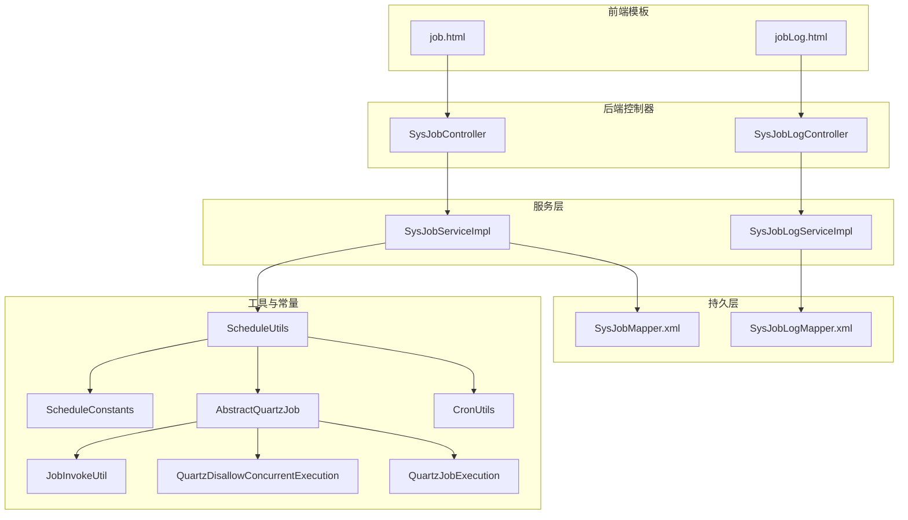
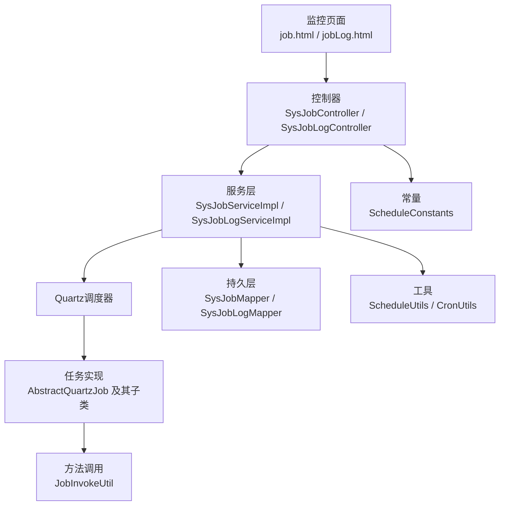
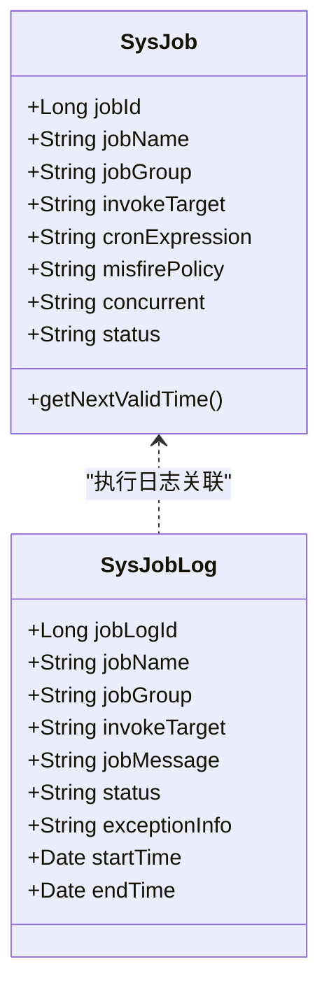
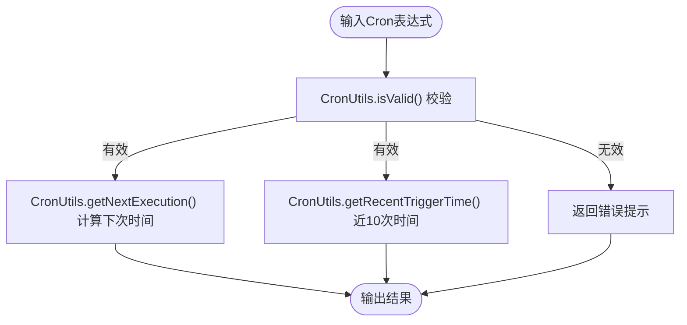
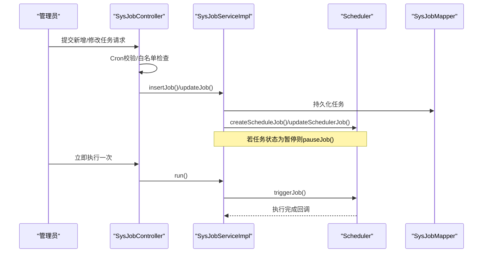
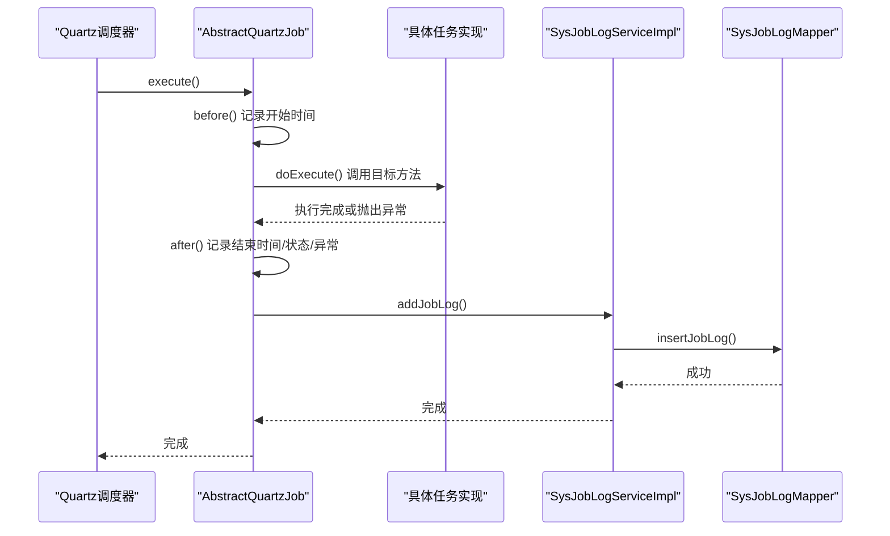
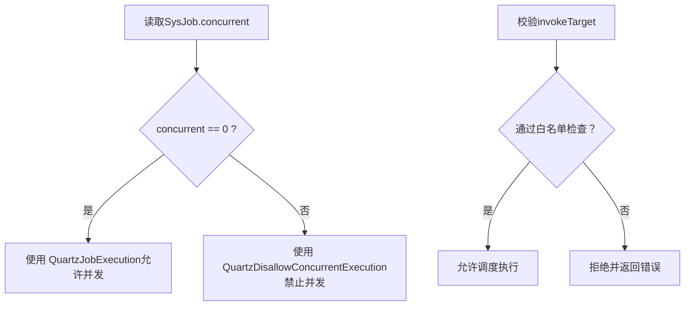
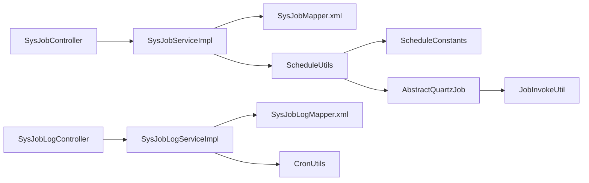

# 定时任务监控

<cite>
**本文引用的文件**
- [SysJob.java](file://ruoyi-quartz/src/main/java/com/ruoyi/quartz/domain/SysJob.java)
- [SysJobLog.java](file://ruoyi-quartz/src/main/java/com/ruoyi/quartz/domain/SysJobLog.java)
- [SysJobController.java](file://ruoyi-quartz/src/main/java/com/ruoyi/quartz/controller/SysJobController.java)
- [SysJobLogController.java](file://ruoyi-quartz/src/main/java/com/ruoyi/quartz/controller/SysJobLogController.java)
- [SysJobServiceImpl.java](file://ruoyi-quartz/src/main/java/com/ruoyi/quartz/service/impl/SysJobServiceImpl.java)
- [SysJobLogServiceImpl.java](file://ruoyi-quartz/src/main/java/com/ruoyi/quartz/service/impl/SysJobLogServiceImpl.java)
- [CronUtils.java](file://ruoyi-quartz/src/main/java/com/ruoyi/quartz/util/CronUtils.java)
- [ScheduleUtils.java](file://ruoyi-quartz/src/main/java/com/ruoyi/quartz/util/ScheduleUtils.java)
- [AbstractQuartzJob.java](file://ruoyi-quartz/src/main/java/com/ruoyi/quartz/util/AbstractQuartzJob.java)
- [QuartzJobExecution.java](file://ruoyi-quartz/src/main/java/com/ruoyi/quartz/util/QuartzJobExecution.java)
- [QuartzDisallowConcurrentExecution.java](file://ruoyi-quartz/src/main/java/com/ruoyi/quartz/util/QuartzDisallowConcurrentExecution.java)
- [JobInvokeUtil.java](file://ruoyi-quartz/src/main/java/com/ruoyi/quartz/util/JobInvokeUtil.java)
- [ScheduleConstants.java](file://ruoyi-common/src/main/java/com/ruoyi/common/constant/ScheduleConstants.java)
- [SysJobMapper.xml](file://ruoyi-quartz/src/main/resources/mapper/quartz/SysJobMapper.xml)
- [SysJobLogMapper.xml](file://ruoyi-quartz/src/main/resources/mapper/quartz/SysJobLogMapper.xml)
- [job.html](file://ruoyi-quartz/src/main/resources/templates/monitor/job/job.html)
- [jobLog.html](file://ruoyi-quartz/src/main/resources/templates/monitor/job/jobLog.html)
- [quartz.sql](file://sql/quartz.sql)
</cite>

## 目录
1. [简介](#简介)
2. [项目结构](#项目结构)
3. [核心组件](#核心组件)
4. [架构总览](#架构总览)
5. [详细组件分析](#详细组件分析)
6. [依赖关系分析](#依赖关系分析)
7. [性能与并发控制](#性能与并发控制)
8. [故障排查指南](#故障排查指南)
9. [结论](#结论)
10. [附录](#附录)

## 简介
本文件面向RuoYi框架下的定时任务监控模块，围绕Quartz任务调度系统，系统性阐述任务全生命周期管理（创建、修改、暂停、恢复、删除、立即执行）、SysJob与SysJobLog实体设计与用途、Cron表达式校验与可视化生成、任务执行日志记录与查询、异常处理策略、并发控制与安全白名单、以及监控页面的操作指南与最佳实践。文档同时提供架构图、序列图与流程图，帮助读者快速理解并高效运维定时任务。

## 项目结构
定时任务监控位于独立模块ruoyi-quartz中，采用“控制器-服务-工具-持久层-模板”的分层组织方式，结合MyBatis映射与Thymeleaf模板，提供前后端一体化的监控界面。

图表来源
- [job.html:1-201](file://ruoyi-quartz/src/main/resources/templates/monitor/job/job.html#L1-L201)
- [jobLog.html:1-138](file://ruoyi-quartz/src/main/resources/templates/monitor/job/jobLog.html#L1-L138)
- [SysJobController.java:1-249](file://ruoyi-quartz/src/main/java/com/ruoyi/quartz/controller/SysJobController.java#L1-L249)
- [SysJobLogController.java:1-104](file://ruoyi-quartz/src/main/java/com/ruoyi/quartz/controller/SysJobLogController.java#L1-L104)
- [SysJobServiceImpl.java:1-263](file://ruoyi-quartz/src/main/java/com/ruoyi/quartz/service/impl/SysJobServiceImpl.java#L1-L263)
- [SysJobLogServiceImpl.java:1-89](file://ruoyi-quartz/src/main/java/com/ruoyi/quartz/service/impl/SysJobLogServiceImpl.java#L1-L89)
- [ScheduleUtils.java:1-141](file://ruoyi-quartz/src/main/java/com/ruoyi/quartz/util/ScheduleUtils.java#L1-L141)
- [CronUtils.java:1-95](file://ruoyi-quartz/src/main/java/com/ruoyi/quartz/util/CronUtils.java#L1-L95)
- [AbstractQuartzJob.java:1-107](file://ruoyi-quartz/src/main/java/com/ruoyi/quartz/util/AbstractQuartzJob.java#L1-L107)
- [QuartzJobExecution.java:1-20](file://ruoyi-quartz/src/main/java/com/ruoyi/quartz/util/QuartzJobExecution.java#L1-L20)
- [QuartzDisallowConcurrentExecution.java:1-22](file://ruoyi-quartz/src/main/java/com/ruoyi/quartz/util/QuartzDisallowConcurrentExecution.java#L1-L22)
- [JobInvokeUtil.java:1-183](file://ruoyi-quartz/src/main/java/com/ruoyi/quartz/util/JobInvokeUtil.java#L1-L183)
- [ScheduleConstants.java:1-51](file://ruoyi-common/src/main/java/com/ruoyi/common/constant/ScheduleConstants.java#L1-L51)
- [SysJobMapper.xml:1-111](file://ruoyi-quartz/src/main/resources/mapper/quartz/SysJobMapper.xml#L1-L111)
- [SysJobLogMapper.xml:1-100](file://ruoyi-quartz/src/main/resources/mapper/quartz/SysJobLogMapper.xml#L1-L100)

章节来源
- [SysJobController.java:35-49](file://ruoyi-quartz/src/main/java/com/ruoyi/quartz/controller/SysJobController.java#L35-L49)
- [SysJobLogController.java:31-53](file://ruoyi-quartz/src/main/java/com/ruoyi/quartz/controller/SysJobLogController.java#L31-L53)

## 核心组件
- SysJob：任务元数据模型，包含任务名称、分组、调用目标、Cron表达式、错失触发策略、并发策略、状态等字段，并提供下一次有效执行时间计算。
- SysJobLog：任务执行日志模型，记录任务名称/分组/目标、执行开始/结束时间、状态、日志信息、异常详情等。
- SysJobController/SysJobLogController：对外提供REST接口与页面跳转，支持列表、新增、修改、删除、导出、清空、立即执行、状态切换、Cron表达式校验与可视化生成等。
- SysJobServiceImpl/SysJobLogServiceImpl：封装Quartz调度器操作与数据库交互，负责任务的创建、暂停/恢复、删除、更新、立即执行、日志新增与查询。
- ScheduleUtils：封装Quartz任务创建、Misfire策略设置、JobKey/TriggerKey生成、白名单校验等。
- CronUtils：提供Cron表达式有效性校验、最近触发时间列表生成等。
- AbstractQuartzJob/QuartzJobExecution/QuartzDisallowConcurrentExecution：抽象任务执行模板与并发控制实现，统一记录执行日志。
- JobInvokeUtil：解析调用目标字符串，定位Spring Bean或类方法并执行。
- ScheduleConstants：定义任务调度相关常量（Misfire策略、状态枚举、任务键名等）。
- Mapper XML：定义SysJob与SysJobLog的查询、插入、更新、批量删除、清空等SQL。

章节来源
- [SysJob.java:15-169](file://ruoyi-quartz/src/main/java/com/ruoyi/quartz/domain/SysJob.java#L15-L169)
- [SysJobLog.java:9-156](file://ruoyi-quartz/src/main/java/com/ruoyi/quartz/domain/SysJobLog.java#L9-L156)
- [SysJobController.java:30-249](file://ruoyi-quartz/src/main/java/com/ruoyi/quartz/controller/SysJobController.java#L30-L249)
- [SysJobLogController.java:26-104](file://ruoyi-quartz/src/main/java/com/ruoyi/quartz/controller/SysJobLogController.java#L26-L104)
- [SysJobServiceImpl.java:21-263](file://ruoyi-quartz/src/main/java/com/ruoyi/quartz/service/impl/SysJobServiceImpl.java#L21-L263)
- [SysJobLogServiceImpl.java:11-89](file://ruoyi-quartz/src/main/java/com/ruoyi/quartz/service/impl/SysJobLogServiceImpl.java#L11-L89)
- [ScheduleUtils.java:21-141](file://ruoyi-quartz/src/main/java/com/ruoyi/quartz/util/ScheduleUtils.java#L21-L141)
- [CronUtils.java:12-95](file://ruoyi-quartz/src/main/java/com/ruoyi/quartz/util/CronUtils.java#L12-L95)
- [AbstractQuartzJob.java:18-107](file://ruoyi-quartz/src/main/java/com/ruoyi/quartz/util/AbstractQuartzJob.java#L18-L107)
- [QuartzJobExecution.java:6-20](file://ruoyi-quartz/src/main/java/com/ruoyi/quartz/util/QuartzJobExecution.java#L6-L20)
- [QuartzDisallowConcurrentExecution.java:7-22](file://ruoyi-quartz/src/main/java/com/ruoyi/quartz/util/QuartzDisallowConcurrentExecution.java#L7-L22)
- [JobInvokeUtil.java:11-183](file://ruoyi-quartz/src/main/java/com/ruoyi/quartz/util/JobInvokeUtil.java#L11-L183)
- [ScheduleConstants.java:8-51](file://ruoyi-common/src/main/java/com/ruoyi/common/constant/ScheduleConstants.java#L8-L51)
- [SysJobMapper.xml:23-111](file://ruoyi-quartz/src/main/resources/mapper/quartz/SysJobMapper.xml#L23-L111)
- [SysJobLogMapper.xml:20-100](file://ruoyi-quartz/src/main/resources/mapper/quartz/SysJobLogMapper.xml#L20-L100)

## 架构总览
定时任务监控采用“前端模板+控制器+服务+工具+持久层”的分层架构，Quartz作为核心调度引擎，SysJob与SysJobLog分别承载任务元数据与执行日志，ScheduleUtils与CronUtils提供调度与表达式能力，JobInvokeUtil负责目标方法解析与调用。

图表来源
- [job.html:1-201](file://ruoyi-quartz/src/main/resources/templates/monitor/job/job.html#L1-L201)
- [jobLog.html:1-138](file://ruoyi-quartz/src/main/resources/templates/monitor/job/jobLog.html#L1-L138)
- [SysJobController.java:35-249](file://ruoyi-quartz/src/main/java/com/ruoyi/quartz/controller/SysJobController.java#L35-L249)
- [SysJobLogController.java:31-104](file://ruoyi-quartz/src/main/java/com/ruoyi/quartz/controller/SysJobLogController.java#L31-L104)
- [SysJobServiceImpl.java:27-263](file://ruoyi-quartz/src/main/java/com/ruoyi/quartz/service/impl/SysJobServiceImpl.java#L27-L263)
- [SysJobLogServiceImpl.java:16-89](file://ruoyi-quartz/src/main/java/com/ruoyi/quartz/service/impl/SysJobLogServiceImpl.java#L16-L89)
- [ScheduleUtils.java:27-141](file://ruoyi-quartz/src/main/java/com/ruoyi/quartz/util/ScheduleUtils.java#L27-L141)
- [CronUtils.java:18-95](file://ruoyi-quartz/src/main/java/com/ruoyi/quartz/util/CronUtils.java#L18-L95)
- [AbstractQuartzJob.java:23-107](file://ruoyi-quartz/src/main/java/com/ruoyi/quartz/util/AbstractQuartzJob.java#L23-L107)
- [JobInvokeUtil.java:16-183](file://ruoyi-quartz/src/main/java/com/ruoyi/quartz/util/JobInvokeUtil.java#L16-L183)
- [SysJobMapper.xml:1-111](file://ruoyi-quartz/src/main/resources/mapper/quartz/SysJobMapper.xml#L1-L111)
- [SysJobLogMapper.xml:1-100](file://ruoyi-quartz/src/main/resources/mapper/quartz/SysJobLogMapper.xml#L1-L100)

## 详细组件分析

### SysJob 实体与 SysJobLog 实体
- SysJob：承载任务元数据，提供Cron表达式有效性与下一次执行时间计算；状态字段用于控制任务启用/暂停；并发字段决定是否允许并发执行。
- SysJobLog：记录每次任务执行的开始/结束时间、状态、日志信息与异常详情，支持按任务名、分组、状态、时间范围查询。

图表来源
- [SysJob.java:15-169](file://ruoyi-quartz/src/main/java/com/ruoyi/quartz/domain/SysJob.java#L15-L169)
- [SysJobLog.java:9-156](file://ruoyi-quartz/src/main/java/com/ruoyi/quartz/domain/SysJobLog.java#L9-L156)

章节来源
- [SysJob.java:20-169](file://ruoyi-quartz/src/main/java/com/ruoyi/quartz/domain/SysJob.java#L20-L169)
- [SysJobLog.java:14-156](file://ruoyi-quartz/src/main/java/com/ruoyi/quartz/domain/SysJobLog.java#L14-L156)

### Cron表达式解析与可视化
- CronUtils：提供表达式有效性校验、获取下一次执行时间、生成近10次触发时间列表。
- SysJobController：提供Cron表达式在线校验与“近10次触发时间”查询接口，前端页面提供可视化生成入口。

图表来源
- [CronUtils.java:26-95](file://ruoyi-quartz/src/main/java/com/ruoyi/quartz/util/CronUtils.java#L26-L95)
- [SysJobController.java:214-247](file://ruoyi-quartz/src/main/java/com/ruoyi/quartz/controller/SysJobController.java#L214-L247)

章节来源
- [CronUtils.java:18-95](file://ruoyi-quartz/src/main/java/com/ruoyi/quartz/util/CronUtils.java#L18-L95)
- [SysJobController.java:214-247](file://ruoyi-quartz/src/main/java/com/ruoyi/quartz/controller/SysJobController.java#L214-L247)

### 任务生命周期管理（创建/修改/暂停/恢复/删除/立即执行）
- SysJobServiceImpl：在应用启动时加载并同步数据库与调度器；提供暂停、恢复、删除、批量删除、状态切换、立即执行、新增与更新任务等能力；更新任务时先删除旧Trigger再创建新Trigger。
- SysJobController：提供REST接口与页面操作，包括列表、导出、删除、状态切换、立即执行、新增/修改校验与白名单检查。

图表来源
- [SysJobController.java:131-210](file://ruoyi-quartz/src/main/java/com/ruoyi/quartz/controller/SysJobController.java#L131-L210)
- [SysJobServiceImpl.java:202-250](file://ruoyi-quartz/src/main/java/com/ruoyi/quartz/service/impl/SysJobServiceImpl.java#L202-L250)
- [ScheduleUtils.java:60-98](file://ruoyi-quartz/src/main/java/com/ruoyi/quartz/util/ScheduleUtils.java#L60-L98)

章节来源
- [SysJobServiceImpl.java:35-263](file://ruoyi-quartz/src/main/java/com/ruoyi/quartz/service/impl/SysJobServiceImpl.java#L35-L263)
- [SysJobController.java:51-210](file://ruoyi-quartz/src/main/java/com/ruoyi/quartz/controller/SysJobController.java#L51-L210)

### 任务执行日志记录机制
- AbstractQuartzJob：统一在before/after中记录执行开始时间、结束时间、耗时、状态与异常信息，并通过SpringUtils注入ISysJobLogService写入数据库。
- SysJobLogServiceImpl：提供日志查询、导出、批量删除、清空等能力。
- SysJobLogController：提供日志列表、导出、删除、清空、详情等操作。

图表来源
- [AbstractQuartzJob.java:32-96](file://ruoyi-quartz/src/main/java/com/ruoyi/quartz/util/AbstractQuartzJob.java#L32-L96)
- [SysJobLogServiceImpl.java:51-55](file://ruoyi-quartz/src/main/java/com/ruoyi/quartz/service/impl/SysJobLogServiceImpl.java#L51-L55)
- [SysJobLogMapper.xml:74-98](file://ruoyi-quartz/src/main/resources/mapper/quartz/SysJobLogMapper.xml#L74-L98)

章节来源
- [AbstractQuartzJob.java:23-107](file://ruoyi-quartz/src/main/java/com/ruoyi/quartz/util/AbstractQuartzJob.java#L23-L107)
- [SysJobLogServiceImpl.java:16-89](file://ruoyi-quartz/src/main/java/com/ruoyi/quartz/service/impl/SysJobLogServiceImpl.java#L16-L89)
- [SysJobLogController.java:43-103](file://ruoyi-quartz/src/main/java/com/ruoyi/quartz/controller/SysJobLogController.java#L43-L103)

### 并发控制与安全白名单
- 并发控制：通过ScheduleUtils选择不同任务实现类，0允许并发（QuartzJobExecution），1禁止并发（QuartzDisallowConcurrentExecution）。
- 安全白名单：ScheduleUtils.whiteList对调用目标进行包路径与Bean名称校验，避免任意代码执行风险。

图表来源
- [ScheduleUtils.java:35-39](file://ruoyi-quartz/src/main/java/com/ruoyi/quartz/util/ScheduleUtils.java#L35-L39)
- [ScheduleUtils.java:128-140](file://ruoyi-quartz/src/main/java/com/ruoyi/quartz/util/ScheduleUtils.java#L128-L140)

章节来源
- [ScheduleUtils.java:27-141](file://ruoyi-quartz/src/main/java/com/ruoyi/quartz/util/ScheduleUtils.java#L27-L141)
- [SysJobController.java:135-210](file://ruoyi-quartz/src/main/java/com/ruoyi/quartz/controller/SysJobController.java#L135-L210)

### 任务监控页面操作指南
- 任务列表页（job.html）：支持按任务名、分组、状态筛选；提供新增、修改、删除、导出、生成表达式、查看日志、立即执行一次、启用/停用等操作。
- 任务日志页（jobLog.html）：支持按任务名、分组、状态、执行时间范围筛选；提供删除、清空、导出、查看详情等操作。

章节来源
- [job.html:1-201](file://ruoyi-quartz/src/main/resources/templates/monitor/job/job.html#L1-L201)
- [jobLog.html:1-138](file://ruoyi-quartz/src/main/resources/templates/monitor/job/jobLog.html#L1-L138)
- [SysJobController.java:44-116](file://ruoyi-quartz/src/main/java/com/ruoyi/quartz/controller/SysJobController.java#L44-L116)
- [SysJobLogController.java:43-103](file://ruoyi-quartz/src/main/java/com/ruoyi/quartz/controller/SysJobLogController.java#L43-L103)

## 依赖关系分析
- 控制器依赖服务层；服务层依赖Quartz调度器与Mapper；工具类提供调度与表达式能力；常量定义贯穿调度策略；模板页面绑定控制器与权限控制。
- 数据访问层通过XML映射实现条件查询、分页排序、批量操作与清空。

图表来源
- [SysJobController.java:35-249](file://ruoyi-quartz/src/main/java/com/ruoyi/quartz/controller/SysJobController.java#L35-L249)
- [SysJobLogController.java:31-104](file://ruoyi-quartz/src/main/java/com/ruoyi/quartz/controller/SysJobLogController.java#L31-L104)
- [SysJobServiceImpl.java:27-263](file://ruoyi-quartz/src/main/java/com/ruoyi/quartz/service/impl/SysJobServiceImpl.java#L27-L263)
- [SysJobLogServiceImpl.java:16-89](file://ruoyi-quartz/src/main/java/com/ruoyi/quartz/service/impl/SysJobLogServiceImpl.java#L16-L89)
- [ScheduleUtils.java:27-141](file://ruoyi-quartz/src/main/java/com/ruoyi/quartz/util/ScheduleUtils.java#L27-L141)
- [CronUtils.java:18-95](file://ruoyi-quartz/src/main/java/com/ruoyi/quartz/util/CronUtils.java#L18-L95)
- [AbstractQuartzJob.java:23-107](file://ruoyi-quartz/src/main/java/com/ruoyi/quartz/util/AbstractQuartzJob.java#L23-L107)
- [JobInvokeUtil.java:16-183](file://ruoyi-quartz/src/main/java/com/ruoyi/quartz/util/JobInvokeUtil.java#L16-L183)
- [SysJobMapper.xml:1-111](file://ruoyi-quartz/src/main/resources/mapper/quartz/SysJobMapper.xml#L1-L111)
- [SysJobLogMapper.xml:1-100](file://ruoyi-quartz/src/main/resources/mapper/quartz/SysJobLogMapper.xml#L1-L100)

章节来源
- [SysJobMapper.xml:23-111](file://ruoyi-quartz/src/main/resources/mapper/quartz/SysJobMapper.xml#L23-L111)
- [SysJobLogMapper.xml:25-100](file://ruoyi-quartz/src/main/resources/mapper/quartz/SysJobLogMapper.xml#L25-L100)

## 性能与并发控制
- 并发策略：通过concurrent字段控制是否允许并发执行，避免同任务重复占用资源。
- Misfire策略：支持默认、忽略错失、触发一次、不触发立即执行四种策略，影响任务错过触发后的处理行为。
- 白名单与安全：仅允许受控包路径与Spring Bean调用，防止任意类加载与远程协议调用。
- 执行超时与资源限制：当前实现未内置超时控制，建议在业务方法内部或通过线程池/容器层面增加超时与限流策略。
- 性能优化建议：合理设置Cron表达式减少高频触发；对耗时任务拆分与异步化；定期清理历史日志；监控日志表增长趋势并制定归档策略。

章节来源
- [ScheduleConstants.java:15-26](file://ruoyi-common/src/main/java/com/ruoyi/common/constant/ScheduleConstants.java#L15-L26)
- [ScheduleUtils.java:103-120](file://ruoyi-quartz/src/main/java/com/ruoyi/quartz/util/ScheduleUtils.java#L103-L120)
- [SysJobController.java:135-210](file://ruoyi-quartz/src/main/java/com/ruoyi/quartz/controller/SysJobController.java#L135-L210)

## 故障排查指南
- Cron表达式无效：使用“校验表达式”接口或页面按钮验证；若无效，返回错误信息并提示修正。
- 任务无法执行：检查任务状态（启用/暂停）、Misfire策略、下一次执行时间；确认调度器中是否存在对应Job/Trigger。
- 调用目标异常：检查invokeTarget格式、Bean名称、方法签名与参数类型；确保在白名单范围内。
- 日志缺失：确认AbstractQuartzJob的after回调是否执行；检查SysJobLogMapper插入逻辑与数据库连接。
- 导出/查询异常：核对查询条件与时间范围；确认权限与分页参数。

章节来源
- [SysJobController.java:214-247](file://ruoyi-quartz/src/main/java/com/ruoyi/quartz/controller/SysJobController.java#L214-L247)
- [AbstractQuartzJob.java:70-96](file://ruoyi-quartz/src/main/java/com/ruoyi/quartz/util/AbstractQuartzJob.java#L70-L96)
- [SysJobLogMapper.xml:74-98](file://ruoyi-quartz/src/main/resources/mapper/quartz/SysJobLogMapper.xml#L74-L98)

## 结论
定时任务监控模块以Quartz为核心，结合严格的表达式校验、并发控制与安全白名单，提供了从任务创建到执行日志的全链路可观测能力。通过清晰的分层设计与完善的页面操作，管理员可高效地进行任务编排、监控与维护。建议在生产环境中配合超时与限流策略、定期日志清理与报表分析，持续优化任务执行稳定性与性能。

## 附录
- 数据库脚本：quartz.sql定义了任务与日志表结构，需在首次部署时导入。
- 前端模板：job.html与jobLog.html提供直观的可视化操作界面。
- 权限控制：页面与接口均带有基于Shiro的权限注解，确保最小授权原则。

章节来源
- [quartz.sql](file://sql/quartz.sql)
- [job.html:1-201](file://ruoyi-quartz/src/main/resources/templates/monitor/job/job.html#L1-L201)
- [jobLog.html:1-138](file://ruoyi-quartz/src/main/resources/templates/monitor/job/jobLog.html#L1-L138)