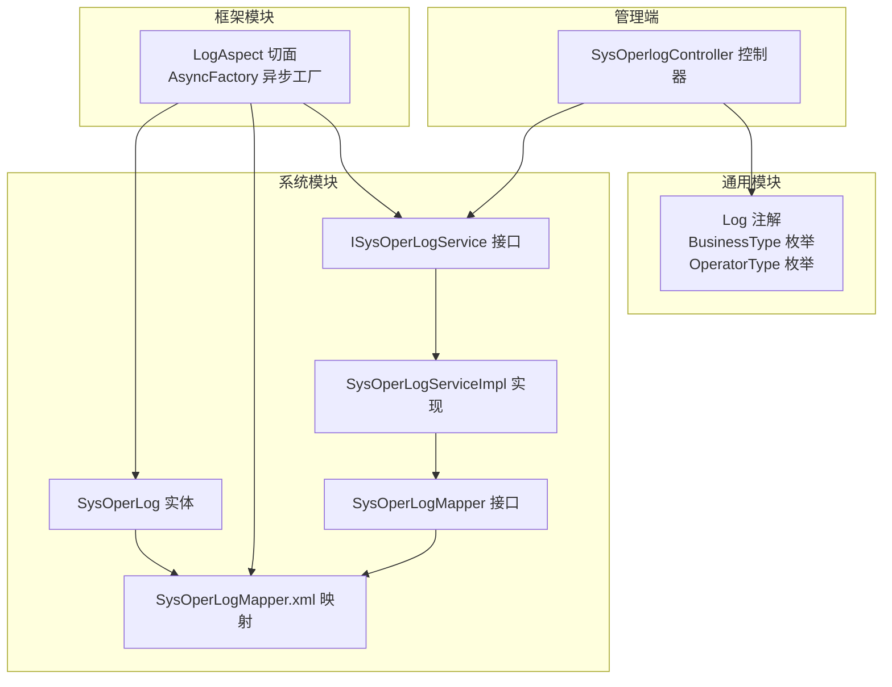
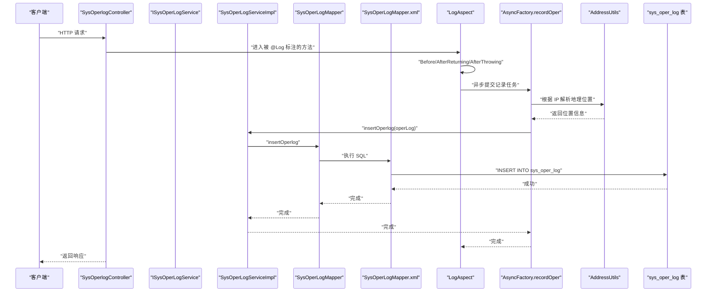
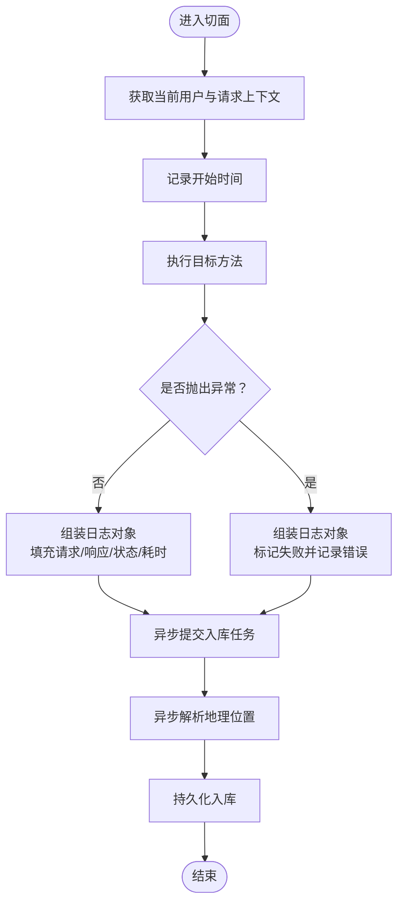
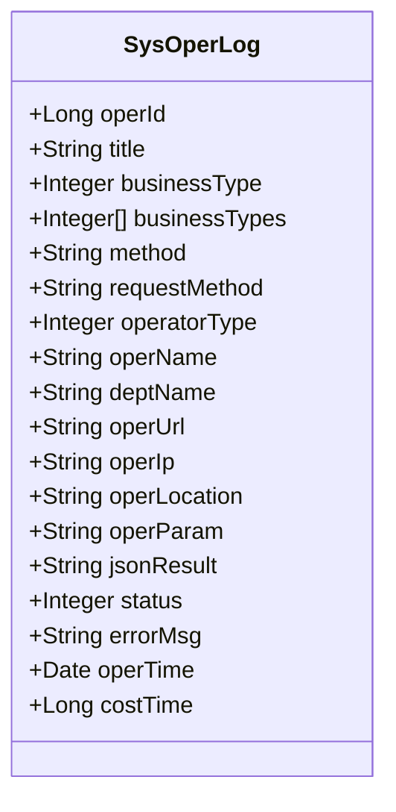
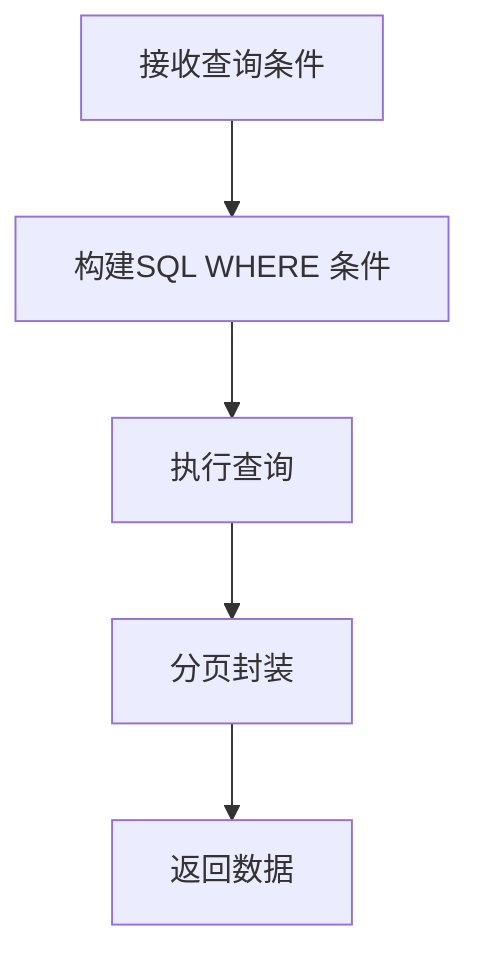
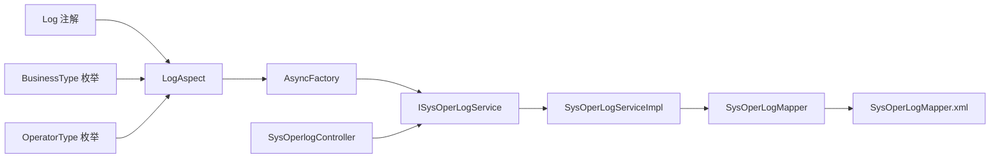

# 操作日志监控

<cite>
**本文引用的文件**
- [LogAspect.java](file://ruoyi-framework/src/main/java/com/ruoyi/framework/aspectj/LogAspect.java)
- [SysOperLog.java](file://ruoyi-system/src/main/java/com/ruoyi/system/domain/SysOperLog.java)
- [ISysOperLogService.java](file://ruoyi-system/src/main/java/com/ruoyi/system/service/ISysOperLogService.java)
- [SysOperLogServiceImpl.java](file://ruoyi-system/src/main/java/com/ruoyi/system/service/impl/SysOperLogServiceImpl.java)
- [SysOperLogMapper.java](file://ruoyi-system/src/main/java/com/ruoyi/system/mapper/SysOperLogMapper.java)
- [SysOperLogMapper.xml](file://ruoyi-system/src/main/resources/mapper/system/SysOperLogMapper.xml)
- [SysOperlogController.java](file://ruoyi-admin/src/main/java/com/ruoyi/web/controller/monitor/SysOperlogController.java)
- [Log.java](file://ruoyi-common/src/main/java/com/ruoyi/common/annotation/Log.java)
- [BusinessType.java](file://ruoyi-common/src/main/java/com/ruoyi/common/enums/BusinessType.java)
- [OperatorType.java](file://ruoyi-common/src/main/java/com/ruoyi/common/enums/OperatorType.java)
- [AsyncFactory.java](file://ruoyi-framework/src/main/java/com/ruoyi/framework/manager/factory/AsyncFactory.java)
- [AddressUtils.java](file://ruoyi-common/src/main/java/com/ruoyi/common/utils/AddressUtils.java)
</cite>

## 目录
1. [简介](#简介)
2. [项目结构](#项目结构)
3. [核心组件](#核心组件)
4. [架构总览](#架构总览)
5. [详细组件分析](#详细组件分析)
6. [依赖分析](#依赖分析)
7. [性能考虑](#性能考虑)
8. [故障排查指南](#故障排查指南)
9. [结论](#结论)
10. [附录](#附录)

## 简介
本文件围绕“操作日志监控”主题，系统性阐述RuoYi框架中的操作日志记录机制与管理能力。内容覆盖日志切面实现原理、SysOperLog实体结构、日志分类与级别、标准化处理策略、查询/筛选/统计能力、页面操作指南、存储与清理策略、日志分析与性能优化建议等。目标是帮助开发者与运维人员快速理解并高效使用该功能。

## 项目结构
操作日志相关代码分布在通用模块、框架模块、系统模块与管理端控制器四个层面，职责清晰、层次分明：
- 通用模块：注解与枚举（自定义日志注解、业务类型、操作人类别）
- 框架模块：AOP切面（统一拦截控制器方法，采集请求/响应、异常、耗时等）
- 系统模块：领域模型、服务接口与实现、持久层映射
- 管理端：控制器暴露查询、导出、删除、清空、详情等管理接口

**图表来源**
- [Log.java:1-51](file://ruoyi-common/src/main/java/com/ruoyi/common/annotation/Log.java#L1-L51)
- [BusinessType.java:1-60](file://ruoyi-common/src/main/java/com/ruoyi/common/enums/BusinessType.java#L1-L60)
- [OperatorType.java:1-25](file://ruoyi-common/src/main/java/com/ruoyi/common/enums/OperatorType.java#L1-L25)
- [LogAspect.java:1-266](file://ruoyi-framework/src/main/java/com/ruoyi/framework/aspectj/LogAspect.java#L1-L266)
- [AsyncFactory.java:1-152](file://ruoyi-framework/src/main/java/com/ruoyi/framework/manager/factory/AsyncFactory.java#L1-L152)
- [SysOperLog.java:1-293](file://ruoyi-system/src/main/java/com/ruoyi/system/domain/SysOperLog.java#L1-L293)
- [ISysOperLogService.java:1-49](file://ruoyi-system/src/main/java/com/ruoyi/system/service/ISysOperLogService.java#L1-L49)
- [SysOperLogServiceImpl.java:1-78](file://ruoyi-system/src/main/java/com/ruoyi/system/service/impl/SysOperLogServiceImpl.java#L1-L78)
- [SysOperLogMapper.java:1-49](file://ruoyi-system/src/main/java/com/ruoyi/system/mapper/SysOperLogMapper.java#L1-L49)
- [SysOperLogMapper.xml:1-86](file://ruoyi-system/src/main/resources/mapper/system/SysOperLogMapper.xml#L1-L86)
- [SysOperlogController.java:1-91](file://ruoyi-admin/src/main/java/com/ruoyi/web/controller/monitor/SysOperlogController.java#L1-L91)

**章节来源**
- [LogAspect.java:1-266](file://ruoyi-framework/src/main/java/com/ruoyi/framework/aspectj/LogAspect.java#L1-L266)
- [SysOperLog.java:1-293](file://ruoyi-system/src/main/java/com/ruoyi/system/domain/SysOperLog.java#L1-L293)
- [SysOperLogMapper.xml:1-86](file://ruoyi-system/src/main/resources/mapper/system/SysOperLogMapper.xml#L1-L86)
- [SysOperlogController.java:1-91](file://ruoyi-admin/src/main/java/com/ruoyi/web/controller/monitor/SysOperlogController.java#L1-L91)

## 核心组件
- 自定义注解与枚举
  - 注解：用于在控制器方法上标注日志标题、业务类型、操作人类别、是否保存请求/响应参数、排除参数名等
  - 枚举：业务类型（新增/修改/删除/授权/导出/导入/强退/生成代码/清空等）、操作人类别（后台用户/手机端用户/其他）
- 切面：统一拦截带注解的方法，采集请求上下文、异常信息、响应结果、耗时等，异步入库
- 实体：SysOperLog，承载所有日志字段，含业务类型、请求方法、请求方式、操作人、部门、URL、IP、位置、参数、状态、错误信息、时间、耗时等
- 服务与持久层：提供新增、分页查询、批量删除、详情、清空等能力
- 控制器：提供前端页面与接口，支持列表查询、导出、删除、详情、清空

**章节来源**
- [Log.java:1-51](file://ruoyi-common/src/main/java/com/ruoyi/common/annotation/Log.java#L1-L51)
- [BusinessType.java:1-60](file://ruoyi-common/src/main/java/com/ruoyi/common/enums/BusinessType.java#L1-L60)
- [OperatorType.java:1-25](file://ruoyi-common/src/main/java/com/ruoyi/common/enums/OperatorType.java#L1-L25)
- [LogAspect.java:85-137](file://ruoyi-framework/src/main/java/com/ruoyi/framework/aspectj/LogAspect.java#L85-L137)
- [SysOperLog.java:10-88](file://ruoyi-system/src/main/java/com/ruoyi/system/domain/SysOperLog.java#L10-L88)
- [ISysOperLogService.java:11-49](file://ruoyi-system/src/main/java/com/ruoyi/system/service/ISysOperLogService.java#L11-L49)
- [SysOperLogMapper.xml:37-68](file://ruoyi-system/src/main/resources/mapper/system/SysOperLogMapper.xml#L37-L68)
- [SysOperlogController.java:44-91](file://ruoyi-admin/src/main/java/com/ruoyi/web/controller/monitor/SysOperlogController.java#L44-L91)

## 架构总览
下图展示从请求进入控制器到日志入库的关键流程，以及异步落库与地理位置解析的细节。

**图表来源**
- [SysOperlogController.java:44-51](file://ruoyi-admin/src/main/java/com/ruoyi/web/controller/monitor/SysOperlogController.java#L44-L51)
- [LogAspect.java:85-137](file://ruoyi-framework/src/main/java/com/ruoyi/framework/aspectj/LogAspect.java#L85-L137)
- [AsyncFactory.java:84-96](file://ruoyi-framework/src/main/java/com/ruoyi/framework/manager/factory/AsyncFactory.java#L84-L96)
- [AddressUtils.java:25-53](file://ruoyi-common/src/main/java/com/ruoyi/common/utils/AddressUtils.java#L25-L53)
- [SysOperLogMapper.xml:32-35](file://ruoyi-system/src/main/resources/mapper/system/SysOperLogMapper.xml#L32-L35)

## 详细组件分析

### 日志切面 LogAspect 的实现原理
- 生命周期钩子
  - Before：记录开始时间，为后续耗时计算做准备
  - AfterReturning：在方法返回后收集日志并异步入库
  - AfterThrowing：捕获异常，标记状态为失败并记录错误信息
- 关键采集项
  - 当前用户与部门、请求URL、请求方式、方法签名、IP、地理位置、请求参数、响应JSON、状态、错误消息、耗时
- 安全与合规
  - 敏感字段自动过滤（如密码相关），支持额外排除参数名
  - 参数长度限制，避免超长参数写入
- 异步化
  - 使用异步任务工厂提交入库任务，避免阻塞主线程
  - 地理位置解析在异步任务中进行，减少接口延迟

**图表来源**
- [LogAspect.java:56-83](file://ruoyi-framework/src/main/java/com/ruoyi/framework/aspectj/LogAspect.java#L56-L83)
- [LogAspect.java:85-137](file://ruoyi-framework/src/main/java/com/ruoyi/framework/aspectj/LogAspect.java#L85-L137)
- [AsyncFactory.java:84-96](file://ruoyi-framework/src/main/java/com/ruoyi/framework/manager/factory/AsyncFactory.java#L84-L96)

**章节来源**
- [LogAspect.java:56-137](file://ruoyi-framework/src/main/java/com/ruoyi/framework/aspectj/LogAspect.java#L56-L137)
- [LogAspect.java:173-229](file://ruoyi-framework/src/main/java/com/ruoyi/framework/aspectj/LogAspect.java#L173-L229)
- [AsyncFactory.java:84-96](file://ruoyi-framework/src/main/java/com/ruoyi/framework/manager/factory/AsyncFactory.java#L84-L96)

### SysOperLog 实体的数据结构
- 字段覆盖范围广，便于多维检索与分析
  - 基本信息：标题、业务类型、请求方法、请求方式、操作类别
  - 操作人与部门：operName、deptName
  - 请求与位置：operUrl、operIp、operLocation
  - 参数与结果：operParam、jsonResult
  - 状态与错误：status、errorMsg
  - 时间与耗时：operTime、costTime
- 业务类型与操作类别采用枚举映射，便于前端展示与筛选
- 支持导出注解，便于Excel导出

**图表来源**
- [SysOperLog.java:15-88](file://ruoyi-system/src/main/java/com/ruoyi/system/domain/SysOperLog.java#L15-L88)

**章节来源**
- [SysOperLog.java:15-293](file://ruoyi-system/src/main/java/com/ruoyi/system/domain/SysOperLog.java#L15-L293)

### 日志分类、日志级别与标准化处理
- 日志分类（业务类型）
  - 通过枚举定义：其他、新增、修改、删除、授权、导出、导入、强退、生成代码、清空
  - 控制器注解直接指定，便于统一规范
- 日志级别（状态）
  - 成功/失败，异常时记录错误消息
- 标准化处理
  - 统一字段命名与长度限制
  - 敏感字段过滤与参数长度截断
  - 地理位置解析与IP白/内网判断

**章节来源**
- [BusinessType.java:8-60](file://ruoyi-common/src/main/java/com/ruoyi/common/enums/BusinessType.java#L8-L60)
- [OperatorType.java:8-25](file://ruoyi-common/src/main/java/com/ruoyi/common/enums/OperatorType.java#L8-L25)
- [LogAspect.java:44-51](file://ruoyi-framework/src/main/java/com/ruoyi/framework/aspectj/LogAspect.java#L44-L51)
- [LogAspect.java:109-113](file://ruoyi-framework/src/main/java/com/ruoyi/framework/aspectj/LogAspect.java#L109-L113)

### 查询、筛选与统计分析
- 查询入口
  - 控制器提供分页列表查询接口，基于SysOperLog条件进行过滤
- 筛选条件
  - IP、标题、业务类型、业务类型集合、状态、操作人、时间区间等
- 统计分析
  - 可基于业务类型、操作人、时间维度进行聚合统计（由前端或报表工具实现）

**图表来源**
- [SysOperLogMapper.xml:37-68](file://ruoyi-system/src/main/resources/mapper/system/SysOperLogMapper.xml#L37-L68)
- [SysOperlogController.java:44-51](file://ruoyi-admin/src/main/java/com/ruoyi/web/controller/monitor/SysOperlogController.java#L44-L51)

**章节来源**
- [SysOperLogMapper.xml:37-68](file://ruoyi-system/src/main/resources/mapper/system/SysOperLogMapper.xml#L37-L68)
- [SysOperlogController.java:44-51](file://ruoyi-admin/src/main/java/com/ruoyi/web/controller/monitor/SysOperlogController.java#L44-L51)

### 页面操作指南
- 页面入口与权限
  - 路径：monitor/operlog，需具备相应权限
- 主要功能
  - 列表查询：按条件筛选，分页展示
  - 导出：将筛选结果导出为Excel
  - 删除：支持单条与批量删除
  - 清空：清空全部日志（谨慎使用）
  - 详情：查看某条日志的完整信息

**章节来源**
- [SysOperlogController.java:36-91](file://ruoyi-admin/src/main/java/com/ruoyi/web/controller/monitor/SysOperlogController.java#L36-L91)

### 存储策略、保留期限与清理机制
- 存储策略
  - 异步入库，使用MyBatis映射，插入当前系统时间作为operTime
- 保留期限
  - 仓库未内置默认保留期配置，可在业务侧通过定时任务或外部策略控制
- 清理机制
  - 提供清空接口（Truncate），用于运维场景下的周期性清理

**章节来源**
- [SysOperLogMapper.xml:32-35](file://ruoyi-system/src/main/resources/mapper/system/SysOperLogMapper.xml#L32-L35)
- [SysOperLogMapper.xml:82-84](file://ruoyi-system/src/main/resources/mapper/system/SysOperLogMapper.xml#L82-L84)
- [SysOperlogController.java:81-89](file://ruoyi-admin/src/main/java/com/ruoyi/web/controller/monitor/SysOperlogController.java#L81-L89)

### 日志分析工具与异常行为检测
- 工具使用
  - 基于导出的Excel数据，结合BI工具或脚本进行热门操作统计、趋势分析
- 异常行为检测
  - 可通过状态字段识别失败操作，结合错误消息、IP、时间段进行聚类分析
  - 建议结合IP地理位置与UA信息进行异常登录/操作识别

**章节来源**
- [SysOperLog.java:74-80](file://ruoyi-system/src/main/java/com/ruoyi/system/domain/SysOperLog.java#L74-L80)
- [AddressUtils.java:25-53](file://ruoyi-common/src/main/java/com/ruoyi/common/utils/AddressUtils.java#L25-L53)

## 依赖分析
- 切面依赖
  - 依赖注解与枚举以获取日志元信息
  - 依赖异步工厂与地址解析工具
- 服务与持久层
  - 服务层聚合Mapper接口，提供统一业务语义
  - Mapper映射XML，实现条件查询、批量删除、清空等SQL
- 控制器依赖
  - 依赖服务层与注解，提供REST接口与页面跳转

**图表来源**
- [Log.java:19-50](file://ruoyi-common/src/main/java/com/ruoyi/common/annotation/Log.java#L19-L50)
- [BusinessType.java:8-60](file://ruoyi-common/src/main/java/com/ruoyi/common/enums/BusinessType.java#L8-L60)
- [OperatorType.java:8-25](file://ruoyi-common/src/main/java/com/ruoyi/common/enums/OperatorType.java#L8-L25)
- [LogAspect.java:19-31](file://ruoyi-framework/src/main/java/com/ruoyi/framework/aspectj/LogAspect.java#L19-L31)
- [AsyncFactory.java:84-96](file://ruoyi-framework/src/main/java/com/ruoyi/framework/manager/factory/AsyncFactory.java#L84-L96)
- [ISysOperLogService.java:11-49](file://ruoyi-system/src/main/java/com/ruoyi/system/service/ISysOperLogService.java#L11-L49)
- [SysOperLogServiceImpl.java:16-78](file://ruoyi-system/src/main/java/com/ruoyi/system/service/impl/SysOperLogServiceImpl.java#L16-L78)
- [SysOperLogMapper.java:11-49](file://ruoyi-system/src/main/java/com/ruoyi/system/mapper/SysOperLogMapper.java#L11-L49)
- [SysOperLogMapper.xml:1-86](file://ruoyi-system/src/main/resources/mapper/system/SysOperLogMapper.xml#L1-L86)
- [SysOperlogController.java:27-91](file://ruoyi-admin/src/main/java/com/ruoyi/web/controller/monitor/SysOperlogController.java#L27-L91)

**章节来源**
- [LogAspect.java:19-31](file://ruoyi-framework/src/main/java/com/ruoyi/framework/aspectj/LogAspect.java#L19-L31)
- [SysOperLogMapper.xml:1-86](file://ruoyi-system/src/main/resources/mapper/system/SysOperLogMapper.xml#L1-L86)

## 性能考虑
- 异步化与解耦
  - 切面采集完成后立即返回，入库异步执行，降低接口延迟
- 地理位置解析
  - 异步解析IP地址，避免阻塞请求链路
- 参数与长度控制
  - 敏感字段过滤与参数长度限制，减少无效数据写入
- 分页与条件查询
  - 前端分页+后端条件过滤，避免一次性加载过多数据
- 大数据量处理建议
  - 增加索引：oper_time、business_type、oper_name、oper_ip
  - 按月/季分区或归档历史数据
  - 定时清理过期日志，控制表规模
  - 使用只读副本或缓存热点查询（谨慎评估一致性）

[本节为通用指导，无需特定文件引用]

## 故障排查指南
- 常见问题
  - 日志未入库：确认方法是否带有@Log注解、切面是否生效、异步任务是否执行
  - 地理位置为空：检查地址解析开关与网络连通性
  - 参数缺失：确认是否开启保存请求/响应参数，排除了敏感字段
- 排查步骤
  - 查看切面日志输出与异常栈
  - 核对Mapper条件是否正确匹配请求参数
  - 检查异步线程池与任务队列状态

**章节来源**
- [LogAspect.java:127-132](file://ruoyi-framework/src/main/java/com/ruoyi/framework/aspectj/LogAspect.java#L127-L132)
- [AddressUtils.java:32-53](file://ruoyi-common/src/main/java/com/ruoyi/common/utils/AddressUtils.java#L32-L53)
- [SysOperLogMapper.xml:37-68](file://ruoyi-system/src/main/resources/mapper/system/SysOperLogMapper.xml#L37-L68)

## 结论
RuoYi的操作日志监控体系以AOP切面为核心，结合注解与枚举实现标准化、可扩展的日志采集；通过异步入库与地理位置解析提升性能与可观测性；配套的控制器接口满足日常查询、导出、删除与清空需求。建议在生产环境中配合索引、分区/归档与定期清理策略，确保长期稳定运行与良好性能。

## 附录
- 关键接口与职责
  - LogAspect：统一采集、异步入库、异常处理
  - SysOperLog：日志实体，承载全部字段
  - ISysOperLogService/SysOperLogServiceImpl：业务层封装
  - SysOperLogMapper/SysOperLogMapper.xml：数据访问层
  - SysOperlogController：管理端接口与页面

**章节来源**
- [LogAspect.java:1-266](file://ruoyi-framework/src/main/java/com/ruoyi/framework/aspectj/LogAspect.java#L1-L266)
- [SysOperLog.java:1-293](file://ruoyi-system/src/main/java/com/ruoyi/system/domain/SysOperLog.java#L1-L293)
- [ISysOperLogService.java:1-49](file://ruoyi-system/src/main/java/com/ruoyi/system/service/ISysOperLogService.java#L1-L49)
- [SysOperLogServiceImpl.java:1-78](file://ruoyi-system/src/main/java/com/ruoyi/system/service/impl/SysOperLogServiceImpl.java#L1-L78)
- [SysOperLogMapper.java:1-49](file://ruoyi-system/src/main/java/com/ruoyi/system/mapper/SysOperLogMapper.java#L1-L49)
- [SysOperLogMapper.xml:1-86](file://ruoyi-system/src/main/resources/mapper/system/SysOperLogMapper.xml#L1-L86)
- [SysOperlogController.java:1-91](file://ruoyi-admin/src/main/java/com/ruoyi/web/controller/monitor/SysOperlogController.java#L1-L91)