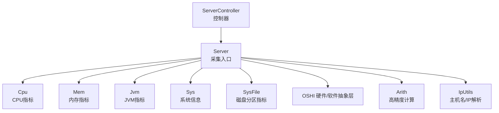
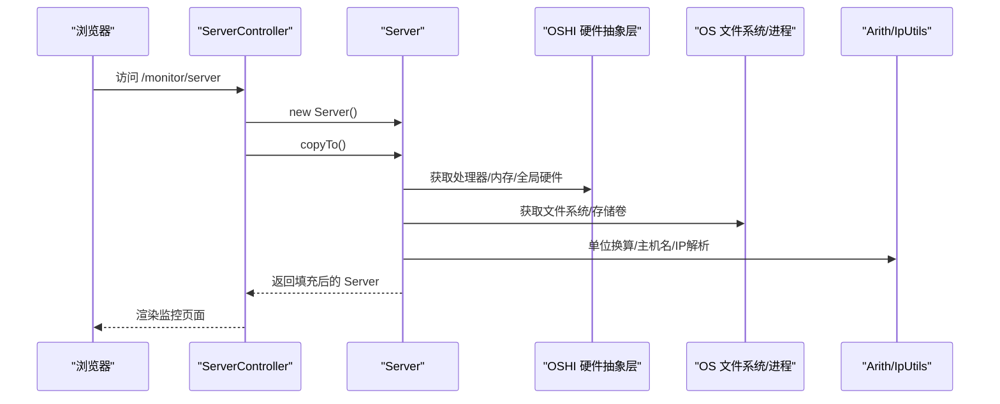
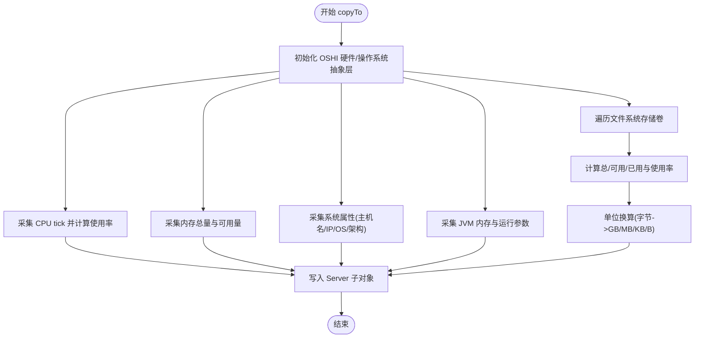
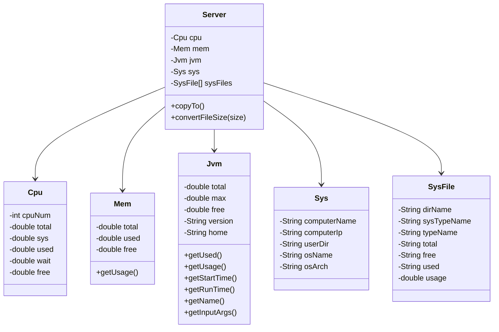
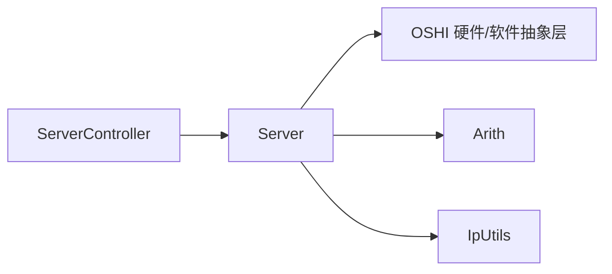

# 服务器监控

<cite>
**本文引用的文件**
- [Server.java](file://ruoyi-framework/src/main/java/com/ruoyi/framework/web/domain/Server.java)
- [Cpu.java](file://ruoyi-framework/src/main/java/com/ruoyi/framework/web/domain/server/Cpu.java)
- [Mem.java](file://ruoyi-framework/src/main/java/com/ruoyi/framework/web/domain/server/Mem.java)
- [Sys.java](file://ruoyi-framework/src/main/java/com/ruoyi/framework/web/domain/server/Sys.java)
- [SysFile.java](file://ruoyi-framework/src/main/java/com/ruoyi/framework/web/domain/server/SysFile.java)
- [Jvm.java](file://ruoyi-framework/src/main/java/com/ruoyi/framework/web/domain/server/Jvm.java)
- [ServerController.java](file://ruoyi-admin/src/main/java/com/ruoyi/web/controller/monitor/ServerController.java)
- [Arith.java](file://ruoyi-common/src/main/java/com/ruoyi/common/utils/Arith.java)
- [IpUtils.java](file://ruoyi-common/src/main/java/com/ruoyi/common/utils/IpUtils.java)
</cite>

## 目录
1. [简介](#简介)
2. [项目结构](#项目结构)
3. [核心组件](#核心组件)
4. [架构总览](#架构总览)
5. [详细组件分析](#详细组件分析)
6. [依赖分析](#依赖分析)
7. [性能考虑](#性能考虑)
8. [故障排除指南](#故障排除指南)
9. [结论](#结论)
10. [附录](#附录)

## 简介
本文件面向运维与开发人员，系统性阐述 RuoYi 项目中的服务器监控能力，覆盖以下主题：
- 实现原理：CPU 使用率、内存占用、磁盘空间、网络状态（通过系统命令与 OSHI 库采集）
- 数据模型：Server 及其子类 Cpu、Mem、Sys、SysFile、Jvm 的设计与字段语义
- 技术实现：系统命令调用、性能指标计算、数据格式转换
- 监控页面：图表展示、实时刷新、阈值设置的使用建议
- 采集频率、存储策略与性能影响
- 常见场景配置示例与故障排除方法

## 项目结构
服务器监控功能主要分布在如下模块与文件：
- 控制器层：ServerController 负责渲染监控页面并注入 Server 对象
- 领域模型层：Server 及其子类（Cpu、Mem、Sys、SysFile、Jvm）封装采集到的系统指标
- 工具与通用库：Arith 提供高精度数值计算；IpUtils 提供主机名与 IP 解析

**图示来源**
- [ServerController.java:16-31](file://ruoyi-admin/src/main/java/com/ruoyi/web/controller/monitor/ServerController.java#L16-L31)
- [Server.java:29-123](file://ruoyi-framework/src/main/java/com/ruoyi/framework/web/domain/Server.java#L29-L123)
- [Arith.java:11-114](file://ruoyi-common/src/main/java/com/ruoyi/common/utils/Arith.java#L11-L114)
- [IpUtils.java:207-234](file://ruoyi-common/src/main/java/com/ruoyi/common/utils/IpUtils.java#L207-L234)

**章节来源**
- [ServerController.java:16-31](file://ruoyi-admin/src/main/java/com/ruoyi/web/controller/monitor/ServerController.java#L16-L31)
- [Server.java:29-123](file://ruoyi-framework/src/main/java/com/ruoyi/framework/web/domain/Server.java#L29-L123)

## 核心组件
- Server：统一采集入口，负责调用 OSHI 采集 CPU、内存、系统、JVM、磁盘等信息，并进行单位换算与格式化
- Cpu：封装 CPU 核心数、总使用率、系统使用率、用户使用率、等待率、空闲率等
- Mem：封装内存总量、已用、剩余及使用率
- Sys：封装服务器主机名、IP、操作系统名与架构
- SysFile：封装磁盘分区挂载点、类型、总/剩余/已用容量与使用率
- Jvm：封装 JVM 总内存、最大可用内存、空闲内存、已用内存、使用率、版本、JDK 启动/运行时间等

**章节来源**
- [Server.java:29-242](file://ruoyi-framework/src/main/java/com/ruoyi/framework/web/domain/Server.java#L29-L242)
- [Cpu.java:10-102](file://ruoyi-framework/src/main/java/com/ruoyi/framework/web/domain/server/Cpu.java#L10-L102)
- [Mem.java:10-62](file://ruoyi-framework/src/main/java/com/ruoyi/framework/web/domain/server/Mem.java#L10-L62)
- [Sys.java:8-85](file://ruoyi-framework/src/main/java/com/ruoyi/framework/web/domain/server/Sys.java#L8-L85)
- [SysFile.java:8-115](file://ruoyi-framework/src/main/java/com/ruoyi/framework/web/domain/server/SysFile.java#L8-L115)
- [Jvm.java:12-131](file://ruoyi-framework/src/main/java/com/ruoyi/framework/web/domain/server/Jvm.java#L12-L131)

## 架构总览
下图展示了从控制器到数据采集与模型封装的整体流程。

**图示来源**
- [ServerController.java:22-30](file://ruoyi-admin/src/main/java/com/ruoyi/web/controller/monitor/ServerController.java#L22-L30)
- [Server.java:109-123](file://ruoyi-framework/src/main/java/com/ruoyi/framework/web/domain/Server.java#L109-L123)
- [Arith.java:54-112](file://ruoyi-common/src/main/java/com/ruoyi/common/utils/Arith.java#L54-L112)
- [IpUtils.java:207-234](file://ruoyi-common/src/main/java/com/ruoyi/common/utils/IpUtils.java#L207-L234)

## 详细组件分析

### Server 类与采集流程
- 统一入口：copyTo() 调用 OSHI 初始化硬件与操作系统抽象层，随后分别采集 CPU、内存、系统、JVM、磁盘信息
- CPU 采集：两次读取系统 CPU tick 并做差分，结合 OSHI 的 TickType 计算各类使用率
- 内存采集：直接读取全局内存总量与可用量，推导已用与剩余
- 系统信息：通过 Java 属性获取主机名、IP、操作系统名与架构
- JVM 信息：通过 Runtime 与 ManagementFactory 获取内存与运行参数
- 磁盘采集：遍历文件系统存储卷，计算总/可用/已用容量与使用率，并进行人性化单位换算

**图示来源**
- [Server.java:109-240](file://ruoyi-framework/src/main/java/com/ruoyi/framework/web/domain/Server.java#L109-L240)

**章节来源**
- [Server.java:109-240](file://ruoyi-framework/src/main/java/com/ruoyi/framework/web/domain/Server.java#L109-L240)

### 数据模型类关系

**图示来源**
- [Server.java:29-107](file://ruoyi-framework/src/main/java/com/ruoyi/framework/web/domain/Server.java#L29-L107)
- [Cpu.java:10-102](file://ruoyi-framework/src/main/java/com/ruoyi/framework/web/domain/server/Cpu.java#L10-L102)
- [Mem.java:10-62](file://ruoyi-framework/src/main/java/com/ruoyi/framework/web/domain/server/Mem.java#L10-L62)
- [Sys.java:8-85](file://ruoyi-framework/src/main/java/com/ruoyi/framework/web/domain/server/Sys.java#L8-L85)
- [SysFile.java:8-115](file://ruoyi-framework/src/main/java/com/ruoyi/framework/web/domain/server/SysFile.java#L8-L115)
- [Jvm.java:12-131](file://ruoyi-framework/src/main/java/com/ruoyi/framework/web/domain/server/Jvm.java#L12-L131)

**章节来源**
- [Server.java:29-107](file://ruoyi-framework/src/main/java/com/ruoyi/framework/web/domain/Server.java#L29-L107)

### CPU 使用率监控
- 采集方式：通过 OSHI CentralProcessor 两次读取系统 CPU tick，利用 TickType 分类（系统、用户、等待、空闲、中断、软中断、窃取等），计算总 CPU 时间与各分类占比
- 指标含义：
  - 核心数：逻辑处理器数量
  - 总使用率：总 CPU 时间占总时间的比例
  - 系统使用率：内核态 CPU 时间占比
  - 用户使用率：用户态 CPU 时间占比
  - 等待率：IO 等待 CPU 时间占比
  - 空闲率：空闲 CPU 时间占比
- 数据精度：使用 Arith 进行除法与百分比换算，保留两位小数

**章节来源**
- [Server.java:128-149](file://ruoyi-framework/src/main/java/com/ruoyi/framework/web/domain/Server.java#L128-L149)
- [Cpu.java:52-100](file://ruoyi-framework/src/main/java/com/ruoyi/framework/web/domain/server/Cpu.java#L52-L100)
- [Arith.java:54-112](file://ruoyi-common/src/main/java/com/ruoyi/common/utils/Arith.java#L54-L112)

### 内存占用分析
- 采集方式：通过 OSHI GlobalMemory 获取物理内存总量与可用量，推导已用与剩余
- 指标含义：
  - 总量：以 GB 为单位显示
  - 已用：总量 - 可用量
  - 剩余：可用内存
  - 使用率：已用/总量 × 100%
- 数据精度：使用 Arith 进行除法与百分比换算，保留两位小数

**章节来源**
- [Server.java:154-159](file://ruoyi-framework/src/main/java/com/ruoyi/framework/web/domain/Server.java#L154-L159)
- [Mem.java:27-60](file://ruoyi-framework/src/main/java/com/ruoyi/framework/web/domain/server/Mem.java#L27-L60)
- [Arith.java:54-112](file://ruoyi-common/src/main/java/com/ruoyi/common/utils/Arith.java#L54-L112)

### 磁盘空间统计
- 采集方式：通过 OSHI FileSystem 遍历 OSFileStore，读取每个存储卷的总/可用/已用字节
- 指标含义：
  - 盘符路径：挂载点
  - 类型：系统类型与文件类型
  - 总/剩余/已用：采用人性化单位换算（GB/MB/KB/B）
  - 使用率：已用/总量 × 100%
- 单位换算：convertFileSize() 根据字节数自动选择合适单位并格式化输出

**章节来源**
- [Server.java:190-209](file://ruoyi-framework/src/main/java/com/ruoyi/framework/web/domain/Server.java#L190-L209)
- [Server.java:217-240](file://ruoyi-framework/src/main/java/com/ruoyi/framework/web/domain/Server.java#L217-L240)
- [SysFile.java:105-113](file://ruoyi-framework/src/main/java/com/ruoyi/framework/web/domain/server/SysFile.java#L105-L113)

### 系统信息与 JVM 指标
- 系统信息：通过 Java 系统属性获取主机名、IP、操作系统名与架构
- JVM 指标：通过 Runtime 与 ManagementFactory 获取 JVM 内存总量/最大值/空闲值、版本、JDK 路径、启动时间、运行时长、输入参数等

**章节来源**
- [Server.java:164-185](file://ruoyi-framework/src/main/java/com/ruoyi/framework/web/domain/Server.java#L164-L185)
- [Jvm.java:39-130](file://ruoyi-framework/src/main/java/com/ruoyi/framework/web/domain/server/Jvm.java#L39-L130)
- [IpUtils.java:207-234](file://ruoyi-common/src/main/java/com/ruoyi/common/utils/IpUtils.java#L207-L234)

### 监控页面使用指南
- 页面入口：访问 /monitor/server，控制器会创建 Server 并执行 copyTo()，将采集结果放入 ModelMap，再渲染监控页面
- 图表展示：监控页面可基于返回的 Server 对象展示 CPU、内存、磁盘、JVM 等指标
- 实时刷新：建议前端定时轮询接口或采用 WebSocket 推送，按需刷新
- 阈值设置：可在前端对关键指标（CPU 使用率、内存使用率、磁盘使用率）设置告警阈值，超阈触发提示

**章节来源**
- [ServerController.java:22-30](file://ruoyi-admin/src/main/java/com/ruoyi/web/controller/monitor/ServerController.java#L22-L30)

## 依赖分析
- Server 依赖 OSHI 硬件/软件抽象层进行系统信息采集
- Server 依赖 Arith 进行高精度数值计算与格式化
- Server 依赖 IpUtils 进行主机名与 IP 的解析
- ServerController 作为入口控制器，负责装配 Server 并渲染视图

**图示来源**
- [ServerController.java:16-31](file://ruoyi-admin/src/main/java/com/ruoyi/web/controller/monitor/ServerController.java#L16-L31)
- [Server.java:14-22](file://ruoyi-framework/src/main/java/com/ruoyi/framework/web/domain/Server.java#L14-L22)
- [Arith.java:11-114](file://ruoyi-common/src/main/java/com/ruoyi/common/utils/Arith.java#L11-L114)
- [IpUtils.java:12-234](file://ruoyi-common/src/main/java/com/ruoyi/common/utils/IpUtils.java#L12-L234)

**章节来源**
- [ServerController.java:16-31](file://ruoyi-admin/src/main/java/com/ruoyi/web/controller/monitor/ServerController.java#L16-L31)
- [Server.java:14-22](file://ruoyi-framework/src/main/java/com/ruoyi/framework/web/domain/Server.java#L14-L22)

## 性能考虑
- 采集频率：CPU 使用率采用两次 tick 差分，建议采集间隔不短于 1 秒，避免过短间隔导致测量误差增大
- I/O 影响：磁盘与文件系统扫描可能产生 I/O 开销，建议按需刷新或合并多个指标一次采集
- 内存与序列化：大量指标与字符串格式化会增加内存与序列化开销，建议前端按需展示与懒加载
- 精度与开销：Arith 的高精度计算在高频场景下会带来一定 CPU 开销，建议在必要处使用

[本节为通用性能建议，无需具体文件引用]

## 故障排除指南
- 无法获取主机名/IP：检查网络与 DNS 配置，确认 IpUtils 解析逻辑可用
- CPU 使用率为 0 或异常：确认 OSHI 版本与平台兼容性，确保系统 tick 可读
- 内存使用率异常：确认可用内存与总量读取是否来自同一抽象层，避免重复统计
- 磁盘使用率异常：检查文件系统类型与挂载点，确认总/可用/已用字节读取正确
- 页面无数据：确认 ServerController 正常执行 copyTo() 并将 server 注入 ModelMap

**章节来源**
- [IpUtils.java:207-234](file://ruoyi-common/src/main/java/com/ruoyi/common/utils/IpUtils.java#L207-L234)
- [Server.java:109-240](file://ruoyi-framework/src/main/java/com/ruoyi/framework/web/domain/Server.java#L109-L240)
- [ServerController.java:22-30](file://ruoyi-admin/src/main/java/com/ruoyi/web/controller/monitor/ServerController.java#L22-L30)

## 结论
RuoYi 的服务器监控以 OSHI 为核心采集引擎，结合高精度数值工具与系统属性，形成覆盖 CPU、内存、磁盘、系统与 JVM 的完整指标体系。通过控制器统一装配与页面渲染，可快速构建可视化监控界面。实际部署中应根据业务负载合理设置采集频率与前端刷新策略，确保性能与可观测性的平衡。

[本节为总结性内容，无需具体文件引用]

## 附录
- 常见场景配置示例（概念性指导）
  - 生产环境：CPU/内存/磁盘使用率阈值分别为 80%/85%/90%，采集间隔 5-10 秒
  - 开发/测试环境：阈值适当放宽，采集间隔 10-15 秒，减少资源消耗
  - 高 IO 场景：磁盘指标单独采样，降低与其他指标并发采集的冲突
- 常见问题排查清单
  - 确认 OSHI 依赖版本与操作系统兼容
  - 检查 JVM 参数与 GC 行为对内存指标的影响
  - 核对挂载点与文件系统类型，避免跨平台差异

[本节为概念性内容，无需具体文件引用]