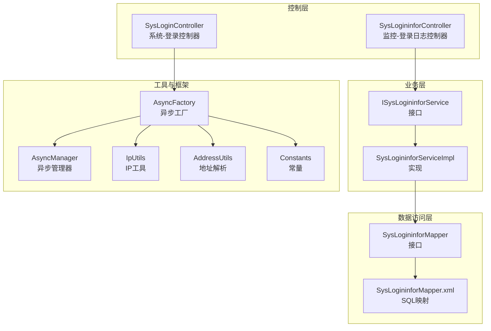
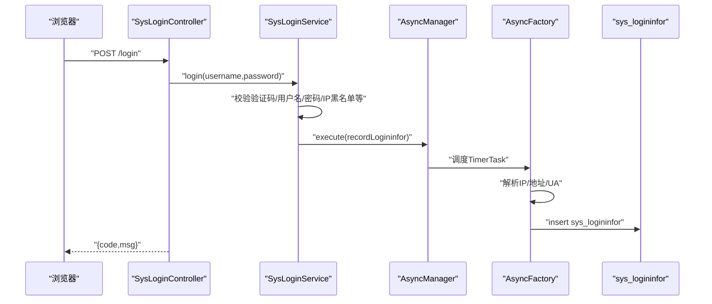
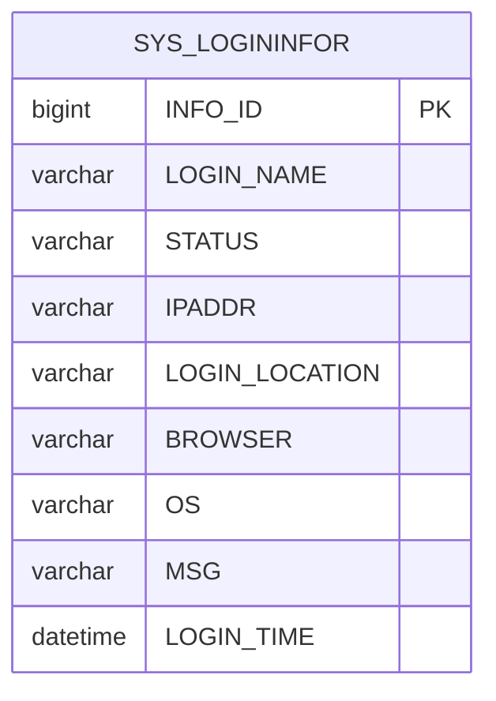
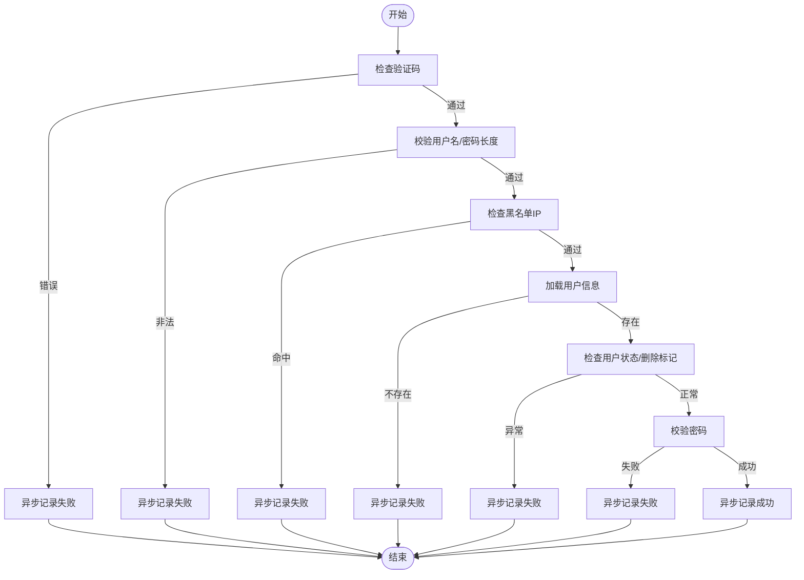
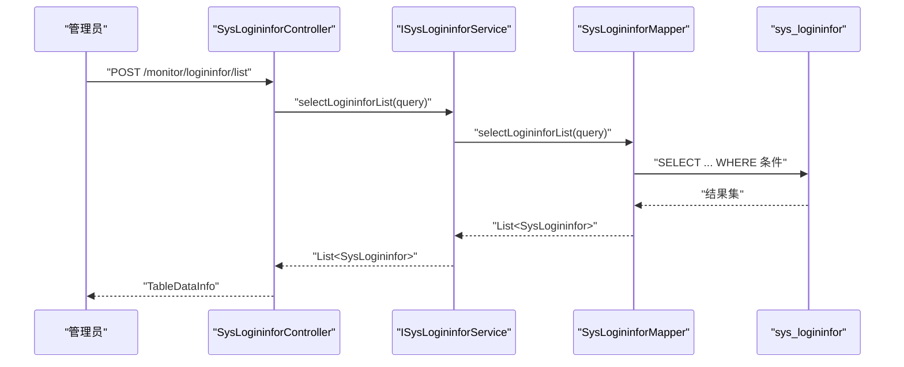
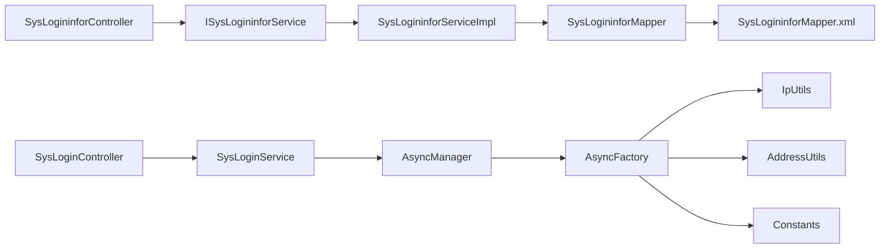

# 登录日志监控

<cite>
**本文引用的文件**
- [SysLogininfor.java](file://ruoyi-system/src/main/java/com/ruoyi/system/domain/SysLogininfor.java)
- [SysLogininforMapper.java](file://ruoyi-system/src/main/java/com/ruoyi/system/mapper/SysLogininforMapper.java)
- [SysLogininforMapper.xml](file://ruoyi-system/src/main/resources/mapper/system/SysLogininforMapper.xml)
- [ISysLogininforService.java](file://ruoyi-system/src/main/java/com/ruoyi/system/service/ISysLogininforService.java)
- [SysLogininforServiceImpl.java](file://ruoyi-system/src/main/java/com/ruoyi/system/service/impl/SysLogininforServiceImpl.java)
- [SysLogininforController.java](file://ruoyi-admin/src/main/java/com/ruoyi/web/controller/monitor/SysLogininforController.java)
- [SysLoginController.java](file://ruoyi-admin/src/main/java/com/ruoyi/web/controller/system/SysLoginController.java)
- [SysLoginService.java](file://ruoyi-framework/src/main/java/com/ruoyi/framework/shiro/service/SysLoginService.java)
- [AsyncFactory.java](file://ruoyi-framework/src/main/java/com/ruoyi/framework/manager/factory/AsyncFactory.java)
- [AsyncManager.java](file://ruoyi-framework/src/main/java/com/ruoyi/framework/manager/AsyncManager.java)
- [IpUtils.java](file://ruoyi-common/src/main/java/com/ruoyi/common/utils/IpUtils.java)
- [AddressUtils.java](file://ruoyi-common/src/main/java/com/ruoyi/common/utils/AddressUtils.java)
- [Constants.java](file://ruoyi-common/src/main/java/com/ruoyi/common/constant/Constants.java)
</cite>

## 目录
1. [简介](#简介)
2. [项目结构](#项目结构)
3. [核心组件](#核心组件)
4. [架构总览](#架构总览)
5. [详细组件分析](#详细组件分析)
6. [依赖分析](#依赖分析)
7. [性能考虑](#性能考虑)
8. [故障排查指南](#故障排查指南)
9. [结论](#结论)
10. [附录](#附录)

## 简介
本文件围绕登录日志监控功能进行系统化说明，覆盖登录行为记录与采集、登录状态跟踪、异常登录检测与安全审计、日志查询/筛选/统计、页面操作指南、安全策略配置、数据分析与预警、合规报告生成，以及性能优化与大数据量处理方案。目标是帮助技术与非技术读者快速理解并有效使用登录日志监控能力。

## 项目结构
登录日志监控涉及四层分工清晰的模块：
- 控制层：负责页面与接口入口，处理分页、导出、删除、清空、解锁等操作。
- 业务层：封装登录日志的新增、查询、批量删除、清空等服务逻辑。
- 数据访问层：通过MyBatis映射SQL，完成插入、查询、删除、清空等持久化操作。
- 工具与框架层：异步记录登录信息、解析IP/地址、解析UA提取浏览器与操作系统、统一常量定义等。

图表来源
- [SysLogininforController.java:1-95](file://ruoyi-admin/src/main/java/com/ruoyi/web/controller/monitor/SysLogininforController.java#L1-95)
- [SysLoginController.java:1-83](file://ruoyi-admin/src/main/java/com/ruoyi/web/controller/system/SysLoginController.java#L1-83)
- [ISysLogininforService.java:1-41](file://ruoyi-system/src/main/java/com/ruoyi/system/service/ISysLogininforService.java#L1-41)
- [SysLogininforServiceImpl.java:1-67](file://ruoyi-system/src/main/java/com/ruoyi/system/service/impl/SysLogininforServiceImpl.java#L1-67)
- [SysLogininforMapper.java:1-43](file://ruoyi-system/src/main/java/com/ruoyi/system/mapper/SysLogininforMapper.java#L1-43)
- [SysLogininforMapper.xml:1-56](file://ruoyi-system/src/main/resources/mapper/system/SysLogininforMapper.xml#L1-56)
- [AsyncFactory.java:1-152](file://ruoyi-framework/src/main/java/com/ruoyi/framework/manager/factory/AsyncFactory.java#L1-152)
- [AsyncManager.java:1-56](file://ruoyi-framework/src/main/java/com/ruoyi/framework/manager/AsyncManager.java#L1-56)
- [IpUtils.java:1-370](file://ruoyi-common/src/main/java/com/ruoyi/common/utils/IpUtils.java#L1-370)
- [AddressUtils.java:1-55](file://ruoyi-common/src/main/java/com/ruoyi/common/utils/AddressUtils.java#L1-55)
- [Constants.java:1-154](file://ruoyi-common/src/main/java/com/ruoyi/common/constant/Constants.java#L1-154)

章节来源
- [SysLogininforController.java:1-95](file://ruoyi-admin/src/main/java/com/ruoyi/web/controller/monitor/SysLogininforController.java#L1-95)
- [SysLogininforMapper.xml:1-56](file://ruoyi-system/src/main/resources/mapper/system/SysLogininforMapper.xml#L1-56)

## 核心组件
- 登录日志实体：SysLogininfor，承载登录账号、状态、IP、登录地点、浏览器、操作系统、消息、时间等字段，用于记录与展示。
- 登录日志服务：ISysLogininforService与SysLogininforServiceImpl，提供新增、查询、批量删除、清空等能力。
- 登录日志数据访问：SysLogininforMapper接口与SysLogininforMapper.xml，提供插入、条件查询、批量删除、清空等SQL映射。
- 登录控制器：SysLogininforController，提供页面跳转、分页列表、导出、删除、清空、解锁等接口。
- 登录流程与记录：SysLoginController处理登录请求；SysLoginService在登录前后触发异步记录；AsyncFactory/AsyncManager负责异步落库与日志输出。
- 地址与设备解析：IpUtils解析真实IP；AddressUtils基于IP查询地理信息；User-Agent解析浏览器与操作系统（由AsyncFactory间接使用）。
- 常量定义：Constants统一登录成功/失败等状态常量。

章节来源
- [SysLogininfor.java:1-159](file://ruoyi-system/src/main/java/com/ruoyi/system/domain/SysLogininfor.java#L1-159)
- [ISysLogininforService.java:1-41](file://ruoyi-system/src/main/java/com/ruoyi/system/service/ISysLogininforService.java#L1-41)
- [SysLogininforServiceImpl.java:1-67](file://ruoyi-system/src/main/java/com/ruoyi/system/service/impl/SysLogininforServiceImpl.java#L1-67)
- [SysLogininforMapper.java:1-43](file://ruoyi-system/src/main/java/com/ruoyi/system/mapper/SysLogininforMapper.java#L1-43)
- [SysLogininforMapper.xml:1-56](file://ruoyi-system/src/main/resources/mapper/system/SysLogininforMapper.xml#L1-56)
- [SysLogininforController.java:1-95](file://ruoyi-admin/src/main/java/com/ruoyi/web/controller/monitor/SysLogininforController.java#L1-95)
- [SysLoginController.java:1-83](file://ruoyi-admin/src/main/java/com/ruoyi/web/controller/system/SysLoginController.java#L1-83)
- [SysLoginService.java:1-185](file://ruoyi-framework/src/main/java/com/ruoyi/framework/shiro/service/SysLoginService.java#L1-185)
- [AsyncFactory.java:1-152](file://ruoyi-framework/src/main/java/com/ruoyi/framework/manager/factory/AsyncFactory.java#L1-152)
- [AsyncManager.java:1-56](file://ruoyi-framework/src/main/java/com/ruoyi/framework/manager/AsyncManager.java#L1-56)
- [IpUtils.java:1-370](file://ruoyi-common/src/main/java/com/ruoyi/common/utils/IpUtils.java#L1-370)
- [AddressUtils.java:1-55](file://ruoyi-common/src/main/java/com/ruoyi/common/utils/AddressUtils.java#L1-55)
- [Constants.java:1-154](file://ruoyi-common/src/main/java/com/ruoyi/common/constant/Constants.java#L1-154)

## 架构总览
登录日志监控采用“同步登录+异步记录”的设计：登录控制器接收请求，登录服务执行校验与权限设置，随后通过异步工厂记录登录日志，最终写入数据库并输出系统日志。监控页面提供查询、筛选、导出、删除、清空、解锁等功能。

图表来源
- [SysLoginController.java:55-75](file://ruoyi-admin/src/main/java/com/ruoyi/web/controller/system/SysLoginController.java#L55-75)
- [SysLoginService.java:54-131](file://ruoyi-framework/src/main/java/com/ruoyi/framework/shiro/service/SysLoginService.java#L54-131)
- [AsyncManager.java:43-46](file://ruoyi-framework/src/main/java/com/ruoyi/framework/manager/AsyncManager.java#L43-46)
- [AsyncFactory.java:107-149](file://ruoyi-framework/src/main/java/com/ruoyi/framework/manager/factory/AsyncFactory.java#L107-149)
- [SysLogininforMapper.xml:19-22](file://ruoyi-system/src/main/resources/mapper/system/SysLogininforMapper.xml#L19-22)

## 详细组件分析

### 实体与数据模型
- SysLogininfor实体包含登录关键字段：账号、状态（成功/失败）、IP、登录地点、浏览器、操作系统、消息、登录时间等，便于审计与分析。
- Mapper XML对字段进行结果映射，并提供按IP、状态、账号、时间范围的动态查询条件。

图表来源
- [SysLogininfor.java:15-159](file://ruoyi-system/src/main/java/com/ruoyi/system/domain/SysLogininfor.java#L15-159)
- [SysLogininforMapper.xml:7-17](file://ruoyi-system/src/main/resources/mapper/system/SysLogininforMapper.xml#L7-17)

章节来源
- [SysLogininfor.java:19-53](file://ruoyi-system/src/main/java/com/ruoyi/system/domain/SysLogininfor.java#L19-53)
- [SysLogininforMapper.xml:24-43](file://ruoyi-system/src/main/resources/mapper/system/SysLogininforMapper.xml#L24-43)

### 登录采集与异步记录
- 登录控制器处理AJAX登录请求，成功或失败均返回统一结构。
- 登录服务在多种异常场景下触发异步记录，包括验证码错误、用户名/密码非法、黑名单IP、用户不存在/已删除/被拉黑、密码校验失败等。
- 异步工厂解析IP、地址、UA，封装SysLogininfor并插入数据库，同时输出sys-user日志。

图表来源
- [SysLoginService.java:56-127](file://ruoyi-framework/src/main/java/com/ruoyi/framework/shiro/service/SysLoginService.java#L56-127)
- [AsyncFactory.java:107-149](file://ruoyi-framework/src/main/java/com/ruoyi/framework/manager/factory/AsyncFactory.java#L107-149)

章节来源
- [SysLoginController.java:55-75](file://ruoyi-admin/src/main/java/com/ruoyi/web/controller/system/SysLoginController.java#L55-75)
- [SysLoginService.java:54-131](file://ruoyi-framework/src/main/java/com/ruoyi/framework/shiro/service/SysLoginService.java#L54-131)
- [AsyncFactory.java:107-149](file://ruoyi-framework/src/main/java/com/ruoyi/framework/manager/factory/AsyncFactory.java#L107-149)

### 查询、筛选与统计
- 控制器提供分页列表接口，结合Mapper的动态WHERE条件，支持按IP、状态、账号、起止时间筛选。
- 支持导出Excel，便于离线分析与审计归档。
- 统计维度建议：按天/小时聚合登录成功/失败数量、按地区分布、按浏览器/操作系统占比、按IP失败次数TopN等。

图表来源
- [SysLogininforController.java:46-53](file://ruoyi-admin/src/main/java/com/ruoyi/web/controller/monitor/SysLogininforController.java#L46-53)
- [SysLogininforMapper.xml:24-43](file://ruoyi-system/src/main/resources/mapper/system/SysLogininforMapper.xml#L24-43)

章节来源
- [SysLogininforController.java:46-64](file://ruoyi-admin/src/main/java/com/ruoyi/web/controller/monitor/SysLogininforController.java#L46-64)
- [SysLogininforMapper.xml:24-43](file://ruoyi-system/src/main/resources/mapper/system/SysLogininforMapper.xml#L24-43)

### 页面操作指南
- 登录日志页面入口：监控-登录日志，支持如下操作：
  - 列表查询：按账号、IP、状态、时间范围筛选。
  - 导出：导出当前筛选结果为Excel。
  - 删除：支持单条与批量删除。
  - 清空：一键清空全部登录日志。
  - 解锁：针对账户锁定后的解锁（清除登录失败缓存）。

章节来源
- [SysLogininforController.java:38-94](file://ruoyi-admin/src/main/java/com/ruoyi/web/controller/monitor/SysLogininforController.java#L38-94)

### 安全策略与异常检测
- 失败次数限制与账户锁定：通过登录服务中的密码校验服务与缓存机制实现，解除锁定需调用解锁接口。
- 黑名单IP：登录前校验配置项中的黑名单IP，命中即拒绝并记录失败。
- 异常登录检测建议：
  - 同一账号短时间多IP登录。
  - 高风险地区登录。
  - 非常规浏览器/操作系统组合。
  - 失败次数阈值告警。

章节来源
- [SysLoginService.java:84-90](file://ruoyi-framework/src/main/java/com/ruoyi/framework/shiro/service/SysLoginService.java#L84-90)
- [SysLogininforController.java:85-93](file://ruoyi-admin/src/main/java/com/ruoyi/web/controller/monitor/SysLogininforController.java#L85-93)

### 安全审计与合规报告
- 审计内容：登录账号、IP、地点、浏览器、操作系统、状态、消息、时间。
- 合规建议：保留周期、最小可见性原则、脱敏处理、审计日志与业务日志关联。
- 报表生成：利用导出功能与BI工具进行可视化分析。

章节来源
- [SysLogininfor.java:23-53](file://ruoyi-system/src/main/java/com/ruoyi/system/domain/SysLogininfor.java#L23-53)
- [SysLogininforController.java:55-64](file://ruoyi-admin/src/main/java/com/ruoyi/web/controller/monitor/SysLogininforController.java#L55-64)

## 依赖分析
- 控制层依赖业务层接口，业务层依赖数据访问层接口，数据访问层依赖Mapper XML。
- 登录流程中，登录服务依赖密码服务、用户服务、菜单服务、配置服务；异步工厂依赖地址解析、UA解析、日志输出、Spring上下文注入。
- 工具类之间存在明确职责边界：IP解析、地址解析、常量定义。

图表来源
- [SysLogininforController.java:32-36](file://ruoyi-admin/src/main/java/com/ruoyi/web/controller/monitor/SysLogininforController.java#L32-36)
- [SysLogininforServiceImpl.java:20-21](file://ruoyi-system/src/main/java/com/ruoyi/system/service/impl/SysLogininforServiceImpl.java#L20-21)
- [SysLogininforMapper.java:11-18](file://ruoyi-system/src/main/java/com/ruoyi/system/mapper/SysLogininforMapper.java#L11-18)
- [SysLogininforMapper.xml:5-17](file://ruoyi-system/src/main/resources/mapper/system/SysLogininforMapper.xml#L5-17)
- [SysLoginController.java:55-75](file://ruoyi-admin/src/main/java/com/ruoyi/web/controller/system/SysLoginController.java#L55-75)
- [SysLoginService.java:39-49](file://ruoyi-framework/src/main/java/com/ruoyi/framework/shiro/service/SysLoginService.java#L39-49)
- [AsyncManager.java:24-24](file://ruoyi-framework/src/main/java/com/ruoyi/framework/manager/AsyncManager.java#L24-24)
- [AsyncFactory.java:107-149](file://ruoyi-framework/src/main/java/com/ruoyi/framework/manager/factory/AsyncFactory.java#L107-149)
- [IpUtils.java:27-57](file://ruoyi-common/src/main/java/com/ruoyi/common/utils/IpUtils.java#L27-57)
- [AddressUtils.java:25-53](file://ruoyi-common/src/main/java/com/ruoyi/common/utils/AddressUtils.java#L25-53)
- [Constants.java:40-66](file://ruoyi-common/src/main/java/com/ruoyi/common/constant/Constants.java#L40-66)

章节来源
- [SysLogininforController.java:32-36](file://ruoyi-admin/src/main/java/com/ruoyi/web/controller/monitor/SysLogininforController.java#L32-36)
- [SysLogininforServiceImpl.java:20-21](file://ruoyi-system/src/main/java/com/ruoyi/system/service/impl/SysLogininforServiceImpl.java#L20-21)
- [SysLogininforMapper.java:11-18](file://ruoyi-system/src/main/java/com/ruoyi/system/mapper/SysLogininforMapper.java#L11-18)
- [SysLogininforMapper.xml:5-17](file://ruoyi-system/src/main/resources/mapper/system/SysLogininforMapper.xml#L5-17)
- [SysLoginController.java:55-75](file://ruoyi-admin/src/main/java/com/ruoyi/web/controller/system/SysLoginController.java#L55-75)
- [SysLoginService.java:39-49](file://ruoyi-framework/src/main/java/com/ruoyi/framework/shiro/service/SysLoginService.java#L39-49)
- [AsyncManager.java:24-24](file://ruoyi-framework/src/main/java/com/ruoyi/framework/manager/AsyncManager.java#L24-24)
- [AsyncFactory.java:107-149](file://ruoyi-framework/src/main/java/com/ruoyi/framework/manager/factory/AsyncFactory.java#L107-149)
- [IpUtils.java:27-57](file://ruoyi-common/src/main/java/com/ruoyi/common/utils/IpUtils.java#L27-57)
- [AddressUtils.java:25-53](file://ruoyi-common/src/main/java/com/ruoyi/common/utils/AddressUtils.java#L25-53)
- [Constants.java:40-66](file://ruoyi-common/src/main/java/com/ruoyi/common/constant/Constants.java#L40-66)

## 性能考虑
- 异步记录：登录成功/失败均通过异步任务记录，避免阻塞主登录链路。
- 分页查询：列表接口使用分页组件，减少一次性传输与渲染压力。
- 索引建议：在sys_logininfor上为login_time、login_name、ipaddr、status建立合适索引以提升查询效率。
- 清理策略：定期清空历史日志，避免表膨胀；提供一键清空接口供运维使用。
- 导出优化：对大结果集导出建议分批或限流，避免内存峰值过高。
- 地址解析：IP地址解析依赖远程接口，建议开启开关与降级策略，避免影响登录性能。

章节来源
- [AsyncManager.java:17-19](file://ruoyi-framework/src/main/java/com/ruoyi/framework/manager/AsyncManager.java#L17-19)
- [AsyncFactory.java:107-149](file://ruoyi-framework/src/main/java/com/ruoyi/framework/manager/factory/AsyncFactory.java#L107-149)
- [SysLogininforController.java:75-83](file://ruoyi-admin/src/main/java/com/ruoyi/web/controller/monitor/SysLogininforController.java#L75-83)
- [AddressUtils.java:32-52](file://ruoyi-common/src/main/java/com/ruoyi/common/utils/AddressUtils.java#L32-52)

## 故障排查指南
- 登录失败但未记录：检查异步线程池是否正常、日志级别是否包含sys-user、IP/UA解析是否异常。
- 查询不到数据：确认筛选条件（账号、IP、状态、时间范围）是否正确，数据库中是否存在对应记录。
- 导出异常：检查导出字段映射与Excel工具类配置，关注大结果集导出的内存占用。
- 解锁无效：确认调用了解锁接口且缓存清理成功。
- 黑名单IP不生效：检查配置项sys.login.blackIPList格式与匹配规则。

章节来源
- [AsyncManager.java:43-46](file://ruoyi-framework/src/main/java/com/ruoyi/framework/manager/AsyncManager.java#L43-46)
- [AsyncFactory.java:116-147](file://ruoyi-framework/src/main/java/com/ruoyi/framework/manager/factory/AsyncFactory.java#L116-147)
- [SysLogininforController.java:55-93](file://ruoyi-admin/src/main/java/com/ruoyi/web/controller/monitor/SysLogininforController.java#L55-93)
- [IpUtils.java:346-370](file://ruoyi-common/src/main/java/com/ruoyi/common/utils/IpUtils.java#L346-370)

## 结论
登录日志监控通过清晰的分层设计与异步记录机制，实现了对用户登录行为的完整追踪与审计。结合查询筛选、导出、清空、解锁等能力，满足日常运维与安全审计需求。建议配合失败次数限制、黑名单IP、异常登录检测与定期清理策略，形成闭环的安全监控体系。

## 附录
- 常用字段说明
  - 登录账号：login_name
  - 登录状态：status（成功/失败）
  - 登录IP：ipaddr
  - 登录地点：login_location
  - 浏览器：browser
  - 操作系统：os
  - 登录时间：login_time
  - 消息：msg

章节来源
- [SysLogininfor.java:23-53](file://ruoyi-system/src/main/java/com/ruoyi/system/domain/SysLogininfor.java#L23-53)
- [SysLogininforMapper.xml:24-43](file://ruoyi-system/src/main/resources/mapper/system/SysLogininforMapper.xml#L24-43)