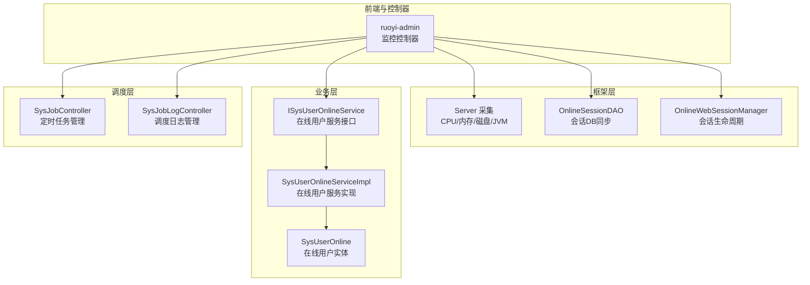
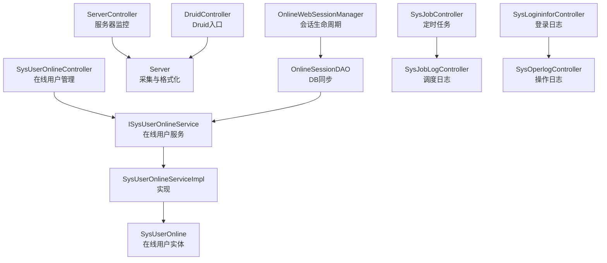
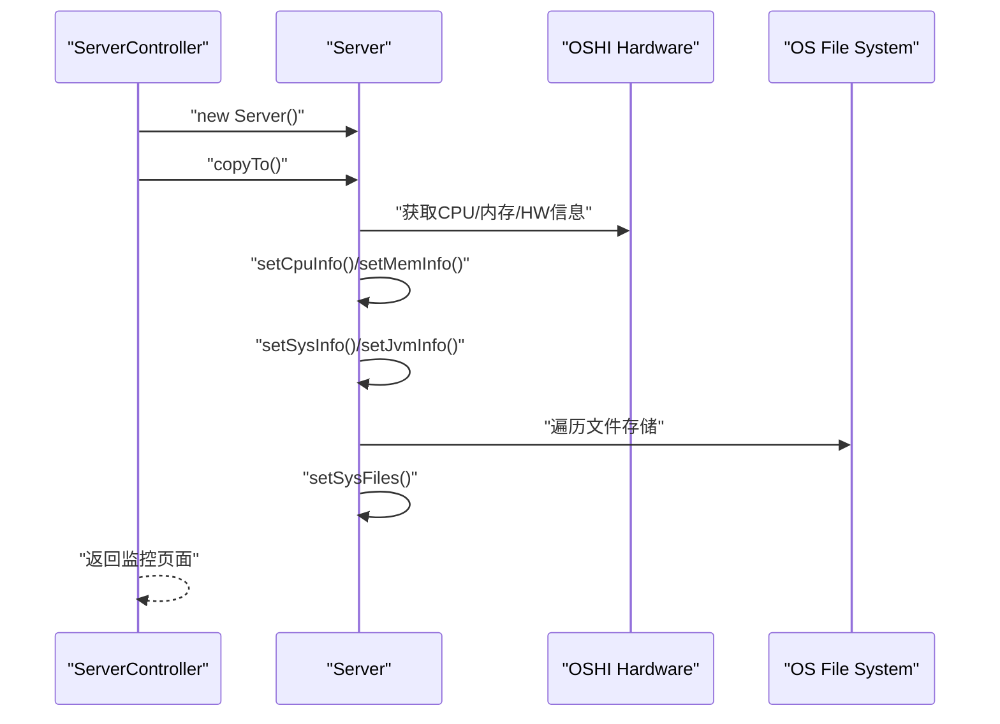
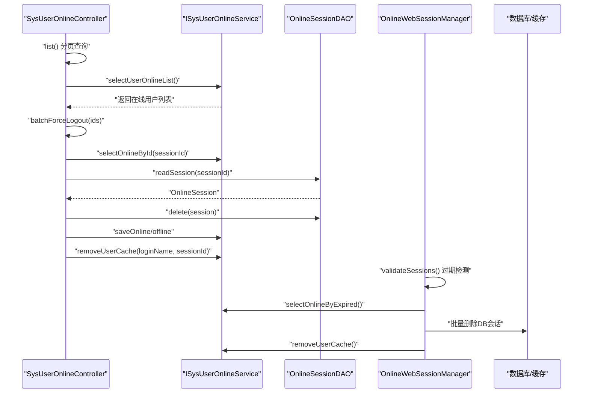
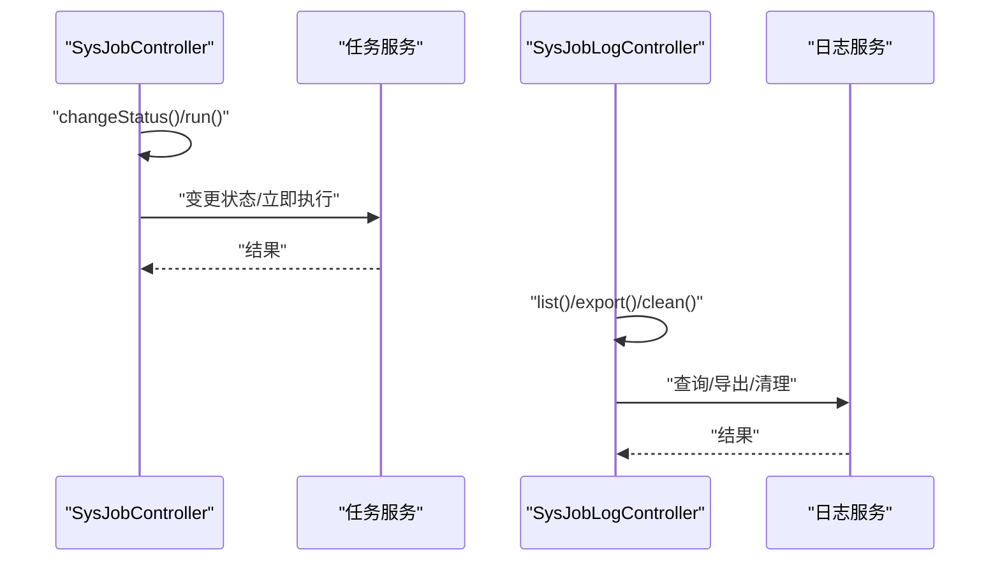
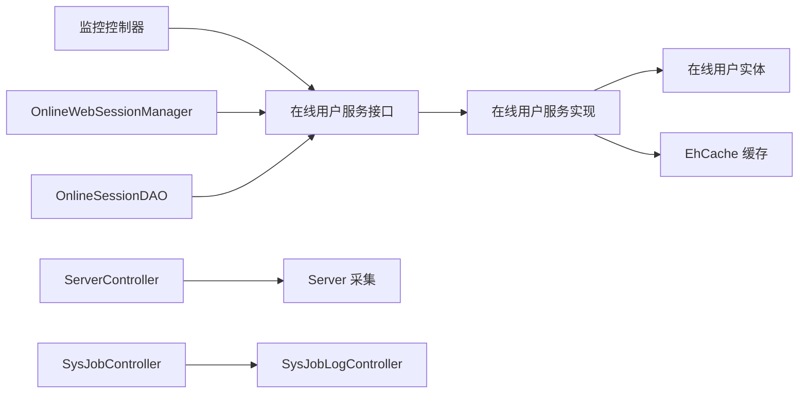

# 系统监控模块

<cite>
**本文引用的文件**
- [ruoyi-admin/src/main/java/com/ruoyi/web/controller/monitor/SysUserOnlineController.java](file://ruoyi-admin/src/main/java/com/ruoyi/web/controller/monitor/SysUserOnlineController.java)
- [ruoyi-admin/src/main/java/com/ruoyi/web/controller/monitor/ServerController.java](file://ruoyi-admin/src/main/java/com/ruoyi/web/controller/monitor/ServerController.java)
- [ruoyi-admin/src/main/java/com/ruoyi/web/controller/monitor/DruidController.java](file://ruoyi-admin/src/main/java/com/ruoyi/web/controller/monitor/DruidController.java)
- [ruoyi-admin/src/main/java/com/ruoyi/web/controller/monitor/SysLogininforController.java](file://ruoyi-admin/src/main/java/com/ruoyi/web/controller/monitor/SysLogininforController.java)
- [ruoyi-admin/src/main/java/com/ruoyi/web/controller/monitor/SysOperlogController.java](file://ruoyi-admin/src/main/java/com/ruoyi/web/controller/monitor/SysOperlogController.java)
- [ruoyi-framework/src/main/java/com/ruoyi/framework/web/domain/Server.java](file://ruoyi-framework/src/main/java/com/ruoyi/framework/web/domain/Server.java)
- [ruoyi-framework/src/main/java/com/ruoyi/framework/shiro/session/OnlineSessionDAO.java](file://ruoyi-framework/src/main/java/com/ruoyi/framework/shiro/session/OnlineSessionDAO.java)
- [ruoyi-framework/src/main/java/com/ruoyi/framework/shiro/web/session/OnlineWebSessionManager.java](file://ruoyi-framework/src/main/java/com/ruoyi/framework/shiro/web/session/OnlineWebSessionManager.java)
- [ruoyi-system/src/main/java/com/ruoyi/system/service/ISysUserOnlineService.java](file://ruoyi-system/src/main/java/com/ruoyi/system/service/ISysUserOnlineService.java)
- [ruoyi-system/src/main/java/com/ruoyi/system/service/impl/SysUserOnlineServiceImpl.java](file://ruoyi-system/src/main/java/com/ruoyi/system/service/impl/SysUserOnlineServiceImpl.java)
- [ruoyi-system/src/main/java/com/ruoyi/system/domain/SysUserOnline.java](file://ruoyi-system/src/main/java/com/ruoyi/system/domain/SysUserOnline.java)
- [ruoyi-quartz/src/main/java/com/ruoyi/quartz/controller/SysJobController.java](file://ruoyi-quartz/src/main/java/com/ruoyi/quartz/controller/SysJobController.java)
- [ruoyi-quartz/src/main/java/com/ruoyi/quartz/controller/SysJobLogController.java](file://ruoyi-quartz/src/main/java/com/ruoyi/quartz/controller/SysJobLogController.java)
</cite>

## 目录
1. [简介](#简介)
2. [项目结构](#项目结构)
3. [核心组件](#核心组件)
4. [架构总览](#架构总览)
5. [详细组件分析](#详细组件分析)
6. [依赖分析](#依赖分析)
7. [性能考虑](#性能考虑)
8. [故障排查指南](#故障排查指南)
9. [结论](#结论)
10. [附录](#附录)

## 简介
本文件面向系统监控模块，围绕以下目标展开：服务器性能监控（CPU、内存、磁盘空间、网络状态）、在线用户监控（登录状态、会话管理、并发控制）、定时任务监控（执行状态、失败重试与性能统计），以及系统日志管理、错误追踪与性能指标分析的配置方法，并提供监控数据可视化与告警机制的设置说明。文档以RuoYi框架现有实现为基础，结合控制器、领域模型、服务与会话管理组件，给出可操作的使用指南与架构视图。

## 项目结构
监控模块主要分布在以下子模块中：
- ruoyi-admin：监控页面与控制器，负责对外展示与交互（在线用户、服务器监控、Druid监控、登录日志、操作日志）
- ruoyi-framework：底层监控采集与会话管理（Server采集、OnlineSessionDAO、OnlineWebSessionManager）
- ruoyi-system：在线用户数据模型与服务接口/实现
- ruoyi-quartz：定时任务与任务日志的监控与管理

图表来源
- [ruoyi-admin/src/main/java/com/ruoyi/web/controller/monitor/SysUserOnlineController.java:1-90](file://ruoyi-admin/src/main/java/com/ruoyi/web/controller/monitor/SysUserOnlineController.java#L1-90)
- [ruoyi-admin/src/main/java/com/ruoyi/web/controller/monitor/ServerController.java:1-32](file://ruoyi-admin/src/main/java/com/ruoyi/web/controller/monitor/ServerController.java#L1-32)
- [ruoyi-admin/src/main/java/com/ruoyi/web/controller/monitor/DruidController.java:1-27](file://ruoyi-admin/src/main/java/com/ruoyi/web/controller/monitor/DruidController.java#L1-27)
- [ruoyi-admin/src/main/java/com/ruoyi/web/controller/monitor/SysLogininforController.java:1-95](file://ruoyi-admin/src/main/java/com/ruoyi/web/controller/monitor/SysLogininforController.java#L1-95)
- [ruoyi-admin/src/main/java/com/ruoyi/web/controller/monitor/SysOperlogController.java:1-91](file://ruoyi-admin/src/main/java/com/ruoyi/web/controller/monitor/SysOperlogController.java#L1-91)
- [ruoyi-framework/src/main/java/com/ruoyi/framework/web/domain/Server.java:1-242](file://ruoyi-framework/src/main/java/com/ruoyi/framework/web/domain/Server.java#L1-242)
- [ruoyi-framework/src/main/java/com/ruoyi/framework/shiro/session/OnlineSessionDAO.java:1-119](file://ruoyi-framework/src/main/java/com/ruoyi/framework/shiro/session/OnlineSessionDAO.java#L1-119)
- [ruoyi-framework/src/main/java/com/ruoyi/framework/shiro/web/session/OnlineWebSessionManager.java:1-176](file://ruoyi-framework/src/main/java/com/ruoyi/framework/shiro/web/session/OnlineWebSessionManager.java#L1-176)
- [ruoyi-system/src/main/java/com/ruoyi/system/service/ISysUserOnlineService.java:1-76](file://ruoyi-system/src/main/java/com/ruoyi/system/service/ISysUserOnlineService.java#L1-76)
- [ruoyi-system/src/main/java/com/ruoyi/system/service/impl/SysUserOnlineServiceImpl.java:1-141](file://ruoyi-system/src/main/java/com/ruoyi/system/service/impl/SysUserOnlineServiceImpl.java#L1-141)
- [ruoyi-system/src/main/java/com/ruoyi/system/domain/SysUserOnline.java:1-205](file://ruoyi-system/src/main/java/com/ruoyi/system/domain/SysUserOnline.java#L1-205)
- [ruoyi-quartz/src/main/java/com/ruoyi/quartz/controller/SysJobController.java:1-249](file://ruoyi-quartz/src/main/java/com/ruoyi/quartz/controller/SysJobController.java#L1-249)
- [ruoyi-quartz/src/main/java/com/ruoyi/quartz/controller/SysJobLogController.java:1-104](file://ruoyi-quartz/src/main/java/com/ruoyi/quartz/controller/SysJobLogController.java#L1-104)

章节来源
- [ruoyi-admin/src/main/java/com/ruoyi/web/controller/monitor/SysUserOnlineController.java:1-90](file://ruoyi-admin/src/main/java/com/ruoyi/web/controller/monitor/SysUserOnlineController.java#L1-90)
- [ruoyi-admin/src/main/java/com/ruoyi/web/controller/monitor/ServerController.java:1-32](file://ruoyi-admin/src/main/java/com/ruoyi/web/controller/monitor/ServerController.java#L1-32)
- [ruoyi-admin/src/main/java/com/ruoyi/web/controller/monitor/DruidController.java:1-27](file://ruoyi-admin/src/main/java/com/ruoyi/web/controller/monitor/DruidController.java#L1-27)
- [ruoyi-admin/src/main/java/com/ruoyi/web/controller/monitor/SysLogininforController.java:1-95](file://ruoyi-admin/src/main/java/com/ruoyi/web/controller/monitor/SysLogininforController.java#L1-95)
- [ruoyi-admin/src/main/java/com/ruoyi/web/controller/monitor/SysOperlogController.java:1-91](file://ruoyi-admin/src/main/java/com/ruoyi/web/controller/monitor/SysOperlogController.java#L1-91)
- [ruoyi-framework/src/main/java/com/ruoyi/framework/web/domain/Server.java:1-242](file://ruoyi-framework/src/main/java/com/ruoyi/framework/web/domain/Server.java#L1-242)
- [ruoyi-framework/src/main/java/com/ruoyi/framework/shiro/session/OnlineSessionDAO.java:1-119](file://ruoyi-framework/src/main/java/com/ruoyi/framework/shiro/session/OnlineSessionDAO.java#L1-119)
- [ruoyi-framework/src/main/java/com/ruoyi/framework/shiro/web/session/OnlineWebSessionManager.java:1-176](file://ruoyi-framework/src/main/java/com/ruoyi/framework/shiro/web/session/OnlineWebSessionManager.java#L1-176)
- [ruoyi-system/src/main/java/com/ruoyi/system/service/ISysUserOnlineService.java:1-76](file://ruoyi-system/src/main/java/com/ruoyi/system/service/ISysUserOnlineService.java#L1-76)
- [ruoyi-system/src/main/java/com/ruoyi/system/service/impl/SysUserOnlineServiceImpl.java:1-141](file://ruoyi-system/src/main/java/com/ruoyi/system/service/impl/SysUserOnlineServiceImpl.java#L1-141)
- [ruoyi-system/src/main/java/com/ruoyi/system/domain/SysUserOnline.java:1-205](file://ruoyi-system/src/main/java/com/ruoyi/system/domain/SysUserOnline.java#L1-205)
- [ruoyi-quartz/src/main/java/com/ruoyi/quartz/controller/SysJobController.java:1-249](file://ruoyi-quartz/src/main/java/com/ruoyi/quartz/controller/SysJobController.java#L1-249)
- [ruoyi-quartz/src/main/java/com/ruoyi/quartz/controller/SysJobLogController.java:1-104](file://ruoyi-quartz/src/main/java/com/ruoyi/quartz/controller/SysJobLogController.java#L1-104)

## 核心组件
- 服务器性能监控：通过Server类采集CPU、内存、JVM与磁盘信息，供页面展示。
- 在线用户监控：基于Shiro会话管理，记录在线用户、支持批量强制下线与缓存清理。
- 定时任务监控：提供任务列表、启停、立即执行、导出、清理与日志查看。
- 日志与审计：登录日志与操作日志的查询、导出、清理与详情查看。
- 可视化与Druid：Druid SQL监控页面入口。

章节来源
- [ruoyi-framework/src/main/java/com/ruoyi/framework/web/domain/Server.java:109-123](file://ruoyi-framework/src/main/java/com/ruoyi/framework/web/domain/Server.java#L109-L123)
- [ruoyi-admin/src/main/java/com/ruoyi/web/controller/monitor/ServerController.java:22-30](file://ruoyi-admin/src/main/java/com/ruoyi/web/controller/monitor/ServerController.java#L22-L30)
- [ruoyi-admin/src/main/java/com/ruoyi/web/controller/monitor/SysUserOnlineController.java:49-88](file://ruoyi-admin/src/main/java/com/ruoyi/web/controller/monitor/SysUserOnlineController.java#L49-L88)
- [ruoyi-framework/src/main/java/com/ruoyi/framework/shiro/session/OnlineSessionDAO.java:68-102](file://ruoyi-framework/src/main/java/com/ruoyi/framework/shiro/session/OnlineSessionDAO.java#L68-L102)
- [ruoyi-framework/src/main/java/com/ruoyi/framework/shiro/web/session/OnlineWebSessionManager.java:95-168](file://ruoyi-framework/src/main/java/com/ruoyi/framework/shiro/web/session/OnlineWebSessionManager.java#L95-L168)
- [ruoyi-quartz/src/main/java/com/ruoyi/quartz/controller/SysJobController.java:51-116](file://ruoyi-quartz/src/main/java/com/ruoyi/quartz/controller/SysJobController.java#L51-L116)
- [ruoyi-quartz/src/main/java/com/ruoyi/quartz/controller/SysJobLogController.java:55-102](file://ruoyi-quartz/src/main/java/com/ruoyi/quartz/controller/SysJobLogController.java#L55-L102)
- [ruoyi-admin/src/main/java/com/ruoyi/web/controller/monitor/SysLogininforController.java:45-93](file://ruoyi-admin/src/main/java/com/ruoyi/web/controller/monitor/SysLogininforController.java#L45-L93)
- [ruoyi-admin/src/main/java/com/ruoyi/web/controller/monitor/SysOperlogController.java:43-89](file://ruoyi-admin/src/main/java/com/ruoyi/web/controller/monitor/SysOperlogController.java#L43-L89)
- [ruoyi-admin/src/main/java/com/ruoyi/web/controller/monitor/DruidController.java:20-25](file://ruoyi-admin/src/main/java/com/ruoyi/web/controller/monitor/DruidController.java#L20-L25)

## 架构总览
监控模块采用“控制器-服务-数据模型-采集/会话管理”的分层设计。控制器负责权限校验与页面跳转/数据返回；服务层封装在线用户与任务管理逻辑；采集层通过OSHI库读取系统指标；会话管理器负责在线用户状态与DB同步。

图表来源
- [ruoyi-admin/src/main/java/com/ruoyi/web/controller/monitor/SysUserOnlineController.java:30-88](file://ruoyi-admin/src/main/java/com/ruoyi/web/controller/monitor/SysUserOnlineController.java#L30-L88)
- [ruoyi-system/src/main/java/com/ruoyi/system/service/ISysUserOnlineService.java:12-75](file://ruoyi-system/src/main/java/com/ruoyi/system/service/ISysUserOnlineService.java#L12-L75)
- [ruoyi-system/src/main/java/com/ruoyi/system/service/impl/SysUserOnlineServiceImpl.java:24-141](file://ruoyi-system/src/main/java/com/ruoyi/system/service/impl/SysUserOnlineServiceImpl.java#L24-L141)
- [ruoyi-system/src/main/java/com/ruoyi/system/domain/SysUserOnline.java:15-205](file://ruoyi-system/src/main/java/com/ruoyi/system/domain/SysUserOnline.java#L15-L205)
- [ruoyi-admin/src/main/java/com/ruoyi/web/controller/monitor/ServerController.java:18-30](file://ruoyi-admin/src/main/java/com/ruoyi/web/controller/monitor/ServerController.java#L18-L30)
- [ruoyi-framework/src/main/java/com/ruoyi/framework/web/domain/Server.java:29-123](file://ruoyi-framework/src/main/java/com/ruoyi/framework/web/domain/Server.java#L29-L123)
- [ruoyi-framework/src/main/java/com/ruoyi/framework/shiro/web/session/OnlineWebSessionManager.java:29-168](file://ruoyi-framework/src/main/java/com/ruoyi/framework/shiro/web/session/OnlineWebSessionManager.java#L29-L168)
- [ruoyi-framework/src/main/java/com/ruoyi/framework/shiro/session/OnlineSessionDAO.java:21-119](file://ruoyi-framework/src/main/java/com/ruoyi/framework/shiro/session/OnlineSessionDAO.java#L21-L119)
- [ruoyi-quartz/src/main/java/com/ruoyi/quartz/controller/SysJobController.java:35-116](file://ruoyi-quartz/src/main/java/com/ruoyi/quartz/controller/SysJobController.java#L35-L116)
- [ruoyi-quartz/src/main/java/com/ruoyi/quartz/controller/SysJobLogController.java:31-102](file://ruoyi-quartz/src/main/java/com/ruoyi/quartz/controller/SysJobLogController.java#L31-L102)
- [ruoyi-admin/src/main/java/com/ruoyi/web/controller/monitor/SysLogininforController.java:26-93](file://ruoyi-admin/src/main/java/com/ruoyi/web/controller/monitor/SysLogininforController.java#L26-L93)
- [ruoyi-admin/src/main/java/com/ruoyi/web/controller/monitor/SysOperlogController.java:27-89](file://ruoyi-admin/src/main/java/com/ruoyi/web/controller/monitor/SysOperlogController.java#L27-L89)
- [ruoyi-admin/src/main/java/com/ruoyi/web/controller/monitor/DruidController.java:14-25](file://ruoyi-admin/src/main/java/com/ruoyi/web/controller/monitor/DruidController.java#L14-L25)

## 详细组件分析

### 服务器性能监控（CPU/内存/磁盘/JVM）
- 采集流程：Server.copyTo()通过OSHI读取CPU、内存、文件系统与JVM信息，计算使用率与容量。
- 展示流程：ServerController将Server对象放入ModelMap，渲染监控页面。
- 关键点：
  - CPU使用率基于两次tick差值计算，避免瞬时波动。
  - 内存使用=总量-可用量，空闲=可用量。
  - 磁盘按挂载点逐项统计使用率与容量。
  - JVM信息来自运行时环境与系统属性。

图表来源
- [ruoyi-admin/src/main/java/com/ruoyi/web/controller/monitor/ServerController.java:22-30](file://ruoyi-admin/src/main/java/com/ruoyi/web/controller/monitor/ServerController.java#L22-L30)
- [ruoyi-framework/src/main/java/com/ruoyi/framework/web/domain/Server.java:109-123](file://ruoyi-framework/src/main/java/com/ruoyi/framework/web/domain/Server.java#L109-L123)
- [ruoyi-framework/src/main/java/com/ruoyi/framework/web/domain/Server.java:128-149](file://ruoyi-framework/src/main/java/com/ruoyi/framework/web/domain/Server.java#L128-L149)
- [ruoyi-framework/src/main/java/com/ruoyi/framework/web/domain/Server.java:154-159](file://ruoyi-framework/src/main/java/com/ruoyi/framework/web/domain/Server.java#L154-L159)
- [ruoyi-framework/src/main/java/com/ruoyi/framework/web/domain/Server.java:164-172](file://ruoyi-framework/src/main/java/com/ruoyi/framework/web/domain/Server.java#L164-L172)
- [ruoyi-framework/src/main/java/com/ruoyi/framework/web/domain/Server.java:177-185](file://ruoyi-framework/src/main/java/com/ruoyi/framework/web/domain/Server.java#L177-L185)
- [ruoyi-framework/src/main/java/com/ruoyi/framework/web/domain/Server.java:190-209](file://ruoyi-framework/src/main/java/com/ruoyi/framework/web/domain/Server.java#L190-L209)

章节来源
- [ruoyi-framework/src/main/java/com/ruoyi/framework/web/domain/Server.java:109-241](file://ruoyi-framework/src/main/java/com/ruoyi/framework/web/domain/Server.java#L109-L241)
- [ruoyi-admin/src/main/java/com/ruoyi/web/controller/monitor/ServerController.java:22-30](file://ruoyi-admin/src/main/java/com/ruoyi/web/controller/monitor/ServerController.java#L22-L30)

### 在线用户监控（登录状态、会话管理、并发控制）
- 控制器职责：列出在线用户、批量强制下线、页面跳转。
- 会话同步：OnlineSessionDAO根据dbSyncPeriod与属性变更标记决定是否同步至DB。
- 会话生命周期：OnlineWebSessionManager在属性变更时标记并触发同步；定期验证过期会话并清理DB与缓存。
- 服务层：ISysUserOnlineService定义查询、保存、强退、清理缓存与过期查询；实现类完成具体逻辑。

图表来源
- [ruoyi-admin/src/main/java/com/ruoyi/web/controller/monitor/SysUserOnlineController.java:49-88](file://ruoyi-admin/src/main/java/com/ruoyi/web/controller/monitor/SysUserOnlineController.java#L49-L88)
- [ruoyi-framework/src/main/java/com/ruoyi/framework/shiro/session/OnlineSessionDAO.java:68-102](file://ruoyi-framework/src/main/java/com/ruoyi/framework/shiro/session/OnlineSessionDAO.java#L68-L102)
- [ruoyi-framework/src/main/java/com/ruoyi/framework/shiro/web/session/OnlineWebSessionManager.java:95-168](file://ruoyi-framework/src/main/java/com/ruoyi/framework/shiro/web/session/OnlineWebSessionManager.java#L95-L168)
- [ruoyi-system/src/main/java/com/ruoyi/system/service/ISysUserOnlineService.java:12-75](file://ruoyi-system/src/main/java/com/ruoyi/system/service/ISysUserOnlineService.java#L12-L75)
- [ruoyi-system/src/main/java/com/ruoyi/system/service/impl/SysUserOnlineServiceImpl.java:24-141](file://ruoyi-system/src/main/java/com/ruoyi/system/service/impl/SysUserOnlineServiceImpl.java#L24-L141)
- [ruoyi-system/src/main/java/com/ruoyi/system/domain/SysUserOnline.java:15-205](file://ruoyi-system/src/main/java/com/ruoyi/system/domain/SysUserOnline.java#L15-L205)

章节来源
- [ruoyi-admin/src/main/java/com/ruoyi/web/controller/monitor/SysUserOnlineController.java:30-88](file://ruoyi-admin/src/main/java/com/ruoyi/web/controller/monitor/SysUserOnlineController.java#L30-L88)
- [ruoyi-framework/src/main/java/com/ruoyi/framework/shiro/session/OnlineSessionDAO.java:21-119](file://ruoyi-framework/src/main/java/com/ruoyi/framework/shiro/session/OnlineSessionDAO.java#L21-L119)
- [ruoyi-framework/src/main/java/com/ruoyi/framework/shiro/web/session/OnlineWebSessionManager.java:29-176](file://ruoyi-framework/src/main/java/com/ruoyi/framework/shiro/web/session/OnlineWebSessionManager.java#L29-L176)
- [ruoyi-system/src/main/java/com/ruoyi/system/service/ISysUserOnlineService.java:12-76](file://ruoyi-system/src/main/java/com/ruoyi/system/service/ISysUserOnlineService.java#L12-L76)
- [ruoyi-system/src/main/java/com/ruoyi/system/service/impl/SysUserOnlineServiceImpl.java:24-141](file://ruoyi-system/src/main/java/com/ruoyi/system/service/impl/SysUserOnlineServiceImpl.java#L24-L141)
- [ruoyi-system/src/main/java/com/ruoyi/system/domain/SysUserOnline.java:15-205](file://ruoyi-system/src/main/java/com/ruoyi/system/domain/SysUserOnline.java#L15-L205)

### 定时任务监控（执行状态、失败重试、性能统计）
- 任务管理：SysJobController提供任务列表、导出、删除、详情、启停、立即执行、新增/编辑、Cron表达式校验与在线生成。
- 日志管理：SysJobLogController提供日志列表、导出、删除、详情、清理。
- 安全与合规：对invokeTarget进行白名单与敏感协议限制，防止远程调用风险。
- 性能统计：可通过日志记录任务执行耗时、成功/失败次数等（由调度实现与日志服务提供）。

图表来源
- [ruoyi-quartz/src/main/java/com/ruoyi/quartz/controller/SysJobController.java:94-116](file://ruoyi-quartz/src/main/java/com/ruoyi/quartz/controller/SysJobController.java#L94-L116)
- [ruoyi-quartz/src/main/java/com/ruoyi/quartz/controller/SysJobController.java:131-163](file://ruoyi-quartz/src/main/java/com/ruoyi/quartz/controller/SysJobController.java#L131-L163)
- [ruoyi-quartz/src/main/java/com/ruoyi/quartz/controller/SysJobController.java:214-247](file://ruoyi-quartz/src/main/java/com/ruoyi/quartz/controller/SysJobController.java#L214-L247)
- [ruoyi-quartz/src/main/java/com/ruoyi/quartz/controller/SysJobLogController.java:55-102](file://ruoyi-quartz/src/main/java/com/ruoyi/quartz/controller/SysJobLogController.java#L55-L102)

章节来源
- [ruoyi-quartz/src/main/java/com/ruoyi/quartz/controller/SysJobController.java:35-249](file://ruoyi-quartz/src/main/java/com/ruoyi/quartz/controller/SysJobController.java#L35-L249)
- [ruoyi-quartz/src/main/java/com/ruoyi/quartz/controller/SysJobLogController.java:31-104](file://ruoyi-quartz/src/main/java/com/ruoyi/quartz/controller/SysJobLogController.java#L31-L104)

### 日志管理与错误追踪
- 登录日志：SysLogininforController提供列表、导出、删除、清空、账户解锁。
- 操作日志：SysOperlogController提供列表、导出、删除、详情、清空。
- 错误追踪：系统异常统一由全局异常处理器捕获（框架层未在本文件中展示，但控制器与服务层具备标准返回结构）。

章节来源
- [ruoyi-admin/src/main/java/com/ruoyi/web/controller/monitor/SysLogininforController.java:26-94](file://ruoyi-admin/src/main/java/com/ruoyi/web/controller/monitor/SysLogininforController.java#L26-L94)
- [ruoyi-admin/src/main/java/com/ruoyi/web/controller/monitor/SysOperlogController.java:27-90](file://ruoyi-admin/src/main/java/com/ruoyi/web/controller/monitor/SysOperlogController.java#L27-L90)

### Druid监控
- DruidController将请求转发到/druid/index.html，实现SQL监控页面的快速访问。

章节来源
- [ruoyi-admin/src/main/java/com/ruoyi/web/controller/monitor/DruidController.java:14-26](file://ruoyi-admin/src/main/java/com/ruoyi/web/controller/monitor/DruidController.java#L14-L26)

## 依赖分析
- 控制器依赖服务接口，服务实现依赖数据模型与缓存。
- 会话管理器与DAO依赖在线用户服务以完成DB同步与清理。
- 服务器监控依赖OSHI硬件抽象层与操作系统文件系统。
- 定时任务依赖调度器与日志服务。

图表来源
- [ruoyi-admin/src/main/java/com/ruoyi/web/controller/monitor/SysUserOnlineController.java:30-88](file://ruoyi-admin/src/main/java/com/ruoyi/web/controller/monitor/SysUserOnlineController.java#L30-L88)
- [ruoyi-system/src/main/java/com/ruoyi/system/service/ISysUserOnlineService.java:12-75](file://ruoyi-system/src/main/java/com/ruoyi/system/service/ISysUserOnlineService.java#L12-L75)
- [ruoyi-system/src/main/java/com/ruoyi/system/service/impl/SysUserOnlineServiceImpl.java:117-127](file://ruoyi-system/src/main/java/com/ruoyi/system/service/impl/SysUserOnlineServiceImpl.java#L117-L127)
- [ruoyi-system/src/main/java/com/ruoyi/system/domain/SysUserOnline.java:15-205](file://ruoyi-system/src/main/java/com/ruoyi/system/domain/SysUserOnline.java#L15-L205)
- [ruoyi-framework/src/main/java/com/ruoyi/framework/shiro/web/session/OnlineWebSessionManager.java:112-138](file://ruoyi-framework/src/main/java/com/ruoyi/framework/shiro/web/session/OnlineWebSessionManager.java#L112-L138)
- [ruoyi-framework/src/main/java/com/ruoyi/framework/shiro/session/OnlineSessionDAO.java:34-117](file://ruoyi-framework/src/main/java/com/ruoyi/framework/shiro/session/OnlineSessionDAO.java#L34-L117)
- [ruoyi-admin/src/main/java/com/ruoyi/web/controller/monitor/ServerController.java:22-30](file://ruoyi-admin/src/main/java/com/ruoyi/web/controller/monitor/ServerController.java#L22-L30)
- [ruoyi-framework/src/main/java/com/ruoyi/framework/web/domain/Server.java:109-123](file://ruoyi-framework/src/main/java/com/ruoyi/framework/web/domain/Server.java#L109-L123)
- [ruoyi-quartz/src/main/java/com/ruoyi/quartz/controller/SysJobController.java:35-116](file://ruoyi-quartz/src/main/java/com/ruoyi/quartz/controller/SysJobController.java#L35-L116)
- [ruoyi-quartz/src/main/java/com/ruoyi/quartz/controller/SysJobLogController.java:31-102](file://ruoyi-quartz/src/main/java/com/ruoyi/quartz/controller/SysJobLogController.java#L31-L102)

章节来源
- [ruoyi-system/src/main/java/com/ruoyi/system/service/impl/SysUserOnlineServiceImpl.java:117-127](file://ruoyi-system/src/main/java/com/ruoyi/system/service/impl/SysUserOnlineServiceImpl.java#L117-L127)
- [ruoyi-framework/src/main/java/com/ruoyi/framework/shiro/web/session/OnlineWebSessionManager.java:112-147](file://ruoyi-framework/src/main/java/com/ruoyi/framework/shiro/web/session/OnlineWebSessionManager.java#L112-L147)
- [ruoyi-framework/src/main/java/com/ruoyi/framework/shiro/session/OnlineSessionDAO.java:68-102](file://ruoyi-framework/src/main/java/com/ruoyi/framework/shiro/session/OnlineSessionDAO.java#L68-L102)

## 性能考虑
- 会话同步策略：OnlineSessionDAO通过dbSyncPeriod与属性变更标记减少DB写入频率，降低抖动。
- 过期会话清理：OnlineWebSessionManager定期扫描过期会话，批量删除DB记录并清理缓存，避免内存泄漏。
- 服务器采集：Server在CPU采样时进行两次tick间隔采样，提高稳定性；磁盘遍历按挂载点逐项统计，避免一次性大开销。
- 任务日志：建议对高频任务的日志输出进行分级控制，避免IO瓶颈。

章节来源
- [ruoyi-framework/src/main/java/com/ruoyi/framework/shiro/session/OnlineSessionDAO.java:68-102](file://ruoyi-framework/src/main/java/com/ruoyi/framework/shiro/session/OnlineSessionDAO.java#L68-L102)
- [ruoyi-framework/src/main/java/com/ruoyi/framework/shiro/web/session/OnlineWebSessionManager.java:95-168](file://ruoyi-framework/src/main/java/com/ruoyi/framework/shiro/web/session/OnlineWebSessionManager.java#L95-L168)
- [ruoyi-framework/src/main/java/com/ruoyi/framework/web/domain/Server.java:128-149](file://ruoyi-framework/src/main/java/com/ruoyi/framework/web/domain/Server.java#L128-L149)
- [ruoyi-framework/src/main/java/com/ruoyi/framework/web/domain/Server.java:190-209](file://ruoyi-framework/src/main/java/com/ruoyi/framework/web/domain/Server.java#L190-L209)

## 故障排查指南
- 在线用户无法强退
  - 检查会话是否存在与是否为当前登录会话。
  - 确认OnlineSessionDAO.delete是否被调用且状态更新。
- 会话未及时同步DB
  - 检查dbSyncPeriod配置与属性变更标记是否生效。
  - 查看异步同步任务是否正常执行。
- 过期会话未清理
  - 确认validateSessions执行周期与过期判定逻辑。
  - 检查批量删除DB与缓存清理是否成功。
- 任务执行失败
  - 查看SysJobLogController中的日志详情。
  - 校验Cron表达式有效性与invokeTarget白名单。
- Druid页面无法访问
  - 确认权限与DruidController路由配置。

章节来源
- [ruoyi-admin/src/main/java/com/ruoyi/web/controller/monitor/SysUserOnlineController.java:60-88](file://ruoyi-admin/src/main/java/com/ruoyi/web/controller/monitor/SysUserOnlineController.java#L60-L88)
- [ruoyi-framework/src/main/java/com/ruoyi/framework/shiro/session/OnlineSessionDAO.java:68-102](file://ruoyi-framework/src/main/java/com/ruoyi/framework/shiro/session/OnlineSessionDAO.java#L68-L102)
- [ruoyi-framework/src/main/java/com/ruoyi/framework/shiro/web/session/OnlineWebSessionManager.java:112-168](file://ruoyi-framework/src/main/java/com/ruoyi/framework/shiro/web/session/OnlineWebSessionManager.java#L112-L168)
- [ruoyi-quartz/src/main/java/com/ruoyi/quartz/controller/SysJobController.java:131-163](file://ruoyi-quartz/src/main/java/com/ruoyi/quartz/controller/SysJobController.java#L131-L163)
- [ruoyi-quartz/src/main/java/com/ruoyi/quartz/controller/SysJobLogController.java:55-102](file://ruoyi-quartz/src/main/java/com/ruoyi/quartz/controller/SysJobLogController.java#L55-L102)
- [ruoyi-admin/src/main/java/com/ruoyi/web/controller/monitor/DruidController.java:20-25](file://ruoyi-admin/src/main/java/com/ruoyi/web/controller/monitor/DruidController.java#L20-L25)

## 结论
本监控模块以清晰的分层设计实现了服务器性能采集、在线用户会话管理、定时任务与日志管理的闭环。通过会话DAO与管理器的协同，确保在线状态与DB一致；通过Server采集与Druid集成，提供直观的系统健康视图；通过任务控制器与日志控制器，保障任务可观测性与可追溯性。建议在生产环境中结合告警策略与可视化看板，进一步提升运维效率。

## 附录
- 可视化展示建议
  - 使用ECharts或类似图表库展示CPU/内存/磁盘趋势。
  - 在线用户列表支持按部门、登录时间排序与筛选。
  - 任务执行成功率与耗时统计可作为仪表盘指标。
- 告警机制设置
  - CPU/内存/磁盘使用率阈值告警。
  - 任务失败次数阈值与超时告警。
  - 在线用户并发峰值告警。
- 配置要点
  - 会话同步周期dbSyncPeriod需结合业务并发调整。
  - 任务白名单与Cron表达式校验需严格配置。
  - Druid访问权限与白名单策略需与安全策略一致。