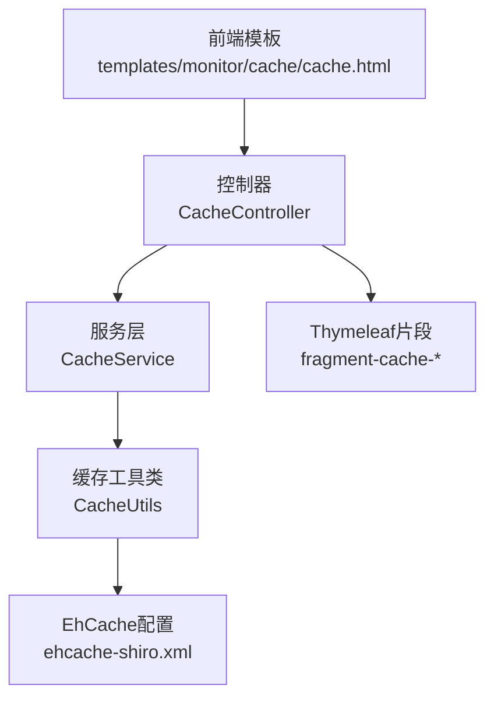
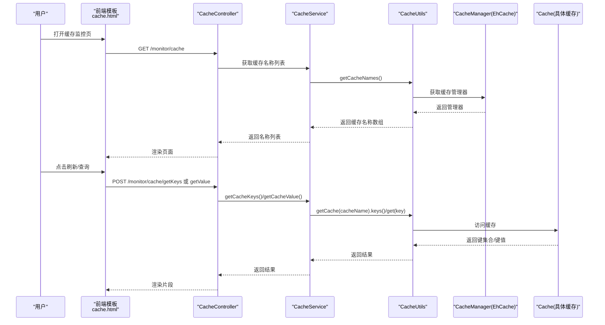
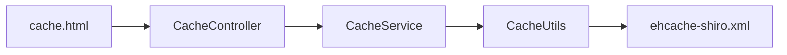

# 缓存监控

<cite>
**本文引用的文件**
- [ruoyi-admin/src/main/java/com/ruoyi/web/controller/monitor/CacheController.java](file://ruoyi-admin/src/main/java/com/ruoyi/web/controller/monitor/CacheController.java)
- [ruoyi-framework/src/main/java/com/ruoyi/framework/web/service/CacheService.java](file://ruoyi-framework/src/main/java/com/ruoyi/framework/web/service/CacheService.java)
- [ruoyi-common/src/main/java/com/ruoyi/common/utils/CacheUtils.java](file://ruoyi-common/src/main/java/com/ruoyi/common/utils/CacheUtils.java)
- [ruoyi-common/src/main/java/com/ruoyi/common/constant/Constants.java](file://ruoyi-common/src/main/java/com/ruoyi/common/constant/Constants.java)
- [ruoyi-admin/src/main/resources/ehcache/ehcache-shiro.xml](file://ruoyi-admin/src/main/resources/ehcache/ehcache-shiro.xml)
- [ruoyi-admin/src/main/resources/templates/monitor/cache/cache.html](file://ruoyi-admin/src/main/resources/templates/monitor/cache/cache.html)
- [ruoyi-system/src/main/java/com/ruoyi/system/service/impl/SysConfigServiceImpl.java](file://ruoyi-system/src/main/java/com/ruoyi/system/service/impl/SysConfigServiceImpl.java)
- [ruoyi-framework/src/main/java/com/ruoyi/framework/web/domain/server/Cpu.java](file://ruoyi-framework/src/main/java/com/ruoyi/framework/web/domain/server/Cpu.java)
- [ruoyi-framework/src/main/java/com/ruoyi/framework/web/domain/server/Mem.java](file://ruoyi-framework/src/main/java/com/ruoyi/framework/web/domain/server/Mem.java)
- [ruoyi-admin/src/main/resources/application.yml](file://ruoyi-admin/src/main/resources/application.yml)
</cite>

## 目录
1. [简介](#简介)
2. [项目结构](#项目结构)
3. [核心组件](#核心组件)
4. [架构概览](#架构概览)
5. [详细组件分析](#详细组件分析)
6. [依赖分析](#依赖分析)
7. [性能考虑](#性能考虑)
8. [故障排查指南](#故障排查指南)
9. [结论](#结论)
10. [附录](#附录)

## 简介
本文件面向RuoYi项目中的缓存监控能力，聚焦于基于EhCache的缓存系统监控实现。文档覆盖以下主题：
- 缓存命中率、内存使用情况与缓存项统计的采集方法
- CacheService对缓存操作的封装与监控数据收集机制
- 缓存配置参数调整、缓存失效策略与内存管理优化
- 缓存监控页面的使用说明（缓存键值查询、统计图表展示与性能指标分析）
- 缓存穿透、缓存雪崩等常见问题的预防与处理
- 缓存性能调优建议、容量规划与故障恢复策略
- 缓存监控数据的导出与历史趋势分析能力说明

## 项目结构
缓存监控功能由前端模板、控制器与后端服务层协同完成，并通过统一的缓存工具类对接EhCache缓存管理器。

**图示来源**
- [ruoyi-admin/src/main/resources/templates/monitor/cache/cache.html:1-180](file://ruoyi-admin/src/main/resources/templates/monitor/cache/cache.html#L1-L180)
- [ruoyi-admin/src/main/java/com/ruoyi/web/controller/monitor/CacheController.java:1-91](file://ruoyi-admin/src/main/java/com/ruoyi/web/controller/monitor/CacheController.java#L1-L91)
- [ruoyi-framework/src/main/java/com/ruoyi/framework/web/service/CacheService.java:1-85](file://ruoyi-framework/src/main/java/com/ruoyi/framework/web/service/CacheService.java#L1-L85)
- [ruoyi-common/src/main/java/com/ruoyi/common/utils/CacheUtils.java:1-198](file://ruoyi-common/src/main/java/com/ruoyi/common/utils/CacheUtils.java#L1-L198)
- [ruoyi-admin/src/main/resources/ehcache/ehcache-shiro.xml:1-91](file://ruoyi-admin/src/main/resources/ehcache/ehcache-shiro.xml#L1-L91)

**章节来源**
- [ruoyi-admin/src/main/resources/templates/monitor/cache/cache.html:1-180](file://ruoyi-admin/src/main/resources/templates/monitor/cache/cache.html#L1-L180)
- [ruoyi-admin/src/main/java/com/ruoyi/web/controller/monitor/CacheController.java:1-91](file://ruoyi-admin/src/main/java/com/ruoyi/web/controller/monitor/CacheController.java#L1-L91)
- [ruoyi-framework/src/main/java/com/ruoyi/framework/web/service/CacheService.java:1-85](file://ruoyi-framework/src/main/java/com/ruoyi/framework/web/service/CacheService.java#L1-L85)
- [ruoyi-common/src/main/java/com/ruoyi/common/utils/CacheUtils.java:1-198](file://ruoyi-common/src/main/java/com/ruoyi/common/utils/CacheUtils.java#L1-L198)
- [ruoyi-admin/src/main/resources/ehcache/ehcache-shiro.xml:1-91](file://ruoyi-admin/src/main/resources/ehcache/ehcache-shiro.xml#L1-L91)

## 核心组件
- 控制器层：负责接收前端请求、组装响应与渲染Thymeleaf片段，提供缓存名称、键名、键值查询以及清理操作。
- 服务层：封装缓存操作，屏蔽底层EhCache细节，提供获取缓存名称、键集合、键值读取与清理能力。
- 工具层：统一获取CacheManager与具体Cache实例，提供键空间转换、批量清理等能力。
- EhCache配置：定义各缓存区域的容量、过期策略、溢出策略与统计开关等参数。
- 前端模板：提供交互界面，支持动态刷新缓存列表、键名列表与键值内容，支持一键清理。

**章节来源**
- [ruoyi-admin/src/main/java/com/ruoyi/web/controller/monitor/CacheController.java:1-91](file://ruoyi-admin/src/main/java/com/ruoyi/web/controller/monitor/CacheController.java#L1-L91)
- [ruoyi-framework/src/main/java/com/ruoyi/framework/web/service/CacheService.java:1-85](file://ruoyi-framework/src/main/java/com/ruoyi/framework/web/service/CacheService.java#L1-L85)
- [ruoyi-common/src/main/java/com/ruoyi/common/utils/CacheUtils.java:1-198](file://ruoyi-common/src/main/java/com/ruoyi/common/utils/CacheUtils.java#L1-L198)
- [ruoyi-admin/src/main/resources/ehcache/ehcache-shiro.xml:1-91](file://ruoyi-admin/src/main/resources/ehcache/ehcache-shiro.xml#L1-L91)
- [ruoyi-admin/src/main/resources/templates/monitor/cache/cache.html:1-180](file://ruoyi-admin/src/main/resources/templates/monitor/cache/cache.html#L1-L180)

## 架构概览
缓存监控的典型调用链路如下：

**图示来源**
- [ruoyi-admin/src/main/resources/templates/monitor/cache/cache.html:101-178](file://ruoyi-admin/src/main/resources/templates/monitor/cache/cache.html#L101-L178)
- [ruoyi-admin/src/main/java/com/ruoyi/web/controller/monitor/CacheController.java:30-62](file://ruoyi-admin/src/main/java/com/ruoyi/web/controller/monitor/CacheController.java#L30-L62)
- [ruoyi-framework/src/main/java/com/ruoyi/framework/web/service/CacheService.java:23-50](file://ruoyi-framework/src/main/java/com/ruoyi/framework/web/service/CacheService.java#L23-L50)
- [ruoyi-common/src/main/java/com/ruoyi/common/utils/CacheUtils.java:193-196](file://ruoyi-common/src/main/java/com/ruoyi/common/utils/CacheUtils.java#L193-L196)

## 详细组件分析

### 控制器：CacheController
- 负责缓存监控页面的入口与交互逻辑，提供：
  - 获取缓存名称列表
  - 根据缓存名称获取键集合
  - 根据缓存名称与键获取值
  - 清理单个缓存名称、单个键或全部缓存
- 使用权限注解控制访问，确保安全。

**章节来源**
- [ruoyi-admin/src/main/java/com/ruoyi/web/controller/monitor/CacheController.java:29-90](file://ruoyi-admin/src/main/java/com/ruoyi/web/controller/monitor/CacheController.java#L29-L90)

### 服务层：CacheService
- 封装缓存操作，屏蔽底层差异：
  - 获取缓存名称列表（排除系统授权缓存）
  - 获取指定缓存的键集合（有序集合）
  - 读取键值
  - 清理指定缓存名称、指定键或全部缓存
- 通过工具类统一访问EhCache。

**章节来源**
- [ruoyi-framework/src/main/java/com/ruoyi/framework/web/service/CacheService.java:23-83](file://ruoyi-framework/src/main/java/com/ruoyi/framework/web/service/CacheService.java#L23-L83)

### 工具层：CacheUtils
- 提供静态方法访问缓存：
  - 统一获取CacheManager与Cache实例
  - 支持按名称与键进行读写与删除
  - 支持批量清理与按键集合清理
  - 提供获取所有缓存名称的能力
- 关键点：通过SpringUtils从容器中获取CacheManager，避免硬编码依赖。

**章节来源**
- [ruoyi-common/src/main/java/com/ruoyi/common/utils/CacheUtils.java:178-196](file://ruoyi-common/src/main/java/com/ruoyi/common/utils/CacheUtils.java#L178-L196)
- [ruoyi-common/src/main/java/com/ruoyi/common/utils/spring/SpringUtils.java:38-64](file://ruoyi-common/src/main/java/com/ruoyi/common/utils/spring/SpringUtils.java#L38-L64)

### EhCache配置：ehcache-shiro.xml
- 定义默认缓存与多类业务缓存（如登录记录、系统用户、系统授权、系统参数、系统字典、会话等）
- 关键参数说明（节选）：
  - maxEntriesLocalHeap：堆内最大元素数
  - eternal：是否永久有效
  - timeToIdleSeconds/timeToLiveSeconds：空闲/存活超时
  - overflowToDisk：内存不足时是否溢出磁盘
  - statistics：是否开启统计（影响性能）
- 注意：当前项目中大部分缓存未开启statistics，因此无法直接从EhCache获取命中率等统计；如需监控命中率，需在生产环境按需开启。

**章节来源**
- [ruoyi-admin/src/main/resources/ehcache/ehcache-shiro.xml:16-90](file://ruoyi-admin/src/main/resources/ehcache/ehcache-shiro.xml#L16-L90)

### 前端模板：cache.html
- 页面三列布局：缓存列表、键名列表、缓存内容
- 支持：
  - 动态刷新缓存名称列表
  - 点击缓存名称加载对应键名列表
  - 点击键名查看键值内容
  - 清理单个缓存名称、单个键或全部缓存
- 使用Ajax与Thymeleaf片段实现局部刷新。

**章节来源**
- [ruoyi-admin/src/main/resources/templates/monitor/cache/cache.html:1-180](file://ruoyi-admin/src/main/resources/templates/monitor/cache/cache.html#L1-L180)

### 业务集成示例：系统参数缓存
- 系统参数服务在加载参数时写入缓存，在重置或清空时清理缓存，体现缓存的生命周期管理。

**章节来源**
- [ruoyi-system/src/main/java/com/ruoyi/system/service/impl/SysConfigServiceImpl.java:155-219](file://ruoyi-system/src/main/java/com/ruoyi/system/service/impl/SysConfigServiceImpl.java#L155-L219)

## 依赖分析
- 控制器依赖服务层
- 服务层依赖工具类
- 工具类依赖EhCache缓存管理器
- 前端模板依赖控制器提供的数据与片段

**图示来源**
- [ruoyi-admin/src/main/java/com/ruoyi/web/controller/monitor/CacheController.java:26-27](file://ruoyi-admin/src/main/java/com/ruoyi/web/controller/monitor/CacheController.java#L26-L27)
- [ruoyi-framework/src/main/java/com/ruoyi/framework/web/service/CacheService.java:25-26](file://ruoyi-framework/src/main/java/com/ruoyi/framework/web/service/CacheService.java#L25-L26)
- [ruoyi-common/src/main/java/com/ruoyi/common/utils/CacheUtils.java:21-21](file://ruoyi-common/src/main/java/com/ruoyi/common/utils/CacheUtils.java#L21-L21)
- [ruoyi-admin/src/main/resources/ehcache/ehcache-shiro.xml:1-91](file://ruoyi-admin/src/main/resources/ehcache/ehcache-shiro.xml#L1-L91)
- [ruoyi-admin/src/main/resources/templates/monitor/cache/cache.html:101-178](file://ruoyi-admin/src/main/resources/templates/monitor/cache/cache.html#L101-L178)

**章节来源**
- [ruoyi-admin/src/main/java/com/ruoyi/web/controller/monitor/CacheController.java:26-27](file://ruoyi-admin/src/main/java/com/ruoyi/web/controller/monitor/CacheController.java#L26-L27)
- [ruoyi-framework/src/main/java/com/ruoyi/framework/web/service/CacheService.java:25-26](file://ruoyi-framework/src/main/java/com/ruoyi/framework/web/service/CacheService.java#L25-L26)
- [ruoyi-common/src/main/java/com/ruoyi/common/utils/CacheUtils.java:21-21](file://ruoyi-common/src/main/java/com/ruoyi/common/utils/CacheUtils.java#L21-L21)
- [ruoyi-admin/src/main/resources/ehcache/ehcache-shiro.xml:1-91](file://ruoyi-admin/src/main/resources/ehcache/ehcache-shiro.xml#L1-L91)
- [ruoyi-admin/src/main/resources/templates/monitor/cache/cache.html:101-178](file://ruoyi-admin/src/main/resources/templates/monitor/cache/cache.html#L101-L178)

## 性能考虑
- EhCache统计开关
  - 当前配置中大多数缓存未开启statistics，因此无法直接获取命中率、请求数等指标。若需监控命中率，可在生产环境按需开启statistics，但需权衡其对性能的影响。
- 内存与溢出策略
  - 通过maxEntriesLocalHeap、overflowToDisk、timeToLiveSeconds、timeToIdleSeconds等参数控制内存占用与过期行为，避免内存膨胀。
- 缓存键设计
  - 合理设计键前缀与命名空间，便于清理与定位；结合业务热点选择合适的过期策略。
- 清理策略
  - 提供按名称、按键、全部清理的接口，建议在灰度发布、配置变更或紧急排障时谨慎使用。

**章节来源**
- [ruoyi-admin/src/main/resources/ehcache/ehcache-shiro.xml:13-13](file://ruoyi-admin/src/main/resources/ehcache/ehcache-shiro.xml#L13-L13)
- [ruoyi-framework/src/main/java/com/ruoyi/framework/web/service/CacheService.java:57-83](file://ruoyi-framework/src/main/java/com/ruoyi/framework/web/service/CacheService.java#L57-L83)

## 故障排查指南
- 常见问题与处理
  - 缓存项为空：确认键是否存在、键空间是否正确、缓存是否过期或被清理。
  - 清理无效：确认传入的缓存名称与键是否匹配，确认权限与接口调用是否成功。
  - 页面不刷新：检查Ajax请求是否成功、Thymeleaf片段是否正确渲染。
- 建议流程
  1) 在缓存监控页刷新缓存名称列表
  2) 选择目标缓存名称，刷新键名列表
  3) 选择目标键，查看键值内容
  4) 必要时执行清理操作，观察效果
- 监控页面操作
  - 刷新缓存列表/键名列表：点击对应刷新按钮
  - 查看键值：点击键名自动触发查询
  - 清理缓存：点击对应清理图标，支持按名称、按键或全部清理

**章节来源**
- [ruoyi-admin/src/main/resources/templates/monitor/cache/cache.html:104-178](file://ruoyi-admin/src/main/resources/templates/monitor/cache/cache.html#L104-L178)
- [ruoyi-admin/src/main/java/com/ruoyi/web/controller/monitor/CacheController.java:38-90](file://ruoyi-admin/src/main/java/com/ruoyi/web/controller/monitor/CacheController.java#L38-L90)

## 结论
RuoYi的缓存监控体系以EhCache为核心，通过控制器、服务层与工具层的清晰分工，实现了对缓存名称、键集合与键值的可视化查询与清理。当前配置未开启EhCache统计，因此无法直接获取命中率等指标；如需更细粒度的监控，可在生产环境按需开启统计并配合外部监控系统进行采集与告警。结合合理的容量规划、过期策略与清理机制，可有效提升系统稳定性与性能。

## 附录

### 缓存监控页面使用说明
- 打开路径：监控 -> 缓存监控
- 主要功能：
  - 列表刷新：点击缓存列表或键名列表的刷新按钮
  - 查询键值：点击任意键名，自动加载键值内容
  - 清理操作：支持按名称、按键或全部清理
- 数据来源：后端通过CacheService与CacheUtils从EhCache读取

**章节来源**
- [ruoyi-admin/src/main/resources/templates/monitor/cache/cache.html:101-178](file://ruoyi-admin/src/main/resources/templates/monitor/cache/cache.html#L101-L178)
- [ruoyi-admin/src/main/java/com/ruoyi/web/controller/monitor/CacheController.java:30-62](file://ruoyi-admin/src/main/java/com/ruoyi/web/controller/monitor/CacheController.java#L30-L62)

### 缓存配置参数与策略
- 关键参数说明（来自ehcache-shiro.xml）
  - maxEntriesLocalHeap：堆内最大元素数
  - eternal：是否永久有效
  - timeToIdleSeconds/timeToLiveSeconds：空闲/存活超时
  - overflowToDisk：内存不足时是否溢出磁盘
  - statistics：是否开启统计（影响性能）
- 建议
  - 对热点数据设置合理TTL与TTL策略
  - 对大对象启用溢出磁盘，避免内存压力
  - 生产环境按需开启statistics用于命中率监控

**章节来源**
- [ruoyi-admin/src/main/resources/ehcache/ehcache-shiro.xml:16-90](file://ruoyi-admin/src/main/resources/ehcache/ehcache-shiro.xml#L16-L90)

### 缓存穿透与缓存雪崩的预防与处理
- 缓存穿透
  - 现象：查询不存在的数据导致穿透至DB
  - 处理：缓存空对象并设置短TTL；或引入布隆过滤器
- 缓存雪崩
  - 现象：大量缓存在同一时刻过期，瞬时流量冲击DB
  - 处理：为TTL增加抖动；热点数据永不过期或延长TTL；降级与熔断
- 本项目建议
  - 对热点键设置较长TTL或永不过期
  - 对批量加载场景增加随机抖动
  - 配合限流与熔断策略

[本节为通用实践说明，不直接分析具体文件]

### 缓存性能调优与容量规划
- 调优要点
  - 合理设置maxEntriesLocalHeap与overflowToDisk
  - 为不同业务缓存设置差异化TTL与淘汰策略
  - 对频繁更新的键采用短TTL或禁用缓存
- 容量规划
  - 评估峰值QPS与平均响应时间，估算内存占用
  - 结合磁盘I/O与网络带宽，评估溢出策略
- 监控与告警
  - 建议开启statistics并接入外部监控系统
  - 关注内存使用率、缓存命中率、溢出次数等指标

[本节为通用实践说明，不直接分析具体文件]

### 故障恢复策略
- 快速恢复
  - 清理异常缓存分区，重启应用使缓存重建
  - 对关键参数与字典缓存提供重载接口
- 预防措施
  - 对重要缓存提供降级与兜底逻辑
  - 建立缓存健康检查与自动修复机制

**章节来源**
- [ruoyi-system/src/main/java/com/ruoyi/system/service/impl/SysConfigServiceImpl.java:165-179](file://ruoyi-system/src/main/java/com/ruoyi/system/service/impl/SysConfigServiceImpl.java#L165-L179)

### 监控数据导出与历史趋势分析
- 当前实现
  - 缓存监控页面支持键值查看与清理，未内置导出与历史趋势分析功能
- 建议扩展
  - 在后端增加导出接口，支持导出键值与清理记录
  - 引入外部监控系统（如Prometheus/Grafana），采集EhCache统计指标并绘制趋势图

[本节为扩展建议说明，不直接分析具体文件]

### 与系统资源监控的关系
- CPU与内存监控可作为缓存性能的辅助参考，有助于定位缓存相关问题。
- 参考模型类用于系统资源指标的封装与展示。

**章节来源**
- [ruoyi-framework/src/main/java/com/ruoyi/framework/web/domain/server/Cpu.java:1-101](file://ruoyi-framework/src/main/java/com/ruoyi/framework/web/domain/server/Cpu.java#L1-L101)
- [ruoyi-framework/src/main/java/com/ruoyi/framework/web/domain/server/Mem.java:1-61](file://ruoyi-framework/src/main/java/com/ruoyi/framework/web/domain/server/Mem.java#L1-L61)