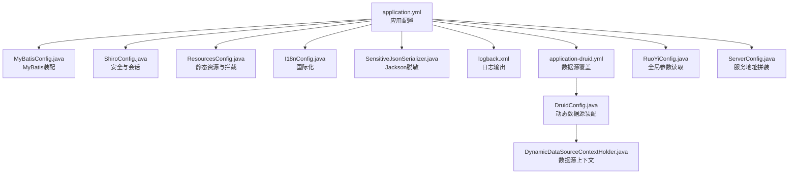
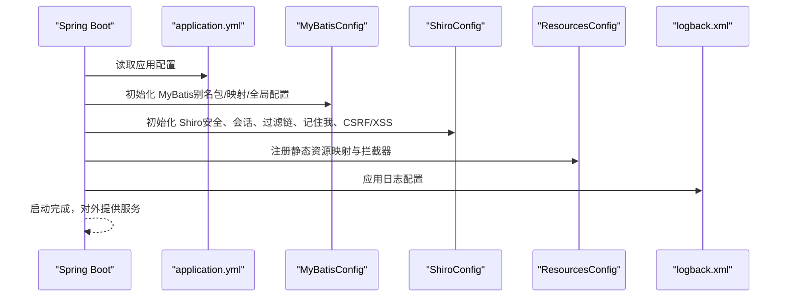
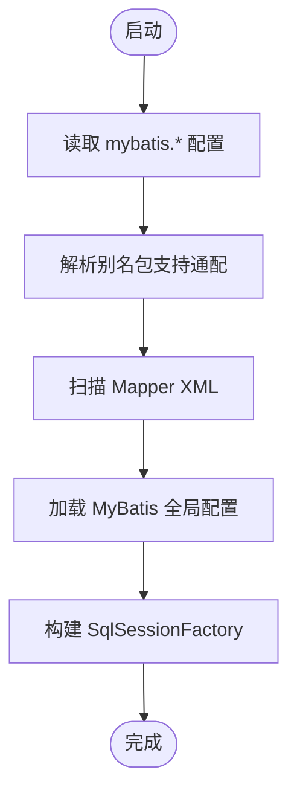
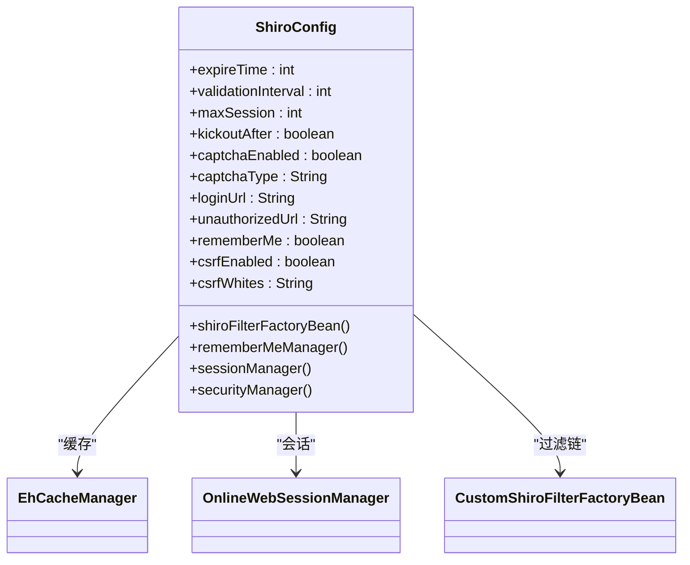
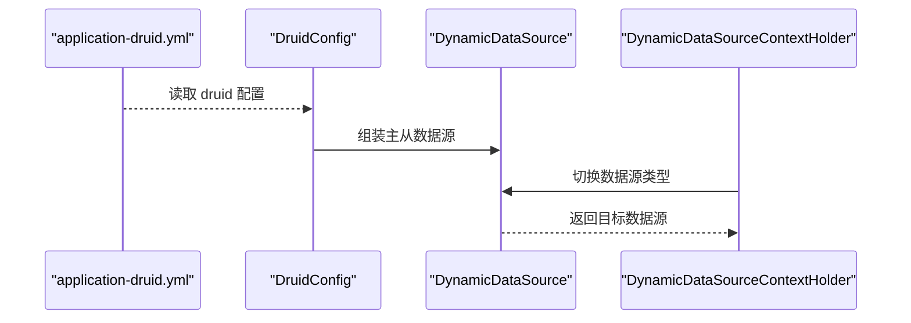
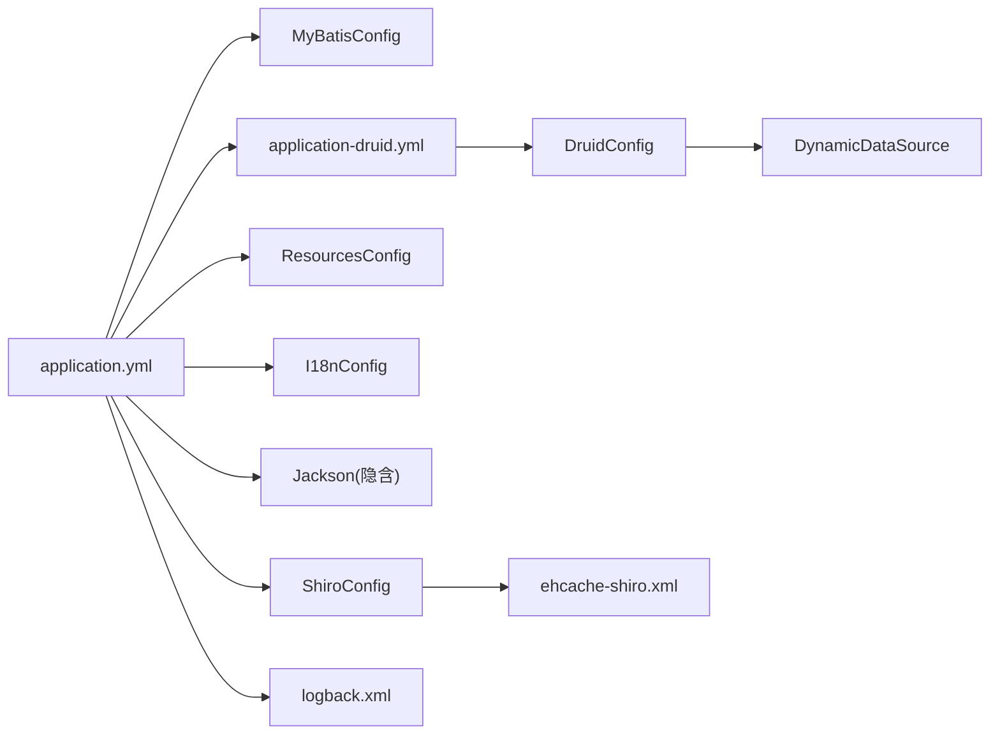

# 应用配置

<cite>
**本文引用的文件**
- [application.yml](file://ruoyi-admin/src/main/resources/application.yml)
- [application-druid.yml](file://ruoyi-admin/src/main/resources/application-druid.yml)
- [logback.xml](file://ruoyi-admin/src/main/resources/logback.xml)
- [RuoYiConfig.java](file://ruoyi-common/src/main/java/com/ruoyi/common/config/RuoYiConfig.java)
- [ServerConfig.java](file://ruoyi-common/src/main/java/com/ruoyi/common/config/ServerConfig.java)
- [MyBatisConfig.java](file://ruoyi-framework/src/main/java/com/ruoyi/framework/config/MyBatisConfig.java)
- [mybatis-config.xml](file://ruoyi-admin/src/main/resources/mybatis/mybatis-config.xml)
- [ShiroConfig.java](file://ruoyi-framework/src/main/java/com/ruoyi/framework/config/ShiroConfig.java)
- [ehcache-shiro.xml](file://ruoyi-admin/src/main/resources/ehcache/ehcache-shiro.xml)
- [I18nConfig.java](file://ruoyi-framework/src/main/java/com/ruoyi/framework/config/I18nConfig.java)
- [ResourcesConfig.java](file://ruoyi-framework/src/main/java/com/ruoyi/framework/config/ResourcesConfig.java)
- [SensitiveJsonSerializer.java](file://ruoyi-common/src/main/java/com/ruoyi/common/config/serializer/SensitiveJsonSerializer.java)
- [ThreadPoolConfig.java](file://ruoyi-common/src/main/java/com/ruoyi/common/config/thread/ThreadPoolConfig.java)
- [DruidConfig.java](file://ruoyi-framework/src/main/java/com/ruoyi/framework/config/DruidConfig.java)
- [DynamicDataSourceContextHolder.java](file://ruoyi-common/src/main/java/com/ruoyi/common/config/datasource/DynamicDataSourceContextHolder.java)
</cite>

## 目录
1. [简介](#简介)
2. [项目结构](#项目结构)
3. [核心组件](#核心组件)
4. [架构总览](#架构总览)
5. [详细组件解析](#详细组件解析)
6. [依赖关系分析](#依赖关系分析)
7. [性能与调优建议](#性能与调优建议)
8. [故障排查指南](#故障排查指南)
9. [结论](#结论)
10. [附录：环境配置与切换](#附录环境配置与切换)

## 简介
本指南围绕 RuoYi 应用的配置体系，系统梳理 application.yml 中的关键参数，并结合框架层配置类与 XML 配置文件，解释以下主题：
- 项目基本信息、服务器配置、日志级别、文件上传限制
- MyBatis、PageHelper 分页插件、Shiro 安全框架的配置要点
- Thymeleaf 模板引擎、国际化、Jackson 序列化配置
- 不同环境（开发/测试/生产）的配置差异与切换方法
- 配置参数的调优建议与最佳实践

## 项目结构
RuoYi 的配置主要分布在如下位置：
- 应用配置：ruoyi-admin/src/main/resources/application.yml 及其环境专用覆盖文件
- 日志配置：ruoyi-admin/src/main/resources/logback.xml
- MyBatis 全局配置：ruoyi-admin/src/main/resources/mybatis/mybatis-config.xml
- 框架配置类：ruoyi-framework/src/main/java/com/ruoyi/framework/config 下的若干 Java 配置类
- 安全与缓存：ruoyi-admin/src/main/resources/ehcache/ehcache-shiro.xml
- 公共配置类：ruoyi-common/src/main/java/com/ruoyi/common/config 下的若干 Java 配置类

图表来源
- [application.yml:1-154](file://ruoyi-admin/src/main/resources/application.yml#L1-L154)
- [MyBatisConfig.java:116-131](file://ruoyi-framework/src/main/java/com/ruoyi/framework/config/MyBatisConfig.java#L116-L131)
- [ShiroConfig.java:296-346](file://ruoyi-framework/src/main/java/com/ruoyi/framework/config/ShiroConfig.java#L296-L346)
- [ResourcesConfig.java:40-48](file://ruoyi-framework/src/main/java/com/ruoyi/framework/config/ResourcesConfig.java#L40-L48)
- [I18nConfig.java:18-42](file://ruoyi-framework/src/main/java/com/ruoyi/framework/config/I18nConfig.java#L18-L42)
- [SensitiveJsonSerializer.java:21-64](file://ruoyi-common/src/main/java/com/ruoyi/common/config/serializer/SensitiveJsonSerializer.java#L21-L64)
- [logback.xml:1-93](file://ruoyi-admin/src/main/resources/logback.xml#L1-L93)
- [application-druid.yml:1-61](file://ruoyi-admin/src/main/resources/application-druid.yml#L1-L61)
- [DruidConfig.java:32-79](file://ruoyi-framework/src/main/java/com/ruoyi/framework/config/DruidConfig.java#L32-L79)
- [DynamicDataSourceContextHolder.java:11-44](file://ruoyi-common/src/main/java/com/ruoyi/common/config/datasource/DynamicDataSourceContextHolder.java#L11-L44)
- [RuoYiConfig.java:11-124](file://ruoyi-common/src/main/java/com/ruoyi/common/config/RuoYiConfig.java#L11-L124)
- [ServerConfig.java:14-33](file://ruoyi-common/src/main/java/com/ruoyi/common/config/ServerConfig.java#L14-L33)

章节来源
- [application.yml:1-154](file://ruoyi-admin/src/main/resources/application.yml#L1-L154)
- [application-druid.yml:1-61](file://ruoyi-admin/src/main/resources/application-druid.yml#L1-L61)
- [logback.xml:1-93](file://ruoyi-admin/src/main/resources/logback.xml#L1-L93)
- [RuoYiConfig.java:11-124](file://ruoyi-common/src/main/java/com/ruoyi/common/config/RuoYiConfig.java#L11-L124)
- [ServerConfig.java:14-33](file://ruoyi-common/src/main/java/com/ruoyi/common/config/ServerConfig.java#L14-L33)
- [MyBatisConfig.java:32-131](file://ruoyi-framework/src/main/java/com/ruoyi/framework/config/MyBatisConfig.java#L32-L131)
- [mybatis-config.xml:1-21](file://ruoyi-admin/src/main/resources/mybatis/mybatis-config.xml#L1-L21)
- [ShiroConfig.java:50-448](file://ruoyi-framework/src/main/java/com/ruoyi/framework/config/ShiroConfig.java#L50-L448)
- [ehcache-shiro.xml:1-91](file://ruoyi-admin/src/main/resources/ehcache/ehcache-shiro.xml#L1-L91)
- [I18nConfig.java:18-42](file://ruoyi-framework/src/main/java/com/ruoyi/framework/config/I18nConfig.java#L18-L42)
- [ResourcesConfig.java:19-57](file://ruoyi-framework/src/main/java/com/ruoyi/framework/config/ResourcesConfig.java#L19-L57)
- [SensitiveJsonSerializer.java:21-64](file://ruoyi-common/src/main/java/com/ruoyi/common/config/serializer/SensitiveJsonSerializer.java#L21-L64)
- [ThreadPoolConfig.java:17-63](file://ruoyi-common/src/main/java/com/ruoyi/common/config/thread/ThreadPoolConfig.java#L17-L63)
- [DruidConfig.java:32-128](file://ruoyi-framework/src/main/java/com/ruoyi/framework/config/DruidConfig.java#L32-L128)
- [DynamicDataSourceContextHolder.java:11-44](file://ruoyi-common/src/main/java/com/ruoyi/common/config/datasource/DynamicDataSourceContextHolder.java#L11-L44)

## 核心组件
本节聚焦 application.yml 中的关键配置项及其作用域。

- 项目基本信息
  - ruoyi.name、ruoyi.version、ruoyi.copyrightYear：用于界面展示与版权信息
  - ruoyi.demoEnabled：演示模式开关
  - ruoyi.profile：文件上传根目录（Windows/Linux 路径示例）
  - ruoyi.addressEnabled：IP 地址查询开关

- 服务器配置
  - server.port、server.servlet.context-path、server.tomcat.uri-encoding、server.tomcat.accept-count、server.tomcat.threads.max/min-spare：控制 HTTP 服务与线程池行为

- 日志级别
  - logging.level.*：Spring Boot 日志级别控制（示例针对 com.ruoyi 与 org.springframework）

- 用户配置
  - user.password.maxRetryCount：密码错误最大重试次数

- Spring 配置
  - spring.thymeleaf.*：模板引擎模式、编码、缓存
  - spring.messages.basename：国际化资源基础名
  - spring.jackson.*：时区与日期格式
  - spring.profiles.active：激活的配置文件（示例 druid）
  - spring.servlet.multipart.*：单文件与总上传大小限制

- MyBatis
  - mybatis.typeAliasesPackage、mybatis.mapperLocations、mybatis.configLocation：实体别名包、映射文件位置与全局配置文件

- PageHelper 分页插件
  - pagehelper.helperDialect、pagehelper.supportMethodsArguments、pagehelper.params：方言、参数支持与 SQL 解析参数

- Shiro
  - shiro.user.*、shiro.cookie.*、shiro.session.*、shiro.rememberMe.*：登录地址、未授权地址、首页、验证码、Cookie、会话、记住我
  - csrf.enabled、csrf.whites：CSRF 开关与白名单
  - xss.enabled、xss.excludes、xss.urlPatterns：XSS 过滤范围

- AI 与 Swagger
  - ai.*：AI 服务配置
  - swagger.enabled：Swagger 文档开关

章节来源
- [application.yml:1-154](file://ruoyi-admin/src/main/resources/application.yml#L1-L154)

## 架构总览
下图展示配置如何驱动应用启动与运行的关键环节。

图表来源
- [application.yml:1-154](file://ruoyi-admin/src/main/resources/application.yml#L1-L154)
- [MyBatisConfig.java:116-131](file://ruoyi-framework/src/main/java/com/ruoyi/framework/config/MyBatisConfig.java#L116-L131)
- [ShiroConfig.java:296-346](file://ruoyi-framework/src/main/java/com/ruoyi/framework/config/ShiroConfig.java#L296-L346)
- [ResourcesConfig.java:40-48](file://ruoyi-framework/src/main/java/com/ruoyi/framework/config/ResourcesConfig.java#L40-L48)
- [logback.xml:1-93](file://ruoyi-admin/src/main/resources/logback.xml#L1-L93)

## 详细组件解析

### 服务器与线程池配置
- 关键点
  - server.port：HTTP 端口
  - server.servlet.context-path：应用上下文路径
  - server.tomcat.uri-encoding：URI 编码
  - server.tomcat.accept-count：连接池排队容量
  - server.tomcat.threads.max/min-spare：Tomcat 线程池规模
- 影响
  - 并发承载能力与响应延迟
  - 生产环境建议根据 QPS 与 GC 行为调优线程数与排队数

章节来源
- [application.yml:17-32](file://ruoyi-admin/src/main/resources/application.yml#L17-L32)

### 日志配置
- 关键点
  - logging.level.*：按包设置日志级别
  - logback.xml：控制台与滚动文件输出、按级别过滤、路径与格式
- 影响
  - 生产环境建议开启 INFO/ERROR 分离与归档，避免日志风暴

章节来源
- [application.yml:34-39](file://ruoyi-admin/src/main/resources/application.yml#L34-L39)
- [logback.xml:1-93](file://ruoyi-admin/src/main/resources/logback.xml#L1-L93)

### 文件上传与静态资源
- 关键点
  - spring.servlet.multipart.max-file-size、spring.servlet.multipart.max-request-size：单文件与总大小限制
  - ResourcesConfig 将常量前缀映射到本地文件系统路径，结合 RuoYiConfig.profile
- 影响
  - 上传安全与带宽控制；生产需限制大小并校验扩展名

章节来源
- [application.yml:63-69](file://ruoyi-admin/src/main/resources/application.yml#L63-L69)
- [ResourcesConfig.java:40-48](file://ruoyi-framework/src/main/java/com/ruoyi/framework/config/ResourcesConfig.java#L40-L48)
- [RuoYiConfig.java:96-123](file://ruoyi-common/src/main/java/com/ruoyi/common/config/RuoYiConfig.java#L96-L123)

### MyBatis 配置
- 关键点
  - application.yml 中的 typeAliasesPackage、mapperLocations、configLocation
  - MyBatisConfig 动态解析包别名与映射文件位置，注入 SqlSessionFactory
  - mybatis-config.xml：全局 setting（如缓存、主键生成、日志实现）
- 影响
  - 类路径扫描与映射文件加载；生产建议明确包路径，避免扫描开销

图表来源
- [application.yml:71-79](file://ruoyi-admin/src/main/resources/application.yml#L71-L79)
- [MyBatisConfig.java:40-92](file://ruoyi-framework/src/main/java/com/ruoyi/framework/config/MyBatisConfig.java#L40-L92)
- [MyBatisConfig.java:116-131](file://ruoyi-framework/src/main/java/com/ruoyi/framework/config/MyBatisConfig.java#L116-L131)
- [mybatis-config.xml:7-18](file://ruoyi-admin/src/main/resources/mybatis/mybatis-config.xml#L7-L18)

章节来源
- [application.yml:71-79](file://ruoyi-admin/src/main/resources/application.yml#L71-L79)
- [MyBatisConfig.java:32-131](file://ruoyi-framework/src/main/java/com/ruoyi/framework/config/MyBatisConfig.java#L32-L131)
- [mybatis-config.xml:1-21](file://ruoyi-admin/src/main/resources/mybatis/mybatis-config.xml#L1-L21)

### PageHelper 分页插件
- 关键点
  - pagehelper.helperDialect：数据库方言（MySQL）
  - pagehelper.supportMethodsArguments：支持方法参数传递
  - pagehelper.params：传参键名（count=countSql）
- 影响
  - 分页 SQL 生成与 count 查询；需与实际数据库一致

章节来源
- [application.yml:80-85](file://ruoyi-admin/src/main/resources/application.yml#L80-L85)

### Shiro 安全框架
- 关键点
  - shiro.user.*：登录、未授权、首页、验证码开关与类型
  - shiro.cookie.*：域名、路径、HttpOnly、过期时间、密钥
  - shiro.session.*：会话超时、同步周期、校验间隔、最大会话数、踢人策略
  - shiro.rememberMe.enabled：记住我开关
  - csrf.enabled、csrf.whites：CSRF 开关与白名单
  - xss.enabled、xss.excludes、xss.urlPatterns：XSS 过滤范围
- 影响
  - 安全强度与用户体验平衡；生产建议开启 CSRF/XSS，合理设置会话与验证码

图表来源
- [ShiroConfig.java:50-448](file://ruoyi-framework/src/main/java/com/ruoyi/framework/config/ShiroConfig.java#L50-L448)

章节来源
- [application.yml:86-132](file://ruoyi-admin/src/main/resources/application.yml#L86-L132)
- [ShiroConfig.java:50-448](file://ruoyi-framework/src/main/java/com/ruoyi/framework/config/ShiroConfig.java#L50-L448)
- [ehcache-shiro.xml:15-90](file://ruoyi-admin/src/main/resources/ehcache/ehcache-shiro.xml#L15-L90)

### 国际化与模板引擎
- 关键点
  - spring.thymeleaf.*：HTML 模式、编码、禁用缓存
  - spring.messages.basename：国际化资源基础名
  - I18nConfig：SessionLocaleResolver 与 LocaleChangeInterceptor
- 影响
  - 页面渲染与消息文本本地化；开发建议开启缓存，生产关闭缓存以便热更新

章节来源
- [application.yml:48-62](file://ruoyi-admin/src/main/resources/application.yml#L48-L62)
- [I18nConfig.java:18-42](file://ruoyi-framework/src/main/java/com/ruoyi/framework/config/I18nConfig.java#L18-L42)

### Jackson 序列化与脱敏
- 关键点
  - spring.jackson.time-zone、spring.jackson.date-format：时区与日期格式
  - SensitiveJsonSerializer：基于注解的字符串脱敏策略，管理员不脱敏
- 影响
  - 输出安全与一致性；生产建议统一时区与时钟偏移

章节来源
- [application.yml:58-60](file://ruoyi-admin/src/main/resources/application.yml#L58-L60)
- [SensitiveJsonSerializer.java:21-64](file://ruoyi-common/src/main/java/com/ruoyi/common/config/serializer/SensitiveJsonSerializer.java#L21-L64)

### 线程池与异步任务
- 关键点
  - ThreadPoolConfig：核心线程、最大线程、队列容量、拒绝策略
- 影响
  - 异步任务与定时任务吞吐；生产建议结合业务峰值调优

章节来源
- [ThreadPoolConfig.java:17-63](file://ruoyi-common/src/main/java/com/ruoyi/common/config/thread/ThreadPoolConfig.java#L17-L63)

### 数据源与动态数据源
- 关键点
  - application-druid.yml：Druid 主从数据源、连接池参数、监控控制台
  - DruidConfig：装配主从数据源，注册动态数据源，移除监控页广告
  - DynamicDataSourceContextHolder：线程上下文切换数据源
- 影响
  - 读写分离与高可用；生产建议开启从库与慢 SQL 监控

图表来源
- [application-druid.yml:1-61](file://ruoyi-admin/src/main/resources/application-druid.yml#L1-L61)
- [DruidConfig.java:32-79](file://ruoyi-framework/src/main/java/com/ruoyi/framework/config/DruidConfig.java#L32-L79)
- [DynamicDataSourceContextHolder.java:11-44](file://ruoyi-common/src/main/java/com/ruoyi/common/config/datasource/DynamicDataSourceContextHolder.java#L11-L44)

章节来源
- [application-druid.yml:1-61](file://ruoyi-admin/src/main/resources/application-druid.yml#L1-L61)
- [DruidConfig.java:32-128](file://ruoyi-framework/src/main/java/com/ruoyi/framework/config/DruidConfig.java#L32-L128)
- [DynamicDataSourceContextHolder.java:11-44](file://ruoyi-common/src/main/java/com/ruoyi/common/config/datasource/DynamicDataSourceContextHolder.java#L11-L44)

## 依赖关系分析
- 配置耦合
  - application.yml 作为单一配置源，被 MyBatisConfig、ShiroConfig、ResourcesConfig、I18nConfig、SensitiveJsonSerializer 等读取
  - application-druid.yml 仅在激活 druid profile 时生效，与 DruidConfig 协作
- 外部依赖
  - MyBatis 依赖映射文件与全局配置
  - Shiro 依赖 Ehcache 配置与自定义过滤器
  - 日志依赖 Logback 配置

图表来源
- [application.yml:1-154](file://ruoyi-admin/src/main/resources/application.yml#L1-L154)
- [application-druid.yml:1-61](file://ruoyi-admin/src/main/resources/application-druid.yml#L1-L61)
- [MyBatisConfig.java:116-131](file://ruoyi-framework/src/main/java/com/ruoyi/framework/config/MyBatisConfig.java#L116-L131)
- [ShiroConfig.java:296-346](file://ruoyi-framework/src/main/java/com/ruoyi/framework/config/ShiroConfig.java#L296-L346)
- [ResourcesConfig.java:40-48](file://ruoyi-framework/src/main/java/com/ruoyi/framework/config/ResourcesConfig.java#L40-L48)
- [I18nConfig.java:18-42](file://ruoyi-framework/src/main/java/com/ruoyi/framework/config/I18nConfig.java#L18-L42)
- [DruidConfig.java:32-79](file://ruoyi-framework/src/main/java/com/ruoyi/framework/config/DruidConfig.java#L32-L79)
- [ehcache-shiro.xml:1-91](file://ruoyi-admin/src/main/resources/ehcache/ehcache-shiro.xml#L1-L91)
- [logback.xml:1-93](file://ruoyi-admin/src/main/resources/logback.xml#L1-L93)

章节来源
- [application.yml:1-154](file://ruoyi-admin/src/main/resources/application.yml#L1-L154)
- [application-druid.yml:1-61](file://ruoyi-admin/src/main/resources/application-druid.yml#L1-L61)
- [ShiroConfig.java:50-448](file://ruoyi-framework/src/main/java/com/ruoyi/framework/config/ShiroConfig.java#L50-L448)
- [DruidConfig.java:32-128](file://ruoyi-framework/src/main/java/com/ruoyi/framework/config/DruidConfig.java#L32-L128)

## 性能与调优建议
- 服务器与线程池
  - 根据 CPU 核心数与请求特征设置 server.tomcat.threads.max/min-spare，避免过多线程导致上下文切换开销
  - 合理设置 accept-count，防止突发流量导致排队过长
- 日志
  - 生产环境开启 RollingFile，按级别分离日志，控制保留天数与文件大小
- MyBatis
  - 明确 typeAliasesPackage 与 mapperLocations，减少扫描范围
  - 启用合适的 ExecutorType 与日志实现
- PageHelper
  - 方言与参数需与数据库一致，避免额外 count 查询
- Shiro
  - 会话超时与校验间隔应结合业务登录频率调整
  - 记住我密钥建议固定并在集群间共享，避免随机密钥导致状态不一致
- 数据源
  - 连接池参数（初始、最小、最大、等待、超时）需结合数据库最大连接与负载调优
  - 开启慢 SQL 监控，定期分析慢查询
- 国际化与模板
  - 开发阶段可关闭缓存，生产阶段开启以提升渲染性能
- Jackson
  - 统一时区与日期格式，避免跨时区显示问题

## 故障排查指南
- 上传失败或过大
  - 检查 spring.servlet.multipart.max-file-size 与 spring.servlet.multipart.max-request-size
  - 确认 ResourcesConfig 的资源映射与 RuoYiConfig.profile 路径存在且可写
- 日志异常
  - 检查 logback.xml 的路径与权限，确认 appender 与 logger 级别配置
- MyBatis 映射或别名问题
  - 核对 application.yml 的 typeAliasesPackage 与 mapperLocations，确保包扫描正确
- Shiro 登录/会话异常
  - 检查 shiro.user.*、shiro.session.*、shiro.cookie.* 配置
  - 确认 Ehcache 配置文件路径与缓存可用性
- CSRF/XSS 阻断误伤
  - 根据业务调整 csrf.whites 与 xss.urlPatterns
- 数据源连接异常
  - 检查 application-druid.yml 的 master/slave 配置与网络连通性
  - 查看 Druid 监控控制台与慢 SQL 日志

章节来源
- [application.yml:63-69](file://ruoyi-admin/src/main/resources/application.yml#L63-L69)
- [ResourcesConfig.java:40-48](file://ruoyi-framework/src/main/java/com/ruoyi/framework/config/ResourcesConfig.java#L40-L48)
- [RuoYiConfig.java:96-123](file://ruoyi-common/src/main/java/com/ruoyi/common/config/RuoYiConfig.java#L96-L123)
- [logback.xml:1-93](file://ruoyi-admin/src/main/resources/logback.xml#L1-L93)
- [application.yml:71-79](file://ruoyi-admin/src/main/resources/application.yml#L71-L79)
- [application.yml:86-132](file://ruoyi-admin/src/main/resources/application.yml#L86-L132)
- [ehcache-shiro.xml:1-91](file://ruoyi-admin/src/main/resources/ehcache/ehcache-shiro.xml#L1-L91)
- [application-druid.yml:1-61](file://ruoyi-admin/src/main/resources/application-druid.yml#L1-L61)

## 结论
RuoYi 的配置体系以 application.yml 为核心，配合框架层配置类与 XML 配置，实现了从服务器、日志、MyBatis、分页、安全到国际化与序列化的完整闭环。生产环境中应重点关注数据源与线程池参数、Shiro 会话与安全策略、日志分级与归档、以及上传与国际化缓存策略，以获得稳定、安全与高性能的运行体验。

## 附录：环境配置与切换
- 环境激活
  - spring.profiles.active：通过 application.yml 指定激活的 profile（示例 druid）
- 环境覆盖
  - application-druid.yml：在激活 druid profile 时覆盖数据源相关配置
- 切换方法
  - 开发：可使用默认 profile，禁用 druid 或使用本地 H2
  - 测试：启用 druid，连接测试库
  - 生产：启用 druid，配置主从与监控，开启慢 SQL 与告警
- 最佳实践
  - 将敏感信息放入外部配置中心或环境变量
  - 不同环境使用不同的日志路径与级别
  - 上传路径与静态资源映射需与部署路径一致

章节来源
- [application.yml:61-62](file://ruoyi-admin/src/main/resources/application.yml#L61-L62)
- [application-druid.yml:1-61](file://ruoyi-admin/src/main/resources/application-druid.yml#L1-L61)