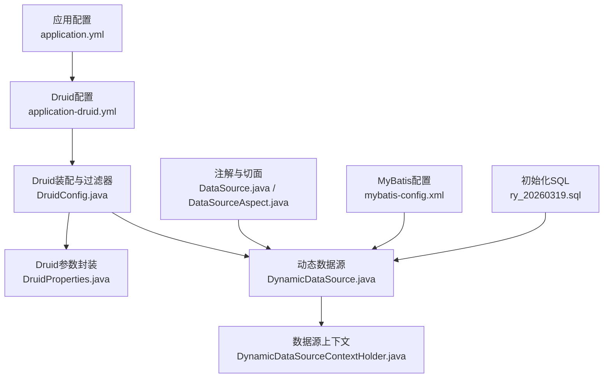
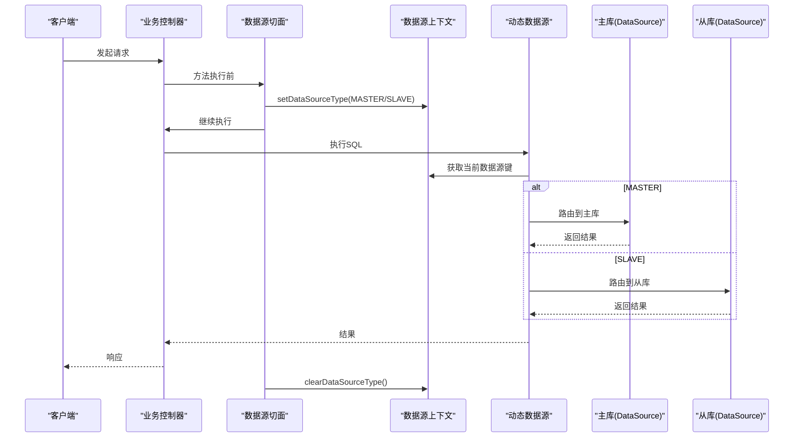
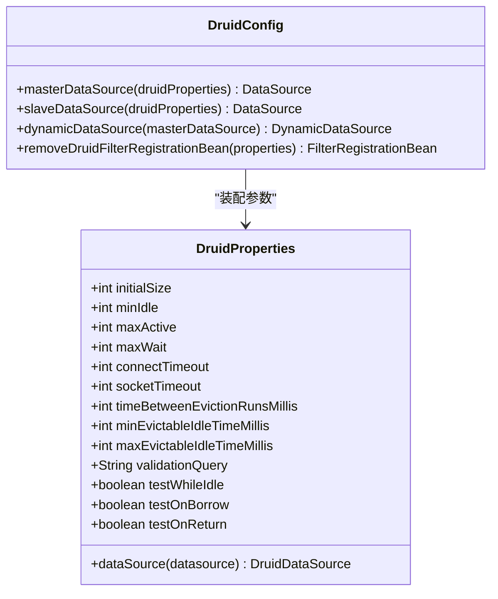
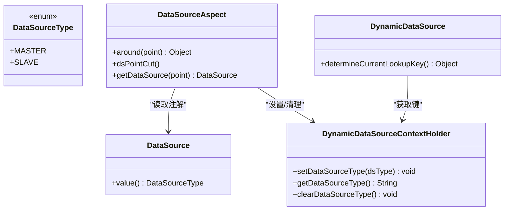
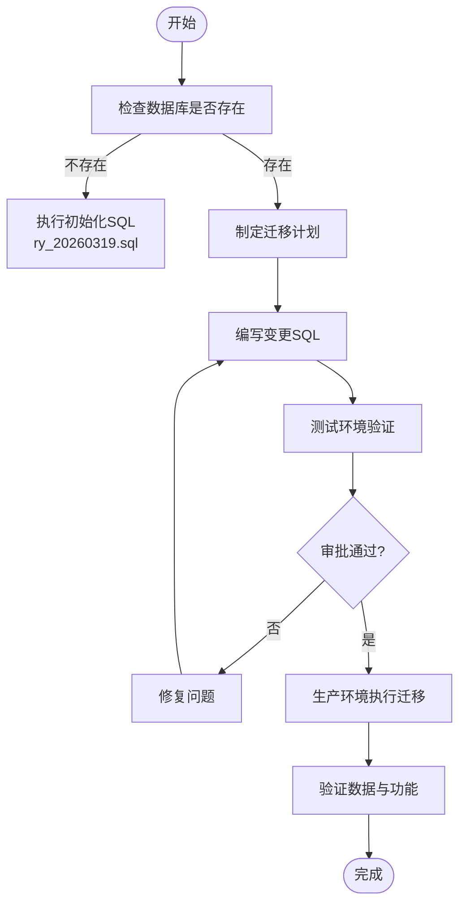
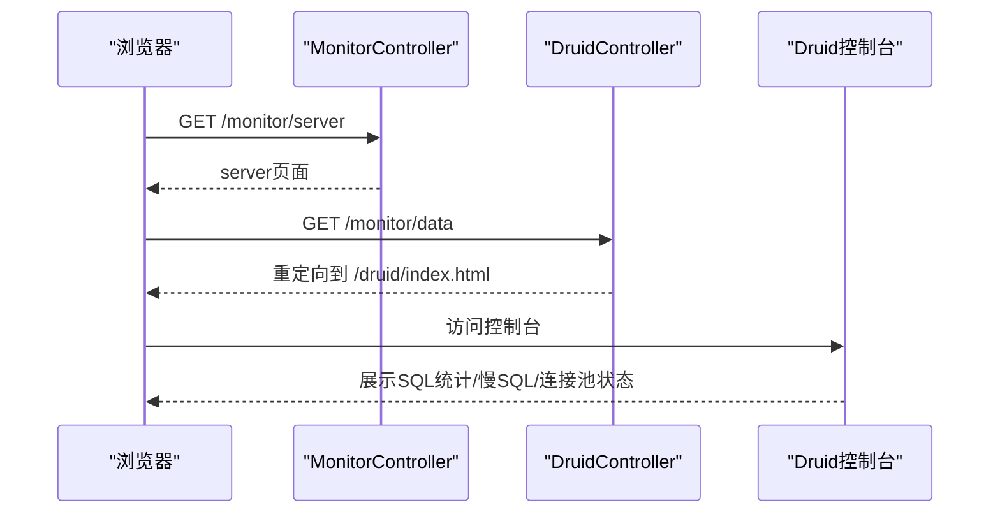
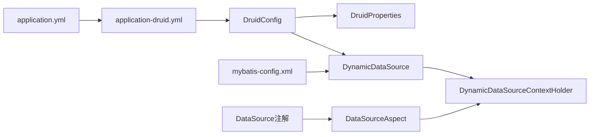

# 数据库配置

<cite>
**本文引用的文件**
- [application.yml](file://ruoyi-admin/src/main/resources/application.yml)
- [application-druid.yml](file://ruoyi-admin/src/main/resources/application-druid.yml)
- [mybatis-config.xml](file://ruoyi-admin/src/main/resources/mybatis/mybatis-config.xml)
- [DruidConfig.java](file://ruoyi-framework/src/main/java/com/ruoyi/framework/config/DruidConfig.java)
- [DruidProperties.java](file://ruoyi-framework/src/main/java/com/ruoyi/framework/config/properties/DruidProperties.java)
- [DynamicDataSource.java](file://ruoyi-framework/src/main/java/com/ruoyi/framework/datasource/DynamicDataSource.java)
- [DynamicDataSourceContextHolder.java](file://ruoyi-common/src/main/java/com/ruoyi/common/config/datasource/DynamicDataSourceContextHolder.java)
- [DataSourceType.java](file://ruoyi-common/src/main/java/com/ruoyi/common/enums/DataSourceType.java)
- [DataSource.java](file://ruoyi-common/src/main/java/com/ruoyi/common/annotation/DataSource.java)
- [DataSourceAspect.java](file://ruoyi-framework/src/main/java/com/ruoyi/framework/aspectj/DataSourceAspect.java)
- [DruidController.java](file://ruoyi-admin/src/main/java/com/ruoyi/web/controller/monitor/DruidController.java)
- [ServerController.java](file://ruoyi-admin/src/main/java/com/ruoyi/web/controller/monitor/ServerController.java)
- [Mem.java](file://ruoyi-framework/src/main/java/com/ruoyi/framework/web/domain/server/Mem.java)
- [ry_20260319.sql](file://sql/ry_20260319.sql)
</cite>

## 目录
1. [简介](#简介)
2. [项目结构](#项目结构)
3. [核心组件](#核心组件)
4. [架构总览](#架构总览)
5. [详细组件分析](#详细组件分析)
6. [依赖分析](#依赖分析)
7. [性能考虑](#性能考虑)
8. [故障排查指南](#故障排查指南)
9. [结论](#结论)
10. [附录](#附录)

## 简介
本文件面向RuoYi系统的数据库配置与运维，聚焦于MySQL数据库安装与配置要求、Druid数据库连接池参数说明、数据库初始化与迁移、多数据源与动态切换机制、以及数据库监控与备份策略建议。文档基于仓库中的实际配置与代码进行梳理，帮助开发者与运维人员快速落地生产环境。

## 项目结构
RuoYi的数据库相关配置主要分布在如下位置：
- 应用配置：ruoyi-admin/src/main/resources/application.yml（激活profile）
- Druid数据源配置：ruoyi-admin/src/main/resources/application-druid.yml
- MyBatis全局配置：ruoyi-admin/src/main/resources/mybatis/mybatis-config.xml
- Druid连接池装配与过滤器：ruoyi-framework/src/main/java/com/ruoyi/framework/config/DruidConfig.java
- Druid参数封装：ruoyi-framework/src/main/java/com/ruoyi/framework/config/properties/DruidProperties.java
- 多数据源路由与上下文：ruoyi-framework/src/main/java/com/ruoyi/framework/datasource/DynamicDataSource.java、ruoyi-common/src/main/java/com/ruoyi/common/config/datasource/DynamicDataSourceContextHolder.java
- 注解与切面：ruoyi-common/src/main/java/com/ruoyi/common/annotation/DataSource.java、ruoyi-framework/src/main/java/com/ruoyi/framework/aspectj/DataSourceAspect.java
- 数据源枚举：ruoyi-common/src/main/java/com/ruoyi/common/enums/DataSourceType.java
- 初始化SQL：sql/ry_20260319.sql

**图示来源**
- [application.yml:61-62](file://ruoyi-admin/src/main/resources/application.yml#L61-L62)
- [application-druid.yml:1-61](file://ruoyi-admin/src/main/resources/application-druid.yml#L1-L61)
- [DruidConfig.java:32-129](file://ruoyi-framework/src/main/java/com/ruoyi/framework/config/DruidConfig.java#L32-L129)
- [DruidProperties.java:12-90](file://ruoyi-framework/src/main/java/com/ruoyi/framework/config/properties/DruidProperties.java#L12-L90)
- [DynamicDataSource.java:13-27](file://ruoyi-framework/src/main/java/com/ruoyi/framework/datasource/DynamicDataSource.java#L13-L27)
- [DynamicDataSourceContextHolder.java:11-46](file://ruoyi-common/src/main/java/com/ruoyi/common/config/datasource/DynamicDataSourceContextHolder.java#L11-L46)
- [DataSource.java:22-28](file://ruoyi-common/src/main/java/com/ruoyi/common/annotation/DataSource.java#L22-L28)
- [DataSourceAspect.java:26-73](file://ruoyi-framework/src/main/java/com/ruoyi/framework/aspectj/DataSourceAspect.java#L26-L73)
- [mybatis-config.xml:5-21](file://ruoyi-admin/src/main/resources/mybatis/mybatis-config.xml#L5-L21)
- [ry_20260319.sql:1-739](file://sql/ry_20260319.sql#L1-L739)

**章节来源**
- [application.yml:1-154](file://ruoyi-admin/src/main/resources/application.yml#L1-L154)
- [application-druid.yml:1-61](file://ruoyi-admin/src/main/resources/application-druid.yml#L1-L61)
- [mybatis-config.xml:1-21](file://ruoyi-admin/src/main/resources/mybatis/mybatis-config.xml#L1-L21)

## 核心组件
- MySQL安装与配置要点
  - 字符集：建议使用utf8mb4，满足emoji等四字节字符需求；仓库中URL包含charset配置，需确保数据库实例与连接一致。
  - 存储引擎：推荐InnoDB，具备事务、行级锁、崩溃恢复能力；初始化SQL中多处使用engine=innodb。
  - 时区：统一使用GMT+8，避免跨时区问题；URL中serverTimezone=GMT%2B8。
  - SSL与安全：URL含useSSL=true，建议生产环境开启TLS。
- Druid连接池参数
  - 连接池规模：initialSize、minIdle、maxActive控制池容量与最小空闲。
  - 超时控制：maxWait、connectTimeout、socketTimeout分别控制获取连接等待、连接建立、网络IO超时。
  - 空闲回收：timeBetweenEvictionRunsMillis、minEvictableIdleTimeMillis、maxEvictableIdleTimeMillis。
  - 连接有效性：validationQuery、testWhileIdle、testOnBorrow、testOnReturn。
  - 监控：statViewServlet（控制台）、stat（慢SQL统计）、wall（SQL防火墙）。
- MyBatis配置
  - 缓存、主键生成、执行器类型、日志实现等设置。
- 多数据源与动态切换
  - 枚举定义MASTER/SLAVE。
  - 注解@DataSource(value=MASTER/SLAVE)标注方法或类。
  - 切面DataSourceAspect在方法执行前后设置/清理上下文。
  - DynamicDataSource根据上下文决定使用哪个数据源。

**章节来源**
- [application-druid.yml:6-61](file://ruoyi-admin/src/main/resources/application-druid.yml#L6-L61)
- [DruidProperties.java:54-88](file://ruoyi-framework/src/main/java/com/ruoyi/framework/config/properties/DruidProperties.java#L54-L88)
- [mybatis-config.xml:7-18](file://ruoyi-admin/src/main/resources/mybatis/mybatis-config.xml#L7-L18)
- [DataSourceType.java:8-20](file://ruoyi-common/src/main/java/com/ruoyi/common/enums/DataSourceType.java#L8-L20)
- [DataSource.java:22-28](file://ruoyi-common/src/main/java/com/ruoyi/common/annotation/DataSource.java#L22-L28)
- [DataSourceAspect.java:37-56](file://ruoyi-framework/src/main/java/com/ruoyi/framework/aspectj/DataSourceAspect.java#L37-L56)
- [DynamicDataSource.java:22-26](file://ruoyi-framework/src/main/java/com/ruoyi/framework/datasource/DynamicDataSource.java#L22-L26)

## 架构总览
RuoYi通过Spring Boot自动装配Druid数据源，结合MyBatis进行持久层访问；多数据源通过ThreadLocal上下文在AOP切面中切换，最终由Spring JDBC路由到具体数据源。

**图示来源**
- [DataSourceAspect.java:37-56](file://ruoyi-framework/src/main/java/com/ruoyi/framework/aspectj/DataSourceAspect.java#L37-L56)
- [DynamicDataSourceContextHolder.java:24-44](file://ruoyi-common/src/main/java/com/ruoyi/common/config/datasource/DynamicDataSourceContextHolder.java#L24-L44)
- [DynamicDataSource.java:22-26](file://ruoyi-framework/src/main/java/com/ruoyi/framework/datasource/DynamicDataSource.java#L22-L26)
- [DruidConfig.java:52-60](file://ruoyi-framework/src/main/java/com/ruoyi/framework/config/DruidConfig.java#L52-L60)

## 详细组件分析

### Druid连接池配置与参数说明
- 驱动与类型
  - driverClassName：com.mysql.cj.jdbc.Driver
  - type：com.alibaba.druid.pool.DruidDataSource
- 主库与从库
  - master：包含url、username、password
  - slave：默认disabled，可按需启用
- 连接池参数
  - initialSize/minIdle/maxActive：池大小
  - maxWait/connectTimeout/socketTimeout：超时
  - timeBetweenEvictionRunsMillis/minEvictableIdleTimeMillis/maxEvictableIdleTimeMillis：空闲回收
  - validationQuery/testWhileIdle/testOnBorrow/testOnReturn：有效性校验
- 监控与过滤
  - webStatFilter.enabled：开启Web统计过滤
  - statViewServlet.enabled：开启控制台，支持白名单与登录凭据
  - filter.stat.log-slow-sql/slow-sql-millis/merge-sql：慢SQL记录
  - filter.wall.config.multi-statement-allow：允许多语句

**图示来源**
- [DruidProperties.java:12-90](file://ruoyi-framework/src/main/java/com/ruoyi/framework/config/properties/DruidProperties.java#L12-L90)
- [DruidConfig.java:32-129](file://ruoyi-framework/src/main/java/com/ruoyi/framework/config/DruidConfig.java#L32-L129)

**章节来源**
- [application-druid.yml:1-61](file://ruoyi-admin/src/main/resources/application-druid.yml#L1-L61)
- [DruidProperties.java:12-90](file://ruoyi-framework/src/main/java/com/ruoyi/framework/config/properties/DruidProperties.java#L12-L90)
- [DruidConfig.java:32-129](file://ruoyi-framework/src/main/java/com/ruoyi/framework/config/DruidConfig.java#L32-L129)

### 多数据源与动态切换机制
- 数据源枚举：MASTER/SLAVE
- 注解：@DataSource(DataSourceType)标注方法或类
- 切面：DataSourceAspect在方法执行前后设置/清理上下文
- 路由：DynamicDataSource根据ThreadLocal键选择目标数据源

**图示来源**
- [DataSourceType.java:8-20](file://ruoyi-common/src/main/java/com/ruoyi/common/enums/DataSourceType.java#L8-L20)
- [DataSource.java:22-28](file://ruoyi-common/src/main/java/com/ruoyi/common/annotation/DataSource.java#L22-L28)
- [DataSourceAspect.java:26-73](file://ruoyi-framework/src/main/java/com/ruoyi/framework/aspectj/DataSourceAspect.java#L26-L73)
- [DynamicDataSourceContextHolder.java:11-46](file://ruoyi-common/src/main/java/com/ruoyi/common/config/datasource/DynamicDataSourceContextHolder.java#L11-L46)
- [DynamicDataSource.java:13-27](file://ruoyi-framework/src/main/java/com/ruoyi/framework/datasource/DynamicDataSource.java#L13-L27)

**章节来源**
- [DataSourceType.java:8-20](file://ruoyi-common/src/main/java/com/ruoyi/common/enums/DataSourceType.java#L8-L20)
- [DataSource.java:22-28](file://ruoyi-common/src/main/java/com/ruoyi/common/annotation/DataSource.java#L22-L28)
- [DataSourceAspect.java:37-56](file://ruoyi-framework/src/main/java/com/ruoyi/framework/aspectj/DataSourceAspect.java#L37-L56)
- [DynamicDataSourceContextHolder.java:24-44](file://ruoyi-common/src/main/java/com/ruoyi/common/config/datasource/DynamicDataSourceContextHolder.java#L24-L44)
- [DynamicDataSource.java:22-26](file://ruoyi-framework/src/main/java/com/ruoyi/framework/datasource/DynamicDataSource.java#L22-L26)

### 数据库初始化与迁移
- 初始化脚本
  - 使用sql/ry_20260319.sql进行首次初始化，包含表结构与基础数据。
  - 表结构示例：sys_dept、sys_user、sys_role、sys_menu、sys_dict_*、sys_config、sys_logininfor、sys_user_online、sys_job、sys_job_log等。
- 迁移建议
  - 生产环境建议采用版本化迁移工具（如Flyway/Liquibase），配合Git管理SQL变更。
  - 迁移流程：编写变更SQL → 测试环境验证 → 预发布灰度 → 生产执行 → 回滚预案。
- 注意事项
  - 字符集与排序规则需与应用一致（仓库中URL含charset与timezone）。
  - InnoDB为默认存储引擎，确保事务一致性与并发性能。

**图示来源**
- [ry_20260319.sql:1-739](file://sql/ry_20260319.sql#L1-L739)

**章节来源**
- [ry_20260319.sql:1-739](file://sql/ry_20260319.sql#L1-L739)

### 数据库监控与Druid控制台
- 访问入口
  - Druid控制台路径：/druid（受权限控制）
  - 通过DruidController转发至/druid/index.html
- 监控功能
  - 控制台登录凭据：login-username/login-password
  - 慢SQL记录：log-slow-sql/slow-sql-millis/merge-sql
  - SQL防火墙：wall配置
- 服务器监控
  - 通过ServerController展示服务器与JVM信息，辅助定位数据库连接与性能瓶颈。

**图示来源**
- [DruidController.java:14-26](file://ruoyi-admin/src/main/java/com/ruoyi/web/controller/monitor/DruidController.java#L14-L26)
- [ServerController.java:16-31](file://ruoyi-admin/src/main/java/com/ruoyi/web/controller/monitor/ServerController.java#L16-L31)
- [application-druid.yml:44-51](file://ruoyi-admin/src/main/resources/application-druid.yml#L44-L51)

**章节来源**
- [DruidController.java:14-26](file://ruoyi-admin/src/main/java/com/ruoyi/web/controller/monitor/DruidController.java#L14-L26)
- [ServerController.java:16-31](file://ruoyi-admin/src/main/java/com/ruoyi/web/controller/monitor/ServerController.java#L16-L31)
- [application-druid.yml:44-61](file://ruoyi-admin/src/main/resources/application-druid.yml#L44-L61)

## 依赖分析
- 配置依赖
  - application.yml通过profiles.active激活application-druid.yml。
  - DruidConfig装配master/slave数据源，并注册动态数据源。
- 运行时依赖
  - DataSourceAspect在方法执行前后设置/清理ThreadLocal。
  - DynamicDataSource根据当前键选择目标数据源。
- MyBatis依赖
  - mybatis-config.xml启用缓存、主键生成、日志实现等。

**图示来源**
- [application.yml:61-62](file://ruoyi-admin/src/main/resources/application.yml#L61-L62)
- [application-druid.yml:1-61](file://ruoyi-admin/src/main/resources/application-druid.yml#L1-L61)
- [DruidConfig.java:52-60](file://ruoyi-framework/src/main/java/com/ruoyi/framework/config/DruidConfig.java#L52-L60)
- [DruidProperties.java:54-88](file://ruoyi-framework/src/main/java/com/ruoyi/framework/config/properties/DruidProperties.java#L54-L88)
- [DynamicDataSource.java:13-27](file://ruoyi-framework/src/main/java/com/ruoyi/framework/datasource/DynamicDataSource.java#L13-L27)
- [DynamicDataSourceContextHolder.java:11-46](file://ruoyi-common/src/main/java/com/ruoyi/common/config/datasource/DynamicDataSourceContextHolder.java#L11-L46)
- [DataSource.java:22-28](file://ruoyi-common/src/main/java/com/ruoyi/common/annotation/DataSource.java#L22-L28)
- [DataSourceAspect.java:37-56](file://ruoyi-framework/src/main/java/com/ruoyi/framework/aspectj/DataSourceAspect.java#L37-L56)
- [mybatis-config.xml:7-18](file://ruoyi-admin/src/main/resources/mybatis/mybatis-config.xml#L7-L18)

**章节来源**
- [application.yml:61-62](file://ruoyi-admin/src/main/resources/application.yml#L61-L62)
- [application-druid.yml:1-61](file://ruoyi-admin/src/main/resources/application-druid.yml#L1-L61)
- [DruidConfig.java:52-60](file://ruoyi-framework/src/main/java/com/ruoyi/framework/config/DruidConfig.java#L52-L60)
- [DataSourceAspect.java:37-56](file://ruoyi-framework/src/main/java/com/ruoyi/framework/aspectj/DataSourceAspect.java#L37-L56)
- [mybatis-config.xml:7-18](file://ruoyi-admin/src/main/resources/mybatis/mybatis-config.xml#L7-L18)

## 性能考虑
- 连接池参数优化
  - 初始连接与最小空闲：根据峰值QPS与平均响应时间估算，避免频繁创建销毁。
  - 最大连接：结合数据库最大连接数上限与应用并发，防止过度竞争。
  - 超时参数：maxWait/connectTimeout/socketTimeout需平衡用户体验与资源占用。
  - 空闲回收：合理设置eviction周期与空闲阈值，避免连接老化与泄露。
- SQL与索引
  - 慢SQL监控：利用Druid慢SQL日志定位热点SQL，结合索引优化。
  - 分页与扫描：PageHelper配置为mysql，注意limit偏移量过大导致的性能问题。
- 存储引擎与字符集
  - InnoDB适合高并发写入；utf8mb4满足国际化字符。
  - 时区统一GMT+8，避免跨时区引发的查询异常。
- 缓存与日志
  - MyBatis缓存与日志实现（SLF4J）有助于诊断性能瓶颈。

[本节为通用性能建议，无需特定文件引用]

## 故障排查指南
- Druid控制台无法访问
  - 检查statViewServlet.enabled与url-pattern配置。
  - 确认登录凭据正确，白名单设置是否符合预期。
- 连接池耗尽
  - 查看maxActive与maxWait，评估业务并发与数据库承载能力。
  - 关注slow-sql与连接泄漏，优化SQL与释放逻辑。
- 多数据源切换异常
  - 确认@DataSource注解使用正确，方法优先于类级别。
  - 检查切面是否生效，ThreadLocal是否在finally中清理。
- 初始化失败
  - 校验数据库字符集、时区与驱动版本。
  - 确保SQL脚本完整执行，索引与约束创建成功。

**章节来源**
- [application-druid.yml:44-61](file://ruoyi-admin/src/main/resources/application-druid.yml#L44-L61)
- [DruidConfig.java:84-127](file://ruoyi-framework/src/main/java/com/ruoyi/framework/config/DruidConfig.java#L84-L127)
- [DataSourceAspect.java:47-56](file://ruoyi-framework/src/main/java/com/ruoyi/framework/aspectj/DataSourceAspect.java#L47-L56)
- [ry_20260319.sql:1-739](file://sql/ry_20260319.sql#L1-L739)

## 结论
RuoYi的数据库配置以Druid为核心，结合MyBatis与多数据源动态切换机制，提供了灵活、可观测、可扩展的数据库访问能力。生产部署中应重点关注连接池参数、SQL性能、字符集与时区一致性，并通过Druid控制台与服务器监控持续观测系统健康状况。

[本节为总结性内容，无需特定文件引用]

## 附录
- MySQL安装与配置清单
  - 字符集：utf8mb4
  - 排序规则：建议与应用一致
  - 存储引擎：InnoDB
  - 时区：GMT+8
  - SSL：生产环境启用
- Druid监控页面
  - 访问路径：/druid
  - 登录凭据：application-druid.yml中配置
- 服务器监控
  - 页面路径：/monitor/server
  - 展示内容：内存、JVM、磁盘等指标

**章节来源**
- [application-druid.yml:44-61](file://ruoyi-admin/src/main/resources/application-druid.yml#L44-L61)
- [ServerController.java:16-31](file://ruoyi-admin/src/main/java/com/ruoyi/web/controller/monitor/ServerController.java#L16-L31)
- [Mem.java:10-61](file://ruoyi-framework/src/main/java/com/ruoyi/framework/web/domain/server/Mem.java#L10-L61)