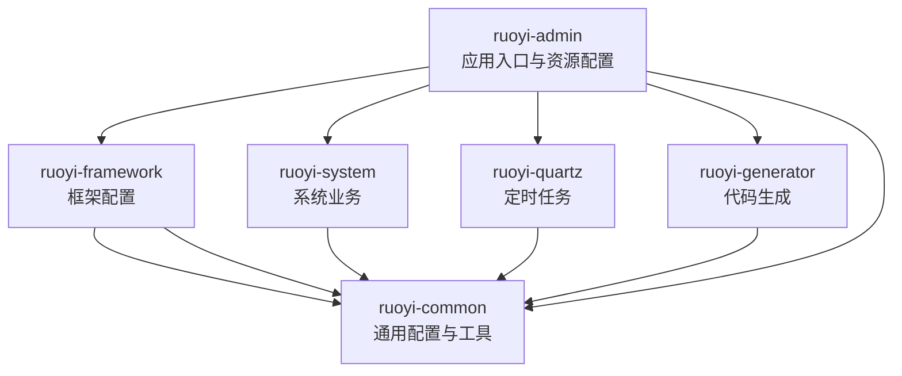
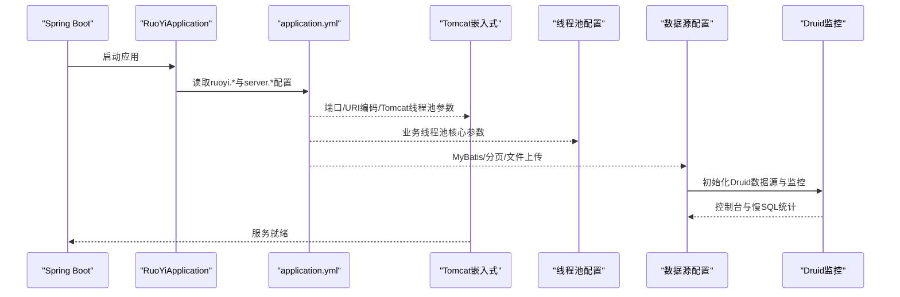
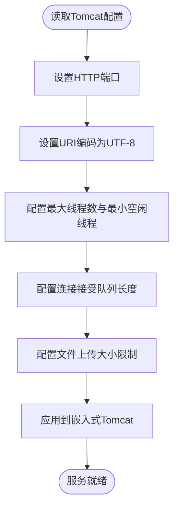
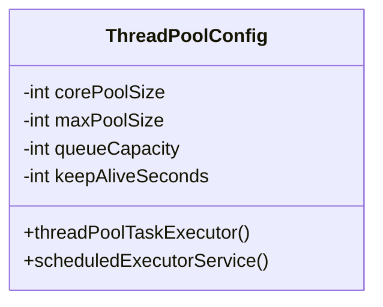
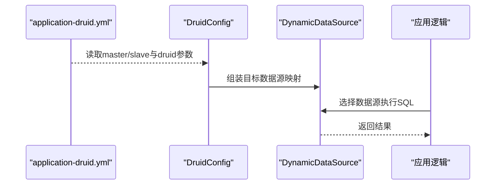
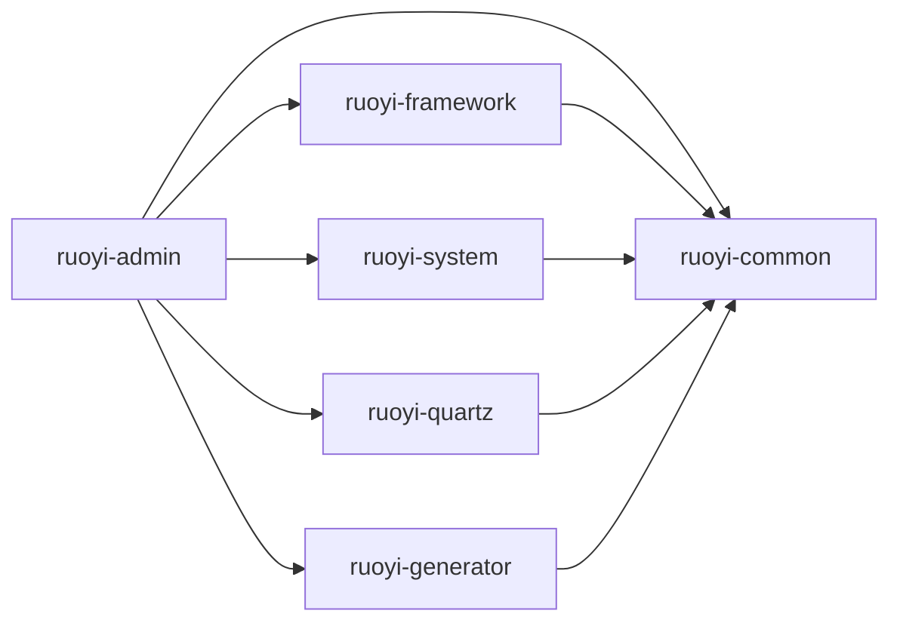

# 环境准备

<cite>
**本文引用的文件**
- [pom.xml](file://pom.xml)
- [application.yml](file://ruoyi-admin/src/main/resources/application.yml)
- [application-druid.yml](file://ruoyi-admin/src/main/resources/application-druid.yml)
- [RuoYiApplication.java](file://ruoyi-admin/src/main/java/com/ruoyi/RuoYiApplication.java)
- [ThreadPoolConfig.java](file://ruoyi-common/src/main/java/com/ruoyi/common/config/thread/ThreadPoolConfig.java)
- [DruidConfig.java](file://ruoyi-framework/src/main/java/com/ruoyi/framework/config/DruidConfig.java)
- [RuoYiConfig.java](file://ruoyi-common/src/main/java/com/ruoyi/common/config/RuoYiConfig.java)
- [ServerConfig.java](file://ruoyi-common/src/main/java/com/ruoyi/common/config/ServerConfig.java)
- [run.bat](file://bin/run.bat)
- [package.bat](file://bin/package.bat)
- [ry.bat](file://ry.bat)
- [ry.sh](file://ry.sh)
- [ShiroConfig.java](file://ruoyi-framework/src/main/java/com/ruoyi/framework/config/ShiroConfig.java)
- [MyBatisConfig.java](file://ruoyi-framework/src/main/java/com/ruoyi/framework/config/MyBatisConfig.java)
- [ry_20260319.sql](file://sql/ry_20260319.sql)
</cite>

## 目录
1. [简介](#简介)
2. [项目结构](#项目结构)
3. [核心组件](#核心组件)
4. [架构总览](#架构总览)
5. [详细组件分析](#详细组件分析)
6. [依赖分析](#依赖分析)
7. [性能考虑](#性能考虑)
8. [故障排查指南](#故障排查指南)
9. [结论](#结论)
10. [附录](#附录)

## 简介
本指南面向RuoYi系统的环境准备与部署，覆盖服务器硬件建议、操作系统与JDK版本兼容性、数据库要求、Tomcat服务器配置要点、Windows/Linux安装步骤、网络与防火墙配置、域名解析、环境变量与系统资源优化建议。内容基于仓库中的配置文件与脚本进行整理，确保读者能按步骤完成生产级部署。

## 项目结构
RuoYi采用多模块Maven工程组织，核心模块包括：
- ruoyi-admin：Web应用入口与前端模板资源
- ruoyi-framework：框架配置（Shiro、MyBatis、Druid、定时任务等）
- ruoyi-system：系统业务模块（用户、角色、菜单、字典等）
- ruoyi-quartz：定时任务模块
- ruoyi-generator：代码生成模块
- ruoyi-common：公共工具与配置

下图展示模块关系与关键配置位置：

**图表来源**
- [pom.xml](file://pom.xml)
- [RuoYiApplication.java](file://ruoyi-admin/src/main/java/com/ruoyi/RuoYiApplication.java)

**章节来源**
- [pom.xml](file://pom.xml)
- [RuoYiApplication.java](file://ruoyi-admin/src/main/java/com/ruoyi/RuoYiApplication.java)

## 核心组件
- 应用配置中心：application.yml集中管理服务器端口、Tomcat线程池、文件上传、MyBatis、Shiro、XSS/CSRF防护、Swagger等
- 数据源与Druid监控：application-druid.yml配置MySQL驱动、主从库、连接池参数与Druid控制台
- 线程池配置：ThreadPoolConfig定义业务线程池核心参数
- 启动入口：RuoYiApplication排除默认数据源自动装配，由框架统一管理数据源
- 服务地址工具：ServerConfig用于拼接完整请求域与上下文路径
- 通用路径配置：RuoYiConfig读取ruoyi.*前缀配置，提供上传/下载/头像等路径

**章节来源**
- [application.yml](file://ruoyi-admin/src/main/resources/application.yml)
- [application-druid.yml](file://ruoyi-admin/src/main/resources/application-druid.yml)
- [ThreadPoolConfig.java](file://ruoyi-common/src/main/java/com/ruoyi/common/config/thread/ThreadPoolConfig.java)
- [RuoYiApplication.java](file://ruoyi-admin/src/main/java/com/ruoyi/RuoYiApplication.java)
- [ServerConfig.java](file://ruoyi-common/src/main/java/com/ruoyi/common/config/ServerConfig.java)
- [RuoYiConfig.java](file://ruoyi-common/src/main/java/com/ruoyi/common/config/RuoYiConfig.java)

## 架构总览
下图展示应用启动与配置加载的关键流程，包括端口、线程池、数据源、Shiro与Druid监控的交互。

**图表来源**
- [RuoYiApplication.java](file://ruoyi-admin/src/main/java/com/ruoyi/RuoYiApplication.java)
- [application.yml](file://ruoyi-admin/src/main/resources/application.yml)
- [ThreadPoolConfig.java](file://ruoyi-common/src/main/java/com/ruoyi/common/config/thread/ThreadPoolConfig.java)
- [DruidConfig.java](file://ruoyi-framework/src/main/java/com/ruoyi/framework/config/DruidConfig.java)

## 详细组件分析

### 服务器硬件与系统要求
- CPU与内存
  - 建议至少双核CPU与2GB以上内存，以满足JVM堆与业务并发需求
  - 生产环境建议根据QPS与并发连接数评估，预留20%余量
- 操作系统
  - 支持Windows Server与主流Linux发行版（CentOS/RHEL、Ubuntu等）
  - 建议使用长期支持版本，确保内核与系统库稳定
- JDK版本兼容性
  - 工程属性中Java版本为1.8，建议使用JDK 8（含JDK 8u201+）
  - Spring Boot 2.5.x与Tomcat 9.0系列兼容良好，避免使用过旧或过新的JDK版本
- 存储
  - 需要足够的磁盘空间存放应用、日志、上传文件与数据库
  - 建议将上传目录与日志目录挂载到独立分区，便于容量管理与备份

**章节来源**
- [pom.xml](file://pom.xml)

### 数据库要求与初始化
- 数据库类型
  - MySQL 5.7及以上或兼容版本（如MariaDB）
- 驱动与连接参数
  - 驱动类名已在Druid配置中指定
  - 建议启用时区参数与字符集，确保与应用一致
- 初始化脚本
  - 使用提供的SQL脚本初始化系统基础数据与表结构
  - 建议在正式环境执行前先在测试库验证

**章节来源**
- [application-druid.yml](file://ruoyi-admin/src/main/resources/application-druid.yml)
- [ry_20260319.sql](file://sql/ry_20260319.sql)

### Tomcat服务器配置要点
- 端口设置
  - 默认HTTP端口可在server.port中配置，建议生产环境使用80或443
- URI编码
  - tomcat.uri-encoding建议设为UTF-8，避免中文乱码
- 线程池配置
  - 最大线程数（tomcat.threads.max）、最小空闲线程（tomcat.threads.min-spare）
  - 连接队列长度（accept-count），建议根据并发峰值调整
- 连接数限制
  - 由最大线程数与队列长度共同决定，超出时触发拒绝策略
- 文件上传限制
  - 单文件与总请求大小在spring.servlet.multipart中配置，注意与Nginx/网关限制一致

**图表来源**
- [application.yml](file://ruoyi-admin/src/main/resources/application.yml)

**章节来源**
- [application.yml](file://ruoyi-admin/src/main/resources/application.yml)

### 线程池配置与调优
- 业务线程池
  - 核心线程数、最大线程数、队列容量、空闲存活时间
  - 拒绝策略采用调用方执行策略，避免丢弃任务
- 定时任务线程池
  - 周期性任务专用线程池，命名规范与守护线程设置
- 调优建议
  - 根据CPU核心数与I/O密集度调整核心线程数
  - 队列容量与拒绝策略需结合SLA与异常处理能力

**图表来源**
- [ThreadPoolConfig.java](file://ruoyi-common/src/main/java/com/ruoyi/common/config/thread/ThreadPoolConfig.java)

**章节来源**
- [ThreadPoolConfig.java](file://ruoyi-common/src/main/java/com/ruoyi/common/config/thread/ThreadPoolConfig.java)

### 数据源与Druid监控
- 数据源类型
  - Druid连接池，支持主从库与动态切换
- 关键参数
  - 初始连接数、最小/最大连接数、连接超时、检测间隔、慢SQL阈值
- 控制台
  - 可开启Druid监控页面，设置白名单与登录凭据
- 动态数据源
  - 通过配置类装配主从数据源，并在运行时切换

**图表来源**
- [application-druid.yml](file://ruoyi-admin/src/main/resources/application-druid.yml)
- [DruidConfig.java](file://ruoyi-framework/src/main/java/com/ruoyi/framework/config/DruidConfig.java)

**章节来源**
- [application-druid.yml](file://ruoyi-admin/src/main/resources/application-druid.yml)
- [DruidConfig.java](file://ruoyi-framework/src/main/java/com/ruoyi/framework/config/DruidConfig.java)

### 安全与会话配置
- Shiro配置
  - 登录/未授权地址、验证码开关与类型、记住我、会话超时与踢人策略
- XSS与CSRF
  - XSS过滤开关、白名单路径；CSRF开关与白名单
- 会话管理
  - 全局会话超时、校验周期、EhCache缓存与在线会话DAO

**章节来源**
- [application.yml](file://ruoyi-admin/src/main/resources/application.yml)
- [ShiroConfig.java](file://ruoyi-framework/src/main/java/com/ruoyi/framework/config/ShiroConfig.java)

### 网络配置、防火墙与域名解析
- 端口开放
  - 仅开放应用监听端口（如80/443），关闭不必要的端口
- 防火墙
  - Linux建议使用firewalld或iptables，Windows建议使用系统防火墙
  - 仅放行应用端口与数据库端口（如3306）
- 域名解析
  - 将域名指向服务器公网IP，如需HTTPS请配置证书
  - 如使用反向代理（Nginx/Tengine），确保代理转发正确

[本节为通用实践说明，无需特定文件引用]

### 环境变量与系统资源优化
- JVM参数
  - 堆初始与最大、元空间大小、GC策略与打印参数
  - 建议开启OOM堆转储以便问题定位
- 系统资源
  - 文件句柄限制、网络连接数上限、时区与时钟同步
  - Linux建议调整ulimit与内核参数（如net.core.somaxconn）

**章节来源**
- [ry.bat](file://ry.bat)
- [ry.sh](file://ry.sh)

### Windows安装步骤
- 安装与打包
  - 使用package.bat清理并打包生成jar/war
  - 使用run.bat设置JVM参数并启动
- 服务化（可选）
  - 可将jar注册为Windows服务或使用NSSM等工具托管
- 端口与防火墙
  - 在Windows防火墙中放行应用端口

**章节来源**
- [package.bat](file://bin/package.bat)
- [run.bat](file://bin/run.bat)

### Linux安装步骤
- 安装与打包
  - 使用package.bat或mvn命令打包
- 启动与停止
  - 使用ry.sh脚本进行启动、停止、重启与状态查询
- 日志与监控
  - 输出到标准输出，建议配合nohup与日志轮转
- 系统服务（可选）
  - 可编写systemd服务单元，实现开机自启与健康检查

**章节来源**
- [ry.sh](file://ry.sh)

## 依赖分析
- Java与Spring生态
  - Java 1.8、Spring Boot 2.5.x、Tomcat 9.0、MyBatis、Shiro、Druid
- Maven模块依赖
  - ruoyi-admin依赖framework、system、quartz、generator、common
- 外部依赖
  - MySQL驱动、日志、模板引擎、分页插件、定时任务、代码生成等

**图表来源**
- [pom.xml](file://pom.xml)

**章节来源**
- [pom.xml](file://pom.xml)

## 性能考虑
- 线程池与Tomcat
  - 根据业务并发与I/O特性调整最大线程数与队列长度
  - 合理设置accept-count，避免突发流量导致拒绝
- 数据库
  - 连接池参数与慢SQL监控相结合，定期优化慢查询
  - 主从库配置与读写分离策略
- JVM
  - GC策略与堆大小匹配业务峰值，避免频繁Full GC
- 文件上传
  - 与Nginx/网关的上传限制保持一致，避免中间层截断

[本节为通用指导，无需特定文件引用]

## 故障排查指南
- 启动失败
  - 检查JDK版本与Spring Boot兼容性
  - 查看日志输出，确认端口占用与权限问题
- 数据库连接异常
  - 校验驱动类名、URL、用户名与密码
  - 检查网络连通性与防火墙策略
- 线程池与Tomcat
  - 观察拒绝策略触发频率，评估线程池参数
- 安全与会话
  - 检查Shiro配置与Cookie域、路径、HttpOnly设置
- 监控
  - 通过Druid控制台查看慢SQL与连接池状态

**章节来源**
- [application.yml](file://ruoyi-admin/src/main/resources/application.yml)
- [application-druid.yml](file://ruoyi-admin/src/main/resources/application-druid.yml)
- [ShiroConfig.java](file://ruoyi-framework/src/main/java/com/ruoyi/framework/config/ShiroConfig.java)

## 结论
按照本指南完成硬件与系统准备、数据库初始化、Tomcat与线程池参数调优、安全与网络配置以及环境变量与资源优化，即可在Windows/Linux环境下稳定部署RuoYi系统。生产部署建议结合监控与压测持续优化参数，确保高可用与高性能。

## 附录
- 上传路径与服务地址
  - 上传/下载/头像等路径由RuoYiConfig提供
  - 服务完整地址由ServerConfig拼接
- 启动入口
  - RuoYiApplication排除默认数据源自动装配，由框架统一管理

**章节来源**
- [RuoYiConfig.java](file://ruoyi-common/src/main/java/com/ruoyi/common/config/RuoYiConfig.java)
- [ServerConfig.java](file://ruoyi-common/src/main/java/com/ruoyi/common/config/ServerConfig.java)
- [RuoYiApplication.java](file://ruoyi-admin/src/main/java/com/ruoyi/RuoYiApplication.java)