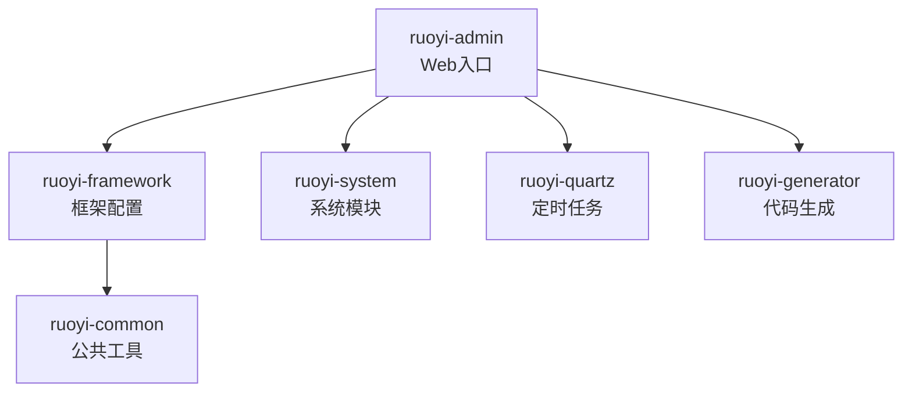
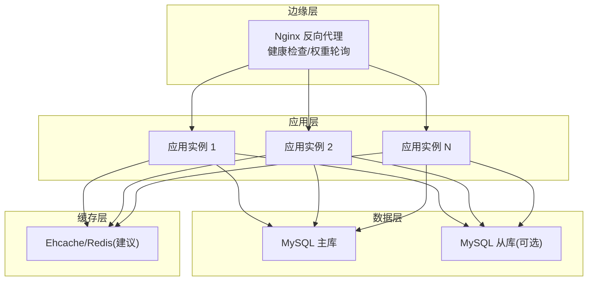
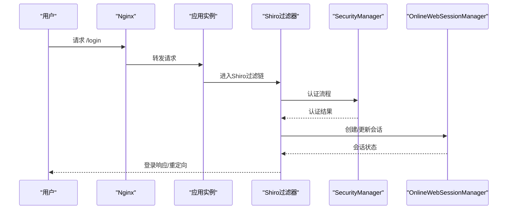
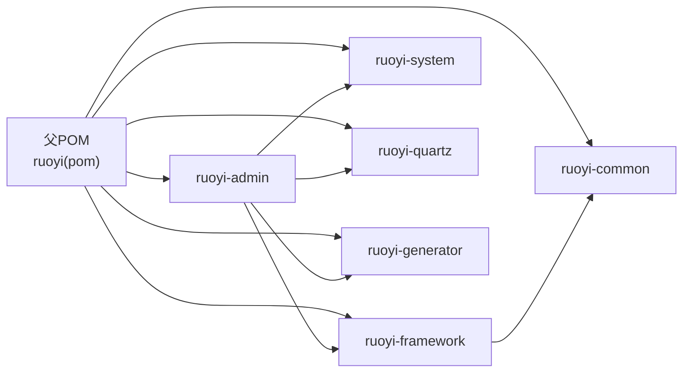

# 生产部署

<cite>
**本文引用的文件**
- [README.md](file://README.md)
- [pom.xml](file://pom.xml)
- [ruoyi-admin/pom.xml](file://ruoyi-admin/pom.xml)
- [application.yml](file://ruoyi-admin/src/main/resources/application.yml)
- [application-druid.yml](file://ruoyi-admin/src/main/resources/application-druid.yml)
- [logback.xml](file://ruoyi-admin/src/main/resources/logback.xml)
- [ehcache-shiro.xml](file://ruoyi-admin/src/main/resources/ehcache/ehcache-shiro.xml)
- [mybatis-config.xml](file://ruoyi-admin/src/main/resources/mybatis/mybatis-config.xml)
- [ShiroConfig.java](file://ruoyi-framework/src/main/java/com/ruoyi/framework/config/ShiroConfig.java)
- [DruidConfig.java](file://ruoyi-framework/src/main/java/com/ruoyi/framework/config/DruidConfig.java)
- [ApplicationConfig.java](file://ruoyi-framework/src/main/java/com/ruoyi/framework/config/ApplicationConfig.java)
- [DynamicDataSourceContextHolder.java](file://ruoyi-common/src/main/java/com/ruoyi/common/config/datasource/DynamicDataSourceContextHolder.java)
- [package.bat](file://bin/package.bat)
</cite>

## 目录
1. [简介](#简介)
2. [项目结构](#项目结构)
3. [核心组件](#核心组件)
4. [架构总览](#架构总览)
5. [详细组件分析](#详细组件分析)
6. [依赖关系分析](#依赖关系分析)
7. [性能与容量规划](#性能与容量规划)
8. [故障排查指南](#故障排查指南)
9. [结论](#结论)
10. [附录](#附录)

## 简介
本指南面向RuoYi系统的生产环境部署，覆盖服务器准备、应用打包与部署、配置优化、负载均衡与健康检查、集群高可用、数据库主从、容器化与Kubernetes编排、SSL证书、CDN与缓存策略、监控告警与日志收集等主题。文档严格依据仓库内现有配置与代码进行说明，避免臆测。

## 项目结构
RuoYi采用多模块Maven工程组织，核心模块包括：
- ruoyi-admin：Web服务入口，包含前端模板与后端控制器、配置
- ruoyi-framework：框架层，包含Shiro安全、Druid数据源、MyBatis扫描、动态数据源等
- ruoyi-system：业务模块（系统管理）
- ruoyi-quartz：定时任务模块
- ruoyi-generator：代码生成模块
- ruoyi-common：公共工具与常量

图表来源
- [pom.xml:235-242](file://pom.xml#L235-L242)
- [ruoyi-admin/pom.xml:1-128](file://ruoyi-admin/pom.xml#L1-L128)

章节来源
- [pom.xml:235-242](file://pom.xml#L235-L242)
- [ruoyi-admin/pom.xml:1-128](file://ruoyi-admin/pom.xml#L1-L128)

## 核心组件
- 应用配置与启动
  - 服务器端口、上下文路径、Tomcat线程池参数、日志级别、国际化、Jackson时区与日期格式、文件上传大小限制、Swagger开关等
- 数据源与监控
  - Druid多数据源（主/从），连接池参数、慢SQL记录、控制台白名单、stat/wall过滤器
- 安全与会话
  - Shiro配置：登录URL、未授权URL、验证码开关与类型、Cookie域与路径、HttpOnly、过期时间、记住我密钥、会话超时与校验周期、最大会话数、踢出策略、在线会话DAO与管理器、Ehcache缓存
- 日志
  - Logback滚动日志，按天切分，INFO/ERROR分别落盘，用户行为日志单独输出
- 缓存
  - Ehcache用于Shiro会话与授权缓存，配置了默认缓存与特定缓存项的TTL/空闲策略
- MyBatis
  - 开启二级缓存、日志实现为SLF4J、默认执行器类型

章节来源
- [application.yml:1-154](file://ruoyi-admin/src/main/resources/application.yml#L1-L154)
- [application-druid.yml:1-61](file://ruoyi-admin/src/main/resources/application-druid.yml#L1-L61)
- [ShiroConfig.java:1-449](file://ruoyi-framework/src/main/java/com/ruoyi/framework/config/ShiroConfig.java#L1-L449)
- [logback.xml:1-93](file://ruoyi-admin/src/main/resources/logback.xml#L1-L93)
- [ehcache-shiro.xml:1-91](file://ruoyi-admin/src/main/resources/ehcache/ehcache-shiro.xml#L1-L91)
- [mybatis-config.xml:1-21](file://ruoyi-admin/src/main/resources/mybatis/mybatis-config.xml#L1-L21)

## 架构总览
下图展示生产环境典型拓扑：Nginx作为反向代理与健康检查入口，后端多实例通过负载均衡对外提供服务，数据库采用主从复制，缓存与会话可按需扩展。

说明
- 本图为概念性架构示意，具体部署需结合实际网络与运维策略
- 会话与缓存建议引入Redis以支持跨节点共享（当前配置基于Ehcache）

## 详细组件分析

### 应用配置与打包
- 打包脚本
  - Windows批处理脚本调用Maven清理并打包，跳过测试
- Web入口与打包产物
  - ruoyi-admin为可执行jar或war，最终名称由模块名决定
- 关键配置要点
  - 服务器端口与上下文路径、Tomcat线程池参数、日志级别、文件上传大小、Swagger开关、Shiro与XSS/CSRF开关、AI服务配置、Thymeleaf缓存关闭

章节来源
- [package.bat:1-12](file://bin/package.bat#L1-L12)
- [ruoyi-admin/pom.xml:65-126](file://ruoyi-admin/pom.xml#L65-L126)
- [application.yml:16-154](file://ruoyi-admin/src/main/resources/application.yml#L16-L154)

### 数据库与Druid配置
- 多数据源
  - 主库必配，从库可选启用；动态数据源根据上下文选择数据源
- 连接池参数
  - 初始连接、最小/最大连接、获取连接最大等待、连接/套接字超时、空闲检测周期、空闲生命周期、有效性检测SQL、白名单、慢SQL阈值与记录、SQL合并
- 控制台与监控
  - StatViewServlet白名单与登录凭据、stat/wall过滤器

章节来源
- [application-druid.yml:1-61](file://ruoyi-admin/src/main/resources/application-druid.yml#L1-L61)
- [DruidConfig.java:32-129](file://ruoyi-framework/src/main/java/com/ruoyi/framework/config/DruidConfig.java#L32-L129)
- [DynamicDataSourceContextHolder.java:1-46](file://ruoyi-common/src/main/java/com/ruoyi/common/config/datasource/DynamicDataSourceContextHolder.java#L1-L46)

### 安全与会话（Shiro）
- 会话管理
  - 全局超时时间、定期校验、禁用URL重写、自定义SessionDAO与SessionFactory、Ehcache缓存
- 认证与过滤链
  - 登录/未授权URL、匿名访问静态资源与验证码、退出、注册、CSRF白名单、在线会话同步、验证码校验、踢出策略
- Cookie与记住我
  - 域、路径、HttpOnly、过期天数、cipherKey（可为空自动生成）

图表来源
- [ShiroConfig.java:296-346](file://ruoyi-framework/src/main/java/com/ruoyi/framework/config/ShiroConfig.java#L296-L346)

章节来源
- [ShiroConfig.java:1-449](file://ruoyi-framework/src/main/java/com/ruoyi/framework/config/ShiroConfig.java#L1-L449)
- [application.yml:86-138](file://ruoyi-admin/src/main/resources/application.yml#L86-L138)

### 日志与缓存
- 日志
  - 控制台输出与滚动文件输出，INFO/ERROR分离，用户行为日志独立输出
- 缓存
  - Ehcache用于登录记录、活跃用户、授权缓存、系统缓存、会话缓存等，配置TTL与空闲时间

章节来源
- [logback.xml:1-93](file://ruoyi-admin/src/main/resources/logback.xml#L1-L93)
- [ehcache-shiro.xml:1-91](file://ruoyi-admin/src/main/resources/ehcache/ehcache-shiro.xml#L1-L91)

### MyBatis配置
- 开启二级缓存、默认执行器类型、日志实现为SLF4J

章节来源
- [mybatis-config.xml:1-21](file://ruoyi-admin/src/main/resources/mybatis/mybatis-config.xml#L1-L21)

## 依赖关系分析
- Maven聚合与版本管理
  - 父POM统一管理Spring Boot、Tomcat、Druid、Shiro、Swagger、PageHelper、Logback、POI、YAUAA、Kaptcha等版本
- 模块依赖
  - ruoyi-admin依赖framework、quartz、generator与common；framework依赖common

图表来源
- [pom.xml:235-242](file://pom.xml#L235-L242)
- [ruoyi-admin/pom.xml:45-62](file://ruoyi-admin/pom.xml#L45-L62)

章节来源
- [pom.xml:1-290](file://pom.xml#L1-L290)
- [ruoyi-admin/pom.xml:1-128](file://ruoyi-admin/pom.xml#L1-L128)

## 性能与容量规划
- 应用层
  - 调整Tomcat线程池参数以适配并发与QPS；合理设置文件上传大小与超时
- 数据库层
  - 使用Druid连接池参数优化吞吐与延迟；启用慢SQL监控与白名单访问控制台
- 缓存层
  - 当前基于Ehcache，生产建议引入Redis以支持跨节点共享与高可用
- 日志
  - 按天滚动与分级输出，避免单文件过大；结合集中式日志收集

章节来源
- [application.yml:17-70](file://ruoyi-admin/src/main/resources/application.yml#L17-L70)
- [application-druid.yml:19-61](file://ruoyi-admin/src/main/resources/application-druid.yml#L19-L61)
- [logback.xml:16-93](file://ruoyi-admin/src/main/resources/logback.xml#L16-L93)

## 故障排查指南
- 登录与会话问题
  - 检查Shiro配置的登录URL、未授权URL、验证码开关与类型、Cookie域与路径、会话超时与校验周期
- 数据库连接问题
  - 核对主库URL/用户名/密码；确认从库开关与连接池参数；查看Druid控制台白名单与登录凭据
- 日志定位
  - 查看INFO/ERROR滚动日志与用户行为日志；关注系统模块与Spring框架日志级别
- 动态数据源切换
  - 确认上下文持有者设置与清理逻辑，避免脏读或误切

章节来源
- [ShiroConfig.java:50-270](file://ruoyi-framework/src/main/java/com/ruoyi/framework/config/ShiroConfig.java#L50-L270)
- [application-druid.yml:1-61](file://ruoyi-admin/src/main/resources/application-druid.yml#L1-L61)
- [logback.xml:74-93](file://ruoyi-admin/src/main/resources/logback.xml#L74-L93)
- [DynamicDataSourceContextHolder.java:11-46](file://ruoyi-common/src/main/java/com/ruoyi/common/config/datasource/DynamicDataSourceContextHolder.java#L11-L46)

## 结论
本指南基于仓库现有配置与代码，给出了生产部署的实施路径与优化建议。建议在现有基础上补充：
- 引入Redis实现会话与缓存共享
- 部署Nginx反向代理与健康检查
- 配置数据库主从复制与读写分离
- 完善容器化与Kubernetes编排
- 部署SSL证书、CDN与缓存策略
- 建立监控告警与集中日志收集体系

## 附录

### 服务器准备清单
- 操作系统：Linux（建议CentOS/Ubuntu）
- JDK：1.8（与父POM一致）
- 数据库：MySQL（主库与从库）
- 缓存：Redis（推荐）
- 反向代理：Nginx
- 容器化：Docker（可选）
- 编排：Kubernetes（可选）

### 应用部署步骤（基于仓库能力）
- 打包
  - 使用Windows批处理脚本执行Maven清理与打包
- 部署
  - 将打包产物部署至目标服务器，配置application.yml与application-druid.yml
  - 启动应用，验证日志输出与Druid控制台访问

章节来源
- [package.bat:1-12](file://bin/package.bat#L1-L12)
- [ruoyi-admin/pom.xml:65-126](file://ruoyi-admin/pom.xml#L65-L126)
- [application.yml:1-154](file://ruoyi-admin/src/main/resources/application.yml#L1-L154)
- [application-druid.yml:1-61](file://ruoyi-admin/src/main/resources/application-druid.yml#L1-L61)

### 负载均衡与健康检查（Nginx）
- 反向代理
  - 将请求转发至多个应用实例，配置权重与健康检查
- 健康检查
  - 建议对应用根路径或健康端点进行探测，失败自动摘除

说明
- 本节为通用实践建议，未直接对应具体源码文件

### 集群部署与高可用
- 会话共享
  - 建议引入Redis存储会话，替代Ehcache本地缓存
- 数据库主从
  - 在application-druid.yml中启用从库并配置URL/凭据，配合动态数据源读写分离

章节来源
- [application-druid.yml:8-18](file://ruoyi-admin/src/main/resources/application-druid.yml#L8-L18)
- [DruidConfig.java:52-79](file://ruoyi-framework/src/main/java/com/ruoyi/framework/config/DruidConfig.java#L52-L79)

### Docker容器化与Kubernetes编排
- Docker镜像
  - 基于JDK 1.8构建镜像，挂载配置文件与日志目录
- Kubernetes
  - 郴置Deployment、Service、Ingress与ConfigMap/Secret，实现滚动更新与弹性伸缩

说明
- 本节为通用实践建议，未直接对应具体源码文件

### SSL证书、CDN与缓存策略
- SSL
  - 在Nginx侧配置证书与TLS，启用强加密套件
- CDN
  - 将静态资源接入CDN，缩短首包延迟
- 缓存
  - 启用浏览器缓存与HTTP缓存头，结合Redis缓存热点数据

说明
- 本节为通用实践建议，未直接对应具体源码文件

### 监控告警与日志收集
- 监控
  - 结合应用内置指标与系统指标，配置Prometheus/Grafana
- 告警
  - 基于阈值触发告警，联动通知渠道
- 日志
  - 使用Logback滚动输出，结合ELK/云日志服务集中采集与检索

章节来源
- [logback.xml:1-93](file://ruoyi-admin/src/main/resources/logback.xml#L1-L93)