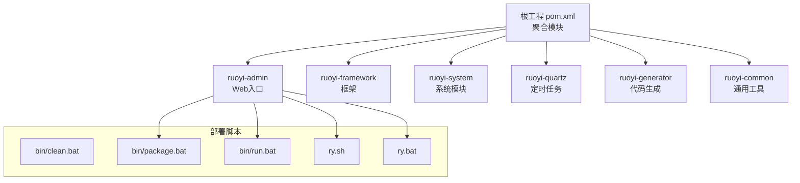
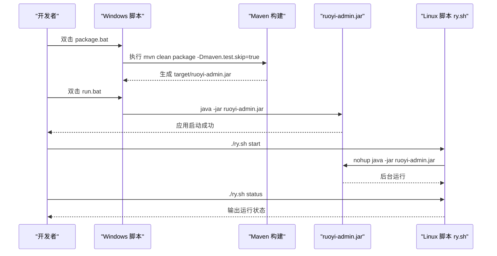
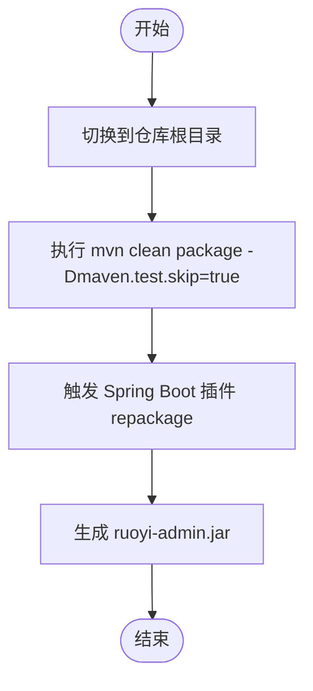
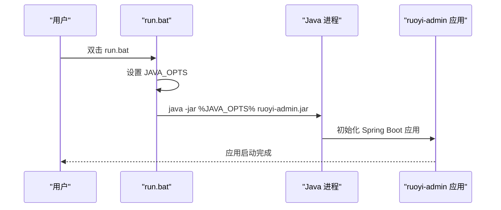
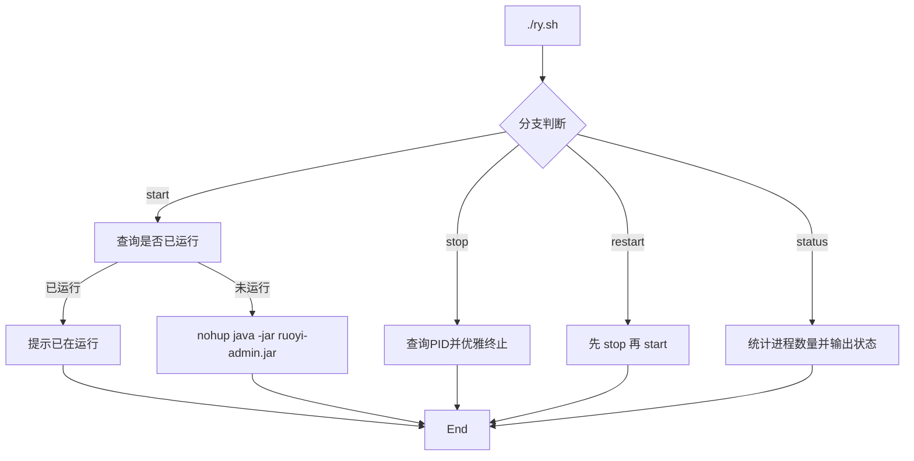
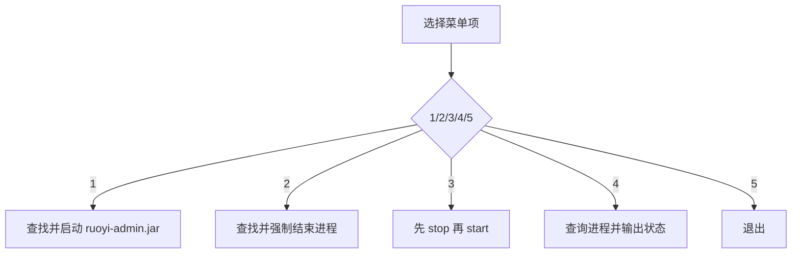
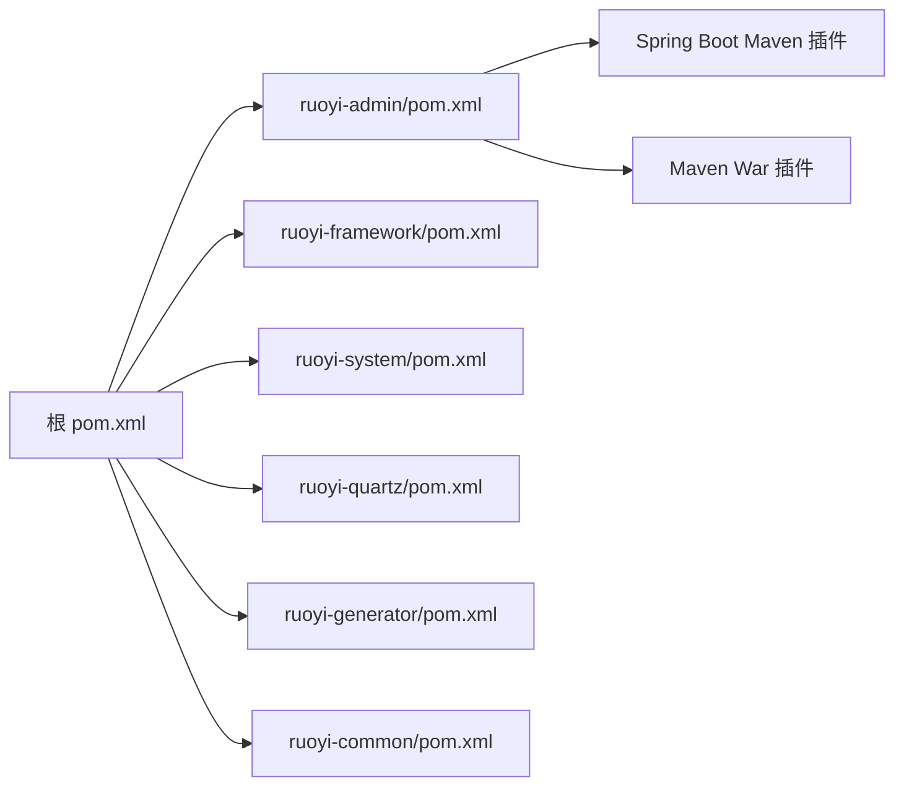

# 部署脚本

<cite>
**本文引用的文件**
- [bin/clean.bat](file://bin/clean.bat)
- [bin/package.bat](file://bin/package.bat)
- [bin/run.bat](file://bin/run.bat)
- [ry.bat](file://ry.bat)
- [ry.sh](file://ry.sh)
- [ruoyi-admin/pom.xml](file://ruoyi-admin/pom.xml)
- [ruoyi-admin/src/main/resources/application.yml](file://ruoyi-admin/src/main/resources/application.yml)
- [ruoyi-admin/src/main/resources/application-druid.yml](file://ruoyi-admin/src/main/resources/application-druid.yml)
- [pom.xml](file://pom.xml)
</cite>

## 目录
1. [简介](#简介)
2. [项目结构](#项目结构)
3. [核心组件](#核心组件)
4. [架构总览](#架构总览)
5. [详细组件分析](#详细组件分析)
6. [依赖关系分析](#依赖关系分析)
7. [性能与运行参数建议](#性能与运行参数建议)
8. [故障排查指南](#故障排查指南)
9. [结论](#结论)
10. [附录：自定义与自动化](#附录自定义与自动化)

## 简介
本指南面向运维与开发人员，系统讲解 RuoYi 系统在 Windows 与 Linux 环境下的部署脚本使用方法，覆盖以下内容：
- Windows 环境下 bin 目录三个脚本的功能与使用步骤
- package.bat 的打包流程（Maven 构建、资源复制与压缩打包）
- run.bat 的启动参数与运行模式（开发模式与生产模式差异）
- clean.bat 的清理功能与适用场景
- Linux 环境下 ry.sh 的启动/停止/重启/状态查询能力
- 自定义修改方法与批量部署自动化方案

## 项目结构
RuoYi 采用多模块 Maven 工程组织，核心模块包括 ruoyi-admin（Web 入口）、ruoyi-framework、ruoyi-system、ruoyi-quartz、ruoyi-generator、ruoyi-common。部署脚本主要围绕 ruoyi-admin 模块进行打包与运行。

图表来源
- [pom.xml:235-242](file://pom.xml#L235-L242)
- [ruoyi-admin/pom.xml:10-16](file://ruoyi-admin/pom.xml#L10-L16)

章节来源
- [pom.xml:235-242](file://pom.xml#L235-L242)
- [ruoyi-admin/pom.xml:10-16](file://ruoyi-admin/pom.xml#L10-L16)

## 核心组件
- Windows 批处理脚本
  - bin/clean.bat：清理 Maven 构建产物 target 目录
  - bin/package.bat：执行 Maven 打包，生成可运行的 jar/war
  - bin/run.bat：以 jar 方式启动 ruoyi-admin 应用
- Linux Shell 脚本
  - ry.sh：提供 start/stop/restart/status 的统一入口
  - ry.bat：Windows 图形化菜单式启动/停止/重启/状态查询
- 应用配置
  - application.yml：开发/生产配置示例（端口、日志、文件路径、数据库等）
  - application-druid.yml：Druid 数据源与监控配置示例

章节来源
- [bin/clean.bat:1-12](file://bin/clean.bat#L1-L12)
- [bin/package.bat:1-12](file://bin/package.bat#L1-L12)
- [bin/run.bat:1-14](file://bin/run.bat#L1-L14)
- [ry.sh:1-87](file://ry.sh#L1-L87)
- [ry.bat:1-68](file://ry.bat#L1-L68)
- [ruoyi-admin/src/main/resources/application.yml:16-79](file://ruoyi-admin/src/main/resources/application.yml#L16-L79)
- [ruoyi-admin/src/main/resources/application-druid.yml:1-61](file://ruoyi-admin/src/main/resources/application-druid.yml#L1-L61)

## 架构总览
下面的序列图展示了 Windows 环境下从打包到启动的完整流程，以及 Linux 下通过 ry.sh 的统一控制。

图表来源
- [bin/package.bat:10](file://bin/package.bat#L10)
- [bin/run.bat:11](file://bin/run.bat#L11)
- [ry.sh:22-32](file://ry.sh#L22-L32)

## 详细组件分析

### Windows 清理脚本：bin/clean.bat
- 功能概述
  - 切换到仓库根目录，调用 Maven 清理命令，删除 target 目录，释放磁盘空间并清除历史构建产物。
- 使用场景
  - 修复构建异常、升级依赖后强制清理、打包前确保干净环境。
- 注意事项
  - 清理后需重新执行打包流程；若网络不佳，首次构建可能较慢。

章节来源
- [bin/clean.bat:1-12](file://bin/clean.bat#L1-L12)

### Windows 打包脚本：bin/package.bat
- 功能概述
  - 切换到仓库根目录，执行 Maven 打包命令，跳过测试，生成 ruoyi-admin.jar（或 war，视插件配置）。
- 打包流程（对应 Maven 插件）
  - Spring Boot Maven 插件：负责 repackage，生成可执行 jar。
  - Maven War 插件：配置 warName 与跳过缺失 web.xml。
  - 可选 YUI Compressor 插件：对静态资源进行压缩（当前被注释）。
- 输出产物
  - ruoyi-admin/target/ruoyi-admin.jar（最终可运行包）

图表来源
- [bin/package.bat:10](file://bin/package.bat#L10)
- [ruoyi-admin/pom.xml:65-126](file://ruoyi-admin/pom.xml#L65-L126)

章节来源
- [bin/package.bat:1-12](file://bin/package.bat#L1-12)
- [ruoyi-admin/pom.xml:65-126](file://ruoyi-admin/pom.xml#L65-L126)

### Windows 启动脚本：bin/run.bat
- 功能概述
  - 切换到 ruoyi-admin/target 目录，设置 JVM 参数，以 java -jar 方式启动应用。
- 启动参数说明
  - 内存参数：初始堆、最大堆、元空间初始与最大值。
  - 时区与应用标识：设置时区与应用名称。
- 运行模式
  - 开发模式：application.yml 中 profiles.active=druid，日志级别较低，模板缓存关闭，适合本地调试。
  - 生产模式：可通过外部配置覆盖 application.yml，启用更严格的日志与缓存策略，并指向生产数据库。
- 启动位置
  - 该脚本直接运行 ruoyi-admin.jar，无需额外容器。

图表来源
- [bin/run.bat:9-11](file://bin/run.bat#L9-L11)
- [ruoyi-admin/src/main/resources/application.yml:61-62](file://ruoyi-admin/src/main/resources/application.yml#L61-L62)

章节来源
- [bin/run.bat:1-14](file://bin/run.bat#L1-L14)
- [ruoyi-admin/src/main/resources/application.yml:16-79](file://ruoyi-admin/src/main/resources/application.yml#L16-L79)

### Linux 启动脚本：ry.sh
- 功能概述
  - 提供 start/stop/restart/status 四种操作，后台运行并记录日志。
- 关键行为
  - start：若未运行则 nohup 启动；否则提示已在运行。
  - stop：查询 PID 并优雅终止，等待进程退出。
  - restart：先 stop 再 start。
  - status：统计匹配进程数量判断运行状态。
- 日志路径
  - 默认日志输出至 logs/ruoyi-admin.jar.log（可在脚本中调整）。

图表来源
- [ry.sh:22-86](file://ry.sh#L22-L86)

章节来源
- [ry.sh:1-87](file://ry.sh#L1-L87)

### Windows 图形化脚本：ry.bat
- 功能概述
  - 交互式菜单：启动、停止、重启、状态查询、退出。
- 关键行为
  - 通过 jps 查找进程，若存在则直接启动；停止时根据 PID 强制结束；重启即先停再启；状态查询显示进程名与 PID。
- 适用场景
  - 本地开发调试、快速切换运行状态。

图表来源
- [ry.bat:10-67](file://ry.bat#L10-L67)

章节来源
- [ry.bat:1-68](file://ry.bat#L1-L68)

## 依赖关系分析
- Maven 多模块
  - 根 pom.xml 聚合 ruoyi-admin、ruoyi-framework、ruoyi-system、ruoyi-quartz、ruoyi-generator、ruoyi-common。
  - ruoyi-admin 作为 Web 入口，依赖 framework、quartz、generator 等模块。
- 打包插件
  - Spring Boot Maven 插件负责 repackage，生成可执行 jar。
  - Maven War 插件用于 war 打包（当前未启用）。
- 运行时配置
  - application.yml 指定 profiles.active=druid，配合 application-druid.yml 提供数据库与 Druid 监控配置。

图表来源
- [pom.xml:235-242](file://pom.xml#L235-L242)
- [ruoyi-admin/pom.xml:65-90](file://ruoyi-admin/pom.xml#L65-L90)

章节来源
- [pom.xml:235-242](file://pom.xml#L235-L242)
- [ruoyi-admin/pom.xml:65-90](file://ruoyi-admin/pom.xml#L65-L90)

## 性能与运行参数建议
- JVM 参数建议
  - 初始堆与最大堆：根据业务并发与数据规模调整，避免频繁 GC。
  - 元空间：生产环境建议适当提高，防止类加载过多导致溢出。
  - GC 策略：可结合业务特性选择并行 GC 或 G1（需在实际环境中压测验证）。
- 日志与监控
  - application.yml 中的日志级别与模板缓存配置适合开发阶段；生产建议开启更严格的日志与缓存策略。
  - application-druid.yml 提供 Druid 监控控制台，便于排查慢 SQL 与连接池问题。
- 端口与上下文
  - application.yml 中 server.port 与 context-path 可按部署环境调整。

章节来源
- [bin/run.bat:9](file://bin/run.bat#L9)
- [ruoyi-admin/src/main/resources/application.yml:34-79](file://ruoyi-admin/src/main/resources/application.yml#L34-L79)
- [ruoyi-admin/src/main/resources/application-druid.yml:1-61](file://ruoyi-admin/src/main/resources/application-druid.yml#L1-L61)

## 故障排查指南
- 打包失败
  - 现象：package.bat 执行后无 jar 产出或报错。
  - 排查：确认 Maven 环境变量、网络可达性；必要时先执行 clean.bat 清理后再重试。
- 启动失败
  - 现象：run.bat/ry.sh 启动后立即退出或端口占用。
  - 排查：检查 application.yml 中 server.port 是否被占用；查看日志文件定位异常；确认数据库连接配置正确。
- 进程无法停止
  - 现象：stop/restart 不生效。
  - 排查：ry.sh 使用优雅终止，若进程卡死可手动强杀；ry.bat 使用 taskkill 强制结束。
- 数据库连接问题
  - 现象：启动时报数据库连接异常。
  - 排查：核对 application-druid.yml 中 master/slave 配置与网络连通性；确认账号密码正确。

章节来源
- [bin/clean.bat:10](file://bin/clean.bat#L10)
- [bin/package.bat:10](file://bin/package.bat#L10)
- [ry.sh:34-56](file://ry.sh#L34-L56)
- [ry.bat:42-57](file://ry.bat#L42-L57)
- [ruoyi-admin/src/main/resources/application-druid.yml:6-18](file://ruoyi-admin/src/main/resources/application-druid.yml#L6-L18)

## 结论
- Windows 环境下，使用 bin/clean.bat 清理、bin/package.bat 打包、bin/run.bat 启动即可完成本地开发与测试。
- Linux 环境下，推荐使用 ry.sh 统一管理应用生命周期，配合 ry.bat 在 Windows 上进行图形化操作。
- 生产部署应结合 application.yml 与 application-druid.yml 进行参数优化与安全加固。

## 附录：自定义与自动化

### 自定义修改方法
- 修改打包产物名称
  - 在 ruoyi-admin/pom.xml 的 build.finalName 中设置。
- 自定义打包插件
  - 如需启用 war 打包，取消 maven-war-plugin 的注释并调整 warName。
- 自定义 JVM 参数
  - 在 run.bat 中修改 JAVA_OPTS；在 ry.sh 中修改 JVM_OPTS。
- 自定义配置文件
  - 通过 application.yml 的 profiles.active 指向不同配置文件，或使用外部配置覆盖。

章节来源
- [ruoyi-admin/pom.xml:125](file://ruoyi-admin/pom.xml#L125)
- [ruoyi-admin/pom.xml:82-90](file://ruoyi-admin/pom.xml#L82-L90)
- [bin/run.bat:9](file://bin/run.bat#L9)
- [ry.sh:5](file://ry.sh#L5)
- [ruoyi-admin/src/main/resources/application.yml:61](file://ruoyi-admin/src/main/resources/application.yml#L61)

### 批量部署自动化方案
- Windows 批处理链路
  - clean.bat -> package.bat -> run.bat（可封装为单脚本，自动顺序执行）。
- Linux 自动化
  - 将 ry.sh 放入 systemd 或 supervisor，实现开机自启与崩溃重启。
  - 结合 rsync/sftp 将最新 jar 推送至目标机，再执行 ./ry.sh restart。
- CI/CD 集成
  - 在流水线中调用 Maven 构建，生成 artifact，随后通过脚本推送与重启，确保一致性与可追溯性。