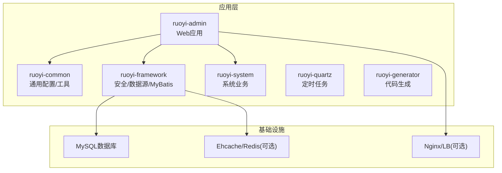
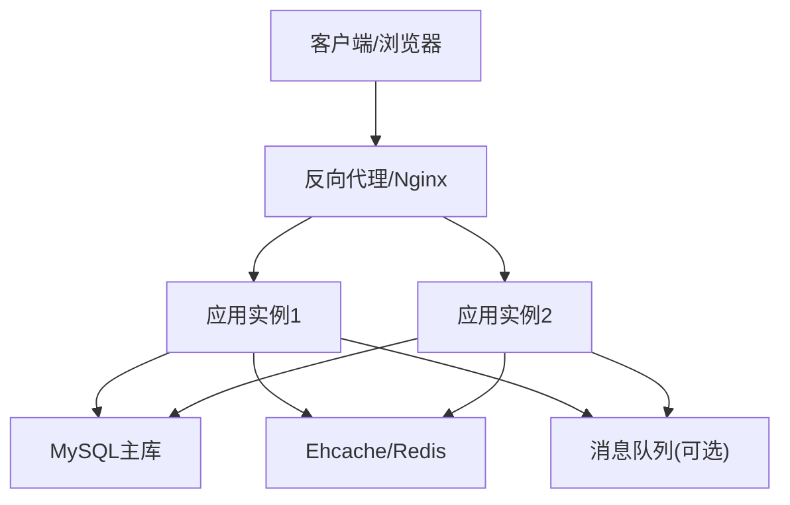
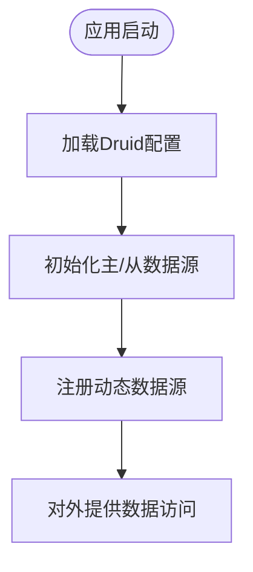
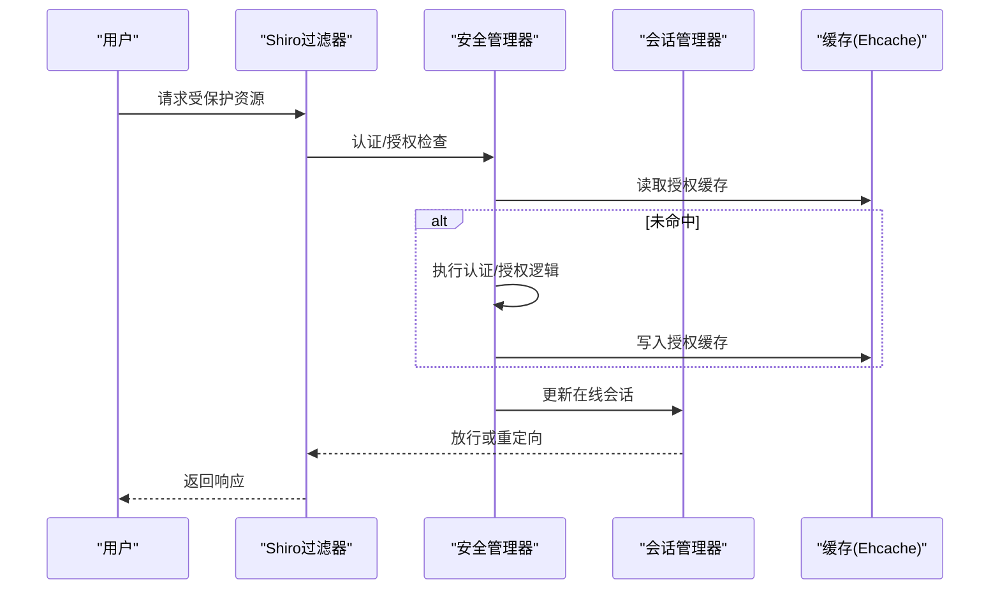
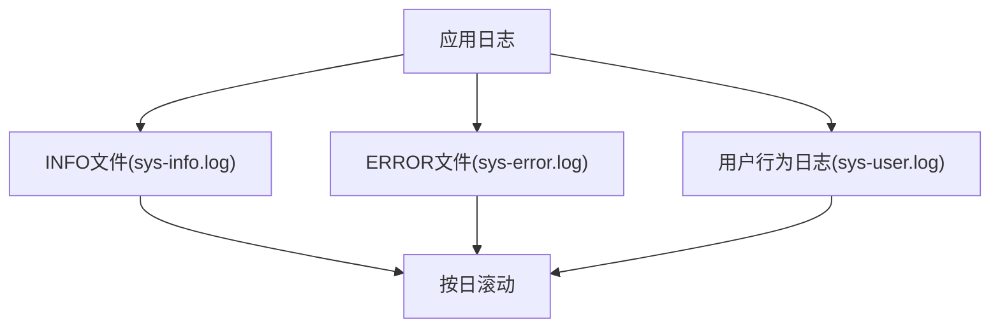
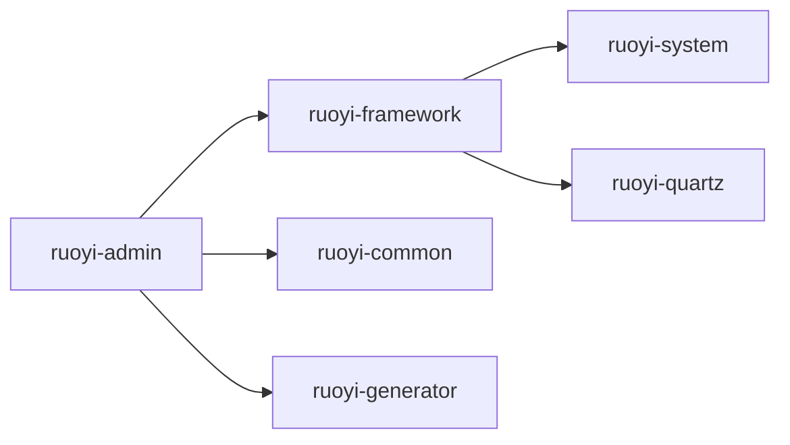

# 部署配置

<cite>
**本文引用的文件**
- [application.yml](file://ruoyi-admin/src/main/resources/application.yml)
- [application-druid.yml](file://ruoyi-admin/src/main/resources/application-druid.yml)
- [logback.xml](file://ruoyi-admin/src/main/resources/logback.xml)
- [RuoYiConfig.java](file://ruoyi-common/src/main/java/com/ruoyi/common/config/RuoYiConfig.java)
- [DruidConfig.java](file://ruoyi-framework/src/main/java/com/ruoyi/framework/config/DruidConfig.java)
- [MyBatisConfig.java](file://ruoyi-framework/src/main/java/com/ruoyi/framework/config/MyBatisConfig.java)
- [ShiroConfig.java](file://ruoyi-framework/src/main/java/com/ruoyi/framework/config/ShiroConfig.java)
- [ThreadPoolConfig.java](file://ruoyi-common/src/main/java/com/ruoyi/common/config/thread/ThreadPoolConfig.java)
- [ehcache-shiro.xml](file://ruoyi-admin/src/main/resources/ehcache/ehcache-shiro.xml)
- [DynamicDataSource.java](file://ruoyi-framework/src/main/java/com/ruoyi/framework/datasource/DynamicDataSource.java)
- [DataSourceType.java](file://ruoyi-common/src/main/java/com/ruoyi/common/enums/DataSourceType.java)
- [ApplicationConfig.java](file://ruoyi-framework/src/main/java/com/ruoyi/framework/config/ApplicationConfig.java)
- [run.bat](file://bin/run.bat)
- [package.bat](file://bin/package.bat)
- [pom.xml](file://pom.xml)
- [ry_20260319.sql](file://sql/ry_20260319.sql)
</cite>

## 目录
1. [简介](#简介)
2. [项目结构](#项目结构)
3. [核心组件](#核心组件)
4. [架构总览](#架构总览)
5. [详细组件分析](#详细组件分析)
6. [依赖分析](#依赖分析)
7. [性能考虑](#性能考虑)
8. [故障排查指南](#故障排查指南)
9. [结论](#结论)
10. [附录](#附录)

## 简介
本指南面向生产环境部署RuoYi系统，覆盖服务器环境准备、数据库与中间件配置、应用服务器设置、配置参数释义与调优建议、负载均衡与高可用方案、容器化与Kubernetes编排示例，以及性能监控、日志收集与故障恢复的最佳实践。文档严格依据仓库中的配置文件与源码进行说明，避免臆测。

## 项目结构
RuoYi采用多模块Maven工程组织，核心模块包括：
- ruoyi-admin：Web应用入口与前端模板资源
- ruoyi-common：通用配置、常量、工具与线程池
- ruoyi-framework：Spring Boot自动装配、Shiro安全、MyBatis、动态数据源等
- ruoyi-system：系统业务模块（用户、角色、菜单、字典等）
- ruoyi-quartz：定时任务模块
- ruoyi-generator：代码生成模块
- sql：数据库初始化脚本

**图表来源**
- [pom.xml:1-200](file://pom.xml#L1-L200)

**章节来源**
- [pom.xml:1-200](file://pom.xml#L1-L200)

## 核心组件
- 应用配置与参数
  - 服务器端口、上下文路径、Tomcat线程池参数
  - 日志级别与输出路径
  - 文件上传大小限制
  - MyBatis别名包、Mapper扫描与全局配置
  - PageHelper分页方言
  - Shiro登录URL、会话与Cookie策略、验证码开关
  - XSS/CSRF防护开关
  - Swagger开关
  - 若依项目元信息（名称、版本、版权年份、演示开关、上传路径、IP地址开关）

- 数据库与连接池
  - Druid主从数据源配置、初始/最小/最大连接数、超时、心跳检测、慢SQL记录
  - Druid监控控制台白名单、登录凭据、SQL统计合并

- 安全与会话
  - Shiro安全管理器、缓存管理器（Ehcache）、会话管理器、记住我、验证码、CSRF白名单
  - 在线用户过滤器、会话同步过滤器、踢出重复登录过滤器

- 线程池与异步
  - 线程池核心/最大/队列容量/保活时间、拒绝策略
  - 定时任务线程池命名与异常打印

- 日志
  - 控制台与滚动文件输出、INFO/ERROR级别分流、用户行为日志

**章节来源**
- [application.yml:1-154](file://ruoyi-admin/src/main/resources/application.yml#L1-L154)
- [application-druid.yml:1-61](file://ruoyi-admin/src/main/resources/application-druid.yml#L1-L61)
- [logback.xml:1-93](file://ruoyi-admin/src/main/resources/logback.xml#L1-L93)
- [ShiroConfig.java:1-449](file://ruoyi-framework/src/main/java/com/ruoyi/framework/config/ShiroConfig.java#L1-L449)
- [ThreadPoolConfig.java:1-64](file://ruoyi-common/src/main/java/com/ruoyi/common/config/thread/ThreadPoolConfig.java#L1-L64)

## 架构总览
RuoYi生产部署建议采用“应用容器化 + 反向代理 + 数据库高可用 + 缓存”的组合架构。应用以无状态方式运行，通过反向代理统一入口，数据库采用主从或高可用方案，缓存用于会话与Shiro授权缓存。

[此图为概念性架构示意，不对应具体源码文件，故无“图表来源”]

## 详细组件分析

### 数据库与连接池配置
- 参数要点
  - 主库URL/用户名/密码
  - 从库开关与连接配置（默认关闭）
  - 连接池初始/最小/最大连接数
  - 获取连接最大等待时间、连接/Socket超时
  - 空闲连接检测周期、最小/最大空闲生存时间
  - 连接有效性校验SQL、空闲/借出/归还检测策略
  - Druid监控控制台启用、白名单、登录凭据、慢SQL阈值与SQL合并

- 生产调优建议
  - 连接池大小：根据QPS与事务平均持续时间估算并发连接需求，结合数据库最大连接数上限设置maxActive
  - 超时参数：maxWait与socketTimeout需平衡用户体验与资源占用
  - 慢SQL：开启慢SQL记录并配合数据库慢日志定位瓶颈
  - 从库：在读多写少场景启用只读从库，结合动态数据源路由

**图表来源**
- [DruidConfig.java:1-129](file://ruoyi-framework/src/main/java/com/ruoyi/framework/config/DruidConfig.java#L1-L129)
- [application-druid.yml:1-61](file://ruoyi-admin/src/main/resources/application-druid.yml#L1-L61)

**章节来源**
- [DruidConfig.java:1-129](file://ruoyi-framework/src/main/java/com/ruoyi/framework/config/DruidConfig.java#L1-L129)
- [application-druid.yml:1-61](file://ruoyi-admin/src/main/resources/application-druid.yml#L1-L61)
- [DynamicDataSource.java:1-27](file://ruoyi-framework/src/main/java/com/ruoyi/framework/datasource/DynamicDataSource.java#L1-L27)
- [DataSourceType.java:1-20](file://ruoyi-common/src/main/java/com/ruoyi/common/enums/DataSourceType.java#L1-L20)

### 安全与会话（Shiro/Ehcache）
- 参数要点
  - 登录URL、未授权跳转URL、首页URL
  - 验证码开关与类型
  - Cookie域、路径、HttpOnly、过期时间、密钥
  - 会话超时、同步周期、校验间隔、最大会话数、踢出策略
  - 记住我开关与密钥生成策略
  - CSRF开关与白名单
  - Ehcache缓存配置（登录记录、用户缓存、授权缓存、系统缓存、会话缓存）

- 生产调优建议
  - 会话超时与校验间隔：根据业务登录频次与安全要求调整
  - Cookie密钥：生产环境建议固定cipherKey，避免重启导致RememberMe失效
  - CSRF白名单：仅放行内网或特定监控接口
  - Ehcache持久化：结合磁盘存储与合理的TTL策略，平衡性能与可靠性

**图表来源**
- [ShiroConfig.java:1-449](file://ruoyi-framework/src/main/java/com/ruoyi/framework/config/ShiroConfig.java#L1-L449)
- [ehcache-shiro.xml:1-91](file://ruoyi-admin/src/main/resources/ehcache/ehcache-shiro.xml#L1-L91)

**章节来源**
- [ShiroConfig.java:1-449](file://ruoyi-framework/src/main/java/com/ruoyi/framework/config/ShiroConfig.java#L1-L449)
- [ehcache-shiro.xml:1-91](file://ruoyi-admin/src/main/resources/ehcache/ehcache-shiro.xml#L1-L91)

### 日志与监控
- 日志配置
  - 控制台输出与滚动文件输出
  - INFO/ERROR级别分流与按日滚动
  - 用户行为日志独立输出
  - 日志路径与模式由配置文件定义

- 生产建议
  - 将日志落盘路径指向独立挂载盘，避免与应用同盘
  - 结合集中式日志（如ELK/Fluentd）采集与检索
  - 为不同模块设置差异化日志级别，避免生产环境过度打印

**图表来源**
- [logback.xml:1-93](file://ruoyi-admin/src/main/resources/logback.xml#L1-L93)

**章节来源**
- [logback.xml:1-93](file://ruoyi-admin/src/main/resources/logback.xml#L1-L93)

### 线程池与异步任务
- 参数要点
  - 核心线程数、最大线程数、队列容量、保活时间
  - 拒绝策略：CallerRunsPolicy
  - 定时任务线程池命名与异常打印

- 生产建议
  - 根据CPU核数与IO密集度设定核心线程数
  - 队列容量与拒绝策略需结合业务峰值流量评估
  - 定时任务线程池命名便于监控与问题定位

**章节来源**
- [ThreadPoolConfig.java:1-64](file://ruoyi-common/src/main/java/com/ruoyi/common/config/thread/ThreadPoolConfig.java#L1-L64)

### MyBatis与Mapper扫描
- 参数要点
  - typeAliasesPackage：自动别名扫描包
  - mapperLocations：Mapper XML扫描路径
  - configLocation：MyBatis全局配置文件

- 生产建议
  - 确保mapperLocations能正确匹配到各模块的XML文件
  - 全局配置文件中可启用缓存、插件与类型处理器

**章节来源**
- [MyBatisConfig.java:1-132](file://ruoyi-framework/src/main/java/com/ruoyi/framework/config/MyBatisConfig.java#L1-L132)
- [application.yml:71-79](file://ruoyi-admin/src/main/resources/application.yml#L71-L79)

### 应用配置与参数
- 服务器与Tomcat
  - 端口、context-path、URI编码
  - Accept队列长度、最大线程数、最小空闲线程

- 文件上传
  - 单文件与总请求大小限制

- 国际化与序列化
  - Thymeleaf模式与编码、消息资源路径
  - Jackson时区与日期格式

- 项目元信息
  - 名称、版本、版权年份、演示开关、上传路径、IP地址开关

**章节来源**
- [application.yml:1-154](file://ruoyi-admin/src/main/resources/application.yml#L1-L154)
- [RuoYiConfig.java:1-125](file://ruoyi-common/src/main/java/com/ruoyi/common/config/RuoYiConfig.java#L1-L125)

## 依赖分析
- Maven依赖与版本
  - Spring Boot、Shiro、Druid、PageHelper、Swagger、Tomcat、Logback等版本在POM中集中管理
  - Druid Starter用于自动装配Druid数据源与监控

- 模块间耦合
  - ruoyi-admin依赖ruoyi-framework与ruoyi-common
  - framework模块提供安全、数据源、MyBatis等基础设施
  - system模块提供业务实体与Mapper

**图表来源**
- [pom.xml:1-200](file://pom.xml#L1-L200)

**章节来源**
- [pom.xml:1-200](file://pom.xml#L1-L200)

## 性能考虑
- 数据库层
  - 连接池参数与慢SQL优化优先
  - 读写分离与只读事务路由
  - 合理索引与分页查询优化

- 应用层
  - 线程池与异步任务合理配置
  - Shiro缓存命中率与会话同步开销
  - 日志级别与落盘策略

- 缓存层
  - Ehcache本地缓存与Redis分布式缓存结合
  - 缓存键设计与失效策略

[本节为通用指导，无需“章节来源”]

## 故障排查指南
- 启动与打包
  - 使用批处理脚本进行打包与运行，确保JVM参数与内存上限匹配业务规模
  - 如遇端口冲突，调整server.port

- 数据库连接
  - 检查Druid主从库URL、用户名、密码与网络连通性
  - 关注连接池超时与最大连接数告警

- 安全与会话
  - 记住我失效：确认cipherKey配置一致
  - 会话被踢出：检查maxSession与kickoutAfter策略

- 日志
  - 查看INFO/ERROR滚动日志，定位业务异常与系统错误
  - 用户行为日志辅助审计与追踪

**章节来源**
- [run.bat:1-14](file://bin/run.bat#L1-L14)
- [package.bat:1-12](file://bin/package.bat#L1-L12)
- [application.yml:1-154](file://ruoyi-admin/src/main/resources/application.yml#L1-L154)
- [application-druid.yml:1-61](file://ruoyi-admin/src/main/resources/application-druid.yml#L1-L61)
- [logback.xml:1-93](file://ruoyi-admin/src/main/resources/logback.xml#L1-L93)

## 结论
RuoYi生产部署应遵循“配置明确、参数可观测、扩展可伸缩”的原则。通过合理的数据库连接池与缓存策略、完善的日志与监控体系、以及容器化与反向代理的组合，可实现稳定高效的线上运行。

[本节为总结性内容，无需“章节来源”]

## 附录

### 生产环境部署步骤（建议流程）
- 服务器环境准备
  - 安装JDK 8+、MySQL 5.7+/8.0、Nginx（可选）
  - 准备独立日志与上传目录，设置合适的磁盘配额与权限

- 数据库配置
  - 执行初始化脚本，创建数据库与基础数据
  - 配置主库连接信息，按需开启从库与读写分离

- 应用服务器设置
  - 修改application.yml中的server、logging、文件上传、Shiro、XSS/CSRF等参数
  - 配置Druid连接池参数与监控控制台访问策略
  - 打包并运行应用，观察启动日志与监控面板

- 负载均衡与高可用
  - 使用Nginx或云LB做四层/七层转发，配置健康检查
  - 多实例部署，共享会话缓存（如Redis），或通过会话粘性

- Docker容器化部署（示例思路）
  - 基于JRE镜像构建应用镜像，挂载独立的日志与上传卷
  - 通过环境变量注入数据库连接与应用配置
  - 使用健康检查探针与重启策略

- Kubernetes编排（示例思路）
  - 使用Deployment管理副本数与滚动升级
  - 使用Service暴露服务，Ingress统一入口
  - 使用ConfigMap管理配置，Secret管理敏感信息
  - 使用PersistentVolumeClaim挂载日志与上传目录

- 性能监控与日志收集
  - 集成Prometheus/Grafana指标监控
  - 集中式日志采集与检索（ELK/Fluentd）
  - 数据库慢查询与连接池监控

- 故障恢复
  - 快速回滚策略与蓝绿发布
  - 数据库备份与恢复演练
  - 缓存一致性与降级预案

**章节来源**
- [ry_20260319.sql:1-200](file://sql/ry_20260319.sql#L1-L200)
- [application.yml:1-154](file://ruoyi-admin/src/main/resources/application.yml#L1-L154)
- [application-druid.yml:1-61](file://ruoyi-admin/src/main/resources/application-druid.yml#L1-L61)
- [logback.xml:1-93](file://ruoyi-admin/src/main/resources/logback.xml#L1-L93)
- [ShiroConfig.java:1-449](file://ruoyi-framework/src/main/java/com/ruoyi/framework/config/ShiroConfig.java#L1-L449)
- [ThreadPoolConfig.java:1-64](file://ruoyi-common/src/main/java/com/ruoyi/common/config/thread/ThreadPoolConfig.java#L1-L64)