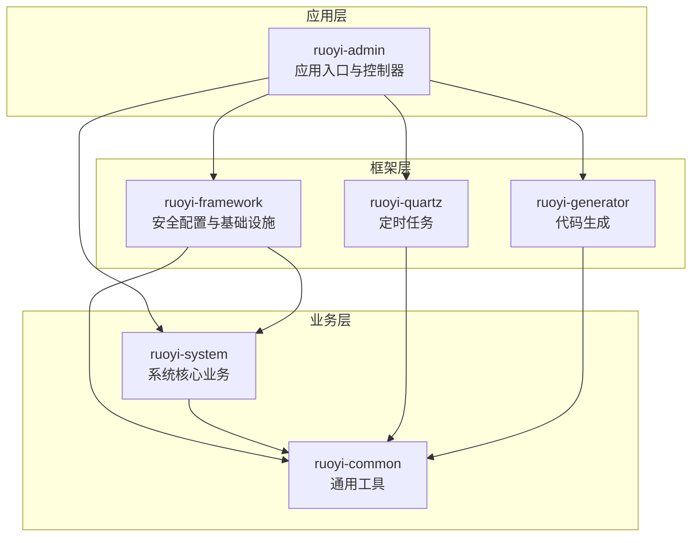
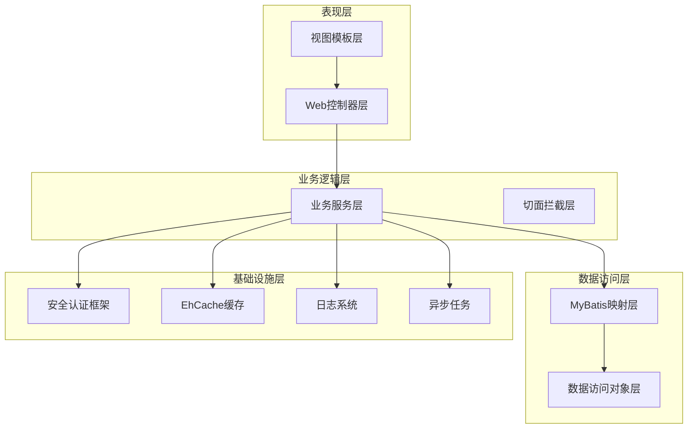
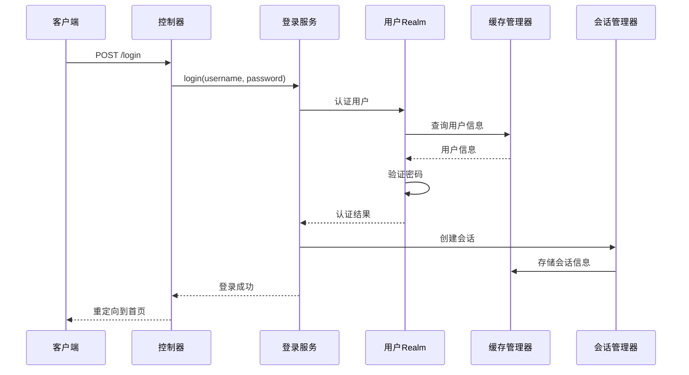
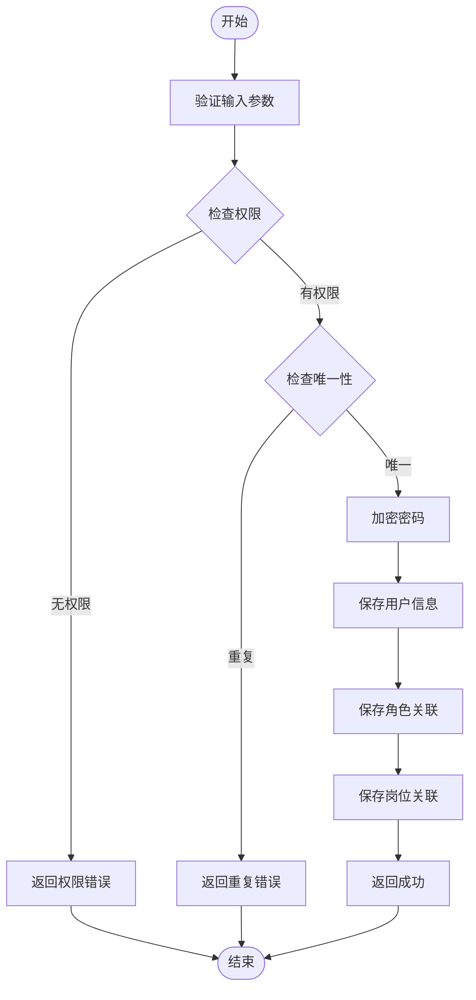
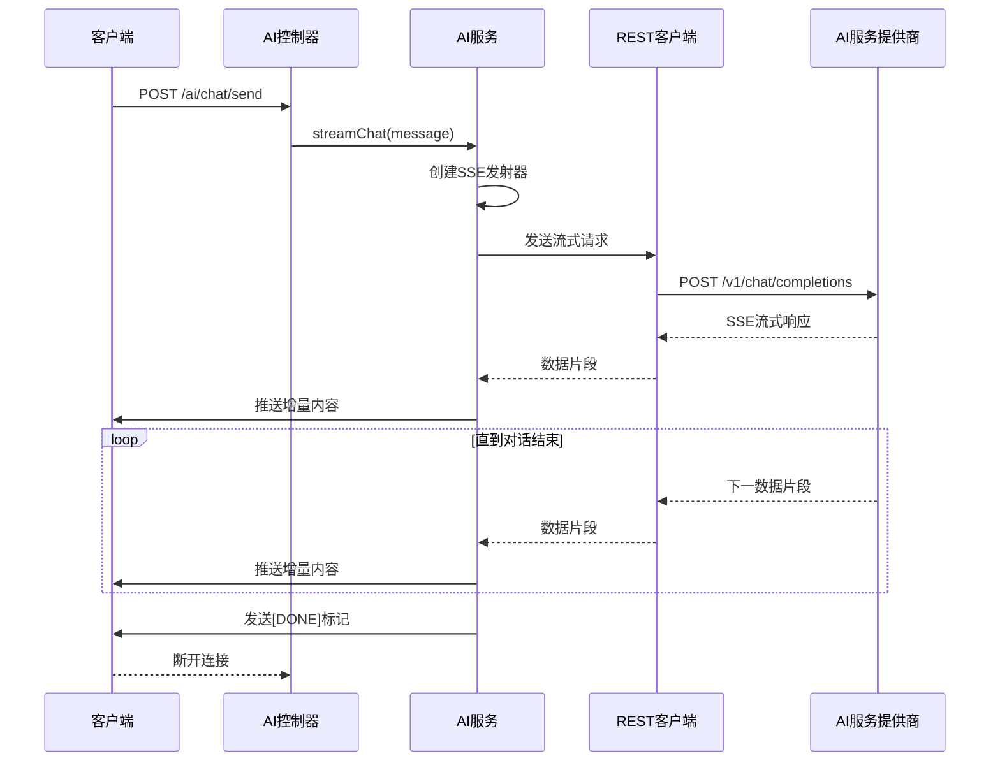
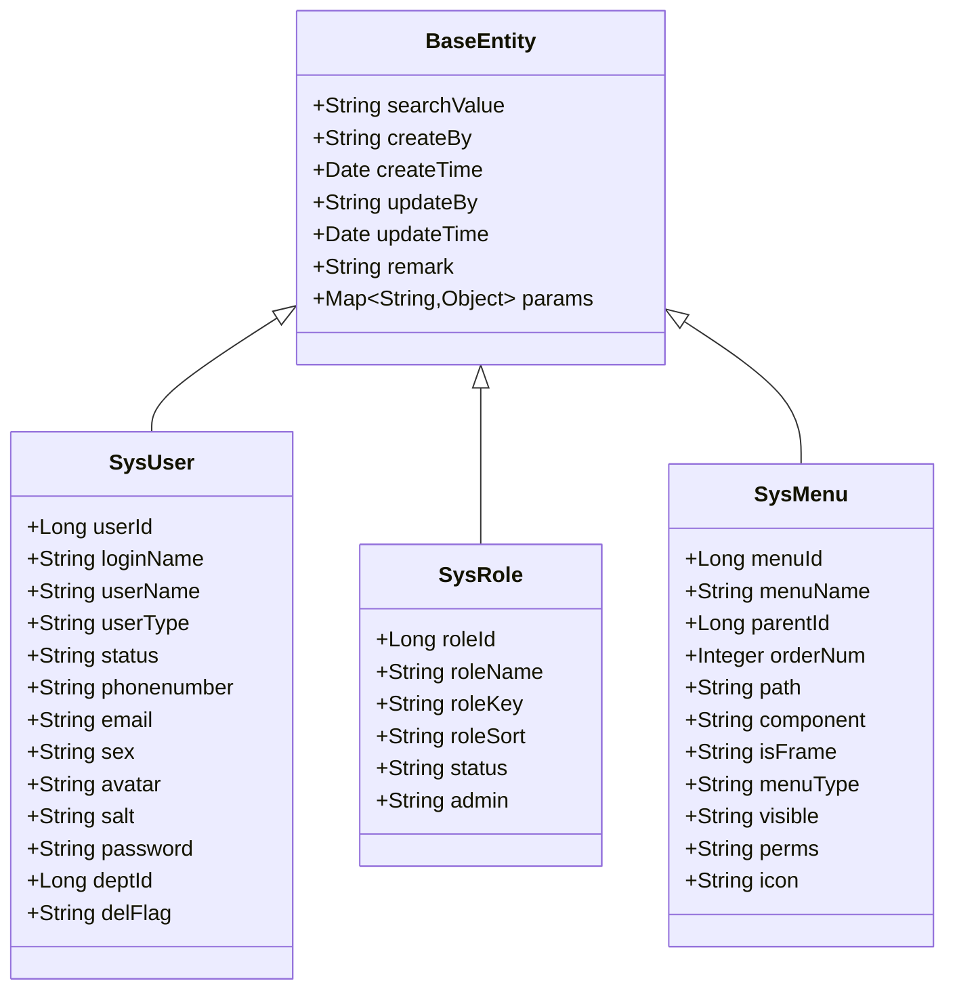
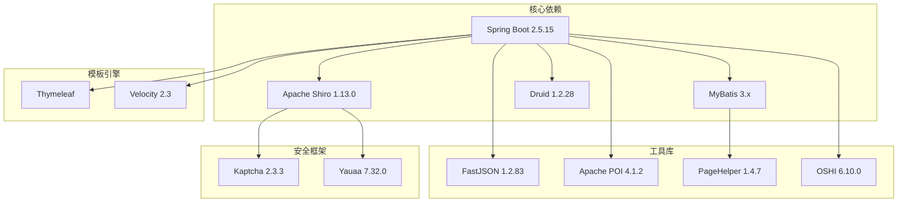

# 项目概述

<cite>
**本文档引用的文件**
- [README.md](file://README.md)
- [pom.xml](file://pom.xml)
- [RuoYiApplication.java](file://ruoyi-admin/src/main/java/com/ruoyi/RuoYiApplication.java)
- [application.yml](file://ruoyi-admin/src/main/resources/application.yml)
- [ShiroConfig.java](file://ruoyi-framework/src/main/java/com/ruoyi/framework/config/ShiroConfig.java)
- [SysUserServiceImpl.java](file://ruoyi-system/src/main/java/com/ruoyi/system/service/impl/SysUserServiceImpl.java)
- [BaseEntity.java](file://ruoyi-common/src/main/java/com/ruoyi/common/core/domain/BaseEntity.java)
- [SysUserController.java](file://ruoyi-admin/src/main/java/com/ruoyi/web/controller/system/SysUserController.java)
- [AiChatController.java](file://ruoyi-admin/src/main/java/com/ruoyi/ai/controller/AiChatController.java)
- [AiChatService.java](file://ruoyi-admin/src/main/java/com/ruoyi/ai/service/AiChatService.java)
- [AiChatServiceImpl.java](file://ruoyi-admin/src/main/java/com/ruoyi/ai/service/impl/AiChatServiceImpl.java)
- [Md5Utils.java](file://ruoyi-common/src/main/java/com/ruoyi/common/utils/security/Md5Utils.java)
- [SysLoginService.java](file://ruoyi-framework/src/main/java/com/ruoyi/framework/shiro/service/SysLoginService.java)
- [UserConstants.java](file://ruoyi-common/src/main/java/com/ruoyi/common/constant/UserConstants.java)
</cite>

## 目录
1. [引言](#引言)
2. [项目结构](#项目结构)
3. [核心组件](#核心组件)
4. [架构总览](#架构总览)
5. [详细组件分析](#详细组件分析)
6. [依赖关系分析](#依赖关系分析)
7. [性能考虑](#性能考虑)
8. [故障排除指南](#故障排除指南)
9. [结论](#结论)

## 引言
本项目是在RuoYi企业级开发脚手架基础上进行的功能扩展与定制化改进的管理系统示例。RuoYi是一个基于Spring Boot + MyBatis + Shiro + Thymeleaf的开源后台管理系统，提供了完善的权限控制、代码生成、定时任务、系统监控等功能。本项目在保留RuoYi核心能力的同时，新增了AI智能问答能力，并对部分配置与流程进行了优化，以满足实际业务场景的需求。

项目的核心目标：
- 提供一套可扩展的企业级后台管理系统
- 通过AI能力增强用户体验与智能化水平
- 保持良好的代码结构与可维护性
- 支持快速二次开发与功能定制

## 项目结构
项目采用Maven多模块架构，包含以下核心模块：
- ruoyi-admin：应用入口与业务控制器层
- ruoyi-framework：框架基础设施与安全配置
- ruoyi-system：系统核心业务模块（用户、角色、菜单等）
- ruoyi-common：通用工具与公共常量
- ruoyi-quartz：定时任务模块
- ruoyi-generator：代码生成模块

**图表来源**
- [pom.xml:235-242](file://pom.xml#L235-L242)
- [RuoYiApplication.java:12](file://ruoyi-admin/src/main/java/com/ruoyi/RuoYiApplication.java#L12)

**章节来源**
- [pom.xml:235-242](file://pom.xml#L235-L242)
- [README.md:1-2](file://README.md#L1-L2)

## 核心组件
基于RuoYi框架的核心组件包括：

### 安全认证与授权
- **Shiro安全框架**：提供完整的认证、授权、会话管理功能
- **自定义Realm**：实现用户身份验证与权限校验
- **在线会话管理**：支持多设备登录与会话同步
- **记住我功能**：基于加密Cookie的持久化登录

### 系统业务核心
- **用户管理体系**：完整的用户增删改查与权限分配
- **角色权限系统**：基于角色的数据权限控制
- **菜单权限管理**：动态菜单与按钮权限控制
- **数据权限机制**：支持部门级别的数据范围控制

### AI智能问答
- **流式对话支持**：基于SSE的实时消息推送
- **多模型兼容**：支持OpenAI及兼容接口的服务提供商
- **配置化管理**：通过配置文件灵活调整AI服务参数

**章节来源**
- [ShiroConfig.java:44-449](file://ruoyi-framework/src/main/java/com/ruoyi/framework/config/ShiroConfig.java#L44-L449)
- [SysUserServiceImpl.java:40-596](file://ruoyi-system/src/main/java/com/ruoyi/system/service/impl/SysUserServiceImpl.java#L40-L596)
- [AiChatServiceImpl.java:33-245](file://ruoyi-admin/src/main/java/com/ruoyi/ai/service/impl/AiChatServiceImpl.java#L33-L245)

## 架构总览
系统采用经典的三层架构设计，结合RuoYi框架的模块化特性：

**图表来源**
- [SysUserController.java:43-357](file://ruoyi-admin/src/main/java/com/ruoyi/web/controller/system/SysUserController.java#L43-L357)
- [SysUserServiceImpl.java:45-596](file://ruoyi-system/src/main/java/com/ruoyi/system/service/impl/SysUserServiceImpl.java#L45-L596)

## 详细组件分析

### 安全认证体系
RuoYi的安全架构基于Apache Shiro，实现了多层次的安全防护：

**图表来源**
- [SysLoginService.java:54-131](file://ruoyi-framework/src/main/java/com/ruoyi/framework/shiro/service/SysLoginService.java#L54-L131)
- [ShiroConfig.java:296-346](file://ruoyi-framework/src/main/java/com/ruoyi/framework/config/ShiroConfig.java#L296-L346)

**章节来源**
- [ShiroConfig.java:44-449](file://ruoyi-framework/src/main/java/com/ruoyi/framework/config/ShiroConfig.java#L44-L449)
- [SysLoginService.java:36-185](file://ruoyi-framework/src/main/java/com/ruoyi/framework/shiro/service/SysLoginService.java#L36-L185)

### 用户管理流程
用户管理模块实现了完整的CRUD操作与权限控制：

**图表来源**
- [SysUserController.java:132-153](file://ruoyi-admin/src/main/java/com/ruoyi/web/controller/system/SysUserController.java#L132-L153)
- [SysUserServiceImpl.java:220-230](file://ruoyi-system/src/main/java/com/ruoyi/system/service/impl/SysUserServiceImpl.java#L220-L230)

**章节来源**
- [SysUserController.java:43-357](file://ruoyi-admin/src/main/java/com/ruoyi/web/controller/system/SysUserController.java#L43-L357)
- [SysUserServiceImpl.java:45-596](file://ruoyi-system/src/main/java/com/ruoyi/system/service/impl/SysUserServiceImpl.java#L45-L596)

### AI智能问答系统
AI模块提供了流式对话能力，支持多种AI服务提供商：

**图表来源**
- [AiChatController.java:42-61](file://ruoyi-admin/src/main/java/com/ruoyi/ai/controller/AiChatController.java#L42-L61)
- [AiChatServiceImpl.java:115-243](file://ruoyi-admin/src/main/java/com/ruoyi/ai/service/impl/AiChatServiceImpl.java#L115-L243)

**章节来源**
- [AiChatController.java:17-63](file://ruoyi-admin/src/main/java/com/ruoyi/ai/controller/AiChatController.java#L17-L63)
- [AiChatService.java:12-30](file://ruoyi-admin/src/main/java/com/ruoyi/ai/service/AiChatService.java#L12-L30)
- [AiChatServiceImpl.java:33-245](file://ruoyi-admin/src/main/java/com/ruoyi/ai/service/impl/AiChatServiceImpl.java#L33-L245)

### 数据模型与实体基类
系统采用统一的实体基类设计，提供标准的审计字段：

**图表来源**
- [BaseEntity.java:16-119](file://ruoyi-common/src/main/java/com/ruoyi/common/core/domain/BaseEntity.java#L16-L119)
- [SysUserServiceImpl.java:17-38](file://ruoyi-system/src/main/java/com/ruoyi/system/service/impl/SysUserServiceImpl.java#L17-L38)

**章节来源**
- [BaseEntity.java:11-119](file://ruoyi-common/src/main/java/com/ruoyi/common/core/domain/BaseEntity.java#L11-L119)

## 依赖关系分析
项目采用集中式依赖管理，通过版本属性统一控制各组件版本：

**图表来源**
- [pom.xml:14-37](file://pom.xml#L14-L37)
- [pom.xml:107-195](file://pom.xml#L107-L195)

**章节来源**
- [pom.xml:14-290](file://pom.xml#L14-L290)

## 性能考虑
基于RuoYi框架的性能优化策略：

### 缓存策略
- **EhCache缓存**：用户认证信息与权限数据缓存
- **会话缓存**：在线用户会话状态管理
- **查询缓存**：热点数据的二级缓存

### 数据访问优化
- **分页插件**：PageHelper提供高效的分页查询
- **批量操作**：支持批量插入与更新操作
- **连接池优化**：Druid连接池的性能监控与优化

### 安全性能
- **会话同步**：多设备登录时的会话同步机制
- **并发控制**：同一用户最大会话数限制
- **验证码优化**：防止暴力破解的验证码机制

## 故障排除指南

### 常见问题诊断
1. **登录失败问题**
   - 检查用户名密码格式是否符合要求
   - 验证验证码是否正确
   - 确认用户状态是否正常

2. **权限访问问题**
   - 检查用户角色与权限配置
   - 验证数据权限范围设置
   - 确认菜单权限是否正确配置

3. **AI服务集成问题**
   - 验证API Key配置是否正确
   - 检查网络连通性
   - 确认AI服务提供商支持情况

**章节来源**
- [SysLoginService.java:54-131](file://ruoyi-framework/src/main/java/com/ruoyi/framework/shiro/service/SysLoginService.java#L54-L131)
- [AiChatServiceImpl.java:63-113](file://ruoyi-admin/src/main/java/com/ruoyi/ai/service/impl/AiChatServiceImpl.java#L63-L113)

## 结论
本项目在RuoYi框架基础上实现了以下核心价值：

### 技术优势
- **成熟的框架基础**：基于经过验证的企业级框架
- **模块化设计**：清晰的分层架构便于维护与扩展
- **安全可靠**：完善的权限控制与安全防护机制
- **易于扩展**：标准化的模块接口支持二次开发

### 功能特色
- **AI智能问答**：集成流式对话能力，提升用户体验
- **灵活配置**：通过配置文件实现功能开关与参数调整
- **国际化支持**：内置多语言支持能力
- **代码生成**：提供高效的代码生成工具

### 应用场景
- 中小型企业管理系统的快速搭建
- 需要AI能力增强的业务系统
- 对安全性要求较高的政府与金融行业
- 需要快速迭代的互联网产品

通过合理的架构设计与功能扩展，本项目为开发者提供了一个既稳定又具备创新性的技术平台，能够有效支撑各类业务系统的开发与运维需求。